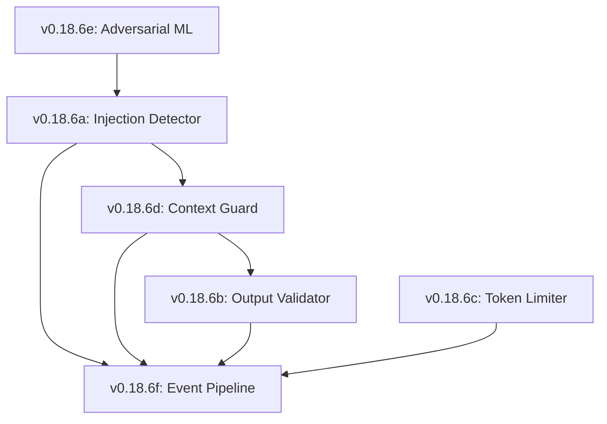

# Lexichord Design Specification Index: v0.18.6 — AI Input/Output Security

**Parent Scope:** [LCS-SBD-v0.18.6-SEC.md](./LCS-SBD-v0.18.6-SEC.md)
**Module:** AI Input/Output Security
**Status:** Design Phase Complete
**Last Updated:** 2026-02-04

---

## Overview

This index catalogs all design specifications for the v0.18.6 AI Input/Output Security module. This release implements critical defenses for AI interactions, protecting against prompt injections, validating output integrity, managing token resources, and ensuring context security.

---

## Design Specification Documents

| Sub-Version | Document | Feature Name | Status |
|-------------|----------|--------------|--------|
| v0.18.6a | [LCS-DS-v0.18.6a-SEC.md](./LCS-DS-v0.18.6a-SEC.md) | Prompt Injection Detection & Mitigation | Complete |
| v0.18.6b | [LCS-DS-v0.18.6b-SEC.md](./LCS-DS-v0.18.6b-SEC.md) | AI Output Validation & Sanitization | Complete |
| v0.18.6c | [LCS-DS-v0.18.6c-SEC.md](./LCS-DS-v0.18.6c-SEC.md) | Token Budget Enforcement & Resource Protection | Complete |
| v0.18.6d | [LCS-DS-v0.18.6d-SEC.md](./LCS-DS-v0.18.6d-SEC.md) | Context Integrity & Retrieval Security | Complete |
| v0.18.6e | [LCS-DS-v0.18.6e-SEC.md](./LCS-DS-v0.18.6e-SEC.md) | Adversarial Input Detection & ML-Based Analysis | Complete |
| v0.18.6f | [LCS-DS-v0.18.6f-SEC.md](./LCS-DS-v0.18.6f-SEC.md) | Security Event Pipeline & Response | Complete |

---

## Dependency Graph

---

## Interfaces & Logic Summary

| Interface | Component | Responsibility |
|-----------|-----------|----------------|
| `IPromptInjectionDetector` | v0.18.6a | Spots "Ignore previous instructions" |
| `IOutputValidator` | v0.18.6b | Scans generated code for CVEs |
| `ITokenBudgetEnforcer` | v0.18.6c | Prevents wallet-drain attacks |
| `IContextIntegrityValidator`| v0.18.6d | Filters poisoned RAG content |
| `IAdversarialDetector` | v0.18.6e | ML-based anomaly detection |
| `ISecurityEventPipeline` | v0.18.6f | Orchestrates auto-blocking |

---

## Implementation Order

1.  **Phase 1 (Core Guardrails):** v0.18.6a (Injection) → v0.18.6b (Output)
2.  **Phase 2 (Content Integrity):** v0.18.6d (Context) → v0.18.6e (Adversarial)
3.  **Phase 3 (Resource & Response):** v0.18.6c (Budget) → v0.18.6f (Pipeline)

---

## Success Metrics

| Metric | Target |
|--------|--------|
| Injection Block Rate | >95% known attack vectors |
| Scan Latency | <50ms per prompt |
| False Positives | <2% legitimate prompts flagged |
| Cost Control | 100% enforcement of hard limits |
