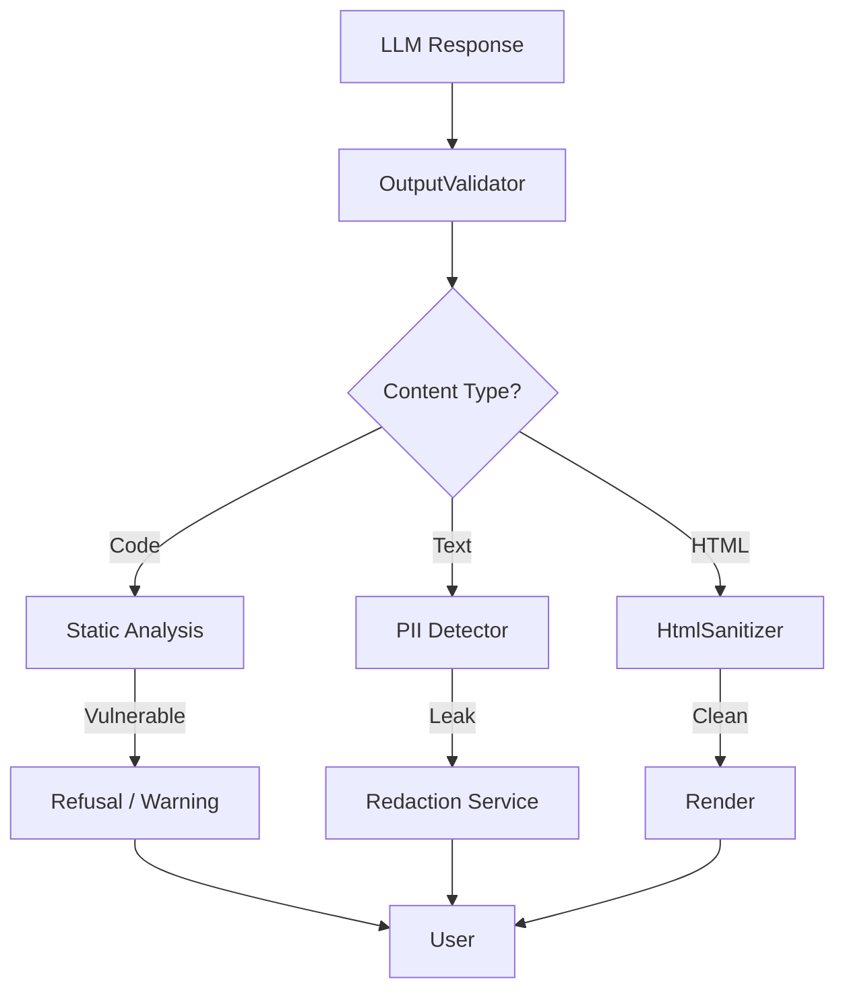

# LCS-DS-v0.18.6b-SEC: Design Specification — AI Output Validation & Sanitization

## 1. Document Control

| Field                 | Value                                        |
| :-------------------- | :------------------------------------------- |
| **Document ID**       | LCS-DS-v0.18.6b-SEC                          |
| **Parent SBD**        | LCS-SBD-v0.18.6-SEC                          |
| **Release Version**   | v0.18.6b                                     |
| **Component Name**    | AI Output Validation & Sanitization          |
| **Document Type**     | Design Specification (DS)                    |
| **Author**            | Gemini Architect                             |
| **Created Date**      | 2026-02-04                                   |
| **Last Updated**      | 2026-02-04                                   |
| **Status**            | DRAFT                                        |
| **Classification**    | Internal — Technical Specification           |

---

## 2. Overview

This document provides the detailed design for **AI Output Validation & Sanitization** (v0.18.6b). Even with safe inputs, AI models can hallucinate harmful commands, leak training data (PII), or generate vulnerable code. This component acts as an egress filter, scrubbing AI responses before they reach the user or execution environment.

---

## 3. Detailed Design

### 3.1. Objective

Ensure AI outputs are safe, compliant, and free of security vulnerabilities or sensitive data leakage.

### 3.2. Scope

-   Define `IOutputValidator`.
-   **Code Scanning**: Static Analysis (SAST) on generated code snippets.
-   **PII/Secret Scanning**: Detect keys/passwords in output.
-   **XSS Prevention**: Sanitize Markdown/HTML rendering.
-   **Command Filtering**: Detect dangerous shell commands (`rm`, `wget`, `curl`).

### 3.3. Detailed Architecture



#### 3.3.1. Code Analysis

-   Use **Roslyn Analyzers** (for C#) and RegEx/TreeSitter (for Python/JS) to detect dangerous patterns:
    -   Process creation (`Process.Start`).
    -   File deletion (`File.Delete`).
    -   Network listening (`TcpListener`).
-   *Decision*: If detected, flag for manual review or wrap in warning block.

### 3.4. Interfaces & Data Models

```csharp
public interface IOutputValidator
{
    Task<OutputValidationResult> ValidateAsync(
        string outputText,
        OutputType expectedType,
        CancellationToken ct = default);
}

public record OutputValidationResult
{
    public bool IsValid { get; init; }
    public string SanitizedOutput { get; init; }
    public IReadOnlyList<SecurityIssue> Issues { get; init; }
}

public record SecurityIssue(
    string IssueType, // "VulnerableCode", "PII", "XSS"
    string Description,
    int StartIndex,
    int Length,
    SeverityLevel Severity);
```

### 3.5. Security Considerations

-   **Hallucinated Packages**: AI often suggests `pip install [malicious-typo-package]`.
    -   *Mitigation*: Verify package names against a known-good list or PyPI popularity check.
-   **Obfuscation**: Malicious actors might ask AI to output Base64 code to evade filters.
    -   *Mitigation*: Heuristic detection of high-entropy strings (blobs).

### 3.6. Performance Considerations

-   **Streaming**: Validation is hard when streaming tokens.
    -   *Strategy*: Accumulate chunks (line buffering) or validate fully at end. For high-security, full buffering is required (latency trade-off).

### 3.7. Testing Strategy

-   **Vulnerable Corpus**: Feed the validator known bad code (`sql injection`, `buffer overflow`) and ensure detection.
-   **PII**: Ensure "My API key is sk-..." is redacted.

---

## 4. Key Artifacts & Deliverables

| Artifact                 | Description                                                              |
| :----------------------- | :----------------------------------------------------------------------- |
| `OutputValidator`        | Core Logic.                                                              |
| `CodeScanner`            | SAST Integration.                                                        |
| `PiiRedactor`            | Regex/NLP based scrubber.                                                |

---

## 5. Acceptance Criteria

-   [ ] **Code Safety**: Detects `rm -rf` and `DROP TABLE`.
-   [ ] **Privacy**: Redacts Credit Cards and API Keys.
-   [ ] **Web Safety**: XSS vectors in Markdown links are stripped.
