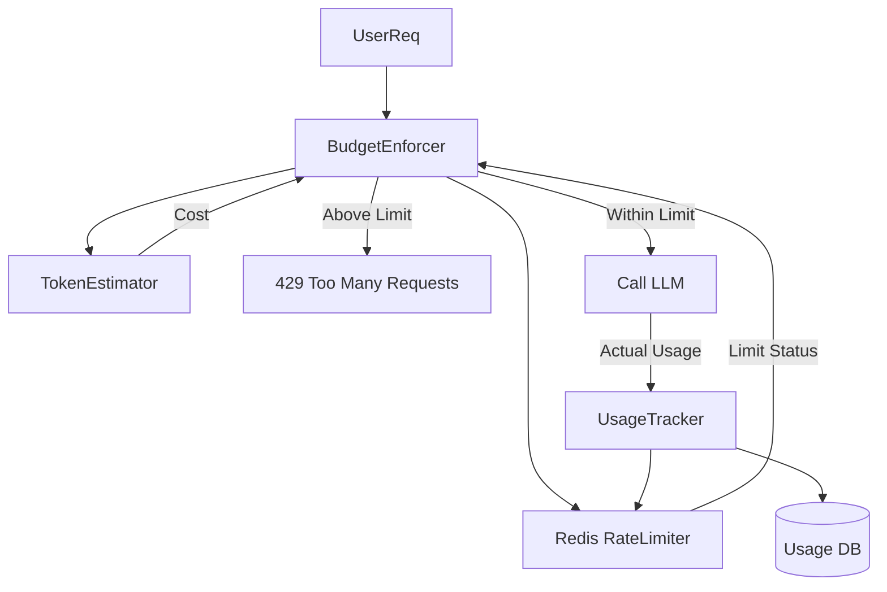

# LCS-DS-v0.18.6c-SEC: Design Specification — Token Budget Enforcement & Resource Protection

## 1. Document Control

| Field                 | Value                                        |
| :-------------------- | :------------------------------------------- |
| **Document ID**       | LCS-DS-v0.18.6c-SEC                          |
| **Parent SBD**        | LCS-SBD-v0.18.6-SEC                          |
| **Release Version**   | v0.18.6c                                     |
| **Component Name**    | Token Budget Enforcement                     |
| **Document Type**     | Design Specification (DS)                    |
| **Author**            | Gemini Architect                             |
| **Created Date**      | 2026-02-04                                   |
| **Last Updated**      | 2026-02-04                                   |
| **Status**            | DRAFT                                        |
| **Classification**    | Internal — Technical Specification           |

---

## 2. Overview

This document provides the detailed design for **Token Budget Enforcement & Resource Protection** (v0.18.6c). It prevents financial exhaustion and Denial of Service (DoS) attacks by strictly managing the consumption of LLM tokens and computational resources per user, session, and workspace.

---

## 3. Detailed Design

### 3.1. Objective

Enforce granular usage limits to ensure fair use, prevent billing spikes, and mitigate "Token Exhaustion" attacks.

### 3.2. Scope

-   Define `ITokenBudgetEnforcer`.
-   **Pre-Flight Check**: Estimate cost before API call.
-   **Rate Limiting**: TPM (Tokens Per Minute) and RPM (Requests Per Minute).
-   **Quotas**: Daily/Monthly hard caps.
-   **User Tiers**: Free, Pro, Enterprise tiered limits.

### 3.3. Detailed Architecture



#### 3.3.1. Estimation Logic

-   To avoid latency of full tokenization, use **Character Heuristic** (CharCount / 3.5) for generic checks, or `TikToken` for precise checks on large payloads.
-   **Safety Margin**: Reserve 10% extra buffer during request execution until actual usage is returned.

### 3.4. Interfaces & Data Models

```csharp
public interface ITokenBudgetEnforcer
{
    Task<BudgetCheckResult> CheckBudgetAsync(
        BudgetRequest request,
        CancellationToken ct = default);

    Task RecordUsageAsync(
        TokenUsage usage,
        CancellationToken ct = default);
}

public record BudgetRequest(Guid UserId, Guid WorkspaceId, int EstimatedTokens);

public record BudgetCheckResult(bool Allowed, string Reason, TimeSpan? RetryAfter);

public record TokenUsage(Guid UserId, string Model, int PromptTokens, int CompletionTokens);
```

### 3.5. Security Considerations

-   **Race Conditions**: "Double Spend" attacks where parallel requests bypass limits.
    -   *Mitigation*: Use Atomic Increment (Redis `INCR`) / Lua scripts for check-and-deduct logic.

### 3.6. Performance Considerations

-   **Latency**: Budget check must be <5ms. Redis is mandatory.
-   **Async Recording**: Actual DB persistence (PostgreSQL) should happen asynchronously (write-behind) to not block the response.

### 3.7. Testing Strategy

-   **Simulated Load**: Fire 100 requests in parallel to verify rate limit kicks in exactly at limit.
-   **Quota Reset**: Verify usage resets correctly at billing cycle boundaries.

---

## 4. Key Artifacts & Deliverables

| Artifact                 | Description                                                              |
| :----------------------- | :----------------------------------------------------------------------- |
| `TokenBudgetEnforcer`    | Core Logic.                                                              |
| `RedisRateLimiter`       | Distributed counter.                                                     |
| `TokenEstimator`         | Helper utility.                                                          |

---

## 5. Acceptance Criteria

-   [ ] **Rate Limit**: Enforces TPM/RPM accurately.
-   [ ] **Billing Cap**: Hard stop when monthly budget reached.
-   [ ] **Latency**: Minimal overhead on requests.
