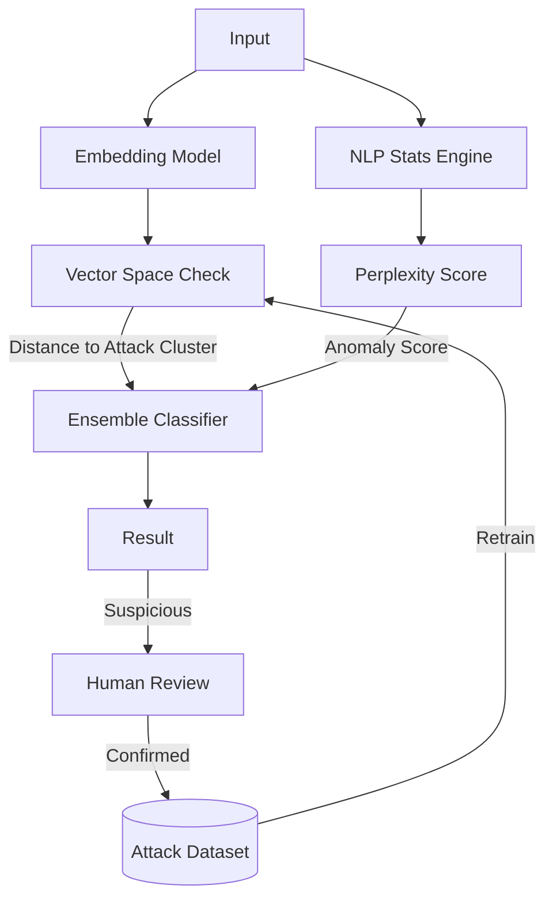

# LCS-DS-v0.18.6e-SEC: Design Specification — Adversarial Input Detection & ML-Based Analysis

## 1. Document Control

| Field                 | Value                                        |
| :-------------------- | :------------------------------------------- |
| **Document ID**       | LCS-DS-v0.18.6e-SEC                          |
| **Parent SBD**        | LCS-SBD-v0.18.6-SEC                          |
| **Release Version**   | v0.18.6e                                     |
| **Component Name**    | Adversarial Input Detection & ML-Based Analysis |
| **Document Type**     | Design Specification (DS)                    |
| **Author**            | Gemini Architect                             |
| **Created Date**      | 2026-02-04                                   |
| **Last Updated**      | 2026-02-04                                   |
| **Status**            | DRAFT                                        |
| **Classification**    | Internal — Technical Specification           |

---

## 2. Overview

This document provides the detailed design for **Adversarial Input Detection & ML-Based Analysis** (v0.18.6e). This advanced security layer uses Machine Learning to detect sophisticated attacks that bypass static rules, such as obfuscated injection attempts ("Jailbreaks") or high-perplexity inputs designed to confuse the model.

---

## 3. Detailed Design

### 3.1. Objective

Deploy ML-based defenses to identify novel and obfuscated adversarial attacks against the AI system.

### 3.2. Scope

-   Define `IAdversarialDetector`.
-   **Embedding Analysis**: Detect inputs that are semantically close to known attack clusters.
-   **Perplexity/Entropy Analysis**: Detect gibberish or high-entropy inputs (often used in fuzzing/token manipulation).
-   **Ensemble Model**: Combine multiple signals (Heuristic + ML + Stats) for a final verdict.
-   **Continuous Learning**: Mechanism to flag new attacks and retrain models.

### 3.3. Detailed Architecture



#### 3.3.1. Vector-Based Detection

-   Maintain a vector database of **Known Attack Prompts**.
-   When new input comes, compute its embedding.
-   Calculate Cosine Similarity to nearest attack neighbors.
-   If Similarity > Threshold (e.g., 0.85), flag as adversarial.

### 3.4. Interfaces & Data Models

```csharp
public interface IAdversarialDetector
{
    Task<AdversarialAnalysisResult> AnalyzeAsync(
        string input,
        AdversarialContext context,
        CancellationToken ct = default);
}

public interface IModelManager
{
    Task UpdateAttackVectorsAsync(IEnumerable<string> newAttacks, CancellationToken ct = default);
}

public record AdversarialAnalysisResult(
    bool IsAdversarial,
    double Confidence,
    string DetectionType, // "Embedding", "Perplexity", "Model"
    IReadOnlyDictionary<string, double> Signals);
```

### 3.5. Security Considerations

-   **Model Poisoning**: If attackers can influence the training set (e.g., by marking attacks as "Safe"), they can bypass detection.
    -   *Mitigation*: Strict review of the feedback loop data.
-   **Adversarial Examples**: Attacks specifically designed to fool the detector.
    -   *Mitigation*: Retrain frequently; use ensemble methods (don't rely on just one model).

### 3.6. Performance Considerations

-   **Inference Latency**: Embeddings + Classification take time (50-200ms).
    -   *Strategy*: Run in parallel with LLM generation? No, that's risky. Run *before*. Use small models (DistilBERT, MiniLM).

### 3.7. Testing Strategy

-   **Jailbreak Datasets**: Test against standard datasets (DAN, Mongo Tom, etc.).
-   **Fuzzing**: Generate random noise/perturbations and ensure robust handling.

---

## 4. Key Artifacts & Deliverables

| Artifact                 | Description                                                              |
| :----------------------- | :----------------------------------------------------------------------- |
| `AdversarialDetector`    | Core Logic.                                                              |
| `EmbeddingService`       | Wrapper for ONNX/Torch embedding model.                                  |
| `AttackVectorDB`         | Qdrant/Milvus collection for attack signatures.                          |

---

## 5. Acceptance Criteria

-   [ ] **Detection Rate**: >80% for obfuscated attacks.
-   [ ] **False Positives**: <5%.
-   [ ] **Feedback Loop**: New attacks can be added to the registry easily.
