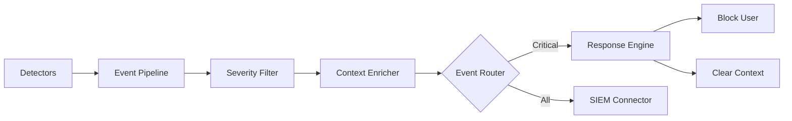

# LCS-DS-v0.18.6f-SEC: Design Specification — Security Event Pipeline & Response

## 1. Document Control

| Field                 | Value                                        |
| :-------------------- | :------------------------------------------- |
| **Document ID**       | LCS-DS-v0.18.6f-SEC                          |
| **Parent SBD**        | LCS-SBD-v0.18.6-SEC                          |
| **Release Version**   | v0.18.6f                                     |
| **Component Name**    | Security Event Pipeline & Response           |
| **Document Type**     | Design Specification (DS)                    |
| **Author**            | Gemini Architect                             |
| **Created Date**      | 2026-02-04                                   |
| **Last Updated**      | 2026-02-04                                   |
| **Status**            | DRAFT                                        |
| **Classification**    | Internal — Technical Specification           |

---

## 2. Overview

This document provides the detailed design for the **Security Event Pipeline & Response** system (v0.18.6f). This component bridges the gap between detection (AI Models, Parsers) and action (Blocking, Alerting). It processes high-velocity security events and orchestrates automated responses or escalations to SIEM systems.

---

## 3. Detailed Design

### 3.1. Objective

Provide a unified pipeline for ingesting, filtering, and acting upon AI security events in real-time.

### 3.2. Scope

-   Define `IAISecurityEventPipeline`.
-   **Automated Response**: Logic to "Block User", "Kill Session", "Throttle".
-   **SIEM Integration**: Forward events to Splunk, Datadog, or Azure Sentinel.
-   **Aggregated Alerts**: Combine multiple low-severity events into high-severity incidents.

### 3.3. Detailed Architecture



#### 3.3.1. Event Processing

-   **Async Processing**: Use `System.Threading.Channels` or MediatR to decouple detection from response.
-   **Enrichment**: Add `UserId`, `SessionId`, `IPAddress` to every event before forwarding.

### 3.4. Interfaces & Data Models

```csharp
public interface IAISecurityEventPipeline
{
    Task PublishAsync(AISecurityEvent evt, CancellationToken ct = default);
    IObservable<AISecurityEvent> Subscribe(SecuritySeverity minSeverity);
}

public interface ISecurityResponseManager
{
    Task ExecuteResponseAsync(AISecurityEvent evt, ResponseAction action, CancellationToken ct = default);
}

public interface ISiemIntegration
{
    Task ForwardEventAsync(AISecurityEvent evt, CancellationToken ct = default);
}

public record AISecurityEvent(
    string EventType,
    SecuritySeverity Severity,
    string Description,
    Dictionary<string, object> Metadata);
```

### 3.5. Security Considerations

-   **Pipeline Flooding**: An attacker triggering many alerts could flood the SIEM.
    -   *Mitigation*: Implement aggressive aggregation and throttling before the SIEM connector.
-   **Audit Integrity**: Ensure successful transmission to SIEM is verifiable (ACKs).

### 3.6. Performance Considerations

-   **Non-Blocking**: `PublishAsync` must be fast.
-   **Throughput**: Handle burst of detection events (e.g. 1000/sec).

### 3.7. Testing Strategy

-   **End-to-End**: Trigger an injection -> assert Event Published -> assert SIEM mock received it -> assert User Blocked.

---

## 4. Key Artifacts & Deliverables

| Artifact                 | Description                                                              |
| :----------------------- | :----------------------------------------------------------------------- |
| `SecurityEventPipeline`  | Core Message Bus.                                                        |
| `ResponseEngine`         | Action Executor.                                                         |
| `SplunkConnector`        | Example SIEM integration.                                                |

---

## 5. Acceptance Criteria

-   [ ] **Throughput**: Pipeline handles high load without dropping critical events.
-   [ ] **Response**: "Block" action takes effect immediately.
-   [ ] **Integration**: Events appear in SIEM (simulated).
