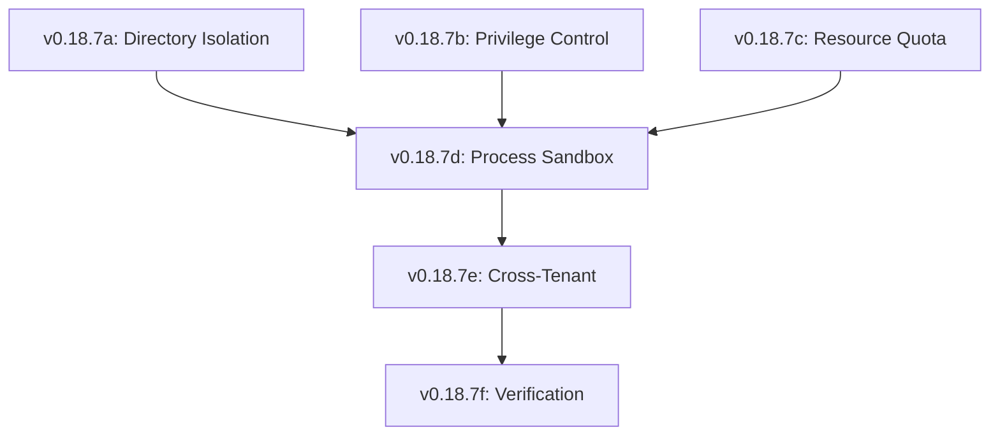

# Lexichord Design Specification Index: v0.18.7 — Workspace Isolation & Sandboxing

**Parent Scope:** [LCS-SBD-v0.18.7-SEC.md](./LCS-SBD-v0.18.7-SEC.md)
**Module:** Workspace Isolation
**Status:** Design Phase Complete
**Last Updated:** 2026-02-04

---

## Overview

This index catalogs all design specifications for the v0.18.7 Workspace Isolation module. This release implements critical defense-in-depth layers to contain AI operations within secure boundaries, enforcing file system isolation, privilege restrictions, and resource quotas.

---

## Design Specification Documents

| Sub-Version | Document | Feature Name | Status |
|-------------|----------|--------------|--------|
| v0.18.7a | [LCS-DS-v0.18.7a-SEC.md](./LCS-DS-v0.18.7a-SEC.md) | Working Directory Isolation | Complete |
| v0.18.7b | [LCS-DS-v0.18.7b-SEC.md](./LCS-DS-v0.18.7b-SEC.md) | Privilege Containment | Complete |
| v0.18.7c | [LCS-DS-v0.18.7c-SEC.md](./LCS-DS-v0.18.7c-SEC.md) | Resource Quota Management | Complete |
| v0.18.7d | [LCS-DS-v0.18.7d-SEC.md](./LCS-DS-v0.18.7d-SEC.md) | Process Sandboxing | Complete |
| v0.18.7e | [LCS-DS-v0.18.7e-SEC.md](./LCS-DS-v0.18.7e-SEC.md) | Cross-Tenant Security | Complete |
| v0.18.7f | [LCS-DS-v0.18.7f-SEC.md](./LCS-DS-v0.18.7f-SEC.md) | Isolation Verification & Testing | Complete |

---

## Dependency Graph

---

## Interfaces & Logic Summary

| Interface | Component | Responsibility |
|-----------|-----------|----------------|
| `IWorkspaceIsolationManager` | v0.18.7a | Prevents `../` traversal |
| `IPrivilegeManager` | v0.18.7b | Drops root/admin caps |
| `IResourceQuotaManager` | v0.18.7c | Enforces CPU/RAM limits |
| `IProcessSandbox` | v0.18.7d | Spawns secure subprocesses |
| `ITenantIsolationEnforcer` | v0.18.7e | Ensures data separation |
| `IIsolationVerifier` | v0.18.7f | Runs escape penetration tests |

---

## Implementation Order

1.  **Phase 1 (Boundaries):** v0.18.7a (FS) → v0.18.7b (Privileges)
2.  **Phase 2 (Containment):** v0.18.7c (Quotas) → v0.18.7d (Sandbox)
3.  **Phase 3 (Integrity):** v0.18.7e (Multi-tenant) → v0.18.7f (Verification)

---

## Success Metrics

| Metric | Target |
|--------|--------|
| FS Escape Rate | 0% via Symlinks/Traversal |
| Privilege Escalation | 0% possible via capabilities |
| CPU Limit Accuracy | +/- 5% of target |
| Verification Coverage | 100% of defined attack vectors |
