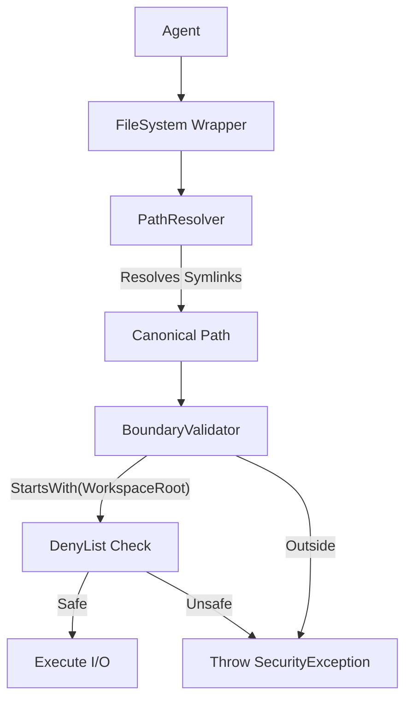

# LCS-DS-v0.18.7a-SEC: Design Specification — Working Directory Isolation

## 1. Document Control

| Field                 | Value                                        |
| :-------------------- | :------------------------------------------- |
| **Document ID**       | LCS-DS-v0.18.7a-SEC                          |
| **Parent SBD**        | LCS-SBD-v0.18.7-SEC                          |
| **Release Version**   | v0.18.7a                                     |
| **Component Name**    | Working Directory Isolation                  |
| **Document Type**     | Design Specification (DS)                    |
| **Author**            | Gemini Architect                             |
| **Created Date**      | 2026-02-04                                   |
| **Last Updated**      | 2026-02-04                                   |
| **Status**            | DRAFT                                        |
| **Classification**    | Internal — Technical Specification           |

---

## 2. Overview

This document provides the detailed design for **Working Directory Isolation** (v0.18.7a). It ensures that file system operations performed by the AI agent are strictly confined to a specific designated workspace directory, preventing unauthorized access to system files or other users' data.

---

## 3. Detailed Design

### 3.1. Objective

Prevent "Path Traversal" and "Symlink" attacks that would allow an agent to read or write files outside its assigned sandbox.

### 3.2. Scope

-   Define `IWorkspaceIsolationManager`.
-   **Path Canonicalization**: Resolve `..`, `~`, and symbolic links to absolute paths before validation.
-   **Enforcement**: All file I/O operations must pass the `ValidatePath` check.
-   **Sensitive Path Blocking**: Explicit deny list for `.env`, `.ssh`, `.git`.

### 3.3. Detailed Architecture



#### 3.3.1. Symlink Policy

-   **Policy**: Symlinks allowed *internally* (pointing to file inside workspace). Symlinks pointing *outside* are treated as access violations.
-   **Resolution**: Use `Directory.ResolveLinkTarget` (Core 6+) or `realpath` syscall to determine final destination.

### 3.4. Interfaces & Data Models

```csharp
public interface IWorkspaceIsolationManager
{
    Task<PathValidationResult> ValidatePathAsync(
        string rawPath,
        WorkspaceContext context,
        FileOperation op,
        CancellationToken ct = default);
}

public record PathValidationResult(
    bool Allowed, 
    string AbsolutePath,
    string? ViolationReason);
```

### 3.5. Security Considerations

-   **TOCTOU (Time-of-Check Time-of-Use)**: An attacker might swap a file with a symlink between validation and write.
    -   *Mitigation*: Open file handle with `O_NOFOLLOW` where possible, or rely on OS-level user permissions as a backup (run agent as non-root user).

### 3.6. Performance Considerations

-   **Canonicalization**: `GetFullPath` is fast. Resolving symlinks involves disk I/O.
    -   *Optimization*: Cache known safe paths? No, risky due to TOCTOU. Must validity check on every operation.

### 3.7. Testing Strategy

-   **Attack Vectors**: Try `../../etc/passwd`. Try `ln -s /etc/passwd link`. Try `foo/bar/../../baz`.
-   **Unicode**: Ensure Unicode normalization doesn't bypass checks.

---

## 4. Key Artifacts & Deliverables

| Artifact                 | Description                                                              |
| :----------------------- | :----------------------------------------------------------------------- |
| `WorkspaceManager`       | Core Logic.                                                              |
| `PathValidator`          | Canonicalization logic.                                                  |
| `SafeFileStream`         | Wrapper class.                                                           |

---

## 5. Acceptance Criteria

-   [ ] **Containment**: Access to `/tmp` or `/etc` blocked.
-   [ ] **Resolution**: Relative paths resolve correctly to workspace.
-   [ ] **Symlinks**: External symlinks rejected.
