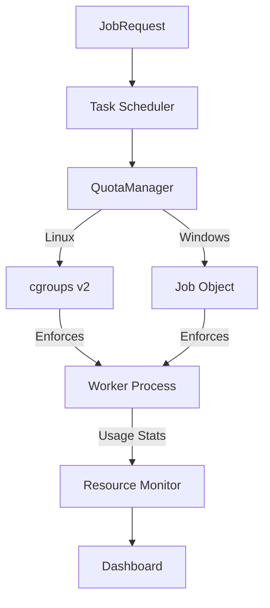

# LCS-DS-v0.18.7c-SEC: Design Specification — Resource Quota Management

## 1. Document Control

| Field                 | Value                                        |
| :-------------------- | :------------------------------------------- |
| **Document ID**       | LCS-DS-v0.18.7c-SEC                          |
| **Parent SBD**        | LCS-SBD-v0.18.7-SEC                          |
| **Release Version**   | v0.18.7c                                     |
| **Component Name**    | Resource Quota Management                    |
| **Document Type**     | Design Specification (DS)                    |
| **Author**            | Gemini Architect                             |
| **Created Date**      | 2026-02-04                                   |
| **Last Updated**      | 2026-02-04                                   |
| **Status**            | DRAFT                                        |
| **Classification**    | Internal — Technical Specification           |

---

## 2. Overview

This document provides the detailed design for **Resource Quota Management** (v0.18.7c). To prevent "noisy neighbor" problems and resource exhaustion DoS attacks, this component utilizes operating system primitives to set hard limits on CPU, Memory, Disk I/O, and Network bandwidth for AI worker processes.

---

## 3. Detailed Design

### 3.1. Objective

Ensure no single AI task can destabilize the host system or starve other users of resources.

### 3.2. Scope

-   Define `IResourceQuotaManager`.
-   **CPU Limiting**: Hard cap (e.g., 2 cores).
-   **Memory Limiting**: Hard cap (e.g., 512MB).
-   **Disk Quota**: Limit temporary file size.
-   **Process Limit**: Prevent fork bombs (pids.max).

### 3.3. Detailed Architecture



#### 3.3.1. OS Implementation

-   **Linux**: Create a `cgroup` at `/sys/fs/cgroup/lexichord/job-{id}`. Write limits to `memory.max`, `cpu.max`, `pids.max`. Move worker PID to `cgroup.procs`.
-   **Windows**: Create `CreateJobObject`, set `JOBOBJECT_CPU_RATE_CONTROL_INFORMATION`, `JOBOBJECT_EXTENDED_LIMIT_INFORMATION` (ProcessMemoryLimit).

### 3.4. Interfaces & Data Models

```csharp
public interface IResourceQuotaManager
{
    Task AssignQuotasAsync(
        int processId,
        ResourceQuotas quotas,
        CancellationToken ct = default);
        
    Task<ResourceUsage> GetCurrentUsageAsync(int processId);
}

public record ResourceQuotas
{
    public long MaxMemoryBytes { get; init; }
    public double CpuCores { get; init; }
    public int MaxProcesses { get; init; }
}
```

### 3.5. Security Considerations

-   **OOM Killer**: If limits are hit, the OS will kill the process. We must handle this gracefully (Output: "Memory Limit Exceeded") instead of crashing the whole job silently.

### 3.6. Performance Considerations

-   **Overhead**: Cgroups have negligible overhead.
-   **Monitoring**: Polling usage files too frequently adds I/O load. Poll at 1s intervals.

### 3.7. Testing Strategy

-   **CPU Burner**: Run a loop calculating primes. Ensure CPU usage clips at X%.
-   **Fork Bomb**: Run `while(1) fork()`. Ensure strict process max prevents system freeze.

---

## 4. Key Artifacts & Deliverables

| Artifact                 | Description                                                              |
| :----------------------- | :----------------------------------------------------------------------- |
| `QuotaManager`           | Platform-agnostic interface.                                             |
| `CGroupController`       | Linux impl.                                                              |
| `JobObjectController`    | Windows impl.                                                            |

---

## 5. Acceptance Criteria

-   [ ] **CPU**: Cap respected within 5% variance.
-   [ ] **Memory**: Process killed instantly when exceeding cap.
-   [ ] **PIDs**: Fork bombs contained.
