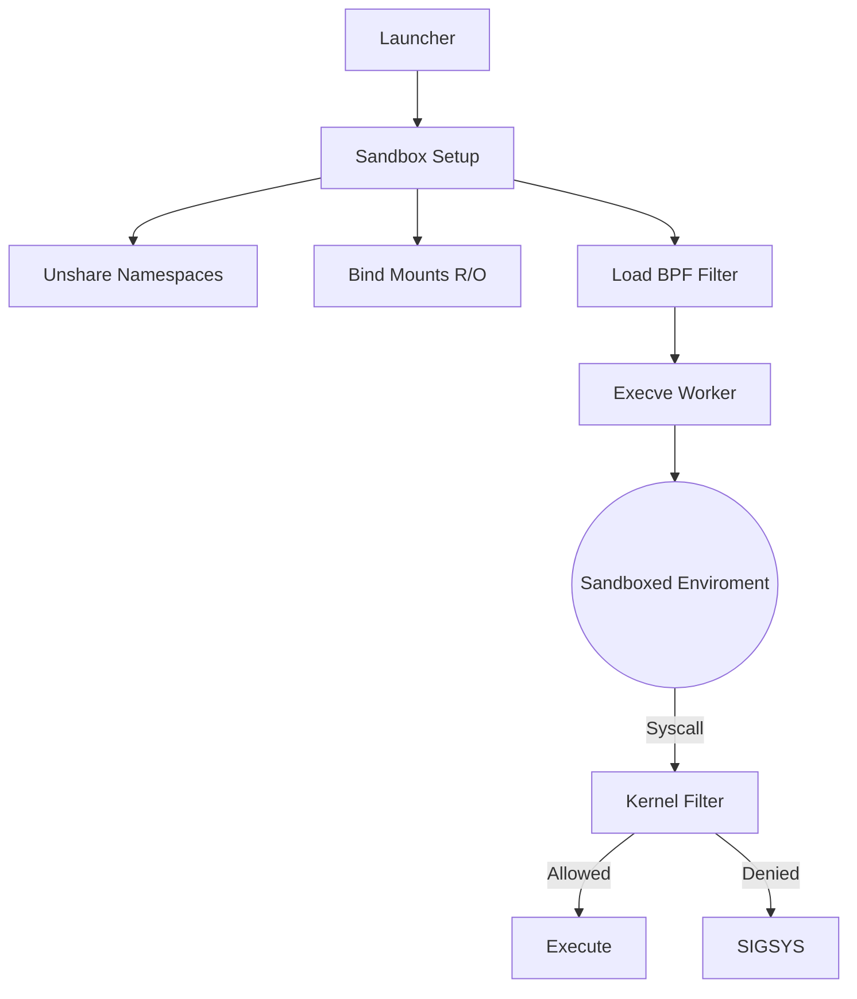

# LCS-DS-v0.18.7d-SEC: Design Specification — Process Sandboxing & Isolation

## 1. Document Control

| Field                 | Value                                        |
| :-------------------- | :------------------------------------------- |
| **Document ID**       | LCS-DS-v0.18.7d-SEC                          |
| **Parent SBD**        | LCS-SBD-v0.18.7-SEC                          |
| **Release Version**   | v0.18.7d                                     |
| **Component Name**    | Process Sandboxing & Isolation               |
| **Document Type**     | Design Specification (DS)                    |
| **Author**            | Gemini Architect                             |
| **Created Date**      | 2026-02-04                                   |
| **Last Updated**      | 2026-02-04                                   |
| **Status**            | DRAFT                                        |
| **Classification**    | Internal — Technical Specification           |

---

## 2. Overview

This document provides the detailed design for **Process Sandboxing & Isolation** (v0.18.7d). While v0.18.7b (Privileges) handles user permissions, this component uses Linux Namespaces and Seccomp filters to create a container-like "Sandbox" where the process is invisible to the rest of the system and has a restricted view of the kernel surface area.

---

## 3. Detailed Design

### 3.1. Objective

Isolate the process view so it cannot inspect, signal, or attack other processes, and restrict kernel calls to a "Safe Set".

### 3.2. Scope

-   Define `IProcessSandbox`.
-   **Namespaces**: NEWPID (Process isolation), NEWNS (Mount isolation), NEWNET (Network isolation).
-   **Seccomp BPF**: Audit and block dangerous syscalls (`clone`, `mount`, `keyctl`).
-   **Chroot/PivotRoot**: Change root filesystem to a minimal base (Alpine-like) if needed.

### 3.3. Detailed Architecture



#### 3.3.1. Seccomp Policy

-   **Allowed**: `read`, `write`, `openat`, `close`, `fstat`, `mmap`, `brk`, `futex`, `exit_group`.
-   **Denied**: `socket` (if net disabled), `fork` (if children disabled), `ptrace`, `unshare`, `mount`.

### 3.4. Interfaces & Data Models

```csharp
public interface IProcessSandbox
{
    Task<SandboxedProcessResult> ExecuteAsync(
        ProcessExecutionRequest request,
        SandboxConfiguration config,
        CancellationToken ct = default);
}

public record SandboxConfiguration(
    bool NetworkEnabled,
    bool FilesystemReadOnly,
    SeccompProfile Profile);
```

### 3.5. Security Considerations

-   **Escape**: Namespace escapes (like `docker escape`) usually rely on `CAP_SYS_ADMIN`. Since v0.18.7b drops this, escapes are extremely difficult.
-   **Side Channels**: CPU timing attacks (Spectre) are hard to block with software sandboxing. Resource Quotas help mitigate by limiting high-res timers if possible.

### 3.6. Performance Considerations

-   **Startup**: `unshare()` is fast. Loading BPF filters is fast.
-   **Runtime**: Seccomp BPF adds a tiny overhead per syscall (nanoseconds). Negligible for non-I/O heavy workloads.

### 3.7. Testing Strategy

-   **Syscall Fuzzing**: Try to call `reboot()`. Should get killed.
-   **Isolation**: `ls /proc` should be empty or only show self.

---

## 4. Key Artifacts & Deliverables

| Artifact                 | Description                                                              |
| :----------------------- | :----------------------------------------------------------------------- |
| `SandboxExecutor`        | Main wrapper.                                                            |
| `BpfGenerator`           | Creates seccomp filters.                                                 |
| `NamespaceWrapper`       | P/Invoke `unshare`, `mount`.                                             |

---

## 5. Acceptance Criteria

-   [ ] **Invisibility**: Cannot see other PIDs.
-   [ ] **Kernel Surface**: Forbidden syscalls result in SIGSYS.
-   [ ] **Stability**: Valid programs run without crashing.
