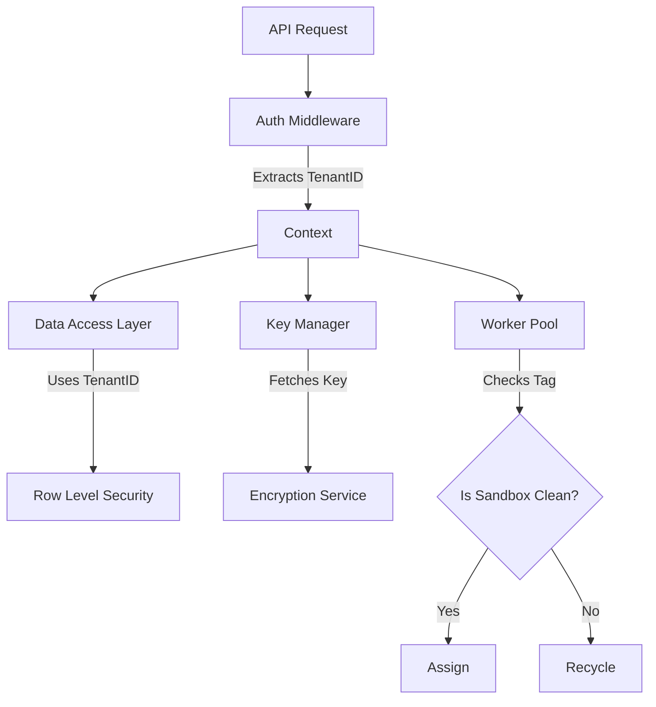

# LCS-DS-v0.18.7e-SEC: Design Specification — Cross-Tenant Security

## 1. Document Control

| Field                 | Value                                        |
| :-------------------- | :------------------------------------------- |
| **Document ID**       | LCS-DS-v0.18.7e-SEC                          |
| **Parent SBD**        | LCS-SBD-v0.18.7-SEC                          |
| **Release Version**   | v0.18.7e                                     |
| **Component Name**    | Cross-Tenant Security                        |
| **Document Type**     | Design Specification (DS)                    |
| **Author**            | Gemini Architect                             |
| **Created Date**      | 2026-02-04                                   |
| **Last Updated**      | 2026-02-04                                   |
| **Status**            | DRAFT                                        |
| **Classification**    | Internal — Technical Specification           |

---

## 2. Overview

This document provides the detailed design for **Cross-Tenant Security** (v0.18.7e). For multi-tenant deployments, strict isolation ensures that no user can access data, processes, or artifacts belonging to another organization, even if they share the same physical infrastructure.

---

## 3. Detailed Design

### 3.1. Objective

Guarantee cryptographic and logical separation of tenant data to prevent "noisy neighbor" leakage and unauthorized access.

### 3.2. Scope

-   Define `ITenantIsolationManager`.
-   **Data Isolation**: Row-level security (RLS) in DB. Prefixed keys in Redis (`tenant:123:key`).
-   **Encryption**: Per-tenant encryption keys (DEK) wrapped by a Master Key (KEK).
-   **Process Isolation**: Ensure worker sandboxes are tagged with Tenant ID and cleaned thoroughly between re-use (or never reused).

### 3.3. Detailed Architecture



#### 3.3.1. Encryption Strategy

-   **Key Hierarchy**:
    -   Master Key (KMS).
    -   Tenant Key (Encrypted by Master).
    -   Data (Encrypted by Tenant Key).
-   This allows "Crypto-shredding" a tenant by deleting their key.

### 3.4. Interfaces & Data Models

```csharp
public interface ITenantIsolationManager
{
    Task<TenantContext> GetContextAsync(Guid tenantId);
    Task<byte[]> GetTenantKeyAsync(Guid tenantId);
    Task CryptoShredTenantAsync(Guid tenantId);
}

public interface ITenantAwareRepository<T>
{
    Task<T> GetAsync(Guid id, Guid tenantId); // Force TenantId param
}
```

### 3.5. Security Considerations

-   **Cache Leakage**: If Redis cache isn't strictly namespaced, Tenant A could read Tenant B's cached profile.
    -   *Mitigation*: Middleware automatically prefixes all cache keys with `{TenantId}:`.
-   **Log Leakage**: Logs shouldn't contain PII, but if they do, ensure `TenantId` is attached for filtering control.

### 3.6. Performance Considerations

-   **Key Management**: Decrypting tenant keys on every request is slow.
    -   *Strategy*: Cache decrypted Tenant Keys in memory (protected, short TTL: 5 min).

### 3.7. Testing Strategy

-   **Cross-Access**: User A calls `GET /api/resource/{UserB_ResourceID}`. Must return 404 or 403.
-   **Shredding**: Delete key, ensure data is unreadable.

---

## 4. Key Artifacts & Deliverables

| Artifact                 | Description                                                              |
| :----------------------- | :----------------------------------------------------------------------- |
| `TenantContextAccessor`  | Middleware.                                                              |
| `KeyManager`             | KMS Wrapper.                                                             |
| `TenantAwareRepo`        | Base class for EF Core.                                                  |

---

## 5. Acceptance Criteria

-   [ ] **Strictness**: No API returns data for wrong tenant.
-   [ ] **Encryption**: DB dump shows different ciphertext for identical plaintext across tenants.
-   [ ] **Shredding**: Data permanently inaccessible after deletion.
