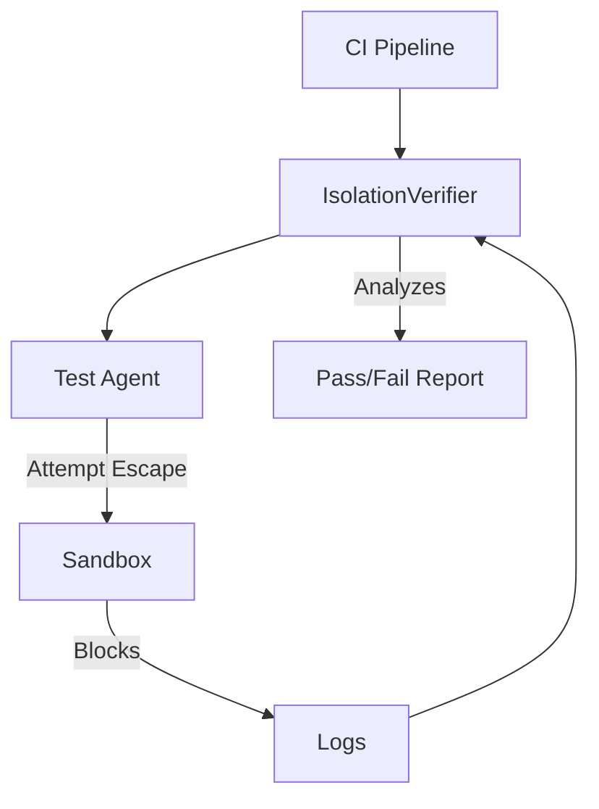

# LCS-DS-v0.18.7f-SEC: Design Specification — Isolation Verification & Testing

## 1. Document Control

| Field                 | Value                                        |
| :-------------------- | :------------------------------------------- |
| **Document ID**       | LCS-DS-v0.18.7f-SEC                          |
| **Parent SBD**        | LCS-SBD-v0.18.7-SEC                          |
| **Release Version**   | v0.18.7f                                     |
| **Component Name**    | Isolation Verification & Testing             |
| **Document Type**     | Design Specification (DS)                    |
| **Author**            | Gemini Architect                             |
| **Created Date**      | 2026-02-04                                   |
| **Last Updated**      | 2026-02-04                                   |
| **Status**            | DRAFT                                        |
| **Classification**    | Internal — Technical Specification           |

---

## 2. Overview

This document provides the detailed design for **Isolation Verification & Testing** (v0.18.7f). It defines a comprehensive automated testing framework ("Compliance Suite") that continuously validates the efficacy of workspace isolation, quotas, and privilege boundaries.

---

## 3. Detailed Design

### 3.1. Objective

Systematically attempt to break out of the sandbox to prove safety controls are working.

### 3.2. Scope

-   Define `IIsolationVerifier`.
-   **Filesystem Probe**: Scanners trying to find "world readable" files.
-   **Network Probe**: Port scanners trying to reach prohibited hosts.
-   **Quota Stress**: Stress tests (CPU burn, Memory fill) to verify limits.
-   **Privilege Probe**: Attempting `sudo`, `mount`, `insmod`.

### 3.3. Detailed Architecture



#### 3.3.1. Test Cases

1.  **"Houdini" Test**: Try to traverse `../../` to root.
2.  **"Noise" Test**: Try to consume 100% CPU on host.
3.  **"Spy" Test**: Try to list PIDs of other containers.
4.  **"Root" Test**: Try to write to `/usr/bin`.

### 3.4. Interfaces & Data Models

```csharp
public interface IIsolationVerifier
{
    Task<VerificationReport> RunComplianceSuiteAsync(CancellationToken ct = default);
}

public record VerificationReport(
    bool Passed,
    int TestsRun,
    int TestsFailed,
    IReadOnlyList<TestResult> Details);
    
public record TestResult(string TestName, bool Success, string Output);
```

### 3.5. Security Considerations

-   **Test Containment**: Ensure the *test itself* doesn't cause damage if it accidentally succeeds (e.g., don't actually delete `/etc/passwd`, just try to `open` it for writing).

### 3.6. Performance Considerations

-   **Runtime**: Full suite might take minutes. Run in "Nightly" CI, not on every commit.

### 3.7. Testing Strategy

-   **Self-Validation**: The verifier *is* the test.

---

## 4. Key Artifacts & Deliverables

| Artifact                 | Description                                                              |
| :----------------------- | :----------------------------------------------------------------------- |
| `IsolationComplianceSuite`| NUnit/xUnit suite.                                                      |
| `ProbeBinaries`          | Small C binaries for low-level probing.                                  |

---

## 5. Acceptance Criteria

-   [ ] **Coverage**: Covers FS, Net, Proc, Mem, Disk.
-   [ ] **Reporting**: Generates JUnit XML / HTML report.
-   [ ] **Failure**: Any successful breach fails the build.
