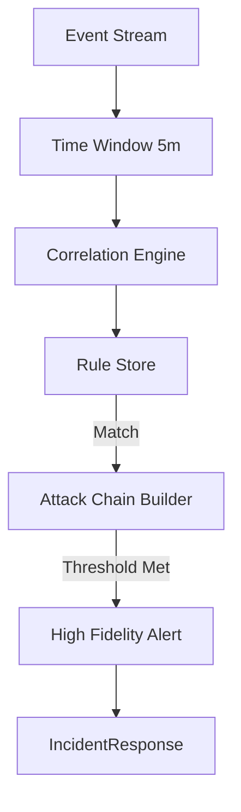

# LCS-DS-v0.18.8a-SEC: Design Specification — Attack Pattern Detection Engine

## 1. Document Control

| Field                 | Value                                        |
| :-------------------- | :------------------------------------------- |
| **Document ID**       | LCS-DS-v0.18.8a-SEC                          |
| **Parent SBD**        | LCS-SBD-v0.18.8-SEC                          |
| **Release Version**   | v0.18.8a                                     |
| **Component Name**    | Attack Pattern Detection Engine              |
| **Document Type**     | Design Specification (DS)                    |
| **Author**            | Gemini Architect                             |
| **Created Date**      | 2026-02-04                                   |
| **Last Updated**      | 2026-02-04                                   |
| **Status**            | DRAFT                                        |
| **Classification**    | Internal — Technical Specification           |

---

## 2. Overview

This document provides the detailed design for **Attack Pattern Detection Engine** (v0.18.8a). Moving beyond atomic event logging, this component implements correlation logic to identify sophisticated Attack Chains mapped to the MITRE ATT&CK framework, such as "Reconnaissance -> Injection -> Exfiltration".

---

## 3. Detailed Design

### 3.1. Objective

Identify complex, multi-stage attacks in real-time by correlating seemingly unrelated security events.

### 3.2. Scope

-   Define `IAttackPatternDetector`.
-   **Correlation Engine**: Stateful processing (CEP - Complex Event Processing) using `System.Reactive` or Time-Windowed Buffers.
-   **Rule Engine**: Support Sigma-like rules for signature detection.
-   **MITRE Mapping**: Tag every alert with T-Codes (e.g., T1059.001).

### 3.3. Detailed Architecture



#### 3.3.1. Detection Logic

-   **Sequence Detection**: `Event(A) -> FollowedBy(B) -> Within(10min)`.
-   **Example**: `5x AuthFail` + `1x PromptInjection` = Brute Force & Injection Attempt (High Severity).

### 3.4. Interfaces & Data Models

```csharp
public interface IAttackPatternDetector
{
    Task<AttackDetectionResult> DetectAsync(
        IEnumerable<SecurityEvent> events,
        CancellationToken ct = default);
}

public record AttackDetectionResult(
    bool IsAttack,
    string AttackChainId,
    float Confidence,
    string MitreTactic);
```

### 3.5. Security Considerations

-   **Noise**: If rules are too loose, "Alert Fatigue" sets in. Primary goal is High Fidelity.
-   **Evasion**: Attackers may spread actions over days ("Low and Slow").
    -   *Mitigation*: Use long-term trend analysis (Analytics) alongside real-time correlation.

### 3.6. Performance Considerations

-   **State**: Maintaining state for thousands of users is memory intensive.
    -   *Strategy*: Use Redis/KeyDB for state persistence of active windows.

### 3.7. Testing Strategy

-   **Red Team Simulation**: Replay logs from a known pentest and ensure the engine triggers an alert.

---

## 4. Key Artifacts & Deliverables

| Artifact                 | Description                                                              |
| :----------------------- | :----------------------------------------------------------------------- |
| `PatternDetector`        | Core Logic.                                                              |
| `MitreRules.yml`         | Default ruleset.                                                         |
| `CorrelationSvc`         | Background worker.                                                       |

---

## 5. Acceptance Criteria

-   [ ] **Correlation**: Identifies A+B sequence.
-   [ ] **Speed**: Detection <500ms after last event.
-   [ ] **Mapping**: Alerts include MITRE T-Codes.
