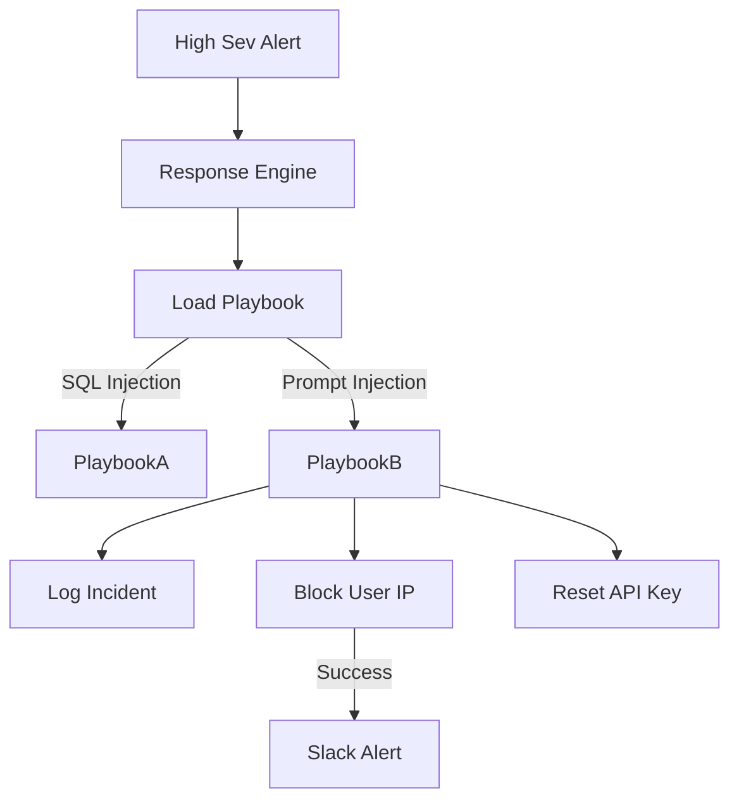

# LCS-DS-v0.18.8b-SEC: Design Specification — Automated Incident Response

## 1. Document Control

| Field                 | Value                                        |
| :-------------------- | :------------------------------------------- |
| **Document ID**       | LCS-DS-v0.18.8b-SEC                          |
| **Parent SBD**        | LCS-SBD-v0.18.8-SEC                          |
| **Release Version**   | v0.18.8b                                     |
| **Component Name**    | Automated Incident Response                  |
| **Document Type**     | Design Specification (DS)                    |
| **Author**            | Gemini Architect                             |
| **Created Date**      | 2026-02-04                                   |
| **Last Updated**      | 2026-02-04                                   |
| **Status**            | DRAFT                                        |
| **Classification**    | Internal — Technical Specification           |

---

## 2. Overview

This document provides the detailed design for **Automated Incident Response** (v0.18.8b). To minimize "Dwell Time" (the time an attacker is active before eviction), this component executes pre-defined "Playbooks" to contain threats immediately, often before human analysts can react.

---

## 3. Detailed Design

### 3.1. Objective

Automate containment actions (Block, Isolate, Suspend) to neutralize high-confidence threats instantly.

### 3.2. Scope

-   Define `IIncidentResponseManager`.
-   **Playbook Engine**: Execute conditional workflows (`if condition then action`).
-   **Action Library**: Integrations with User Service (Block), Session Manager (Kill), Network (Firewall).
-   **Safety**: "Break-glass" mechanisms to prevent automated actions from causing wide outage.

### 3.3. Detailed Architecture



#### 3.3.1. Playbook Definition

```yaml
name: "Contain Prompt Injection"
trigger: "Event.Type == 'PromptInjection' && Event.Confidence > 0.9"
actions:
  - type: BlockUser
    duration: 1h
    reason: "Automated Containment"
  - type: KillActiveSessions
  - type: EmailAdmins
```

### 3.4. Interfaces & Data Models

```csharp
public interface IIncidentResponseManager
{
    Task ExecutePlaybookAsync(
        string playbookName,
        IncidentContext context,
        CancellationToken ct = default);
}

public interface IResponseAction
{
    Task ExecuteAsync(Context ctx);
    Task RollbackAsync(Context ctx); // For undoing mistakes
}
```

### 3.5. Security Considerations

-   **DoH (Denial of Service by Helper)**: Attacker triggers false positives to ban legitimate admins.
    -   *Mitigation*: Allow-list for VIPs/Admins (cannot be auto-banned). Require human approval for critical actions.

### 3.6. Performance Considerations

-   **Execution Speed**: Must be fast (<1s) to be effective against automated attacks.

### 3.7. Testing Strategy

-   **Dry Run**: Run playbook in "Audit Mode" where it logs what it *would* do without doing it.

---

## 4. Key Artifacts & Deliverables

| Artifact                 | Description                                                              |
| :----------------------- | :----------------------------------------------------------------------- |
| `ResponseEngine`         | Logic executor.                                                          |
| `PlaybookLibrary`        | Default playbooks.                                                       |
| `ActionModules`          | DLLs for specific actions.                                               |

---

## 5. Acceptance Criteria

-   [ ] **Containment**: User is blocked immediately upon trigger.
-   [ ] **Safety**: Admins are exempt from auto-block.
-   [ ] **Logging**: All actions are audited.
