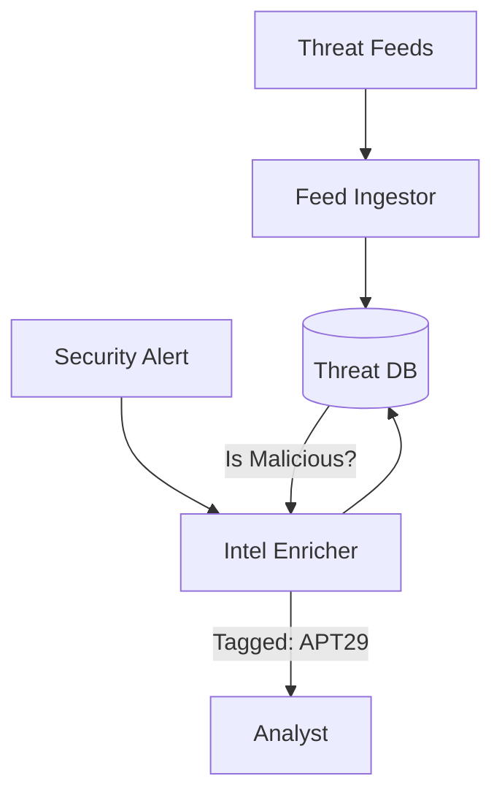

# LCS-DS-v0.18.8c-SEC: Design Specification — Threat Intelligence Integration

## 1. Document Control

| Field                 | Value                                        |
| :-------------------- | :------------------------------------------- |
| **Document ID**       | LCS-DS-v0.18.8c-SEC                          |
| **Parent SBD**        | LCS-SBD-v0.18.8-SEC                          |
| **Release Version**   | v0.18.8c                                     |
| **Component Name**    | Threat Intelligence Integration              |
| **Document Type**     | Design Specification (DS)                    |
| **Author**            | Gemini Architect                             |
| **Created Date**      | 2026-02-04                                   |
| **Last Updated**      | 2026-02-04                                   |
| **Status**            | DRAFT                                        |
| **Classification**    | Internal — Technical Specification           |

---

## 2. Overview

This document provides the detailed design for **Threat Intelligence Integration** (v0.18.8c). It allows the system to consume external knowledge (IOCs - Indicators of Compromise) such as malicious IP addresses, known attack signatures, and botnet domains, enhancing detection capabilities.

---

## 3. Detailed Design

### 3.1. Objective

Augment local detection with global threat data to block known bad actors.

### 3.2. Scope

-   Define `IThreatIntelligenceService`.
-   **Feed Ingestion**: Support STIX/TAXII standards or simple CSV lists (e.g., AlienVault OTX).
-   **IOC Matching**: Check incoming IPs/URLs against the Threat DB.
-   **Enrichment**: Add geo-location or ASN info to alerts.

### 3.3. Detailed Architecture



#### 3.3.1. Caching Strategy

-   Querying external APIs for every request is too slow.
-   *Strategy*: Download feeds to local Redis/SQL cache every 6 ours. High-frequency matching happens locally.

### 3.4. Interfaces & Data Models

```csharp
public interface IThreatIntelligenceService
{
    Task<ThreatIntelResult> CheckIndicatorAsync(
        string indicatorValue,
        IndicatorType type,
        CancellationToken ct = default);

    Task RefreshFeedsAsync(CancellationToken ct = default);
}

public record ThreatIntelResult(
    bool IsThreat,
    string ThreatGroup,
    float Confidence);
```

### 3.5. Security Considerations

-   **Poisoned Feeds**: Attackers might poison public feeds to block legitimate services (DoS).
    -   *Mitigation*: Use trusted sources only. Allow listing (override) essential domains.

### 3.6. Performance Considerations

-   **Bloom Filters**: Use Bloom Filters for rapid "Is this IP in the blacklist?" checks (O(1)). Check DB only if Bloom Filter says "Maybe".

### 3.7. Testing Strategy

-   **Simulated IOC**: Add `1.2.3.4` to blacklist. Connect from `1.2.3.4`. Ensure blocked.

---

## 4. Key Artifacts & Deliverables

| Artifact                 | Description                                                              |
| :----------------------- | :----------------------------------------------------------------------- |
| `IntelService`           | Core Logic.                                                              |
| `FeedConnectors`         | STIX/CSV parsers.                                                        |
| `BloomFilter`            | Optimization.                                                            |

---

## 5. Acceptance Criteria

-   [ ] **Ingestion**: Successfully parses STIX 2.1.
-   [ ] **Matching**: Fast lookup (<1ms) for IPs.
-   [ ] **Updates**: Feeds refresh automatically.
