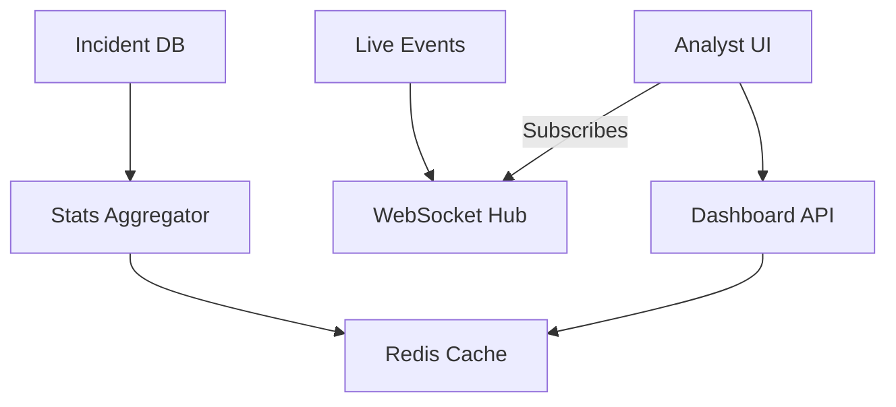

# LCS-DS-v0.18.8d-SEC: Design Specification — Security Operations Dashboard

## 1. Document Control

| Field                 | Value                                        |
| :-------------------- | :------------------------------------------- |
| **Document ID**       | LCS-DS-v0.18.8d-SEC                          |
| **Parent SBD**        | LCS-SBD-v0.18.8-SEC                          |
| **Release Version**   | v0.18.8d                                     |
| **Component Name**    | Security Operations Dashboard                |
| **Document Type**     | Design Specification (DS)                    |
| **Author**            | Gemini Architect                             |
| **Created Date**      | 2026-02-04                                   |
| **Last Updated**      | 2026-02-04                                   |
| **Status**            | DRAFT                                        |
| **Classification**    | Internal — Technical Specification           |

---

## 2. Overview

This document provides the detailed design for **Security Operations Dashboard** (v0.18.8d). Distinct from the compliance dashboard (v0.18.5g), this view focuses on *active threats*, incident response status, and real-time attack telemetry.

---

## 3. Detailed Design

### 3.1. Objective

Provide situational awareness to security analysts during active checking or incidents.

### 3.2. Scope

-   Define `ISecurityDashboard`.
-   **Geo-Map**: Visualization of attack origins.
-   **Live Feed**: Scrolling list of blocked attacks.
-   **Incident State**: Metrics on Open/Closed incidents and MTTR (Mean Time To Resolve).

### 3.3. Detailed Architecture



#### 3.3.1. Data Freshness

-   **Live Feed**: Real-time (<500ms latency).
-   **Aggregates**: Updated every 1 min.

### 3.4. Interfaces & Data Models

```csharp
public interface ISecurityDashboard
{
    Task<SecurityPosture> GetPostureAsync(CancellationToken ct = default);
    Task<ThreatMetrics> GetMetricsAsync(TimeRange range, CancellationToken ct = default);
}

public record SecurityPosture(
    int ActiveIncidents,
    int BlockedAttacks24h,
    double RiskScore);
```

### 3.5. Security Considerations

-   **Access Control**: Strictly limited to Security Team role.
-   **Data Masking**: Even analysts shouldn't see PII unless investigating. Mask user emails by default.

### 3.6. Performance Considerations

-   **Vector Maps**: Don't send 1M points to client. Cluster points server-side (GeoHash) before sending.

### 3.7. Testing Strategy

-   **Load**: Ensure dashboard opens <1s even with 1M alerts in DB.

---

## 4. Key Artifacts & Deliverables

| Artifact                 | Description                                                              |
| :----------------------- | :----------------------------------------------------------------------- |
| `DashboardApi`           | Controller.                                                              |
| `GeoIpService`           | Maps IPs to Lat/Long.                                                    |
| `OpsFrontend`            | React pages.                                                             |

---

## 5. Acceptance Criteria

-   [ ] **Latency**: Initial load <1s.
-   [ ] **Live Updates**: New attacks appear without refresh.
-   [ ] **GeoIP**: Correctly places IPs on map.
