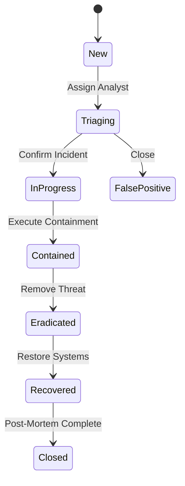

# LCS-DS-v0.18.8e-SEC: Design Specification — Incident Workflow Management

## 1. Document Control

| Field                 | Value                                        |
| :-------------------- | :------------------------------------------- |
| **Document ID**       | LCS-DS-v0.18.8e-SEC                          |
| **Parent SBD**        | LCS-SBD-v0.18.8-SEC                          |
| **Release Version**   | v0.18.8e                                     |
| **Component Name**    | Incident Workflow Management                 |
| **Document Type**     | Design Specification (DS)                    |
| **Author**            | Gemini Architect                             |
| **Created Date**      | 2026-02-04                                   |
| **Last Updated**      | 2026-02-04                                   |
| **Status**            | DRAFT                                        |
| **Classification**    | Internal — Technical Specification           |

---

## 2. Overview

This document provides the detailed design for **Incident Workflow Management** (v0.18.8e). It provides the structured process for human analysts to manage security incidents from creation to post-mortem, ensuring no critical step (Containment, Eradication, Recovery) is skipped.

---

## 3. Detailed Design

### 3.1. Objective

Standardize the incident response lifecycle to ensure consistent, compliant handling of security events.

### 3.2. Scope

-   Define `IIncidentWorkflowManager`.
-   **State Machine**: Enforce transitions (Start -> Triage -> Contain -> Close).
-   **SLA Tracking**: Monitor deadlines (e.g., Critical = 1h response).
-   **Assignment**: Round-robin or expertise-based assignment to analysts.

### 3.3. Detailed Architecture



#### 3.3.1. SLA Engine

-   Background job checks open incidents.
-   If `TimeNow > CreatedAt + SLA`, escalate (Email Manager / PagerDuty).

### 3.4. Interfaces & Data Models

```csharp
public interface IIncidentWorkflowManager
{
    Task TransitionAsync(Guid incidentId, IncidentState newState, string comment);
    Task AssignAsync(Guid incidentId, Guid userId);
}

public enum IncidentPhase
{
    Detection,
    Triage,
    Containment,
    Eradication,
    Recovery,
    PostIncident
}
```

### 3.5. Security Considerations

-   **Tamper Proof**: Incident history (comments, state changes) must be immutable to serve as legal evidence.

### 3.6. Performance Considerations

-   **Minimal**: Workflow updates are low frequency.

### 3.7. Testing Strategy

-   **Lifecycle**: Verify state machine prevents invalid jumps (e.g. New -> Closed without Triage comment).

---

## 4. Key Artifacts & Deliverables

| Artifact                 | Description                                                              |
| :----------------------- | :----------------------------------------------------------------------- |
| `IncidentManager`        | Logic.                                                                   |
| `WorkflowStates`         | State definitions.                                                       |
| `SlaMonitor`             | Background job.                                                          |

---

## 5. Acceptance Criteria

-   [ ] **Flow**: State machine enforced.
-   [ ] **Auditing**: All changes logged.
-   [ ] **SLA**: Escalation emails sent on breach.
