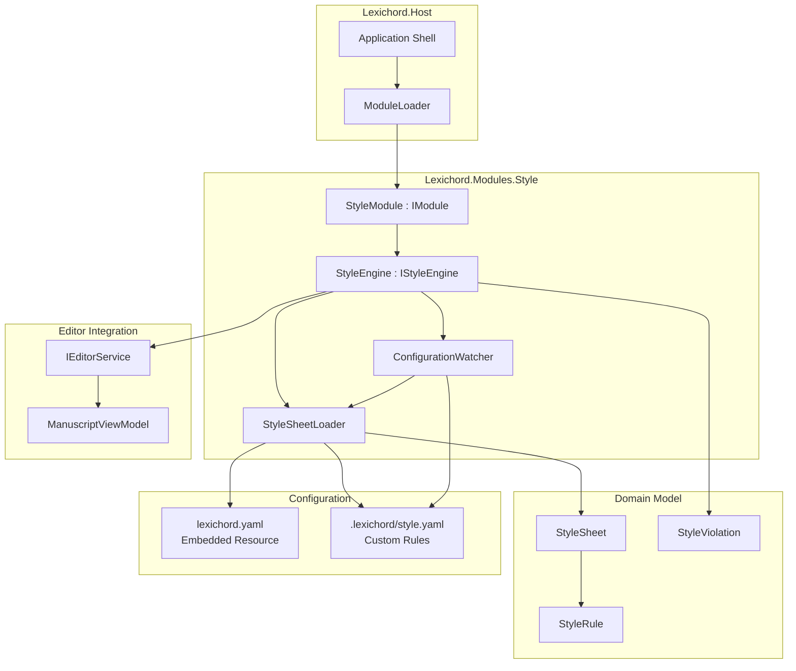
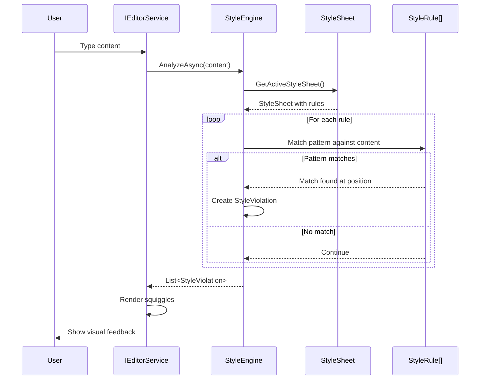
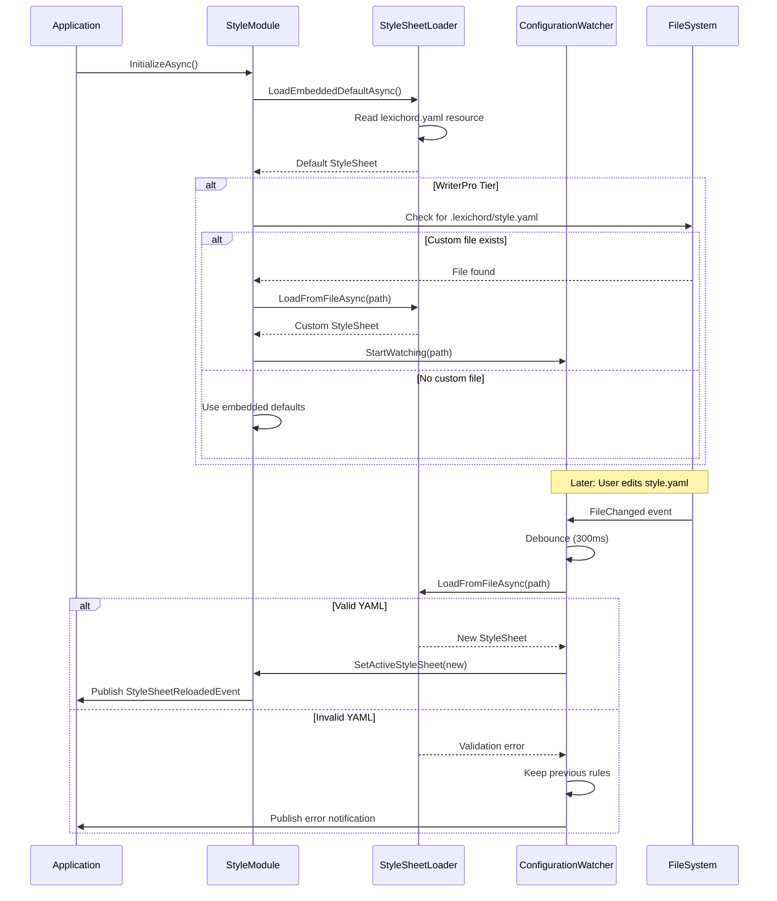

# LCS-DES-021: Design Specification Index — The Rulebook (Style Module Genesis)

## Document Control

| Field              | Value                               |
| :----------------- | :---------------------------------- |
| **Document ID**    | LCS-DES-021-INDEX                   |
| **Feature ID**     | INF-021                             |
| **Feature Name**   | The Rulebook (Style Module Genesis) |
| **Target Version** | v0.2.1                              |
| **Status**         | Draft                               |
| **Last Updated**   | 2026-01-27                          |

---

## Executive Summary

The Rulebook (Style Module Genesis) represents the **philosophical heart of Lexichord** — the embodiment of the "Concordance" philosophy: **rules over improvisation**. This module transforms Lexichord from a mere "Markdown Editor" into a **Governed Writing Environment** where style consistency is enforced, not suggested.

Just as a conductor ensures every instrument plays in harmony, the Style Module ensures every word adheres to the writer's chosen style guide. This is not about restricting creativity — it is about freeing writers from the cognitive burden of style enforcement so they can focus on what matters: the content.

### The Concordance Philosophy

> "A concordance is an alphabetical list of the principal words used in a book or body of work, listing every instance of each word with its immediate context."

In Lexichord, "Concordance" extends this concept:

- **Rules are explicit:** No ambiguity about what is correct
- **Consistency is automatic:** Writers don't need to remember style choices
- **Customization is encouraged:** Your rules, your way (WriterPro tier)
- **Violations are opportunities:** Every squiggle is a learning moment

**Business Value:**

- **Product Differentiation:** No Markdown editor offers embedded style governance
- **Upsell Path:** Core tier gets standard rules; WriterPro unlocks custom YAML
- **Enterprise Value:** Teams/Enterprise will add shared style sheets, rule inheritance
- **Stickiness:** Writers who configure their style rules won't leave easily
- **Foundation for AI:** Style rules become constraints for AI writing assistance (v0.3.x+)

---

## Related Documents

| Document Type       | Document ID  | Title                      | Path                |
| :------------------ | :----------- | :------------------------- | :------------------ |
| **Scope Breakdown** | LCS-SBD-021  | Style Module Genesis Scope | `./LCS-SBD-021.md`  |
| **Sub-Part 021a**   | LCS-DES-021a | Module Scaffolding         | `./LCS-DES-021a.md` |
| **Sub-Part 021b**   | LCS-DES-021b | Rule Object Model          | `./LCS-DES-021b.md` |
| **Sub-Part 021c**   | LCS-DES-021c | YAML Deserializer          | `./LCS-DES-021c.md` |
| **Sub-Part 021d**   | LCS-DES-021d | Configuration Watcher      | `./LCS-DES-021d.md` |

---

## Architecture Overview

### High-Level Component Diagram

### Style Analysis Flow

### Configuration Lifecycle

---

## Dependencies

### Upstream Dependencies

| Component           | Source Version | Usage                                                       |
| :------------------ | :------------- | :---------------------------------------------------------- |
| IModule             | v0.0.4a        | Style module implements IModule interface                   |
| ModuleLoader        | v0.0.4b        | Discovers and loads Style module at startup                 |
| IMediator/Event Bus | v0.0.7         | Publish StyleViolationDetectedEvent                         |
| IConfiguration      | v0.0.3d        | Load style configuration paths (IOptions<LexichordOptions>) |
| IEditorService      | v0.1.3a        | Access document content for style analysis                  |
| ManuscriptViewModel | v0.1.3a        | Wire violation squiggles to editor                          |
| Serilog             | v0.0.3b        | Log rule loading and violation detection                    |

### External Dependencies

| Package                          | Version  | Purpose                             |
| :------------------------------- | :------- | :---------------------------------- |
| `YamlDotNet`                     | Latest   | YAML deserialization for rule files |
| `System.Text.RegularExpressions` | Built-in | Pattern matching for style rules    |

---

## License Gating Strategy

| Feature               | Core Tier                  | WriterPro Tier                     |
| :-------------------- | :------------------------- | :--------------------------------- |
| **Embedded Rules**    | ✅ Standard lexichord.yaml | ✅ Standard lexichord.yaml         |
| **Custom YAML Rules** | ❌ Not available           | ✅ `.lexichord/style.yaml` support |
| **Live Reload**       | ❌ Not available           | ✅ FileSystemWatcher enabled       |
| **Rule Editing**      | ❌ View-only               | ✅ Full edit capabilities          |

**Rationale:**

- Core tier provides comprehensive style checking with embedded rules
- WriterPro unlocks customization for professional writers
- Enterprise tier (future) will add team-shared rule repositories

---

## Key Interfaces Summary

### IStyleEngine (v0.2.1a)

Core service for style analysis. Orchestrates rule evaluation against document content.

**See:** `LCS-DES-021a.md` for full specification

### StyleRule, StyleSheet, StyleViolation (v0.2.1b)

Domain model representing rules, collections, and detected violations. The vocabulary of the Concordance philosophy.

**See:** `LCS-DES-021b.md` for full specification

### IStyleSheetLoader (v0.2.1c)

Deserializes YAML rule definitions into StyleSheet objects. Supports embedded and custom sources.

**See:** `LCS-DES-021c.md` for full specification

### IStyleConfigurationWatcher (v0.2.1d)

Monitors `.lexichord/style.yaml` for changes and triggers reload. Enables live editing workflow.

**See:** `LCS-DES-021d.md` for full specification

---

## Implementation Checklist Summary

| Sub-Part        | Est. Hours | Key Deliverables                                                 |
| :-------------- | :--------- | :--------------------------------------------------------------- |
| **v0.2.1a**     | 7h         | StyleModule project, IStyleEngine interface, module registration |
| **v0.2.1b**     | 8.5h       | Domain objects (StyleRule, StyleSheet, StyleViolation)           |
| **v0.2.1c**     | 14.25h     | YamlDotNet integration, embedded lexichord.yaml with 25+ rules   |
| **v0.2.1d**     | 12h        | FileSystemWatcher with debouncing, live reload                   |
| **Integration** | 4h         | End-to-end testing                                               |
| **Total**       | **46h**    | Complete Style Module foundation                                 |

**See:** `LCS-SBD-021.md` for detailed task breakdown

---

## Success Criteria Summary

### Performance Targets

| Metric                        | Target  | Rationale                          |
| :---------------------------- | :------ | :--------------------------------- |
| Module load time              | < 50ms  | Must not delay application startup |
| YAML parse time (100 rules)   | < 100ms | Fast enough for live reload        |
| File change detection         | < 500ms | Responsive editing experience      |
| Analysis latency (1000 lines) | < 200ms | Near-instant feedback              |
| Memory per rule               | < 1KB   | Scalable to large rule sets        |
| False positive rate           | < 5%    | Minimal noise from standard rules  |

### Quality Targets

- 100% code coverage for domain objects (StyleRule, StyleSheet, StyleViolation)
- 95%+ code coverage for YAML deserialization
- All regex patterns must have timeout limits (prevent ReDoS)
- Graceful fallback to previous valid rules on YAML errors

---

## Test Coverage Summary

### Unit Testing

| Component             | Coverage Target | Key Tests                                              |
| :-------------------- | :-------------- | :----------------------------------------------------- |
| StyleModule           | 90%             | Lifecycle (Initialize, Shutdown), service registration |
| Domain Objects        | 100%            | Rule matching, violation creation, severity handling   |
| YAML Loader           | 95%             | Valid YAML, malformed YAML, embedded resource loading  |
| Configuration Watcher | 90%             | File change detection, debouncing, error handling      |

### Integration Testing

- End-to-end: Load embedded rules → analyze content → detect violations
- Live reload: Edit custom YAML → watch file change → reload rules
- Error scenarios: Invalid YAML → validation error → keep previous rules
- License gating: Core tier blocked from custom YAML → WriterPro allowed

### Manual Testing

- Create `.lexichord/style.yaml` with custom rules
- Verify file watcher triggers reload on save
- Test malformed YAML handling (graceful error)
- Verify embedded rules work in Core tier
- Verify custom rules work in WriterPro tier

**See:** Individual sub-part specifications for detailed test requirements

---

## What This Enables

After v0.2.1, Lexichord will support:

1. **Modular Style System**
    - Pluggable style module architecture
    - Foundation for domain-specific modules
    - Clean separation from core editor

2. **Rule-Based Governance**
    - Explicit style rules (no ambiguity)
    - Automatic consistency enforcement
    - Immediate violation feedback

3. **Extensibility Foundation**
    - Core tier: Standard embedded rules
    - WriterPro tier: Custom YAML rules with live reload
    - Future: Team-shared rule repositories

4. **AI Constraints** (Future)
    - Style rules become constraints for AI generation
    - AI suggestions respect active style guide
    - Consistent voice across human and AI content

5. **Foundation for v0.2.2+**
    - Squiggle rendering in editor
    - Violation tooltips with suggestions
    - Quick fixes for common issues
    - Real-time analysis during typing

---

## Risks & Mitigations

| Risk                             | Impact | Mitigation                                    |
| :------------------------------- | :----- | :-------------------------------------------- |
| YamlDotNet breaking changes      | High   | Pin specific version; wrap in adapter         |
| Regex patterns cause ReDoS       | High   | Timeout pattern execution; complexity limits  |
| File watcher events flood        | Medium | Debounce at 300ms; coalesce rapid changes     |
| Invalid YAML crashes app         | High   | Validate before loading; fallback to defaults |
| Large rule sets slow analysis    | Medium | Lazy evaluation; parallel pattern matching    |
| User deletes style.yaml mid-edit | Low    | Keep last valid rules in memory               |

---

## Document History

| Version | Date       | Author           | Changes                                                      |
| :------ | :--------- | :--------------- | :----------------------------------------------------------- |
| 1.0     | 2026-01-27 | System Architect | Created INDEX from legacy LCS-INF-021 during standardization |
