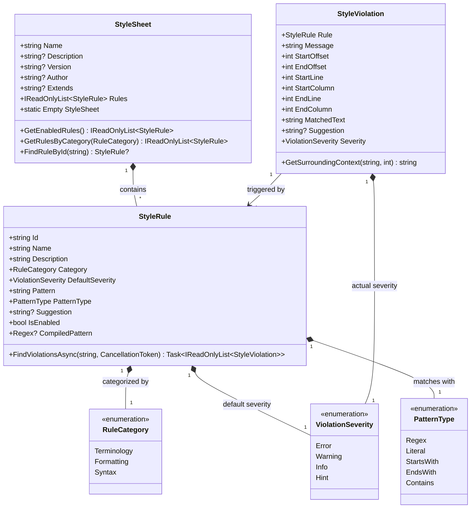
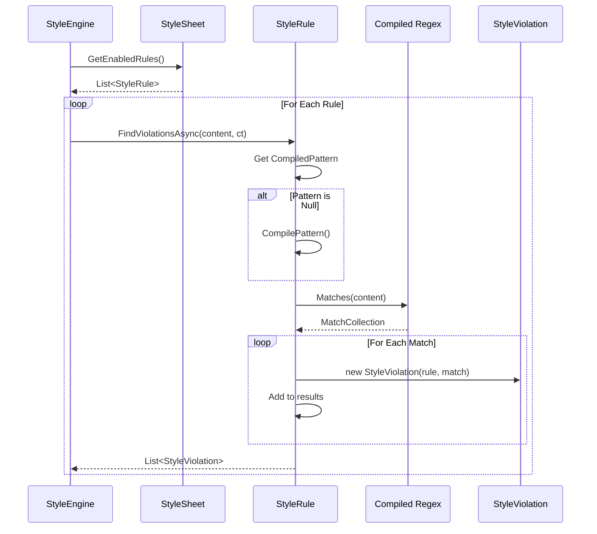

# LCS-DES-021b: Rule Object Model — Domain Objects for Style Governance

## 1. Metadata & Categorization

| Field                | Value                           | Description                                   |
| :------------------- | :------------------------------ | :-------------------------------------------- |
| **Document ID**      | LCS-DES-021b                    | Design Specification v0.2.1b                  |
| **Feature ID**       | INF-021b                        | Rule Object Model                             |
| **Feature Name**     | Rule Object Model               | Domain objects for style rules and violations |
| **Target Version**   | `v0.2.1b`                       | Style Module Phase 1, Part B                  |
| **Module Scope**     | `Lexichord.Abstractions.Domain` | Shared domain objects                         |
| **Swimlane**         | `Domain`                        | The Vocabulary (Core Concepts)                |
| **License Tier**     | `Core`                          | Domain objects available to all               |
| **Feature Gate Key** | N/A                             | No runtime gating for domain objects          |
| **Author**           | System Architect                |                                               |
| **Status**           | **Draft**                       | Pending approval                              |
| **Last Updated**     | 2026-01-27                      |                                               |

---

## 2. Executive Summary

### 2.1 The Requirement

The Style Module needs a rich domain model that expresses the vocabulary of style governance:

- **StyleRule:** A single style requirement with pattern, severity, and suggestion.
- **RuleCategory:** Classification of rules (Terminology, Formatting, Syntax).
- **ViolationSeverity:** How serious a violation is (Error, Warning, Info, Hint).
- **StyleViolation:** A detected violation with position and context.
- **StyleSheet:** An aggregate of rules forming a complete style guide.

### 2.2 The Proposed Solution

We **SHALL** define immutable domain objects using C# records:

1. **Enumerations** — `RuleCategory`, `ViolationSeverity`, `PatternType`.
2. **StyleRule** — The atomic unit of style governance.
3. **StyleViolation** — A detected violation with full context.
4. **StyleSheet** — Collection of rules with metadata.

### 2.3 Design Philosophy

> **"Make illegal states unrepresentable."**

- All domain objects are immutable records.
- Required fields are non-nullable.
- Validation happens at construction time.
- Rich behavior lives on the objects, not in services.

---

## 3. Architecture

### 3.1 Domain Object Relationships



### 3.2 Violation Detection Flow



---

## 4. Data Contracts

### 4.1 RuleCategory Enumeration

```csharp
namespace Lexichord.Abstractions.Domain;

/// <summary>
/// Categories of style rules for organization and filtering.
/// </summary>
/// <remarks>
/// LOGIC: Rules are categorized to allow:
/// - Filtering in the UI (show only terminology rules)
/// - Bulk enable/disable by category
/// - Different squiggle colors per category
/// - Reporting by category (e.g., "30% terminology issues")
///
/// Categories are not mutually exclusive in theory, but each
/// rule is assigned exactly one primary category.
/// </remarks>
public enum RuleCategory
{
    /// <summary>
    /// Rules about word choice and phrasing.
    /// </summary>
    /// <remarks>
    /// LOGIC: Terminology rules catch:
    /// - Banned words ("utilize" -> "use")
    /// - Jargon and buzzwords
    /// - Inconsistent terminology
    /// - Biased language
    ///
    /// Example: "Don't use 'synergy'. Consider 'collaboration'."
    /// </remarks>
    Terminology = 0,

    /// <summary>
    /// Rules about document structure and presentation.
    /// </summary>
    /// <remarks>
    /// LOGIC: Formatting rules catch:
    /// - Heading hierarchy violations
    /// - Inconsistent list markers
    /// - Line length violations
    /// - Whitespace issues
    ///
    /// Example: "Heading jumped from H1 to H3, skipping H2."
    /// </remarks>
    Formatting = 1,

    /// <summary>
    /// Rules about grammar and mechanics.
    /// </summary>
    /// <remarks>
    /// LOGIC: Syntax rules catch:
    /// - Passive voice overuse
    /// - Sentence length issues
    /// - Common grammatical errors
    /// - Punctuation issues
    ///
    /// Example: "Sentence exceeds 40 words. Consider splitting."
    /// </remarks>
    Syntax = 2
}
```

### 4.2 ViolationSeverity Enumeration

```csharp
namespace Lexichord.Abstractions.Domain;

/// <summary>
/// Severity levels for style violations.
/// </summary>
/// <remarks>
/// LOGIC: Severity determines:
/// - Squiggle color in the editor
/// - Sorting priority in problems list
/// - Whether build/export should fail (future)
/// - Notification urgency
///
/// Inspired by compiler/linter severity conventions (Error > Warning > Info > Hint).
/// </remarks>
public enum ViolationSeverity
{
    /// <summary>
    /// Critical violation that must be fixed.
    /// </summary>
    /// <remarks>
    /// LOGIC: Use for violations that:
    /// - Break document validity
    /// - Violate legal/compliance requirements
    /// - Cause reader confusion
    ///
    /// Editor: Red squiggle
    /// Example: "Document contains prohibited term 'TBD'."
    /// </remarks>
    Error = 0,

    /// <summary>
    /// Significant violation that should be addressed.
    /// </summary>
    /// <remarks>
    /// LOGIC: Use for violations that:
    /// - Reduce document quality
    /// - Deviate from style guide
    /// - May confuse some readers
    ///
    /// Editor: Yellow/orange squiggle
    /// Example: "Passive voice detected. Consider active voice."
    /// </remarks>
    Warning = 1,

    /// <summary>
    /// Informational note about style.
    /// </summary>
    /// <remarks>
    /// LOGIC: Use for violations that:
    /// - Are suggestions, not requirements
    /// - Depend on context
    /// - Educate the writer
    ///
    /// Editor: Blue squiggle
    /// Example: "Sentence is 35 words. Consider if it can be simplified."
    /// </remarks>
    Info = 2,

    /// <summary>
    /// Subtle hint for style improvement.
    /// </summary>
    /// <remarks>
    /// LOGIC: Use for violations that:
    /// - Are minor stylistic preferences
    /// - May not apply universally
    /// - Are easily dismissed
    ///
    /// Editor: Gray/subtle squiggle or dots
    /// Example: "Consider replacing 'very' with a stronger word."
    /// </remarks>
    Hint = 3
}
```

### 4.3 PatternType Enumeration

```csharp
namespace Lexichord.Abstractions.Domain;

/// <summary>
/// Types of pattern matching supported by style rules.
/// </summary>
/// <remarks>
/// LOGIC: Different pattern types optimize for different use cases:
/// - Regex: Maximum flexibility, higher cost
/// - Literal: Exact match, fastest
/// - Simple patterns: Good balance for common cases
///
/// The YAML deserializer infers PatternType from pattern syntax
/// or it can be explicitly specified.
/// </remarks>
public enum PatternType
{
    /// <summary>
    /// Regular expression pattern (default).
    /// </summary>
    /// <remarks>
    /// LOGIC: Full regex power for complex patterns.
    /// - Supports capture groups
    /// - Case-insensitive via (?i) flag
    /// - Word boundaries via \b
    ///
    /// Performance: Compiled once, cached on StyleRule.
    /// Timeout: 100ms per match to prevent ReDoS.
    ///
    /// Example: "\b(utilize|utilise)\b" matches whole word "utilize".
    /// </remarks>
    Regex = 0,

    /// <summary>
    /// Literal string match (case-sensitive).
    /// </summary>
    /// <remarks>
    /// LOGIC: Fastest matching for exact strings.
    /// Implemented via String.IndexOf().
    ///
    /// Example: "TODO" matches exactly "TODO", not "todo".
    /// </remarks>
    Literal = 1,

    /// <summary>
    /// Literal string match (case-insensitive).
    /// </summary>
    /// <remarks>
    /// LOGIC: Like Literal but ignores case.
    /// Implemented via String.IndexOf() with OrdinalIgnoreCase.
    ///
    /// Example: "todo" matches "TODO", "Todo", "todo".
    /// </remarks>
    LiteralIgnoreCase = 2,

    /// <summary>
    /// Pattern that matches line starts.
    /// </summary>
    /// <remarks>
    /// LOGIC: For rules about line beginnings.
    /// Implemented as regex "^pattern" with Multiline option.
    ///
    /// Example: "  " catches lines starting with spaces (no tabs).
    /// </remarks>
    StartsWith = 3,

    /// <summary>
    /// Pattern that matches line ends.
    /// </summary>
    /// <remarks>
    /// LOGIC: For rules about line endings.
    /// Implemented as regex "pattern$" with Multiline option.
    ///
    /// Example: "  " catches trailing whitespace.
    /// </remarks>
    EndsWith = 4,

    /// <summary>
    /// Simple substring check (fastest for "contains" logic).
    /// </summary>
    /// <remarks>
    /// LOGIC: For simple banned words without word boundary needs.
    /// Implemented via String.Contains() with OrdinalIgnoreCase.
    ///
    /// Example: "synergy" matches anywhere in text.
    /// </remarks>
    Contains = 5
}
```

### 4.4 StyleRule Record

````csharp
namespace Lexichord.Abstractions.Domain;

using System.Text.RegularExpressions;

/// <summary>
/// Represents a single style rule in the Concordance system.
/// </summary>
/// <remarks>
/// LOGIC: A StyleRule is the atomic unit of style governance.
/// It defines:
/// - What to look for (Pattern + PatternType)
/// - Why it matters (Name, Description)
/// - How serious it is (DefaultSeverity)
/// - What to do instead (Suggestion)
///
/// Design Decisions:
/// - Immutable record for thread safety and equality
/// - Pattern is compiled lazily and cached
/// - FindViolationsAsync lives on the rule for encapsulation
///
/// YAML Representation:
/// ```yaml
/// - id: no-passive-voice
///   name: Avoid Passive Voice
///   description: Active voice is clearer and more direct.
///   category: syntax
///   severity: warning
///   pattern: \b(was|were|been|being)\s+\w+ed\b
///   suggestion: Consider rewriting in active voice.
/// ```
/// </remarks>
/// <param name="Id">Unique identifier for the rule (kebab-case).</param>
/// <param name="Name">Human-readable display name.</param>
/// <param name="Description">Detailed explanation of the rule.</param>
/// <param name="Category">Classification category.</param>
/// <param name="DefaultSeverity">Default violation severity.</param>
/// <param name="Pattern">The pattern to match against content.</param>
/// <param name="PatternType">How to interpret the pattern.</param>
/// <param name="Suggestion">Suggested fix or alternative.</param>
/// <param name="IsEnabled">Whether the rule is active.</param>
public sealed record StyleRule(
    string Id,
    string Name,
    string Description,
    RuleCategory Category,
    ViolationSeverity DefaultSeverity,
    string Pattern,
    PatternType PatternType,
    string? Suggestion,
    bool IsEnabled = true)
{
    /// <summary>
    /// Timeout for regex pattern execution to prevent ReDoS.
    /// </summary>
    /// <remarks>
    /// LOGIC: 100ms is generous for any reasonable pattern.
    /// If a pattern takes longer, it's either:
    /// - A pathological pattern (ReDoS)
    /// - Content is too large (should be chunked)
    /// </remarks>
    private static readonly TimeSpan PatternTimeout = TimeSpan.FromMilliseconds(100);

    /// <summary>
    /// Cached compiled regex pattern (lazy initialization).
    /// </summary>
    /// <remarks>
    /// LOGIC: Regex compilation is expensive. We compile once
    /// on first use and cache the result. The record is immutable
    /// so the pattern never changes.
    /// </remarks>
    private Regex? _compiledPattern;
    private readonly object _compileLock = new();

    /// <summary>
    /// Gets the compiled regex pattern, creating it if necessary.
    /// </summary>
    /// <remarks>
    /// LOGIC: Thread-safe lazy initialization.
    /// Returns null for non-regex pattern types (they don't use this).
    /// </remarks>
    public Regex? CompiledPattern
    {
        get
        {
            if (PatternType != PatternType.Regex &&
                PatternType != PatternType.StartsWith &&
                PatternType != PatternType.EndsWith)
            {
                return null;
            }

            if (_compiledPattern is not null)
            {
                return _compiledPattern;
            }

            lock (_compileLock)
            {
                // Double-check after acquiring lock
                if (_compiledPattern is not null)
                {
                    return _compiledPattern;
                }

                _compiledPattern = CompilePattern();
                return _compiledPattern;
            }
        }
    }

    /// <summary>
    /// Compiles the pattern into a Regex object.
    /// </summary>
    private Regex CompilePattern()
    {
        var regexPattern = PatternType switch
        {
            PatternType.StartsWith => $"^{Pattern}",
            PatternType.EndsWith => $"{Pattern}$",
            _ => Pattern
        };

        var options = RegexOptions.Compiled | RegexOptions.CultureInvariant;

        if (PatternType == PatternType.StartsWith || PatternType == PatternType.EndsWith)
        {
            options |= RegexOptions.Multiline;
        }

        return new Regex(regexPattern, options, PatternTimeout);
    }

    /// <summary>
    /// Finds all violations of this rule in the given content.
    /// </summary>
    /// <param name="content">The document content to analyze.</param>
    /// <param name="cancellationToken">Cancellation token.</param>
    /// <returns>Collection of violations found.</returns>
    /// <remarks>
    /// LOGIC: This method encapsulates all pattern matching logic.
    /// Each match in the content becomes a StyleViolation with
    /// full position information.
    ///
    /// Performance: For large documents, consider calling with
    /// smaller chunks. The method itself doesn't chunk.
    /// </remarks>
    public Task<IReadOnlyList<StyleViolation>> FindViolationsAsync(
        string content,
        CancellationToken cancellationToken = default)
    {
        if (!IsEnabled || string.IsNullOrEmpty(content))
        {
            return Task.FromResult<IReadOnlyList<StyleViolation>>(
                Array.Empty<StyleViolation>());
        }

        var violations = new List<StyleViolation>();

        try
        {
            var matches = FindMatches(content);

            foreach (var (startOffset, length) in matches)
            {
                cancellationToken.ThrowIfCancellationRequested();

                var matchedText = content.Substring(startOffset, length);
                var (startLine, startColumn) = GetLineAndColumn(content, startOffset);
                var (endLine, endColumn) = GetLineAndColumn(content, startOffset + length);

                var violation = new StyleViolation(
                    Rule: this,
                    Message: $"{Name}: {Description}",
                    StartOffset: startOffset,
                    EndOffset: startOffset + length,
                    StartLine: startLine,
                    StartColumn: startColumn,
                    EndLine: endLine,
                    EndColumn: endColumn,
                    MatchedText: matchedText,
                    Suggestion: Suggestion,
                    Severity: DefaultSeverity);

                violations.Add(violation);
            }
        }
        catch (RegexMatchTimeoutException)
        {
            // LOGIC: Pattern took too long - likely ReDoS or huge content
            // Return partial results rather than failing completely
        }

        return Task.FromResult<IReadOnlyList<StyleViolation>>(violations.AsReadOnly());
    }

    /// <summary>
    /// Finds all matches using the appropriate matching strategy.
    /// </summary>
    private IEnumerable<(int Offset, int Length)> FindMatches(string content)
    {
        switch (PatternType)
        {
            case PatternType.Regex:
            case PatternType.StartsWith:
            case PatternType.EndsWith:
                return FindRegexMatches(content);

            case PatternType.Literal:
                return FindLiteralMatches(content, StringComparison.Ordinal);

            case PatternType.LiteralIgnoreCase:
            case PatternType.Contains:
                return FindLiteralMatches(content, StringComparison.OrdinalIgnoreCase);

            default:
                return Enumerable.Empty<(int, int)>();
        }
    }

    private IEnumerable<(int Offset, int Length)> FindRegexMatches(string content)
    {
        var regex = CompiledPattern;
        if (regex is null) yield break;

        foreach (Match match in regex.Matches(content))
        {
            yield return (match.Index, match.Length);
        }
    }

    private IEnumerable<(int Offset, int Length)> FindLiteralMatches(
        string content,
        StringComparison comparison)
    {
        var index = 0;
        while ((index = content.IndexOf(Pattern, index, comparison)) != -1)
        {
            yield return (index, Pattern.Length);
            index += Pattern.Length;
        }
    }

    /// <summary>
    /// Converts a character offset to line and column numbers.
    /// </summary>
    /// <remarks>
    /// LOGIC: Lines and columns are 1-based (editor convention).
    /// Handles both \n and \r\n line endings.
    /// </remarks>
    private static (int Line, int Column) GetLineAndColumn(string content, int offset)
    {
        var line = 1;
        var column = 1;

        for (var i = 0; i < offset && i < content.Length; i++)
        {
            if (content[i] == '\n')
            {
                line++;
                column = 1;
            }
            else if (content[i] != '\r')
            {
                column++;
            }
        }

        return (line, column);
    }

    /// <summary>
    /// Creates a disabled copy of this rule.
    /// </summary>
    public StyleRule Disable() => this with { IsEnabled = false };

    /// <summary>
    /// Creates an enabled copy of this rule.
    /// </summary>
    public StyleRule Enable() => this with { IsEnabled = true };

    /// <summary>
    /// Creates a copy with different severity.
    /// </summary>
    public StyleRule WithSeverity(ViolationSeverity severity) =>
        this with { DefaultSeverity = severity };
}
````

### 4.5 StyleViolation Record

```csharp
namespace Lexichord.Abstractions.Domain;

/// <summary>
/// Represents a detected style violation in document content.
/// </summary>
/// <remarks>
/// LOGIC: A StyleViolation captures everything needed to:
/// - Display a squiggle in the editor (positions)
/// - Show a tooltip (message, suggestion)
/// - Navigate to the violation (line, column)
/// - Offer quick fixes (suggestion, matched text)
///
/// All position information is included to support various
/// editor integrations without re-computing positions.
///
/// Immutability ensures violations can be safely passed
/// between threads and cached.
/// </remarks>
/// <param name="Rule">The rule that was violated.</param>
/// <param name="Message">Human-readable description of the violation.</param>
/// <param name="StartOffset">Character offset where violation starts (0-based).</param>
/// <param name="EndOffset">Character offset where violation ends (exclusive).</param>
/// <param name="StartLine">Line number where violation starts (1-based).</param>
/// <param name="StartColumn">Column number where violation starts (1-based).</param>
/// <param name="EndLine">Line number where violation ends (1-based).</param>
/// <param name="EndColumn">Column number where violation ends (1-based).</param>
/// <param name="MatchedText">The actual text that matched the pattern.</param>
/// <param name="Suggestion">Suggested fix or alternative (from rule).</param>
/// <param name="Severity">Actual severity (may differ from rule default).</param>
public sealed record StyleViolation(
    StyleRule Rule,
    string Message,
    int StartOffset,
    int EndOffset,
    int StartLine,
    int StartColumn,
    int EndLine,
    int EndColumn,
    string MatchedText,
    string? Suggestion,
    ViolationSeverity Severity)
{
    /// <summary>
    /// Gets the length of the violation in characters.
    /// </summary>
    /// <remarks>
    /// LOGIC: Convenience property for squiggle rendering.
    /// </remarks>
    public int Length => EndOffset - StartOffset;

    /// <summary>
    /// Gets whether this violation spans multiple lines.
    /// </summary>
    public bool IsMultiLine => EndLine > StartLine;

    /// <summary>
    /// Gets the rule ID for filtering and grouping.
    /// </summary>
    public string RuleId => Rule.Id;

    /// <summary>
    /// Gets the rule category for filtering.
    /// </summary>
    public RuleCategory Category => Rule.Category;

    /// <summary>
    /// Gets a snippet of surrounding context for display.
    /// </summary>
    /// <param name="content">The full document content.</param>
    /// <param name="contextChars">Characters of context on each side.</param>
    /// <returns>The matched text with surrounding context.</returns>
    /// <remarks>
    /// LOGIC: Context helps users understand where the violation is
    /// without opening the document. Shows "...context before [MATCH] context after..."
    /// </remarks>
    public string GetSurroundingContext(string content, int contextChars = 20)
    {
        if (string.IsNullOrEmpty(content)) return MatchedText;

        var contextStart = Math.Max(0, StartOffset - contextChars);
        var contextEnd = Math.Min(content.Length, EndOffset + contextChars);

        var before = content[contextStart..StartOffset];
        var after = content[EndOffset..contextEnd];

        // LOGIC: Add ellipsis if we're not at document boundaries
        var prefix = contextStart > 0 ? "..." : "";
        var suffix = contextEnd < content.Length ? "..." : "";

        return $"{prefix}{before}[{MatchedText}]{after}{suffix}";
    }

    /// <summary>
    /// Creates a copy with different severity.
    /// </summary>
    /// <remarks>
    /// LOGIC: Allows severity overrides per-document or per-project
    /// without modifying the original rule.
    /// </remarks>
    public StyleViolation WithSeverity(ViolationSeverity severity) =>
        this with { Severity = severity };

    /// <summary>
    /// Creates a copy with a custom message.
    /// </summary>
    public StyleViolation WithMessage(string message) =>
        this with { Message = message };
}
```

### 4.6 StyleSheet Record

````csharp
namespace Lexichord.Abstractions.Domain;

/// <summary>
/// Represents a collection of style rules forming a complete style guide.
/// </summary>
/// <remarks>
/// LOGIC: A StyleSheet is the aggregate root for style governance.
/// It contains:
/// - Metadata about the style guide (name, version, author)
/// - Collection of StyleRules
/// - Inheritance information (extends another sheet)
///
/// Design Decisions:
/// - Immutable to allow safe sharing across threads
/// - Rules are exposed as IReadOnlyList to prevent modification
/// - Helper methods for common filtering operations
/// - Static Empty instance for default/null object pattern
///
/// YAML Representation:
/// ```yaml
/// name: Corporate Style Guide
/// version: "2.0"
/// author: Documentation Team
/// extends: default
/// rules:
///   - id: no-jargon
///     name: Avoid Jargon
///     ...
/// ```
/// </remarks>
/// <param name="Name">Display name for the style sheet.</param>
/// <param name="Rules">Collection of style rules.</param>
/// <param name="Description">Optional description of the style guide.</param>
/// <param name="Version">Optional semantic version.</param>
/// <param name="Author">Optional author or team name.</param>
/// <param name="Extends">Optional base style sheet to extend.</param>
public sealed record StyleSheet(
    string Name,
    IReadOnlyList<StyleRule> Rules,
    string? Description = null,
    string? Version = null,
    string? Author = null,
    string? Extends = null)
{
    /// <summary>
    /// Empty style sheet for use as default/null object.
    /// </summary>
    /// <remarks>
    /// LOGIC: Using a static empty instance avoids null checks
    /// throughout the codebase. Any code expecting a StyleSheet
    /// can safely operate on Empty without special cases.
    /// </remarks>
    public static StyleSheet Empty { get; } = new(
        Name: "Empty",
        Rules: Array.Empty<StyleRule>(),
        Description: "No rules configured");

    /// <summary>
    /// Gets all enabled rules.
    /// </summary>
    /// <remarks>
    /// LOGIC: Most operations only care about enabled rules.
    /// This filters once and caches the result in the caller.
    /// </remarks>
    public IReadOnlyList<StyleRule> GetEnabledRules() =>
        Rules.Where(r => r.IsEnabled).ToList().AsReadOnly();

    /// <summary>
    /// Gets rules filtered by category.
    /// </summary>
    /// <param name="category">The category to filter by.</param>
    /// <returns>Rules in the specified category.</returns>
    public IReadOnlyList<StyleRule> GetRulesByCategory(RuleCategory category) =>
        Rules.Where(r => r.Category == category && r.IsEnabled).ToList().AsReadOnly();

    /// <summary>
    /// Gets rules filtered by severity.
    /// </summary>
    /// <param name="severity">The minimum severity to include.</param>
    /// <returns>Rules at or above the specified severity.</returns>
    public IReadOnlyList<StyleRule> GetRulesBySeverity(ViolationSeverity severity) =>
        Rules.Where(r => r.DefaultSeverity <= severity && r.IsEnabled).ToList().AsReadOnly();

    /// <summary>
    /// Finds a rule by its unique identifier.
    /// </summary>
    /// <param name="ruleId">The rule ID to search for.</param>
    /// <returns>The rule if found, null otherwise.</returns>
    public StyleRule? FindRuleById(string ruleId) =>
        Rules.FirstOrDefault(r => r.Id.Equals(ruleId, StringComparison.OrdinalIgnoreCase));

    /// <summary>
    /// Gets whether this sheet extends another.
    /// </summary>
    public bool HasBaseSheet => !string.IsNullOrEmpty(Extends);

    /// <summary>
    /// Gets the total number of enabled rules.
    /// </summary>
    public int EnabledRuleCount => Rules.Count(r => r.IsEnabled);

    /// <summary>
    /// Creates a new StyleSheet by merging this one with a base sheet.
    /// </summary>
    /// <param name="baseSheet">The base sheet to merge with.</param>
    /// <returns>A new StyleSheet with merged rules.</returns>
    /// <remarks>
    /// LOGIC: Rules from this sheet override rules from base sheet
    /// with the same ID. This enables "extends: default" behavior.
    ///
    /// Merge priority (highest wins):
    /// 1. Rules from this sheet
    /// 2. Rules from base sheet (if not overridden)
    /// </remarks>
    public StyleSheet MergeWith(StyleSheet baseSheet)
    {
        var thisRuleIds = new HashSet<string>(
            Rules.Select(r => r.Id),
            StringComparer.OrdinalIgnoreCase);

        var mergedRules = Rules.ToList();

        // LOGIC: Add base rules that aren't overridden
        foreach (var baseRule in baseSheet.Rules)
        {
            if (!thisRuleIds.Contains(baseRule.Id))
            {
                mergedRules.Add(baseRule);
            }
        }

        return this with
        {
            Rules = mergedRules.AsReadOnly(),
            Extends = null // Already merged
        };
    }

    /// <summary>
    /// Creates a copy with a rule disabled.
    /// </summary>
    /// <param name="ruleId">The ID of the rule to disable.</param>
    /// <returns>A new StyleSheet with the rule disabled.</returns>
    public StyleSheet DisableRule(string ruleId)
    {
        var newRules = Rules.Select(r =>
            r.Id.Equals(ruleId, StringComparison.OrdinalIgnoreCase)
                ? r.Disable()
                : r).ToList();

        return this with { Rules = newRules.AsReadOnly() };
    }

    /// <summary>
    /// Creates a copy with a rule's severity changed.
    /// </summary>
    /// <param name="ruleId">The ID of the rule to modify.</param>
    /// <param name="severity">The new severity.</param>
    /// <returns>A new StyleSheet with the modified rule.</returns>
    public StyleSheet SetRuleSeverity(string ruleId, ViolationSeverity severity)
    {
        var newRules = Rules.Select(r =>
            r.Id.Equals(ruleId, StringComparison.OrdinalIgnoreCase)
                ? r.WithSeverity(severity)
                : r).ToList();

        return this with { Rules = newRules.AsReadOnly() };
    }
}
````

---

## 5. Use Cases

### UC-01: Creating a StyleRule

**Preconditions:**

- YAML file defines a rule.

**Flow:**

1. YAML deserializer reads rule definition.
2. Creates StyleRule record with all fields.
3. Pattern is not compiled yet (lazy).
4. Rule is added to StyleSheet.

**Postconditions:**

- StyleRule is immutable and ready for use.

---

### UC-02: Finding Violations

**Preconditions:**

- StyleRule with valid pattern exists.
- Document content is available.

**Flow:**

1. StyleEngine calls `rule.FindViolationsAsync(content)`.
2. Rule lazily compiles pattern (if regex).
3. Pattern matches against content.
4. For each match, StyleViolation is created.
5. Violations include position, message, suggestion.
6. Return list of violations.

**Postconditions:**

- All violations have complete position information.
- Compiled pattern is cached for reuse.

---

### UC-03: Merging Style Sheets

**Preconditions:**

- User has custom style.yaml with `extends: default`.
- Default embedded rules are loaded.

**Flow:**

1. Load custom rules from YAML.
2. Load default rules from embedded resource.
3. Call `customSheet.MergeWith(defaultSheet)`.
4. Custom rules override defaults with same ID.
5. Remaining defaults are added.
6. Result is new merged StyleSheet.

**Postconditions:**

- Custom rules take precedence.
- Default rules fill gaps.

---

## 6. Observability & Logging

### 6.1 Log Events

| Level   | Source     | Message Template                                                 |
| :------ | :--------- | :--------------------------------------------------------------- |
| Debug   | StyleRule  | `Compiling pattern for rule {RuleId}: {Pattern}`                 |
| Warning | StyleRule  | `Pattern timeout for rule {RuleId} after {TimeoutMs}ms`          |
| Debug   | StyleSheet | `Merging {CustomCount} custom rules with {BaseCount} base rules` |
| Debug   | StyleSheet | `Rule {RuleId} overrides base rule`                              |

---

## 7. Unit Testing Requirements

### 7.1 Enum Tests

```csharp
[TestFixture]
[Category("Unit")]
public class EnumTests
{
    [Test]
    public void RuleCategory_HasExpectedValues()
    {
        Assert.Multiple(() =>
        {
            Assert.That(Enum.IsDefined(typeof(RuleCategory), 0), Is.True); // Terminology
            Assert.That(Enum.IsDefined(typeof(RuleCategory), 1), Is.True); // Formatting
            Assert.That(Enum.IsDefined(typeof(RuleCategory), 2), Is.True); // Syntax
        });
    }

    [Test]
    public void ViolationSeverity_OrderedByImportance()
    {
        Assert.That(ViolationSeverity.Error, Is.LessThan(ViolationSeverity.Warning));
        Assert.That(ViolationSeverity.Warning, Is.LessThan(ViolationSeverity.Info));
        Assert.That(ViolationSeverity.Info, Is.LessThan(ViolationSeverity.Hint));
    }
}
```

### 7.2 StyleRule Tests

```csharp
[TestFixture]
[Category("Unit")]
public class StyleRuleTests
{
    [Test]
    public async Task FindViolationsAsync_FindsRegexMatches()
    {
        // Arrange
        var rule = new StyleRule(
            Id: "test",
            Name: "Test",
            Description: "Test rule",
            Category: RuleCategory.Terminology,
            DefaultSeverity: ViolationSeverity.Warning,
            Pattern: @"\btest\b",
            PatternType: PatternType.Regex,
            Suggestion: "Use 'example'",
            IsEnabled: true);

        var content = "This is a test of the test system.";

        // Act
        var violations = await rule.FindViolationsAsync(content);

        // Assert
        Assert.That(violations, Has.Count.EqualTo(2));
    }

    [Test]
    public async Task FindViolationsAsync_ReturnsEmpty_WhenDisabled()
    {
        // Arrange
        var rule = new StyleRule(
            Id: "test",
            Name: "Test",
            Description: "Test rule",
            Category: RuleCategory.Terminology,
            DefaultSeverity: ViolationSeverity.Warning,
            Pattern: @"\btest\b",
            PatternType: PatternType.Regex,
            Suggestion: null,
            IsEnabled: false);

        var content = "This is a test.";

        // Act
        var violations = await rule.FindViolationsAsync(content);

        // Assert
        Assert.That(violations, Is.Empty);
    }

    [Test]
    public async Task FindViolationsAsync_ComputesCorrectPositions()
    {
        // Arrange
        var rule = new StyleRule(
            Id: "test",
            Name: "Test",
            Description: "Test rule",
            Category: RuleCategory.Terminology,
            DefaultSeverity: ViolationSeverity.Warning,
            Pattern: "test",
            PatternType: PatternType.Literal,
            Suggestion: null,
            IsEnabled: true);

        var content = "Line 1\nLine 2 has test here\nLine 3";
        //             0123456 789...

        // Act
        var violations = await rule.FindViolationsAsync(content);

        // Assert
        Assert.That(violations, Has.Count.EqualTo(1));
        Assert.That(violations[0].StartLine, Is.EqualTo(2));
        Assert.That(violations[0].StartColumn, Is.EqualTo(12));
    }

    [Test]
    public async Task FindViolationsAsync_HandlesLiteralIgnoreCase()
    {
        // Arrange
        var rule = new StyleRule(
            Id: "todo",
            Name: "TODO Found",
            Description: "Remove TODO comments",
            Category: RuleCategory.Formatting,
            DefaultSeverity: ViolationSeverity.Info,
            Pattern: "TODO",
            PatternType: PatternType.LiteralIgnoreCase,
            Suggestion: "Address this TODO item",
            IsEnabled: true);

        var content = "TODO: fix this\ntodo: and this\nToDo: also this";

        // Act
        var violations = await rule.FindViolationsAsync(content);

        // Assert
        Assert.That(violations, Has.Count.EqualTo(3));
    }

    [Test]
    public void Disable_CreatesDisabledCopy()
    {
        // Arrange
        var rule = new StyleRule("id", "name", "desc",
            RuleCategory.Terminology, ViolationSeverity.Warning,
            "pattern", PatternType.Literal, null, IsEnabled: true);

        // Act
        var disabled = rule.Disable();

        // Assert
        Assert.That(disabled.IsEnabled, Is.False);
        Assert.That(rule.IsEnabled, Is.True); // Original unchanged
    }
}
```

### 7.3 StyleViolation Tests

```csharp
[TestFixture]
[Category("Unit")]
public class StyleViolationTests
{
    private StyleRule _testRule = null!;

    [SetUp]
    public void SetUp()
    {
        _testRule = new StyleRule(
            Id: "test",
            Name: "Test Rule",
            Description: "A test rule",
            Category: RuleCategory.Terminology,
            DefaultSeverity: ViolationSeverity.Warning,
            Pattern: "test",
            PatternType: PatternType.Literal,
            Suggestion: "Use 'example'",
            IsEnabled: true);
    }

    [Test]
    public void Length_CalculatedCorrectly()
    {
        // Arrange
        var violation = new StyleViolation(
            Rule: _testRule,
            Message: "Test message",
            StartOffset: 10,
            EndOffset: 14,
            StartLine: 1,
            StartColumn: 11,
            EndLine: 1,
            EndColumn: 15,
            MatchedText: "test",
            Suggestion: "Use 'example'",
            Severity: ViolationSeverity.Warning);

        // Assert
        Assert.That(violation.Length, Is.EqualTo(4));
    }

    [Test]
    public void GetSurroundingContext_IncludesContext()
    {
        // Arrange
        var content = "This is a test of the system.";
        var violation = new StyleViolation(
            Rule: _testRule,
            Message: "Test message",
            StartOffset: 10,
            EndOffset: 14,
            StartLine: 1,
            StartColumn: 11,
            EndLine: 1,
            EndColumn: 15,
            MatchedText: "test",
            Suggestion: null,
            Severity: ViolationSeverity.Warning);

        // Act
        var context = violation.GetSurroundingContext(content, contextChars: 5);

        // Assert
        Assert.That(context, Does.Contain("[test]"));
        Assert.That(context, Does.Contain("is a "));
        Assert.That(context, Does.Contain(" of t"));
    }

    [Test]
    public void WithSeverity_CreatesCopyWithNewSeverity()
    {
        // Arrange
        var violation = new StyleViolation(
            Rule: _testRule,
            Message: "Test",
            StartOffset: 0,
            EndOffset: 4,
            StartLine: 1,
            StartColumn: 1,
            EndLine: 1,
            EndColumn: 5,
            MatchedText: "test",
            Suggestion: null,
            Severity: ViolationSeverity.Warning);

        // Act
        var elevated = violation.WithSeverity(ViolationSeverity.Error);

        // Assert
        Assert.That(elevated.Severity, Is.EqualTo(ViolationSeverity.Error));
        Assert.That(violation.Severity, Is.EqualTo(ViolationSeverity.Warning)); // Original unchanged
    }
}
```

### 7.4 StyleSheet Tests

```csharp
[TestFixture]
[Category("Unit")]
public class StyleSheetTests
{
    [Test]
    public void Empty_HasNoRules()
    {
        Assert.That(StyleSheet.Empty.Rules, Is.Empty);
        Assert.That(StyleSheet.Empty.Name, Is.EqualTo("Empty"));
    }

    [Test]
    public void GetEnabledRules_FiltersDisabled()
    {
        // Arrange
        var rules = new List<StyleRule>
        {
            CreateRule("r1", isEnabled: true),
            CreateRule("r2", isEnabled: false),
            CreateRule("r3", isEnabled: true),
        };
        var sheet = new StyleSheet("Test", rules);

        // Act
        var enabled = sheet.GetEnabledRules();

        // Assert
        Assert.That(enabled, Has.Count.EqualTo(2));
        Assert.That(enabled.Select(r => r.Id), Is.EquivalentTo(new[] { "r1", "r3" }));
    }

    [Test]
    public void MergeWith_CustomRulesOverrideBase()
    {
        // Arrange
        var baseRules = new List<StyleRule>
        {
            CreateRule("r1", severity: ViolationSeverity.Warning),
            CreateRule("r2", severity: ViolationSeverity.Info),
        };
        var customRules = new List<StyleRule>
        {
            CreateRule("r1", severity: ViolationSeverity.Error), // Override
        };

        var baseSheet = new StyleSheet("Base", baseRules);
        var customSheet = new StyleSheet("Custom", customRules, Extends: "default");

        // Act
        var merged = customSheet.MergeWith(baseSheet);

        // Assert
        Assert.That(merged.Rules, Has.Count.EqualTo(2));
        var r1 = merged.FindRuleById("r1")!;
        Assert.That(r1.DefaultSeverity, Is.EqualTo(ViolationSeverity.Error));
    }

    [Test]
    public void FindRuleById_IsCaseInsensitive()
    {
        // Arrange
        var rules = new List<StyleRule> { CreateRule("my-rule") };
        var sheet = new StyleSheet("Test", rules);

        // Act & Assert
        Assert.That(sheet.FindRuleById("MY-RULE"), Is.Not.Null);
        Assert.That(sheet.FindRuleById("My-Rule"), Is.Not.Null);
    }

    private static StyleRule CreateRule(
        string id,
        bool isEnabled = true,
        ViolationSeverity severity = ViolationSeverity.Warning)
    {
        return new StyleRule(
            Id: id,
            Name: $"Rule {id}",
            Description: "Test rule",
            Category: RuleCategory.Terminology,
            DefaultSeverity: severity,
            Pattern: "test",
            PatternType: PatternType.Literal,
            Suggestion: null,
            IsEnabled: isEnabled);
    }
}
```

---

## 8. Security & Safety

### 8.1 Regex Safety

> [!WARNING]
> User-defined patterns can cause ReDoS attacks.

- All regex patterns compile with 100ms timeout.
- Timeout exceptions are caught and return partial results.
- Pattern complexity scoring (future enhancement).

### 8.2 Immutability

All domain objects are immutable records:

- Thread-safe by design
- No defensive copying needed
- Clear ownership semantics

---

## 9. Acceptance Criteria (QA)

| #   | Category        | Criterion                                                                           |
| :-- | :-------------- | :---------------------------------------------------------------------------------- |
| 1   | **[Enum]**      | `RuleCategory` has Terminology, Formatting, Syntax                                  |
| 2   | **[Enum]**      | `ViolationSeverity` has Error, Warning, Info, Hint                                  |
| 3   | **[Enum]**      | `PatternType` has Regex, Literal, LiteralIgnoreCase, StartsWith, EndsWith, Contains |
| 4   | **[Rule]**      | `StyleRule` is an immutable record                                                  |
| 5   | **[Rule]**      | `FindViolationsAsync` returns correct positions                                     |
| 6   | **[Rule]**      | Regex patterns compile lazily and are cached                                        |
| 7   | **[Rule]**      | Disabled rules return no violations                                                 |
| 8   | **[Violation]** | `StyleViolation` includes all position information                                  |
| 9   | **[Violation]** | `GetSurroundingContext` shows match in context                                      |
| 10  | **[Sheet]**     | `StyleSheet` is an immutable record                                                 |
| 11  | **[Sheet]**     | `StyleSheet.Empty` is available as default                                          |
| 12  | **[Sheet]**     | `MergeWith` correctly combines rules with override semantics                        |

---

## 10. Verification Commands

```bash
# 1. Build the domain objects
dotnet build src/Lexichord.Abstractions

# 2. Run domain object tests
dotnet test --filter "Category=Unit&FullyQualifiedName~Domain"

# 3. Verify enums exist
grep -r "public enum RuleCategory" src/
grep -r "public enum ViolationSeverity" src/
grep -r "public enum PatternType" src/

# 4. Verify records exist
grep -r "public sealed record StyleRule" src/
grep -r "public sealed record StyleViolation" src/
grep -r "public sealed record StyleSheet" src/
```

---

## 11. Deliverable Checklist

| Step | Description                                          | Status |
| :--- | :--------------------------------------------------- | :----- |
| 1    | `RuleCategory` enum defined in Abstractions          | [ ]    |
| 2    | `ViolationSeverity` enum defined in Abstractions     | [ ]    |
| 3    | `PatternType` enum defined in Abstractions           | [ ]    |
| 4    | `StyleRule` record defined with all properties       | [ ]    |
| 5    | `StyleRule.FindViolationsAsync()` implemented        | [ ]    |
| 6    | `StyleRule` pattern compilation with caching         | [ ]    |
| 7    | `StyleViolation` record defined with positions       | [ ]    |
| 8    | `StyleViolation.GetSurroundingContext()` implemented | [ ]    |
| 9    | `StyleSheet` record defined with rules collection    | [ ]    |
| 10   | `StyleSheet.Empty` static instance                   | [ ]    |
| 11   | `StyleSheet.MergeWith()` implemented                 | [ ]    |
| 12   | Unit tests for all enums passing                     | [ ]    |
| 13   | Unit tests for StyleRule passing                     | [ ]    |
| 14   | Unit tests for StyleViolation passing                | [ ]    |
| 15   | Unit tests for StyleSheet passing                    | [ ]    |
