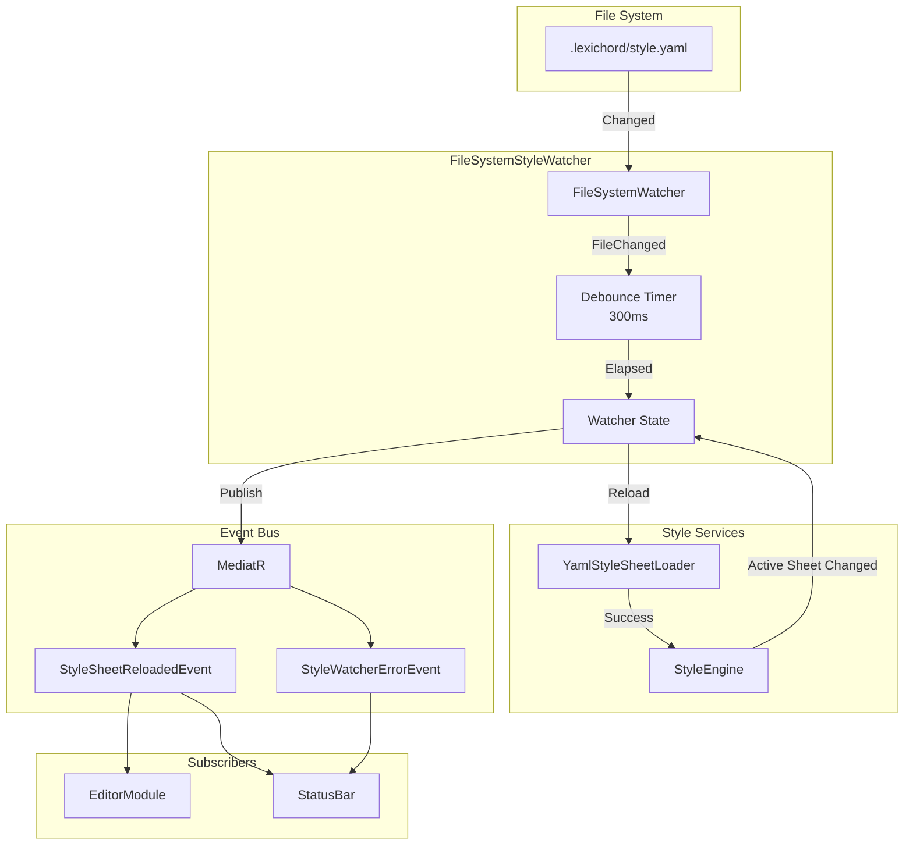
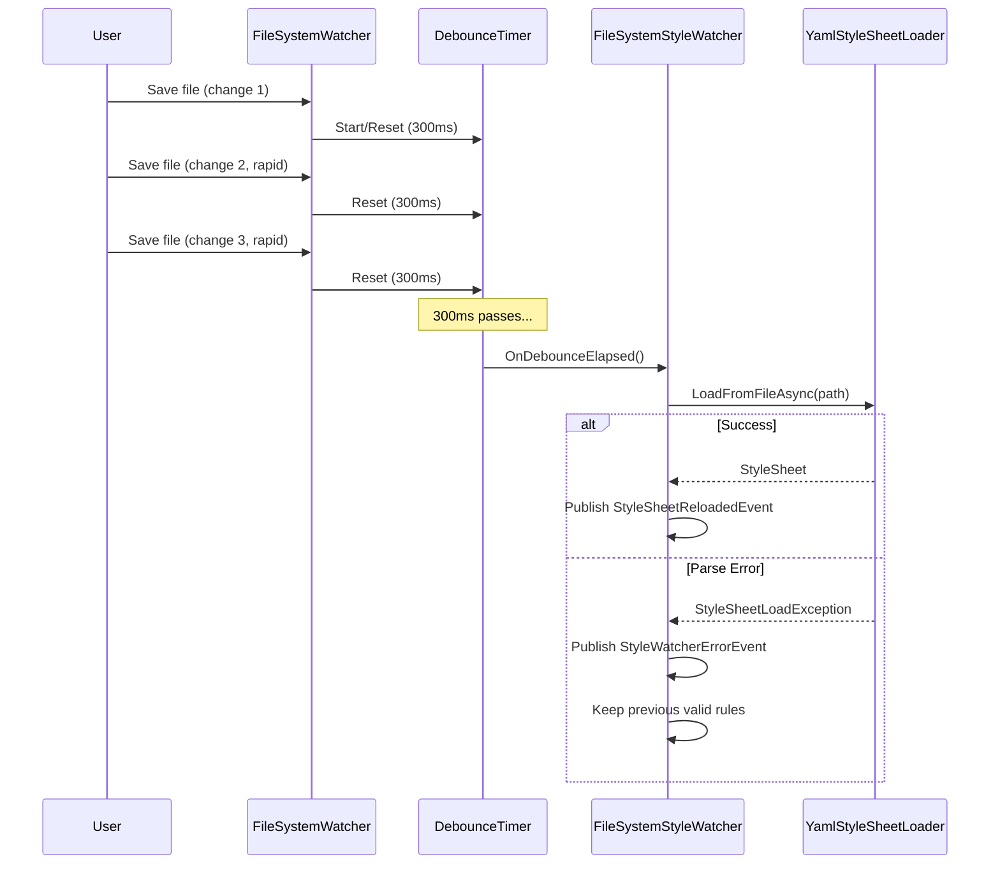

# LCS-DES-021d: Configuration Watcher — Live Reload for Style Rules

## 1. Metadata & Categorization

| Field                | Value                     | Description                                  |
| :------------------- | :------------------------ | :------------------------------------------- |
| **Document ID**      | LCS-DES-021d              | Design Specification v0.2.1d                 |
| **Feature ID**       | INF-021d                  | Configuration Watcher                        |
| **Feature Name**     | Configuration Watcher     | FileSystemWatcher for style.yaml auto-reload |
| **Target Version**   | `v0.2.1d`                 | Style Module Phase 1, Part D                 |
| **Module Scope**     | `Lexichord.Modules.Style` | Style governance module                      |
| **Swimlane**         | `Infrastructure`          | The Podium (Platform)                        |
| **License Tier**     | `WriterPro`               | Custom rules feature                         |
| **Feature Gate Key** | `Style.CustomRules`       | WriterPro: custom YAML with live reload      |
| **Author**           | System Architect          |                                              |
| **Status**           | **Draft**                 | Pending approval                             |
| **Last Updated**     | 2026-01-27                |                                              |

---

## 2. Executive Summary

### 2.1 The Requirement

WriterPro users can define custom style rules in `.lexichord/style.yaml`. For an optimal editing experience, changes to this file should be reflected immediately without restarting Lexichord:

- **Live Editing:** User edits YAML in external editor, sees results instantly.
- **Debouncing:** Rapid saves shouldn't trigger multiple reloads.
- **Error Handling:** Invalid YAML keeps previous rules active.
- **Event Publishing:** Other modules (Editor) need to know about reloads.

### 2.2 The Proposed Solution

We **SHALL** implement a file watching system with:

1. **IStyleConfigurationWatcher** — Interface for watching style configuration files.
2. **FileSystemStyleWatcher** — Implementation using `FileSystemWatcher` with debouncing.
3. **Event Integration** — Publish `StyleSheetReloadedEvent` via MediatR.
4. **Graceful Fallback** — Keep previous valid rules on error.

### 2.3 License Requirement

> [!NOTE]
> This feature requires **WriterPro** license tier.
> Core users cannot create custom rules, so they don't need file watching.

---

## 3. Architecture

### 3.1 Watcher Architecture



### 3.2 Debouncing Sequence



### 3.3 File Path Convention

```
<ProjectRoot>/
└── .lexichord/
    └── style.yaml          # User's custom style rules
```

The watcher monitors:

- `.lexichord/style.yaml` specifically (not other files)
- Created, Changed, Renamed events
- Deleted events (reverts to defaults)

---

## 4. Data Contracts

### 4.1 IStyleConfigurationWatcher Interface

```csharp
namespace Lexichord.Abstractions.Contracts;

/// <summary>
/// Service responsible for watching style configuration files for changes.
/// </summary>
/// <remarks>
/// LOGIC: The watcher enables "live editing" of style rules:
/// 1. User opens .lexichord/style.yaml in any text editor
/// 2. User makes changes and saves
/// 3. Watcher detects the change
/// 4. StyleSheetLoader reloads the file
/// 5. StyleEngine updates active rules
/// 6. Editor re-analyzes open documents
///
/// All this happens without restarting Lexichord.
///
/// License Requirement:
/// This feature requires WriterPro tier because:
/// - Core users cannot create custom rules
/// - File watching adds system resource overhead
/// - This is a power-user workflow
///
/// Thread Safety:
/// - All public methods are thread-safe
/// - Events are raised on a background thread
/// - Callers should marshal to UI thread if needed
/// </remarks>
[RequiresLicense(LicenseTier.WriterPro, FeatureCode = "Style.CustomRules")]
public interface IStyleConfigurationWatcher : IDisposable
{
    /// <summary>
    /// Starts watching for changes to the style configuration file.
    /// </summary>
    /// <param name="projectRoot">The project root directory.</param>
    /// <remarks>
    /// LOGIC: The watcher looks for `.lexichord/style.yaml` relative to projectRoot.
    ///
    /// Behavior:
    /// - If already watching, stops and starts watching the new path
    /// - Creates `.lexichord` directory if it doesn't exist
    /// - Does NOT create style.yaml if it doesn't exist
    /// - Watches for Create, Change, Rename, Delete events
    ///
    /// Events are debounced (default 300ms) to handle rapid saves.
    /// </remarks>
    /// <exception cref="InvalidOperationException">If license check fails.</exception>
    /// <exception cref="ArgumentException">If projectRoot is invalid.</exception>
    void StartWatching(string projectRoot);

    /// <summary>
    /// Stops watching for file changes.
    /// </summary>
    /// <remarks>
    /// LOGIC: Releases file system watcher resources.
    /// Safe to call multiple times or when not watching.
    /// </remarks>
    void StopWatching();

    /// <summary>
    /// Gets whether the watcher is currently active.
    /// </summary>
    bool IsWatching { get; }

    /// <summary>
    /// Gets the full path being watched, if active.
    /// </summary>
    /// <remarks>
    /// Returns null if not watching.
    /// </remarks>
    string? WatchedPath { get; }

    /// <summary>
    /// Gets or sets the debounce delay in milliseconds.
    /// </summary>
    /// <remarks>
    /// LOGIC: Default is 300ms. This prevents multiple reloads
    /// when users rapidly save while editing.
    ///
    /// Lower values = more responsive but more reloads.
    /// Higher values = fewer reloads but slower feedback.
    /// </remarks>
    int DebounceDelayMs { get; set; }

    /// <summary>
    /// Raised when the style file changes (after debouncing).
    /// </summary>
    /// <remarks>
    /// LOGIC: This event is raised AFTER the debounce delay.
    /// Subscribers receive the path and change type.
    ///
    /// This event is raised BEFORE the file is actually reloaded.
    /// Use StyleSheetReloadedEvent for post-reload notification.
    /// </remarks>
    event EventHandler<StyleFileChangedEventArgs>? FileChanged;

    /// <summary>
    /// Raised when a watcher error occurs.
    /// </summary>
    /// <remarks>
    /// LOGIC: Errors include:
    /// - File system watcher internal errors
    /// - Permission errors
    /// - Invalid YAML on reload
    ///
    /// The watcher attempts to continue watching after errors.
    /// </remarks>
    event EventHandler<StyleWatcherErrorEventArgs>? WatcherError;

    /// <summary>
    /// Forces an immediate reload of the style file.
    /// </summary>
    /// <returns>Task that completes when reload is done.</returns>
    /// <remarks>
    /// LOGIC: Bypasses debouncing for manual reload requests.
    /// Useful for "Reload Style Rules" command in UI.
    /// </remarks>
    Task ForceReloadAsync();
}

/// <summary>
/// Event arguments for style file change detection.
/// </summary>
public sealed class StyleFileChangedEventArgs : EventArgs
{
    /// <summary>
    /// Gets the full path to the changed file.
    /// </summary>
    public required string FilePath { get; init; }

    /// <summary>
    /// Gets the type of change detected.
    /// </summary>
    public required WatcherChangeTypes ChangeType { get; init; }

    /// <summary>
    /// Gets when the change was detected.
    /// </summary>
    public required DateTimeOffset DetectedAt { get; init; }
}

/// <summary>
/// Event arguments for watcher errors.
/// </summary>
public sealed class StyleWatcherErrorEventArgs : EventArgs
{
    /// <summary>
    /// Gets the exception that occurred.
    /// </summary>
    public required Exception Exception { get; init; }

    /// <summary>
    /// Gets the file path involved, if applicable.
    /// </summary>
    public string? FilePath { get; init; }

    /// <summary>
    /// Gets a human-readable error message.
    /// </summary>
    public required string Message { get; init; }

    /// <summary>
    /// Gets whether the watcher is still operational.
    /// </summary>
    /// <remarks>
    /// LOGIC: Some errors are recoverable (file parse error).
    /// Others are fatal (watcher buffer overflow).
    /// </remarks>
    public required bool IsRecoverable { get; init; }
}
```

### 4.2 Domain Events

```csharp
namespace Lexichord.Abstractions.Events;

/// <summary>
/// Raised when the style sheet is reloaded from the file system.
/// </summary>
/// <remarks>
/// LOGIC: This event is published via MediatR after a successful reload.
/// Handlers should:
/// - Re-analyze open documents (EditorModule)
/// - Update UI indicators (StatusBar)
/// - Log the reload (Diagnostics)
///
/// For failed reloads, StyleWatcherErrorEvent is raised instead.
/// </remarks>
public sealed record StyleSheetReloadedEvent : DomainEventBase
{
    /// <summary>
    /// Gets the file path that was reloaded.
    /// </summary>
    public required string FilePath { get; init; }

    /// <summary>
    /// Gets the number of rules in the new style sheet.
    /// </summary>
    public required int RuleCount { get; init; }

    /// <summary>
    /// Gets whether the reload was successful.
    /// </summary>
    public required bool IsSuccess { get; init; }

    /// <summary>
    /// Gets the error message if reload failed.
    /// </summary>
    public string? ErrorMessage { get; init; }

    /// <summary>
    /// Gets the number of rules that changed from previous sheet.
    /// </summary>
    /// <remarks>
    /// LOGIC: Calculated by comparing rule IDs and content.
    /// Useful for deciding whether to re-analyze documents.
    /// </remarks>
    public int ChangedRuleCount { get; init; }

    /// <summary>
    /// Gets how long the reload took.
    /// </summary>
    public TimeSpan ReloadDuration { get; init; }
}

/// <summary>
/// Raised when the style file is deleted.
/// </summary>
/// <remarks>
/// LOGIC: When the user deletes style.yaml, we revert to defaults.
/// This event notifies handlers of that reversion.
/// </remarks>
public sealed record StyleSheetRevertedToDefaultEvent : DomainEventBase
{
    /// <summary>
    /// Gets the path that was deleted.
    /// </summary>
    public required string DeletedPath { get; init; }

    /// <summary>
    /// Gets the number of rules in the default sheet.
    /// </summary>
    public required int DefaultRuleCount { get; init; }
}
```

### 4.3 FileSystemStyleWatcher Implementation

```csharp
namespace Lexichord.Modules.Style.Services;

using Lexichord.Abstractions.Contracts;
using Lexichord.Abstractions.Events;
using MediatR;
using Microsoft.Extensions.Logging;

/// <summary>
/// Watches for changes to .lexichord/style.yaml and triggers reloads.
/// </summary>
/// <remarks>
/// LOGIC: The FileSystemStyleWatcher is responsible for:
/// 1. Monitoring the file system for changes
/// 2. Debouncing rapid changes
/// 3. Triggering reloads via StyleSheetLoader
/// 4. Publishing events via MediatR
/// 5. Handling errors gracefully
///
/// Implementation Details:
/// - Uses FileSystemWatcher from System.IO
/// - Debounces using System.Threading.Timer
/// - Thread-safe via lock on _syncLock
/// - Disposes resources properly
///
/// Known FileSystemWatcher Quirks:
/// - May fire multiple events for single change (hence debouncing)
/// - Buffer can overflow on many rapid changes
/// - Behavior varies slightly across OS
/// </remarks>
public sealed class FileSystemStyleWatcher : IStyleConfigurationWatcher
{
    private readonly ILogger<FileSystemStyleWatcher> _logger;
    private readonly IStyleSheetLoader _loader;
    private readonly IStyleEngine _engine;
    private readonly IMediator _mediator;
    private readonly ILicenseContext _licenseContext;

    private readonly object _syncLock = new();
    private FileSystemWatcher? _watcher;
    private Timer? _debounceTimer;
    private string? _pendingChangePath;
    private WatcherChangeTypes _pendingChangeType;
    private bool _isDisposed;

    /// <summary>
    /// Relative path from project root to style file.
    /// </summary>
    private const string StyleFilePath = ".lexichord/style.yaml";

    /// <summary>
    /// Default debounce delay in milliseconds.
    /// </summary>
    private const int DefaultDebounceMs = 300;

    /// <inheritdoc/>
    public bool IsWatching { get; private set; }

    /// <inheritdoc/>
    public string? WatchedPath { get; private set; }

    /// <inheritdoc/>
    public int DebounceDelayMs { get; set; } = DefaultDebounceMs;

    /// <inheritdoc/>
    public event EventHandler<StyleFileChangedEventArgs>? FileChanged;

    /// <inheritdoc/>
    public event EventHandler<StyleWatcherErrorEventArgs>? WatcherError;

    public FileSystemStyleWatcher(
        ILogger<FileSystemStyleWatcher> logger,
        IStyleSheetLoader loader,
        IStyleEngine engine,
        IMediator mediator,
        ILicenseContext licenseContext)
    {
        _logger = logger;
        _loader = loader;
        _engine = engine;
        _mediator = mediator;
        _licenseContext = licenseContext;
    }

    /// <inheritdoc/>
    public void StartWatching(string projectRoot)
    {
        ThrowIfDisposed();

        // LOGIC: Verify license before starting
        var currentTier = _licenseContext.GetCurrentTier();
        if (currentTier < LicenseTier.WriterPro)
        {
            _logger.LogWarning(
                "Style file watching requires WriterPro license. Current tier: {Tier}",
                currentTier);
            throw new InvalidOperationException(
                "Style file watching requires WriterPro or higher license tier.");
        }

        if (string.IsNullOrWhiteSpace(projectRoot))
        {
            throw new ArgumentException("Project root cannot be empty.", nameof(projectRoot));
        }

        if (!Directory.Exists(projectRoot))
        {
            throw new ArgumentException($"Project root does not exist: {projectRoot}", nameof(projectRoot));
        }

        lock (_syncLock)
        {
            // LOGIC: Stop existing watcher if any
            StopWatchingInternal();

            var lexichordDir = Path.Combine(projectRoot, ".lexichord");
            var fullPath = Path.Combine(projectRoot, StyleFilePath);

            // LOGIC: Create .lexichord directory if needed
            if (!Directory.Exists(lexichordDir))
            {
                _logger.LogDebug("Creating .lexichord directory: {Path}", lexichordDir);
                Directory.CreateDirectory(lexichordDir);
            }

            WatchedPath = fullPath;

            try
            {
                // LOGIC: Watch the .lexichord directory for style.yaml changes
                _watcher = new FileSystemWatcher(lexichordDir)
                {
                    Filter = "style.yaml",
                    NotifyFilter = NotifyFilters.LastWrite
                                 | NotifyFilters.FileName
                                 | NotifyFilters.CreationTime,
                    EnableRaisingEvents = true
                };

                _watcher.Changed += OnFileSystemEvent;
                _watcher.Created += OnFileSystemEvent;
                _watcher.Deleted += OnFileSystemEvent;
                _watcher.Renamed += OnFileRenamed;
                _watcher.Error += OnWatcherError;

                IsWatching = true;

                _logger.LogInformation(
                    "Started watching for style file changes: {Path}",
                    fullPath);
            }
            catch (Exception ex)
            {
                _logger.LogError(ex, "Failed to start file watcher for: {Path}", fullPath);
                WatchedPath = null;
                throw;
            }
        }
    }

    /// <inheritdoc/>
    public void StopWatching()
    {
        lock (_syncLock)
        {
            StopWatchingInternal();
        }
    }

    private void StopWatchingInternal()
    {
        if (_watcher is not null)
        {
            _watcher.EnableRaisingEvents = false;
            _watcher.Changed -= OnFileSystemEvent;
            _watcher.Created -= OnFileSystemEvent;
            _watcher.Deleted -= OnFileSystemEvent;
            _watcher.Renamed -= OnFileRenamed;
            _watcher.Error -= OnWatcherError;
            _watcher.Dispose();
            _watcher = null;
        }

        _debounceTimer?.Dispose();
        _debounceTimer = null;

        if (IsWatching)
        {
            _logger.LogInformation("Stopped watching: {Path}", WatchedPath);
        }

        IsWatching = false;
        WatchedPath = null;
        _pendingChangePath = null;
    }

    /// <inheritdoc/>
    public async Task ForceReloadAsync()
    {
        ThrowIfDisposed();

        if (!IsWatching || WatchedPath is null)
        {
            _logger.LogWarning("Cannot force reload: watcher is not active");
            return;
        }

        _logger.LogInformation("Force reloading style file: {Path}", WatchedPath);
        await ReloadStyleFileAsync(WatchedPath, WatcherChangeTypes.Changed);
    }

    /// <summary>
    /// Handles file system events (Changed, Created, Deleted).
    /// </summary>
    private void OnFileSystemEvent(object sender, FileSystemEventArgs e)
    {
        _logger.LogDebug(
            "File system event: {ChangeType} - {Path}",
            e.ChangeType,
            e.FullPath);

        lock (_syncLock)
        {
            _pendingChangePath = e.FullPath;
            _pendingChangeType = e.ChangeType;
            ResetDebounceTimer();
        }
    }

    /// <summary>
    /// Handles file rename events.
    /// </summary>
    private void OnFileRenamed(object sender, RenamedEventArgs e)
    {
        _logger.LogDebug(
            "File renamed: {OldName} -> {NewName}",
            e.OldName,
            e.Name);

        // LOGIC: Treat rename as create or delete depending on names
        var changeType = e.Name == "style.yaml"
            ? WatcherChangeTypes.Created
            : WatcherChangeTypes.Deleted;

        lock (_syncLock)
        {
            _pendingChangePath = e.FullPath;
            _pendingChangeType = changeType;
            ResetDebounceTimer();
        }
    }

    /// <summary>
    /// Handles watcher internal errors.
    /// </summary>
    private void OnWatcherError(object sender, ErrorEventArgs e)
    {
        var ex = e.GetException();
        _logger.LogError(ex, "File system watcher error");

        var args = new StyleWatcherErrorEventArgs
        {
            Exception = ex,
            FilePath = WatchedPath,
            Message = $"File watcher error: {ex.Message}",
            IsRecoverable = ex is not InternalBufferOverflowException
        };

        OnWatcherError(args);

        // LOGIC: Try to recover from buffer overflow by restarting
        if (ex is InternalBufferOverflowException && WatchedPath is not null)
        {
            _logger.LogWarning("Attempting to restart watcher after buffer overflow");
            var projectRoot = Path.GetDirectoryName(Path.GetDirectoryName(WatchedPath));
            if (projectRoot is not null)
            {
                try
                {
                    StopWatchingInternal();
                    StartWatching(projectRoot);
                }
                catch (Exception restartEx)
                {
                    _logger.LogError(restartEx, "Failed to restart watcher");
                }
            }
        }
    }

    /// <summary>
    /// Resets the debounce timer.
    /// </summary>
    private void ResetDebounceTimer()
    {
        // LOGIC: Cancel existing timer and start new one
        _debounceTimer?.Dispose();
        _debounceTimer = new Timer(
            OnDebounceElapsed,
            state: null,
            dueTime: DebounceDelayMs,
            period: Timeout.Infinite);
    }

    /// <summary>
    /// Called when debounce timer elapses.
    /// </summary>
    private void OnDebounceElapsed(object? state)
    {
        string? path;
        WatcherChangeTypes changeType;

        lock (_syncLock)
        {
            path = _pendingChangePath;
            changeType = _pendingChangeType;
            _pendingChangePath = null;
        }

        if (path is null)
        {
            return;
        }

        _logger.LogDebug(
            "Debounce elapsed, processing: {ChangeType} - {Path}",
            changeType,
            path);

        // LOGIC: Raise FileChanged event before reloading
        OnFileChanged(new StyleFileChangedEventArgs
        {
            FilePath = path,
            ChangeType = changeType,
            DetectedAt = DateTimeOffset.UtcNow
        });

        // LOGIC: Reload on background thread
        _ = Task.Run(async () =>
        {
            try
            {
                await ReloadStyleFileAsync(path, changeType);
            }
            catch (Exception ex)
            {
                _logger.LogError(ex, "Error during style file reload");
            }
        });
    }

    /// <summary>
    /// Reloads the style file and updates the engine.
    /// </summary>
    private async Task ReloadStyleFileAsync(string path, WatcherChangeTypes changeType)
    {
        var stopwatch = System.Diagnostics.Stopwatch.StartNew();

        try
        {
            if (changeType == WatcherChangeTypes.Deleted)
            {
                await HandleFileDeletedAsync(path);
                return;
            }

            if (!File.Exists(path))
            {
                _logger.LogDebug("Style file does not exist yet: {Path}", path);
                return;
            }

            _logger.LogInformation("Reloading style file: {Path}", path);

            var previousSheet = _engine.GetActiveStyleSheet();
            var newSheet = await _loader.LoadFromFileAsync(path);

            _engine.SetActiveStyleSheet(newSheet);

            stopwatch.Stop();

            var changedCount = CountChangedRules(previousSheet, newSheet);

            await _mediator.Publish(new StyleSheetReloadedEvent
            {
                FilePath = path,
                RuleCount = newSheet.Rules.Count,
                IsSuccess = true,
                ChangedRuleCount = changedCount,
                ReloadDuration = stopwatch.Elapsed
            });

            _logger.LogInformation(
                "Style sheet reloaded: {RuleCount} rules ({ChangedCount} changed) in {Duration}ms",
                newSheet.Rules.Count,
                changedCount,
                stopwatch.ElapsedMilliseconds);
        }
        catch (StyleSheetLoadException ex)
        {
            stopwatch.Stop();

            _logger.LogWarning(
                "Failed to reload style sheet: {Message}. Keeping previous rules.",
                ex.Message);

            // LOGIC: Keep previous valid rules active
            var args = new StyleWatcherErrorEventArgs
            {
                Exception = ex,
                FilePath = path,
                Message = ex.Message,
                IsRecoverable = true
            };

            OnWatcherError(args);

            await _mediator.Publish(new StyleSheetReloadedEvent
            {
                FilePath = path,
                RuleCount = _engine.GetActiveStyleSheet().Rules.Count,
                IsSuccess = false,
                ErrorMessage = ex.Message,
                ReloadDuration = stopwatch.Elapsed
            });
        }
    }

    /// <summary>
    /// Handles the style file being deleted.
    /// </summary>
    private async Task HandleFileDeletedAsync(string deletedPath)
    {
        _logger.LogInformation(
            "Style file deleted, reverting to defaults: {Path}",
            deletedPath);

        var defaultSheet = await _loader.LoadEmbeddedDefaultAsync();
        _engine.SetActiveStyleSheet(defaultSheet);

        await _mediator.Publish(new StyleSheetRevertedToDefaultEvent
        {
            DeletedPath = deletedPath,
            DefaultRuleCount = defaultSheet.Rules.Count
        });
    }

    /// <summary>
    /// Counts rules that differ between two sheets.
    /// </summary>
    private static int CountChangedRules(StyleSheet previous, StyleSheet current)
    {
        var previousIds = previous.Rules.ToDictionary(r => r.Id, r => r);
        var changedCount = 0;

        foreach (var rule in current.Rules)
        {
            if (!previousIds.TryGetValue(rule.Id, out var prevRule))
            {
                changedCount++; // New rule
            }
            else if (!rule.Equals(prevRule))
            {
                changedCount++; // Modified rule
            }
        }

        // Count removed rules
        var currentIds = current.Rules.Select(r => r.Id).ToHashSet();
        changedCount += previousIds.Keys.Count(id => !currentIds.Contains(id));

        return changedCount;
    }

    /// <summary>
    /// Raises the FileChanged event.
    /// </summary>
    private void OnFileChanged(StyleFileChangedEventArgs args)
    {
        try
        {
            FileChanged?.Invoke(this, args);
        }
        catch (Exception ex)
        {
            _logger.LogError(ex, "Exception in FileChanged event handler");
        }
    }

    /// <summary>
    /// Raises the WatcherError event.
    /// </summary>
    private void OnWatcherError(StyleWatcherErrorEventArgs args)
    {
        try
        {
            WatcherError?.Invoke(this, args);
        }
        catch (Exception ex)
        {
            _logger.LogError(ex, "Exception in WatcherError event handler");
        }
    }

    private void ThrowIfDisposed()
    {
        if (_isDisposed)
        {
            throw new ObjectDisposedException(nameof(FileSystemStyleWatcher));
        }
    }

    /// <inheritdoc/>
    public void Dispose()
    {
        if (_isDisposed)
        {
            return;
        }

        lock (_syncLock)
        {
            StopWatchingInternal();
            _isDisposed = true;
        }
    }
}
```

---

## 5. Use Cases

### UC-01: Starting File Watcher (WriterPro)

**Preconditions:**

- User has WriterPro license.
- Style module is initializing.

**Flow:**

1. StyleModule calls `StartWatching(projectRoot)`.
2. Watcher verifies WriterPro license.
3. Creates `.lexichord` directory if needed.
4. Creates `FileSystemWatcher` for `style.yaml`.
5. Starts watching for changes.
6. Logs: "Started watching for style file changes".

**Postconditions:**

- `IsWatching` is true.
- `WatchedPath` is set to full path.

---

### UC-02: File Change with Debouncing

**Preconditions:**

- Watcher is active.
- User is editing style.yaml.

**Flow:**

1. User saves file (change 1).
2. FileSystemWatcher raises Changed event.
3. Watcher starts 300ms debounce timer.
4. User saves again at 100ms (change 2).
5. Watcher resets debounce timer.
6. User saves again at 200ms (change 3).
7. Watcher resets debounce timer.
8. 300ms passes with no more changes.
9. Timer fires, watcher reloads file once.
10. StyleEngine updates with new rules.
11. MediatR publishes StyleSheetReloadedEvent.

**Postconditions:**

- Only one reload occurred despite three saves.
- Active rules reflect final file state.

---

### UC-03: Invalid YAML on Reload

**Preconditions:**

- Watcher is active.
- Previous valid rules are loaded.
- User introduces YAML syntax error.

**Flow:**

1. User saves invalid YAML.
2. Watcher detects change, debounces.
3. After debounce, watcher calls loader.
4. Loader throws StyleSheetLoadException.
5. Watcher catches exception.
6. Previous valid rules remain active.
7. WatcherError event raised.
8. MediatR publishes StyleSheetReloadedEvent with IsSuccess=false.
9. User is notified of error (via UI).

**Postconditions:**

- Previous valid rules still active.
- User informed of the error.
- Watcher continues monitoring for fixes.

---

### UC-04: File Deleted

**Preconditions:**

- Watcher is active.
- Custom rules are loaded.
- User deletes style.yaml.

**Flow:**

1. User deletes `.lexichord/style.yaml`.
2. FileSystemWatcher raises Deleted event.
3. Watcher handles deletion.
4. Watcher loads embedded default rules.
5. StyleEngine set to default rules.
6. MediatR publishes StyleSheetRevertedToDefaultEvent.
7. User notified that defaults are active.

**Postconditions:**

- Core default rules are active.
- Watcher continues monitoring (will detect if file is recreated).

---

## 6. Observability & Logging

### 6.1 Log Events

| Level       | Source       | Message Template                                                                   |
| :---------- | :----------- | :--------------------------------------------------------------------------------- |
| Warning     | StyleWatcher | `Style file watching requires WriterPro license. Current tier: {Tier}`             |
| Debug       | StyleWatcher | `Creating .lexichord directory: {Path}`                                            |
| Information | StyleWatcher | `Started watching for style file changes: {Path}`                                  |
| Information | StyleWatcher | `Stopped watching: {Path}`                                                         |
| Debug       | StyleWatcher | `File system event: {ChangeType} - {Path}`                                         |
| Debug       | StyleWatcher | `File renamed: {OldName} -> {NewName}`                                             |
| Debug       | StyleWatcher | `Debounce elapsed, processing: {ChangeType} - {Path}`                              |
| Information | StyleWatcher | `Reloading style file: {Path}`                                                     |
| Information | StyleWatcher | `Force reloading style file: {Path}`                                               |
| Information | StyleWatcher | `Style sheet reloaded: {RuleCount} rules ({ChangedCount} changed) in {Duration}ms` |
| Warning     | StyleWatcher | `Failed to reload style sheet: {Message}. Keeping previous rules.`                 |
| Information | StyleWatcher | `Style file deleted, reverting to defaults: {Path}`                                |
| Error       | StyleWatcher | `File system watcher error`                                                        |
| Warning     | StyleWatcher | `Attempting to restart watcher after buffer overflow`                              |
| Error       | StyleWatcher | `Failed to restart watcher`                                                        |
| Error       | StyleWatcher | `Error during style file reload`                                                   |
| Error       | StyleWatcher | `Exception in FileChanged event handler`                                           |
| Error       | StyleWatcher | `Exception in WatcherError event handler`                                          |

---

## 7. Unit Testing Requirements

### 7.1 FileSystemStyleWatcher Tests

```csharp
[TestFixture]
[Category("Unit")]
public class FileSystemStyleWatcherTests
{
    private Mock<ILogger<FileSystemStyleWatcher>> _mockLogger = null!;
    private Mock<IStyleSheetLoader> _mockLoader = null!;
    private Mock<IStyleEngine> _mockEngine = null!;
    private Mock<IMediator> _mockMediator = null!;
    private Mock<ILicenseContext> _mockLicense = null!;
    private FileSystemStyleWatcher _sut = null!;
    private string _tempDir = null!;

    [SetUp]
    public void SetUp()
    {
        _mockLogger = new Mock<ILogger<FileSystemStyleWatcher>>();
        _mockLoader = new Mock<IStyleSheetLoader>();
        _mockEngine = new Mock<IStyleEngine>();
        _mockMediator = new Mock<IMediator>();
        _mockLicense = new Mock<ILicenseContext>();

        // Default to WriterPro license
        _mockLicense.Setup(x => x.GetCurrentTier())
            .Returns(LicenseTier.WriterPro);

        _mockEngine.Setup(x => x.GetActiveStyleSheet())
            .Returns(StyleSheet.Empty);

        _sut = new FileSystemStyleWatcher(
            _mockLogger.Object,
            _mockLoader.Object,
            _mockEngine.Object,
            _mockMediator.Object,
            _mockLicense.Object);

        _tempDir = Path.Combine(Path.GetTempPath(), Guid.NewGuid().ToString());
        Directory.CreateDirectory(_tempDir);
    }

    [TearDown]
    public void TearDown()
    {
        _sut?.Dispose();

        if (Directory.Exists(_tempDir))
        {
            Directory.Delete(_tempDir, recursive: true);
        }
    }

    [Test]
    public void StartWatching_ThrowsOnCoreLicense()
    {
        // Arrange
        _mockLicense.Setup(x => x.GetCurrentTier())
            .Returns(LicenseTier.Core);

        // Act & Assert
        Assert.Throws<InvalidOperationException>(
            () => _sut.StartWatching(_tempDir));
    }

    [Test]
    public void StartWatching_SetsIsWatching()
    {
        // Act
        _sut.StartWatching(_tempDir);

        // Assert
        Assert.That(_sut.IsWatching, Is.True);
    }

    [Test]
    public void StartWatching_SetsWatchedPath()
    {
        // Act
        _sut.StartWatching(_tempDir);

        // Assert
        var expectedPath = Path.Combine(_tempDir, ".lexichord", "style.yaml");
        Assert.That(_sut.WatchedPath, Is.EqualTo(expectedPath));
    }

    [Test]
    public void StartWatching_CreatesLexichordDirectory()
    {
        // Act
        _sut.StartWatching(_tempDir);

        // Assert
        var lexichordDir = Path.Combine(_tempDir, ".lexichord");
        Assert.That(Directory.Exists(lexichordDir), Is.True);
    }

    [Test]
    public void StopWatching_SetsIsWatchingFalse()
    {
        // Arrange
        _sut.StartWatching(_tempDir);

        // Act
        _sut.StopWatching();

        // Assert
        Assert.That(_sut.IsWatching, Is.False);
        Assert.That(_sut.WatchedPath, Is.Null);
    }

    [Test]
    public void StopWatching_CanBeCalledMultipleTimes()
    {
        // Arrange
        _sut.StartWatching(_tempDir);

        // Act & Assert - Should not throw
        _sut.StopWatching();
        _sut.StopWatching();
        _sut.StopWatching();
    }

    [Test]
    public void Dispose_StopsWatching()
    {
        // Arrange
        _sut.StartWatching(_tempDir);

        // Act
        _sut.Dispose();

        // Assert
        Assert.That(_sut.IsWatching, Is.False);
    }

    [Test]
    public void Dispose_CanBeCalledMultipleTimes()
    {
        // Act & Assert - Should not throw
        _sut.Dispose();
        _sut.Dispose();
    }

    [Test]
    public void StartWatching_ThrowsOnEmptyProjectRoot()
    {
        Assert.Throws<ArgumentException>(
            () => _sut.StartWatching(string.Empty));
    }

    [Test]
    public void StartWatching_ThrowsOnNonexistentProjectRoot()
    {
        var nonexistent = Path.Combine(_tempDir, "nonexistent");

        Assert.Throws<ArgumentException>(
            () => _sut.StartWatching(nonexistent));
    }

    [Test]
    public async Task ForceReloadAsync_CallsLoader()
    {
        // Arrange
        var styleFile = Path.Combine(_tempDir, ".lexichord", "style.yaml");
        Directory.CreateDirectory(Path.GetDirectoryName(styleFile)!);
        await File.WriteAllTextAsync(styleFile, "name: Test\nrules: []");

        var sheet = new StyleSheet("Test", new List<StyleRule>());
        _mockLoader.Setup(x => x.LoadFromFileAsync(styleFile, It.IsAny<CancellationToken>()))
            .ReturnsAsync(sheet);

        _sut.StartWatching(_tempDir);

        // Act
        await _sut.ForceReloadAsync();

        // Assert
        _mockLoader.Verify(
            x => x.LoadFromFileAsync(styleFile, It.IsAny<CancellationToken>()),
            Times.Once);
    }

    [Test]
    public void DebounceDelayMs_DefaultIs300()
    {
        Assert.That(_sut.DebounceDelayMs, Is.EqualTo(300));
    }

    [Test]
    public void DebounceDelayMs_CanBeChanged()
    {
        // Act
        _sut.DebounceDelayMs = 500;

        // Assert
        Assert.That(_sut.DebounceDelayMs, Is.EqualTo(500));
    }
}
```

### 7.2 Integration Tests with Real File System

```csharp
[TestFixture]
[Category("Integration")]
public class FileSystemStyleWatcherIntegrationTests
{
    // Note: These tests use real file system and timers
    // They may be slower and less deterministic

    private string _tempDir = null!;
    private FileSystemStyleWatcher _sut = null!;

    [SetUp]
    public void SetUp()
    {
        // Setup with real dependencies...
        _tempDir = Path.Combine(Path.GetTempPath(), Guid.NewGuid().ToString());
        Directory.CreateDirectory(_tempDir);
    }

    [TearDown]
    public void TearDown()
    {
        _sut?.Dispose();
        if (Directory.Exists(_tempDir))
        {
            Directory.Delete(_tempDir, recursive: true);
        }
    }

    [Test]
    public async Task FileChange_TriggersReload_AfterDebounce()
    {
        // This is an integration test that verifies the full flow
        // with real FileSystemWatcher and Timer

        // Arrange
        var reloadedTcs = new TaskCompletionSource<bool>();
        // ... setup watcher with event handler

        // Act
        // Write file, wait for debounce + processing

        // Assert
        // Verify reload happened
    }
}
```

---

## 8. Security & Safety

### 8.1 File System Safety

- **Path Validation:** Only watch within project root.
- **No Symlink Following:** Resolve symlinks explicitly.
- **Permission Errors:** Caught and reported via events.

### 8.2 Resource Management

- **Proper Disposal:** FileSystemWatcher and Timer disposed.
- **No Resource Leaks:** StopWatching cleans up everything.
- **Thread Safety:** All public methods synchronized.

---

## 9. Acceptance Criteria (QA)

| #   | Category       | Criterion                                       |
| :-- | :------------- | :---------------------------------------------- |
| 1   | **[License]**  | Watcher requires WriterPro license              |
| 2   | **[License]**  | Core tier cannot start watching                 |
| 3   | **[Start]**    | `StartWatching` creates `.lexichord` directory  |
| 4   | **[Start]**    | `StartWatching` sets `IsWatching` to true       |
| 5   | **[Start]**    | `StartWatching` sets `WatchedPath` correctly    |
| 6   | **[Stop]**     | `StopWatching` releases resources               |
| 7   | **[Debounce]** | Rapid changes are debounced                     |
| 8   | **[Debounce]** | Only one reload after rapid saves               |
| 9   | **[Reload]**   | Valid YAML updates StyleEngine                  |
| 10  | **[Reload]**   | Invalid YAML keeps previous rules               |
| 11  | **[Events]**   | `FileChanged` event raised on change            |
| 12  | **[Events]**   | `WatcherError` event raised on error            |
| 13  | **[Events]**   | `StyleSheetReloadedEvent` published via MediatR |
| 14  | **[Delete]**   | File deletion reverts to defaults               |
| 15  | **[Dispose]**  | `Dispose` cleans up all resources               |

---

## 10. Verification Commands

```bash
# 1. Create test project directory
mkdir -p /tmp/test-project/.lexichord

# 2. Create initial style file
cat > /tmp/test-project/.lexichord/style.yaml << 'EOF'
name: Test Style
rules:
  - id: test-rule
    name: Test Rule
    description: A test rule
    category: terminology
    pattern: test
EOF

# 3. Start Lexichord with WriterPro license
# (Verify watcher starts via logs)

# 4. Edit the style file
echo "  - id: new-rule" >> /tmp/test-project/.lexichord/style.yaml
# (Verify reload happens after debounce via logs)

# 5. Introduce syntax error
echo "[invalid yaml" >> /tmp/test-project/.lexichord/style.yaml
# (Verify error logged, previous rules kept)

# 6. Fix the error
# (Verify successful reload)

# 7. Delete the file
rm /tmp/test-project/.lexichord/style.yaml
# (Verify revert to defaults logged)

# 8. Run unit tests
dotnet test --filter "Category=Unit&FullyQualifiedName~StyleWatcher"

# 9. Run integration tests
dotnet test --filter "Category=Integration&FullyQualifiedName~StyleWatcher"
```

---

## 11. Deliverable Checklist

| Step | Description                                    | Status |
| :--- | :--------------------------------------------- | :----- |
| 1    | `IStyleConfigurationWatcher` interface defined | [ ]    |
| 2    | `StyleFileChangedEventArgs` defined            | [ ]    |
| 3    | `StyleWatcherErrorEventArgs` defined           | [ ]    |
| 4    | `StyleSheetReloadedEvent` defined              | [ ]    |
| 5    | `StyleSheetRevertedToDefaultEvent` defined     | [ ]    |
| 6    | `FileSystemStyleWatcher` implemented           | [ ]    |
| 7    | License check on `StartWatching`               | [ ]    |
| 8    | `.lexichord` directory creation                | [ ]    |
| 9    | FileSystemWatcher setup and events             | [ ]    |
| 10   | Debounce timer implementation                  | [ ]    |
| 11   | Reload logic with error handling               | [ ]    |
| 12   | File deletion handling                         | [ ]    |
| 13   | MediatR event publishing                       | [ ]    |
| 14   | Proper resource disposal                       | [ ]    |
| 15   | Unit tests for watcher passing                 | [ ]    |
| 16   | Integration tests for full flow passing        | [ ]    |
