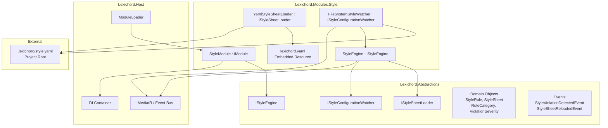
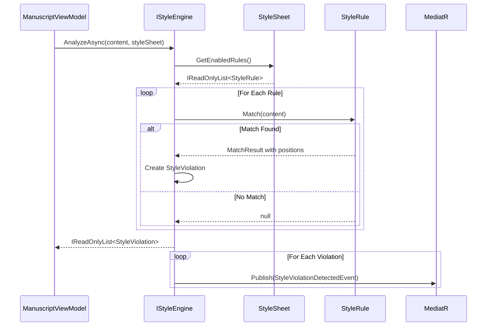
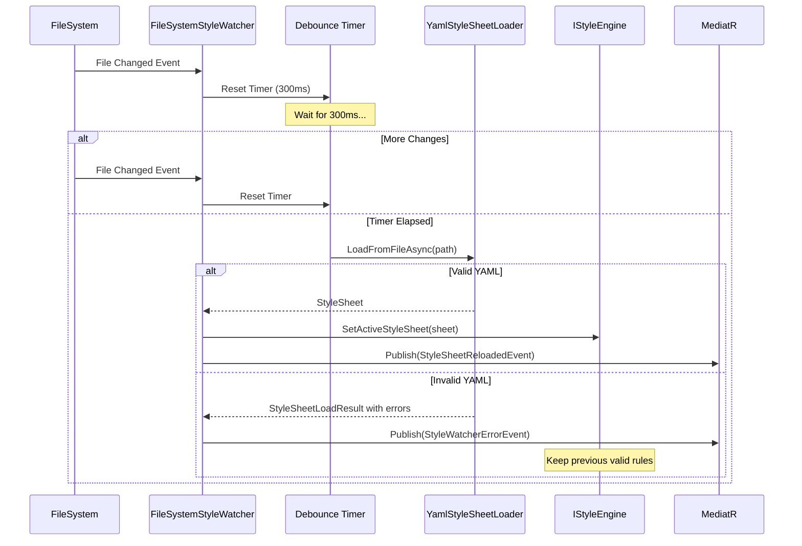

# LCS-INF-021: Feature Design Composition — The Rulebook (Style Module Genesis)

## 1. Metadata & Categorization

| Field                | Value                                       | Description                                          |
| :------------------- | :------------------------------------------ | :--------------------------------------------------- |
| **Feature ID**       | `INF-021`                                   | Infrastructure - Style Governance Foundation         |
| **Feature Name**     | The Rulebook (Style Module Genesis)         | Foundation for governed writing environment          |
| **Target Version**   | `v0.2.1`                                    | Style Module Phase 1                                 |
| **Module Scope**     | `Lexichord.Modules.Style`                   | Style governance module                              |
| **Swimlane**         | `Feature`                                   | The Symphony (Product Features)                      |
| **License Tier**     | `Core` / `WriterPro`                        | Core rules + custom rules                            |
| **Feature Gate Key** | `Style.CustomRules`                         | WriterPro: custom YAML rules                         |
| **Author**           | System Architect                            |                                                      |
| **Status**           | **Draft**                                   | Pending approval                                     |
| **Last Updated**     | 2026-01-26                                  |                                                      |

---

## 2. Executive Summary

### 2.1 The Requirement

Lexichord requires a **style governance system** that:

- Defines explicit writing rules as structured data.
- Loads rules from YAML configuration files.
- Detects violations in document content.
- Supports live reload when rule files change.
- Distinguishes Core rules (free) from custom rules (WriterPro).

Without this foundation:

- Writers have no automated style consistency.
- Organizations cannot enforce corporate writing standards.
- The AI assistant has no constraints for generated content.
- Lexichord remains "just another Markdown editor."

### 2.2 The Proposed Solution

We **SHALL** implement the Style Module Genesis with:

1. **v0.2.1a: Module Scaffolding** — Create `Lexichord.Modules.Style`, implement `IModule`, define `IStyleEngine`.
2. **v0.2.1b: Rule Object Model** — Define `StyleRule`, `RuleCategory`, `ViolationSeverity`, `StyleSheet`.
3. **v0.2.1c: YAML Deserializer** — Install YamlDotNet, implement `StyleSheetLoader`, embed default rules.
4. **v0.2.1d: Configuration Watcher** — `FileSystemWatcher` for `.lexichord/style.yaml` with auto-reload.

### 2.3 The Concordance Philosophy

This module embodies the core Lexichord philosophy:

> **"Rules over improvisation"** — Style is not suggested; it is enforced.

- **Explicit Rules:** Every style decision is codified in YAML.
- **Consistent Application:** Rules apply uniformly across all documents.
- **Customization Encouraged:** WriterPro users define their own rules.
- **Graceful Degradation:** Invalid rules don't crash; they're logged and skipped.

---

## 3. Architecture & Modular Strategy

### 3.1 High-Level Architecture



### 3.2 Style Analysis Sequence



### 3.3 Configuration Watcher Sequence



### 3.4 Dependencies

- **NuGet Packages:**

| Package        | Version | Purpose                        |
| :------------- | :------ | :----------------------------- |
| `YamlDotNet`   | 15.1.x  | YAML serialization/deserialization |

- **Project References:**

| Project                    | Reference Direction          |
| :------------------------- | :--------------------------- |
| `Lexichord.Modules.Style`  | → `Lexichord.Abstractions`   |
| `Lexichord.Abstractions`   | (No references)              |

### 3.5 Licensing Behavior

| Feature                  | Core | WriterPro | Teams | Enterprise |
|:-------------------------|:----:|:---------:|:-----:|:----------:|
| Embedded default rules   | Yes  | Yes       | Yes   | Yes        |
| Custom `.lexichord/style.yaml` | No | Yes | Yes | Yes |
| Live reload on file change | No | Yes | Yes | Yes |
| Rule inheritance (future) | No | No | Yes | Yes |
| Shared team rules (future) | No | No | Yes | Yes |

---

## 4. Decision Tree: Rule Loading Priority

```text
START: "Which rules should be active?"
|
+-- Does `.lexichord/style.yaml` exist in project root?
|   +-- NO → Use embedded lexichord.yaml (Core rules)
|   +-- YES → Continue
|
+-- Is the user's license WriterPro or higher?
|   +-- NO → Log warning, use embedded Core rules
|   +-- YES → Continue
|
+-- Is the YAML file valid?
|   +-- NO → Log errors, use embedded Core rules as fallback
|   +-- YES → Continue
|
+-- Does the YAML extend the default rules?
|   +-- "extends: default" → Merge custom rules with Core
|   +-- No extends directive → Use only custom rules
|
+-- Apply severity overrides from YAML
|
└── Final StyleSheet with active rules
```

---

## 5. Data Contracts

### 5.1 Core Interfaces (Lexichord.Abstractions)

```csharp
namespace Lexichord.Abstractions.Contracts;

/// <summary>
/// Service responsible for analyzing content against style rules.
/// </summary>
/// <remarks>
/// LOGIC: The StyleEngine is the orchestrator of style governance.
/// It holds the active StyleSheet and coordinates rule evaluation.
///
/// Design Principles:
/// - Stateless analysis: Same content + rules = same violations
/// - Non-blocking: Analysis runs on background thread
/// - Event-driven: Violations are published, not just returned
/// </remarks>
public interface IStyleEngine
{
    /// <summary>
    /// Analyzes content against the active style sheet.
    /// </summary>
    /// <param name="content">The document content to analyze.</param>
    /// <param name="cancellationToken">Cancellation token.</param>
    /// <returns>Collection of detected style violations.</returns>
    /// <remarks>
    /// LOGIC: Analysis is performed against the current active StyleSheet.
    /// If no custom sheet is loaded, embedded defaults are used.
    /// </remarks>
    Task<IReadOnlyList<StyleViolation>> AnalyzeAsync(
        string content,
        CancellationToken cancellationToken = default);

    /// <summary>
    /// Analyzes content against a specific style sheet.
    /// </summary>
    /// <param name="content">The document content to analyze.</param>
    /// <param name="styleSheet">The style sheet to use.</param>
    /// <param name="cancellationToken">Cancellation token.</param>
    /// <returns>Collection of detected style violations.</returns>
    Task<IReadOnlyList<StyleViolation>> AnalyzeAsync(
        string content,
        StyleSheet styleSheet,
        CancellationToken cancellationToken = default);

    /// <summary>
    /// Gets the currently active style sheet.
    /// </summary>
    /// <returns>The active StyleSheet.</returns>
    StyleSheet GetActiveStyleSheet();

    /// <summary>
    /// Sets the active style sheet for future analysis.
    /// </summary>
    /// <param name="styleSheet">The style sheet to activate.</param>
    /// <remarks>
    /// LOGIC: Triggers StyleSheetChanged event so listeners can re-analyze.
    /// </remarks>
    void SetActiveStyleSheet(StyleSheet styleSheet);

    /// <summary>
    /// Raised when the active style sheet changes.
    /// </summary>
    event EventHandler<StyleSheetChangedEventArgs>? StyleSheetChanged;
}

/// <summary>
/// Event args for style sheet changes.
/// </summary>
public sealed class StyleSheetChangedEventArgs : EventArgs
{
    /// <summary>The previous style sheet.</summary>
    public required StyleSheet? PreviousStyleSheet { get; init; }

    /// <summary>The new active style sheet.</summary>
    public required StyleSheet NewStyleSheet { get; init; }

    /// <summary>The source of the change.</summary>
    public required StyleSheetChangeSource Source { get; init; }
}

/// <summary>
/// Indicates how the style sheet was changed.
/// </summary>
public enum StyleSheetChangeSource
{
    /// <summary>Initial load at startup.</summary>
    InitialLoad,

    /// <summary>Reloaded from file system watcher.</summary>
    FileWatcher,

    /// <summary>Explicitly set via API.</summary>
    Programmatic
}
```

### 5.2 Style Sheet Loader Interface

```csharp
namespace Lexichord.Abstractions.Contracts;

/// <summary>
/// Service responsible for loading style sheets from various sources.
/// </summary>
/// <remarks>
/// LOGIC: The loader is source-agnostic. It can load from:
/// - Embedded resources (Core rules)
/// - File system (custom rules)
/// - Streams (for testing or future network sources)
///
/// Validation happens at load time. Invalid YAML never becomes a StyleSheet.
/// </remarks>
public interface IStyleSheetLoader
{
    /// <summary>
    /// Loads a style sheet from a file path.
    /// </summary>
    /// <param name="filePath">Path to the YAML file.</param>
    /// <param name="cancellationToken">Cancellation token.</param>
    /// <returns>The loaded style sheet.</returns>
    /// <exception cref="StyleSheetLoadException">If the file is invalid or not found.</exception>
    Task<StyleSheet> LoadFromFileAsync(
        string filePath,
        CancellationToken cancellationToken = default);

    /// <summary>
    /// Loads a style sheet from a stream.
    /// </summary>
    /// <param name="stream">The YAML content stream.</param>
    /// <param name="cancellationToken">Cancellation token.</param>
    /// <returns>The loaded style sheet.</returns>
    Task<StyleSheet> LoadFromStreamAsync(
        Stream stream,
        CancellationToken cancellationToken = default);

    /// <summary>
    /// Loads the embedded default style sheet.
    /// </summary>
    /// <param name="cancellationToken">Cancellation token.</param>
    /// <returns>The default Core style sheet.</returns>
    /// <remarks>
    /// LOGIC: This always succeeds. The embedded resource is validated at build time.
    /// </remarks>
    Task<StyleSheet> LoadEmbeddedDefaultAsync(
        CancellationToken cancellationToken = default);

    /// <summary>
    /// Validates YAML content without loading it.
    /// </summary>
    /// <param name="yamlContent">The YAML string to validate.</param>
    /// <returns>Validation result with any errors.</returns>
    StyleSheetLoadResult ValidateYaml(string yamlContent);
}

/// <summary>
/// Result of style sheet loading or validation.
/// </summary>
public sealed record StyleSheetLoadResult
{
    /// <summary>Whether the operation succeeded.</summary>
    public required bool IsSuccess { get; init; }

    /// <summary>The loaded style sheet, if successful.</summary>
    public StyleSheet? StyleSheet { get; init; }

    /// <summary>Validation or parse errors, if any.</summary>
    public IReadOnlyList<StyleSheetError> Errors { get; init; } = [];

    /// <summary>Warnings that don't prevent loading.</summary>
    public IReadOnlyList<StyleSheetWarning> Warnings { get; init; } = [];
}

/// <summary>
/// Represents an error in a style sheet file.
/// </summary>
public sealed record StyleSheetError(
    string Message,
    int? Line,
    int? Column,
    string? RuleId);

/// <summary>
/// Represents a warning in a style sheet file.
/// </summary>
public sealed record StyleSheetWarning(
    string Message,
    int? Line,
    string? RuleId);
```

### 5.3 Configuration Watcher Interface

```csharp
namespace Lexichord.Abstractions.Contracts;

/// <summary>
/// Service responsible for watching style configuration files for changes.
/// </summary>
/// <remarks>
/// LOGIC: The watcher enables the "live editing" workflow:
/// 1. User edits .lexichord/style.yaml
/// 2. Watcher detects the change
/// 3. StyleSheetLoader reloads the file
/// 4. StyleEngine updates active rules
/// 5. Document is re-analyzed with new rules
///
/// All this happens without restarting the application.
///
/// License: This feature requires WriterPro tier because:
/// - Core users can't create custom rules anyway
/// - The watcher adds file system overhead
/// - It's a power-user workflow
/// </remarks>
[RequiresLicense(LicenseTier.WriterPro, FeatureCode = "Style.CustomRules")]
public interface IStyleConfigurationWatcher : IDisposable
{
    /// <summary>
    /// Starts watching for changes to the style file.
    /// </summary>
    /// <param name="projectRoot">The project root directory.</param>
    /// <remarks>
    /// LOGIC: Watches for `.lexichord/style.yaml` relative to projectRoot.
    /// Creates the directory if it doesn't exist.
    /// </remarks>
    void StartWatching(string projectRoot);

    /// <summary>
    /// Stops watching for file changes.
    /// </summary>
    void StopWatching();

    /// <summary>
    /// Gets whether the watcher is currently active.
    /// </summary>
    bool IsWatching { get; }

    /// <summary>
    /// Gets the full path being watched, if active.
    /// </summary>
    string? WatchedPath { get; }

    /// <summary>
    /// Raised when the style file changes (after debouncing).
    /// </summary>
    event EventHandler<StyleFileChangedEventArgs>? FileChanged;

    /// <summary>
    /// Raised when a watcher error occurs.
    /// </summary>
    event EventHandler<StyleWatcherErrorEventArgs>? WatcherError;
}

/// <summary>
/// Event args for style file changes.
/// </summary>
public sealed class StyleFileChangedEventArgs : EventArgs
{
    /// <summary>The full path to the changed file.</summary>
    public required string FilePath { get; init; }

    /// <summary>The type of change detected.</summary>
    public required WatcherChangeTypes ChangeType { get; init; }

    /// <summary>When the change was detected.</summary>
    public required DateTimeOffset DetectedAt { get; init; }
}

/// <summary>
/// Event args for watcher errors.
/// </summary>
public sealed class StyleWatcherErrorEventArgs : EventArgs
{
    /// <summary>The error that occurred.</summary>
    public required Exception Exception { get; init; }

    /// <summary>The file path involved, if applicable.</summary>
    public string? FilePath { get; init; }

    /// <summary>Human-readable error message.</summary>
    public required string Message { get; init; }
}
```

---

## 6. Domain Events

### 6.1 Style Violation Detected Event

```csharp
namespace Lexichord.Abstractions.Events;

/// <summary>
/// Raised when a style violation is detected during analysis.
/// </summary>
/// <remarks>
/// LOGIC: This event enables decoupled reactions to violations:
/// - Editor module: Shows squiggle underline
/// - Status bar: Updates violation count
/// - Analytics: Tracks common violations
/// - AI Assistant: Learns user's writing patterns
/// </remarks>
public sealed record StyleViolationDetectedEvent : DomainEventBase
{
    /// <summary>The document where the violation was found.</summary>
    public required string DocumentId { get; init; }

    /// <summary>The detected violation.</summary>
    public required StyleViolation Violation { get; init; }

    /// <summary>The rule that triggered the violation.</summary>
    public required string RuleId { get; init; }
}
```

### 6.2 Style Sheet Reloaded Event

```csharp
namespace Lexichord.Abstractions.Events;

/// <summary>
/// Raised when the style sheet is reloaded from the file system.
/// </summary>
/// <remarks>
/// LOGIC: Handlers should re-analyze open documents when this fires.
/// </remarks>
public sealed record StyleSheetReloadedEvent : DomainEventBase
{
    /// <summary>The file path that was reloaded.</summary>
    public required string FilePath { get; init; }

    /// <summary>Number of rules in the new style sheet.</summary>
    public required int RuleCount { get; init; }

    /// <summary>Whether the reload was successful.</summary>
    public required bool IsSuccess { get; init; }

    /// <summary>Error message if reload failed.</summary>
    public string? ErrorMessage { get; init; }
}
```

---

## 7. Use Cases & User Stories

### 7.1 User Stories

| ID    | Role        | Story                                                                                    | Acceptance Criteria                                   |
| :---- | :---------- | :--------------------------------------------------------------------------------------- | :---------------------------------------------------- |
| US-01 | Core User   | As a free user, I want style rules applied automatically.                                | Embedded rules detect violations without configuration. |
| US-02 | WriterPro   | As a WriterPro user, I want to define custom style rules.                                | `.lexichord/style.yaml` is loaded and applied.        |
| US-03 | WriterPro   | As a WriterPro user, I want rules to reload when I edit the YAML.                        | File changes trigger automatic reload.                 |
| US-04 | Developer   | As a developer, I want invalid YAML to fail gracefully.                                  | Errors are logged; previous rules remain active.       |
| US-05 | Writer      | As a writer, I want to see why text is flagged.                                          | Violations include rule name and suggestion.           |
| US-06 | Core User   | As a free user, I want to know custom rules require upgrade.                             | Attempting custom rules shows upgrade prompt.          |

### 7.2 Use Cases

#### UC-01: Initial Rule Loading

**Preconditions:**
- Lexichord starts with Style module.
- No `.lexichord/style.yaml` exists.

**Flow:**
1. StyleModule initializes.
2. StyleEngine requests active StyleSheet.
3. StyleSheetLoader loads embedded `lexichord.yaml`.
4. StyleEngine sets active rules (25+ Core rules).
5. Log: "Style engine initialized with 27 Core rules."

**Postconditions:**
- Analysis uses embedded Core rules.
- No file watcher is started (Core user).

---

#### UC-02: Custom Rules (WriterPro)

**Preconditions:**
- User has WriterPro license.
- `.lexichord/style.yaml` exists with valid rules.

**Flow:**
1. StyleModule detects WriterPro license.
2. FileSystemStyleWatcher starts watching project root.
3. StyleSheetLoader loads `.lexichord/style.yaml`.
4. Loader validates YAML schema.
5. StyleEngine sets active rules from custom file.
6. Log: "Loaded 42 custom rules from .lexichord/style.yaml."

**Postconditions:**
- Analysis uses custom rules.
- File watcher monitors for changes.

---

#### UC-03: Live Reload on YAML Change

**Preconditions:**
- WriterPro user has custom rules loaded.
- File watcher is active.

**Flow:**
1. User edits `.lexichord/style.yaml` in external editor.
2. FileSystemWatcher fires Changed event.
3. Watcher starts 300ms debounce timer.
4. User saves again within 300ms (timer resets).
5. After 300ms of no changes, timer fires.
6. StyleSheetLoader reloads the file.
7. YAML is valid; StyleEngine updates active rules.
8. MediatR publishes StyleSheetReloadedEvent.
9. EditorModule re-analyzes open documents.

**Postconditions:**
- New rules are active.
- Documents show updated violations.

---

#### UC-04: Invalid YAML Handling

**Preconditions:**
- WriterPro user editing `.lexichord/style.yaml`.
- User introduces syntax error.

**Flow:**
1. User saves invalid YAML.
2. Watcher detects change, debounces, reloads.
3. YamlDotNet throws parse exception.
4. StyleSheetLoader catches, creates error result.
5. Log Warning: "Style reload failed: Unexpected token at line 42."
6. MediatR publishes StyleSheetReloadedEvent with IsSuccess=false.
7. StyleEngine keeps previous valid rules.
8. UI shows toast: "Style rules reload failed. Check syntax."

**Postconditions:**
- Previous valid rules remain active.
- User is informed of the error.
- No crash or loss of functionality.

---

## 8. Observability & Logging

### 8.1 Log Events

| Level       | Source           | Message Template                                                              |
| :---------- | :--------------- | :---------------------------------------------------------------------------- |
| Information | StyleModule      | `Style module initializing with license tier: {Tier}`                         |
| Information | StyleModule      | `Style engine initialized with {RuleCount} rules`                             |
| Debug       | StyleEngine      | `Analyzing document {DocumentId} with {RuleCount} active rules`               |
| Debug       | StyleEngine      | `Found {ViolationCount} violations in document {DocumentId}`                  |
| Information | StyleEngine      | `Active style sheet changed from {Previous} to {New}`                         |
| Debug       | StyleSheetLoader | `Loading style sheet from: {FilePath}`                                        |
| Information | StyleSheetLoader | `Loaded {RuleCount} rules from {Source}`                                      |
| Warning     | StyleSheetLoader | `Style sheet validation warning: {Message} at line {Line}`                    |
| Error       | StyleSheetLoader | `Failed to load style sheet: {Error}`                                         |
| Information | StyleWatcher     | `Started watching: {Path}`                                                    |
| Information | StyleWatcher     | `Stopped watching: {Path}`                                                    |
| Debug       | StyleWatcher     | `File change detected, starting debounce: {Path}`                             |
| Debug       | StyleWatcher     | `Debounce reset, change: {ChangeType}`                                        |
| Information | StyleWatcher     | `Debounce elapsed, reloading: {Path}`                                         |
| Warning     | StyleWatcher     | `Watcher error: {Message}`                                                    |

### 8.2 Metrics (Future)

| Metric                        | Type    | Labels                        |
|:------------------------------|:--------|:------------------------------|
| `lexichord_style_rules_total` | Gauge   | `source` (embedded/custom)    |
| `lexichord_style_analysis_duration_ms` | Histogram | `document_size_bucket` |
| `lexichord_style_violations_total` | Counter | `severity`, `category`      |
| `lexichord_style_reload_count` | Counter | `success` (true/false)       |

---

## 9. Security & Safety

### 9.1 YAML Security

> [!WARNING]
> **YAML deserialization can be dangerous.** YamlDotNet is safe by default,
> but we enforce additional restrictions.

```csharp
// LOGIC: Disable dangerous YAML features
var deserializer = new DeserializerBuilder()
    .WithNamingConvention(CamelCaseNamingConvention.Instance)
    .IgnoreUnmatchedProperties() // Don't fail on unknown fields
    .Build();

// LOGIC: Never deserialize arbitrary types from YAML
// Only deserialize into our known StyleSheet structure
```

### 9.2 Regex Pattern Security

> [!IMPORTANT]
> **User-defined regex patterns can cause ReDoS.** All patterns are:
> - Compiled with timeout
> - Complexity-limited
> - Sandboxed during evaluation

```csharp
// LOGIC: Pattern execution timeout prevents ReDoS
private static readonly TimeSpan PatternTimeout = TimeSpan.FromMilliseconds(100);

private Regex CompilePattern(string pattern)
{
    return new Regex(
        pattern,
        RegexOptions.Compiled | RegexOptions.CultureInvariant,
        PatternTimeout);
}
```

### 9.3 File System Security

- **Path Validation:** Only watch files under project root.
- **Symlink Handling:** Resolve symlinks; don't follow outside project.
- **No Execution:** YAML is parsed, never executed.

---

## 10. Risks & Mitigations

| Risk                                  | Impact | Mitigation                                                |
| :------------------------------------ | :----- | :-------------------------------------------------------- |
| YamlDotNet version conflicts          | High   | Pin version in Directory.Build.props                      |
| Regex patterns cause ReDoS            | High   | Compile with 100ms timeout; complexity scoring            |
| File watcher misses changes           | Medium | Also check on window focus; manual reload option          |
| Large YAML files slow startup         | Medium | Async loading; progress indicator                         |
| Invalid regex in YAML                 | Medium | Validate patterns at load time; skip invalid with warning |
| Concurrent YAML edits corrupt file    | Low    | File system handles this; we just reload what's there     |
| User expects rules to apply retroactively | Low | Document that re-analysis is needed; auto-trigger option |

---

## 11. Acceptance Criteria (QA)

| #   | Category           | Criterion                                                                     |
| :-- | :----------------- | :---------------------------------------------------------------------------- |
| 1   | **[Module]**       | `Lexichord.Modules.Style` loads via ModuleLoader                              |
| 2   | **[Module]**       | `IStyleEngine` is resolvable from DI container                                |
| 3   | **[Rules]**        | Embedded `lexichord.yaml` contains 25+ rules                                  |
| 4   | **[Rules]**        | Each rule has: id, name, description, category, severity, pattern             |
| 5   | **[Loading]**      | YAML files load without error when schema is valid                            |
| 6   | **[Loading]**      | Invalid YAML returns structured errors, not exceptions                        |
| 7   | **[Analysis]**     | `AnalyzeAsync` returns violations matching rule patterns                      |
| 8   | **[Analysis]**     | Analysis completes in <200ms for 1000-line document                           |
| 9   | **[Watcher]**      | File changes trigger reload within 500ms (after debounce)                     |
| 10  | **[Watcher]**      | Rapid changes are coalesced (debouncing works)                                |
| 11  | **[Watcher]**      | Invalid YAML on reload keeps previous rules active                            |
| 12  | **[Events]**       | `StyleViolationDetectedEvent` is published for each violation                 |
| 13  | **[Events]**       | `StyleSheetReloadedEvent` is published on file reload                         |
| 14  | **[License]**      | Custom rules require WriterPro license                                        |
| 15  | **[License]**      | Core users get embedded rules only                                            |

---

## 12. Verification Commands

```bash
# 1. Build the solution including Style module
dotnet build

# 2. Verify Style DLL is in Modules directory
ls bin/Debug/net9.0/Modules/ | grep Style

# 3. Verify YamlDotNet package is installed
dotnet list src/Lexichord.Modules.Style package | grep YamlDotNet

# 4. Verify embedded resource exists
dotnet build src/Lexichord.Modules.Style
unzip -l src/Lexichord.Modules.Style/bin/Debug/net9.0/Lexichord.Modules.Style.dll | grep yaml

# 5. Run the application and check logs
dotnet run --project src/Lexichord.Host
# Look for: "Style module initializing..."
# Look for: "Style engine initialized with X rules"

# 6. Run unit tests
dotnet test --filter "Category=Unit&FullyQualifiedName~Style"

# 7. Run integration tests
dotnet test --filter "Category=Integration&FullyQualifiedName~Style"

# 8. Test file watcher (manual)
# Create .lexichord/style.yaml in test project
# Edit the file and verify reload logs appear
```

---

## 13. Deliverable Checklist

| Step | Description                                                                    | Status |
| :--- | :----------------------------------------------------------------------------- | :----- |
| 1    | `Lexichord.Modules.Style` project created                                      | [ ]    |
| 2    | Project references `Lexichord.Abstractions` only                               | [ ]    |
| 3    | Project outputs to `./Modules/` directory                                      | [ ]    |
| 4    | `StyleModule : IModule` implemented                                            | [ ]    |
| 5    | `IStyleEngine` interface defined in Abstractions                               | [ ]    |
| 6    | `StyleRule`, `StyleSheet` domain objects defined                               | [ ]    |
| 7    | `RuleCategory`, `ViolationSeverity` enums defined                              | [ ]    |
| 8    | `StyleViolation` record defined                                                | [ ]    |
| 9    | `YamlDotNet` package installed                                                 | [ ]    |
| 10   | `IStyleSheetLoader` interface defined                                          | [ ]    |
| 11   | `YamlStyleSheetLoader` implemented                                             | [ ]    |
| 12   | `lexichord.yaml` embedded resource created with 25+ rules                      | [ ]    |
| 13   | YAML validation implemented with error reporting                               | [ ]    |
| 14   | `IStyleConfigurationWatcher` interface defined                                 | [ ]    |
| 15   | `FileSystemStyleWatcher` implemented with debouncing                           | [ ]    |
| 16   | `StyleViolationDetectedEvent` defined                                          | [ ]    |
| 17   | `StyleSheetReloadedEvent` defined                                              | [ ]    |
| 18   | License check for custom rules implemented                                     | [ ]    |
| 19   | Unit tests for domain objects passing                                          | [ ]    |
| 20   | Unit tests for YAML loader passing                                             | [ ]    |
| 21   | Unit tests for file watcher passing                                            | [ ]    |
| 22   | Integration tests for Style module passing                                     | [ ]    |
