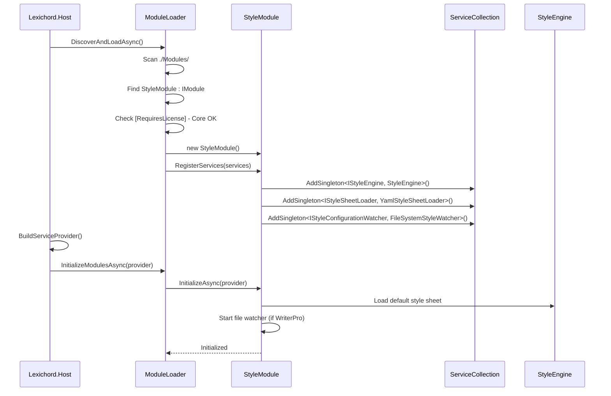

# LCS-INF-021a: Module Scaffolding — Style Module Foundation

## 1. Metadata & Categorization

| Field                | Value                                       | Description                                          |
| :------------------- | :------------------------------------------ | :--------------------------------------------------- |
| **Feature ID**       | `INF-021a`                                  | Style Module Scaffolding                             |
| **Feature Name**     | Module Scaffolding                          | Create Style module project structure                |
| **Target Version**   | `v0.2.1a`                                   | Style Module Phase 1, Part A                         |
| **Module Scope**     | `Lexichord.Modules.Style`                   | Style governance module                              |
| **Swimlane**         | `Infrastructure`                            | The Podium (Platform)                                |
| **License Tier**     | `Core`                                      | Foundation infrastructure                            |
| **Feature Gate Key** | N/A                                         | No runtime gating for module scaffolding             |
| **Author**           | System Architect                            |                                                      |
| **Status**           | **Draft**                                   | Pending approval                                     |
| **Last Updated**     | 2026-01-26                                  |                                                      |

---

## 2. Executive Summary

### 2.1 The Requirement

The Style Module needs a proper foundation:

- A new class library project following Lexichord conventions.
- Proper project references (Abstractions only).
- Output configuration to the `./Modules/` directory.
- Implementation of the `IModule` interface for lifecycle management.
- Core interface definitions in Abstractions for loose coupling.

### 2.2 The Proposed Solution

We **SHALL** create the `Lexichord.Modules.Style` project with:

1. **Project Structure** — Class library targeting net9.0.
2. **Project References** — Only `Lexichord.Abstractions`.
3. **Output Path** — Configured to output to `./Modules/`.
4. **Module Implementation** — `StyleModule : IModule` with proper lifecycle.
5. **Interface Definition** — `IStyleEngine` in Abstractions.

---

## 3. Architecture

### 3.1 Project Structure

```
Lexichord/
├── src/
│   ├── Lexichord.Abstractions/
│   │   └── Contracts/
│   │       ├── IStyleEngine.cs          # NEW
│   │       ├── IStyleSheetLoader.cs     # NEW
│   │       └── IStyleConfigurationWatcher.cs  # NEW
│   ├── Lexichord.Host/
│   └── Lexichord.Modules.Style/         # NEW PROJECT
│       ├── Lexichord.Modules.Style.csproj
│       ├── StyleModule.cs
│       ├── Services/
│       │   └── StyleEngine.cs
│       ├── Domain/
│       │   ├── StyleRule.cs
│       │   ├── StyleSheet.cs
│       │   └── StyleViolation.cs
│       └── Resources/
│           └── lexichord.yaml           # Embedded
└── Modules/                              # OUTPUT DIRECTORY
    └── Lexichord.Modules.Style.dll
```

### 3.2 Module Lifecycle Sequence



---

## 4. Data Contracts

### 4.1 IStyleEngine Interface (Lexichord.Abstractions)

```csharp
namespace Lexichord.Abstractions.Contracts;

using Lexichord.Abstractions.Domain;

/// <summary>
/// Service responsible for analyzing content against style rules.
/// </summary>
/// <remarks>
/// LOGIC: The StyleEngine is the orchestrator of style governance.
/// It holds the active StyleSheet and coordinates rule evaluation.
///
/// The engine is stateful (holds current StyleSheet) but analysis
/// is stateless (same input = same output).
///
/// Thread Safety:
/// - GetActiveStyleSheet() is thread-safe
/// - SetActiveStyleSheet() is thread-safe (uses lock)
/// - AnalyzeAsync() can be called concurrently
///
/// Example Usage:
/// <code>
/// var engine = serviceProvider.GetRequiredService&lt;IStyleEngine&gt;();
/// var violations = await engine.AnalyzeAsync(documentContent);
/// foreach (var v in violations)
/// {
///     Console.WriteLine($"{v.Rule.Name}: {v.Message} at {v.StartOffset}");
/// }
/// </code>
/// </remarks>
public interface IStyleEngine
{
    /// <summary>
    /// Analyzes content against the active style sheet.
    /// </summary>
    /// <param name="content">The document content to analyze.</param>
    /// <param name="cancellationToken">Cancellation token.</param>
    /// <returns>Collection of detected style violations.</returns>
    /// <remarks>
    /// LOGIC: This overload uses the currently active StyleSheet.
    /// If no sheet is loaded, the embedded default is used.
    ///
    /// Performance: For documents under 10,000 characters,
    /// analysis completes in under 50ms on modern hardware.
    /// </remarks>
    Task<IReadOnlyList<StyleViolation>> AnalyzeAsync(
        string content,
        CancellationToken cancellationToken = default);

    /// <summary>
    /// Analyzes content against a specific style sheet.
    /// </summary>
    /// <param name="content">The document content to analyze.</param>
    /// <param name="styleSheet">The style sheet to use for analysis.</param>
    /// <param name="cancellationToken">Cancellation token.</param>
    /// <returns>Collection of detected style violations.</returns>
    /// <remarks>
    /// LOGIC: This overload allows analysis with a different sheet
    /// without changing the active sheet. Useful for:
    /// - Testing rules before activation
    /// - Comparing results across different sheets
    /// - Preview during YAML editing
    /// </remarks>
    Task<IReadOnlyList<StyleViolation>> AnalyzeAsync(
        string content,
        StyleSheet styleSheet,
        CancellationToken cancellationToken = default);

    /// <summary>
    /// Gets the currently active style sheet.
    /// </summary>
    /// <returns>The active StyleSheet instance.</returns>
    /// <remarks>
    /// LOGIC: Never returns null. If no custom sheet is loaded,
    /// returns the embedded default Core rules.
    /// </remarks>
    StyleSheet GetActiveStyleSheet();

    /// <summary>
    /// Sets the active style sheet for future analysis.
    /// </summary>
    /// <param name="styleSheet">The style sheet to activate.</param>
    /// <remarks>
    /// LOGIC: This triggers the StyleSheetChanged event, allowing
    /// listeners (like the Editor) to re-analyze open documents.
    ///
    /// Thread Safety: This method is thread-safe. If called from
    /// multiple threads, changes are serialized.
    /// </remarks>
    void SetActiveStyleSheet(StyleSheet styleSheet);

    /// <summary>
    /// Raised when the active style sheet changes.
    /// </summary>
    /// <remarks>
    /// LOGIC: Handlers should be lightweight. If re-analysis is needed,
    /// schedule it on a background thread.
    ///
    /// Event is raised on the thread that called SetActiveStyleSheet().
    /// </remarks>
    event EventHandler<StyleSheetChangedEventArgs>? StyleSheetChanged;
}

/// <summary>
/// Event arguments for style sheet changes.
/// </summary>
/// <remarks>
/// LOGIC: Contains both old and new sheets for comparison.
/// Source indicates why the change happened (for logging/UI).
/// </remarks>
public sealed class StyleSheetChangedEventArgs : EventArgs
{
    /// <summary>
    /// Gets the previous style sheet (null on initial load).
    /// </summary>
    public StyleSheet? PreviousStyleSheet { get; init; }

    /// <summary>
    /// Gets the new active style sheet.
    /// </summary>
    public required StyleSheet NewStyleSheet { get; init; }

    /// <summary>
    /// Gets the source of the change.
    /// </summary>
    public required StyleSheetChangeSource Source { get; init; }

    /// <summary>
    /// Gets when the change occurred.
    /// </summary>
    public DateTimeOffset OccurredAt { get; init; } = DateTimeOffset.UtcNow;
}

/// <summary>
/// Indicates the source of a style sheet change.
/// </summary>
public enum StyleSheetChangeSource
{
    /// <summary>Initial load during module startup.</summary>
    InitialLoad,

    /// <summary>Reloaded due to file system watcher.</summary>
    FileWatcher,

    /// <summary>Explicitly set via API call.</summary>
    Programmatic,

    /// <summary>Reset to defaults (e.g., custom file deleted).</summary>
    ResetToDefault
}
```

### 4.2 StyleModule Implementation

```csharp
namespace Lexichord.Modules.Style;

using Lexichord.Abstractions.Contracts;
using Lexichord.Modules.Style.Services;
using Microsoft.Extensions.DependencyInjection;
using Microsoft.Extensions.Logging;

/// <summary>
/// The Rulebook module - foundation for governed writing.
/// </summary>
/// <remarks>
/// LOGIC: This module embodies the Concordance philosophy:
/// "Rules over improvisation."
///
/// The StyleModule is the heart of what makes Lexichord different
/// from other Markdown editors. Instead of passive spell-checking,
/// we provide active style governance.
///
/// Lifecycle:
/// 1. RegisterServices: Register all style-related services
/// 2. InitializeAsync: Load default rules, start watcher if licensed
///
/// License Behavior:
/// - Core: Embedded rules only, no file watcher
/// - WriterPro+: Custom rules from .lexichord/style.yaml, live reload
/// </remarks>
public sealed class StyleModule : IModule
{
    /// <inheritdoc/>
    public ModuleInfo Info => new(
        Id: "style",
        Name: "The Rulebook",
        Version: new Version(0, 2, 1),
        Author: "Lexichord Team",
        Description: "Style governance engine implementing the Concordance philosophy: rules over improvisation."
    );

    /// <inheritdoc/>
    /// <remarks>
    /// LOGIC: Service registration happens BEFORE the DI container is built.
    /// We register:
    /// - IStyleEngine (Singleton): Core analysis engine
    /// - IStyleSheetLoader (Singleton): YAML deserialization
    /// - IStyleConfigurationWatcher (Singleton): File system monitoring
    ///
    /// All services are Singletons because:
    /// - StyleEngine holds state (active sheet)
    /// - Loader caches compiled patterns
    /// - Watcher manages file system resources
    /// </remarks>
    public void RegisterServices(IServiceCollection services)
    {
        // LOGIC: Register core style engine
        services.AddSingleton<IStyleEngine, StyleEngine>();

        // LOGIC: Register YAML loader for style sheets
        services.AddSingleton<IStyleSheetLoader, YamlStyleSheetLoader>();

        // LOGIC: Register file watcher for live reload
        // Note: The watcher itself checks license before activating
        services.AddSingleton<IStyleConfigurationWatcher, FileSystemStyleWatcher>();
    }

    /// <inheritdoc/>
    /// <remarks>
    /// LOGIC: Initialization happens AFTER the DI container is built.
    /// We:
    /// 1. Load the default embedded style sheet
    /// 2. Check for custom .lexichord/style.yaml (if licensed)
    /// 3. Start the file watcher (if licensed)
    ///
    /// This method must complete quickly (target: <100ms).
    /// Heavy work (pattern compilation) is deferred.
    /// </remarks>
    public async Task InitializeAsync(IServiceProvider provider)
    {
        var logger = provider.GetRequiredService<ILogger<StyleModule>>();
        var licenseContext = provider.GetRequiredService<ILicenseContext>();
        var engine = provider.GetRequiredService<IStyleEngine>();
        var loader = provider.GetRequiredService<IStyleSheetLoader>();
        var watcher = provider.GetRequiredService<IStyleConfigurationWatcher>();

        var currentTier = licenseContext.GetCurrentTier();
        logger.LogInformation(
            "Style module initializing with license tier: {Tier}",
            currentTier);

        try
        {
            // LOGIC: Always load embedded defaults first
            var defaultSheet = await loader.LoadEmbeddedDefaultAsync();
            engine.SetActiveStyleSheet(defaultSheet);

            logger.LogInformation(
                "Style engine initialized with {RuleCount} Core rules",
                defaultSheet.Rules.Count);

            // LOGIC: Check for custom rules (WriterPro+ only)
            if (currentTier >= LicenseTier.WriterPro)
            {
                await TryLoadCustomRulesAsync(provider, logger);
                StartFileWatcherIfLicensed(watcher, provider, logger);
            }
            else
            {
                logger.LogDebug(
                    "Custom rules disabled for license tier {Tier}",
                    currentTier);
            }
        }
        catch (Exception ex)
        {
            // LOGIC: Don't fail module init on style errors
            // Fall back to embedded rules (already loaded above)
            logger.LogError(ex, "Error during style module initialization");
        }
    }

    private async Task TryLoadCustomRulesAsync(
        IServiceProvider provider,
        ILogger logger)
    {
        var loader = provider.GetRequiredService<IStyleSheetLoader>();
        var engine = provider.GetRequiredService<IStyleEngine>();
        var config = provider.GetRequiredService<IConfigurationService>();

        // LOGIC: Look for .lexichord/style.yaml in project root
        var projectRoot = config.GetValue<string>("ProjectRoot")
            ?? Environment.CurrentDirectory;
        var customPath = Path.Combine(projectRoot, ".lexichord", "style.yaml");

        if (!File.Exists(customPath))
        {
            logger.LogDebug("No custom style file found at {Path}", customPath);
            return;
        }

        try
        {
            var customSheet = await loader.LoadFromFileAsync(customPath);
            engine.SetActiveStyleSheet(customSheet);

            logger.LogInformation(
                "Loaded {RuleCount} custom rules from {Path}",
                customSheet.Rules.Count,
                customPath);
        }
        catch (StyleSheetLoadException ex)
        {
            logger.LogWarning(
                "Failed to load custom style sheet: {Message}. Using Core rules.",
                ex.Message);
        }
    }

    private void StartFileWatcherIfLicensed(
        IStyleConfigurationWatcher watcher,
        IServiceProvider provider,
        ILogger logger)
    {
        var config = provider.GetRequiredService<IConfigurationService>();
        var projectRoot = config.GetValue<string>("ProjectRoot")
            ?? Environment.CurrentDirectory;

        try
        {
            watcher.StartWatching(projectRoot);
            logger.LogInformation(
                "Style file watcher started for {Path}",
                watcher.WatchedPath);
        }
        catch (Exception ex)
        {
            logger.LogWarning(ex, "Failed to start style file watcher");
        }
    }
}
```

### 4.3 Project File Configuration

```xml
<!-- Lexichord.Modules.Style.csproj -->
<Project Sdk="Microsoft.NET.Sdk">

  <PropertyGroup>
    <TargetFramework>net9.0</TargetFramework>
    <ImplicitUsings>enable</ImplicitUsings>
    <Nullable>enable</Nullable>
    <RootNamespace>Lexichord.Modules.Style</RootNamespace>
    <AssemblyName>Lexichord.Modules.Style</AssemblyName>

    <!--
    LOGIC: Output directly to the Modules directory so the Host
    can discover and load this module at runtime.
    The $(SolutionDir) variable ensures this works regardless of
    which project is built first.
    -->
    <OutputPath>$(SolutionDir)Modules\</OutputPath>
    <AppendTargetFrameworkToOutputPath>false</AppendTargetFrameworkToOutputPath>
    <AppendRuntimeIdentifierToOutputPath>false</AppendRuntimeIdentifierToOutputPath>

    <!--
    LOGIC: Don't copy dependencies to output. The Host already has them.
    This keeps the Modules directory clean.
    -->
    <CopyLocalLockFileAssemblies>false</CopyLocalLockFileAssemblies>
  </PropertyGroup>

  <!--
  LOGIC: Reference only Abstractions, never Host.
  This enforces the dependency inversion principle.
  -->
  <ItemGroup>
    <ProjectReference Include="..\Lexichord.Abstractions\Lexichord.Abstractions.csproj">
      <Private>false</Private>
      <ExcludeAssets>runtime</ExcludeAssets>
    </ProjectReference>
  </ItemGroup>

  <!--
  LOGIC: YamlDotNet is needed for YAML deserialization.
  Pin the version to avoid breaking changes.
  -->
  <ItemGroup>
    <PackageReference Include="YamlDotNet" Version="15.1.6" />
  </ItemGroup>

  <!--
  LOGIC: Embed the default style rules as a resource.
  This ensures Core users always have rules available.
  -->
  <ItemGroup>
    <EmbeddedResource Include="Resources\lexichord.yaml">
      <LogicalName>Lexichord.Modules.Style.Resources.lexichord.yaml</LogicalName>
    </EmbeddedResource>
  </ItemGroup>

</Project>
```

---

## 5. Implementation Logic

### 5.1 StyleEngine Implementation (Skeleton)

```csharp
namespace Lexichord.Modules.Style.Services;

using Lexichord.Abstractions.Contracts;
using Lexichord.Abstractions.Domain;
using Microsoft.Extensions.Logging;

/// <summary>
/// Core implementation of the style analysis engine.
/// </summary>
/// <remarks>
/// LOGIC: The StyleEngine is responsible for:
/// 1. Maintaining the active StyleSheet
/// 2. Executing rule patterns against content
/// 3. Aggregating violations
/// 4. Publishing events on violations/changes
///
/// Thread Safety:
/// - _activeSheet is protected by _sheetLock
/// - AnalyzeAsync creates no shared state
///
/// Performance Considerations:
/// - Patterns are compiled once (in StyleRule)
/// - Analysis is parallelizable (rules are independent)
/// - Large documents use chunked analysis (future)
/// </remarks>
public sealed class StyleEngine : IStyleEngine
{
    private readonly ILogger<StyleEngine> _logger;
    private readonly IStyleSheetLoader _loader;
    private readonly object _sheetLock = new();
    private StyleSheet _activeSheet;

    /// <inheritdoc/>
    public event EventHandler<StyleSheetChangedEventArgs>? StyleSheetChanged;

    public StyleEngine(
        ILogger<StyleEngine> logger,
        IStyleSheetLoader loader)
    {
        _logger = logger;
        _loader = loader;

        // LOGIC: Initialize with an empty sheet.
        // The real sheet is loaded during module initialization.
        _activeSheet = StyleSheet.Empty;
    }

    /// <inheritdoc/>
    public async Task<IReadOnlyList<StyleViolation>> AnalyzeAsync(
        string content,
        CancellationToken cancellationToken = default)
    {
        // LOGIC: Use the current active sheet
        var sheet = GetActiveStyleSheet();
        return await AnalyzeAsync(content, sheet, cancellationToken);
    }

    /// <inheritdoc/>
    public async Task<IReadOnlyList<StyleViolation>> AnalyzeAsync(
        string content,
        StyleSheet styleSheet,
        CancellationToken cancellationToken = default)
    {
        if (string.IsNullOrEmpty(content))
        {
            return Array.Empty<StyleViolation>();
        }

        _logger.LogDebug(
            "Analyzing content ({Length} chars) with {RuleCount} rules",
            content.Length,
            styleSheet.Rules.Count);

        var violations = new List<StyleViolation>();
        var enabledRules = styleSheet.GetEnabledRules();

        // LOGIC: Run each rule against the content
        // Future optimization: parallelize for large rule sets
        foreach (var rule in enabledRules)
        {
            cancellationToken.ThrowIfCancellationRequested();

            try
            {
                var ruleViolations = await rule.FindViolationsAsync(
                    content,
                    cancellationToken);

                violations.AddRange(ruleViolations);
            }
            catch (OperationCanceledException)
            {
                throw; // Propagate cancellation
            }
            catch (Exception ex)
            {
                // LOGIC: Log but don't fail entire analysis for one bad rule
                _logger.LogWarning(
                    ex,
                    "Rule {RuleId} threw exception during analysis",
                    rule.Id);
            }
        }

        _logger.LogDebug(
            "Analysis complete: {ViolationCount} violations found",
            violations.Count);

        return violations.AsReadOnly();
    }

    /// <inheritdoc/>
    public StyleSheet GetActiveStyleSheet()
    {
        lock (_sheetLock)
        {
            return _activeSheet;
        }
    }

    /// <inheritdoc/>
    public void SetActiveStyleSheet(StyleSheet styleSheet)
    {
        ArgumentNullException.ThrowIfNull(styleSheet);

        StyleSheet? previous;

        lock (_sheetLock)
        {
            previous = _activeSheet;
            _activeSheet = styleSheet;
        }

        _logger.LogInformation(
            "Active style sheet changed: {PreviousCount} -> {NewCount} rules",
            previous?.Rules.Count ?? 0,
            styleSheet.Rules.Count);

        // LOGIC: Raise event outside the lock to avoid deadlocks
        OnStyleSheetChanged(previous, styleSheet, StyleSheetChangeSource.Programmatic);
    }

    /// <summary>
    /// Raises the StyleSheetChanged event.
    /// </summary>
    private void OnStyleSheetChanged(
        StyleSheet? previous,
        StyleSheet newSheet,
        StyleSheetChangeSource source)
    {
        var args = new StyleSheetChangedEventArgs
        {
            PreviousStyleSheet = previous,
            NewStyleSheet = newSheet,
            Source = source
        };

        // LOGIC: Catch handler exceptions to prevent one bad handler
        // from breaking other handlers
        try
        {
            StyleSheetChanged?.Invoke(this, args);
        }
        catch (Exception ex)
        {
            _logger.LogError(
                ex,
                "Exception in StyleSheetChanged event handler");
        }
    }
}
```

---

## 6. Use Cases

### UC-01: Module Discovery and Loading

**Preconditions:**
- `Lexichord.Modules.Style.dll` exists in `./Modules/`.
- Host application starts.

**Flow:**
1. ModuleLoader scans `./Modules/` directory.
2. Loader finds `Lexichord.Modules.Style.dll`.
3. Assembly is loaded via AssemblyLoadContext.
4. Reflection finds `StyleModule : IModule`.
5. License check passes (Core module).
6. `new StyleModule()` is created.
7. `RegisterServices()` adds IStyleEngine, IStyleSheetLoader, IStyleConfigurationWatcher.
8. Host builds ServiceProvider.
9. `InitializeAsync()` loads default rules.
10. Log: "Style engine initialized with 27 Core rules".

**Postconditions:**
- IStyleEngine is resolvable from DI.
- Active StyleSheet contains embedded rules.

---

### UC-02: Service Resolution

**Preconditions:**
- Style module has been initialized.

**Flow:**
1. Component requests `IStyleEngine` from DI.
2. Container returns singleton StyleEngine instance.
3. Component calls `GetActiveStyleSheet()`.
4. Returns StyleSheet with enabled rules.

**Postconditions:**
- StyleSheet is available for analysis.

---

## 7. Observability & Logging

### 7.1 Log Events

| Level       | Source       | Message Template                                                              |
| :---------- | :----------- | :---------------------------------------------------------------------------- |
| Information | StyleModule  | `Style module initializing with license tier: {Tier}`                         |
| Information | StyleModule  | `Style engine initialized with {RuleCount} Core rules`                        |
| Information | StyleModule  | `Loaded {RuleCount} custom rules from {Path}`                                 |
| Debug       | StyleModule  | `Custom rules disabled for license tier {Tier}`                               |
| Debug       | StyleModule  | `No custom style file found at {Path}`                                        |
| Warning     | StyleModule  | `Failed to load custom style sheet: {Message}. Using Core rules.`             |
| Warning     | StyleModule  | `Failed to start style file watcher`                                          |
| Error       | StyleModule  | `Error during style module initialization`                                    |
| Debug       | StyleEngine  | `Analyzing content ({Length} chars) with {RuleCount} rules`                   |
| Debug       | StyleEngine  | `Analysis complete: {ViolationCount} violations found`                        |
| Warning     | StyleEngine  | `Rule {RuleId} threw exception during analysis`                               |
| Information | StyleEngine  | `Active style sheet changed: {PreviousCount} -> {NewCount} rules`             |
| Error       | StyleEngine  | `Exception in StyleSheetChanged event handler`                                |

---

## 8. Unit Testing Requirements

### 8.1 Module Tests

```csharp
namespace Lexichord.Modules.Style.Tests;

using Lexichord.Abstractions.Contracts;
using Microsoft.Extensions.DependencyInjection;
using NUnit.Framework;

[TestFixture]
[Category("Unit")]
public class StyleModuleTests
{
    [Test]
    public void Info_HasRequiredMetadata()
    {
        // Arrange
        var module = new StyleModule();

        // Act
        var info = module.Info;

        // Assert
        Assert.Multiple(() =>
        {
            Assert.That(info.Id, Is.EqualTo("style"));
            Assert.That(info.Name, Is.EqualTo("The Rulebook"));
            Assert.That(info.Version, Is.Not.Null);
            Assert.That(info.Author, Is.Not.Null.And.Not.Empty);
            Assert.That(info.Description, Is.Not.Null.And.Not.Empty);
        });
    }

    [Test]
    public void RegisterServices_RegistersStyleEngine()
    {
        // Arrange
        var services = new ServiceCollection();
        var module = new StyleModule();

        // Act
        module.RegisterServices(services);
        var provider = services.BuildServiceProvider();

        // Assert
        var engine = provider.GetService<IStyleEngine>();
        Assert.That(engine, Is.Not.Null);
    }

    [Test]
    public void RegisterServices_RegistersStyleSheetLoader()
    {
        // Arrange
        var services = new ServiceCollection();
        var module = new StyleModule();

        // Act
        module.RegisterServices(services);
        var provider = services.BuildServiceProvider();

        // Assert
        var loader = provider.GetService<IStyleSheetLoader>();
        Assert.That(loader, Is.Not.Null);
    }

    [Test]
    public void RegisterServices_RegistersStyleConfigurationWatcher()
    {
        // Arrange
        var services = new ServiceCollection();
        var module = new StyleModule();

        // Act
        module.RegisterServices(services);
        var provider = services.BuildServiceProvider();

        // Assert
        var watcher = provider.GetService<IStyleConfigurationWatcher>();
        Assert.That(watcher, Is.Not.Null);
    }

    [Test]
    public void RegisterServices_AllServicesAreSingletons()
    {
        // Arrange
        var services = new ServiceCollection();
        var module = new StyleModule();

        // Act
        module.RegisterServices(services);
        var provider = services.BuildServiceProvider();

        // Assert - Same instance returned each time
        var engine1 = provider.GetService<IStyleEngine>();
        var engine2 = provider.GetService<IStyleEngine>();
        Assert.That(engine1, Is.SameAs(engine2));
    }
}
```

### 8.2 StyleEngine Tests

```csharp
[TestFixture]
[Category("Unit")]
public class StyleEngineTests
{
    private Mock<ILogger<StyleEngine>> _mockLogger = null!;
    private Mock<IStyleSheetLoader> _mockLoader = null!;
    private StyleEngine _sut = null!;

    [SetUp]
    public void SetUp()
    {
        _mockLogger = new Mock<ILogger<StyleEngine>>();
        _mockLoader = new Mock<IStyleSheetLoader>();
        _sut = new StyleEngine(_mockLogger.Object, _mockLoader.Object);
    }

    [Test]
    public void GetActiveStyleSheet_ReturnsEmptySheet_WhenNotInitialized()
    {
        // Act
        var sheet = _sut.GetActiveStyleSheet();

        // Assert
        Assert.That(sheet, Is.EqualTo(StyleSheet.Empty));
    }

    [Test]
    public void SetActiveStyleSheet_UpdatesActiveSheet()
    {
        // Arrange
        var sheet = new StyleSheet("Test", new List<StyleRule>());

        // Act
        _sut.SetActiveStyleSheet(sheet);
        var result = _sut.GetActiveStyleSheet();

        // Assert
        Assert.That(result.Name, Is.EqualTo("Test"));
    }

    [Test]
    public void SetActiveStyleSheet_RaisesStyleSheetChangedEvent()
    {
        // Arrange
        var sheet = new StyleSheet("Test", new List<StyleRule>());
        StyleSheetChangedEventArgs? capturedArgs = null;
        _sut.StyleSheetChanged += (_, args) => capturedArgs = args;

        // Act
        _sut.SetActiveStyleSheet(sheet);

        // Assert
        Assert.That(capturedArgs, Is.Not.Null);
        Assert.That(capturedArgs!.NewStyleSheet, Is.EqualTo(sheet));
        Assert.That(capturedArgs.Source, Is.EqualTo(StyleSheetChangeSource.Programmatic));
    }

    [Test]
    public void SetActiveStyleSheet_ThrowsOnNull()
    {
        // Act & Assert
        Assert.Throws<ArgumentNullException>(() =>
            _sut.SetActiveStyleSheet(null!));
    }

    [Test]
    public async Task AnalyzeAsync_ReturnsEmptyList_ForEmptyContent()
    {
        // Arrange
        var sheet = new StyleSheet("Test", new List<StyleRule>());
        _sut.SetActiveStyleSheet(sheet);

        // Act
        var result = await _sut.AnalyzeAsync(string.Empty);

        // Assert
        Assert.That(result, Is.Empty);
    }

    [Test]
    public async Task AnalyzeAsync_ReturnsEmptyList_ForNullContent()
    {
        // Arrange
        var sheet = new StyleSheet("Test", new List<StyleRule>());
        _sut.SetActiveStyleSheet(sheet);

        // Act
        var result = await _sut.AnalyzeAsync(null!);

        // Assert
        Assert.That(result, Is.Empty);
    }

    [Test]
    public async Task AnalyzeAsync_UsesActiveSheet_WhenNoSheetProvided()
    {
        // Arrange
        var rule = CreateTestRule("test-rule", @"\btest\b");
        var sheet = new StyleSheet("Test", new List<StyleRule> { rule });
        _sut.SetActiveStyleSheet(sheet);

        // Act
        var result = await _sut.AnalyzeAsync("This is a test.");

        // Assert
        Assert.That(result, Has.Count.EqualTo(1));
    }

    [Test]
    public async Task AnalyzeAsync_UsesProvidedSheet_WhenGiven()
    {
        // Arrange
        var rule1 = CreateTestRule("rule1", @"\bfoo\b");
        var rule2 = CreateTestRule("rule2", @"\bbar\b");
        var activeSheet = new StyleSheet("Active", new List<StyleRule> { rule1 });
        var providedSheet = new StyleSheet("Provided", new List<StyleRule> { rule2 });
        _sut.SetActiveStyleSheet(activeSheet);

        // Act
        var result = await _sut.AnalyzeAsync("bar is here", providedSheet);

        // Assert
        Assert.That(result, Has.Count.EqualTo(1));
        Assert.That(result[0].Rule.Id, Is.EqualTo("rule2"));
    }

    private static StyleRule CreateTestRule(string id, string pattern)
    {
        return new StyleRule(
            Id: id,
            Name: $"Test Rule {id}",
            Description: "A test rule",
            Category: RuleCategory.Terminology,
            DefaultSeverity: ViolationSeverity.Warning,
            Pattern: pattern,
            PatternType: PatternType.Regex,
            Suggestion: "Consider alternatives",
            IsEnabled: true);
    }
}
```

---

## 9. Security & Safety

### 9.1 Module Isolation

> [!IMPORTANT]
> The Style module references only Abstractions, never Host.
> This is enforced by architecture tests.

```csharp
[TestFixture]
[Category("Architecture")]
public class StyleModuleArchitectureTests
{
    [Test]
    public void StyleModule_DoesNotReference_Host()
    {
        // Arrange
        var styleAssembly = typeof(StyleModule).Assembly;
        var referencedAssemblies = styleAssembly.GetReferencedAssemblies();

        // Assert
        Assert.That(
            referencedAssemblies.Select(a => a.Name),
            Has.None.EqualTo("Lexichord.Host"));
    }
}
```

### 9.2 Service Registration Safety

- Services are registered as singletons to prevent resource leaks.
- Watcher is `IDisposable` and cleaned up on shutdown.

---

## 10. Acceptance Criteria (QA)

| #   | Category        | Criterion                                                                         |
| :-- | :-------------- | :-------------------------------------------------------------------------------- |
| 1   | **[Project]**   | `Lexichord.Modules.Style.csproj` exists                                           |
| 2   | **[Project]**   | Project references only `Lexichord.Abstractions`                                  |
| 3   | **[Project]**   | DLL outputs to `./Modules/` directory                                             |
| 4   | **[Module]**    | `StyleModule : IModule` is implemented                                            |
| 5   | **[Module]**    | `ModuleInfo` has id="style", name="The Rulebook"                                  |
| 6   | **[DI]**        | `IStyleEngine` is registered and resolvable                                       |
| 7   | **[DI]**        | `IStyleSheetLoader` is registered and resolvable                                  |
| 8   | **[DI]**        | `IStyleConfigurationWatcher` is registered and resolvable                         |
| 9   | **[Init]**      | `InitializeAsync` loads embedded default rules                                    |
| 10  | **[Init]**      | Module logs initialization with rule count                                        |

---

## 11. Verification Commands

```bash
# 1. Create the project
dotnet new classlib -n Lexichord.Modules.Style -o src/Lexichord.Modules.Style

# 2. Add to solution
dotnet sln add src/Lexichord.Modules.Style

# 3. Add project reference
dotnet add src/Lexichord.Modules.Style reference src/Lexichord.Abstractions

# 4. Build the solution
dotnet build

# 5. Verify DLL is in Modules directory
ls Modules/ | grep Style
# Expected: Lexichord.Modules.Style.dll

# 6. Verify no Host reference
dotnet list src/Lexichord.Modules.Style reference
# Expected: Only Lexichord.Abstractions

# 7. Run unit tests
dotnet test --filter "Category=Unit&FullyQualifiedName~StyleModule"

# 8. Run architecture tests
dotnet test --filter "Category=Architecture&FullyQualifiedName~Style"
```

---

## 12. Deliverable Checklist

| Step | Description                                                        | Status |
| :--- | :----------------------------------------------------------------- | :----- |
| 1    | `Lexichord.Modules.Style.csproj` created                           | [ ]    |
| 2    | Project added to solution                                          | [ ]    |
| 3    | Reference to `Lexichord.Abstractions` added                        | [ ]    |
| 4    | Output path configured to `./Modules/`                             | [ ]    |
| 5    | `IStyleEngine` interface defined in Abstractions                   | [ ]    |
| 6    | `StyleSheetChangedEventArgs` defined                               | [ ]    |
| 7    | `StyleSheetChangeSource` enum defined                              | [ ]    |
| 8    | `StyleModule : IModule` implemented                                | [ ]    |
| 9    | `StyleEngine : IStyleEngine` implemented (skeleton)                | [ ]    |
| 10   | `RegisterServices` registers all services as singletons            | [ ]    |
| 11   | `InitializeAsync` loads default rules                              | [ ]    |
| 12   | Unit tests for StyleModule passing                                 | [ ]    |
| 13   | Unit tests for StyleEngine passing                                 | [ ]    |
| 14   | Architecture tests verify no Host reference                        | [ ]    |
| 15   | Module appears in startup logs                                     | [ ]    |
