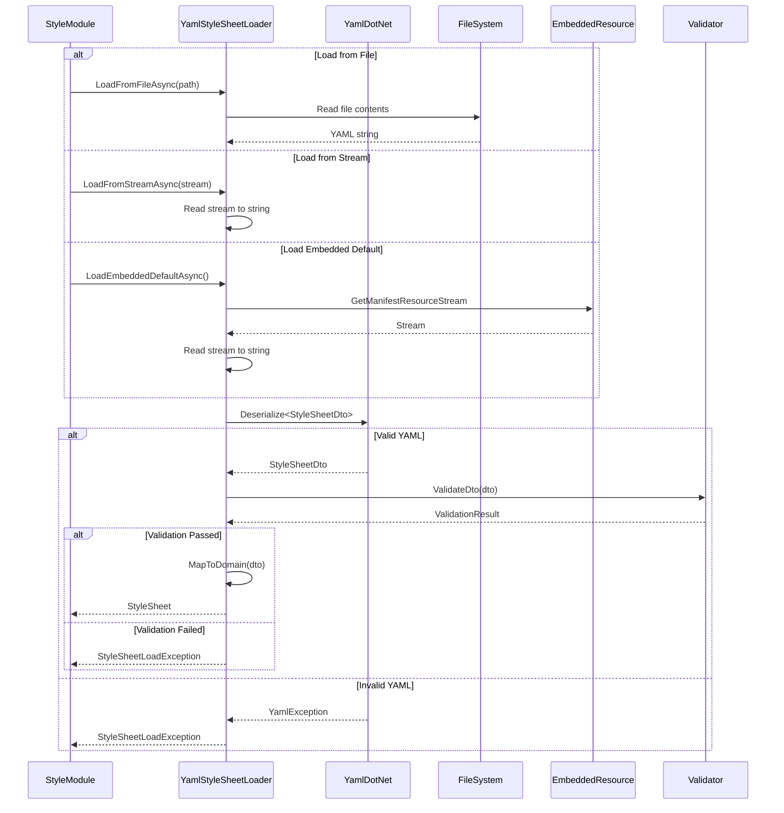

# LCS-INF-021c: YAML Deserializer — StyleSheetLoader Implementation

## 1. Metadata & Categorization

| Field                | Value                                       | Description                                          |
| :------------------- | :------------------------------------------ | :--------------------------------------------------- |
| **Feature ID**       | `INF-021c`                                  | YAML Deserializer                                    |
| **Feature Name**     | YAML Deserializer                           | StyleSheetLoader with YamlDotNet                     |
| **Target Version**   | `v0.2.1c`                                   | Style Module Phase 1, Part C                         |
| **Module Scope**     | `Lexichord.Modules.Style`                   | Style governance module                              |
| **Swimlane**         | `Infrastructure`                            | The Podium (Platform)                                |
| **License Tier**     | `Core` (embedded) / `WriterPro` (custom)    | Mixed licensing                                      |
| **Feature Gate Key** | `Style.CustomRules`                         | WriterPro: custom YAML rules                         |
| **Author**           | System Architect                            |                                                      |
| **Status**           | **Draft**                                   | Pending approval                                     |
| **Last Updated**     | 2026-01-26                                  |                                                      |

---

## 2. Executive Summary

### 2.1 The Requirement

The Style Module needs to load style rules from YAML files:

- **Embedded Default Rules:** Core users get the built-in `lexichord.yaml`.
- **Custom Rules:** WriterPro users can define their own rules.
- **Validation:** Invalid YAML should produce helpful error messages.
- **Schema:** The YAML format must be human-friendly and well-documented.

### 2.2 The Proposed Solution

We **SHALL** implement a complete YAML loading system with:

1. **YamlDotNet Integration** — Install and configure the YamlDotNet library.
2. **IStyleSheetLoader** — Interface for loading from files, streams, and embedded resources.
3. **YamlStyleSheetLoader** — Implementation with validation and error reporting.
4. **Embedded lexichord.yaml** — 25+ standard rules covering terminology, formatting, and syntax.

---

## 3. Architecture

### 3.1 Loading Flow



### 3.2 YAML Schema

```yaml
# lexichord.yaml schema
name: string (required)
description: string (optional)
version: string (optional)
author: string (optional)
extends: string (optional) # "default" or path to base sheet

rules:
  - id: string (required, kebab-case)
    name: string (required)
    description: string (required)
    category: terminology | formatting | syntax (required)
    severity: error | warning | info | hint (default: warning)
    pattern: string (required)
    patternType: regex | literal | literalIgnoreCase | startsWith | endsWith | contains (default: regex)
    suggestion: string (optional)
    enabled: boolean (default: true)

# Severity overrides (optional)
overrides:
  rule-id: error | warning | info | hint | disabled

# Category-wide settings (optional)
categories:
  terminology:
    enabled: boolean
    defaultSeverity: error | warning | info | hint
```

### 3.3 Project Structure

```
Lexichord.Modules.Style/
├── Services/
│   └── YamlStyleSheetLoader.cs
├── Dto/
│   ├── StyleSheetDto.cs
│   ├── StyleRuleDto.cs
│   └── DtoMapper.cs
├── Validation/
│   └── StyleSheetValidator.cs
└── Resources/
    └── lexichord.yaml          # Embedded resource
```

---

## 4. Data Contracts

### 4.1 DTO Classes for YAML Deserialization

```csharp
namespace Lexichord.Modules.Style.Dto;

using YamlDotNet.Serialization;

/// <summary>
/// Data Transfer Object for YAML deserialization of style sheets.
/// </summary>
/// <remarks>
/// LOGIC: DTOs are mutable and match the YAML structure exactly.
/// After deserialization, we validate and map to immutable domain objects.
///
/// This separation allows:
/// - Flexible YAML schema with defaults
/// - Strict domain model validation
/// - Better error messages (YAML line numbers)
/// </remarks>
public sealed class StyleSheetDto
{
    /// <summary>
    /// Name of the style sheet (required).
    /// </summary>
    [YamlMember(Alias = "name")]
    public string? Name { get; set; }

    /// <summary>
    /// Description of the style sheet.
    /// </summary>
    [YamlMember(Alias = "description")]
    public string? Description { get; set; }

    /// <summary>
    /// Version string (semantic versioning recommended).
    /// </summary>
    [YamlMember(Alias = "version")]
    public string? Version { get; set; }

    /// <summary>
    /// Author or team name.
    /// </summary>
    [YamlMember(Alias = "author")]
    public string? Author { get; set; }

    /// <summary>
    /// Base style sheet to extend ("default" for embedded rules).
    /// </summary>
    [YamlMember(Alias = "extends")]
    public string? Extends { get; set; }

    /// <summary>
    /// Collection of style rules.
    /// </summary>
    [YamlMember(Alias = "rules")]
    public List<StyleRuleDto>? Rules { get; set; }

    /// <summary>
    /// Severity overrides by rule ID.
    /// </summary>
    [YamlMember(Alias = "overrides")]
    public Dictionary<string, string>? Overrides { get; set; }

    /// <summary>
    /// Category-wide settings.
    /// </summary>
    [YamlMember(Alias = "categories")]
    public Dictionary<string, CategorySettingsDto>? Categories { get; set; }
}

/// <summary>
/// DTO for individual style rules.
/// </summary>
public sealed class StyleRuleDto
{
    [YamlMember(Alias = "id")]
    public string? Id { get; set; }

    [YamlMember(Alias = "name")]
    public string? Name { get; set; }

    [YamlMember(Alias = "description")]
    public string? Description { get; set; }

    [YamlMember(Alias = "category")]
    public string? Category { get; set; }

    [YamlMember(Alias = "severity")]
    public string? Severity { get; set; }

    [YamlMember(Alias = "pattern")]
    public string? Pattern { get; set; }

    [YamlMember(Alias = "patternType")]
    public string? PatternType { get; set; }

    [YamlMember(Alias = "suggestion")]
    public string? Suggestion { get; set; }

    [YamlMember(Alias = "enabled")]
    public bool? Enabled { get; set; }
}

/// <summary>
/// DTO for category-wide settings.
/// </summary>
public sealed class CategorySettingsDto
{
    [YamlMember(Alias = "enabled")]
    public bool? Enabled { get; set; }

    [YamlMember(Alias = "defaultSeverity")]
    public string? DefaultSeverity { get; set; }
}
```

### 4.2 YamlStyleSheetLoader Implementation

```csharp
namespace Lexichord.Modules.Style.Services;

using Lexichord.Abstractions.Contracts;
using Lexichord.Abstractions.Domain;
using Lexichord.Modules.Style.Dto;
using Lexichord.Modules.Style.Validation;
using Microsoft.Extensions.Logging;
using System.Reflection;
using YamlDotNet.Core;
using YamlDotNet.Serialization;
using YamlDotNet.Serialization.NamingConventions;

/// <summary>
/// Loads style sheets from YAML files and embedded resources.
/// </summary>
/// <remarks>
/// LOGIC: The loader is responsible for:
/// 1. Reading YAML from various sources (file, stream, embedded)
/// 2. Deserializing to DTOs
/// 3. Validating the DTO structure
/// 4. Mapping to immutable domain objects
///
/// Error Handling Strategy:
/// - YAML syntax errors: Captured with line numbers
/// - Validation errors: Aggregated and reported
/// - File errors: Wrapped in StyleSheetLoadException
///
/// Thread Safety:
/// - Deserializer is created per-call (YamlDotNet recommendation)
/// - No shared mutable state
/// </remarks>
public sealed class YamlStyleSheetLoader : IStyleSheetLoader
{
    private readonly ILogger<YamlStyleSheetLoader> _logger;
    private readonly StyleSheetValidator _validator;

    /// <summary>
    /// Name of the embedded default rules resource.
    /// </summary>
    private const string EmbeddedResourceName =
        "Lexichord.Modules.Style.Resources.lexichord.yaml";

    public YamlStyleSheetLoader(ILogger<YamlStyleSheetLoader> logger)
    {
        _logger = logger;
        _validator = new StyleSheetValidator();
    }

    /// <inheritdoc/>
    public async Task<StyleSheet> LoadFromFileAsync(
        string filePath,
        CancellationToken cancellationToken = default)
    {
        _logger.LogDebug("Loading style sheet from: {FilePath}", filePath);

        if (!File.Exists(filePath))
        {
            throw new StyleSheetLoadException(
                $"Style sheet file not found: {filePath}",
                new FileNotFoundException("File not found", filePath));
        }

        try
        {
            var yamlContent = await File.ReadAllTextAsync(filePath, cancellationToken);
            return LoadFromString(yamlContent, filePath);
        }
        catch (StyleSheetLoadException)
        {
            throw; // Re-throw our own exceptions
        }
        catch (Exception ex)
        {
            _logger.LogError(ex, "Failed to read style sheet file: {FilePath}", filePath);
            throw new StyleSheetLoadException(
                $"Failed to read style sheet file: {filePath}",
                ex);
        }
    }

    /// <inheritdoc/>
    public async Task<StyleSheet> LoadFromStreamAsync(
        Stream stream,
        CancellationToken cancellationToken = default)
    {
        _logger.LogDebug("Loading style sheet from stream");

        using var reader = new StreamReader(stream);
        var yamlContent = await reader.ReadToEndAsync(cancellationToken);
        return LoadFromString(yamlContent, sourceName: "stream");
    }

    /// <inheritdoc/>
    public async Task<StyleSheet> LoadEmbeddedDefaultAsync(
        CancellationToken cancellationToken = default)
    {
        _logger.LogDebug("Loading embedded default style sheet");

        var assembly = typeof(YamlStyleSheetLoader).Assembly;
        using var stream = assembly.GetManifestResourceStream(EmbeddedResourceName);

        if (stream is null)
        {
            // LOGIC: This should never happen in production.
            // If it does, it's a build configuration error.
            throw new StyleSheetLoadException(
                $"Embedded resource not found: {EmbeddedResourceName}. " +
                "This indicates a build configuration error.");
        }

        return await LoadFromStreamAsync(stream, cancellationToken);
    }

    /// <inheritdoc/>
    public StyleSheetLoadResult ValidateYaml(string yamlContent)
    {
        try
        {
            var dto = DeserializeYaml(yamlContent);
            var validationResult = _validator.Validate(dto);

            if (!validationResult.IsValid)
            {
                return new StyleSheetLoadResult
                {
                    IsSuccess = false,
                    Errors = validationResult.Errors
                        .Select(e => new StyleSheetError(e.Message, e.Line, e.Column, e.RuleId))
                        .ToList()
                };
            }

            var styleSheet = MapToDomain(dto);
            return new StyleSheetLoadResult
            {
                IsSuccess = true,
                StyleSheet = styleSheet,
                Warnings = validationResult.Warnings
                    .Select(w => new StyleSheetWarning(w.Message, w.Line, w.RuleId))
                    .ToList()
            };
        }
        catch (YamlException ex)
        {
            return new StyleSheetLoadResult
            {
                IsSuccess = false,
                Errors = new List<StyleSheetError>
                {
                    new(
                        Message: $"YAML syntax error: {ex.Message}",
                        Line: ex.Start.Line,
                        Column: ex.Start.Column,
                        RuleId: null)
                }
            };
        }
        catch (Exception ex)
        {
            return new StyleSheetLoadResult
            {
                IsSuccess = false,
                Errors = new List<StyleSheetError>
                {
                    new(
                        Message: $"Unexpected error: {ex.Message}",
                        Line: null,
                        Column: null,
                        RuleId: null)
                }
            };
        }
    }

    /// <summary>
    /// Loads a style sheet from a YAML string.
    /// </summary>
    private StyleSheet LoadFromString(string yamlContent, string sourceName)
    {
        _logger.LogDebug("Parsing YAML from {Source}", sourceName);

        StyleSheetDto dto;

        try
        {
            dto = DeserializeYaml(yamlContent);
        }
        catch (YamlException ex)
        {
            _logger.LogError(ex, "YAML parse error at line {Line}", ex.Start.Line);
            throw new StyleSheetLoadException(
                $"YAML syntax error at line {ex.Start.Line}, column {ex.Start.Column}: {ex.Message}",
                ex);
        }

        // LOGIC: Validate the DTO before mapping to domain
        var validationResult = _validator.Validate(dto);

        if (!validationResult.IsValid)
        {
            var errorMessages = string.Join("; ",
                validationResult.Errors.Select(e => e.Message));

            _logger.LogError(
                "Style sheet validation failed: {Errors}",
                errorMessages);

            throw new StyleSheetLoadException(
                $"Style sheet validation failed: {errorMessages}");
        }

        // LOGIC: Log warnings but continue
        foreach (var warning in validationResult.Warnings)
        {
            _logger.LogWarning(
                "Style sheet warning: {Message} (line {Line})",
                warning.Message,
                warning.Line);
        }

        var styleSheet = MapToDomain(dto);

        _logger.LogInformation(
            "Loaded style sheet '{Name}' with {RuleCount} rules from {Source}",
            styleSheet.Name,
            styleSheet.Rules.Count,
            sourceName);

        return styleSheet;
    }

    /// <summary>
    /// Deserializes YAML content to DTO.
    /// </summary>
    /// <remarks>
    /// LOGIC: YamlDotNet deserializer is configured to:
    /// - Use camelCase naming convention (YAML standard)
    /// - Ignore unmatched properties (forward compatibility)
    /// - Not use anchors/aliases (security)
    /// </remarks>
    private static StyleSheetDto DeserializeYaml(string yamlContent)
    {
        var deserializer = new DeserializerBuilder()
            .WithNamingConvention(CamelCaseNamingConvention.Instance)
            .IgnoreUnmatchedProperties()
            .Build();

        return deserializer.Deserialize<StyleSheetDto>(yamlContent)
            ?? new StyleSheetDto();
    }

    /// <summary>
    /// Maps DTO to domain objects.
    /// </summary>
    /// <remarks>
    /// LOGIC: This is where we apply defaults and transform
    /// mutable DTOs into immutable domain records.
    /// </remarks>
    private static StyleSheet MapToDomain(StyleSheetDto dto)
    {
        var rules = dto.Rules?
            .Select(MapRuleToDomain)
            .Where(r => r is not null)
            .Cast<StyleRule>()
            .ToList() ?? new List<StyleRule>();

        // LOGIC: Apply severity overrides
        if (dto.Overrides is not null)
        {
            rules = ApplyOverrides(rules, dto.Overrides);
        }

        // LOGIC: Apply category settings
        if (dto.Categories is not null)
        {
            rules = ApplyCategorySettings(rules, dto.Categories);
        }

        return new StyleSheet(
            Name: dto.Name ?? "Unnamed",
            Rules: rules.AsReadOnly(),
            Description: dto.Description,
            Version: dto.Version,
            Author: dto.Author,
            Extends: dto.Extends);
    }

    private static StyleRule? MapRuleToDomain(StyleRuleDto dto)
    {
        if (string.IsNullOrWhiteSpace(dto.Id) ||
            string.IsNullOrWhiteSpace(dto.Pattern))
        {
            return null; // Skip invalid rules (validator already warned)
        }

        return new StyleRule(
            Id: dto.Id,
            Name: dto.Name ?? dto.Id,
            Description: dto.Description ?? string.Empty,
            Category: ParseCategory(dto.Category),
            DefaultSeverity: ParseSeverity(dto.Severity),
            Pattern: dto.Pattern,
            PatternType: ParsePatternType(dto.PatternType),
            Suggestion: dto.Suggestion,
            IsEnabled: dto.Enabled ?? true);
    }

    private static RuleCategory ParseCategory(string? value) => value?.ToLowerInvariant() switch
    {
        "terminology" => RuleCategory.Terminology,
        "formatting" => RuleCategory.Formatting,
        "syntax" => RuleCategory.Syntax,
        _ => RuleCategory.Terminology // Default
    };

    private static ViolationSeverity ParseSeverity(string? value) => value?.ToLowerInvariant() switch
    {
        "error" => ViolationSeverity.Error,
        "warning" => ViolationSeverity.Warning,
        "info" => ViolationSeverity.Info,
        "hint" => ViolationSeverity.Hint,
        _ => ViolationSeverity.Warning // Default
    };

    private static PatternType ParsePatternType(string? value) => value?.ToLowerInvariant() switch
    {
        "regex" => PatternType.Regex,
        "literal" => PatternType.Literal,
        "literalignorecase" => PatternType.LiteralIgnoreCase,
        "startswith" => PatternType.StartsWith,
        "endswith" => PatternType.EndsWith,
        "contains" => PatternType.Contains,
        _ => PatternType.Regex // Default
    };

    private static List<StyleRule> ApplyOverrides(
        List<StyleRule> rules,
        Dictionary<string, string> overrides)
    {
        return rules.Select(rule =>
        {
            if (overrides.TryGetValue(rule.Id, out var severityOverride))
            {
                if (severityOverride.Equals("disabled", StringComparison.OrdinalIgnoreCase))
                {
                    return rule.Disable();
                }

                var newSeverity = ParseSeverity(severityOverride);
                return rule.WithSeverity(newSeverity);
            }
            return rule;
        }).ToList();
    }

    private static List<StyleRule> ApplyCategorySettings(
        List<StyleRule> rules,
        Dictionary<string, CategorySettingsDto> categories)
    {
        return rules.Select(rule =>
        {
            var categoryKey = rule.Category.ToString().ToLowerInvariant();
            if (categories.TryGetValue(categoryKey, out var settings))
            {
                var updatedRule = rule;

                if (settings.Enabled == false)
                {
                    updatedRule = updatedRule.Disable();
                }

                if (settings.DefaultSeverity is not null)
                {
                    var severity = ParseSeverity(settings.DefaultSeverity);
                    updatedRule = updatedRule.WithSeverity(severity);
                }

                return updatedRule;
            }
            return rule;
        }).ToList();
    }
}

/// <summary>
/// Exception thrown when style sheet loading fails.
/// </summary>
public sealed class StyleSheetLoadException : Exception
{
    public StyleSheetLoadException(string message) : base(message) { }
    public StyleSheetLoadException(string message, Exception inner) : base(message, inner) { }
}
```

### 4.3 StyleSheetValidator Implementation

```csharp
namespace Lexichord.Modules.Style.Validation;

using Lexichord.Modules.Style.Dto;
using System.Text.RegularExpressions;

/// <summary>
/// Validates style sheet DTOs before mapping to domain objects.
/// </summary>
/// <remarks>
/// LOGIC: Validation happens after YAML parsing but before domain mapping.
/// This allows us to:
/// - Provide detailed error messages with context
/// - Collect all errors (not fail on first)
/// - Distinguish errors (block loading) from warnings (continue with caution)
/// </remarks>
public sealed class StyleSheetValidator
{
    /// <summary>
    /// Pattern for valid rule IDs (kebab-case).
    /// </summary>
    private static readonly Regex ValidIdPattern =
        new(@"^[a-z][a-z0-9]*(-[a-z0-9]+)*$", RegexOptions.Compiled);

    /// <summary>
    /// Valid category values.
    /// </summary>
    private static readonly HashSet<string> ValidCategories =
        new(StringComparer.OrdinalIgnoreCase) { "terminology", "formatting", "syntax" };

    /// <summary>
    /// Valid severity values.
    /// </summary>
    private static readonly HashSet<string> ValidSeverities =
        new(StringComparer.OrdinalIgnoreCase) { "error", "warning", "info", "hint", "disabled" };

    /// <summary>
    /// Valid pattern type values.
    /// </summary>
    private static readonly HashSet<string> ValidPatternTypes =
        new(StringComparer.OrdinalIgnoreCase)
        {
            "regex", "literal", "literalignorecase", "startswith", "endswith", "contains"
        };

    /// <summary>
    /// Validates a style sheet DTO.
    /// </summary>
    /// <param name="dto">The DTO to validate.</param>
    /// <returns>Validation result with errors and warnings.</returns>
    public ValidationResult Validate(StyleSheetDto dto)
    {
        var errors = new List<ValidationError>();
        var warnings = new List<ValidationWarning>();

        // LOGIC: Name is required
        if (string.IsNullOrWhiteSpace(dto.Name))
        {
            errors.Add(new ValidationError("Style sheet 'name' is required", null, null, null));
        }

        // LOGIC: Validate each rule
        if (dto.Rules is not null)
        {
            var seenIds = new HashSet<string>(StringComparer.OrdinalIgnoreCase);

            for (var i = 0; i < dto.Rules.Count; i++)
            {
                ValidateRule(dto.Rules[i], i, seenIds, errors, warnings);
            }
        }
        else
        {
            warnings.Add(new ValidationWarning(
                "Style sheet has no rules defined",
                null, null));
        }

        // LOGIC: Validate overrides reference existing rules
        if (dto.Overrides is not null && dto.Rules is not null)
        {
            var ruleIds = dto.Rules
                .Where(r => !string.IsNullOrWhiteSpace(r.Id))
                .Select(r => r.Id!)
                .ToHashSet(StringComparer.OrdinalIgnoreCase);

            foreach (var (ruleId, severity) in dto.Overrides)
            {
                if (!ruleIds.Contains(ruleId) && ruleId != "*")
                {
                    warnings.Add(new ValidationWarning(
                        $"Override references unknown rule: {ruleId}",
                        null, ruleId));
                }

                if (!ValidSeverities.Contains(severity))
                {
                    errors.Add(new ValidationError(
                        $"Invalid override severity '{severity}' for rule '{ruleId}'",
                        null, null, ruleId));
                }
            }
        }

        // LOGIC: Validate category settings
        if (dto.Categories is not null)
        {
            foreach (var (category, settings) in dto.Categories)
            {
                if (!ValidCategories.Contains(category))
                {
                    warnings.Add(new ValidationWarning(
                        $"Unknown category in settings: {category}",
                        null, null));
                }

                if (settings.DefaultSeverity is not null &&
                    !ValidSeverities.Contains(settings.DefaultSeverity))
                {
                    errors.Add(new ValidationError(
                        $"Invalid severity in category settings: {settings.DefaultSeverity}",
                        null, null, null));
                }
            }
        }

        return new ValidationResult(errors, warnings);
    }

    private void ValidateRule(
        StyleRuleDto rule,
        int index,
        HashSet<string> seenIds,
        List<ValidationError> errors,
        List<ValidationWarning> warnings)
    {
        var ruleContext = $"rules[{index}]";

        // LOGIC: ID is required and must be valid format
        if (string.IsNullOrWhiteSpace(rule.Id))
        {
            errors.Add(new ValidationError(
                $"{ruleContext}: 'id' is required",
                null, null, null));
        }
        else
        {
            if (!ValidIdPattern.IsMatch(rule.Id))
            {
                errors.Add(new ValidationError(
                    $"{ruleContext}: 'id' must be kebab-case (e.g., 'no-passive-voice')",
                    null, null, rule.Id));
            }

            if (seenIds.Contains(rule.Id))
            {
                errors.Add(new ValidationError(
                    $"{ruleContext}: Duplicate rule id '{rule.Id}'",
                    null, null, rule.Id));
            }
            else
            {
                seenIds.Add(rule.Id);
            }
        }

        // LOGIC: Pattern is required
        if (string.IsNullOrWhiteSpace(rule.Pattern))
        {
            errors.Add(new ValidationError(
                $"{ruleContext}: 'pattern' is required",
                null, null, rule.Id));
        }
        else
        {
            // LOGIC: Validate regex patterns can compile
            var patternType = rule.PatternType?.ToLowerInvariant() ?? "regex";
            if (patternType == "regex" || patternType == "startswith" || patternType == "endswith")
            {
                try
                {
                    _ = new Regex(rule.Pattern, RegexOptions.None, TimeSpan.FromMilliseconds(100));
                }
                catch (RegexParseException ex)
                {
                    errors.Add(new ValidationError(
                        $"{ruleContext}: Invalid regex pattern: {ex.Message}",
                        null, null, rule.Id));
                }
            }
        }

        // LOGIC: Name is recommended
        if (string.IsNullOrWhiteSpace(rule.Name))
        {
            warnings.Add(new ValidationWarning(
                $"{ruleContext}: 'name' is recommended for display purposes",
                null, rule.Id));
        }

        // LOGIC: Description is recommended
        if (string.IsNullOrWhiteSpace(rule.Description))
        {
            warnings.Add(new ValidationWarning(
                $"{ruleContext}: 'description' is recommended for user guidance",
                null, rule.Id));
        }

        // LOGIC: Category must be valid
        if (!string.IsNullOrWhiteSpace(rule.Category) && !ValidCategories.Contains(rule.Category))
        {
            errors.Add(new ValidationError(
                $"{ruleContext}: Invalid category '{rule.Category}'. " +
                $"Valid values: {string.Join(", ", ValidCategories)}",
                null, null, rule.Id));
        }

        // LOGIC: Severity must be valid
        if (!string.IsNullOrWhiteSpace(rule.Severity) && !ValidSeverities.Contains(rule.Severity))
        {
            errors.Add(new ValidationError(
                $"{ruleContext}: Invalid severity '{rule.Severity}'. " +
                $"Valid values: {string.Join(", ", ValidSeverities)}",
                null, null, rule.Id));
        }

        // LOGIC: Pattern type must be valid
        if (!string.IsNullOrWhiteSpace(rule.PatternType) && !ValidPatternTypes.Contains(rule.PatternType))
        {
            errors.Add(new ValidationError(
                $"{ruleContext}: Invalid patternType '{rule.PatternType}'. " +
                $"Valid values: {string.Join(", ", ValidPatternTypes)}",
                null, null, rule.Id));
        }
    }
}

/// <summary>
/// Result of style sheet validation.
/// </summary>
public sealed record ValidationResult(
    IReadOnlyList<ValidationError> Errors,
    IReadOnlyList<ValidationWarning> Warnings)
{
    public bool IsValid => Errors.Count == 0;
}

/// <summary>
/// Validation error that prevents loading.
/// </summary>
public sealed record ValidationError(
    string Message,
    int? Line,
    int? Column,
    string? RuleId);

/// <summary>
/// Validation warning that doesn't prevent loading.
/// </summary>
public sealed record ValidationWarning(
    string Message,
    int? Line,
    string? RuleId);
```

### 4.4 Embedded Default Rules (lexichord.yaml)

```yaml
# Lexichord Default Style Rules
# Core tier - available to all users
# Version: 1.0.0

name: Lexichord Default Style Guide
description: Standard style rules for clear, consistent writing
version: "1.0.0"
author: Lexichord Team

rules:
  # ============================================================
  # TERMINOLOGY RULES
  # Rules about word choice and phrasing
  # ============================================================

  - id: no-utilize
    name: Avoid "utilize"
    description: Use "use" instead of "utilize" for simplicity.
    category: terminology
    severity: warning
    pattern: \b(utilize|utilizes|utilized|utilizing)\b
    patternType: regex
    suggestion: Replace with "use", "uses", "used", or "using".

  - id: no-leverage
    name: Avoid "leverage" (verb)
    description: Use "use", "apply", or "take advantage of" instead.
    category: terminology
    severity: hint
    pattern: \b(leverage|leverages|leveraged|leveraging)\b
    patternType: regex
    suggestion: Consider "use", "apply", or "take advantage of".

  - id: no-synergy
    name: Avoid "synergy"
    description: Corporate jargon that obscures meaning.
    category: terminology
    severity: info
    pattern: \b(synergy|synergies|synergize|synergistic)\b
    patternType: regex
    suggestion: Be specific about the benefit or collaboration.

  - id: no-paradigm
    name: Avoid "paradigm"
    description: Often overused in business writing.
    category: terminology
    severity: hint
    pattern: \b(paradigm|paradigms|paradigm-shift)\b
    patternType: regex
    suggestion: Consider "model", "approach", or "framework".

  - id: no-bandwidth
    name: Avoid "bandwidth" (non-technical)
    description: When not referring to data transfer, use "capacity" or "time".
    category: terminology
    severity: hint
    pattern: \bdon't have (the )?bandwidth\b
    patternType: regex
    suggestion: "Consider \"don't have capacity\" or \"don't have time\"."

  - id: no-circle-back
    name: Avoid "circle back"
    description: Corporate speak for "follow up" or "return to".
    category: terminology
    severity: hint
    pattern: \bcircle back\b
    patternType: regex
    suggestion: Use "follow up", "return to", or "revisit".

  - id: no-low-hanging-fruit
    name: Avoid "low-hanging fruit"
    description: Cliche that can be more directly stated.
    category: terminology
    severity: hint
    pattern: \blow-hanging fruit\b
    patternType: regex
    suggestion: Be specific about what makes these tasks easy.

  - id: no-move-the-needle
    name: Avoid "move the needle"
    description: Vague expression for "make an impact".
    category: terminology
    severity: hint
    pattern: \bmove the needle\b
    patternType: regex
    suggestion: Be specific about the expected impact.

  - id: no-basically
    name: Avoid "basically"
    description: Often filler that weakens statements.
    category: terminology
    severity: info
    pattern: \bbasically\b
    patternType: regex
    suggestion: Remove or replace with more specific language.

  - id: no-very
    name: Consider alternatives to "very"
    description: "Very" often weakens prose; stronger words exist.
    category: terminology
    severity: hint
    pattern: \bvery\b
    patternType: regex
    suggestion: "Use a stronger adjective (e.g., \"very big\" -> \"enormous\")."

  # ============================================================
  # FORMATTING RULES
  # Rules about document structure and presentation
  # ============================================================

  - id: no-trailing-whitespace
    name: No trailing whitespace
    description: Lines should not end with spaces or tabs.
    category: formatting
    severity: info
    pattern: "[ \t]+$"
    patternType: endsWith
    suggestion: Remove trailing whitespace.

  - id: no-multiple-blank-lines
    name: No multiple consecutive blank lines
    description: Use single blank lines to separate sections.
    category: formatting
    severity: info
    pattern: \n\n\n+
    patternType: regex
    suggestion: Reduce to a single blank line.

  - id: no-tab-indentation
    name: Use spaces instead of tabs
    description: Consistent indentation with spaces.
    category: formatting
    severity: hint
    pattern: "^\t+"
    patternType: startsWith
    suggestion: Replace tabs with spaces (typically 2 or 4).

  - id: heading-capitalization
    name: Heading capitalization
    description: Headings should use title case or sentence case consistently.
    category: formatting
    severity: hint
    pattern: "^#{1,6}\\s+[a-z]"
    patternType: regex
    suggestion: Consider capitalizing the first word of headings.
    enabled: false

  - id: no-todo-comments
    name: No TODO comments
    description: TODO items should be tracked elsewhere.
    category: formatting
    severity: info
    pattern: \bTODO\b
    patternType: literalIgnoreCase
    suggestion: Address or move to issue tracker.

  - id: no-fixme-comments
    name: No FIXME comments
    description: FIXME items indicate unresolved issues.
    category: formatting
    severity: warning
    pattern: \bFIXME\b
    patternType: literalIgnoreCase
    suggestion: Address the issue or create a tracking item.

  # ============================================================
  # SYNTAX RULES
  # Rules about grammar and mechanics
  # ============================================================

  - id: passive-voice-indicator
    name: Possible passive voice
    description: Active voice is generally clearer and more direct.
    category: syntax
    severity: hint
    pattern: \b(was|were|been|being|is|are|am)\s+\w+ed\b
    patternType: regex
    suggestion: Consider rewriting in active voice.

  - id: weasel-words
    name: Weasel words detected
    description: Words that make statements vague or uncommitted.
    category: syntax
    severity: info
    pattern: \b(some|many|few|often|generally|usually|probably|possibly|might|could|may)\b
    patternType: regex
    suggestion: Be more specific or commit to a statement.
    enabled: false

  - id: no-double-negatives
    name: Avoid double negatives
    description: Double negatives can confuse readers.
    category: syntax
    severity: warning
    pattern: \b(not\s+un\w+|never\s+no|can't\s+not)\b
    patternType: regex
    suggestion: Rephrase positively for clarity.

  - id: repeated-words
    name: Repeated word
    description: The same word appears twice in a row.
    category: syntax
    severity: warning
    pattern: \b(\w+)\s+\1\b
    patternType: regex
    suggestion: Remove the duplicate word.

  - id: sentence-starts-with-but
    name: Sentence starting with "But"
    description: Consider alternatives or connecting to previous sentence.
    category: syntax
    severity: hint
    pattern: "(?:^|\\. )But\\b"
    patternType: regex
    suggestion: "Consider \"However,\" or restructuring."

  - id: sentence-starts-with-and
    name: Sentence starting with "And"
    description: Consider alternatives or connecting to previous sentence.
    category: syntax
    severity: hint
    pattern: "(?:^|\\. )And\\b"
    patternType: regex
    suggestion: Consider restructuring or using "Additionally,".

  - id: no-exclamation-overuse
    name: Multiple exclamation marks
    description: Use exclamation marks sparingly for emphasis.
    category: syntax
    severity: info
    pattern: "!{2,}"
    patternType: regex
    suggestion: Use a single exclamation mark for emphasis.

  - id: contractions-in-formal
    name: Contractions in formal writing
    description: Contractions may be inappropriate in formal documents.
    category: syntax
    severity: hint
    pattern: \b(can't|won't|don't|isn't|aren't|wasn't|weren't|hasn't|haven't|hadn't|doesn't|didn't|shouldn't|wouldn't|couldn't|mightn't|mustn't|shan't|it's|that's|there's|here's|what's|who's|let's|I'm|you're|he's|she's|we're|they're|I've|you've|we've|they've|I'd|you'd|he'd|she'd|we'd|they'd|I'll|you'll|he'll|she'll|we'll|they'll)\b
    patternType: regex
    suggestion: Consider expanding contractions in formal writing.
    enabled: false
```

---

## 5. Use Cases

### UC-01: Loading Embedded Default Rules

**Preconditions:**
- Style module initializing.
- No custom style.yaml exists.

**Flow:**
1. StyleModule calls `LoadEmbeddedDefaultAsync()`.
2. Loader gets embedded resource stream.
3. YAML is deserialized to DTO.
4. DTO is validated (always passes for embedded).
5. DTO is mapped to StyleSheet domain object.
6. Returns StyleSheet with 25+ rules.

**Postconditions:**
- StyleSheet is ready for analysis.
- All rules are enabled by default.

---

### UC-02: Loading Custom Rules (WriterPro)

**Preconditions:**
- User has WriterPro license.
- `.lexichord/style.yaml` exists.

**Flow:**
1. StyleModule calls `LoadFromFileAsync(path)`.
2. File content is read.
3. YAML is deserialized to DTO.
4. Validator checks all rules.
5. If `extends: default`, loader also loads embedded rules.
6. Custom rules are merged with defaults.
7. Returns merged StyleSheet.

**Postconditions:**
- Custom rules override defaults with same ID.
- Defaults fill in missing rules.

---

### UC-03: Handling Invalid YAML

**Preconditions:**
- User edits style.yaml with syntax error.

**Flow:**
1. Loader attempts `LoadFromFileAsync(path)`.
2. YamlDotNet throws `YamlException`.
3. Exception is caught and wrapped.
4. `StyleSheetLoadException` thrown with line number.
5. Caller receives helpful error message.

**Postconditions:**
- No partial loading.
- Error message includes position.

---

## 6. Observability & Logging

### 6.1 Log Events

| Level       | Source               | Message Template                                                    |
| :---------- | :------------------- | :------------------------------------------------------------------ |
| Debug       | StyleSheetLoader     | `Loading style sheet from: {FilePath}`                              |
| Debug       | StyleSheetLoader     | `Loading style sheet from stream`                                   |
| Debug       | StyleSheetLoader     | `Loading embedded default style sheet`                              |
| Debug       | StyleSheetLoader     | `Parsing YAML from {Source}`                                        |
| Error       | StyleSheetLoader     | `YAML parse error at line {Line}`                                   |
| Error       | StyleSheetLoader     | `Style sheet validation failed: {Errors}`                           |
| Warning     | StyleSheetLoader     | `Style sheet warning: {Message} (line {Line})`                      |
| Information | StyleSheetLoader     | `Loaded style sheet '{Name}' with {RuleCount} rules from {Source}`  |
| Error       | StyleSheetLoader     | `Failed to read style sheet file: {FilePath}`                       |

---

## 7. Unit Testing Requirements

### 7.1 YamlStyleSheetLoader Tests

```csharp
[TestFixture]
[Category("Unit")]
public class YamlStyleSheetLoaderTests
{
    private Mock<ILogger<YamlStyleSheetLoader>> _mockLogger = null!;
    private YamlStyleSheetLoader _sut = null!;

    [SetUp]
    public void SetUp()
    {
        _mockLogger = new Mock<ILogger<YamlStyleSheetLoader>>();
        _sut = new YamlStyleSheetLoader(_mockLogger.Object);
    }

    [Test]
    public async Task LoadEmbeddedDefaultAsync_ReturnsStyleSheet()
    {
        // Act
        var result = await _sut.LoadEmbeddedDefaultAsync();

        // Assert
        Assert.Multiple(() =>
        {
            Assert.That(result, Is.Not.Null);
            Assert.That(result.Name, Is.Not.Null.And.Not.Empty);
            Assert.That(result.Rules, Is.Not.Empty);
        });
    }

    [Test]
    public async Task LoadEmbeddedDefaultAsync_ContainsExpectedRules()
    {
        // Act
        var result = await _sut.LoadEmbeddedDefaultAsync();

        // Assert
        Assert.That(result.Rules.Count, Is.GreaterThanOrEqualTo(25));
        Assert.That(result.FindRuleById("no-utilize"), Is.Not.Null);
        Assert.That(result.FindRuleById("no-trailing-whitespace"), Is.Not.Null);
    }

    [Test]
    public async Task LoadFromStreamAsync_ParsesValidYaml()
    {
        // Arrange
        var yaml = """
            name: Test Style
            rules:
              - id: test-rule
                name: Test Rule
                description: A test rule
                category: terminology
                pattern: test
            """;
        using var stream = new MemoryStream(Encoding.UTF8.GetBytes(yaml));

        // Act
        var result = await _sut.LoadFromStreamAsync(stream);

        // Assert
        Assert.That(result.Name, Is.EqualTo("Test Style"));
        Assert.That(result.Rules, Has.Count.EqualTo(1));
    }

    [Test]
    public void LoadFromStreamAsync_ThrowsOnInvalidYaml()
    {
        // Arrange
        var yaml = "name: [invalid yaml";
        using var stream = new MemoryStream(Encoding.UTF8.GetBytes(yaml));

        // Act & Assert
        Assert.ThrowsAsync<StyleSheetLoadException>(
            async () => await _sut.LoadFromStreamAsync(stream));
    }

    [Test]
    public void ValidateYaml_ReturnsErrors_ForMissingName()
    {
        // Arrange
        var yaml = """
            rules:
              - id: test
                pattern: test
            """;

        // Act
        var result = _sut.ValidateYaml(yaml);

        // Assert
        Assert.That(result.IsSuccess, Is.False);
        Assert.That(result.Errors, Has.Some.Matches<StyleSheetError>(
            e => e.Message.Contains("name")));
    }

    [Test]
    public void ValidateYaml_ReturnsErrors_ForInvalidRegex()
    {
        // Arrange
        var yaml = """
            name: Test
            rules:
              - id: bad-regex
                pattern: "[invalid"
                patternType: regex
            """;

        // Act
        var result = _sut.ValidateYaml(yaml);

        // Assert
        Assert.That(result.IsSuccess, Is.False);
        Assert.That(result.Errors, Has.Some.Matches<StyleSheetError>(
            e => e.Message.Contains("regex")));
    }

    [Test]
    public void ValidateYaml_ReturnsWarnings_ForMissingDescription()
    {
        // Arrange
        var yaml = """
            name: Test
            rules:
              - id: test-rule
                name: Test
                pattern: test
            """;

        // Act
        var result = _sut.ValidateYaml(yaml);

        // Assert
        Assert.That(result.IsSuccess, Is.True);
        Assert.That(result.Warnings, Has.Some.Matches<StyleSheetWarning>(
            w => w.Message.Contains("description")));
    }

    [Test]
    public async Task LoadFromFileAsync_ThrowsOnMissingFile()
    {
        // Arrange
        var path = Path.Combine(Path.GetTempPath(), Guid.NewGuid().ToString(), "nonexistent.yaml");

        // Act & Assert
        Assert.ThrowsAsync<StyleSheetLoadException>(
            async () => await _sut.LoadFromFileAsync(path));
    }
}
```

### 7.2 StyleSheetValidator Tests

```csharp
[TestFixture]
[Category("Unit")]
public class StyleSheetValidatorTests
{
    private StyleSheetValidator _sut = null!;

    [SetUp]
    public void SetUp()
    {
        _sut = new StyleSheetValidator();
    }

    [Test]
    public void Validate_RequiresName()
    {
        // Arrange
        var dto = new StyleSheetDto { Rules = new List<StyleRuleDto>() };

        // Act
        var result = _sut.Validate(dto);

        // Assert
        Assert.That(result.IsValid, Is.False);
        Assert.That(result.Errors, Has.Some.Matches<ValidationError>(
            e => e.Message.Contains("name")));
    }

    [Test]
    public void Validate_RequiresRuleId()
    {
        // Arrange
        var dto = new StyleSheetDto
        {
            Name = "Test",
            Rules = new List<StyleRuleDto>
            {
                new() { Pattern = "test" }
            }
        };

        // Act
        var result = _sut.Validate(dto);

        // Assert
        Assert.That(result.IsValid, Is.False);
        Assert.That(result.Errors, Has.Some.Matches<ValidationError>(
            e => e.Message.Contains("id")));
    }

    [Test]
    public void Validate_RequiresKebabCaseId()
    {
        // Arrange
        var dto = new StyleSheetDto
        {
            Name = "Test",
            Rules = new List<StyleRuleDto>
            {
                new() { Id = "InvalidId", Pattern = "test" }
            }
        };

        // Act
        var result = _sut.Validate(dto);

        // Assert
        Assert.That(result.IsValid, Is.False);
        Assert.That(result.Errors, Has.Some.Matches<ValidationError>(
            e => e.Message.Contains("kebab-case")));
    }

    [Test]
    public void Validate_DetectsDuplicateIds()
    {
        // Arrange
        var dto = new StyleSheetDto
        {
            Name = "Test",
            Rules = new List<StyleRuleDto>
            {
                new() { Id = "test-rule", Pattern = "test1" },
                new() { Id = "test-rule", Pattern = "test2" }
            }
        };

        // Act
        var result = _sut.Validate(dto);

        // Assert
        Assert.That(result.IsValid, Is.False);
        Assert.That(result.Errors, Has.Some.Matches<ValidationError>(
            e => e.Message.Contains("Duplicate")));
    }

    [Test]
    public void Validate_AcceptsValidDto()
    {
        // Arrange
        var dto = new StyleSheetDto
        {
            Name = "Test",
            Rules = new List<StyleRuleDto>
            {
                new()
                {
                    Id = "valid-rule",
                    Name = "Valid Rule",
                    Description = "A valid rule",
                    Category = "terminology",
                    Pattern = @"\btest\b"
                }
            }
        };

        // Act
        var result = _sut.Validate(dto);

        // Assert
        Assert.That(result.IsValid, Is.True);
    }
}
```

---

## 8. Security & Safety

### 8.1 YAML Security

> [!WARNING]
> YAML deserialization can be dangerous if not properly constrained.

Mitigations implemented:
- **No arbitrary type instantiation:** Only deserialize to known DTO types.
- **Ignore unknown properties:** Forward compatibility without risk.
- **No YAML anchors/aliases:** Prevents billion laughs attack.

### 8.2 Regex Pattern Security

See LCS-INF-021b for pattern timeout implementation.

---

## 9. Acceptance Criteria (QA)

| #   | Category           | Criterion                                                                     |
| :-- | :----------------- | :---------------------------------------------------------------------------- |
| 1   | **[Package]**      | YamlDotNet is installed                                                       |
| 2   | **[Embedded]**     | `lexichord.yaml` is embedded in assembly                                      |
| 3   | **[Embedded]**     | Embedded rules contain 25+ rules                                              |
| 4   | **[Loading]**      | `LoadFromFileAsync` loads valid YAML files                                    |
| 5   | **[Loading]**      | `LoadFromStreamAsync` loads from streams                                      |
| 6   | **[Loading]**      | `LoadEmbeddedDefaultAsync` returns Core rules                                 |
| 7   | **[Validation]**   | Invalid YAML produces helpful error messages                                  |
| 8   | **[Validation]**   | Missing required fields are reported                                          |
| 9   | **[Validation]**   | Invalid regex patterns are detected                                           |
| 10  | **[Validation]**   | Duplicate rule IDs are detected                                               |
| 11  | **[Mapping]**      | DTOs map correctly to domain objects                                          |
| 12  | **[Mapping]**      | Overrides apply severity changes                                              |
| 13  | **[Mapping]**      | Category settings apply to rules                                              |

---

## 10. Verification Commands

```bash
# 1. Install YamlDotNet
dotnet add src/Lexichord.Modules.Style package YamlDotNet --version 15.1.6

# 2. Verify package is installed
dotnet list src/Lexichord.Modules.Style package | grep YamlDotNet

# 3. Build to verify embedded resource
dotnet build src/Lexichord.Modules.Style

# 4. Check embedded resource is present
dotnet build src/Lexichord.Modules.Style -v:detailed | grep lexichord.yaml

# 5. Run unit tests
dotnet test --filter "Category=Unit&FullyQualifiedName~StyleSheetLoader"

# 6. Test embedded loading manually
dotnet run --project src/Lexichord.Host
# Check logs for: "Loaded style sheet 'Lexichord Default Style Guide' with X rules"
```

---

## 11. Deliverable Checklist

| Step | Description                                                        | Status |
| :--- | :----------------------------------------------------------------- | :----- |
| 1    | YamlDotNet package installed                                       | [ ]    |
| 2    | `StyleSheetDto` defined                                            | [ ]    |
| 3    | `StyleRuleDto` defined                                             | [ ]    |
| 4    | `CategorySettingsDto` defined                                      | [ ]    |
| 5    | `StyleSheetValidator` implemented                                  | [ ]    |
| 6    | `YamlStyleSheetLoader` implemented                                 | [ ]    |
| 7    | `StyleSheetLoadException` defined                                  | [ ]    |
| 8    | `lexichord.yaml` created with 25+ rules                            | [ ]    |
| 9    | `lexichord.yaml` configured as embedded resource                   | [ ]    |
| 10   | `LoadFromFileAsync` implemented and tested                         | [ ]    |
| 11   | `LoadFromStreamAsync` implemented and tested                       | [ ]    |
| 12   | `LoadEmbeddedDefaultAsync` implemented and tested                  | [ ]    |
| 13   | `ValidateYaml` implemented and tested                              | [ ]    |
| 14   | DTO to domain mapping with defaults                                | [ ]    |
| 15   | Override application logic                                         | [ ]    |
| 16   | Unit tests for loader passing                                      | [ ]    |
| 17   | Unit tests for validator passing                                   | [ ]    |
