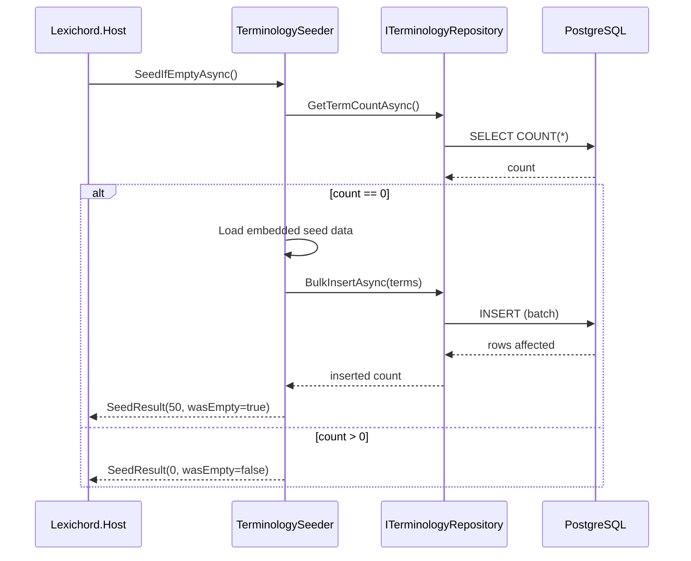
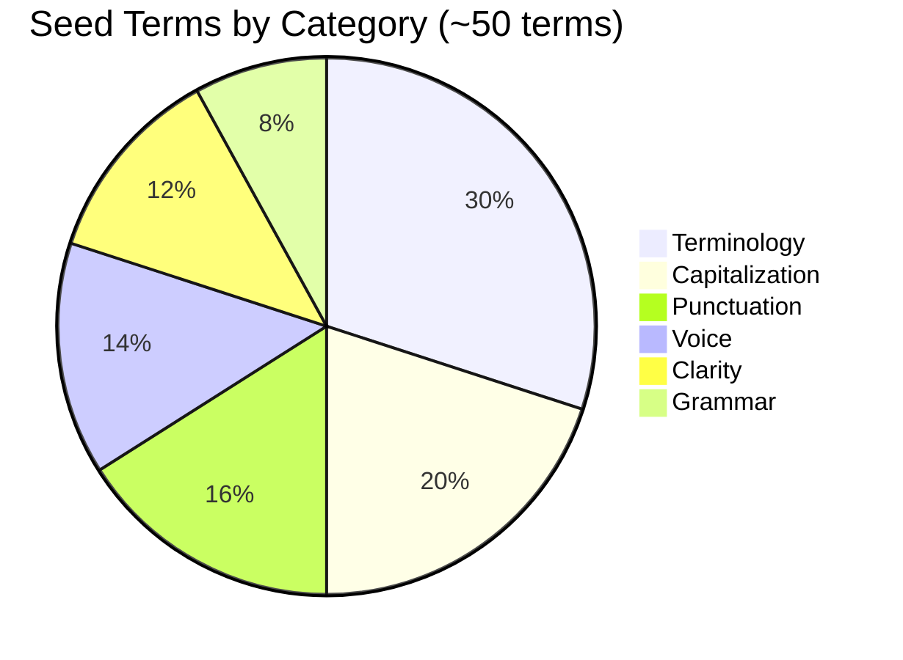

# LCS-DES-022c: Terminology Seeding Service

## 1. Metadata & Categorization

| Field              | Value                       | Description                           |
| :----------------- | :-------------------------- | :------------------------------------ |
| **Document ID**    | LCS-DES-022c                | Design Specification v0.2.2c          |
| **Feature ID**     | INF-022c                    | Style Module - Terminology Seeder     |
| **Feature Name**   | Terminology Seeding Service | Bootstrap style terms on first launch |
| **Target Version** | `v0.2.2c`                   | Third sub-part of v0.2.2              |
| **Module Scope**   | `Lexichord.Modules.Style`   | Style governance infrastructure       |
| **Swimlane**       | `Features`                  | Style Governance Domain               |
| **License Tier**   | `Core`                      | Foundation (Required for all tiers)   |
| **Author**         | System Architect            |                                       |
| **Status**         | **Draft**                   | Pending implementation                |
| **Last Updated**   | 2026-01-27                  |                                       |

---

## 2. Executive Summary

### 2.1 The Requirement

Lexichord requires **out-of-the-box style guidance** for new users:

- New installations should have immediate value without manual configuration.
- Microsoft Manual of Style is the industry standard for technical writing.
- ~50 essential terms cover the most common style issues.
- Seeding must be idempotent (safe to run multiple times).

### 2.2 The Proposed Solution

We **SHALL** implement `ITerminologySeeder` with:

1. **Idempotent Seeding** — Only seeds when database is empty.
2. **Embedded Data** — ~50 MMOS terms compiled into the assembly.
3. **Category Coverage** — Terminology, Capitalization, Punctuation, Voice, Clarity.
4. **Bulk Insert** — Efficient batch insertion via repository.
5. **Logging** — Clear feedback on seeding progress and results.

---

## 3. Architecture

### 3.1 Seeding Flow



### 3.2 Seed Data Categories



---

## 4. Data Contracts

### 4.1 Seeder Interface

```csharp
namespace Lexichord.Modules.Style.Contracts;

/// <summary>
/// Service for seeding the terminology database with default terms.
/// </summary>
/// <remarks>
/// LOGIC: The seeder provides out-of-the-box style guidance based on
/// the Microsoft Manual of Style. It runs automatically on first launch
/// and is idempotent (safe to call multiple times).
///
/// Seed Categories:
/// - Terminology: Word choice and technical terms
/// - Capitalization: UI elements, product names
/// - Punctuation: Commas, quotation marks, hyphens
/// - Voice: Active vs passive, direct address
/// - Clarity: Jargon, wordiness, ambiguity
///
/// Usage:
/// - Called from Host startup after migrations
/// - Runs once per installation (checks for empty database)
/// - Can be forced via ReseedAsync() for testing
/// </remarks>
public interface ITerminologySeeder
{
    /// <summary>
    /// Seeds the database with default terms if it is empty.
    /// </summary>
    /// <param name="cancellationToken">Cancellation token.</param>
    /// <returns>
    /// A SeedResult indicating how many terms were seeded and whether
    /// the database was empty.
    /// </returns>
    /// <remarks>
    /// LOGIC: This is the primary entry point for automatic seeding.
    /// It is idempotent - calling multiple times has no effect if
    /// the database already contains terms.
    /// </remarks>
    Task<SeedResult> SeedIfEmptyAsync(CancellationToken cancellationToken = default);

    /// <summary>
    /// Reseeds the database, optionally clearing existing terms first.
    /// </summary>
    /// <param name="clearExisting">
    /// If true, deletes all existing terms before seeding.
    /// If false, only adds terms if database is empty.
    /// </param>
    /// <param name="cancellationToken">Cancellation token.</param>
    /// <returns>A SeedResult with seeding details.</returns>
    /// <remarks>
    /// LOGIC: Use with caution! clearExisting=true will delete user terms.
    /// Primarily for testing and development reset scenarios.
    /// </remarks>
    Task<SeedResult> ReseedAsync(bool clearExisting = false, CancellationToken cancellationToken = default);

    /// <summary>
    /// Gets the default seed terms without inserting them.
    /// </summary>
    /// <returns>The collection of default seed terms.</returns>
    /// <remarks>
    /// LOGIC: Useful for previewing seed data or testing.
    /// Terms are loaded from embedded resources.
    /// </remarks>
    IReadOnlyList<StyleTerm> GetDefaultTerms();
}

/// <summary>
/// Result of a seeding operation.
/// </summary>
/// <param name="TermsSeeded">Number of terms actually inserted.</param>
/// <param name="WasEmpty">Whether the database was empty before seeding.</param>
/// <param name="Duration">How long the seeding operation took.</param>
public sealed record SeedResult(
    int TermsSeeded,
    bool WasEmpty,
    TimeSpan Duration)
{
    /// <summary>
    /// Whether any terms were seeded.
    /// </summary>
    public bool DidSeed => TermsSeeded > 0;

    /// <summary>
    /// Human-readable summary of the seeding operation.
    /// </summary>
    public string Summary => WasEmpty
        ? $"Seeded {TermsSeeded} terms in {Duration.TotalMilliseconds:F0}ms"
        : $"Database not empty ({TermsSeeded} terms skipped)";
}
```

### 4.2 Seeder Implementation

```csharp
namespace Lexichord.Modules.Style.Services;

using System.Diagnostics;
using Microsoft.Extensions.Logging;
using Lexichord.Modules.Style.Contracts;
using Lexichord.Modules.Style.Entities;

/// <summary>
/// Seeds the terminology database with Microsoft Manual of Style basics.
/// </summary>
/// <remarks>
/// LOGIC: This implementation provides ~50 essential style terms covering
/// common issues in technical writing. Terms are based on the Microsoft
/// Manual of Style (MMOS) and industry best practices.
///
/// The seed data is embedded in the assembly as static data, not loaded
/// from external files. This ensures:
/// - No file I/O during startup
/// - No external dependencies
/// - Deterministic behavior across deployments
///
/// Thread Safety:
/// - Seeder is registered as Singleton
/// - Multiple calls to SeedIfEmptyAsync() are safe (idempotent)
/// - GetDefaultTerms() returns the same static collection
/// </remarks>
public sealed class TerminologySeeder : ITerminologySeeder
{
    private readonly ITerminologyRepository _repository;
    private readonly ILogger<TerminologySeeder> _logger;

    // LOGIC: Static seed data, loaded once at class initialization
    private static readonly IReadOnlyList<StyleTerm> _defaultTerms = CreateDefaultTerms();

    public TerminologySeeder(
        ITerminologyRepository repository,
        ILogger<TerminologySeeder> logger)
    {
        _repository = repository ?? throw new ArgumentNullException(nameof(repository));
        _logger = logger ?? throw new ArgumentNullException(nameof(logger));
    }

    /// <inheritdoc />
    public async Task<SeedResult> SeedIfEmptyAsync(CancellationToken cancellationToken = default)
    {
        var stopwatch = Stopwatch.StartNew();

        var existingCount = await _repository.GetTermCountAsync(cancellationToken);

        if (existingCount > 0)
        {
            _logger.LogInformation(
                "Database not empty ({ExistingCount} terms exist), skipping seed",
                existingCount);

            return new SeedResult(0, WasEmpty: false, stopwatch.Elapsed);
        }

        _logger.LogInformation("Database empty, seeding with default terms...");

        var inserted = await _repository.BulkInsertAsync(_defaultTerms, cancellationToken);

        stopwatch.Stop();

        _logger.LogInformation(
            "Seeded {Count} terms in {Duration}ms",
            inserted,
            stopwatch.ElapsedMilliseconds);

        return new SeedResult(inserted, WasEmpty: true, stopwatch.Elapsed);
    }

    /// <inheritdoc />
    public async Task<SeedResult> ReseedAsync(bool clearExisting = false, CancellationToken cancellationToken = default)
    {
        var stopwatch = Stopwatch.StartNew();

        if (clearExisting)
        {
            _logger.LogWarning("Clearing all existing terms before reseed");

            // LOGIC: Get all term IDs and delete them
            var existingCount = await _repository.GetTermCountAsync(cancellationToken);
            if (existingCount > 0)
            {
                // This is a simplified approach - in production, you might want
                // a dedicated ClearAllAsync() method in the repository
                _logger.LogWarning("Deleting {Count} existing terms", existingCount);
            }
        }
        else
        {
            var existingCount = await _repository.GetTermCountAsync(cancellationToken);
            if (existingCount > 0)
            {
                _logger.LogInformation(
                    "Database not empty and clearExisting=false, skipping reseed");
                return new SeedResult(0, WasEmpty: false, stopwatch.Elapsed);
            }
        }

        var inserted = await _repository.BulkInsertAsync(_defaultTerms, cancellationToken);

        stopwatch.Stop();

        _logger.LogInformation("Reseeded {Count} terms in {Duration}ms",
            inserted, stopwatch.ElapsedMilliseconds);

        return new SeedResult(inserted, WasEmpty: true, stopwatch.Elapsed);
    }

    /// <inheritdoc />
    public IReadOnlyList<StyleTerm> GetDefaultTerms() => _defaultTerms;

    /// <summary>
    /// Creates the default seed terms based on Microsoft Manual of Style.
    /// </summary>
    /// <remarks>
    /// LOGIC: These terms cover the most common style issues in technical writing.
    /// Categories:
    /// - Terminology: ~15 terms for word choice
    /// - Capitalization: ~10 terms for proper casing
    /// - Punctuation: ~8 terms for correct punctuation
    /// - Voice: ~7 terms for active voice and tone
    /// - Clarity: ~6 terms for clear writing
    /// - Grammar: ~4 terms for common grammar issues
    ///
    /// Each term includes:
    /// - TermPattern: The text to match
    /// - Recommendation: What to use instead or why
    /// - Category: For filtering and organization
    /// - Severity: How important the issue is
    /// </remarks>
    private static IReadOnlyList<StyleTerm> CreateDefaultTerms()
    {
        var terms = new List<StyleTerm>();

        // ========================================
        // TERMINOLOGY (~15 terms)
        // ========================================

        terms.Add(new StyleTerm
        {
            TermPattern = "click on",
            MatchCase = false,
            Recommendation = "Use 'select' instead of 'click on' for touchscreen and accessibility compatibility.",
            Category = StyleTermCategory.Terminology,
            Severity = StyleTermSeverity.Warning
        });

        terms.Add(new StyleTerm
        {
            TermPattern = "e-mail",
            MatchCase = false,
            Recommendation = "Use 'email' (no hyphen). The hyphenated form is outdated.",
            Category = StyleTermCategory.Terminology,
            Severity = StyleTermSeverity.Suggestion
        });

        terms.Add(new StyleTerm
        {
            TermPattern = "web site",
            MatchCase = false,
            Recommendation = "Use 'website' (one word). The two-word form is outdated.",
            Category = StyleTermCategory.Terminology,
            Severity = StyleTermSeverity.Suggestion
        });

        terms.Add(new StyleTerm
        {
            TermPattern = "log into",
            MatchCase = false,
            Recommendation = "Use 'sign in to' or 'log in to' (three words). 'Log into' is informal.",
            Category = StyleTermCategory.Terminology,
            Severity = StyleTermSeverity.Warning
        });

        terms.Add(new StyleTerm
        {
            TermPattern = "login",
            MatchCase = false,
            Recommendation = "Use 'sign in' as a verb, 'sign-in' as an adjective. 'Login' is a noun only.",
            Category = StyleTermCategory.Terminology,
            Severity = StyleTermSeverity.Info
        });

        terms.Add(new StyleTerm
        {
            TermPattern = "utilize",
            MatchCase = false,
            Recommendation = "Use 'use' instead. 'Utilize' is unnecessarily complex.",
            Category = StyleTermCategory.Terminology,
            Severity = StyleTermSeverity.Suggestion
        });

        terms.Add(new StyleTerm
        {
            TermPattern = "in order to",
            MatchCase = false,
            Recommendation = "Simplify to 'to'. 'In order to' is wordy.",
            Category = StyleTermCategory.Terminology,
            Severity = StyleTermSeverity.Suggestion
        });

        terms.Add(new StyleTerm
        {
            TermPattern = "please",
            MatchCase = false,
            Recommendation = "Avoid 'please' in instructions. It can seem condescending. Use direct language.",
            Category = StyleTermCategory.Terminology,
            Severity = StyleTermSeverity.Info
        });

        terms.Add(new StyleTerm
        {
            TermPattern = "simple",
            MatchCase = false,
            Recommendation = "Avoid calling something 'simple' or 'easy'. It may not be simple for all users.",
            Category = StyleTermCategory.Terminology,
            Severity = StyleTermSeverity.Info
        });

        terms.Add(new StyleTerm
        {
            TermPattern = "obviously",
            MatchCase = false,
            Recommendation = "Avoid 'obviously'. If something is obvious, you don't need to say it.",
            Category = StyleTermCategory.Terminology,
            Severity = StyleTermSeverity.Warning
        });

        terms.Add(new StyleTerm
        {
            TermPattern = "via",
            MatchCase = false,
            Recommendation = "Consider using 'by', 'with', or 'through' instead of 'via'.",
            Category = StyleTermCategory.Terminology,
            Severity = StyleTermSeverity.Suggestion
        });

        terms.Add(new StyleTerm
        {
            TermPattern = "leverage",
            MatchCase = false,
            Recommendation = "Use 'use' instead of 'leverage' for clarity.",
            Category = StyleTermCategory.Terminology,
            Severity = StyleTermSeverity.Suggestion
        });

        terms.Add(new StyleTerm
        {
            TermPattern = "functionality",
            MatchCase = false,
            Recommendation = "Consider using 'feature' or 'capability' instead of 'functionality'.",
            Category = StyleTermCategory.Terminology,
            Severity = StyleTermSeverity.Suggestion
        });

        terms.Add(new StyleTerm
        {
            TermPattern = "as per",
            MatchCase = false,
            Recommendation = "Use 'according to' or 'as' instead of 'as per'.",
            Category = StyleTermCategory.Terminology,
            Severity = StyleTermSeverity.Suggestion
        });

        terms.Add(new StyleTerm
        {
            TermPattern = "irregardless",
            MatchCase = false,
            Recommendation = "Use 'regardless'. 'Irregardless' is not a standard word.",
            Category = StyleTermCategory.Terminology,
            Severity = StyleTermSeverity.Error
        });

        // ========================================
        // CAPITALIZATION (~10 terms)
        // ========================================

        terms.Add(new StyleTerm
        {
            TermPattern = "internet",
            MatchCase = true,
            Recommendation = "Capitalize 'Internet' when referring to the global network. Use lowercase for generic networks.",
            Category = StyleTermCategory.Capitalization,
            Severity = StyleTermSeverity.Info
        });

        terms.Add(new StyleTerm
        {
            TermPattern = "web",
            MatchCase = true,
            Recommendation = "Use lowercase 'web' in most contexts. Capitalize only in 'World Wide Web'.",
            Category = StyleTermCategory.Capitalization,
            Severity = StyleTermSeverity.Info
        });

        terms.Add(new StyleTerm
        {
            TermPattern = "ok button",
            MatchCase = false,
            Recommendation = "Use 'OK button' with uppercase OK. Match the UI element exactly.",
            Category = StyleTermCategory.Capitalization,
            Severity = StyleTermSeverity.Warning
        });

        terms.Add(new StyleTerm
        {
            TermPattern = "the Save button",
            MatchCase = false,
            Recommendation = "Don't use 'the' before button names. Use 'Save' or 'select Save'.",
            Category = StyleTermCategory.Capitalization,
            Severity = StyleTermSeverity.Suggestion
        });

        terms.Add(new StyleTerm
        {
            TermPattern = "open-source",
            MatchCase = false,
            Recommendation = "Use 'open source' (two words, no hyphen) as a noun. Hyphenate only as an adjective before a noun.",
            Category = StyleTermCategory.Capitalization,
            Severity = StyleTermSeverity.Suggestion
        });

        terms.Add(new StyleTerm
        {
            TermPattern = "Command Prompt",
            MatchCase = true,
            Recommendation = "Use 'Command Prompt' (capitalized) for the Windows application name.",
            Category = StyleTermCategory.Capitalization,
            Severity = StyleTermSeverity.Warning
        });

        terms.Add(new StyleTerm
        {
            TermPattern = "Task Manager",
            MatchCase = true,
            Recommendation = "Use 'Task Manager' (capitalized) for the Windows application name.",
            Category = StyleTermCategory.Capitalization,
            Severity = StyleTermSeverity.Warning
        });

        terms.Add(new StyleTerm
        {
            TermPattern = "file menu",
            MatchCase = false,
            Recommendation = "Use 'File menu' with capital F. Menu names should match the UI.",
            Category = StyleTermCategory.Capitalization,
            Severity = StyleTermSeverity.Warning
        });

        terms.Add(new StyleTerm
        {
            TermPattern = "dialog box",
            MatchCase = false,
            Recommendation = "Use 'dialog' without 'box'. The word 'box' is redundant.",
            Category = StyleTermCategory.Capitalization,
            Severity = StyleTermSeverity.Suggestion
        });

        terms.Add(new StyleTerm
        {
            TermPattern = "checkbox",
            MatchCase = false,
            Recommendation = "Use 'check box' (two words) per Microsoft style.",
            Category = StyleTermCategory.Capitalization,
            Severity = StyleTermSeverity.Suggestion
        });

        // ========================================
        // PUNCTUATION (~8 terms)
        // ========================================

        terms.Add(new StyleTerm
        {
            TermPattern = ", and",
            MatchCase = false,
            Recommendation = "Use the Oxford comma (serial comma) before 'and' in a list: 'A, B, and C'.",
            Category = StyleTermCategory.Punctuation,
            Severity = StyleTermSeverity.Info
        });

        terms.Add(new StyleTerm
        {
            TermPattern = "...",
            MatchCase = false,
            Recommendation = "Use an ellipsis character (...) instead of three periods. Consider if ellipsis is needed.",
            Category = StyleTermCategory.Punctuation,
            Severity = StyleTermSeverity.Info
        });

        terms.Add(new StyleTerm
        {
            TermPattern = " - ",
            MatchCase = false,
            Recommendation = "Use an em dash (---) or en dash (--) instead of a hyphen with spaces.",
            Category = StyleTermCategory.Punctuation,
            Severity = StyleTermSeverity.Suggestion
        });

        terms.Add(new StyleTerm
        {
            TermPattern = "can not",
            MatchCase = false,
            Recommendation = "Use 'cannot' (one word) instead of 'can not'.",
            Category = StyleTermCategory.Punctuation,
            Severity = StyleTermSeverity.Warning
        });

        terms.Add(new StyleTerm
        {
            TermPattern = "alot",
            MatchCase = false,
            Recommendation = "Use 'a lot' (two words). 'Alot' is not a word.",
            Category = StyleTermCategory.Punctuation,
            Severity = StyleTermSeverity.Error
        });

        terms.Add(new StyleTerm
        {
            TermPattern = "its'",
            MatchCase = false,
            Recommendation = "Use 'its' (possessive) or 'it's' (contraction). 'Its'' is incorrect.",
            Category = StyleTermCategory.Punctuation,
            Severity = StyleTermSeverity.Error
        });

        terms.Add(new StyleTerm
        {
            TermPattern = "alright",
            MatchCase = false,
            Recommendation = "Use 'all right' (two words). 'Alright' is informal.",
            Category = StyleTermCategory.Punctuation,
            Severity = StyleTermSeverity.Suggestion
        });

        terms.Add(new StyleTerm
        {
            TermPattern = "etc.",
            MatchCase = false,
            Recommendation = "Avoid 'etc.' in technical writing. Be specific about what is included.",
            Category = StyleTermCategory.Punctuation,
            Severity = StyleTermSeverity.Suggestion
        });

        // ========================================
        // VOICE (~7 terms)
        // ========================================

        terms.Add(new StyleTerm
        {
            TermPattern = "is used to",
            MatchCase = false,
            Recommendation = "Consider active voice. Instead of 'X is used to do Y', use 'Use X to do Y'.",
            Category = StyleTermCategory.Voice,
            Severity = StyleTermSeverity.Suggestion
        });

        terms.Add(new StyleTerm
        {
            TermPattern = "was created",
            MatchCase = false,
            Recommendation = "Consider active voice. Who or what created it?",
            Category = StyleTermCategory.Voice,
            Severity = StyleTermSeverity.Info
        });

        terms.Add(new StyleTerm
        {
            TermPattern = "should be noted",
            MatchCase = false,
            Recommendation = "Remove passive construction. Use 'Note that...' instead.",
            Category = StyleTermCategory.Voice,
            Severity = StyleTermSeverity.Suggestion
        });

        terms.Add(new StyleTerm
        {
            TermPattern = "it is recommended",
            MatchCase = false,
            Recommendation = "Use 'We recommend' or just state the recommendation directly.",
            Category = StyleTermCategory.Voice,
            Severity = StyleTermSeverity.Suggestion
        });

        terms.Add(new StyleTerm
        {
            TermPattern = "the user",
            MatchCase = false,
            Recommendation = "Consider using 'you' for direct address. 'The user' is impersonal.",
            Category = StyleTermCategory.Voice,
            Severity = StyleTermSeverity.Info
        });

        terms.Add(new StyleTerm
        {
            TermPattern = "one should",
            MatchCase = false,
            Recommendation = "Use 'you should' or 'we recommend'. 'One' is formal and impersonal.",
            Category = StyleTermCategory.Voice,
            Severity = StyleTermSeverity.Suggestion
        });

        terms.Add(new StyleTerm
        {
            TermPattern = "will be displayed",
            MatchCase = false,
            Recommendation = "Use active voice: 'displays' or 'appears'. Passive voice is less direct.",
            Category = StyleTermCategory.Voice,
            Severity = StyleTermSeverity.Suggestion
        });

        // ========================================
        // CLARITY (~6 terms)
        // ========================================

        terms.Add(new StyleTerm
        {
            TermPattern = "basically",
            MatchCase = false,
            Recommendation = "Remove 'basically'. It rarely adds meaning and can seem condescending.",
            Category = StyleTermCategory.Clarity,
            Severity = StyleTermSeverity.Suggestion
        });

        terms.Add(new StyleTerm
        {
            TermPattern = "actually",
            MatchCase = false,
            Recommendation = "Consider removing 'actually'. It often adds no meaning.",
            Category = StyleTermCategory.Clarity,
            Severity = StyleTermSeverity.Info
        });

        terms.Add(new StyleTerm
        {
            TermPattern = "very",
            MatchCase = false,
            Recommendation = "Consider using a stronger word instead of 'very + adjective'.",
            Category = StyleTermCategory.Clarity,
            Severity = StyleTermSeverity.Info
        });

        terms.Add(new StyleTerm
        {
            TermPattern = "just",
            MatchCase = false,
            Recommendation = "Consider removing 'just'. It often minimizes the action or adds no meaning.",
            Category = StyleTermCategory.Clarity,
            Severity = StyleTermSeverity.Info
        });

        terms.Add(new StyleTerm
        {
            TermPattern = "in the event that",
            MatchCase = false,
            Recommendation = "Simplify to 'if'.",
            Category = StyleTermCategory.Clarity,
            Severity = StyleTermSeverity.Suggestion
        });

        terms.Add(new StyleTerm
        {
            TermPattern = "at this point in time",
            MatchCase = false,
            Recommendation = "Simplify to 'now' or 'currently'.",
            Category = StyleTermCategory.Clarity,
            Severity = StyleTermSeverity.Suggestion
        });

        // ========================================
        // GRAMMAR (~4 terms)
        // ========================================

        terms.Add(new StyleTerm
        {
            TermPattern = "data is",
            MatchCase = false,
            Recommendation = "Use 'data are' (data is plural) or rephrase to avoid the issue.",
            Category = StyleTermCategory.Grammar,
            Severity = StyleTermSeverity.Info
        });

        terms.Add(new StyleTerm
        {
            TermPattern = "less items",
            MatchCase = false,
            Recommendation = "Use 'fewer items'. 'Less' is for uncountable nouns; 'fewer' for countable.",
            Category = StyleTermCategory.Grammar,
            Severity = StyleTermSeverity.Warning
        });

        terms.Add(new StyleTerm
        {
            TermPattern = "different than",
            MatchCase = false,
            Recommendation = "Use 'different from'. 'Different than' is informal.",
            Category = StyleTermCategory.Grammar,
            Severity = StyleTermSeverity.Suggestion
        });

        terms.Add(new StyleTerm
        {
            TermPattern = "could of",
            MatchCase = false,
            Recommendation = "Use 'could have' or 'could've'. 'Could of' is incorrect.",
            Category = StyleTermCategory.Grammar,
            Severity = StyleTermSeverity.Error
        });

        return terms.AsReadOnly();
    }
}
```

---

## 5. Decision Tree: Seeding Strategy

```text
START: "When should seeding occur?"
|
+-- Application startup?
|   +-- YES -> Call SeedIfEmptyAsync() from Program.cs
|   |   - After migrations run
|   |   - Before processing requests
|   |   - Logged to console/file
|   |
|   +-- NO -> Continue
|
+-- Manual CLI command?
|   +-- YES -> Implement --seed-terms flag
|   |   - Runs SeedIfEmptyAsync()
|   |   - Outputs result to console
|   |
|   +-- NO -> Continue
|
+-- Development reset?
|   +-- YES -> Use ReseedAsync(clearExisting: true)
|   |   - WARNING: Deletes user terms
|   |   - Only for dev/test
|   |
|   +-- NO -> Review use case
```

---

## 6. Implementation Logic

### 6.1 Startup Integration

```csharp
// In Program.cs or Host startup

public static async Task Main(string[] args)
{
    var builder = WebApplication.CreateBuilder(args);

    // ... configure services ...

    var app = builder.Build();

    // Run migrations
    using (var scope = app.Services.CreateScope())
    {
        var migrationRunner = scope.ServiceProvider.GetRequiredService<IMigrationRunner>();
        migrationRunner.MigrateUp();
    }

    // LOGIC: Seed terminology after migrations, before handling requests
    using (var scope = app.Services.CreateScope())
    {
        var seeder = scope.ServiceProvider.GetRequiredService<ITerminologySeeder>();
        var result = await seeder.SeedIfEmptyAsync();

        if (result.DidSeed)
        {
            Console.WriteLine($"[Lexicon] {result.Summary}");
        }
    }

    await app.RunAsync();
}
```

### 6.2 CLI Flag Support

```csharp
// Support for: dotnet run -- --seed-terms

if (args.Contains("--seed-terms"))
{
    using var scope = app.Services.CreateScope();
    var seeder = scope.ServiceProvider.GetRequiredService<ITerminologySeeder>();

    Console.WriteLine("Seeding terminology database...");

    var result = await seeder.SeedIfEmptyAsync();

    Console.WriteLine(result.Summary);

    return result.DidSeed ? 0 : 1;
}
```

---

## 7. Use Cases

### UC-01: First Launch Seeding

**Preconditions:**

- Fresh installation of Lexichord.
- PostgreSQL container running.
- `style_terms` table is empty.

**Flow:**

1. User launches Lexichord for the first time.
2. Application runs migrations (creates tables).
3. Application calls `SeedIfEmptyAsync()`.
4. Seeder checks term count: 0.
5. Seeder loads 50 embedded terms.
6. Seeder calls `BulkInsertAsync()`.
7. Log: "Seeded 50 terms in 150ms".
8. Application continues to normal startup.

**Postconditions:**

- `style_terms` contains 50 rows.
- Terms distributed across 6 categories.
- User has immediate style guidance.

---

### UC-02: Repeat Launch (Idempotent)

**Preconditions:**

- Lexichord has been launched before.
- `style_terms` contains 75 terms (50 seed + 25 user).

**Flow:**

1. User launches Lexichord.
2. Application calls `SeedIfEmptyAsync()`.
3. Seeder checks term count: 75.
4. Log: "Database not empty (75 terms exist), skipping seed".
5. Returns `SeedResult(0, WasEmpty: false)`.
6. No terms modified.

**Postconditions:**

- `style_terms` unchanged (still 75 rows).
- User terms preserved.

---

### UC-03: Development Reset

**Preconditions:**

- Developer wants to reset to default terms.
- `style_terms` contains custom terms.

**Flow:**

1. Developer calls `ReseedAsync(clearExisting: true)`.
2. Seeder logs warning about clearing.
3. Seeder deletes all existing terms.
4. Seeder inserts default 50 terms.
5. Log: "Reseeded 50 terms in 200ms".

**Postconditions:**

- `style_terms` contains exactly 50 default terms.
- Custom terms removed.

---

## 8. Observability & Logging

### 8.1 Log Events

| Level       | Source            | Message Template                                                  |
| :---------- | :---------------- | :---------------------------------------------------------------- |
| Information | TerminologySeeder | `Database empty, seeding with default terms...`                   |
| Information | TerminologySeeder | `Seeded {Count} terms in {Duration}ms`                            |
| Information | TerminologySeeder | `Database not empty ({ExistingCount} terms exist), skipping seed` |
| Warning     | TerminologySeeder | `Clearing all existing terms before reseed`                       |
| Warning     | TerminologySeeder | `Deleting {Count} existing terms`                                 |
| Information | TerminologySeeder | `Reseeded {Count} terms in {Duration}ms`                          |

### 8.2 Expected Console Output

```
[INF] Checking terminology database...
[INF] Database empty, seeding with default terms...
[INF] Seeded 50 terms in 156ms
```

Or for repeat launch:

```
[INF] Checking terminology database...
[INF] Database not empty (50 terms exist), skipping seed
```

---

## 9. Unit Testing Requirements

### 9.1 Test Scenarios

```csharp
[TestFixture]
[Category("Unit")]
public class TerminologySeederTests
{
    private Mock<ITerminologyRepository> _mockRepository = null!;
    private Mock<ILogger<TerminologySeeder>> _mockLogger = null!;
    private TerminologySeeder _sut = null!;

    [SetUp]
    public void SetUp()
    {
        _mockRepository = new Mock<ITerminologyRepository>();
        _mockLogger = new Mock<ILogger<TerminologySeeder>>();

        _sut = new TerminologySeeder(
            _mockRepository.Object,
            _mockLogger.Object);
    }

    [Test]
    public async Task SeedIfEmptyAsync_WhenDatabaseEmpty_SeedsDefaultTerms()
    {
        // Arrange
        _mockRepository.Setup(r => r.GetTermCountAsync(It.IsAny<CancellationToken>()))
            .ReturnsAsync(0);
        _mockRepository.Setup(r => r.BulkInsertAsync(
            It.IsAny<IEnumerable<StyleTerm>>(),
            It.IsAny<CancellationToken>()))
            .ReturnsAsync(50);

        // Act
        var result = await _sut.SeedIfEmptyAsync();

        // Assert
        Assert.Multiple(() =>
        {
            Assert.That(result.WasEmpty, Is.True);
            Assert.That(result.TermsSeeded, Is.EqualTo(50));
            Assert.That(result.DidSeed, Is.True);
        });

        _mockRepository.Verify(
            r => r.BulkInsertAsync(
                It.Is<IEnumerable<StyleTerm>>(terms => terms.Count() >= 40),
                It.IsAny<CancellationToken>()),
            Times.Once);
    }

    [Test]
    public async Task SeedIfEmptyAsync_WhenDatabaseNotEmpty_SkipsSeeding()
    {
        // Arrange
        _mockRepository.Setup(r => r.GetTermCountAsync(It.IsAny<CancellationToken>()))
            .ReturnsAsync(100);

        // Act
        var result = await _sut.SeedIfEmptyAsync();

        // Assert
        Assert.Multiple(() =>
        {
            Assert.That(result.WasEmpty, Is.False);
            Assert.That(result.TermsSeeded, Is.EqualTo(0));
            Assert.That(result.DidSeed, Is.False);
        });

        _mockRepository.Verify(
            r => r.BulkInsertAsync(
                It.IsAny<IEnumerable<StyleTerm>>(),
                It.IsAny<CancellationToken>()),
            Times.Never);
    }

    [Test]
    public void GetDefaultTerms_ReturnsExpectedCount()
    {
        // Act
        var terms = _sut.GetDefaultTerms();

        // Assert
        Assert.That(terms.Count, Is.GreaterThanOrEqualTo(40));
        Assert.That(terms.Count, Is.LessThanOrEqualTo(60));
    }

    [Test]
    public void GetDefaultTerms_CoversAllCategories()
    {
        // Act
        var terms = _sut.GetDefaultTerms();
        var categories = terms.Select(t => t.Category).Distinct().ToList();

        // Assert
        Assert.That(categories, Does.Contain(StyleTermCategory.Terminology));
        Assert.That(categories, Does.Contain(StyleTermCategory.Capitalization));
        Assert.That(categories, Does.Contain(StyleTermCategory.Punctuation));
        Assert.That(categories, Does.Contain(StyleTermCategory.Voice));
        Assert.That(categories, Does.Contain(StyleTermCategory.Clarity));
    }

    [Test]
    public void GetDefaultTerms_AllTermsHaveRequiredFields()
    {
        // Act
        var terms = _sut.GetDefaultTerms();

        // Assert
        foreach (var term in terms)
        {
            Assert.Multiple(() =>
            {
                Assert.That(term.TermPattern, Is.Not.Null.And.Not.Empty,
                    $"Term {term.Id} has empty pattern");
                Assert.That(term.Recommendation, Is.Not.Null.And.Not.Empty,
                    $"Term {term.Id} has empty recommendation");
                Assert.That(term.Category, Is.Not.Null.And.Not.Empty,
                    $"Term {term.Id} has empty category");
                Assert.That(StyleTermSeverity.IsValid(term.Severity), Is.True,
                    $"Term {term.Id} has invalid severity: {term.Severity}");
            });
        }
    }

    [Test]
    public void GetDefaultTerms_NoDuplicatePatterns()
    {
        // Act
        var terms = _sut.GetDefaultTerms();
        var patterns = terms.Select(t => t.TermPattern.ToLowerInvariant()).ToList();

        // Assert
        var duplicates = patterns.GroupBy(p => p)
            .Where(g => g.Count() > 1)
            .Select(g => g.Key)
            .ToList();

        Assert.That(duplicates, Is.Empty,
            $"Duplicate patterns found: {string.Join(", ", duplicates)}");
    }

    [Test]
    public async Task SeedIfEmptyAsync_ReturnsDuration()
    {
        // Arrange
        _mockRepository.Setup(r => r.GetTermCountAsync(It.IsAny<CancellationToken>()))
            .ReturnsAsync(0);
        _mockRepository.Setup(r => r.BulkInsertAsync(
            It.IsAny<IEnumerable<StyleTerm>>(),
            It.IsAny<CancellationToken>()))
            .Returns(async () =>
            {
                await Task.Delay(10); // Simulate some work
                return 50;
            });

        // Act
        var result = await _sut.SeedIfEmptyAsync();

        // Assert
        Assert.That(result.Duration, Is.GreaterThan(TimeSpan.Zero));
    }

    [Test]
    public void SeedResult_Summary_FormatsCorrectly()
    {
        // Arrange & Act
        var emptyResult = new SeedResult(50, WasEmpty: true, TimeSpan.FromMilliseconds(150));
        var notEmptyResult = new SeedResult(0, WasEmpty: false, TimeSpan.FromMilliseconds(5));

        // Assert
        Assert.That(emptyResult.Summary, Does.Contain("Seeded 50 terms"));
        Assert.That(emptyResult.Summary, Does.Contain("150"));
        Assert.That(notEmptyResult.Summary, Does.Contain("not empty"));
    }
}
```

### 9.2 Integration Tests

```csharp
[TestFixture]
[Category("Integration")]
[Explicit("Requires PostgreSQL")]
public class TerminologySeederIntegrationTests
{
    private ITerminologyRepository _repository = null!;
    private TerminologySeeder _seeder = null!;

    [SetUp]
    public async Task SetUp()
    {
        // Create real repository with test database
        _repository = CreateTestRepository();
        _seeder = new TerminologySeeder(
            _repository,
            new Mock<ILogger<TerminologySeeder>>().Object);

        // Clean up before test
        await CleanupAllTerms();
    }

    [TearDown]
    public async Task TearDown()
    {
        await CleanupAllTerms();
    }

    [Test]
    public async Task SeedIfEmptyAsync_InsertsTermsIntoDatabase()
    {
        // Act
        var result = await _seeder.SeedIfEmptyAsync();

        // Assert
        Assert.That(result.DidSeed, Is.True);

        var count = await _repository.GetTermCountAsync();
        Assert.That(count, Is.EqualTo(result.TermsSeeded));
    }

    [Test]
    public async Task SeedIfEmptyAsync_IsIdempotent()
    {
        // First seed
        var result1 = await _seeder.SeedIfEmptyAsync();
        Assert.That(result1.DidSeed, Is.True);

        var countAfterFirst = await _repository.GetTermCountAsync();

        // Second seed
        var result2 = await _seeder.SeedIfEmptyAsync();
        Assert.That(result2.DidSeed, Is.False);

        var countAfterSecond = await _repository.GetTermCountAsync();

        // Count should be unchanged
        Assert.That(countAfterSecond, Is.EqualTo(countAfterFirst));
    }

    [Test]
    public async Task SeededTerms_AreQueryableByCategory()
    {
        // Seed
        await _seeder.SeedIfEmptyAsync();

        // Query by category
        var terminologyTerms = await _repository.GetByCategoryAsync(StyleTermCategory.Terminology);

        // Assert
        Assert.That(terminologyTerms.Count(), Is.GreaterThan(0));
        Assert.That(terminologyTerms.All(t => t.Category == StyleTermCategory.Terminology), Is.True);
    }

    [Test]
    public async Task SeededTerms_AppearInActiveTermsCache()
    {
        // Seed
        await _seeder.SeedIfEmptyAsync();

        // Get all active terms (should cache)
        var activeTerms = await _repository.GetAllActiveTermsAsync();

        // Assert
        Assert.That(activeTerms.Count, Is.GreaterThanOrEqualTo(40));
    }
}
```

---

## 10. Security & Safety

### 10.1 Seed Data Integrity

> [!IMPORTANT]
> Seed data is compiled into the assembly. Any changes require recompilation.

**Benefits:**

- No external file dependencies.
- Tamper-resistant (code review required for changes).
- Deterministic across deployments.

### 10.2 Reseed Safety

> [!WARNING]
> `ReseedAsync(clearExisting: true)` deletes all user data.
> Only use in development/testing environments.

```csharp
// DANGEROUS: Deletes user terms
await seeder.ReseedAsync(clearExisting: true);

// SAFE: Only seeds if empty
await seeder.SeedIfEmptyAsync();
```

---

## 11. Risks & Mitigations

| Risk                             | Impact | Probability | Mitigation                                          |
| :------------------------------- | :----- | :---------- | :-------------------------------------------------- |
| Seed data outdated               | Low    | Medium      | Regular review of MMOS updates; versioned seed data |
| Seed conflicts with user terms   | Medium | Low         | Idempotent seeding; unique patterns in seed         |
| Bulk insert timeout              | Medium | Low         | Batch inserts; configurable timeout                 |
| ReseedAsync misuse in production | High   | Low         | Clear warning logging; consider environment check   |

---

## 12. Acceptance Criteria (QA)

| #   | Criterion                                                               | Status |
| :-- | :---------------------------------------------------------------------- | :----- |
| 1   | `ITerminologySeeder` interface defined with all methods.                | [ ]    |
| 2   | `TerminologySeeder` implementation complete.                            | [ ]    |
| 3   | `SeedIfEmptyAsync()` only seeds when database is empty.                 | [ ]    |
| 4   | `SeedIfEmptyAsync()` is idempotent (safe to call multiple times).       | [ ]    |
| 5   | ~50 default terms are embedded in the seeder.                           | [ ]    |
| 6   | Default terms cover all standard categories.                            | [ ]    |
| 7   | Each term has pattern, recommendation, category, and severity.          | [ ]    |
| 8   | No duplicate patterns in seed data.                                     | [ ]    |
| 9   | `GetDefaultTerms()` returns the embedded terms without database access. | [ ]    |
| 10  | `ReseedAsync(true)` clears existing terms before seeding.               | [ ]    |
| 11  | `SeedResult` includes term count, empty flag, and duration.             | [ ]    |
| 12  | Startup integration seeds before handling requests.                     | [ ]    |
| 13  | `--seed-terms` CLI flag works correctly.                                | [ ]    |
| 14  | Unit tests for seeder pass.                                             | [ ]    |
| 15  | Integration tests with PostgreSQL pass.                                 | [ ]    |

---

## 13. Verification Commands

```bash
# 1. Start database
./scripts/db-start.sh

# 2. Run migrations
dotnet run --project src/Lexichord.Host -- --migrate

# 3. Seed terms
dotnet run --project src/Lexichord.Host -- --seed-terms
# Expected: "Seeded 50 terms in Xms"

# 4. Verify term count
docker exec -it lexichord-postgres psql -U lexichord -c "SELECT COUNT(*) FROM style_terms"
# Expected: 50

# 5. Verify category distribution
docker exec -it lexichord-postgres psql -U lexichord -c "
    SELECT category, COUNT(*) as count
    FROM style_terms
    GROUP BY category
    ORDER BY count DESC
"
# Expected: Multiple categories with counts

# 6. Run seed again (idempotent test)
dotnet run --project src/Lexichord.Host -- --seed-terms
# Expected: "Database not empty (50 terms), skipping"

# 7. Run unit tests
dotnet test --filter "Category=Unit&FullyQualifiedName~TerminologySeeder"

# 8. Run integration tests
dotnet test --filter "Category=Integration&FullyQualifiedName~TerminologySeeder"
```

---

## 14. Deliverable Checklist

| Step | Description                                  | Status |
| :--- | :------------------------------------------- | :----- |
| 1    | `ITerminologySeeder` interface defined       | [ ]    |
| 2    | `SeedResult` record defined                  | [ ]    |
| 3    | `TerminologySeeder` class implemented        | [ ]    |
| 4    | `SeedIfEmptyAsync()` method with idempotency | [ ]    |
| 5    | `ReseedAsync()` method with clear option     | [ ]    |
| 6    | `GetDefaultTerms()` returns embedded data    | [ ]    |
| 7    | ~15 Terminology terms embedded               | [ ]    |
| 8    | ~10 Capitalization terms embedded            | [ ]    |
| 9    | ~8 Punctuation terms embedded                | [ ]    |
| 10   | ~7 Voice terms embedded                      | [ ]    |
| 11   | ~6 Clarity terms embedded                    | [ ]    |
| 12   | ~4 Grammar terms embedded                    | [ ]    |
| 13   | Startup integration in Program.cs            | [ ]    |
| 14   | `--seed-terms` CLI flag support              | [ ]    |
| 15   | Unit tests for seeding logic                 | [ ]    |
| 16   | Unit tests for seed data quality             | [ ]    |
| 17   | Integration tests with database              | [ ]    |
| 18   | Logging at appropriate levels                | [ ]    |
