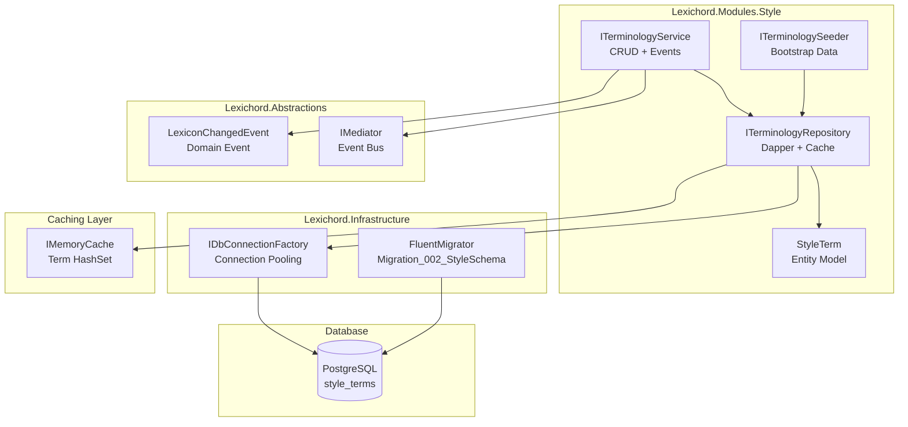
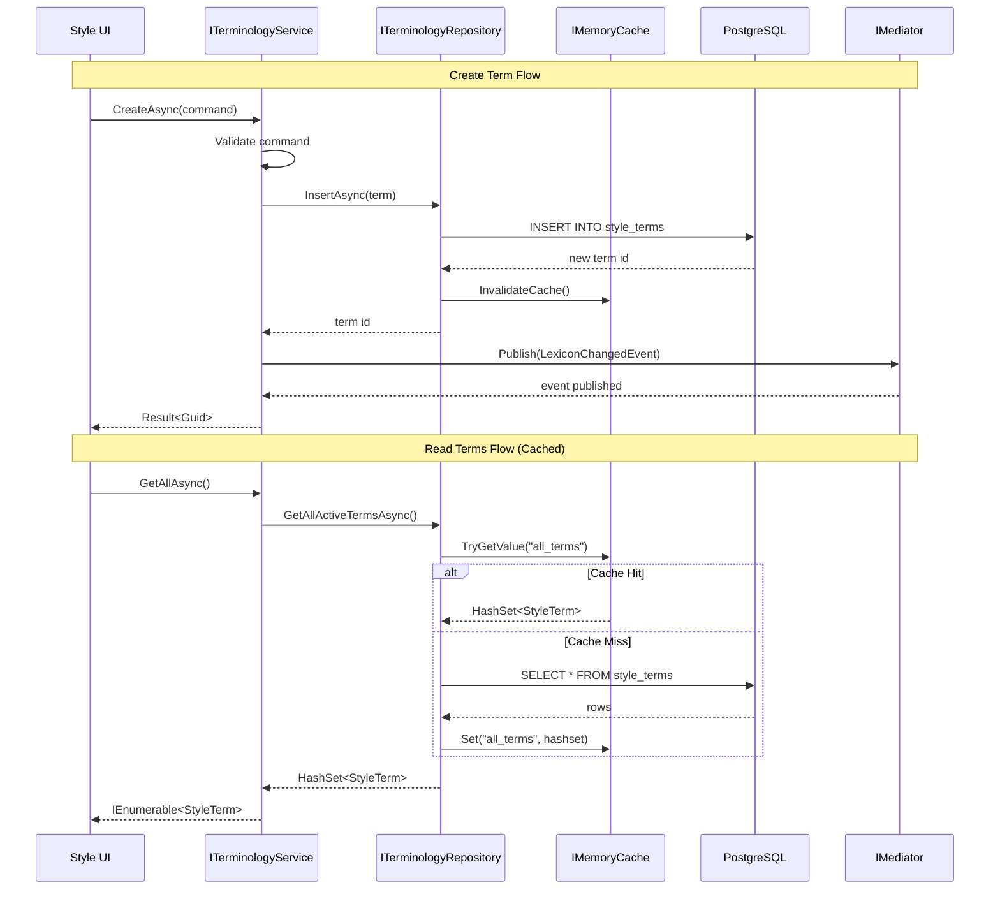

# LCS-DES-022: Design Specification Index — The Lexicon (Terminology Database)

## Document Control

| Field              | Value                              |
| :----------------- | :--------------------------------- |
| **Document ID**    | LCS-DES-022-INDEX                  |
| **Feature ID**     | INF-022                            |
| **Feature Name**   | The Lexicon (Terminology Database) |
| **Target Version** | v0.2.2                             |
| **Status**         | Draft                              |
| **Last Updated**   | 2026-01-27                         |

---

## Executive Summary

**v0.2.2** establishes the **Terminology Database** for Lexichord's Style Governance module. This release transforms style term management from ephemeral YAML configuration into a robust, persistent storage system capable of handling thousands of terminology rules. The Lexicon becomes the authoritative source for all style recommendations, enabling complex pattern matching, categorization, and audit trails.

### Business Value

- **Scalability:** Persistent PostgreSQL storage handles 10,000+ terminology rules without performance degradation
- **Performance:** IMemoryCache-backed repository ensures sub-millisecond term lookups during document analysis
- **Bootstrapping:** Automatic seeding with Microsoft Manual of Style basics provides immediate value on first launch
- **Extensibility:** MediatR event publication enables modules to react to terminology changes in real-time
- **Auditability:** Database storage enables change tracking, versioning, and rollback capabilities

### Why PostgreSQL + Cache?

| Aspect          | YAML Files                    | PostgreSQL + Cache                  |
| :-------------- | :---------------------------- | :---------------------------------- |
| **Scale**       | ~100 terms before unwieldy    | 100,000+ terms with indexed queries |
| **Performance** | Full file parse on every load | Indexed queries + in-memory cache   |
| **Concurrency** | File locking issues           | ACID transactions                   |
| **Querying**    | Manual iteration              | SQL with pattern matching           |
| **Versioning**  | Git history only              | Database audit logs                 |
| **Hot Reload**  | Full file reload              | Event-driven cache invalidation     |

---

## Related Documents

| Document Type       | Document ID  | Title                       | Path                |
| :------------------ | :----------- | :-------------------------- | :------------------ |
| **Scope Breakdown** | LCS-SBD-022  | Terminology Database Scope  | `./LCS-SBD-022.md`  |
| **Sub-Part 022a**   | LCS-DES-022a | Style Schema Migration      | `./LCS-DES-022a.md` |
| **Sub-Part 022b**   | LCS-DES-022b | Terminology Repository      | `./LCS-DES-022b.md` |
| **Sub-Part 022c**   | LCS-DES-022c | Terminology Seeding Service | `./LCS-DES-022c.md` |
| **Sub-Part 022d**   | LCS-DES-022d | Terminology CRUD Service    | `./LCS-DES-022d.md` |

---

## Architecture Overview

### High-Level Component Diagram



### Data Flow Sequence



### Database Schema

```sql
CREATE TABLE style_terms (
    id UUID PRIMARY KEY DEFAULT gen_random_uuid(),
    term_pattern VARCHAR(500) NOT NULL,
    match_case BOOLEAN NOT NULL DEFAULT FALSE,
    recommendation TEXT NOT NULL,
    category VARCHAR(100) NOT NULL,
    severity VARCHAR(20) NOT NULL DEFAULT 'suggestion',
    is_active BOOLEAN NOT NULL DEFAULT TRUE,
    created_at TIMESTAMPTZ NOT NULL DEFAULT NOW(),
    updated_at TIMESTAMPTZ NOT NULL DEFAULT NOW(),
    CONSTRAINT chk_severity CHECK (severity IN ('error', 'warning', 'suggestion', 'info'))
);
```

---

## Dependencies

### Upstream Dependencies

| Component             | Source Version | Usage                                     |
| :-------------------- | :------------- | :---------------------------------------- |
| IDbConnectionFactory  | v0.0.5b        | Database connectivity for Dapper queries  |
| FluentMigrator        | v0.0.5c        | Schema versioning for `style_terms` table |
| IGenericRepository<T> | v0.0.5d        | Base repository pattern (extended)        |
| IMediator             | v0.0.7a        | Publishing LexiconChangedEvent            |
| DomainEventBase       | v0.0.7b        | Base class for domain events              |
| IModule               | v0.0.4a        | Style module registration                 |
| ILogger<T>            | v0.0.3b        | Structured logging (Serilog)              |

### External Dependencies

| Package                               | Purpose                                   |
| :------------------------------------ | :---------------------------------------- |
| `Dapper`                              | Micro-ORM for performant database queries |
| `Microsoft.Extensions.Caching.Memory` | In-memory caching for term lookups        |
| `FluentMigrator`                      | Database schema migrations                |
| `Npgsql`                              | PostgreSQL driver                         |

---

## License Gating Strategy

| Feature                | Core Tier                        | WriterPro Tier       |
| :--------------------- | :------------------------------- | :------------------- |
| **Default Terms**      | ✅ ~50 Microsoft Manual of Style | ✅ Full access       |
| **Custom Terms**       | ❌ Read-only                     | ✅ Full CRUD         |
| **Term Import/Export** | ❌ Not available                 | ✅ JSON/YAML import  |
| **Term Categories**    | ✅ Standard categories           | ✅ Custom categories |

**Rationale:**

- Core tier provides essential style checking with embedded terms
- WriterPro unlocks term customization for professional writers
- Future: Enterprise tier adds team-shared term repositories

---

## Key Interfaces Summary

### ITerminologyRepository (v0.2.2b)

Data access layer with Dapper-based queries and IMemoryCache integration. Provides `HashSet<StyleTerm>` return type for O(1) pattern matching.

**See:** `LCS-DES-022b.md` for full specification

### ITerminologySeeder (v0.2.2c)

Bootstrap service that populates an empty database with ~50 Microsoft Manual of Style basics on first startup. Idempotent seeding ensures safe re-runs.

**See:** `LCS-DES-022c.md` for full specification

### ITerminologyService (v0.2.2d)

Business-level CRUD operations that publish `LexiconChangedEvent` via MediatR on all modifications. Includes validation of term patterns.

**See:** `LCS-DES-022d.md` for full specification

### LexiconChangedEvent (v0.2.2d)

Domain event published when terminology changes occur. Enables reactive updates across modules.

```csharp
public record LexiconChangedEvent : DomainEventBase
{
    public required LexiconChangeType ChangeType { get; init; }
    public required Guid TermId { get; init; }
    public string? TermPattern { get; init; }
    public string? Category { get; init; }
}

public enum LexiconChangeType { Created, Updated, Deleted, BulkImport }
```

---

## Implementation Checklist Summary

| Sub-Part        | Est. Hours | Key Deliverables                                              |
| :-------------- | :--------- | :------------------------------------------------------------ |
| **v0.2.2a**     | 5.5h       | Migration_002_StyleSchema, style_terms table, indexes         |
| **v0.2.2b**     | 12h        | ITerminologyRepository, Dapper impl, IMemoryCache integration |
| **v0.2.2c**     | 9.5h       | ITerminologySeeder, ~50 MMOS terms, idempotency               |
| **v0.2.2d**     | 11.5h      | ITerminologyService, LexiconChangedEvent, validation          |
| **Integration** | 5h         | Integration tests, DI registration                            |
| **Total**       | **43h**    | Complete terminology database foundation                      |

**See:** `LCS-SBD-022.md` for detailed task breakdown

---

## Success Criteria Summary

### Performance Targets

| Metric                       | Target | Rationale                              |
| :--------------------------- | :----- | :------------------------------------- |
| Migration execution time     | < 5s   | Must not delay startup significantly   |
| GetAllActiveTerms (cached)   | < 1ms  | Sub-millisecond for real-time analysis |
| GetAllActiveTerms (uncached) | < 50ms | Fast enough for cache refresh          |
| Cache hit rate               | > 95%  | Most lookups should hit cache          |
| Seed completion (~50 terms)  | < 2s   | Quick first-run experience             |
| Event publication latency    | < 10ms | Near-instant module notification       |

### Quality Targets

- 100% code coverage for entity model
- 95%+ code coverage for repository methods
- All regex patterns validated before storage
- Graceful handling of duplicate terms

---

## Test Coverage Summary

### Unit Testing

| Component             | Coverage Target | Key Tests                        |
| :-------------------- | :-------------- | :------------------------------- |
| StyleTerm Entity      | 100%            | Property validation, equality    |
| TerminologyRepository | 95%             | CRUD operations, cache behavior  |
| TerminologySeeder     | 90%             | Idempotency, seed data integrity |
| TerminologyService    | 95%             | Validation, event publication    |

### Integration Testing

- Migration: Apply and rollback on test database
- Repository: Full CRUD cycle with PostgreSQL
- Seeder: Empty database → seeded → verify count
- Events: Create term → verify LexiconChangedEvent published

### Manual Testing

- Run migration on fresh database
- Verify seed data contains expected terms
- Test CRUD operations via future UI
- Verify cache invalidation on modifications

**See:** Individual sub-part specifications for detailed test requirements

---

## What This Enables

After v0.2.2, Lexichord will support:

1. **Persistent Terminology Storage**
    - PostgreSQL-backed style terms
    - Indexed queries for fast pattern matching
    - Audit trail for term changes

2. **High-Performance Term Lookups**
    - IMemoryCache with HashSet for O(1) lookups
    - 95%+ cache hit rate during analysis
    - Event-driven cache invalidation

3. **Bootstrapped Experience**
    - ~50 Microsoft Manual of Style terms on first launch
    - Immediate value without manual configuration
    - Idempotent seeding for safe re-runs

4. **Foundation for v0.2.3+**
    - Style Analysis Engine can query the Lexicon
    - Style Rules Editor UI can manage terms
    - Import/Export for term libraries

---

## Risks & Mitigations

| Risk                                  | Impact | Mitigation                                              |
| :------------------------------------ | :----- | :------------------------------------------------------ |
| Migration fails on existing databases | High   | Test migration on sample data; implement rollback       |
| Cache invalidation race conditions    | Medium | Use lock-based invalidation; consider distributed cache |
| Seed data conflicts with user terms   | Medium | Use unique IDs for seed data; allow user override       |
| Pattern regex injection               | High   | Validate patterns; sandbox regex execution              |
| Memory pressure from large term sets  | Medium | Limit cache size; implement LRU eviction                |
| Event handlers fail during publish    | Medium | Use try-catch in handlers; log failures                 |

---

## Document History

| Version | Date       | Author           | Changes                                                      |
| :------ | :--------- | :--------------- | :----------------------------------------------------------- |
| 1.0     | 2026-01-27 | System Architect | Created INDEX from legacy LCS-INF-022 during standardization |
