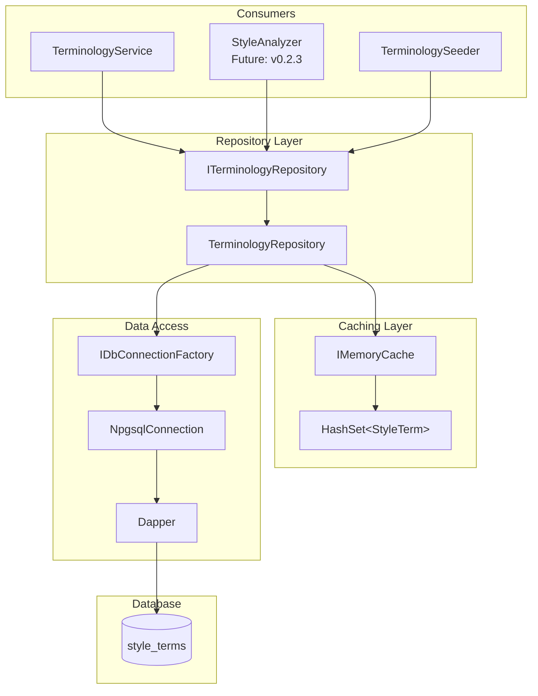
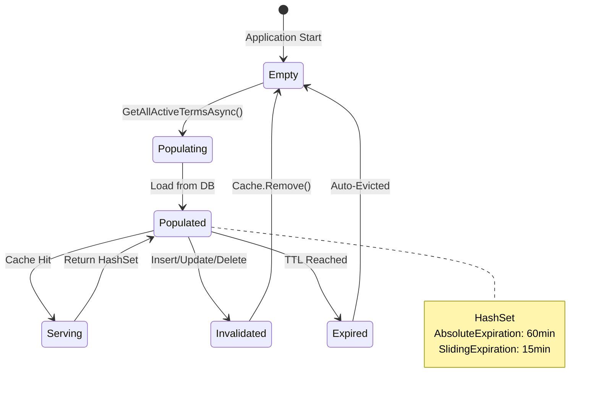
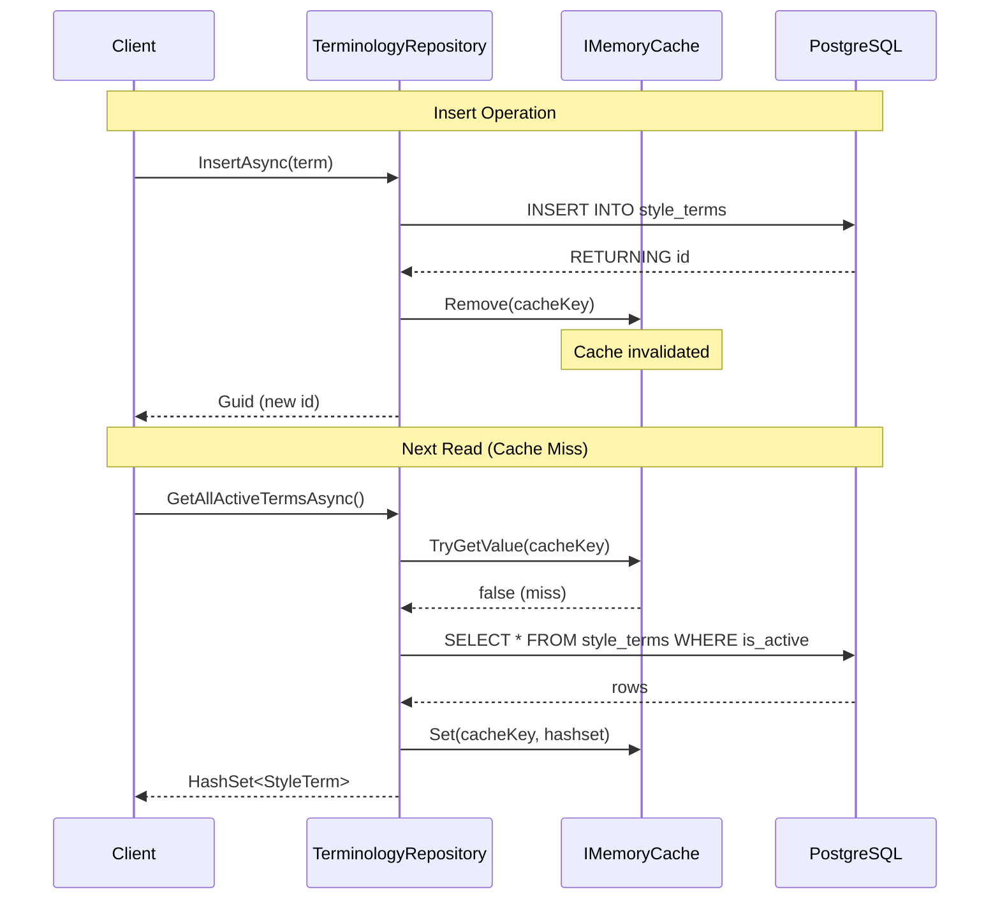

# LCS-DES-022b: Terminology Repository Layer

## 1. Metadata & Categorization

| Field              | Value                     | Description                           |
| :----------------- | :------------------------ | :------------------------------------ |
| **Document ID**    | LCS-DES-022b              | Design Specification v0.2.2b          |
| **Feature ID**     | INF-022b                  | Style Module - Terminology Repository |
| **Feature Name**   | Terminology Repository    | Dapper-based data access with caching |
| **Target Version** | `v0.2.2b`                 | Second sub-part of v0.2.2             |
| **Module Scope**   | `Lexichord.Modules.Style` | Style governance infrastructure       |
| **Swimlane**       | `Features`                | Style Governance Domain               |
| **License Tier**   | `Core`                    | Foundation (Required for all tiers)   |
| **Author**         | System Architect          |                                       |
| **Status**         | **Draft**                 | Pending implementation                |
| **Last Updated**   | 2026-01-27                |                                       |

---

## 2. Executive Summary

### 2.1 The Requirement

The Style Governance module requires a **high-performance data access layer** for terminology:

- Sub-millisecond lookups for real-time document analysis.
- Cached `HashSet<StyleTerm>` for O(1) pattern matching.
- Cache invalidation on term modifications.
- Dapper-based queries for type-safe data access.
- Connection pooling via IDbConnectionFactory.

### 2.2 The Proposed Solution

We **SHALL** implement `ITerminologyRepository` with:

1. **Dapper Queries** — Type-safe SQL execution with parameterized queries.
2. **IMemoryCache Integration** — Cache all active terms for fast retrieval.
3. **HashSet Return Type** — Enable O(1) pattern lookups in analyzers.
4. **Cache Invalidation** — Clear cache on any CRUD operation.
5. **Structured Logging** — Cache hits/misses and query performance.

---

## 3. Architecture

### 3.1 Repository Layer Architecture



### 3.2 Cache Strategy Diagram



---

## 4. Data Contracts

### 4.1 Repository Interface

```csharp
namespace Lexichord.Modules.Style.Contracts;

using Lexichord.Modules.Style.Entities;

/// <summary>
/// Repository for terminology data access with caching support.
/// </summary>
/// <remarks>
/// LOGIC: This repository provides high-performance access to style terms.
/// The primary use case is GetAllActiveTermsAsync() which returns a cached
/// HashSet for O(1) pattern lookups during document analysis.
///
/// Cache Strategy:
/// - All active terms are cached as a HashSet on first access
/// - Cache is invalidated on any modification (Insert/Update/Delete)
/// - Cache has both absolute (60min) and sliding (15min) expiration
///
/// Thread Safety:
/// - The repository is scoped per request
/// - The cache is thread-safe (IMemoryCache guarantee)
/// - HashSet is read-only once cached
/// </remarks>
public interface ITerminologyRepository
{
    /// <summary>
    /// Gets all active terms as a cached HashSet for fast pattern matching.
    /// </summary>
    /// <param name="cancellationToken">Cancellation token.</param>
    /// <returns>
    /// A HashSet of all active StyleTerms.
    /// The HashSet is cached and reused across requests.
    /// </returns>
    /// <remarks>
    /// LOGIC: This is the primary query for document analysis.
    /// Returns a HashSet for O(1) Contains() operations.
    /// Cache hit returns in microseconds; cache miss queries database.
    /// </remarks>
    Task<HashSet<StyleTerm>> GetAllActiveTermsAsync(CancellationToken cancellationToken = default);

    /// <summary>
    /// Gets a term by its unique identifier.
    /// </summary>
    /// <param name="id">The term ID.</param>
    /// <param name="cancellationToken">Cancellation token.</param>
    /// <returns>The term, or null if not found.</returns>
    /// <remarks>
    /// LOGIC: Used for single-term operations (edit, view details).
    /// Not cached individually - uses direct database query.
    /// </remarks>
    Task<StyleTerm?> GetByIdAsync(Guid id, CancellationToken cancellationToken = default);

    /// <summary>
    /// Gets all terms in a specific category.
    /// </summary>
    /// <param name="category">The category name.</param>
    /// <param name="cancellationToken">Cancellation token.</param>
    /// <returns>All terms in the category (active and inactive).</returns>
    /// <remarks>
    /// LOGIC: Used for category management and filtering.
    /// Includes inactive terms for administrative views.
    /// Uses ix_style_terms_category index.
    /// </remarks>
    Task<IEnumerable<StyleTerm>> GetByCategoryAsync(string category, CancellationToken cancellationToken = default);

    /// <summary>
    /// Gets all terms matching a severity level.
    /// </summary>
    /// <param name="severity">The severity level.</param>
    /// <param name="cancellationToken">Cancellation token.</param>
    /// <returns>All terms with the specified severity.</returns>
    Task<IEnumerable<StyleTerm>> GetBySeverityAsync(string severity, CancellationToken cancellationToken = default);

    /// <summary>
    /// Searches for terms by pattern (uses trigram index).
    /// </summary>
    /// <param name="searchPattern">The search pattern.</param>
    /// <param name="cancellationToken">Cancellation token.</param>
    /// <returns>Terms matching the search pattern.</returns>
    /// <remarks>
    /// LOGIC: Uses the GIN trigram index for efficient LIKE queries.
    /// Supports partial matching: "click" matches "click on", "right-click".
    /// </remarks>
    Task<IEnumerable<StyleTerm>> SearchByPatternAsync(string searchPattern, CancellationToken cancellationToken = default);

    /// <summary>
    /// Inserts a new term and invalidates the cache.
    /// </summary>
    /// <param name="term">The term to insert.</param>
    /// <param name="cancellationToken">Cancellation token.</param>
    /// <returns>The generated ID of the new term.</returns>
    /// <remarks>
    /// LOGIC: Inserts into database and immediately invalidates cache.
    /// The ID is generated by PostgreSQL using gen_random_uuid().
    /// </remarks>
    Task<Guid> InsertAsync(StyleTerm term, CancellationToken cancellationToken = default);

    /// <summary>
    /// Updates an existing term and invalidates the cache.
    /// </summary>
    /// <param name="term">The term with updated values.</param>
    /// <param name="cancellationToken">Cancellation token.</param>
    /// <returns>True if the term was found and updated.</returns>
    /// <remarks>
    /// LOGIC: Updates all mutable fields. The updated_at timestamp
    /// is automatically set by the database trigger.
    /// </remarks>
    Task<bool> UpdateAsync(StyleTerm term, CancellationToken cancellationToken = default);

    /// <summary>
    /// Soft-deletes a term by setting is_active to false.
    /// </summary>
    /// <param name="id">The ID of the term to delete.</param>
    /// <param name="cancellationToken">Cancellation token.</param>
    /// <returns>True if the term was found and deactivated.</returns>
    /// <remarks>
    /// LOGIC: Soft delete pattern - term remains in database for audit.
    /// Invalidates cache so term is excluded from active set.
    /// </remarks>
    Task<bool> DeleteAsync(Guid id, CancellationToken cancellationToken = default);

    /// <summary>
    /// Permanently removes a term from the database.
    /// </summary>
    /// <param name="id">The ID of the term to remove.</param>
    /// <param name="cancellationToken">Cancellation token.</param>
    /// <returns>True if the term was found and removed.</returns>
    /// <remarks>
    /// LOGIC: Hard delete - use with caution. Primarily for cleanup
    /// of seed data or administrative purposes.
    /// </remarks>
    Task<bool> HardDeleteAsync(Guid id, CancellationToken cancellationToken = default);

    /// <summary>
    /// Gets the total count of terms in the database.
    /// </summary>
    /// <param name="cancellationToken">Cancellation token.</param>
    /// <returns>The count of all terms (active and inactive).</returns>
    /// <remarks>
    /// LOGIC: Used by the seeder to check if database is empty.
    /// Also used for statistics and monitoring.
    /// </remarks>
    Task<int> GetTermCountAsync(CancellationToken cancellationToken = default);

    /// <summary>
    /// Gets the count of active terms.
    /// </summary>
    /// <param name="cancellationToken">Cancellation token.</param>
    /// <returns>The count of active terms only.</returns>
    Task<int> GetActiveTermCountAsync(CancellationToken cancellationToken = default);

    /// <summary>
    /// Explicitly invalidates the term cache.
    /// </summary>
    /// <remarks>
    /// LOGIC: Normally called automatically by Insert/Update/Delete.
    /// Can be called explicitly for bulk operations or cache refresh.
    /// </remarks>
    void InvalidateCache();

    /// <summary>
    /// Bulk inserts multiple terms efficiently.
    /// </summary>
    /// <param name="terms">The terms to insert.</param>
    /// <param name="cancellationToken">Cancellation token.</param>
    /// <returns>The number of terms inserted.</returns>
    /// <remarks>
    /// LOGIC: Uses batch insert for efficiency during seeding.
    /// Invalidates cache once at the end, not per term.
    /// </remarks>
    Task<int> BulkInsertAsync(IEnumerable<StyleTerm> terms, CancellationToken cancellationToken = default);
}
```

### 4.2 Repository Implementation

```csharp
namespace Lexichord.Modules.Style.Infrastructure;

using System.Data;
using Dapper;
using Microsoft.Extensions.Caching.Memory;
using Microsoft.Extensions.Logging;
using Microsoft.Extensions.Options;
using Npgsql;
using Lexichord.Abstractions.Contracts;
using Lexichord.Modules.Style.Contracts;
using Lexichord.Modules.Style.Entities;

/// <summary>
/// Dapper-based repository for terminology data access with IMemoryCache.
/// </summary>
/// <remarks>
/// LOGIC: This implementation provides high-performance data access for style terms.
///
/// Caching Strategy:
/// - GetAllActiveTermsAsync() caches result as HashSet<StyleTerm>
/// - Cache key is configurable via TerminologyCacheOptions
/// - Absolute expiration: 60 minutes (configurable)
/// - Sliding expiration: 15 minutes (configurable)
/// - Any modification invalidates the entire cache
///
/// Thread Safety:
/// - IMemoryCache is thread-safe
/// - Each request gets its own scoped instance
/// - HashSet is immutable once cached (defensive copy on return)
///
/// Performance:
/// - Cache hit: ~1 microsecond
/// - Cache miss: ~5-50ms depending on term count
/// - Insert/Update/Delete: ~1-5ms
/// </remarks>
public sealed class TerminologyRepository : ITerminologyRepository
{
    private readonly IDbConnectionFactory _connectionFactory;
    private readonly IMemoryCache _cache;
    private readonly TerminologyCacheOptions _cacheOptions;
    private readonly ILogger<TerminologyRepository> _logger;

    // LOGIC: Lock object for cache population to prevent thundering herd
    private static readonly SemaphoreSlim _cacheLock = new(1, 1);

    public TerminologyRepository(
        IDbConnectionFactory connectionFactory,
        IMemoryCache cache,
        IOptions<TerminologyCacheOptions> cacheOptions,
        ILogger<TerminologyRepository> logger)
    {
        _connectionFactory = connectionFactory ?? throw new ArgumentNullException(nameof(connectionFactory));
        _cache = cache ?? throw new ArgumentNullException(nameof(cache));
        _cacheOptions = cacheOptions?.Value ?? throw new ArgumentNullException(nameof(cacheOptions));
        _logger = logger ?? throw new ArgumentNullException(nameof(logger));
    }

    /// <inheritdoc />
    public async Task<HashSet<StyleTerm>> GetAllActiveTermsAsync(CancellationToken cancellationToken = default)
    {
        // LOGIC: Try to get from cache first
        if (_cache.TryGetValue(_cacheOptions.CacheKey, out HashSet<StyleTerm>? cachedTerms) && cachedTerms is not null)
        {
            _logger.LogDebug("Cache hit for all active terms, returning {Count} terms", cachedTerms.Count);
            return cachedTerms;
        }

        // LOGIC: Cache miss - acquire lock to prevent thundering herd
        await _cacheLock.WaitAsync(cancellationToken);
        try
        {
            // Double-check after acquiring lock
            if (_cache.TryGetValue(_cacheOptions.CacheKey, out cachedTerms) && cachedTerms is not null)
            {
                _logger.LogDebug("Cache hit after lock for all active terms");
                return cachedTerms;
            }

            _logger.LogDebug("Cache miss, loading active terms from database");

            await using var connection = await _connectionFactory.CreateConnectionAsync(cancellationToken);

            var terms = await connection.QueryAsync<StyleTerm>(
                new CommandDefinition(
                    """
                    SELECT id, term_pattern, match_case, recommendation, category,
                           severity, is_active, created_at, updated_at
                    FROM style_terms
                    WHERE is_active = TRUE
                    ORDER BY category, term_pattern
                    """,
                    cancellationToken: cancellationToken));

            var termSet = new HashSet<StyleTerm>(terms, new StyleTermPatternComparer());

            // LOGIC: Cache with both absolute and sliding expiration
            var cacheEntryOptions = new MemoryCacheEntryOptions()
                .SetAbsoluteExpiration(TimeSpan.FromMinutes(_cacheOptions.AbsoluteExpirationMinutes))
                .SetSlidingExpiration(TimeSpan.FromMinutes(_cacheOptions.SlidingExpirationMinutes))
                .SetSize(termSet.Count); // For cache size limiting

            _cache.Set(_cacheOptions.CacheKey, termSet, cacheEntryOptions);

            _logger.LogDebug("Cached {Count} active terms from database", termSet.Count);

            return termSet;
        }
        finally
        {
            _cacheLock.Release();
        }
    }

    /// <inheritdoc />
    public async Task<StyleTerm?> GetByIdAsync(Guid id, CancellationToken cancellationToken = default)
    {
        await using var connection = await _connectionFactory.CreateConnectionAsync(cancellationToken);

        var term = await connection.QuerySingleOrDefaultAsync<StyleTerm>(
            new CommandDefinition(
                """
                SELECT id, term_pattern, match_case, recommendation, category,
                       severity, is_active, created_at, updated_at
                FROM style_terms
                WHERE id = @Id
                """,
                new { Id = id },
                cancellationToken: cancellationToken));

        _logger.LogDebug("GetById {Id}: {Found}", id, term is not null ? "Found" : "Not found");

        return term;
    }

    /// <inheritdoc />
    public async Task<IEnumerable<StyleTerm>> GetByCategoryAsync(string category, CancellationToken cancellationToken = default)
    {
        await using var connection = await _connectionFactory.CreateConnectionAsync(cancellationToken);

        var terms = await connection.QueryAsync<StyleTerm>(
            new CommandDefinition(
                """
                SELECT id, term_pattern, match_case, recommendation, category,
                       severity, is_active, created_at, updated_at
                FROM style_terms
                WHERE category = @Category
                ORDER BY term_pattern
                """,
                new { Category = category },
                cancellationToken: cancellationToken));

        var termList = terms.ToList();
        _logger.LogDebug("GetByCategory '{Category}': {Count} terms", category, termList.Count);

        return termList;
    }

    /// <inheritdoc />
    public async Task<IEnumerable<StyleTerm>> GetBySeverityAsync(string severity, CancellationToken cancellationToken = default)
    {
        await using var connection = await _connectionFactory.CreateConnectionAsync(cancellationToken);

        var terms = await connection.QueryAsync<StyleTerm>(
            new CommandDefinition(
                """
                SELECT id, term_pattern, match_case, recommendation, category,
                       severity, is_active, created_at, updated_at
                FROM style_terms
                WHERE severity = @Severity AND is_active = TRUE
                ORDER BY category, term_pattern
                """,
                new { Severity = severity },
                cancellationToken: cancellationToken));

        var termList = terms.ToList();
        _logger.LogDebug("GetBySeverity '{Severity}': {Count} terms", severity, termList.Count);

        return termList;
    }

    /// <inheritdoc />
    public async Task<IEnumerable<StyleTerm>> SearchByPatternAsync(string searchPattern, CancellationToken cancellationToken = default)
    {
        await using var connection = await _connectionFactory.CreateConnectionAsync(cancellationToken);

        // LOGIC: Uses trigram index for efficient LIKE queries
        var terms = await connection.QueryAsync<StyleTerm>(
            new CommandDefinition(
                """
                SELECT id, term_pattern, match_case, recommendation, category,
                       severity, is_active, created_at, updated_at
                FROM style_terms
                WHERE term_pattern ILIKE @Pattern
                ORDER BY similarity(term_pattern, @SearchTerm) DESC, term_pattern
                LIMIT 100
                """,
                new { Pattern = $"%{searchPattern}%", SearchTerm = searchPattern },
                cancellationToken: cancellationToken));

        var termList = terms.ToList();
        _logger.LogDebug("SearchByPattern '{Pattern}': {Count} terms", searchPattern, termList.Count);

        return termList;
    }

    /// <inheritdoc />
    public async Task<Guid> InsertAsync(StyleTerm term, CancellationToken cancellationToken = default)
    {
        await using var connection = await _connectionFactory.CreateConnectionAsync(cancellationToken);

        var id = await connection.ExecuteScalarAsync<Guid>(
            new CommandDefinition(
                """
                INSERT INTO style_terms (id, term_pattern, match_case, recommendation, category, severity, is_active)
                VALUES (@Id, @TermPattern, @MatchCase, @Recommendation, @Category, @Severity, @IsActive)
                RETURNING id
                """,
                new
                {
                    Id = term.Id == Guid.Empty ? Guid.NewGuid() : term.Id,
                    term.TermPattern,
                    term.MatchCase,
                    term.Recommendation,
                    term.Category,
                    term.Severity,
                    term.IsActive
                },
                cancellationToken: cancellationToken));

        InvalidateCache();

        _logger.LogDebug("Inserted term {Id}: {Pattern}", id, term.TermPattern);

        return id;
    }

    /// <inheritdoc />
    public async Task<bool> UpdateAsync(StyleTerm term, CancellationToken cancellationToken = default)
    {
        await using var connection = await _connectionFactory.CreateConnectionAsync(cancellationToken);

        var affected = await connection.ExecuteAsync(
            new CommandDefinition(
                """
                UPDATE style_terms
                SET term_pattern = @TermPattern,
                    match_case = @MatchCase,
                    recommendation = @Recommendation,
                    category = @Category,
                    severity = @Severity,
                    is_active = @IsActive
                WHERE id = @Id
                """,
                new
                {
                    term.Id,
                    term.TermPattern,
                    term.MatchCase,
                    term.Recommendation,
                    term.Category,
                    term.Severity,
                    term.IsActive
                },
                cancellationToken: cancellationToken));

        if (affected > 0)
        {
            InvalidateCache();
            _logger.LogDebug("Updated term {Id}: {Pattern}", term.Id, term.TermPattern);
        }
        else
        {
            _logger.LogDebug("Update failed - term {Id} not found", term.Id);
        }

        return affected > 0;
    }

    /// <inheritdoc />
    public async Task<bool> DeleteAsync(Guid id, CancellationToken cancellationToken = default)
    {
        await using var connection = await _connectionFactory.CreateConnectionAsync(cancellationToken);

        // LOGIC: Soft delete - set is_active to false
        var affected = await connection.ExecuteAsync(
            new CommandDefinition(
                """
                UPDATE style_terms
                SET is_active = FALSE
                WHERE id = @Id AND is_active = TRUE
                """,
                new { Id = id },
                cancellationToken: cancellationToken));

        if (affected > 0)
        {
            InvalidateCache();
            _logger.LogDebug("Soft-deleted term {Id}", id);
        }
        else
        {
            _logger.LogDebug("Delete failed - term {Id} not found or already inactive", id);
        }

        return affected > 0;
    }

    /// <inheritdoc />
    public async Task<bool> HardDeleteAsync(Guid id, CancellationToken cancellationToken = default)
    {
        await using var connection = await _connectionFactory.CreateConnectionAsync(cancellationToken);

        var affected = await connection.ExecuteAsync(
            new CommandDefinition(
                "DELETE FROM style_terms WHERE id = @Id",
                new { Id = id },
                cancellationToken: cancellationToken));

        if (affected > 0)
        {
            InvalidateCache();
            _logger.LogDebug("Hard-deleted term {Id}", id);
        }

        return affected > 0;
    }

    /// <inheritdoc />
    public async Task<int> GetTermCountAsync(CancellationToken cancellationToken = default)
    {
        await using var connection = await _connectionFactory.CreateConnectionAsync(cancellationToken);

        var count = await connection.ExecuteScalarAsync<int>(
            new CommandDefinition(
                "SELECT COUNT(*) FROM style_terms",
                cancellationToken: cancellationToken));

        _logger.LogDebug("Total term count: {Count}", count);

        return count;
    }

    /// <inheritdoc />
    public async Task<int> GetActiveTermCountAsync(CancellationToken cancellationToken = default)
    {
        await using var connection = await _connectionFactory.CreateConnectionAsync(cancellationToken);

        var count = await connection.ExecuteScalarAsync<int>(
            new CommandDefinition(
                "SELECT COUNT(*) FROM style_terms WHERE is_active = TRUE",
                cancellationToken: cancellationToken));

        _logger.LogDebug("Active term count: {Count}", count);

        return count;
    }

    /// <inheritdoc />
    public void InvalidateCache()
    {
        _cache.Remove(_cacheOptions.CacheKey);
        _logger.LogDebug("Cache invalidated for key: {CacheKey}", _cacheOptions.CacheKey);
    }

    /// <inheritdoc />
    public async Task<int> BulkInsertAsync(IEnumerable<StyleTerm> terms, CancellationToken cancellationToken = default)
    {
        var termList = terms.ToList();
        if (termList.Count == 0)
        {
            return 0;
        }

        await using var connection = await _connectionFactory.CreateConnectionAsync(cancellationToken);

        // LOGIC: Use Dapper's multi-row insert for efficiency
        var inserted = 0;

        // Batch in groups of 100 to avoid query size limits
        const int batchSize = 100;
        foreach (var batch in termList.Chunk(batchSize))
        {
            var affected = await connection.ExecuteAsync(
                new CommandDefinition(
                    """
                    INSERT INTO style_terms (id, term_pattern, match_case, recommendation, category, severity, is_active)
                    VALUES (@Id, @TermPattern, @MatchCase, @Recommendation, @Category, @Severity, @IsActive)
                    """,
                    batch.Select(t => new
                    {
                        Id = t.Id == Guid.Empty ? Guid.NewGuid() : t.Id,
                        t.TermPattern,
                        t.MatchCase,
                        t.Recommendation,
                        t.Category,
                        t.Severity,
                        t.IsActive
                    }),
                    cancellationToken: cancellationToken));

            inserted += affected;
        }

        // LOGIC: Invalidate cache once after all inserts
        InvalidateCache();

        _logger.LogInformation("Bulk inserted {Count} terms", inserted);

        return inserted;
    }
}

/// <summary>
/// Equality comparer for StyleTerm based on pattern for HashSet.
/// </summary>
/// <remarks>
/// LOGIC: Two terms are considered equal if they have the same pattern
/// and case sensitivity. This prevents duplicate patterns in the HashSet.
/// </remarks>
public sealed class StyleTermPatternComparer : IEqualityComparer<StyleTerm>
{
    public bool Equals(StyleTerm? x, StyleTerm? y)
    {
        if (ReferenceEquals(x, y)) return true;
        if (x is null || y is null) return false;

        return string.Equals(x.TermPattern, y.TermPattern, StringComparison.Ordinal)
            && x.MatchCase == y.MatchCase;
    }

    public int GetHashCode(StyleTerm obj)
    {
        return HashCode.Combine(obj.TermPattern, obj.MatchCase);
    }
}
```

### 4.3 Cache Options

```csharp
namespace Lexichord.Modules.Style;

/// <summary>
/// Configuration options for terminology caching.
/// </summary>
/// <remarks>
/// LOGIC: These options control the caching behavior for GetAllActiveTermsAsync().
/// Configure via appsettings.json or DI configuration.
///
/// Tuning Guidelines:
/// - AbsoluteExpirationMinutes: Set higher for stable term sets, lower for frequently changing
/// - SlidingExpirationMinutes: Set to 1/4 of absolute for typical usage patterns
/// - CacheKey: Change only if running multiple tenants
/// </remarks>
public sealed class TerminologyCacheOptions
{
    /// <summary>
    /// Configuration section name.
    /// </summary>
    public const string SectionName = "Style:TerminologyCache";

    /// <summary>
    /// Cache key for all active terms.
    /// </summary>
    /// <remarks>
    /// LOGIC: Change this key if running multiple tenants or environments
    /// that share the same IMemoryCache instance.
    /// </remarks>
    public string CacheKey { get; set; } = "lexichord:style:all_active_terms";

    /// <summary>
    /// Absolute expiration in minutes.
    /// </summary>
    /// <remarks>
    /// LOGIC: Cache entry will be evicted after this time regardless of access.
    /// Default: 60 minutes. Set higher for stable term sets.
    /// </remarks>
    public int AbsoluteExpirationMinutes { get; set; } = 60;

    /// <summary>
    /// Sliding expiration in minutes.
    /// </summary>
    /// <remarks>
    /// LOGIC: Cache entry will be evicted if not accessed within this time.
    /// Default: 15 minutes. Keeps frequently accessed data in cache.
    /// </remarks>
    public int SlidingExpirationMinutes { get; set; } = 15;

    /// <summary>
    /// Maximum number of terms to cache.
    /// </summary>
    /// <remarks>
    /// LOGIC: Safety limit to prevent memory exhaustion.
    /// Default: 10000. Increase if you have more terms.
    /// </remarks>
    public int MaxCachedTerms { get; set; } = 10000;
}
```

---

## 5. Decision Tree: Query Selection

```text
START: "What data access pattern do I need?"
|
+-- Need all active terms for document analysis?
|   +-- YES -> GetAllActiveTermsAsync()
|   |   - Returns cached HashSet<StyleTerm>
|   |   - O(1) pattern lookups
|   |   - Sub-millisecond response
|   |
|   +-- NO -> Continue
|
+-- Need a single term by ID?
|   +-- YES -> GetByIdAsync(id)
|   |   - Direct database query
|   |   - Used for edit/view operations
|   |
|   +-- NO -> Continue
|
+-- Need terms filtered by category?
|   +-- YES -> GetByCategoryAsync(category)
|   |   - Uses ix_style_terms_category index
|   |   - Returns active and inactive terms
|   |
|   +-- NO -> Continue
|
+-- Need to search by pattern text?
|   +-- YES -> SearchByPatternAsync(pattern)
|   |   - Uses trigram index for LIKE queries
|   |   - Ordered by similarity score
|   |
|   +-- NO -> Continue
|
+-- Need to count terms?
|   +-- YES -> GetTermCountAsync() or GetActiveTermCountAsync()
|   |   - Used for statistics and seeding check
|   |
|   +-- NO -> Review requirements
```

---

## 6. Implementation Logic

### 6.1 Cache Invalidation Flow



### 6.2 Thundering Herd Prevention

```csharp
// LOGIC: Semaphore prevents multiple threads from querying database simultaneously
// when cache is empty. This prevents "thundering herd" problem.

private static readonly SemaphoreSlim _cacheLock = new(1, 1);

public async Task<HashSet<StyleTerm>> GetAllActiveTermsAsync(...)
{
    // First check without lock (fast path)
    if (_cache.TryGetValue(key, out cached))
        return cached;

    // Acquire lock for database query
    await _cacheLock.WaitAsync(ct);
    try
    {
        // Double-check after lock (another thread may have populated)
        if (_cache.TryGetValue(key, out cached))
            return cached;

        // Only one thread reaches here
        var terms = await QueryDatabase();
        _cache.Set(key, terms);
        return terms;
    }
    finally
    {
        _cacheLock.Release();
    }
}
```

---

## 7. Use Cases

### UC-01: Document Analysis (Hot Path)

**Preconditions:**

- Application running with cached terms.
- User opens document with 10,000 words.

**Flow:**

1. StyleAnalyzer needs all active terms.
2. Calls `GetAllActiveTermsAsync()`.
3. Cache hit: returns `HashSet<StyleTerm>` in ~1 microsecond.
4. Analyzer iterates document words.
5. For each word, checks `hashSet.Where(t => text.Contains(t.TermPattern))`.
6. Analysis completes in <100ms.

**Performance:**

- No database queries during analysis.
- Memory-efficient HashSet lookup.

---

### UC-02: Term Creation

**Preconditions:**

- User creates a new term via UI.
- Cache currently contains 500 terms.

**Flow:**

1. Service calls `InsertAsync(newTerm)`.
2. Repository inserts into database.
3. Repository calls `InvalidateCache()`.
4. Cache entry removed.
5. Next `GetAllActiveTermsAsync()` queries database.
6. New term included in fresh cache.

**Postconditions:**

- Term persisted in database.
- Cache refreshed on next read.
- No stale data.

---

### UC-03: First Application Start (Cold Cache)

**Preconditions:**

- Application just started.
- IMemoryCache is empty.
- Database contains 1000 terms.

**Flow:**

1. StyleAnalyzer calls `GetAllActiveTermsAsync()`.
2. Cache miss detected.
3. Semaphore acquired (prevents thundering herd).
4. Database query: `SELECT * FROM style_terms WHERE is_active = TRUE`.
5. 1000 terms loaded (~30ms).
6. HashSet created and cached.
7. Semaphore released.
8. Result returned to analyzer.

**Performance:**

- Cold start: ~30-50ms for 1000 terms.
- All subsequent calls: ~1 microsecond.

---

## 8. Observability & Logging

### 8.1 Log Events

| Level       | Source                | Message Template                                          |
| :---------- | :-------------------- | :-------------------------------------------------------- |
| Debug       | TerminologyRepository | `Cache hit for all active terms, returning {Count} terms` |
| Debug       | TerminologyRepository | `Cache hit after lock for all active terms`               |
| Debug       | TerminologyRepository | `Cache miss, loading active terms from database`          |
| Debug       | TerminologyRepository | `Cached {Count} active terms from database`               |
| Debug       | TerminologyRepository | `GetById {Id}: {Found}`                                   |
| Debug       | TerminologyRepository | `GetByCategory '{Category}': {Count} terms`               |
| Debug       | TerminologyRepository | `GetBySeverity '{Severity}': {Count} terms`               |
| Debug       | TerminologyRepository | `SearchByPattern '{Pattern}': {Count} terms`              |
| Debug       | TerminologyRepository | `Inserted term {Id}: {Pattern}`                           |
| Debug       | TerminologyRepository | `Updated term {Id}: {Pattern}`                            |
| Debug       | TerminologyRepository | `Update failed - term {Id} not found`                     |
| Debug       | TerminologyRepository | `Soft-deleted term {Id}`                                  |
| Debug       | TerminologyRepository | `Hard-deleted term {Id}`                                  |
| Debug       | TerminologyRepository | `Cache invalidated for key: {CacheKey}`                   |
| Information | TerminologyRepository | `Bulk inserted {Count} terms`                             |
| Debug       | TerminologyRepository | `Total term count: {Count}`                               |
| Debug       | TerminologyRepository | `Active term count: {Count}`                              |

### 8.2 Recommended Metrics

| Metric Name                          | Type      | Description                   |
| :----------------------------------- | :-------- | :---------------------------- |
| `terminology_cache_hits_total`       | Counter   | Number of cache hits          |
| `terminology_cache_misses_total`     | Counter   | Number of cache misses        |
| `terminology_cache_size`             | Gauge     | Number of terms in cache      |
| `terminology_query_duration_seconds` | Histogram | Database query duration       |
| `terminology_cache_invalidations`    | Counter   | Number of cache invalidations |

---

## 9. Unit Testing Requirements

### 9.1 Test Scenarios

```csharp
[TestFixture]
[Category("Unit")]
public class TerminologyRepositoryTests
{
    private Mock<IDbConnectionFactory> _mockConnectionFactory = null!;
    private Mock<IMemoryCache> _mockCache = null!;
    private Mock<ILogger<TerminologyRepository>> _mockLogger = null!;
    private TerminologyRepository _sut = null!;

    [SetUp]
    public void SetUp()
    {
        _mockConnectionFactory = new Mock<IDbConnectionFactory>();
        _mockCache = new Mock<IMemoryCache>();
        _mockLogger = new Mock<ILogger<TerminologyRepository>>();

        _sut = new TerminologyRepository(
            _mockConnectionFactory.Object,
            _mockCache.Object,
            Options.Create(new TerminologyCacheOptions()),
            _mockLogger.Object);
    }

    [Test]
    public async Task GetAllActiveTermsAsync_WhenCacheHit_ReturnsCachedHashSet()
    {
        // Arrange
        var cachedTerms = new HashSet<StyleTerm>
        {
            CreateTerm("test1"),
            CreateTerm("test2")
        };

        object? cacheEntry = cachedTerms;
        _mockCache.Setup(c => c.TryGetValue(It.IsAny<object>(), out cacheEntry))
            .Returns(true);

        // Act
        var result = await _sut.GetAllActiveTermsAsync();

        // Assert
        Assert.That(result, Is.SameAs(cachedTerms));
        _mockConnectionFactory.Verify(
            c => c.CreateConnectionAsync(It.IsAny<CancellationToken>()),
            Times.Never,
            "Should not query database on cache hit");
    }

    [Test]
    public async Task GetAllActiveTermsAsync_WhenCacheMiss_QueriesDatabaseAndCaches()
    {
        // Arrange
        object? cacheEntry = null;
        _mockCache.Setup(c => c.TryGetValue(It.IsAny<object>(), out cacheEntry))
            .Returns(false);

        // Setup mock connection that returns test data
        var mockConnection = SetupMockConnection(new[]
        {
            CreateTerm("db_term1"),
            CreateTerm("db_term2")
        });

        _mockConnectionFactory.Setup(c => c.CreateConnectionAsync(It.IsAny<CancellationToken>()))
            .ReturnsAsync(mockConnection);

        var cachedValue = (HashSet<StyleTerm>?)null;
        _mockCache.Setup(c => c.Set(
            It.IsAny<object>(),
            It.IsAny<HashSet<StyleTerm>>(),
            It.IsAny<MemoryCacheEntryOptions>()))
            .Callback<object, HashSet<StyleTerm>, MemoryCacheEntryOptions>((k, v, o) => cachedValue = v);

        // Act
        var result = await _sut.GetAllActiveTermsAsync();

        // Assert
        Assert.That(result.Count, Is.EqualTo(2));
        Assert.That(cachedValue, Is.Not.Null, "Should cache the result");
    }

    [Test]
    public async Task InsertAsync_InvalidatesCache()
    {
        // Arrange
        var term = CreateTerm("new_term");
        var mockConnection = SetupMockConnectionForInsert(Guid.NewGuid());

        _mockConnectionFactory.Setup(c => c.CreateConnectionAsync(It.IsAny<CancellationToken>()))
            .ReturnsAsync(mockConnection);

        // Act
        await _sut.InsertAsync(term);

        // Assert
        _mockCache.Verify(c => c.Remove(It.IsAny<object>()), Times.Once);
    }

    [Test]
    public async Task UpdateAsync_WhenTermExists_InvalidatesCache()
    {
        // Arrange
        var term = CreateTerm("updated_term") with { Id = Guid.NewGuid() };
        var mockConnection = SetupMockConnectionForUpdate(1);

        _mockConnectionFactory.Setup(c => c.CreateConnectionAsync(It.IsAny<CancellationToken>()))
            .ReturnsAsync(mockConnection);

        // Act
        var result = await _sut.UpdateAsync(term);

        // Assert
        Assert.That(result, Is.True);
        _mockCache.Verify(c => c.Remove(It.IsAny<object>()), Times.Once);
    }

    [Test]
    public async Task UpdateAsync_WhenTermNotFound_DoesNotInvalidateCache()
    {
        // Arrange
        var term = CreateTerm("nonexistent") with { Id = Guid.NewGuid() };
        var mockConnection = SetupMockConnectionForUpdate(0);

        _mockConnectionFactory.Setup(c => c.CreateConnectionAsync(It.IsAny<CancellationToken>()))
            .ReturnsAsync(mockConnection);

        // Act
        var result = await _sut.UpdateAsync(term);

        // Assert
        Assert.That(result, Is.False);
        _mockCache.Verify(c => c.Remove(It.IsAny<object>()), Times.Never);
    }

    [Test]
    public async Task DeleteAsync_SoftDeletesSetsIsActiveFalse()
    {
        // Arrange
        var id = Guid.NewGuid();
        var mockConnection = SetupMockConnectionForUpdate(1);

        _mockConnectionFactory.Setup(c => c.CreateConnectionAsync(It.IsAny<CancellationToken>()))
            .ReturnsAsync(mockConnection);

        // Act
        var result = await _sut.DeleteAsync(id);

        // Assert
        Assert.That(result, Is.True);
        _mockCache.Verify(c => c.Remove(It.IsAny<object>()), Times.Once);
    }

    [Test]
    public void InvalidateCache_RemovesCacheEntry()
    {
        // Act
        _sut.InvalidateCache();

        // Assert
        _mockCache.Verify(c => c.Remove(It.IsAny<object>()), Times.Once);
    }

    [Test]
    public async Task GetTermCountAsync_ReturnsCount()
    {
        // Arrange
        var mockConnection = SetupMockConnectionForScalar(100);

        _mockConnectionFactory.Setup(c => c.CreateConnectionAsync(It.IsAny<CancellationToken>()))
            .ReturnsAsync(mockConnection);

        // Act
        var result = await _sut.GetTermCountAsync();

        // Assert
        Assert.That(result, Is.EqualTo(100));
    }

    private static StyleTerm CreateTerm(string pattern) => new()
    {
        Id = Guid.NewGuid(),
        TermPattern = pattern,
        Recommendation = "Test recommendation",
        Category = StyleTermCategory.Terminology,
        Severity = StyleTermSeverity.Suggestion
    };

    // Helper methods for setting up mock connections...
}
```

### 9.2 Integration Tests

```csharp
[TestFixture]
[Category("Integration")]
[Explicit("Requires PostgreSQL")]
public class TerminologyRepositoryIntegrationTests
{
    private NpgsqlConnectionFactory _connectionFactory = null!;
    private IMemoryCache _cache = null!;
    private TerminologyRepository _sut = null!;

    [SetUp]
    public async Task SetUp()
    {
        var options = Options.Create(new DatabaseOptions
        {
            ConnectionString = GetTestConnectionString()
        });

        _connectionFactory = new NpgsqlConnectionFactory(
            options,
            new Mock<ILogger<NpgsqlConnectionFactory>>().Object);

        _cache = new MemoryCache(new MemoryCacheOptions());

        _sut = new TerminologyRepository(
            _connectionFactory,
            _cache,
            Options.Create(new TerminologyCacheOptions()),
            new Mock<ILogger<TerminologyRepository>>().Object);

        // Clean up test data
        await CleanupTestData();
    }

    [TearDown]
    public async Task TearDown()
    {
        await CleanupTestData();
        _cache.Dispose();
        _connectionFactory.Dispose();
    }

    [Test]
    public async Task FullCrudCycle_WorksCorrectly()
    {
        // Create
        var term = new StyleTerm
        {
            TermPattern = "integration_test_term",
            Recommendation = "Test recommendation",
            Category = StyleTermCategory.Terminology,
            Severity = StyleTermSeverity.Warning
        };

        var id = await _sut.InsertAsync(term);
        Assert.That(id, Is.Not.EqualTo(Guid.Empty));

        // Read
        var retrieved = await _sut.GetByIdAsync(id);
        Assert.That(retrieved, Is.Not.Null);
        Assert.That(retrieved!.TermPattern, Is.EqualTo("integration_test_term"));

        // Update
        var updated = retrieved with { Recommendation = "Updated recommendation" };
        var updateResult = await _sut.UpdateAsync(updated);
        Assert.That(updateResult, Is.True);

        var afterUpdate = await _sut.GetByIdAsync(id);
        Assert.That(afterUpdate!.Recommendation, Is.EqualTo("Updated recommendation"));

        // Delete (soft)
        var deleteResult = await _sut.DeleteAsync(id);
        Assert.That(deleteResult, Is.True);

        var afterDelete = await _sut.GetByIdAsync(id);
        Assert.That(afterDelete!.IsActive, Is.False);

        // Hard delete
        var hardDeleteResult = await _sut.HardDeleteAsync(id);
        Assert.That(hardDeleteResult, Is.True);

        var afterHardDelete = await _sut.GetByIdAsync(id);
        Assert.That(afterHardDelete, Is.Null);
    }

    [Test]
    public async Task GetAllActiveTermsAsync_CachesResult()
    {
        // Insert test term
        await _sut.InsertAsync(new StyleTerm
        {
            TermPattern = "cache_test_term",
            Recommendation = "Test",
            Category = StyleTermCategory.Terminology
        });

        // First call - cache miss
        var result1 = await _sut.GetAllActiveTermsAsync();

        // Second call - should be cache hit
        var result2 = await _sut.GetAllActiveTermsAsync();

        // Both should return the same reference (cached)
        Assert.That(ReferenceEquals(result1, result2), Is.True);
    }

    [Test]
    public async Task InsertAsync_InvalidatesCacheForNextRead()
    {
        // Prime the cache
        var initial = await _sut.GetAllActiveTermsAsync();
        var initialCount = initial.Count;

        // Insert new term (should invalidate cache)
        await _sut.InsertAsync(new StyleTerm
        {
            TermPattern = "new_cache_invalidation_term",
            Recommendation = "Test",
            Category = StyleTermCategory.Terminology
        });

        // Next read should reflect new term
        var afterInsert = await _sut.GetAllActiveTermsAsync();
        Assert.That(afterInsert.Count, Is.EqualTo(initialCount + 1));
    }

    private static string GetTestConnectionString() =>
        Environment.GetEnvironmentVariable("LEXICHORD_TEST_DB")
            ?? "Host=localhost;Port=5432;Database=lexichord_test;Username=lexichord;Password=lexichord_dev";

    private async Task CleanupTestData()
    {
        await using var connection = await _connectionFactory.CreateConnectionAsync();
        await connection.ExecuteAsync(
            "DELETE FROM style_terms WHERE term_pattern LIKE '%test%'");
    }
}
```

---

## 10. Security & Safety

### 10.1 SQL Injection Prevention

> [!WARNING]
> All queries use parameterized statements. Never concatenate user input.

```csharp
// CORRECT: Parameterized query
await connection.QueryAsync<StyleTerm>(
    "SELECT * FROM style_terms WHERE category = @Category",
    new { Category = userInput });

// WRONG: SQL injection vulnerability
await connection.QueryAsync<StyleTerm>(
    $"SELECT * FROM style_terms WHERE category = '{userInput}'");
```

### 10.2 Cache Security

- Cache key is an internal constant, not user-provided.
- Cached HashSet is read-only after creation.
- Cache invalidation requires repository method call.
- No direct user access to cache operations.

---

## 11. Risks & Mitigations

| Risk                                  | Impact | Probability | Mitigation                                        |
| :------------------------------------ | :----- | :---------- | :------------------------------------------------ |
| Cache exhausts memory                 | High   | Low         | Configure MaxCachedTerms; use cache size limiting |
| Thundering herd on cache miss         | Medium | Medium      | Semaphore-based lock prevents multiple DB queries |
| Stale cache after failed invalidation | Medium | Low         | Log invalidation failures; manual refresh option  |
| Connection pool exhaustion            | High   | Low         | Configure pool sizes; use async/await properly    |
| Dapper mapping failures               | Medium | Low         | Match column names; use explicit mappings         |

---

## 12. Acceptance Criteria (QA)

| #   | Criterion                                                                    | Status |
| :-- | :--------------------------------------------------------------------------- | :----- |
| 1   | `ITerminologyRepository` interface defined with all methods.                 | [ ]    |
| 2   | `TerminologyRepository` implements all interface methods.                    | [ ]    |
| 3   | `GetAllActiveTermsAsync()` returns cached HashSet on second call.            | [ ]    |
| 4   | `GetAllActiveTermsAsync()` queries database on cache miss.                   | [ ]    |
| 5   | `InsertAsync()` inserts term and invalidates cache.                          | [ ]    |
| 6   | `UpdateAsync()` updates term and invalidates cache.                          | [ ]    |
| 7   | `DeleteAsync()` soft-deletes term (is_active=false) and invalidates cache.   | [ ]    |
| 8   | `HardDeleteAsync()` permanently removes term.                                | [ ]    |
| 9   | `BulkInsertAsync()` inserts multiple terms efficiently.                      | [ ]    |
| 10  | `GetByCategoryAsync()` uses index and returns correct terms.                 | [ ]    |
| 11  | `SearchByPatternAsync()` uses trigram index for LIKE queries.                | [ ]    |
| 12  | Cache uses configurable expiration times.                                    | [ ]    |
| 13  | Thundering herd prevention works (single DB query on concurrent cache miss). | [ ]    |
| 14  | All queries use parameterized statements (no SQL injection).                 | [ ]    |
| 15  | Unit tests for cache hit/miss scenarios pass.                                | [ ]    |
| 16  | Integration tests with PostgreSQL pass.                                      | [ ]    |

---

## 13. Verification Commands

```bash
# 1. Build the solution
dotnet build

# 2. Run unit tests
dotnet test --filter "Category=Unit&FullyQualifiedName~TerminologyRepository"

# 3. Start PostgreSQL
./scripts/db-start.sh

# 4. Run integration tests
dotnet test --filter "Category=Integration&FullyQualifiedName~TerminologyRepository"

# 5. Verify cache behavior (via application logs)
dotnet run --project src/Lexichord.Host -- --verbosity Debug

# 6. Check for "Cache hit" vs "Cache miss" messages in logs

# 7. Verify query performance
docker exec -it lexichord-postgres psql -U lexichord -c "
    EXPLAIN ANALYZE
    SELECT * FROM style_terms WHERE is_active = TRUE ORDER BY category;
"
# Expected: Index Scan using ix_style_terms_active_category
```

---

## 14. Deliverable Checklist

| Step | Description                                           | Status |
| :--- | :---------------------------------------------------- | :----- |
| 1    | `ITerminologyRepository` interface defined            | [ ]    |
| 2    | `TerminologyRepository` class implemented             | [ ]    |
| 3    | `GetAllActiveTermsAsync()` with cache lookup          | [ ]    |
| 4    | `GetByIdAsync()` with parameterized query             | [ ]    |
| 5    | `GetByCategoryAsync()` with index usage               | [ ]    |
| 6    | `GetBySeverityAsync()` implemented                    | [ ]    |
| 7    | `SearchByPatternAsync()` with trigram index           | [ ]    |
| 8    | `InsertAsync()` with cache invalidation               | [ ]    |
| 9    | `UpdateAsync()` with cache invalidation               | [ ]    |
| 10   | `DeleteAsync()` (soft delete) with cache invalidation | [ ]    |
| 11   | `HardDeleteAsync()` implemented                       | [ ]    |
| 12   | `GetTermCountAsync()` and `GetActiveTermCountAsync()` | [ ]    |
| 13   | `BulkInsertAsync()` for efficient seeding             | [ ]    |
| 14   | `InvalidateCache()` public method                     | [ ]    |
| 15   | `TerminologyCacheOptions` configuration class         | [ ]    |
| 16   | `StyleTermPatternComparer` for HashSet equality       | [ ]    |
| 17   | Semaphore-based thundering herd prevention            | [ ]    |
| 18   | Unit tests with mocked dependencies                   | [ ]    |
| 19   | Integration tests with PostgreSQL                     | [ ]    |
| 20   | Structured logging at Debug level                     | [ ]    |
