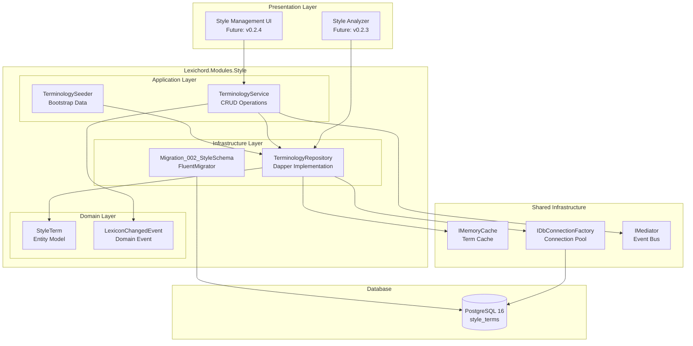
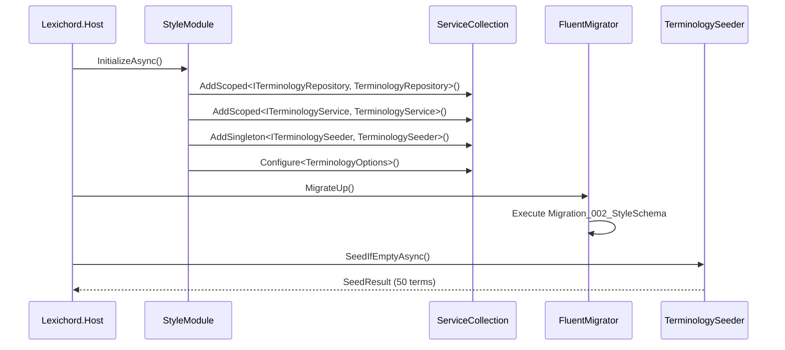
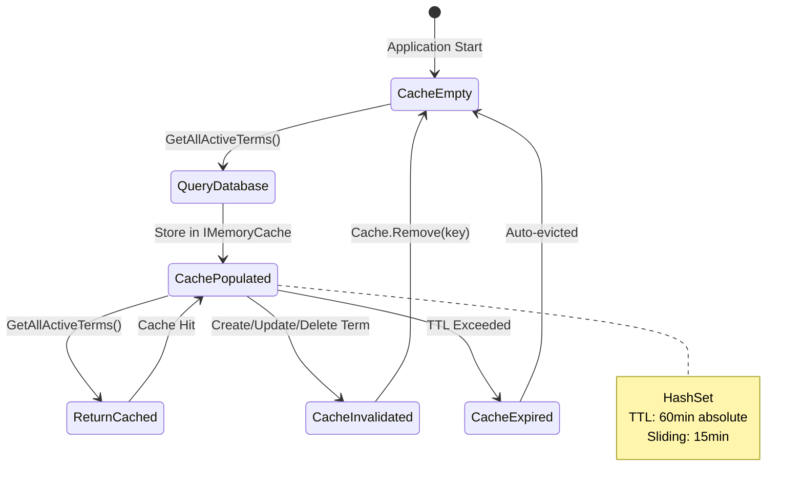

# LCS-INF-022: Feature Design Composition - Lexicon (Terminology Database)

## 1. Metadata & Categorization

| Field                | Value                                        | Description                                           |
| :------------------- | :------------------------------------------- | :---------------------------------------------------- |
| **Feature ID**       | `INF-022`                                    | Style Module - Terminology Database                   |
| **Feature Name**     | The Lexicon                                  | Persistent storage for style terminology rules        |
| **Target Version**   | `v0.2.2`                                     | Style Governance Subsystem                            |
| **Module Scope**     | `Lexichord.Modules.Style`                    | Style governance and terminology management           |
| **Swimlane**         | `Features`                                   | Style Governance Domain                               |
| **License Tier**     | `Core`                                       | Foundation (Required for all tiers)                   |
| **Feature Gate Key** | N/A                                          | No runtime gating for core terminology                |
| **Author**           | System Architect                             |                                                       |
| **Status**           | **Draft**                                    | Pending approval                                      |
| **Last Updated**     | 2026-01-26                                   |                                                       |

---

## 2. Executive Summary

### 2.1 The Requirement

Lexichord's Style Governance module requires a **persistent terminology database** that:

- Stores thousands of style terms with pattern matching rules.
- Provides high-performance lookups during real-time document analysis.
- Bootstraps with industry-standard terminology (Microsoft Manual of Style).
- Enables runtime modifications without application restart.
- Publishes domain events when terminology changes for cache invalidation.

Without this foundation:

- Style analysis would be limited to a small, hardcoded term set.
- Term updates would require application redeployment.
- No audit trail for terminology changes.
- No way to scale to enterprise-level style guides.

### 2.2 The Proposed Solution

We **SHALL** implement a complete terminology database layer with:

1. **v0.2.2a: Schema Migration** — `Migration_002_StyleSchema.cs` creates `style_terms` table.
2. **v0.2.2b: Repository Layer** — `ITerminologyRepository` with Dapper queries and IMemoryCache.
3. **v0.2.2c: Seeding Service** — `ITerminologySeeder` populates ~50 Microsoft Manual of Style basics.
4. **v0.2.2d: CRUD Service** — `ITerminologyService` with MediatR event publication.

---

## 3. Architecture & Modular Strategy

### 3.1 High-Level Architecture



### 3.2 Module Registration



### 3.3 Dependencies

- **NuGet Packages:**

| Package                                | Version | Purpose                                  |
| :------------------------------------- | :------ | :--------------------------------------- |
| `Dapper`                               | 2.1.x   | SQL queries and mapping                  |
| `Microsoft.Extensions.Caching.Memory`  | 9.0.x   | In-memory term caching                   |
| `FluentMigrator`                       | 6.x     | Database migration                       |
| `MediatR`                              | 12.4.x  | Event publication                        |

- **Project References:**

| Project                    | Reference Direction              |
| :------------------------- | :------------------------------- |
| `Lexichord.Modules.Style`  | -> `Lexichord.Abstractions`      |
| `Lexichord.Modules.Style`  | -> `Lexichord.Infrastructure`    |
| `Lexichord.Host`           | -> `Lexichord.Modules.Style`     |

### 3.4 Licensing Behavior

- **N/A:** The Lexicon is Core infrastructure required by all license tiers.
- Future tiers may limit the number of custom terms or disable editing.

---

## 4. Decision Tree: Term Storage Strategy

```text
START: "How should I store/retrieve style terms?"
|
+-- Need to check if a word matches any term?
|   +-- YES -> Use GetAllActiveTermsAsync()
|   |   - Returns cached HashSet<StyleTerm>
|   |   - O(1) lookup for pattern matching
|   |   - Cache invalidates on any modification
|   |
|   +-- NO -> Continue to next question
|
+-- Need to filter terms by category?
|   +-- YES -> Use GetByCategoryAsync(category)
|   |   - Direct database query with index
|   |   - Not cached (category filters vary)
|   |
|   +-- NO -> Continue to next question
|
+-- Need to modify a single term?
|   +-- YES -> Use ITerminologyService
|   |   - CreateAsync / UpdateAsync / DeleteAsync
|   |   - Publishes LexiconChangedEvent
|   |   - Triggers cache invalidation
|   |
|   +-- NO -> Continue to next question
|
+-- Need to bulk import terms?
|   +-- YES -> Use ReseedAsync() or bulk insert
|   |   - Publishes LexiconChangedEvent with BulkImport type
|   |   - Single cache invalidation at end
|   |
|   +-- NO -> Review requirements
```

---

## 5. Data Contracts

### 5.1 Entity Model (Lexichord.Modules.Style)

```csharp
namespace Lexichord.Modules.Style.Entities;

using System.ComponentModel.DataAnnotations;
using System.ComponentModel.DataAnnotations.Schema;

/// <summary>
/// Represents a style terminology rule in the Lexicon.
/// </summary>
/// <remarks>
/// LOGIC: StyleTerm defines a pattern-based rule for style governance.
/// The TermPattern can be a literal string or a regex pattern.
/// When MatchCase is false, pattern matching is case-insensitive.
/// Severity determines how the issue is presented to the user.
/// </remarks>
[Table("style_terms")]
public sealed record StyleTerm
{
    /// <summary>
    /// Unique identifier for the term.
    /// </summary>
    /// <remarks>
    /// LOGIC: UUID primary key for distributed systems compatibility.
    /// Generated by PostgreSQL using gen_random_uuid().
    /// </remarks>
    [Key]
    [Column("id")]
    public Guid Id { get; init; } = Guid.NewGuid();

    /// <summary>
    /// The pattern to match in document text.
    /// </summary>
    /// <remarks>
    /// LOGIC: Can be a literal string (e.g., "click on") or a regex pattern
    /// (e.g., "\bclick\s+on\b"). The IsRegex property (future) will distinguish.
    /// Maximum 500 characters to prevent performance issues.
    /// </remarks>
    [Required]
    [MaxLength(500)]
    [Column("term_pattern")]
    public required string TermPattern { get; init; }

    /// <summary>
    /// Whether pattern matching should be case-sensitive.
    /// </summary>
    /// <remarks>
    /// LOGIC: Default is false (case-insensitive) for most style rules.
    /// Set to true for proper nouns and specific terminology.
    /// </remarks>
    [Column("match_case")]
    public bool MatchCase { get; init; } = false;

    /// <summary>
    /// The recommended replacement or guidance text.
    /// </summary>
    /// <remarks>
    /// LOGIC: This text is shown to the user when the pattern matches.
    /// Can include the recommended replacement or explanatory guidance.
    /// Example: "Use 'select' instead of 'click on' for touchscreen compatibility."
    /// </remarks>
    [Required]
    [Column("recommendation")]
    public required string Recommendation { get; init; }

    /// <summary>
    /// The category for organizing terms.
    /// </summary>
    /// <remarks>
    /// LOGIC: Categories group related terms for filtering and reporting.
    /// Standard categories: Terminology, Capitalization, Punctuation, Voice, Clarity.
    /// Custom categories supported for organization-specific rules.
    /// </remarks>
    [Required]
    [MaxLength(100)]
    [Column("category")]
    public required string Category { get; init; }

    /// <summary>
    /// The severity level of the style issue.
    /// </summary>
    /// <remarks>
    /// LOGIC: Determines visual presentation and filtering behavior.
    /// - error: Must be fixed (e.g., trademarked terms)
    /// - warning: Should be fixed (e.g., common style violations)
    /// - suggestion: Consider fixing (e.g., stylistic preferences)
    /// - info: Educational only (e.g., style tips)
    /// </remarks>
    [Required]
    [MaxLength(20)]
    [Column("severity")]
    public string Severity { get; init; } = "suggestion";

    /// <summary>
    /// Whether this term is currently active.
    /// </summary>
    /// <remarks>
    /// LOGIC: Soft delete pattern. Inactive terms are not returned by
    /// GetAllActiveTermsAsync() but remain in the database for audit.
    /// </remarks>
    [Column("is_active")]
    public bool IsActive { get; init; } = true;

    /// <summary>
    /// When this term was created.
    /// </summary>
    [Column("created_at")]
    public DateTimeOffset CreatedAt { get; init; } = DateTimeOffset.UtcNow;

    /// <summary>
    /// When this term was last updated.
    /// </summary>
    [Column("updated_at")]
    public DateTimeOffset UpdatedAt { get; init; } = DateTimeOffset.UtcNow;
}

/// <summary>
/// Valid severity levels for style terms.
/// </summary>
public static class StyleTermSeverity
{
    public const string Error = "error";
    public const string Warning = "warning";
    public const string Suggestion = "suggestion";
    public const string Info = "info";

    public static readonly IReadOnlyList<string> All = new[]
    {
        Error, Warning, Suggestion, Info
    };

    public static bool IsValid(string severity) =>
        All.Contains(severity, StringComparer.OrdinalIgnoreCase);
}

/// <summary>
/// Standard categories for style terms.
/// </summary>
public static class StyleTermCategory
{
    public const string Terminology = "Terminology";
    public const string Capitalization = "Capitalization";
    public const string Punctuation = "Punctuation";
    public const string Voice = "Voice";
    public const string Clarity = "Clarity";
    public const string Grammar = "Grammar";
    public const string Formatting = "Formatting";

    public static readonly IReadOnlyList<string> Standard = new[]
    {
        Terminology, Capitalization, Punctuation, Voice, Clarity, Grammar, Formatting
    };
}
```

### 5.2 Domain Events (Lexichord.Abstractions)

```csharp
namespace Lexichord.Abstractions.Events;

/// <summary>
/// Published when the terminology lexicon changes.
/// </summary>
/// <remarks>
/// LOGIC: This event enables cache invalidation across the application.
/// Handlers should clear any cached term data when this event is received.
/// The event includes the change type and affected term ID for selective invalidation.
/// </remarks>
public sealed record LexiconChangedEvent : DomainEventBase
{
    /// <summary>
    /// The type of change that occurred.
    /// </summary>
    public required LexiconChangeType ChangeType { get; init; }

    /// <summary>
    /// The ID of the affected term (Guid.Empty for bulk operations).
    /// </summary>
    public required Guid TermId { get; init; }

    /// <summary>
    /// The pattern of the affected term (for logging).
    /// </summary>
    public string? TermPattern { get; init; }

    /// <summary>
    /// The category of the affected term (for selective invalidation).
    /// </summary>
    public string? Category { get; init; }

    /// <summary>
    /// Number of terms affected (for bulk operations).
    /// </summary>
    public int AffectedCount { get; init; } = 1;
}

/// <summary>
/// Types of changes to the terminology lexicon.
/// </summary>
public enum LexiconChangeType
{
    /// <summary>A new term was created.</summary>
    Created,

    /// <summary>An existing term was updated.</summary>
    Updated,

    /// <summary>A term was deleted (soft or hard).</summary>
    Deleted,

    /// <summary>Multiple terms were imported in bulk.</summary>
    BulkImport,

    /// <summary>Multiple terms were deleted in bulk.</summary>
    BulkDelete,

    /// <summary>The lexicon was reseeded from defaults.</summary>
    Reseeded
}
```

### 5.3 Command/Query Objects

```csharp
namespace Lexichord.Modules.Style.Commands;

/// <summary>
/// Command to create a new style term.
/// </summary>
public sealed record CreateTermCommand
{
    /// <summary>The pattern to match in document text.</summary>
    [Required]
    [MaxLength(500)]
    public required string TermPattern { get; init; }

    /// <summary>Whether matching should be case-sensitive.</summary>
    public bool MatchCase { get; init; } = false;

    /// <summary>The recommendation text for users.</summary>
    [Required]
    public required string Recommendation { get; init; }

    /// <summary>The category for the term.</summary>
    [Required]
    [MaxLength(100)]
    public required string Category { get; init; }

    /// <summary>The severity level.</summary>
    [MaxLength(20)]
    public string Severity { get; init; } = StyleTermSeverity.Suggestion;
}

/// <summary>
/// Command to update an existing style term.
/// </summary>
public sealed record UpdateTermCommand
{
    /// <summary>The ID of the term to update.</summary>
    [Required]
    public required Guid Id { get; init; }

    /// <summary>The updated pattern (null to keep existing).</summary>
    [MaxLength(500)]
    public string? TermPattern { get; init; }

    /// <summary>The updated case sensitivity (null to keep existing).</summary>
    public bool? MatchCase { get; init; }

    /// <summary>The updated recommendation (null to keep existing).</summary>
    public string? Recommendation { get; init; }

    /// <summary>The updated category (null to keep existing).</summary>
    [MaxLength(100)]
    public string? Category { get; init; }

    /// <summary>The updated severity (null to keep existing).</summary>
    [MaxLength(20)]
    public string? Severity { get; init; }

    /// <summary>The updated active status (null to keep existing).</summary>
    public bool? IsActive { get; init; }
}

/// <summary>
/// Statistics about the terminology lexicon.
/// </summary>
public sealed record TermStatistics
{
    public required int TotalTerms { get; init; }
    public required int ActiveTerms { get; init; }
    public required int InactiveTerms { get; init; }
    public required IReadOnlyDictionary<string, int> ByCategory { get; init; }
    public required IReadOnlyDictionary<string, int> BySeverity { get; init; }
}
```

### 5.4 Result Type

```csharp
namespace Lexichord.Abstractions;

/// <summary>
/// Represents the result of an operation that may fail.
/// </summary>
/// <typeparam name="T">The type of the success value.</typeparam>
/// <remarks>
/// LOGIC: Result pattern avoids exceptions for expected failure cases.
/// Use IsSuccess to check before accessing Value.
/// Use Error to get the failure message.
/// </remarks>
public readonly struct Result<T>
{
    private readonly T? _value;
    private readonly string? _error;

    private Result(T value)
    {
        _value = value;
        _error = null;
        IsSuccess = true;
    }

    private Result(string error)
    {
        _value = default;
        _error = error;
        IsSuccess = false;
    }

    /// <summary>Whether the operation succeeded.</summary>
    public bool IsSuccess { get; }

    /// <summary>Whether the operation failed.</summary>
    public bool IsFailure => !IsSuccess;

    /// <summary>The success value (throws if failed).</summary>
    public T Value => IsSuccess
        ? _value!
        : throw new InvalidOperationException($"Cannot access Value on failed result: {_error}");

    /// <summary>The error message (null if success).</summary>
    public string? Error => _error;

    /// <summary>Creates a success result.</summary>
    public static Result<T> Success(T value) => new(value);

    /// <summary>Creates a failure result.</summary>
    public static Result<T> Failure(string error) => new(error);

    /// <summary>Implicitly converts a value to a success result.</summary>
    public static implicit operator Result<T>(T value) => Success(value);
}
```

---

## 6. Implementation Logic

### 6.1 Service Registration

```csharp
namespace Lexichord.Modules.Style;

using Microsoft.Extensions.DependencyInjection;
using Lexichord.Modules.Style.Infrastructure;
using Lexichord.Modules.Style.Services;

/// <summary>
/// Extension methods for registering Style module services.
/// </summary>
public static class StyleModuleExtensions
{
    /// <summary>
    /// Adds terminology database services to the DI container.
    /// </summary>
    /// <param name="services">The service collection.</param>
    /// <returns>The service collection for chaining.</returns>
    public static IServiceCollection AddTerminologyServices(
        this IServiceCollection services)
    {
        // LOGIC: Register repository with scoped lifetime for connection management
        services.AddScoped<ITerminologyRepository, TerminologyRepository>();

        // LOGIC: Register service with scoped lifetime for request-scoped operations
        services.AddScoped<ITerminologyService, TerminologyService>();

        // LOGIC: Register seeder as singleton - only needs to run once
        services.AddSingleton<ITerminologySeeder, TerminologySeeder>();

        // LOGIC: Configure caching options
        services.Configure<TerminologyCacheOptions>(options =>
        {
            options.CacheKey = "lexichord:style:all_terms";
            options.AbsoluteExpirationMinutes = 60;
            options.SlidingExpirationMinutes = 15;
        });

        return services;
    }
}

/// <summary>
/// Configuration options for terminology caching.
/// </summary>
public sealed class TerminologyCacheOptions
{
    /// <summary>Cache key for all active terms.</summary>
    public string CacheKey { get; set; } = "lexichord:style:all_terms";

    /// <summary>Absolute expiration in minutes.</summary>
    public int AbsoluteExpirationMinutes { get; set; } = 60;

    /// <summary>Sliding expiration in minutes.</summary>
    public int SlidingExpirationMinutes { get; set; } = 15;
}
```

### 6.2 Cache Strategy



---

## 7. Use Cases & User Stories

### 7.1 User Stories

| ID    | Role      | Story                                                                                     | Acceptance Criteria                                |
| :---- | :-------- | :---------------------------------------------------------------------------------------- | :------------------------------------------------- |
| US-01 | Developer | As a developer, I want terms stored in PostgreSQL so they persist across restarts.        | Terms survive application restart.                 |
| US-02 | Developer | As a developer, I want cached term lookups so document analysis is fast.                  | GetAllActiveTerms() returns in <1ms (cached).      |
| US-03 | User      | As a user, I want default style rules on first launch so I can start immediately.         | ~50 MMOS terms seeded on first startup.            |
| US-04 | User      | As a user, I want to add custom terms without restarting the application.                 | New terms available after save.                    |
| US-05 | Admin     | As an admin, I want to know when terminology changes so I can audit modifications.        | LexiconChangedEvent published on changes.          |

### 7.2 Use Cases

#### UC-01: First Launch Seeding

**Preconditions:**
- Application installed for the first time.
- PostgreSQL container running.
- `style_terms` table is empty.

**Flow:**
1. Application starts and runs migrations.
2. `TerminologySeeder.SeedIfEmptyAsync()` called.
3. Seeder checks `SELECT COUNT(*) FROM style_terms`.
4. Count is 0, so seeding proceeds.
5. ~50 terms inserted in batch.
6. Log entry: "Seeded 50 terms in 1250ms".

**Postconditions:**
- `style_terms` contains ~50 rows.
- Future calls to `SeedIfEmptyAsync()` are no-ops.

---

#### UC-02: Real-Time Term Addition

**Preconditions:**
- Application running with existing terms.
- Terms cached in IMemoryCache.

**Flow:**
1. User opens Style Management UI (future v0.2.4).
2. User enters new term: "utilize" -> "use".
3. UI calls `ITerminologyService.CreateAsync(command)`.
4. Service validates the command.
5. Repository inserts into database.
6. Repository invalidates cache.
7. Service publishes `LexiconChangedEvent`.
8. UI receives success result.
9. Next document analysis includes new term.

**Postconditions:**
- New term in database.
- Cache invalidated (will reload on next query).
- Event handlers notified.

---

#### UC-03: High-Throughput Document Analysis

**Preconditions:**
- Document open with 10,000 words.
- 500 style terms in database.
- Cache populated.

**Flow:**
1. Analyzer requests all active terms.
2. `GetAllActiveTermsAsync()` checks cache.
3. Cache hit: returns `HashSet<StyleTerm>` in <1ms.
4. Analyzer iterates document words.
5. For each word, checks HashSet for matches.
6. O(1) lookup per word.
7. Analysis completes in <100ms.

**Postconditions:**
- No database queries during analysis.
- Sub-100ms analysis for 10K words.

---

## 8. Observability & Logging

### 8.1 Log Events

| Level       | Source                 | Message Template                                                           |
| :---------- | :--------------------- | :------------------------------------------------------------------------- |
| Information | TerminologySeeder      | `Seeded {Count} terms in {Duration}ms`                                     |
| Information | TerminologySeeder      | `Database not empty ({Count} terms), skipping seed`                        |
| Debug       | TerminologyRepository  | `Cache hit for all active terms`                                           |
| Debug       | TerminologyRepository  | `Cache miss, loading {Count} terms from database`                          |
| Debug       | TerminologyRepository  | `Cache invalidated`                                                        |
| Information | TerminologyService     | `Created term {Id}: {Pattern}`                                             |
| Information | TerminologyService     | `Updated term {Id}: {Pattern}`                                             |
| Information | TerminologyService     | `Deleted term {Id}: {Pattern}`                                             |
| Warning     | TerminologyService     | `Validation failed for term: {Errors}`                                     |
| Debug       | LexiconChangedHandler  | `Handling LexiconChangedEvent: {ChangeType} for {TermId}`                  |

### 8.2 Metrics (Future)

| Metric Name                        | Type      | Description                                |
| :--------------------------------- | :-------- | :----------------------------------------- |
| `lexicon_terms_total`              | Gauge     | Total number of terms in database          |
| `lexicon_terms_active`             | Gauge     | Number of active terms                     |
| `lexicon_cache_hits_total`         | Counter   | Number of cache hits                       |
| `lexicon_cache_misses_total`       | Counter   | Number of cache misses                     |
| `lexicon_query_duration_ms`        | Histogram | Database query duration                    |
| `lexicon_changes_total`            | Counter   | Number of term modifications               |

---

## 9. Unit Testing Requirements

### 9.1 Test Scenarios

#### Repository Tests

```csharp
[TestFixture]
[Category("Unit")]
public class TerminologyRepositoryTests
{
    private Mock<IDbConnectionFactory> _mockConnectionFactory = null!;
    private Mock<IMemoryCache> _mockCache = null!;
    private Mock<ILogger<TerminologyRepository>> _mockLogger = null!;
    private TerminologyRepository _sut = null!;

    [SetUp]
    public void SetUp()
    {
        _mockConnectionFactory = new Mock<IDbConnectionFactory>();
        _mockCache = new Mock<IMemoryCache>();
        _mockLogger = new Mock<ILogger<TerminologyRepository>>();

        _sut = new TerminologyRepository(
            _mockConnectionFactory.Object,
            _mockCache.Object,
            Options.Create(new TerminologyCacheOptions()),
            _mockLogger.Object);
    }

    [Test]
    public async Task GetAllActiveTermsAsync_WhenCacheHit_ReturnsCachedSet()
    {
        // Arrange
        var cachedTerms = new HashSet<StyleTerm>
        {
            CreateTestTerm("test1"),
            CreateTestTerm("test2")
        };

        object? cacheEntry = cachedTerms;
        _mockCache.Setup(c => c.TryGetValue(It.IsAny<object>(), out cacheEntry))
            .Returns(true);

        // Act
        var result = await _sut.GetAllActiveTermsAsync();

        // Assert
        Assert.That(result, Is.SameAs(cachedTerms));
        _mockConnectionFactory.Verify(
            c => c.CreateConnectionAsync(It.IsAny<CancellationToken>()),
            Times.Never);
    }

    [Test]
    public async Task GetAllActiveTermsAsync_WhenCacheMiss_QueriesDatabase()
    {
        // Arrange
        object? cacheEntry = null;
        _mockCache.Setup(c => c.TryGetValue(It.IsAny<object>(), out cacheEntry))
            .Returns(false);

        var mockConnection = CreateMockConnection(new List<StyleTerm>
        {
            CreateTestTerm("db_term")
        });

        _mockConnectionFactory.Setup(c => c.CreateConnectionAsync(It.IsAny<CancellationToken>()))
            .ReturnsAsync(mockConnection);

        // Act
        var result = await _sut.GetAllActiveTermsAsync();

        // Assert
        Assert.That(result.Count, Is.EqualTo(1));
        Assert.That(result.First().TermPattern, Is.EqualTo("db_term"));
    }

    [Test]
    public void InvalidateCache_RemovesCacheEntry()
    {
        // Act
        _sut.InvalidateCache();

        // Assert
        _mockCache.Verify(c => c.Remove(It.IsAny<object>()), Times.Once);
    }

    private static StyleTerm CreateTestTerm(string pattern) => new()
    {
        TermPattern = pattern,
        Recommendation = "Test recommendation",
        Category = StyleTermCategory.Terminology
    };
}
```

#### Service Tests

```csharp
[TestFixture]
[Category("Unit")]
public class TerminologyServiceTests
{
    private Mock<ITerminologyRepository> _mockRepository = null!;
    private Mock<IMediator> _mockMediator = null!;
    private Mock<ILogger<TerminologyService>> _mockLogger = null!;
    private TerminologyService _sut = null!;

    [SetUp]
    public void SetUp()
    {
        _mockRepository = new Mock<ITerminologyRepository>();
        _mockMediator = new Mock<IMediator>();
        _mockLogger = new Mock<ILogger<TerminologyService>>();

        _sut = new TerminologyService(
            _mockRepository.Object,
            _mockMediator.Object,
            _mockLogger.Object);
    }

    [Test]
    public async Task CreateAsync_WithValidCommand_ReturnsSuccessAndPublishesEvent()
    {
        // Arrange
        var command = new CreateTermCommand
        {
            TermPattern = "click on",
            Recommendation = "Use 'select' instead",
            Category = StyleTermCategory.Terminology
        };

        var generatedId = Guid.NewGuid();
        _mockRepository.Setup(r => r.InsertAsync(It.IsAny<StyleTerm>(), It.IsAny<CancellationToken>()))
            .ReturnsAsync(generatedId);

        // Act
        var result = await _sut.CreateAsync(command);

        // Assert
        Assert.That(result.IsSuccess, Is.True);
        Assert.That(result.Value, Is.EqualTo(generatedId));

        _mockMediator.Verify(m => m.Publish(
            It.Is<LexiconChangedEvent>(e =>
                e.ChangeType == LexiconChangeType.Created &&
                e.TermId == generatedId),
            It.IsAny<CancellationToken>()),
            Times.Once);
    }

    [Test]
    public async Task CreateAsync_WithInvalidSeverity_ReturnsFailure()
    {
        // Arrange
        var command = new CreateTermCommand
        {
            TermPattern = "test",
            Recommendation = "Test",
            Category = StyleTermCategory.Terminology,
            Severity = "invalid_severity"
        };

        // Act
        var result = await _sut.CreateAsync(command);

        // Assert
        Assert.That(result.IsFailure, Is.True);
        Assert.That(result.Error, Does.Contain("severity"));
    }

    [Test]
    public async Task DeleteAsync_WhenTermExists_PublishesEventAndReturnsTrue()
    {
        // Arrange
        var termId = Guid.NewGuid();
        var existingTerm = new StyleTerm
        {
            Id = termId,
            TermPattern = "old term",
            Recommendation = "Replace",
            Category = StyleTermCategory.Terminology
        };

        _mockRepository.Setup(r => r.GetByIdAsync(termId, It.IsAny<CancellationToken>()))
            .ReturnsAsync(existingTerm);
        _mockRepository.Setup(r => r.DeleteAsync(termId, It.IsAny<CancellationToken>()))
            .ReturnsAsync(true);

        // Act
        var result = await _sut.DeleteAsync(termId);

        // Assert
        Assert.That(result.IsSuccess, Is.True);
        Assert.That(result.Value, Is.True);

        _mockMediator.Verify(m => m.Publish(
            It.Is<LexiconChangedEvent>(e =>
                e.ChangeType == LexiconChangeType.Deleted &&
                e.TermId == termId),
            It.IsAny<CancellationToken>()),
            Times.Once);
    }
}
```

#### Seeder Tests

```csharp
[TestFixture]
[Category("Unit")]
public class TerminologySeederTests
{
    private Mock<ITerminologyRepository> _mockRepository = null!;
    private Mock<ILogger<TerminologySeeder>> _mockLogger = null!;
    private TerminologySeeder _sut = null!;

    [SetUp]
    public void SetUp()
    {
        _mockRepository = new Mock<ITerminologyRepository>();
        _mockLogger = new Mock<ILogger<TerminologySeeder>>();

        _sut = new TerminologySeeder(
            _mockRepository.Object,
            _mockLogger.Object);
    }

    [Test]
    public async Task SeedIfEmptyAsync_WhenDatabaseEmpty_SeedsDefaultTerms()
    {
        // Arrange
        _mockRepository.Setup(r => r.GetTermCountAsync(It.IsAny<CancellationToken>()))
            .ReturnsAsync(0);
        _mockRepository.Setup(r => r.InsertAsync(It.IsAny<StyleTerm>(), It.IsAny<CancellationToken>()))
            .ReturnsAsync(Guid.NewGuid());

        // Act
        var result = await _sut.SeedIfEmptyAsync();

        // Assert
        Assert.That(result.WasEmpty, Is.True);
        Assert.That(result.TermsSeeded, Is.GreaterThanOrEqualTo(40));
        Assert.That(result.TermsSeeded, Is.LessThanOrEqualTo(60));

        _mockRepository.Verify(
            r => r.InsertAsync(It.IsAny<StyleTerm>(), It.IsAny<CancellationToken>()),
            Times.AtLeast(40));
    }

    [Test]
    public async Task SeedIfEmptyAsync_WhenDatabaseNotEmpty_SkipsSeeding()
    {
        // Arrange
        _mockRepository.Setup(r => r.GetTermCountAsync(It.IsAny<CancellationToken>()))
            .ReturnsAsync(100);

        // Act
        var result = await _sut.SeedIfEmptyAsync();

        // Assert
        Assert.That(result.WasEmpty, Is.False);
        Assert.That(result.TermsSeeded, Is.EqualTo(0));

        _mockRepository.Verify(
            r => r.InsertAsync(It.IsAny<StyleTerm>(), It.IsAny<CancellationToken>()),
            Times.Never);
    }

    [Test]
    public async Task ReseedAsync_WithClearExisting_ClearsAndReseeds()
    {
        // Arrange
        _mockRepository.Setup(r => r.GetTermCountAsync(It.IsAny<CancellationToken>()))
            .ReturnsAsync(50);
        _mockRepository.Setup(r => r.InsertAsync(It.IsAny<StyleTerm>(), It.IsAny<CancellationToken>()))
            .ReturnsAsync(Guid.NewGuid());

        // Act
        var result = await _sut.ReseedAsync(clearExisting: true);

        // Assert
        Assert.That(result.TermsSeeded, Is.GreaterThan(0));
    }
}
```

---

## 10. Security & Safety

### 10.1 Input Validation

> [!IMPORTANT]
> All term patterns must be validated before storage to prevent regex injection
> and denial-of-service attacks via malicious patterns.

**Validation Rules:**

```csharp
public static class TermPatternValidator
{
    // LOGIC: Maximum pattern length prevents memory exhaustion
    public const int MaxPatternLength = 500;

    // LOGIC: Maximum regex complexity score
    public const int MaxComplexityScore = 100;

    public static ValidationResult Validate(string pattern)
    {
        if (string.IsNullOrWhiteSpace(pattern))
            return ValidationResult.Failure("Pattern cannot be empty");

        if (pattern.Length > MaxPatternLength)
            return ValidationResult.Failure($"Pattern exceeds {MaxPatternLength} characters");

        // LOGIC: Test regex compilation with timeout
        try
        {
            var regex = new Regex(pattern, RegexOptions.None, TimeSpan.FromMilliseconds(100));
            return ValidationResult.Success();
        }
        catch (RegexParseException ex)
        {
            return ValidationResult.Failure($"Invalid regex: {ex.Message}");
        }
        catch (RegexMatchTimeoutException)
        {
            return ValidationResult.Failure("Pattern is too complex");
        }
    }
}
```

### 10.2 SQL Injection Prevention

> [!WARNING]
> All database queries use parameterized statements via Dapper.
> Never concatenate user input into SQL strings.

```csharp
// CORRECT: Parameterized query
await connection.QueryAsync<StyleTerm>(
    "SELECT * FROM style_terms WHERE category = @Category",
    new { Category = userInput });

// WRONG: SQL injection vulnerability
await connection.QueryAsync<StyleTerm>(
    $"SELECT * FROM style_terms WHERE category = '{userInput}'");
```

### 10.3 Cache Security

- Cache keys are internal constants, not user-provided.
- Cached data is read-only (immutable records).
- Cache invalidation requires service-layer access.

---

## 11. Risks & Mitigations

| Risk                                    | Impact | Probability | Mitigation                                                       |
| :-------------------------------------- | :----- | :---------- | :--------------------------------------------------------------- |
| Regex injection via malicious patterns  | High   | Low         | Validate patterns with timeout; sandbox execution                |
| Cache grows too large with many terms   | Medium | Low         | Implement cache size limits; use LRU eviction                    |
| Seed data conflicts with user terms     | Low    | Medium      | Use unique seed IDs; allow user override                         |
| Event handlers fail during publish      | Medium | Medium      | Use try-catch in handlers; log failures; continue processing     |
| Migration fails on production data      | High   | Low         | Test migration with prod-like data; implement rollback           |
| Cache invalidation race conditions      | Medium | Low         | Use lock-based invalidation; tolerate brief inconsistency        |

---

## 12. Acceptance Criteria (QA)

| #   | Category            | Criterion                                                                     |
| :-- | :------------------ | :---------------------------------------------------------------------------- |
| 1   | **[Migration]**     | `Migration_002_StyleSchema` creates `style_terms` table.                      |
| 2   | **[Migration]**     | Table has correct columns: id, term_pattern, match_case, etc.                 |
| 3   | **[Migration]**     | Indexes created for category, severity, and term_pattern.                     |
| 4   | **[Migration]**     | Rollback (Down) drops the table cleanly.                                      |
| 5   | **[Repository]**    | `GetAllActiveTermsAsync()` returns cached HashSet on second call.             |
| 6   | **[Repository]**    | Cache miss queries database and populates cache.                              |
| 7   | **[Repository]**    | `InsertAsync()` inserts term and invalidates cache.                           |
| 8   | **[Repository]**    | `UpdateAsync()` updates term and invalidates cache.                           |
| 9   | **[Repository]**    | `DeleteAsync()` soft-deletes term and invalidates cache.                      |
| 10  | **[Seeder]**        | `SeedIfEmptyAsync()` seeds ~50 terms when database is empty.                  |
| 11  | **[Seeder]**        | `SeedIfEmptyAsync()` is idempotent (no-op when not empty).                    |
| 12  | **[Seeder]**        | Seed terms cover Terminology, Capitalization, Punctuation, Voice, Clarity.    |
| 13  | **[Service]**       | `CreateAsync()` validates input and returns Result.                           |
| 14  | **[Service]**       | `CreateAsync()` publishes `LexiconChangedEvent` with Created type.            |
| 15  | **[Service]**       | `UpdateAsync()` publishes `LexiconChangedEvent` with Updated type.            |
| 16  | **[Service]**       | `DeleteAsync()` publishes `LexiconChangedEvent` with Deleted type.            |
| 17  | **[Validation]**    | Invalid severity is rejected with error message.                              |
| 18  | **[Validation]**    | Invalid regex pattern is rejected with error message.                         |
| 19  | **[Performance]**   | Cached GetAllActiveTermsAsync() returns in <1ms.                              |
| 20  | **[Integration]**   | Full CRUD cycle works with PostgreSQL.                                        |

---

## 13. Verification Commands

```bash
# 1. Start database
./scripts/db-start.sh

# 2. Run migrations
dotnet run --project src/Lexichord.Host -- --migrate
# Expected: "Applied migration: 002_StyleSchema"

# 3. Verify table structure
docker exec -it lexichord-postgres psql -U lexichord -c "\d style_terms"
# Expected: Table with all columns

# 4. Verify indexes
docker exec -it lexichord-postgres psql -U lexichord -c "\di style_terms*"
# Expected: Indexes for category, severity, term_pattern

# 5. Run seeder
dotnet run --project src/Lexichord.Host -- --seed-terms
# Expected: "Seeded 50 terms in Xms"

# 6. Verify seed data
docker exec -it lexichord-postgres psql -U lexichord -c \
    "SELECT category, COUNT(*) FROM style_terms GROUP BY category"
# Expected: Counts per category

# 7. Run unit tests
dotnet test --filter "Category=Unit&FullyQualifiedName~Terminology"

# 8. Run integration tests
dotnet test --filter "Category=Integration&FullyQualifiedName~Terminology"

# 9. Test cache behavior (via application logs)
dotnet run --project src/Lexichord.Host -- --verbosity Debug
# Check for "Cache hit" vs "Cache miss" messages
```

---

## 14. Deliverable Checklist

| Step | Description                                                               | Status |
| :--- | :------------------------------------------------------------------------ | :----- |
| 1    | `StyleTerm` entity defined with all properties and attributes             | [ ]    |
| 2    | `LexiconChangedEvent` defined with all properties                         | [ ]    |
| 3    | `LexiconChangeType` enum defined                                          | [ ]    |
| 4    | `Result<T>` type defined for operation results                            | [ ]    |
| 5    | `CreateTermCommand` and `UpdateTermCommand` defined                       | [ ]    |
| 6    | `TermStatistics` record defined                                           | [ ]    |
| 7    | `Migration_002_StyleSchema` creates `style_terms` table                   | [ ]    |
| 8    | `ITerminologyRepository` interface defined                                | [ ]    |
| 9    | `TerminologyRepository` implements Dapper queries                         | [ ]    |
| 10   | IMemoryCache integration with cache invalidation                          | [ ]    |
| 11   | `ITerminologySeeder` interface defined                                    | [ ]    |
| 12   | `TerminologySeeder` seeds ~50 MMOS terms                                  | [ ]    |
| 13   | `ITerminologyService` interface defined                                   | [ ]    |
| 14   | `TerminologyService` implements CRUD with validation                      | [ ]    |
| 15   | MediatR publishes `LexiconChangedEvent` on all modifications              | [ ]    |
| 16   | Pattern validation prevents regex injection                               | [ ]    |
| 17   | Unit tests for repository (mocked)                                        | [ ]    |
| 18   | Unit tests for service (mocked)                                           | [ ]    |
| 19   | Unit tests for seeder (mocked)                                            | [ ]    |
| 20   | Integration tests with PostgreSQL                                         | [ ]    |
| 21   | DI registration in StyleModuleExtensions                                  | [ ]    |
| 22   | Logging implemented at appropriate levels                                 | [ ]    |
