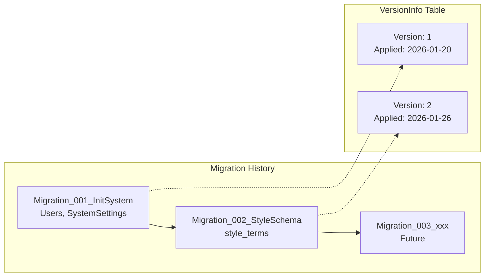
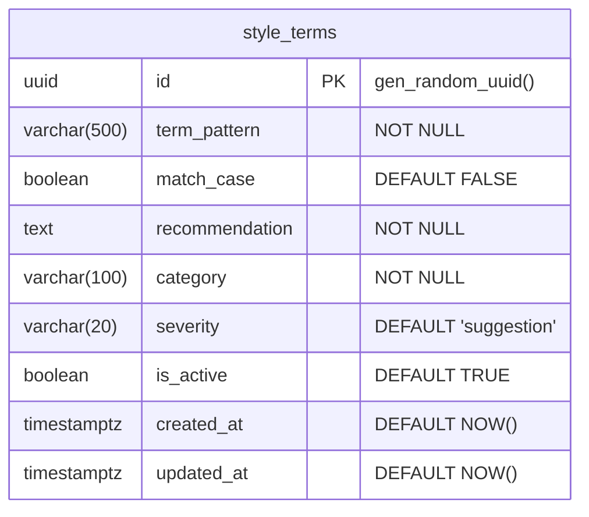
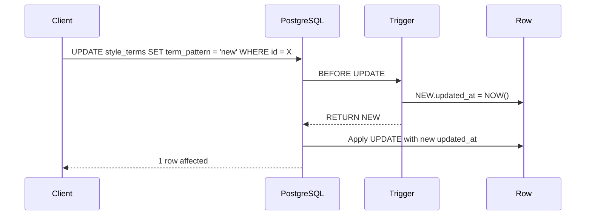

# LCS-INF-022a: Style Schema Migration

## 1. Metadata & Categorization

| Field                | Value                                        | Description                                           |
| :------------------- | :------------------------------------------- | :---------------------------------------------------- |
| **Feature ID**       | `INF-022a`                                   | Style Module - Schema Migration                       |
| **Feature Name**     | Style Schema Migration                       | Database schema for terminology storage               |
| **Target Version**   | `v0.2.2a`                                    | First sub-part of v0.2.2                              |
| **Module Scope**     | `Lexichord.Modules.Style`                    | Style governance infrastructure                       |
| **Swimlane**         | `Features`                                   | Style Governance Domain                               |
| **License Tier**     | `Core`                                       | Foundation (Required for all tiers)                   |
| **Author**           | System Architect                             |                                                       |
| **Status**           | **Draft**                                    | Pending implementation                                |
| **Last Updated**     | 2026-01-26                                   |                                                       |

---

## 2. Executive Summary

### 2.1 The Requirement

The Style Governance module requires a **persistent database schema** to store terminology rules:

- Table for style terms with pattern matching configuration.
- Proper indexes for high-performance queries by category and severity.
- Trigram index for efficient `LIKE` pattern searches.
- Audit columns for change tracking.
- Check constraints for data integrity.

### 2.2 The Proposed Solution

We **SHALL** implement `Migration_002_StyleSchema.cs` that:

1. Creates the `style_terms` table with all required columns.
2. Adds indexes for category, severity, and pattern lookups.
3. Implements proper `Up()` and `Down()` methods for reversibility.
4. Follows FluentMigrator conventions established in v0.0.5c.

---

## 3. Architecture

### 3.1 Migration Sequence



### 3.2 Table Schema



---

## 4. Data Contracts

### 4.1 Migration Class

```csharp
using FluentMigrator;

namespace Lexichord.Modules.Style.Migrations;

/// <summary>
/// Creates the style_terms table for terminology storage.
/// </summary>
/// <remarks>
/// LOGIC: This migration establishes the core schema for the Style Governance module.
/// The table stores pattern-based rules for style checking with categorization and
/// severity levels. Soft delete pattern via is_active column.
///
/// Indexes:
/// - ix_style_terms_category: Filter terms by category
/// - ix_style_terms_severity: Filter terms by severity
/// - ix_style_terms_is_active: Filter active terms (partial index)
/// - ix_style_terms_term_pattern_trgm: Trigram index for LIKE queries
///
/// Run with: dotnet run -- --migrate
/// Rollback with: dotnet run -- --rollback 2
/// </remarks>
[Migration(2, TransactionBehavior.Default, "Create style_terms table")]
public class Migration_002_StyleSchema : Migration
{
    /// <summary>
    /// Creates the style_terms table and indexes.
    /// </summary>
    public override void Up()
    {
        // LOGIC: Create the main style_terms table
        Create.Table("style_terms")
            .WithColumn("id")
                .AsGuid()
                .PrimaryKey()
                .WithDefault(SystemMethods.NewGuid)
            .WithColumn("term_pattern")
                .AsString(500)
                .NotNullable()
            .WithColumn("match_case")
                .AsBoolean()
                .NotNullable()
                .WithDefaultValue(false)
            .WithColumn("recommendation")
                .AsCustom("TEXT")
                .NotNullable()
            .WithColumn("category")
                .AsString(100)
                .NotNullable()
            .WithColumn("severity")
                .AsString(20)
                .NotNullable()
                .WithDefaultValue("suggestion")
            .WithColumn("is_active")
                .AsBoolean()
                .NotNullable()
                .WithDefaultValue(true)
            .WithColumn("created_at")
                .AsDateTimeOffset()
                .NotNullable()
                .WithDefault(SystemMethods.CurrentUTCDateTime)
            .WithColumn("updated_at")
                .AsDateTimeOffset()
                .NotNullable()
                .WithDefault(SystemMethods.CurrentUTCDateTime);

        // LOGIC: Index for filtering by category (common query pattern)
        Create.Index("ix_style_terms_category")
            .OnTable("style_terms")
            .OnColumn("category")
            .Ascending();

        // LOGIC: Index for filtering by severity
        Create.Index("ix_style_terms_severity")
            .OnTable("style_terms")
            .OnColumn("severity")
            .Ascending();

        // LOGIC: Partial index for active terms only (most common query)
        // This is a partial index - only indexes rows where is_active = true
        Execute.Sql(@"
            CREATE INDEX ix_style_terms_is_active
            ON style_terms (is_active)
            WHERE is_active = TRUE;
        ");

        // LOGIC: Composite index for the most common query pattern:
        // SELECT * FROM style_terms WHERE is_active = TRUE ORDER BY category
        Create.Index("ix_style_terms_active_category")
            .OnTable("style_terms")
            .OnColumn("is_active").Ascending()
            .OnColumn("category").Ascending();

        // LOGIC: Check constraint for valid severity values
        Execute.Sql(@"
            ALTER TABLE style_terms
            ADD CONSTRAINT chk_style_terms_severity
            CHECK (severity IN ('error', 'warning', 'suggestion', 'info'));
        ");

        // LOGIC: Enable trigram extension for pattern matching (if not exists)
        // This was created in Migration_001 but we ensure it here
        Execute.Sql(@"
            CREATE EXTENSION IF NOT EXISTS pg_trgm;
        ");

        // LOGIC: Trigram GIN index for efficient LIKE '%pattern%' queries
        // This enables fast pattern searches without full table scans
        Execute.Sql(@"
            CREATE INDEX ix_style_terms_term_pattern_trgm
            ON style_terms
            USING GIN (term_pattern gin_trgm_ops);
        ");

        // LOGIC: Create updated_at trigger function (if not exists)
        Execute.Sql(@"
            CREATE OR REPLACE FUNCTION update_updated_at_column()
            RETURNS TRIGGER AS $$
            BEGIN
                NEW.updated_at = NOW();
                RETURN NEW;
            END;
            $$ LANGUAGE plpgsql;
        ");

        // LOGIC: Attach trigger to auto-update updated_at on modifications
        Execute.Sql(@"
            CREATE TRIGGER trg_style_terms_updated_at
            BEFORE UPDATE ON style_terms
            FOR EACH ROW
            EXECUTE FUNCTION update_updated_at_column();
        ");
    }

    /// <summary>
    /// Drops the style_terms table and all related objects.
    /// </summary>
    public override void Down()
    {
        // LOGIC: Drop in reverse order of creation

        // Drop trigger first
        Execute.Sql(@"
            DROP TRIGGER IF EXISTS trg_style_terms_updated_at ON style_terms;
        ");

        // Drop the table (cascades indexes and constraints)
        Delete.Table("style_terms");

        // Note: We don't drop the trigger function as it may be used by other tables
        // Note: We don't drop pg_trgm extension as it may be used elsewhere
    }
}
```

### 4.2 Raw SQL Schema (For Reference)

```sql
-- ============================================================================
-- Migration 002: Style Schema
-- ============================================================================
-- Creates the style_terms table for terminology storage.
-- Run with: dotnet run -- --migrate
-- ============================================================================

-- Ensure trigram extension is available
CREATE EXTENSION IF NOT EXISTS pg_trgm;

-- Main table
CREATE TABLE style_terms (
    id UUID PRIMARY KEY DEFAULT gen_random_uuid(),
    term_pattern VARCHAR(500) NOT NULL,
    match_case BOOLEAN NOT NULL DEFAULT FALSE,
    recommendation TEXT NOT NULL,
    category VARCHAR(100) NOT NULL,
    severity VARCHAR(20) NOT NULL DEFAULT 'suggestion',
    is_active BOOLEAN NOT NULL DEFAULT TRUE,
    created_at TIMESTAMPTZ NOT NULL DEFAULT NOW(),
    updated_at TIMESTAMPTZ NOT NULL DEFAULT NOW(),

    -- Check constraint for valid severity values
    CONSTRAINT chk_style_terms_severity
        CHECK (severity IN ('error', 'warning', 'suggestion', 'info'))
);

-- Index: Filter by category
CREATE INDEX ix_style_terms_category
    ON style_terms (category);

-- Index: Filter by severity
CREATE INDEX ix_style_terms_severity
    ON style_terms (severity);

-- Partial Index: Active terms only (most common query)
CREATE INDEX ix_style_terms_is_active
    ON style_terms (is_active)
    WHERE is_active = TRUE;

-- Composite Index: Active terms by category
CREATE INDEX ix_style_terms_active_category
    ON style_terms (is_active, category);

-- Trigram GIN Index: Pattern matching
CREATE INDEX ix_style_terms_term_pattern_trgm
    ON style_terms
    USING GIN (term_pattern gin_trgm_ops);

-- Trigger function for updated_at
CREATE OR REPLACE FUNCTION update_updated_at_column()
RETURNS TRIGGER AS $$
BEGIN
    NEW.updated_at = NOW();
    RETURN NEW;
END;
$$ LANGUAGE plpgsql;

-- Trigger: Auto-update updated_at
CREATE TRIGGER trg_style_terms_updated_at
    BEFORE UPDATE ON style_terms
    FOR EACH ROW
    EXECUTE FUNCTION update_updated_at_column();

-- ============================================================================
-- Rollback Script
-- ============================================================================
-- DROP TRIGGER IF EXISTS trg_style_terms_updated_at ON style_terms;
-- DROP TABLE IF EXISTS style_terms;
-- ============================================================================
```

---

## 5. Decision Tree: Column Selection

```text
START: "What data needs to be stored for a style term?"
|
+-- Pattern Matching
|   |-- term_pattern: The actual text/regex to match
|   |-- match_case: Whether matching is case-sensitive
|   +-- LOGIC: Supports both literal strings and regex patterns
|
+-- User Guidance
|   |-- recommendation: What to show the user when matched
|   +-- LOGIC: Can be replacement text or explanatory guidance
|
+-- Organization
|   |-- category: Group related terms (Terminology, Voice, etc.)
|   |-- severity: How urgent is this issue (error, warning, etc.)
|   +-- LOGIC: Enables filtering and prioritization
|
+-- Lifecycle
|   |-- is_active: Soft delete flag
|   |-- created_at: Audit timestamp
|   |-- updated_at: Change tracking
|   +-- LOGIC: Supports audit trails and recovery
|
+-- Identity
    |-- id: UUID primary key
    +-- LOGIC: Distributed-systems compatible, no sequence conflicts
```

---

## 6. Implementation Logic

### 6.1 Index Strategy

| Index Name | Type | Column(s) | Purpose |
|:-----------|:-----|:----------|:--------|
| `ix_style_terms_category` | B-tree | category | Filter by category |
| `ix_style_terms_severity` | B-tree | severity | Filter by severity |
| `ix_style_terms_is_active` | Partial B-tree | is_active (WHERE TRUE) | Active terms query |
| `ix_style_terms_active_category` | Composite B-tree | is_active, category | Common query pattern |
| `ix_style_terms_term_pattern_trgm` | GIN Trigram | term_pattern | LIKE pattern search |

### 6.2 Constraint Rationale

```csharp
// LOGIC: Why these constraints exist

// Severity must be one of the defined values
// This prevents typos and ensures consistent UI rendering
CONSTRAINT chk_style_terms_severity CHECK (severity IN ('error', 'warning', 'suggestion', 'info'))

// term_pattern NOT NULL - a term without a pattern is meaningless
// recommendation NOT NULL - users need guidance when matched
// category NOT NULL - all terms must be categorized

// VARCHAR lengths chosen based on:
// term_pattern(500) - Long enough for complex regex, short enough to prevent abuse
// category(100) - Generous for custom categories
// severity(20) - Fixed set of short strings
```

### 6.3 Trigger Behavior



---

## 7. Use Cases

### UC-01: Run Migration on Fresh Database

**Preconditions:**
- PostgreSQL container running.
- `VersionInfo` table exists (from Migration_001).
- Migration_002 not yet applied.

**Flow:**
1. Developer runs `dotnet run -- --migrate`.
2. FluentMigrator checks `VersionInfo` for applied migrations.
3. Migration_002 is identified as pending.
4. `Up()` method executes:
   - Creates `style_terms` table
   - Creates all indexes
   - Creates check constraint
   - Creates trigger
5. FluentMigrator inserts version 2 into `VersionInfo`.
6. Log: "Applied Migration_002_StyleSchema".

**Postconditions:**
- `style_terms` table exists with all columns.
- All indexes exist.
- Trigger is active.

---

### UC-02: Rollback Migration

**Preconditions:**
- Migration_002 has been applied.
- Need to revert to previous state.

**Flow:**
1. Developer runs `dotnet run -- --rollback 2`.
2. FluentMigrator identifies Migration_002 as the target.
3. `Down()` method executes:
   - Drops trigger
   - Drops table (cascades indexes and constraints)
4. FluentMigrator removes version 2 from `VersionInfo`.
5. Log: "Rolled back Migration_002_StyleSchema".

**Postconditions:**
- `style_terms` table no longer exists.
- Version 2 removed from `VersionInfo`.

---

### UC-03: Query Active Terms by Category

**Preconditions:**
- `style_terms` table populated with data.
- Indexes exist.

**Query:**
```sql
SELECT * FROM style_terms
WHERE is_active = TRUE AND category = 'Terminology'
ORDER BY term_pattern;
```

**Execution Plan:**
```
Index Scan using ix_style_terms_active_category on style_terms
  Index Cond: ((is_active = true) AND (category = 'Terminology'::text))
```

**Performance:**
- Uses composite index.
- No sequential scan.
- Sub-millisecond for thousands of rows.

---

## 8. Observability & Logging

### 8.1 Migration Log Events

| Level       | Source           | Message Template                                              |
| :---------- | :--------------- | :------------------------------------------------------------ |
| Information | MigrationRunner  | `Starting migration: {Version} - {Description}`               |
| Debug       | MigrationRunner  | `Creating table: style_terms`                                 |
| Debug       | MigrationRunner  | `Creating index: {IndexName}`                                 |
| Debug       | MigrationRunner  | `Executing SQL: {SqlPreview}`                                 |
| Information | MigrationRunner  | `Completed migration: {Version} in {Duration}ms`              |
| Error       | MigrationRunner  | `Migration {Version} failed: {Error}`                         |

### 8.2 Expected Migration Output

```
[INF] FluentMigrator: Starting migration run
[INF] FluentMigrator: [2] Starting Migration_002_StyleSchema
[DBG] FluentMigrator: Creating table 'style_terms'
[DBG] FluentMigrator: Creating index 'ix_style_terms_category' on 'style_terms'
[DBG] FluentMigrator: Creating index 'ix_style_terms_severity' on 'style_terms'
[DBG] FluentMigrator: Executing raw SQL (ix_style_terms_is_active)
[DBG] FluentMigrator: Creating index 'ix_style_terms_active_category' on 'style_terms'
[DBG] FluentMigrator: Executing raw SQL (chk_style_terms_severity)
[DBG] FluentMigrator: Executing raw SQL (pg_trgm extension)
[DBG] FluentMigrator: Executing raw SQL (ix_style_terms_term_pattern_trgm)
[DBG] FluentMigrator: Executing raw SQL (update_updated_at_column function)
[DBG] FluentMigrator: Executing raw SQL (trg_style_terms_updated_at trigger)
[INF] FluentMigrator: [2] Completed Migration_002_StyleSchema in 156ms
[INF] FluentMigrator: Migration run completed
```

---

## 9. Unit Testing Requirements

### 9.1 Migration Tests

```csharp
[TestFixture]
[Category("Integration")]
[Explicit("Requires PostgreSQL")]
public class Migration_002_StyleSchemaTests
{
    private string _connectionString = null!;
    private NpgsqlConnection _connection = null!;

    [SetUp]
    public async Task SetUp()
    {
        _connectionString = GetTestConnectionString();
        _connection = new NpgsqlConnection(_connectionString);
        await _connection.OpenAsync();

        // Ensure clean state - rollback if previously applied
        await RollbackMigrationIfApplied(2);
    }

    [TearDown]
    public async Task TearDown()
    {
        await _connection.DisposeAsync();
    }

    [Test]
    public async Task Up_CreatesStyleTermsTable()
    {
        // Arrange & Act
        await RunMigration(2);

        // Assert
        var tableExists = await TableExists("style_terms");
        Assert.That(tableExists, Is.True, "style_terms table should exist");
    }

    [Test]
    public async Task Up_CreatesAllColumns()
    {
        // Arrange
        var expectedColumns = new[]
        {
            "id", "term_pattern", "match_case", "recommendation",
            "category", "severity", "is_active", "created_at", "updated_at"
        };

        // Act
        await RunMigration(2);

        // Assert
        var actualColumns = await GetTableColumns("style_terms");
        Assert.That(actualColumns, Is.EquivalentTo(expectedColumns));
    }

    [Test]
    public async Task Up_CreatesAllIndexes()
    {
        // Arrange
        var expectedIndexes = new[]
        {
            "ix_style_terms_category",
            "ix_style_terms_severity",
            "ix_style_terms_is_active",
            "ix_style_terms_active_category",
            "ix_style_terms_term_pattern_trgm"
        };

        // Act
        await RunMigration(2);

        // Assert
        var actualIndexes = await GetTableIndexes("style_terms");
        foreach (var expected in expectedIndexes)
        {
            Assert.That(actualIndexes, Does.Contain(expected),
                $"Index {expected} should exist");
        }
    }

    [Test]
    public async Task Up_CreatesSeverityConstraint()
    {
        // Arrange
        await RunMigration(2);

        // Act & Assert
        var ex = Assert.ThrowsAsync<PostgresException>(async () =>
        {
            await _connection.ExecuteAsync(@"
                INSERT INTO style_terms (term_pattern, recommendation, category, severity)
                VALUES ('test', 'test', 'test', 'invalid_severity')
            ");
        });

        Assert.That(ex!.SqlState, Is.EqualTo("23514")); // Check violation
    }

    [Test]
    public async Task Up_CreatesUpdatedAtTrigger()
    {
        // Arrange
        await RunMigration(2);

        // Insert a term
        var id = Guid.NewGuid();
        await _connection.ExecuteAsync(@"
            INSERT INTO style_terms (id, term_pattern, recommendation, category)
            VALUES (@Id, 'test', 'test rec', 'Terminology')
        ", new { Id = id });

        var originalUpdatedAt = await _connection.ExecuteScalarAsync<DateTimeOffset>(
            "SELECT updated_at FROM style_terms WHERE id = @Id",
            new { Id = id });

        // Wait to ensure timestamp difference
        await Task.Delay(100);

        // Act
        await _connection.ExecuteAsync(@"
            UPDATE style_terms SET term_pattern = 'updated' WHERE id = @Id
        ", new { Id = id });

        // Assert
        var newUpdatedAt = await _connection.ExecuteScalarAsync<DateTimeOffset>(
            "SELECT updated_at FROM style_terms WHERE id = @Id",
            new { Id = id });

        Assert.That(newUpdatedAt, Is.GreaterThan(originalUpdatedAt));
    }

    [Test]
    public async Task Down_DropsTable()
    {
        // Arrange
        await RunMigration(2);
        Assert.That(await TableExists("style_terms"), Is.True);

        // Act
        await RollbackMigration(2);

        // Assert
        Assert.That(await TableExists("style_terms"), Is.False);
    }

    [Test]
    public async Task InsertedRow_HasDefaultValues()
    {
        // Arrange
        await RunMigration(2);

        // Act
        var id = await _connection.ExecuteScalarAsync<Guid>(@"
            INSERT INTO style_terms (term_pattern, recommendation, category)
            VALUES ('test', 'test recommendation', 'Terminology')
            RETURNING id
        ");

        // Assert
        var term = await _connection.QuerySingleAsync<dynamic>(
            "SELECT * FROM style_terms WHERE id = @Id",
            new { Id = id });

        Assert.Multiple(() =>
        {
            Assert.That((bool)term.match_case, Is.False);
            Assert.That((string)term.severity, Is.EqualTo("suggestion"));
            Assert.That((bool)term.is_active, Is.True);
            Assert.That((DateTimeOffset)term.created_at, Is.Not.EqualTo(default(DateTimeOffset)));
            Assert.That((DateTimeOffset)term.updated_at, Is.Not.EqualTo(default(DateTimeOffset)));
        });
    }

    private static string GetTestConnectionString() =>
        Environment.GetEnvironmentVariable("LEXICHORD_TEST_DB")
            ?? "Host=localhost;Port=5432;Database=lexichord_test;Username=lexichord;Password=lexichord_dev";

    private async Task<bool> TableExists(string tableName)
    {
        var count = await _connection.ExecuteScalarAsync<int>(@"
            SELECT COUNT(*) FROM information_schema.tables
            WHERE table_name = @TableName
        ", new { TableName = tableName });
        return count > 0;
    }

    private async Task<IEnumerable<string>> GetTableColumns(string tableName)
    {
        return await _connection.QueryAsync<string>(@"
            SELECT column_name FROM information_schema.columns
            WHERE table_name = @TableName
            ORDER BY ordinal_position
        ", new { TableName = tableName });
    }

    private async Task<IEnumerable<string>> GetTableIndexes(string tableName)
    {
        return await _connection.QueryAsync<string>(@"
            SELECT indexname FROM pg_indexes
            WHERE tablename = @TableName
        ", new { TableName = tableName });
    }

    private async Task RunMigration(long version)
    {
        // Implementation using FluentMigrator runner
        var services = new ServiceCollection()
            .AddFluentMigratorCore()
            .ConfigureRunner(rb => rb
                .AddPostgres()
                .WithGlobalConnectionString(_connectionString)
                .ScanIn(typeof(Migration_002_StyleSchema).Assembly).For.Migrations())
            .BuildServiceProvider();

        using var scope = services.CreateScope();
        var runner = scope.ServiceProvider.GetRequiredService<IMigrationRunner>();
        runner.MigrateUp(version);
    }

    private async Task RollbackMigration(long version)
    {
        var services = new ServiceCollection()
            .AddFluentMigratorCore()
            .ConfigureRunner(rb => rb
                .AddPostgres()
                .WithGlobalConnectionString(_connectionString)
                .ScanIn(typeof(Migration_002_StyleSchema).Assembly).For.Migrations())
            .BuildServiceProvider();

        using var scope = services.CreateScope();
        var runner = scope.ServiceProvider.GetRequiredService<IMigrationRunner>();
        runner.MigrateDown(version - 1);
    }

    private async Task RollbackMigrationIfApplied(long version)
    {
        var applied = await _connection.ExecuteScalarAsync<int>(@"
            SELECT COUNT(*) FROM ""VersionInfo"" WHERE ""Version"" = @Version
        ", new { Version = version });

        if (applied > 0)
        {
            await RollbackMigration(version);
        }
    }
}
```

---

## 10. Security & Safety

### 10.1 Migration Safety

> [!WARNING]
> Always test migrations on a copy of production data before applying to production.

**Safe Migration Practices:**

1. **Wrap in Transaction:** FluentMigrator's `TransactionBehavior.Default` ensures atomicity.
2. **Test Rollback:** Every `Up()` must have a working `Down()`.
3. **Backup First:** Take a database backup before running migrations.
4. **Staged Rollout:** Apply to staging environment first.

### 10.2 Data Integrity

```csharp
// LOGIC: Constraints prevent invalid data

// Severity must be valid
CHECK (severity IN ('error', 'warning', 'suggestion', 'info'))

// Required fields cannot be null
term_pattern VARCHAR(500) NOT NULL
recommendation TEXT NOT NULL
category VARCHAR(100) NOT NULL
```

---

## 11. Risks & Mitigations

| Risk | Impact | Probability | Mitigation |
|:-----|:-------|:------------|:-----------|
| Migration timeout on large database | High | Low | Set appropriate command timeout; test with prod-like data |
| pg_trgm extension not available | Medium | Low | Check extension availability; provide fallback |
| Trigger function conflicts | Low | Low | Use CREATE OR REPLACE; check for existing |
| Index creation blocks writes | Medium | Medium | Use CONCURRENTLY in production (manual step) |
| Rollback loses user data | High | N/A | Document that rollback deletes data; require backup |

---

## 12. Acceptance Criteria (QA)

| #   | Criterion                                                                      | Status |
| :-- | :----------------------------------------------------------------------------- | :----- |
| 1   | Migration_002 creates `style_terms` table.                                     | [ ]    |
| 2   | Table has all required columns with correct types.                             | [ ]    |
| 3   | Primary key constraint on `id` column.                                         | [ ]    |
| 4   | Default values work: match_case=false, severity='suggestion', is_active=true.  | [ ]    |
| 5   | `ix_style_terms_category` index exists.                                        | [ ]    |
| 6   | `ix_style_terms_severity` index exists.                                        | [ ]    |
| 7   | `ix_style_terms_is_active` partial index exists.                               | [ ]    |
| 8   | `ix_style_terms_active_category` composite index exists.                       | [ ]    |
| 9   | `ix_style_terms_term_pattern_trgm` GIN index exists.                           | [ ]    |
| 10  | `chk_style_terms_severity` check constraint rejects invalid values.            | [ ]    |
| 11  | `trg_style_terms_updated_at` trigger updates timestamp on UPDATE.              | [ ]    |
| 12  | `Down()` method cleanly removes all objects.                                   | [ ]    |
| 13  | Migration is idempotent (running twice doesn't error).                         | [ ]    |
| 14  | Migration recorded in `VersionInfo` table.                                     | [ ]    |

---

## 13. Verification Commands

```bash
# 1. Start database
./scripts/db-start.sh

# 2. Run migration
dotnet run --project src/Lexichord.Host -- --migrate
# Expected: "Applied Migration_002_StyleSchema"

# 3. Verify table structure
docker exec -it lexichord-postgres psql -U lexichord -c "\d style_terms"
# Expected: Table with all columns

# 4. Verify indexes
docker exec -it lexichord-postgres psql -U lexichord -c "\di style_terms*"
# Expected: 5+ indexes listed

# 5. Verify check constraint
docker exec -it lexichord-postgres psql -U lexichord -c "
    INSERT INTO style_terms (term_pattern, recommendation, category, severity)
    VALUES ('test', 'test', 'test', 'invalid');
"
# Expected: ERROR: check constraint violation

# 6. Verify trigger
docker exec -it lexichord-postgres psql -U lexichord -c "
    INSERT INTO style_terms (term_pattern, recommendation, category)
    VALUES ('trigger_test', 'test', 'Terminology')
    RETURNING id, created_at, updated_at;
"
# Insert a row, note the timestamps

docker exec -it lexichord-postgres psql -U lexichord -c "
    UPDATE style_terms SET term_pattern = 'updated_trigger_test'
    WHERE term_pattern = 'trigger_test'
    RETURNING id, updated_at;
"
# Expected: updated_at should be newer

# 7. Test rollback
dotnet run --project src/Lexichord.Host -- --rollback 1
# Expected: "Rolled back to version 1"

docker exec -it lexichord-postgres psql -U lexichord -c "\d style_terms"
# Expected: "Did not find any relation named style_terms"

# 8. Reapply migration
dotnet run --project src/Lexichord.Host -- --migrate
# Expected: "Applied Migration_002_StyleSchema"

# 9. Verify version info
docker exec -it lexichord-postgres psql -U lexichord -c "
    SELECT * FROM \"VersionInfo\" ORDER BY \"Version\";
"
# Expected: Versions 1 and 2 listed
```

---

## 14. Deliverable Checklist

| Step | Description                                                               | Status |
| :--- | :------------------------------------------------------------------------ | :----- |
| 1    | `Migration_002_StyleSchema.cs` file created                               | [ ]    |
| 2    | `Up()` method creates `style_terms` table                                 | [ ]    |
| 3    | All columns defined with correct types and constraints                    | [ ]    |
| 4    | `ix_style_terms_category` index created                                   | [ ]    |
| 5    | `ix_style_terms_severity` index created                                   | [ ]    |
| 6    | `ix_style_terms_is_active` partial index created                          | [ ]    |
| 7    | `ix_style_terms_active_category` composite index created                  | [ ]    |
| 8    | `ix_style_terms_term_pattern_trgm` GIN trigram index created              | [ ]    |
| 9    | `chk_style_terms_severity` check constraint added                         | [ ]    |
| 10   | `update_updated_at_column()` function created                             | [ ]    |
| 11   | `trg_style_terms_updated_at` trigger created                              | [ ]    |
| 12   | `Down()` method removes trigger                                           | [ ]    |
| 13   | `Down()` method drops table                                               | [ ]    |
| 14   | Integration tests for migration pass                                      | [ ]    |
| 15   | Migration documented with XML comments                                    | [ ]    |
