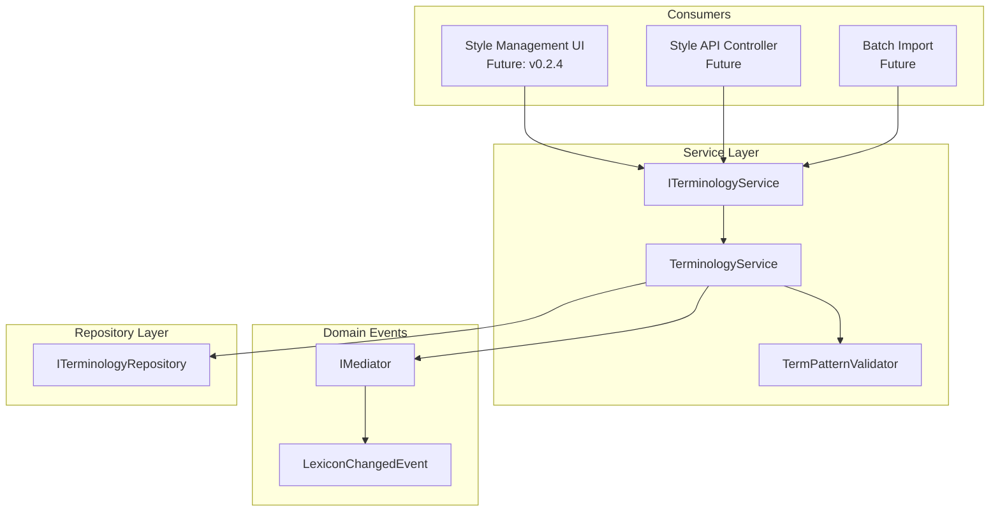
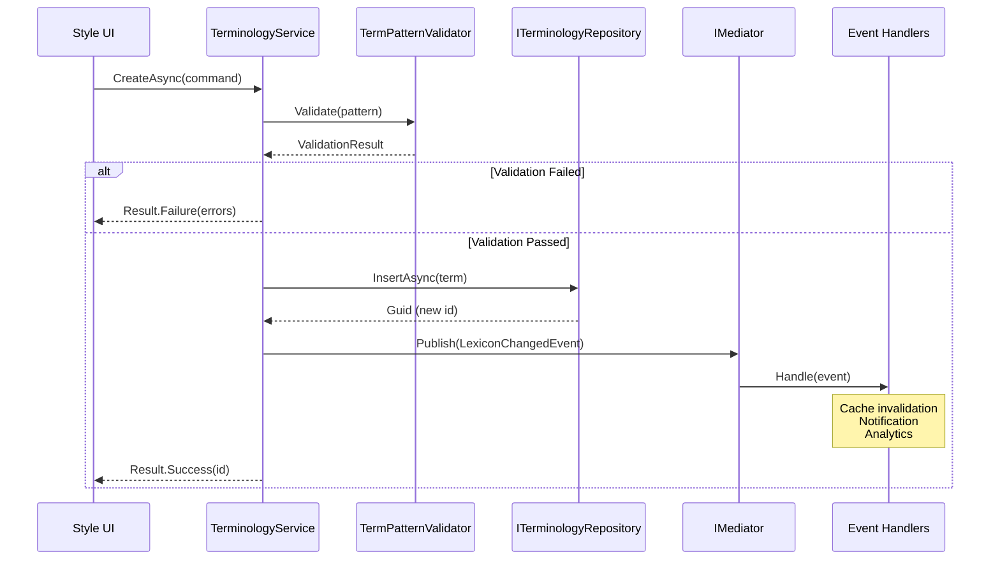
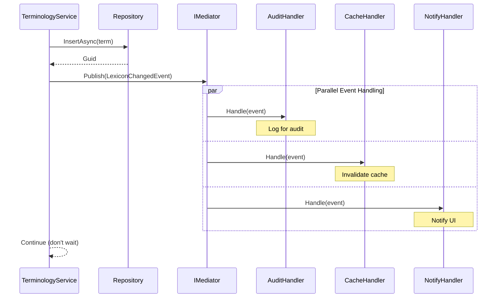
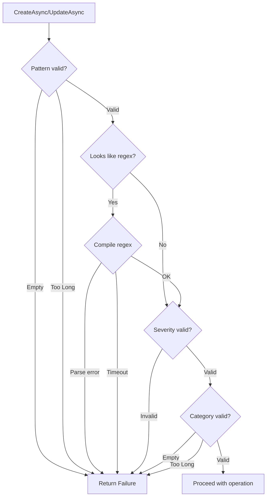

# LCS-INF-022d: Terminology CRUD Service

## 1. Metadata & Categorization

| Field                | Value                                        | Description                                           |
| :------------------- | :------------------------------------------- | :---------------------------------------------------- |
| **Feature ID**       | `INF-022d`                                   | Style Module - Terminology Service                    |
| **Feature Name**     | Terminology CRUD Service                     | Business logic with event publication                 |
| **Target Version**   | `v0.2.2d`                                    | Fourth sub-part of v0.2.2                             |
| **Module Scope**     | `Lexichord.Modules.Style`                    | Style governance infrastructure                       |
| **Swimlane**         | `Features`                                   | Style Governance Domain                               |
| **License Tier**     | `Core`                                       | Foundation (Required for all tiers)                   |
| **Author**           | System Architect                             |                                                       |
| **Status**           | **Draft**                                    | Pending implementation                                |
| **Last Updated**     | 2026-01-26                                   |                                                       |

---

## 2. Executive Summary

### 2.1 The Requirement

The Style Governance module requires a **business-level service layer** for terminology management:

- Validation of term patterns before persistence.
- CRUD operations with proper error handling.
- Domain event publication for cross-module communication.
- Statistics and reporting capabilities.
- Audit-friendly operation logging.

### 2.2 The Proposed Solution

We **SHALL** implement `ITerminologyService` with:

1. **CRUD Operations** — Create, Read, Update, Delete with validation.
2. **Result Pattern** — Return `Result<T>` for explicit error handling.
3. **Event Publication** — Publish `LexiconChangedEvent` via MediatR.
4. **Validation** — Pattern validation, severity checking, uniqueness.
5. **Statistics** — Term counts by category and severity.

---

## 3. Architecture

### 3.1 Service Layer Architecture



### 3.2 Event Publication Flow



---

## 4. Data Contracts

### 4.1 Service Interface

```csharp
namespace Lexichord.Modules.Style.Contracts;

using Lexichord.Abstractions;
using Lexichord.Modules.Style.Entities;
using Lexichord.Modules.Style.Commands;

/// <summary>
/// Business-level service for terminology management with validation and events.
/// </summary>
/// <remarks>
/// LOGIC: This service provides the primary API for terminology operations.
/// It sits between the UI/API layer and the repository, adding:
/// - Input validation with detailed error messages
/// - Business rule enforcement
/// - Domain event publication via MediatR
/// - Result pattern for explicit error handling
///
/// All modification operations (Create, Update, Delete) publish
/// LexiconChangedEvent which enables:
/// - Cache invalidation across the application
/// - Notification to other modules
/// - Audit logging
/// - Analytics tracking
///
/// Thread Safety:
/// - Service is scoped per request
/// - All operations are async
/// - No internal state
/// </remarks>
public interface ITerminologyService
{
    // ========================================
    // READ OPERATIONS
    // ========================================

    /// <summary>
    /// Gets a term by its unique identifier.
    /// </summary>
    /// <param name="id">The term ID.</param>
    /// <param name="cancellationToken">Cancellation token.</param>
    /// <returns>The term, or null if not found.</returns>
    Task<StyleTerm?> GetByIdAsync(Guid id, CancellationToken cancellationToken = default);

    /// <summary>
    /// Gets all terms (active and inactive).
    /// </summary>
    /// <param name="cancellationToken">Cancellation token.</param>
    /// <returns>All terms in the database.</returns>
    /// <remarks>
    /// LOGIC: For administrative views that need to see inactive terms.
    /// Use GetAllActiveTermsAsync() from repository for analysis.
    /// </remarks>
    Task<IEnumerable<StyleTerm>> GetAllAsync(CancellationToken cancellationToken = default);

    /// <summary>
    /// Gets all active terms.
    /// </summary>
    /// <param name="cancellationToken">Cancellation token.</param>
    /// <returns>All active terms.</returns>
    Task<IEnumerable<StyleTerm>> GetActiveAsync(CancellationToken cancellationToken = default);

    /// <summary>
    /// Gets terms by category.
    /// </summary>
    /// <param name="category">The category name.</param>
    /// <param name="cancellationToken">Cancellation token.</param>
    /// <returns>Terms in the specified category.</returns>
    Task<IEnumerable<StyleTerm>> GetByCategoryAsync(string category, CancellationToken cancellationToken = default);

    /// <summary>
    /// Gets terms by severity.
    /// </summary>
    /// <param name="severity">The severity level.</param>
    /// <param name="cancellationToken">Cancellation token.</param>
    /// <returns>Terms with the specified severity.</returns>
    Task<IEnumerable<StyleTerm>> GetBySeverityAsync(string severity, CancellationToken cancellationToken = default);

    /// <summary>
    /// Searches terms by pattern.
    /// </summary>
    /// <param name="searchPattern">The search pattern.</param>
    /// <param name="cancellationToken">Cancellation token.</param>
    /// <returns>Terms matching the search pattern.</returns>
    Task<IEnumerable<StyleTerm>> SearchAsync(string searchPattern, CancellationToken cancellationToken = default);

    // ========================================
    // WRITE OPERATIONS
    // ========================================

    /// <summary>
    /// Creates a new style term.
    /// </summary>
    /// <param name="command">The creation command with term details.</param>
    /// <param name="cancellationToken">Cancellation token.</param>
    /// <returns>
    /// Result containing the new term ID on success,
    /// or error message on failure.
    /// </returns>
    /// <remarks>
    /// LOGIC: Validates the command, creates the term, and publishes
    /// LexiconChangedEvent with ChangeType.Created.
    ///
    /// Validation includes:
    /// - Pattern not empty
    /// - Pattern is valid regex (if applicable)
    /// - Severity is valid
    /// - Category is not empty
    /// - Pattern not duplicate (optional)
    /// </remarks>
    Task<Result<Guid>> CreateAsync(CreateTermCommand command, CancellationToken cancellationToken = default);

    /// <summary>
    /// Updates an existing style term.
    /// </summary>
    /// <param name="command">The update command with changed fields.</param>
    /// <param name="cancellationToken">Cancellation token.</param>
    /// <returns>
    /// Result containing true on success (term was updated),
    /// or error message on failure.
    /// </returns>
    /// <remarks>
    /// LOGIC: Validates the command, applies updates to non-null fields,
    /// and publishes LexiconChangedEvent with ChangeType.Updated.
    ///
    /// Only non-null fields in the command are updated.
    /// The updated_at timestamp is set automatically by the database trigger.
    /// </remarks>
    Task<Result<bool>> UpdateAsync(UpdateTermCommand command, CancellationToken cancellationToken = default);

    /// <summary>
    /// Soft-deletes a term by setting is_active to false.
    /// </summary>
    /// <param name="id">The ID of the term to delete.</param>
    /// <param name="cancellationToken">Cancellation token.</param>
    /// <returns>
    /// Result containing true on success (term was deactivated),
    /// or error message on failure (term not found).
    /// </returns>
    /// <remarks>
    /// LOGIC: Soft delete preserves the term for audit purposes.
    /// Publishes LexiconChangedEvent with ChangeType.Deleted.
    /// </remarks>
    Task<Result<bool>> DeleteAsync(Guid id, CancellationToken cancellationToken = default);

    /// <summary>
    /// Reactivates a soft-deleted term.
    /// </summary>
    /// <param name="id">The ID of the term to reactivate.</param>
    /// <param name="cancellationToken">Cancellation token.</param>
    /// <returns>Result containing true on success.</returns>
    Task<Result<bool>> ReactivateAsync(Guid id, CancellationToken cancellationToken = default);

    // ========================================
    // STATISTICS
    // ========================================

    /// <summary>
    /// Gets statistics about the terminology database.
    /// </summary>
    /// <param name="cancellationToken">Cancellation token.</param>
    /// <returns>Statistics including counts by category and severity.</returns>
    Task<TermStatistics> GetStatisticsAsync(CancellationToken cancellationToken = default);
}

/// <summary>
/// Statistics about the terminology lexicon.
/// </summary>
public sealed record TermStatistics
{
    /// <summary>Total number of terms (active and inactive).</summary>
    public required int TotalTerms { get; init; }

    /// <summary>Number of active terms.</summary>
    public required int ActiveTerms { get; init; }

    /// <summary>Number of inactive (soft-deleted) terms.</summary>
    public int InactiveTerms => TotalTerms - ActiveTerms;

    /// <summary>Count of terms per category.</summary>
    public required IReadOnlyDictionary<string, int> ByCategory { get; init; }

    /// <summary>Count of terms per severity level.</summary>
    public required IReadOnlyDictionary<string, int> BySeverity { get; init; }
}
```

### 4.2 Service Implementation

```csharp
namespace Lexichord.Modules.Style.Services;

using MediatR;
using Microsoft.Extensions.Logging;
using Lexichord.Abstractions;
using Lexichord.Abstractions.Events;
using Lexichord.Modules.Style.Contracts;
using Lexichord.Modules.Style.Entities;
using Lexichord.Modules.Style.Commands;

/// <summary>
/// Business-level service for terminology operations with validation and events.
/// </summary>
/// <remarks>
/// LOGIC: This implementation provides:
/// - Input validation with detailed error messages
/// - Domain event publication for cross-cutting concerns
/// - Result pattern for explicit success/failure handling
/// - Logging at appropriate levels for debugging and audit
///
/// Event Publication Strategy:
/// - Create: Publishes after successful insert
/// - Update: Publishes after successful update
/// - Delete: Publishes after successful soft-delete
/// - Events are fire-and-forget (handlers run asynchronously)
/// </remarks>
public sealed class TerminologyService : ITerminologyService
{
    private readonly ITerminologyRepository _repository;
    private readonly IMediator _mediator;
    private readonly ILogger<TerminologyService> _logger;

    public TerminologyService(
        ITerminologyRepository repository,
        IMediator mediator,
        ILogger<TerminologyService> logger)
    {
        _repository = repository ?? throw new ArgumentNullException(nameof(repository));
        _mediator = mediator ?? throw new ArgumentNullException(nameof(mediator));
        _logger = logger ?? throw new ArgumentNullException(nameof(logger));
    }

    // ========================================
    // READ OPERATIONS
    // ========================================

    /// <inheritdoc />
    public async Task<StyleTerm?> GetByIdAsync(Guid id, CancellationToken cancellationToken = default)
    {
        _logger.LogDebug("Getting term by ID: {Id}", id);
        return await _repository.GetByIdAsync(id, cancellationToken);
    }

    /// <inheritdoc />
    public async Task<IEnumerable<StyleTerm>> GetAllAsync(CancellationToken cancellationToken = default)
    {
        _logger.LogDebug("Getting all terms");

        // LOGIC: GetByCategoryAsync returns all terms including inactive
        // We need to get from all categories
        var allTerms = new List<StyleTerm>();

        foreach (var category in StyleTermCategory.Standard)
        {
            var categoryTerms = await _repository.GetByCategoryAsync(category, cancellationToken);
            allTerms.AddRange(categoryTerms);
        }

        // Also get any custom categories by querying without filter
        // This is a simplified approach - consider adding a GetAllAsync to repository
        return allTerms;
    }

    /// <inheritdoc />
    public async Task<IEnumerable<StyleTerm>> GetActiveAsync(CancellationToken cancellationToken = default)
    {
        _logger.LogDebug("Getting all active terms");
        var activeSet = await _repository.GetAllActiveTermsAsync(cancellationToken);
        return activeSet.ToList();
    }

    /// <inheritdoc />
    public async Task<IEnumerable<StyleTerm>> GetByCategoryAsync(
        string category,
        CancellationToken cancellationToken = default)
    {
        _logger.LogDebug("Getting terms by category: {Category}", category);
        return await _repository.GetByCategoryAsync(category, cancellationToken);
    }

    /// <inheritdoc />
    public async Task<IEnumerable<StyleTerm>> GetBySeverityAsync(
        string severity,
        CancellationToken cancellationToken = default)
    {
        _logger.LogDebug("Getting terms by severity: {Severity}", severity);
        return await _repository.GetBySeverityAsync(severity, cancellationToken);
    }

    /// <inheritdoc />
    public async Task<IEnumerable<StyleTerm>> SearchAsync(
        string searchPattern,
        CancellationToken cancellationToken = default)
    {
        _logger.LogDebug("Searching terms with pattern: {Pattern}", searchPattern);
        return await _repository.SearchByPatternAsync(searchPattern, cancellationToken);
    }

    // ========================================
    // WRITE OPERATIONS
    // ========================================

    /// <inheritdoc />
    public async Task<Result<Guid>> CreateAsync(
        CreateTermCommand command,
        CancellationToken cancellationToken = default)
    {
        _logger.LogDebug("Creating term with pattern: {Pattern}", command.TermPattern);

        // Validate command
        var validationResult = ValidateCreateCommand(command);
        if (!validationResult.IsSuccess)
        {
            _logger.LogWarning("Validation failed for create: {Error}", validationResult.Error);
            return Result<Guid>.Failure(validationResult.Error!);
        }

        // Create entity
        var term = new StyleTerm
        {
            TermPattern = command.TermPattern,
            MatchCase = command.MatchCase,
            Recommendation = command.Recommendation,
            Category = command.Category,
            Severity = command.Severity
        };

        // Insert
        var id = await _repository.InsertAsync(term, cancellationToken);

        _logger.LogInformation("Created term {Id}: {Pattern}", id, command.TermPattern);

        // Publish event
        await PublishLexiconChangedEvent(
            LexiconChangeType.Created,
            id,
            command.TermPattern,
            command.Category,
            cancellationToken);

        return Result<Guid>.Success(id);
    }

    /// <inheritdoc />
    public async Task<Result<bool>> UpdateAsync(
        UpdateTermCommand command,
        CancellationToken cancellationToken = default)
    {
        _logger.LogDebug("Updating term: {Id}", command.Id);

        // Get existing term
        var existing = await _repository.GetByIdAsync(command.Id, cancellationToken);
        if (existing is null)
        {
            _logger.LogWarning("Term not found for update: {Id}", command.Id);
            return Result<bool>.Failure($"Term with ID {command.Id} not found");
        }

        // Validate command
        var validationResult = ValidateUpdateCommand(command);
        if (!validationResult.IsSuccess)
        {
            _logger.LogWarning("Validation failed for update: {Error}", validationResult.Error);
            return Result<bool>.Failure(validationResult.Error!);
        }

        // Apply updates (only non-null fields)
        var updated = existing with
        {
            TermPattern = command.TermPattern ?? existing.TermPattern,
            MatchCase = command.MatchCase ?? existing.MatchCase,
            Recommendation = command.Recommendation ?? existing.Recommendation,
            Category = command.Category ?? existing.Category,
            Severity = command.Severity ?? existing.Severity,
            IsActive = command.IsActive ?? existing.IsActive
        };

        // Update
        var success = await _repository.UpdateAsync(updated, cancellationToken);

        if (success)
        {
            _logger.LogInformation("Updated term {Id}: {Pattern}", command.Id, updated.TermPattern);

            // Publish event
            await PublishLexiconChangedEvent(
                LexiconChangeType.Updated,
                command.Id,
                updated.TermPattern,
                updated.Category,
                cancellationToken);
        }

        return Result<bool>.Success(success);
    }

    /// <inheritdoc />
    public async Task<Result<bool>> DeleteAsync(
        Guid id,
        CancellationToken cancellationToken = default)
    {
        _logger.LogDebug("Deleting term: {Id}", id);

        // Get existing term for event
        var existing = await _repository.GetByIdAsync(id, cancellationToken);
        if (existing is null)
        {
            _logger.LogWarning("Term not found for delete: {Id}", id);
            return Result<bool>.Failure($"Term with ID {id} not found");
        }

        // Soft delete
        var success = await _repository.DeleteAsync(id, cancellationToken);

        if (success)
        {
            _logger.LogInformation("Deleted term {Id}: {Pattern}", id, existing.TermPattern);

            // Publish event
            await PublishLexiconChangedEvent(
                LexiconChangeType.Deleted,
                id,
                existing.TermPattern,
                existing.Category,
                cancellationToken);
        }

        return Result<bool>.Success(success);
    }

    /// <inheritdoc />
    public async Task<Result<bool>> ReactivateAsync(
        Guid id,
        CancellationToken cancellationToken = default)
    {
        _logger.LogDebug("Reactivating term: {Id}", id);

        var existing = await _repository.GetByIdAsync(id, cancellationToken);
        if (existing is null)
        {
            return Result<bool>.Failure($"Term with ID {id} not found");
        }

        if (existing.IsActive)
        {
            return Result<bool>.Failure("Term is already active");
        }

        var updated = existing with { IsActive = true };
        var success = await _repository.UpdateAsync(updated, cancellationToken);

        if (success)
        {
            _logger.LogInformation("Reactivated term {Id}: {Pattern}", id, existing.TermPattern);

            await PublishLexiconChangedEvent(
                LexiconChangeType.Updated,
                id,
                existing.TermPattern,
                existing.Category,
                cancellationToken);
        }

        return Result<bool>.Success(success);
    }

    // ========================================
    // STATISTICS
    // ========================================

    /// <inheritdoc />
    public async Task<TermStatistics> GetStatisticsAsync(CancellationToken cancellationToken = default)
    {
        _logger.LogDebug("Getting terminology statistics");

        var totalCount = await _repository.GetTermCountAsync(cancellationToken);
        var activeCount = await _repository.GetActiveTermCountAsync(cancellationToken);

        // Get counts by category
        var byCategory = new Dictionary<string, int>();
        foreach (var category in StyleTermCategory.Standard)
        {
            var terms = await _repository.GetByCategoryAsync(category, cancellationToken);
            var count = terms.Count(t => t.IsActive);
            if (count > 0)
            {
                byCategory[category] = count;
            }
        }

        // Get counts by severity
        var bySeverity = new Dictionary<string, int>();
        foreach (var severity in StyleTermSeverity.All)
        {
            var terms = await _repository.GetBySeverityAsync(severity, cancellationToken);
            var count = terms.Count();
            if (count > 0)
            {
                bySeverity[severity] = count;
            }
        }

        return new TermStatistics
        {
            TotalTerms = totalCount,
            ActiveTerms = activeCount,
            ByCategory = byCategory,
            BySeverity = bySeverity
        };
    }

    // ========================================
    // PRIVATE HELPERS
    // ========================================

    private static Result<bool> ValidateCreateCommand(CreateTermCommand command)
    {
        var errors = new List<string>();

        // Pattern validation
        if (string.IsNullOrWhiteSpace(command.TermPattern))
        {
            errors.Add("Term pattern is required");
        }
        else if (command.TermPattern.Length > 500)
        {
            errors.Add("Term pattern must be 500 characters or less");
        }
        else
        {
            var patternResult = TermPatternValidator.Validate(command.TermPattern);
            if (!patternResult.IsSuccess)
            {
                errors.Add(patternResult.Error!);
            }
        }

        // Recommendation validation
        if (string.IsNullOrWhiteSpace(command.Recommendation))
        {
            errors.Add("Recommendation is required");
        }

        // Category validation
        if (string.IsNullOrWhiteSpace(command.Category))
        {
            errors.Add("Category is required");
        }
        else if (command.Category.Length > 100)
        {
            errors.Add("Category must be 100 characters or less");
        }

        // Severity validation
        if (!StyleTermSeverity.IsValid(command.Severity))
        {
            errors.Add($"Invalid severity: {command.Severity}. Must be one of: {string.Join(", ", StyleTermSeverity.All)}");
        }

        if (errors.Count > 0)
        {
            return Result<bool>.Failure(string.Join("; ", errors));
        }

        return Result<bool>.Success(true);
    }

    private static Result<bool> ValidateUpdateCommand(UpdateTermCommand command)
    {
        var errors = new List<string>();

        // Pattern validation (if provided)
        if (command.TermPattern is not null)
        {
            if (string.IsNullOrWhiteSpace(command.TermPattern))
            {
                errors.Add("Term pattern cannot be empty");
            }
            else if (command.TermPattern.Length > 500)
            {
                errors.Add("Term pattern must be 500 characters or less");
            }
            else
            {
                var patternResult = TermPatternValidator.Validate(command.TermPattern);
                if (!patternResult.IsSuccess)
                {
                    errors.Add(patternResult.Error!);
                }
            }
        }

        // Category validation (if provided)
        if (command.Category is not null && command.Category.Length > 100)
        {
            errors.Add("Category must be 100 characters or less");
        }

        // Severity validation (if provided)
        if (command.Severity is not null && !StyleTermSeverity.IsValid(command.Severity))
        {
            errors.Add($"Invalid severity: {command.Severity}. Must be one of: {string.Join(", ", StyleTermSeverity.All)}");
        }

        if (errors.Count > 0)
        {
            return Result<bool>.Failure(string.Join("; ", errors));
        }

        return Result<bool>.Success(true);
    }

    private async Task PublishLexiconChangedEvent(
        LexiconChangeType changeType,
        Guid termId,
        string termPattern,
        string category,
        CancellationToken cancellationToken)
    {
        var @event = new LexiconChangedEvent
        {
            ChangeType = changeType,
            TermId = termId,
            TermPattern = termPattern,
            Category = category
        };

        _logger.LogDebug(
            "Publishing LexiconChangedEvent: {ChangeType} for {TermId}",
            changeType,
            termId);

        try
        {
            await _mediator.Publish(@event, cancellationToken);
        }
        catch (Exception ex)
        {
            // LOGIC: Log but don't fail the operation if event publishing fails
            _logger.LogError(ex, "Failed to publish LexiconChangedEvent for {TermId}", termId);
        }
    }
}
```

### 4.3 Pattern Validator

```csharp
namespace Lexichord.Modules.Style.Services;

using System.Text.RegularExpressions;
using Lexichord.Abstractions;

/// <summary>
/// Validates term patterns for safety and correctness.
/// </summary>
/// <remarks>
/// LOGIC: Validates that term patterns are:
/// - Not empty
/// - Not too long (<=500 chars)
/// - Valid regex (if they look like regex)
/// - Not dangerous (no catastrophic backtracking)
///
/// Patterns are validated with a timeout to prevent ReDoS attacks.
/// </remarks>
public static class TermPatternValidator
{
    /// <summary>Maximum allowed pattern length.</summary>
    public const int MaxPatternLength = 500;

    /// <summary>Timeout for regex compilation/matching tests.</summary>
    private static readonly TimeSpan RegexTimeout = TimeSpan.FromMilliseconds(100);

    /// <summary>
    /// Validates a term pattern.
    /// </summary>
    /// <param name="pattern">The pattern to validate.</param>
    /// <returns>Result indicating success or failure with error message.</returns>
    public static Result<bool> Validate(string pattern)
    {
        // Check for null/empty
        if (string.IsNullOrWhiteSpace(pattern))
        {
            return Result<bool>.Failure("Pattern cannot be empty");
        }

        // Check length
        if (pattern.Length > MaxPatternLength)
        {
            return Result<bool>.Failure($"Pattern must be {MaxPatternLength} characters or less");
        }

        // Check if it looks like a regex (contains regex metacharacters)
        if (LooksLikeRegex(pattern))
        {
            return ValidateRegexPattern(pattern);
        }

        // Plain text pattern - valid
        return Result<bool>.Success(true);
    }

    /// <summary>
    /// Checks if a pattern appears to be a regex (vs plain text).
    /// </summary>
    private static bool LooksLikeRegex(string pattern)
    {
        // Common regex metacharacters
        var metaChars = new[] { "\\b", "\\s", "\\w", "\\d", "[", "]", "(", ")", "*", "+", "?", "^", "$", "|" };
        return metaChars.Any(m => pattern.Contains(m, StringComparison.Ordinal));
    }

    /// <summary>
    /// Validates a regex pattern for correctness and safety.
    /// </summary>
    private static Result<bool> ValidateRegexPattern(string pattern)
    {
        try
        {
            // Try to compile the regex with a timeout
            var regex = new Regex(pattern, RegexOptions.None, RegexTimeout);

            // Try a simple match to verify it works
            regex.IsMatch("test string for validation");

            return Result<bool>.Success(true);
        }
        catch (RegexParseException ex)
        {
            return Result<bool>.Failure($"Invalid regex pattern: {ex.Message}");
        }
        catch (RegexMatchTimeoutException)
        {
            return Result<bool>.Failure("Pattern is too complex and may cause performance issues");
        }
        catch (ArgumentException ex)
        {
            return Result<bool>.Failure($"Invalid pattern: {ex.Message}");
        }
    }
}
```

### 4.4 Domain Event

```csharp
namespace Lexichord.Abstractions.Events;

/// <summary>
/// Published when the terminology lexicon changes.
/// </summary>
/// <remarks>
/// LOGIC: This event enables cross-cutting concerns:
/// - Cache invalidation in TerminologyRepository
/// - Notification to UI for refresh
/// - Audit logging
/// - Analytics tracking
///
/// Event handlers should be fast and non-blocking.
/// Heavy processing should be queued for background execution.
/// </remarks>
public sealed record LexiconChangedEvent : DomainEventBase
{
    /// <summary>
    /// The type of change that occurred.
    /// </summary>
    public required LexiconChangeType ChangeType { get; init; }

    /// <summary>
    /// The ID of the affected term.
    /// </summary>
    /// <remarks>
    /// LOGIC: For single-term operations (Create, Update, Delete).
    /// For bulk operations, this may be Guid.Empty.
    /// </remarks>
    public required Guid TermId { get; init; }

    /// <summary>
    /// The pattern of the affected term.
    /// </summary>
    /// <remarks>
    /// LOGIC: Included for logging and debugging.
    /// May be null for bulk operations.
    /// </remarks>
    public string? TermPattern { get; init; }

    /// <summary>
    /// The category of the affected term.
    /// </summary>
    /// <remarks>
    /// LOGIC: Enables selective cache invalidation by category.
    /// </remarks>
    public string? Category { get; init; }

    /// <summary>
    /// Number of terms affected.
    /// </summary>
    /// <remarks>
    /// LOGIC: 1 for single operations, >1 for bulk operations.
    /// </remarks>
    public int AffectedCount { get; init; } = 1;
}

/// <summary>
/// Types of lexicon changes.
/// </summary>
public enum LexiconChangeType
{
    /// <summary>A new term was created.</summary>
    Created,

    /// <summary>An existing term was updated.</summary>
    Updated,

    /// <summary>A term was soft-deleted.</summary>
    Deleted,

    /// <summary>Multiple terms were imported.</summary>
    BulkImport,

    /// <summary>Multiple terms were deleted.</summary>
    BulkDelete,

    /// <summary>The lexicon was reseeded.</summary>
    Reseeded
}
```

### 4.5 Event Handler Example

```csharp
namespace Lexichord.Modules.Style.EventHandlers;

using MediatR;
using Microsoft.Extensions.Logging;
using Lexichord.Abstractions.Events;

/// <summary>
/// Logs lexicon changes for audit purposes.
/// </summary>
/// <remarks>
/// LOGIC: This handler demonstrates event handling patterns.
/// It logs all lexicon changes at Information level for audit.
///
/// Production implementations might:
/// - Write to an audit table
/// - Send notifications
/// - Update analytics
/// - Trigger background jobs
/// </remarks>
public sealed class LexiconChangeAuditHandler : INotificationHandler<LexiconChangedEvent>
{
    private readonly ILogger<LexiconChangeAuditHandler> _logger;

    public LexiconChangeAuditHandler(ILogger<LexiconChangeAuditHandler> logger)
    {
        _logger = logger;
    }

    public Task Handle(LexiconChangedEvent notification, CancellationToken cancellationToken)
    {
        _logger.LogInformation(
            "Lexicon changed: {ChangeType} | Term: {TermId} | Pattern: {Pattern} | Category: {Category}",
            notification.ChangeType,
            notification.TermId,
            notification.TermPattern ?? "(bulk)",
            notification.Category ?? "(multiple)");

        return Task.CompletedTask;
    }
}
```

---

## 5. Decision Tree: Operation Selection

```text
START: "What terminology operation do I need?"
|
+-- Need to read terms?
|   +-- Single term by ID -> GetByIdAsync(id)
|   +-- All terms for admin -> GetAllAsync()
|   +-- Active terms only -> GetActiveAsync()
|   +-- Filter by category -> GetByCategoryAsync(category)
|   +-- Filter by severity -> GetBySeverityAsync(severity)
|   +-- Search by pattern -> SearchAsync(pattern)
|
+-- Need to create a term?
|   +-- CreateAsync(command)
|       - Validates pattern, severity, category
|       - Publishes LexiconChangedEvent.Created
|       - Returns Result<Guid>
|
+-- Need to update a term?
|   +-- UpdateAsync(command)
|       - Only updates non-null fields
|       - Publishes LexiconChangedEvent.Updated
|       - Returns Result<bool>
|
+-- Need to delete a term?
|   +-- DeleteAsync(id)
|       - Soft delete (is_active = false)
|       - Publishes LexiconChangedEvent.Deleted
|       - Returns Result<bool>
|
+-- Need to restore a deleted term?
|   +-- ReactivateAsync(id)
|       - Sets is_active = true
|       - Publishes LexiconChangedEvent.Updated
|
+-- Need statistics?
    +-- GetStatisticsAsync()
        - Returns counts by category/severity
```

---

## 6. Implementation Logic

### 6.1 Event Publication Strategy



### 6.2 Validation Flow



---

## 7. Use Cases

### UC-01: Create Term via UI

**Preconditions:**
- User has Style Management UI open (future v0.2.4).
- User fills in term form.

**Flow:**
1. User enters: Pattern="utilize", Recommendation="Use 'use' instead", Category="Terminology", Severity="suggestion".
2. UI calls `CreateAsync(command)`.
3. Service validates:
   - Pattern not empty: PASS
   - Pattern not regex: PASS
   - Severity valid: PASS
   - Category not empty: PASS
4. Service calls `repository.InsertAsync(term)`.
5. Repository inserts and returns GUID.
6. Service publishes `LexiconChangedEvent(Created)`.
7. Handlers execute (audit, cache invalidation).
8. Service returns `Result.Success(guid)`.
9. UI shows success message.

**Postconditions:**
- Term in database with generated ID.
- Cache invalidated.
- Audit log entry created.

---

### UC-02: Update Term

**Preconditions:**
- Term exists with ID `abc-123`.
- User wants to change severity from "suggestion" to "warning".

**Flow:**
1. UI calls `UpdateAsync(command)` with `Id=abc-123, Severity="warning"`.
2. Service fetches existing term.
3. Service validates: Severity is valid.
4. Service applies update: Only Severity changes.
5. Service calls `repository.UpdateAsync(term)`.
6. Service publishes `LexiconChangedEvent(Updated)`.
7. Service returns `Result.Success(true)`.

**Postconditions:**
- Term severity changed to "warning".
- Other fields unchanged.
- Cache invalidated.

---

### UC-03: Delete Term

**Preconditions:**
- Term exists with ID `abc-123`.

**Flow:**
1. UI confirms deletion with user.
2. UI calls `DeleteAsync(abc-123)`.
3. Service fetches existing term (for event data).
4. Service calls `repository.DeleteAsync(id)`.
5. Repository sets `is_active = false`.
6. Service publishes `LexiconChangedEvent(Deleted)`.
7. Service returns `Result.Success(true)`.

**Postconditions:**
- Term has `is_active = false`.
- Term excluded from active queries.
- Term still in database for audit.
- Cache invalidated.

---

### UC-04: Invalid Pattern Rejected

**Preconditions:**
- User tries to create term with invalid regex.

**Flow:**
1. User enters: Pattern="[invalid regex".
2. UI calls `CreateAsync(command)`.
3. Service validates pattern:
   - Looks like regex: YES (contains "[")
   - Try to compile: THROWS `RegexParseException`.
4. Service returns `Result.Failure("Invalid regex pattern: ...")`.
5. UI shows error message.
6. No database changes.
7. No events published.

**Postconditions:**
- No term created.
- User sees validation error.

---

## 8. Observability & Logging

### 8.1 Log Events

| Level       | Source              | Message Template                                                      |
| :---------- | :------------------ | :-------------------------------------------------------------------- |
| Debug       | TerminologyService  | `Getting term by ID: {Id}`                                            |
| Debug       | TerminologyService  | `Getting all terms`                                                   |
| Debug       | TerminologyService  | `Getting all active terms`                                            |
| Debug       | TerminologyService  | `Getting terms by category: {Category}`                               |
| Debug       | TerminologyService  | `Getting terms by severity: {Severity}`                               |
| Debug       | TerminologyService  | `Searching terms with pattern: {Pattern}`                             |
| Debug       | TerminologyService  | `Creating term with pattern: {Pattern}`                               |
| Warning     | TerminologyService  | `Validation failed for create: {Error}`                               |
| Information | TerminologyService  | `Created term {Id}: {Pattern}`                                        |
| Debug       | TerminologyService  | `Updating term: {Id}`                                                 |
| Warning     | TerminologyService  | `Term not found for update: {Id}`                                     |
| Warning     | TerminologyService  | `Validation failed for update: {Error}`                               |
| Information | TerminologyService  | `Updated term {Id}: {Pattern}`                                        |
| Debug       | TerminologyService  | `Deleting term: {Id}`                                                 |
| Warning     | TerminologyService  | `Term not found for delete: {Id}`                                     |
| Information | TerminologyService  | `Deleted term {Id}: {Pattern}`                                        |
| Debug       | TerminologyService  | `Reactivating term: {Id}`                                             |
| Information | TerminologyService  | `Reactivated term {Id}: {Pattern}`                                    |
| Debug       | TerminologyService  | `Getting terminology statistics`                                      |
| Debug       | TerminologyService  | `Publishing LexiconChangedEvent: {ChangeType} for {TermId}`           |
| Error       | TerminologyService  | `Failed to publish LexiconChangedEvent for {TermId}`                  |
| Information | AuditHandler        | `Lexicon changed: {ChangeType} | Term: {TermId} | Pattern: {Pattern}` |

---

## 9. Unit Testing Requirements

### 9.1 Test Scenarios

```csharp
[TestFixture]
[Category("Unit")]
public class TerminologyServiceTests
{
    private Mock<ITerminologyRepository> _mockRepository = null!;
    private Mock<IMediator> _mockMediator = null!;
    private Mock<ILogger<TerminologyService>> _mockLogger = null!;
    private TerminologyService _sut = null!;

    [SetUp]
    public void SetUp()
    {
        _mockRepository = new Mock<ITerminologyRepository>();
        _mockMediator = new Mock<IMediator>();
        _mockLogger = new Mock<ILogger<TerminologyService>>();

        _sut = new TerminologyService(
            _mockRepository.Object,
            _mockMediator.Object,
            _mockLogger.Object);
    }

    // ========================================
    // CREATE TESTS
    // ========================================

    [Test]
    public async Task CreateAsync_WithValidCommand_ReturnsSuccessWithId()
    {
        // Arrange
        var command = CreateValidCommand();
        var expectedId = Guid.NewGuid();

        _mockRepository.Setup(r => r.InsertAsync(
            It.IsAny<StyleTerm>(),
            It.IsAny<CancellationToken>()))
            .ReturnsAsync(expectedId);

        // Act
        var result = await _sut.CreateAsync(command);

        // Assert
        Assert.That(result.IsSuccess, Is.True);
        Assert.That(result.Value, Is.EqualTo(expectedId));
    }

    [Test]
    public async Task CreateAsync_WithValidCommand_PublishesEvent()
    {
        // Arrange
        var command = CreateValidCommand();
        _mockRepository.Setup(r => r.InsertAsync(
            It.IsAny<StyleTerm>(),
            It.IsAny<CancellationToken>()))
            .ReturnsAsync(Guid.NewGuid());

        // Act
        await _sut.CreateAsync(command);

        // Assert
        _mockMediator.Verify(m => m.Publish(
            It.Is<LexiconChangedEvent>(e =>
                e.ChangeType == LexiconChangeType.Created &&
                e.TermPattern == command.TermPattern),
            It.IsAny<CancellationToken>()),
            Times.Once);
    }

    [Test]
    public async Task CreateAsync_WithEmptyPattern_ReturnsFailure()
    {
        // Arrange
        var command = CreateValidCommand() with { TermPattern = "" };

        // Act
        var result = await _sut.CreateAsync(command);

        // Assert
        Assert.That(result.IsFailure, Is.True);
        Assert.That(result.Error, Does.Contain("pattern"));
    }

    [Test]
    public async Task CreateAsync_WithInvalidSeverity_ReturnsFailure()
    {
        // Arrange
        var command = CreateValidCommand() with { Severity = "invalid" };

        // Act
        var result = await _sut.CreateAsync(command);

        // Assert
        Assert.That(result.IsFailure, Is.True);
        Assert.That(result.Error, Does.Contain("severity"));
    }

    [Test]
    public async Task CreateAsync_WithInvalidRegex_ReturnsFailure()
    {
        // Arrange
        var command = CreateValidCommand() with { TermPattern = "[invalid regex" };

        // Act
        var result = await _sut.CreateAsync(command);

        // Assert
        Assert.That(result.IsFailure, Is.True);
        Assert.That(result.Error, Does.Contain("regex"));
    }

    // ========================================
    // UPDATE TESTS
    // ========================================

    [Test]
    public async Task UpdateAsync_WithExistingTerm_ReturnsSuccess()
    {
        // Arrange
        var existingTerm = CreateTestTerm();
        var command = new UpdateTermCommand
        {
            Id = existingTerm.Id,
            Severity = StyleTermSeverity.Warning
        };

        _mockRepository.Setup(r => r.GetByIdAsync(existingTerm.Id, It.IsAny<CancellationToken>()))
            .ReturnsAsync(existingTerm);
        _mockRepository.Setup(r => r.UpdateAsync(It.IsAny<StyleTerm>(), It.IsAny<CancellationToken>()))
            .ReturnsAsync(true);

        // Act
        var result = await _sut.UpdateAsync(command);

        // Assert
        Assert.That(result.IsSuccess, Is.True);
        Assert.That(result.Value, Is.True);
    }

    [Test]
    public async Task UpdateAsync_WithNonExistentTerm_ReturnsFailure()
    {
        // Arrange
        var command = new UpdateTermCommand
        {
            Id = Guid.NewGuid(),
            Severity = StyleTermSeverity.Warning
        };

        _mockRepository.Setup(r => r.GetByIdAsync(command.Id, It.IsAny<CancellationToken>()))
            .ReturnsAsync((StyleTerm?)null);

        // Act
        var result = await _sut.UpdateAsync(command);

        // Assert
        Assert.That(result.IsFailure, Is.True);
        Assert.That(result.Error, Does.Contain("not found"));
    }

    [Test]
    public async Task UpdateAsync_OnlyUpdatesNonNullFields()
    {
        // Arrange
        var existingTerm = CreateTestTerm();
        var command = new UpdateTermCommand
        {
            Id = existingTerm.Id,
            Severity = StyleTermSeverity.Error
            // Other fields are null - should not change
        };

        StyleTerm? capturedTerm = null;
        _mockRepository.Setup(r => r.GetByIdAsync(existingTerm.Id, It.IsAny<CancellationToken>()))
            .ReturnsAsync(existingTerm);
        _mockRepository.Setup(r => r.UpdateAsync(It.IsAny<StyleTerm>(), It.IsAny<CancellationToken>()))
            .Callback<StyleTerm, CancellationToken>((t, _) => capturedTerm = t)
            .ReturnsAsync(true);

        // Act
        await _sut.UpdateAsync(command);

        // Assert
        Assert.That(capturedTerm, Is.Not.Null);
        Assert.That(capturedTerm!.Severity, Is.EqualTo(StyleTermSeverity.Error));
        Assert.That(capturedTerm.TermPattern, Is.EqualTo(existingTerm.TermPattern));
        Assert.That(capturedTerm.Recommendation, Is.EqualTo(existingTerm.Recommendation));
    }

    // ========================================
    // DELETE TESTS
    // ========================================

    [Test]
    public async Task DeleteAsync_WithExistingTerm_ReturnsSuccessAndPublishesEvent()
    {
        // Arrange
        var existingTerm = CreateTestTerm();

        _mockRepository.Setup(r => r.GetByIdAsync(existingTerm.Id, It.IsAny<CancellationToken>()))
            .ReturnsAsync(existingTerm);
        _mockRepository.Setup(r => r.DeleteAsync(existingTerm.Id, It.IsAny<CancellationToken>()))
            .ReturnsAsync(true);

        // Act
        var result = await _sut.DeleteAsync(existingTerm.Id);

        // Assert
        Assert.That(result.IsSuccess, Is.True);
        _mockMediator.Verify(m => m.Publish(
            It.Is<LexiconChangedEvent>(e =>
                e.ChangeType == LexiconChangeType.Deleted &&
                e.TermId == existingTerm.Id),
            It.IsAny<CancellationToken>()),
            Times.Once);
    }

    [Test]
    public async Task DeleteAsync_WithNonExistentTerm_ReturnsFailure()
    {
        // Arrange
        var id = Guid.NewGuid();
        _mockRepository.Setup(r => r.GetByIdAsync(id, It.IsAny<CancellationToken>()))
            .ReturnsAsync((StyleTerm?)null);

        // Act
        var result = await _sut.DeleteAsync(id);

        // Assert
        Assert.That(result.IsFailure, Is.True);
        Assert.That(result.Error, Does.Contain("not found"));
    }

    // ========================================
    // STATISTICS TESTS
    // ========================================

    [Test]
    public async Task GetStatisticsAsync_ReturnsCorrectCounts()
    {
        // Arrange
        _mockRepository.Setup(r => r.GetTermCountAsync(It.IsAny<CancellationToken>()))
            .ReturnsAsync(100);
        _mockRepository.Setup(r => r.GetActiveTermCountAsync(It.IsAny<CancellationToken>()))
            .ReturnsAsync(80);
        _mockRepository.Setup(r => r.GetByCategoryAsync(It.IsAny<string>(), It.IsAny<CancellationToken>()))
            .ReturnsAsync(new List<StyleTerm>());
        _mockRepository.Setup(r => r.GetBySeverityAsync(It.IsAny<string>(), It.IsAny<CancellationToken>()))
            .ReturnsAsync(new List<StyleTerm>());

        // Act
        var stats = await _sut.GetStatisticsAsync();

        // Assert
        Assert.That(stats.TotalTerms, Is.EqualTo(100));
        Assert.That(stats.ActiveTerms, Is.EqualTo(80));
        Assert.That(stats.InactiveTerms, Is.EqualTo(20));
    }

    // ========================================
    // HELPERS
    // ========================================

    private static CreateTermCommand CreateValidCommand() => new()
    {
        TermPattern = "test pattern",
        Recommendation = "test recommendation",
        Category = StyleTermCategory.Terminology,
        Severity = StyleTermSeverity.Suggestion
    };

    private static StyleTerm CreateTestTerm() => new()
    {
        Id = Guid.NewGuid(),
        TermPattern = "existing term",
        Recommendation = "existing recommendation",
        Category = StyleTermCategory.Terminology,
        Severity = StyleTermSeverity.Suggestion
    };
}
```

### 9.2 Validator Tests

```csharp
[TestFixture]
[Category("Unit")]
public class TermPatternValidatorTests
{
    [Test]
    public void Validate_WithEmptyPattern_ReturnsFailure()
    {
        var result = TermPatternValidator.Validate("");
        Assert.That(result.IsFailure, Is.True);
    }

    [Test]
    public void Validate_WithNullPattern_ReturnsFailure()
    {
        var result = TermPatternValidator.Validate(null!);
        Assert.That(result.IsFailure, Is.True);
    }

    [Test]
    public void Validate_WithTooLongPattern_ReturnsFailure()
    {
        var longPattern = new string('a', 501);
        var result = TermPatternValidator.Validate(longPattern);
        Assert.That(result.IsFailure, Is.True);
        Assert.That(result.Error, Does.Contain("500"));
    }

    [Test]
    public void Validate_WithPlainTextPattern_ReturnsSuccess()
    {
        var result = TermPatternValidator.Validate("click on");
        Assert.That(result.IsSuccess, Is.True);
    }

    [Test]
    public void Validate_WithValidRegex_ReturnsSuccess()
    {
        var result = TermPatternValidator.Validate(@"\bclick\s+on\b");
        Assert.That(result.IsSuccess, Is.True);
    }

    [Test]
    public void Validate_WithInvalidRegex_ReturnsFailure()
    {
        var result = TermPatternValidator.Validate("[invalid");
        Assert.That(result.IsFailure, Is.True);
        Assert.That(result.Error, Does.Contain("regex"));
    }

    [Test]
    public void Validate_WithCatastrophicBacktracking_ReturnsFailure()
    {
        // Pattern that can cause catastrophic backtracking
        var result = TermPatternValidator.Validate(@"(a+)+$");
        // This should either succeed quickly or fail due to complexity
        // The important thing is it doesn't hang
        Assert.That(result, Is.Not.Null);
    }
}
```

---

## 10. Security & Safety

### 10.1 Input Validation

> [!IMPORTANT]
> All user input is validated before processing.
> Invalid patterns are rejected with clear error messages.

**Validation Rules:**
- Pattern: Required, max 500 chars, valid regex (if applicable).
- Severity: Must be one of: error, warning, suggestion, info.
- Category: Required, max 100 chars.
- Recommendation: Required.

### 10.2 Regex Safety

> [!WARNING]
> Regex patterns are compiled with a timeout to prevent ReDoS attacks.

```csharp
// SAFE: Timeout prevents catastrophic backtracking
new Regex(pattern, RegexOptions.None, TimeSpan.FromMilliseconds(100));
```

### 10.3 Event Handler Safety

> [!NOTE]
> Event publishing failures do not fail the main operation.
> Failed events are logged but the CRUD operation completes.

---

## 11. Risks & Mitigations

| Risk | Impact | Probability | Mitigation |
|:-----|:-------|:------------|:-----------|
| Event handler throws exception | Medium | Medium | Catch and log; don't fail main operation |
| Regex validation timeout | Low | Low | Use configurable timeout; reject complex patterns |
| Event publication overhead | Low | Low | Keep handlers fast; queue heavy work |
| Statistics queries slow | Medium | Medium | Cache statistics; add dedicated queries |
| Validation bypass | High | Low | Validate in service layer (not just UI) |

---

## 12. Acceptance Criteria (QA)

| #   | Criterion                                                                     | Status |
| :-- | :---------------------------------------------------------------------------- | :----- |
| 1   | `ITerminologyService` interface defined with all methods.                     | [ ]    |
| 2   | `TerminologyService` implements all interface methods.                        | [ ]    |
| 3   | `CreateAsync()` validates pattern, severity, category, recommendation.        | [ ]    |
| 4   | `CreateAsync()` returns `Result.Failure` for invalid input.                   | [ ]    |
| 5   | `CreateAsync()` publishes `LexiconChangedEvent` with `Created` type.          | [ ]    |
| 6   | `UpdateAsync()` validates non-null fields only.                               | [ ]    |
| 7   | `UpdateAsync()` returns `Result.Failure` if term not found.                   | [ ]    |
| 8   | `UpdateAsync()` publishes `LexiconChangedEvent` with `Updated` type.          | [ ]    |
| 9   | `DeleteAsync()` performs soft delete (is_active=false).                       | [ ]    |
| 10  | `DeleteAsync()` publishes `LexiconChangedEvent` with `Deleted` type.          | [ ]    |
| 11  | `ReactivateAsync()` sets is_active=true for inactive term.                    | [ ]    |
| 12  | `GetStatisticsAsync()` returns correct total, active, inactive counts.        | [ ]    |
| 13  | `TermPatternValidator` rejects empty patterns.                                | [ ]    |
| 14  | `TermPatternValidator` rejects patterns > 500 chars.                          | [ ]    |
| 15  | `TermPatternValidator` rejects invalid regex.                                 | [ ]    |
| 16  | `TermPatternValidator` uses timeout for regex compilation.                    | [ ]    |
| 17  | Event handler failures are logged but don't fail operations.                  | [ ]    |
| 18  | Unit tests for service methods pass.                                          | [ ]    |
| 19  | Unit tests for validator pass.                                                | [ ]    |
| 20  | Integration tests with MediatR pass.                                          | [ ]    |

---

## 13. Verification Commands

```bash
# 1. Build the solution
dotnet build

# 2. Run unit tests for service
dotnet test --filter "Category=Unit&FullyQualifiedName~TerminologyService"

# 3. Run unit tests for validator
dotnet test --filter "Category=Unit&FullyQualifiedName~TermPatternValidator"

# 4. Start database
./scripts/db-start.sh

# 5. Run integration tests
dotnet test --filter "Category=Integration&FullyQualifiedName~TerminologyService"

# 6. Manual CRUD test via application
dotnet run --project src/Lexichord.Host -- --verbosity Debug

# In logs, verify:
# - "Created term {Id}:" messages on create
# - "Publishing LexiconChangedEvent:" messages
# - "Lexicon changed:" messages from audit handler
```

---

## 14. Deliverable Checklist

| Step | Description                                                               | Status |
| :--- | :------------------------------------------------------------------------ | :----- |
| 1    | `ITerminologyService` interface defined                                   | [ ]    |
| 2    | `TermStatistics` record defined                                           | [ ]    |
| 3    | `TerminologyService` class implemented                                    | [ ]    |
| 4    | `GetByIdAsync()` implemented                                              | [ ]    |
| 5    | `GetAllAsync()` implemented                                               | [ ]    |
| 6    | `GetActiveAsync()` implemented                                            | [ ]    |
| 7    | `GetByCategoryAsync()` implemented                                        | [ ]    |
| 8    | `GetBySeverityAsync()` implemented                                        | [ ]    |
| 9    | `SearchAsync()` implemented                                               | [ ]    |
| 10   | `CreateAsync()` with validation and event publication                     | [ ]    |
| 11   | `UpdateAsync()` with validation and event publication                     | [ ]    |
| 12   | `DeleteAsync()` with event publication                                    | [ ]    |
| 13   | `ReactivateAsync()` implemented                                           | [ ]    |
| 14   | `GetStatisticsAsync()` implemented                                        | [ ]    |
| 15   | `TermPatternValidator` static class implemented                           | [ ]    |
| 16   | `LexiconChangedEvent` domain event defined                                | [ ]    |
| 17   | `LexiconChangeType` enum defined                                          | [ ]    |
| 18   | `LexiconChangeAuditHandler` example handler                               | [ ]    |
| 19   | Unit tests for service methods                                            | [ ]    |
| 20   | Unit tests for validator                                                  | [ ]    |
| 21   | Integration tests with repository and MediatR                             | [ ]    |
| 22   | Logging at appropriate levels                                             | [ ]    |
