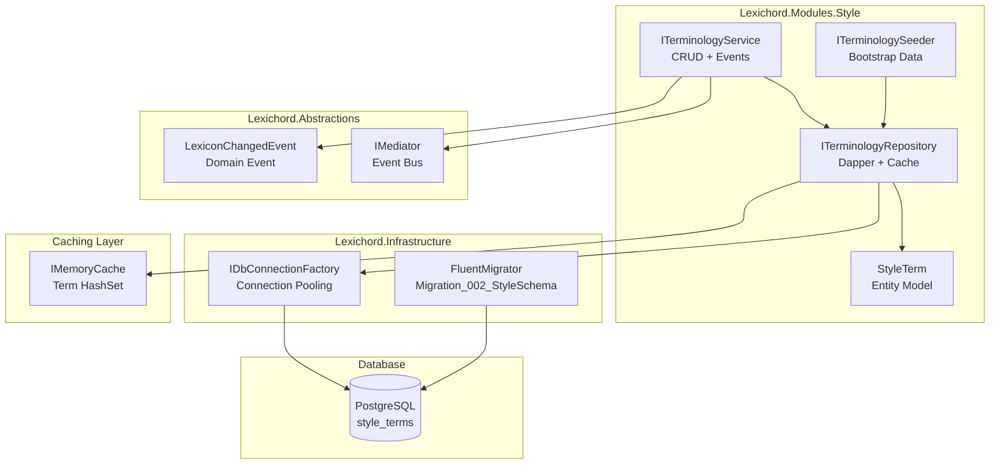
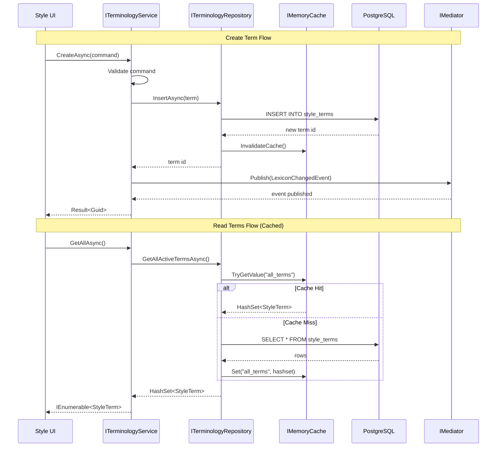

# LCS-SBD-022: Scope Breakdown - v0.2.2 Lexicon (Terminology Database)

## Document Control

| Field            | Value                                                              |
| :--------------- | :----------------------------------------------------------------- |
| **Document ID**  | LCS-SBD-022                                                        |
| **Version**      | v0.2.2                                                             |
| **Codename**     | The Lexicon (Terminology Database)                                 |
| **Status**       | Draft                                                              |
| **Last Updated** | 2026-01-26                                                         |
| **Owner**        | Lead Architect                                                     |
| **Depends On**   | v0.2.1 (Style Module), v0.0.5 (Database Layer), v0.0.7 (Event Bus) |

---

## 1. Executive Summary

### 1.1 The Vision

**v0.2.2** establishes the **Terminology Database** for Lexichord's Style Governance module. This release transforms style term management from ephemeral YAML configuration into a robust, persistent storage system capable of handling thousands of terminology rules. The Lexicon becomes the authoritative source for all style recommendations, enabling complex pattern matching, categorization, and audit trails.

### 1.2 Business Value

- **Scalability:** Persistent PostgreSQL storage handles 10,000+ terminology rules without performance degradation.
- **Performance:** IMemoryCache-backed repository ensures sub-millisecond term lookups during document analysis.
- **Bootstrapping:** Automatic seeding with Microsoft Manual of Style basics provides immediate value on first launch.
- **Extensibility:** MediatR event publication enables modules to react to terminology changes in real-time.
- **Auditability:** Database storage enables change tracking, versioning, and rollback capabilities.

### 1.3 Why Not YAML?

The original YAML-based approach (considered for style rules) has critical limitations:

| Aspect          | YAML Files                                   | PostgreSQL + Cache                  |
| :-------------- | :------------------------------------------- | :---------------------------------- |
| **Scale**       | ~100 terms before file size becomes unwieldy | 100,000+ terms with indexed queries |
| **Performance** | Full file parse on every load                | Indexed queries + in-memory cache   |
| **Concurrency** | File locking issues                          | ACID transactions                   |
| **Querying**    | Manual iteration                             | SQL with pattern matching           |
| **Versioning**  | Git history only                             | Database audit logs                 |
| **Hot Reload**  | Full file reload                             | Event-driven cache invalidation     |

### 1.4 The Success Criteria

This release succeeds when:

1. `Migration_002_StyleSchema` creates the `style_terms` table with proper indexes.
2. `ITerminologyRepository` provides cached access to all active terms via `GetAllActiveTerms()`.
3. `ITerminologySeeder` populates an empty database with ~50 Microsoft Manual of Style basics.
4. `ITerminologyService` exposes CRUD operations and publishes `LexiconChangedEvent` on modifications.

---

## 2. Dependencies on Prior Versions

| Component               | Source Version | Usage in v0.2.2                           |
| :---------------------- | :------------- | :---------------------------------------- |
| `IDbConnectionFactory`  | v0.0.5b        | Database connectivity for Dapper queries  |
| `FluentMigrator`        | v0.0.5c        | Schema versioning for `style_terms` table |
| `IGenericRepository<T>` | v0.0.5d        | Base repository pattern (extended)        |
| `IMediator`             | v0.0.7a        | Publishing `LexiconChangedEvent`          |
| `DomainEventBase`       | v0.0.7b        | Base class for domain events              |
| `IModule`               | v0.0.4a        | Style module registration                 |
| `ILogger<T>`            | v0.0.3b        | Structured logging (Serilog)              |

---

## 3. Sub-Part Specifications

### 3.1 v0.2.2a: Style Schema Migration

| Field            | Value                     |
| :--------------- | :------------------------ |
| **Sub-Part ID**  | INF-022a                  |
| **Title**        | Style Schema Migration    |
| **Module**       | `Lexichord.Modules.Style` |
| **License Tier** | Core                      |

**Goal:** Create the `style_terms` database table with proper indexing for pattern-based queries.

**Key Deliverables:**

- `Migration_002_StyleSchema.cs` with Up/Down methods
- `style_terms` table with columns: `id`, `term_pattern`, `match_case`, `recommendation`, `category`, `severity`
- Indexes for `category`, `severity`, and `term_pattern` (trigram for LIKE queries)
- Proper foreign key constraints and default values

**Table Schema:**

```sql
CREATE TABLE style_terms (
    id UUID PRIMARY KEY DEFAULT gen_random_uuid(),
    term_pattern VARCHAR(500) NOT NULL,
    match_case BOOLEAN NOT NULL DEFAULT FALSE,
    recommendation TEXT NOT NULL,
    category VARCHAR(100) NOT NULL,
    severity VARCHAR(20) NOT NULL DEFAULT 'suggestion',
    is_active BOOLEAN NOT NULL DEFAULT TRUE,
    created_at TIMESTAMPTZ NOT NULL DEFAULT NOW(),
    updated_at TIMESTAMPTZ NOT NULL DEFAULT NOW(),
    CONSTRAINT chk_severity CHECK (severity IN ('error', 'warning', 'suggestion', 'info'))
);
```

**Dependencies:**

- v0.0.5c: FluentMigrator infrastructure
- v0.0.5a: PostgreSQL running in Docker

---

### 3.2 v0.2.2b: Terminology Repository

| Field            | Value                     |
| :--------------- | :------------------------ |
| **Sub-Part ID**  | INF-022b                  |
| **Title**        | Terminology Repository    |
| **Module**       | `Lexichord.Modules.Style` |
| **License Tier** | Core                      |

**Goal:** Implement `ITerminologyRepository` with Dapper-based queries and IMemoryCache integration for high-performance term retrieval.

**Key Deliverables:**

- `ITerminologyRepository` interface in Abstractions
- `TerminologyRepository` implementation with Dapper
- `IMemoryCache` integration for `GetAllActiveTerms()`
- Cache invalidation on term modifications
- `HashSet<StyleTerm>` return type for O(1) pattern matching

**Key Interface:**

```csharp
public interface ITerminologyRepository
{
    Task<HashSet<StyleTerm>> GetAllActiveTermsAsync(CancellationToken ct = default);
    Task<StyleTerm?> GetByIdAsync(Guid id, CancellationToken ct = default);
    Task<IEnumerable<StyleTerm>> GetByCategoryAsync(string category, CancellationToken ct = default);
    Task<Guid> InsertAsync(StyleTerm term, CancellationToken ct = default);
    Task<bool> UpdateAsync(StyleTerm term, CancellationToken ct = default);
    Task<bool> DeleteAsync(Guid id, CancellationToken ct = default);
    Task<int> GetTermCountAsync(CancellationToken ct = default);
    void InvalidateCache();
}
```

**Dependencies:**

- v0.2.2a: `style_terms` table must exist
- v0.0.5b: `IDbConnectionFactory` for connections
- `Microsoft.Extensions.Caching.Memory` for IMemoryCache

---

### 3.3 v0.2.2c: Terminology Seeding Service

| Field            | Value                       |
| :--------------- | :-------------------------- |
| **Sub-Part ID**  | INF-022c                    |
| **Title**        | Terminology Seeding Service |
| **Module**       | `Lexichord.Modules.Style`   |
| **License Tier** | Core                        |

**Goal:** Implement `ITerminologySeeder` that populates an empty database with ~50 Microsoft Manual of Style basics on first startup.

**Key Deliverables:**

- `ITerminologySeeder` interface
- `TerminologySeeder` implementation with embedded seed data
- Idempotent seeding (only runs if table is empty)
- Logging of seed progress and completion
- ~50 Microsoft Manual of Style terms covering common issues

**Seed Categories:**

- **Terminology:** "click" vs "click on", "e-mail" vs "email"
- **Capitalization:** Product names, UI elements
- **Punctuation:** Serial comma, quotation marks
- **Voice:** Active vs passive voice indicators
- **Clarity:** Jargon, wordiness, ambiguity

**Key Interface:**

```csharp
public interface ITerminologySeeder
{
    Task<SeedResult> SeedIfEmptyAsync(CancellationToken ct = default);
    Task<SeedResult> ReseedAsync(bool clearExisting = false, CancellationToken ct = default);
}

public record SeedResult(int TermsSeeded, bool WasEmpty, TimeSpan Duration);
```

**Dependencies:**

- v0.2.2b: `ITerminologyRepository` for insert operations
- v0.2.2a: `style_terms` table must exist

---

### 3.4 v0.2.2d: Terminology CRUD Service

| Field            | Value                     |
| :--------------- | :------------------------ |
| **Sub-Part ID**  | INF-022d                  |
| **Title**        | Terminology CRUD Service  |
| **Module**       | `Lexichord.Modules.Style` |
| **License Tier** | Core                      |

**Goal:** Implement `ITerminologyService` for business-level CRUD operations that publish `LexiconChangedEvent` via MediatR on all modifications.

**Key Deliverables:**

- `ITerminologyService` interface
- `TerminologyService` implementation
- `LexiconChangedEvent` domain event
- Event publication on Create, Update, Delete operations
- Validation of term patterns (regex validity, uniqueness)

**Key Interface:**

```csharp
public interface ITerminologyService
{
    Task<StyleTerm?> GetByIdAsync(Guid id, CancellationToken ct = default);
    Task<IEnumerable<StyleTerm>> GetAllAsync(CancellationToken ct = default);
    Task<IEnumerable<StyleTerm>> GetByCategoryAsync(string category, CancellationToken ct = default);
    Task<Result<Guid>> CreateAsync(CreateTermCommand command, CancellationToken ct = default);
    Task<Result<bool>> UpdateAsync(UpdateTermCommand command, CancellationToken ct = default);
    Task<Result<bool>> DeleteAsync(Guid id, CancellationToken ct = default);
    Task<TermStatistics> GetStatisticsAsync(CancellationToken ct = default);
}
```

**Key Event:**

```csharp
public record LexiconChangedEvent : DomainEventBase
{
    public required LexiconChangeType ChangeType { get; init; }
    public required Guid TermId { get; init; }
    public string? TermPattern { get; init; }
    public string? Category { get; init; }
}

public enum LexiconChangeType { Created, Updated, Deleted, BulkImport }
```

**Dependencies:**

- v0.2.2b: `ITerminologyRepository` for data access
- v0.0.7a: `IMediator` for event publication
- v0.0.7b: `DomainEventBase` for event inheritance

---

## 4. Implementation Checklist

| #         | Sub-Part | Task                                             | Est. Hours   |
| :-------- | :------- | :----------------------------------------------- | :----------- |
| 1         | v0.2.2a  | Create `Migration_002_StyleSchema` class         | 2            |
| 2         | v0.2.2a  | Define `style_terms` table schema                | 1            |
| 3         | v0.2.2a  | Add indexes for category, severity, term_pattern | 1            |
| 4         | v0.2.2a  | Implement Down() for rollback                    | 0.5          |
| 5         | v0.2.2a  | Unit tests for migration                         | 1            |
| 6         | v0.2.2b  | Define `ITerminologyRepository` interface        | 1            |
| 7         | v0.2.2b  | Define `StyleTerm` entity model                  | 1            |
| 8         | v0.2.2b  | Implement `TerminologyRepository` with Dapper    | 4            |
| 9         | v0.2.2b  | Implement IMemoryCache integration               | 2            |
| 10        | v0.2.2b  | Implement cache invalidation logic               | 1            |
| 11        | v0.2.2b  | Unit tests for repository                        | 3            |
| 12        | v0.2.2c  | Define `ITerminologySeeder` interface            | 0.5          |
| 13        | v0.2.2c  | Create embedded seed data (~50 terms)            | 4            |
| 14        | v0.2.2c  | Implement `TerminologySeeder`                    | 2            |
| 15        | v0.2.2c  | Add idempotency checks                           | 1            |
| 16        | v0.2.2c  | Unit tests for seeder                            | 2            |
| 17        | v0.2.2d  | Define `ITerminologyService` interface           | 1            |
| 18        | v0.2.2d  | Define `LexiconChangedEvent`                     | 0.5          |
| 19        | v0.2.2d  | Implement `TerminologyService`                   | 4            |
| 20        | v0.2.2d  | Implement validation logic                       | 2            |
| 21        | v0.2.2d  | Wire MediatR event publication                   | 1            |
| 22        | v0.2.2d  | Unit tests for service                           | 3            |
| 23        | All      | Integration tests with PostgreSQL                | 4            |
| 24        | All      | Update module registration in DI                 | 1            |
| **Total** |          |                                                  | **43 hours** |

---

## 5. Architecture Diagram



---

## 6. Data Flow Diagram



---

## 7. Risks & Mitigations

| Risk                                  | Impact | Probability | Mitigation                                              |
| :------------------------------------ | :----- | :---------- | :------------------------------------------------------ |
| Migration fails on existing databases | High   | Low         | Test migration on sample data; implement rollback       |
| Cache invalidation race conditions    | Medium | Medium      | Use lock-based invalidation; consider distributed cache |
| Seed data conflicts with user terms   | Medium | Low         | Use unique IDs for seed data; allow user override       |
| Pattern regex injection               | High   | Low         | Validate patterns; sandbox regex execution              |
| Memory pressure from large term sets  | Medium | Low         | Limit cache size; implement LRU eviction                |
| Event handlers fail during publish    | Medium | Medium      | Use try-catch in handlers; log failures                 |

---

## 8. Success Metrics

| Metric                               | Target | Measurement                |
| :----------------------------------- | :----- | :------------------------- |
| Migration execution time             | < 5s   | Timer around migration run |
| GetAllActiveTerms cache hit rate     | > 95%  | Cache statistics logging   |
| GetAllActiveTerms latency (cached)   | < 1ms  | Stopwatch timing           |
| GetAllActiveTerms latency (uncached) | < 50ms | Stopwatch timing           |
| Seed completion time (~50 terms)     | < 2s   | SeedResult.Duration        |
| Event publication latency            | < 10ms | MediatR timing             |

---

## 9. What This Enables

After v0.2.2, Lexichord will support:

- **v0.2.3:** Style Analysis Engine can query terms for document scanning
- **v0.2.4:** Style Rules Editor UI can manage terminology via ITerminologyService
- **v0.2.5:** Import/Export functionality for term libraries
- **v0.3.x:** Custom style profiles (organization-specific terminology)
- **Future:** AI-assisted term suggestion based on document corpus

---

## 10. Verification Commands

```bash
# 1. Run migration
dotnet run --project src/Lexichord.Host -- --migrate
# Expected: Migration_002_StyleSchema applied successfully

# 2. Verify table exists
docker exec -it lexichord-postgres psql -U lexichord -c "\d style_terms"
# Expected: Table schema displayed

# 3. Run seeder
dotnet run --project src/Lexichord.Host -- --seed-terms
# Expected: "Seeded 50 terms in Xms"

# 4. Verify seed data
docker exec -it lexichord-postgres psql -U lexichord -c "SELECT COUNT(*) FROM style_terms"
# Expected: 50

# 5. Run unit tests
dotnet test --filter "Category=Unit&FullyQualifiedName~Terminology"

# 6. Run integration tests
dotnet test --filter "Category=Integration&FullyQualifiedName~Terminology"
```

---

## 11. Deliverable Checklist

| #   | Deliverable                                                | Status |
| :-- | :--------------------------------------------------------- | :----- |
| 1   | `Migration_002_StyleSchema.cs` creates `style_terms` table | [ ]    |
| 2   | Migration includes proper indexes for performance          | [ ]    |
| 3   | `StyleTerm` entity defined with all properties             | [ ]    |
| 4   | `ITerminologyRepository` interface defined                 | [ ]    |
| 5   | `TerminologyRepository` implements Dapper queries          | [ ]    |
| 6   | `IMemoryCache` integration caches `GetAllActiveTerms()`    | [ ]    |
| 7   | Cache invalidation works on modifications                  | [ ]    |
| 8   | `ITerminologySeeder` interface defined                     | [ ]    |
| 9   | `TerminologySeeder` seeds ~50 MMOS terms                   | [ ]    |
| 10  | Seeding is idempotent (only runs if empty)                 | [ ]    |
| 11  | `ITerminologyService` interface defined                    | [ ]    |
| 12  | `TerminologyService` implements CRUD operations            | [ ]    |
| 13  | `LexiconChangedEvent` published on modifications           | [ ]    |
| 14  | Pattern validation prevents invalid regex                  | [ ]    |
| 15  | Unit tests for repository pass                             | [ ]    |
| 16  | Unit tests for seeder pass                                 | [ ]    |
| 17  | Unit tests for service pass                                | [ ]    |
| 18  | Integration tests with PostgreSQL pass                     | [ ]    |
| 19  | DI registration complete in Style module                   | [ ]    |
| 20  | Documentation updated                                      | [ ]    |
