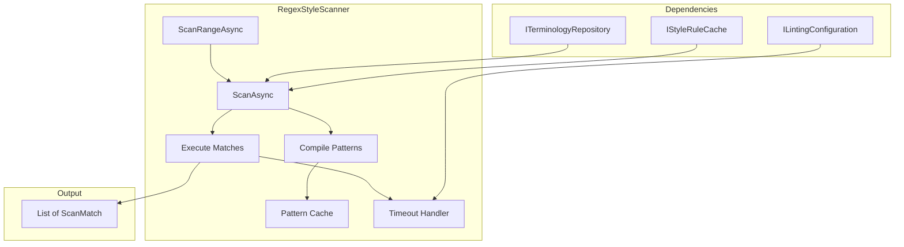
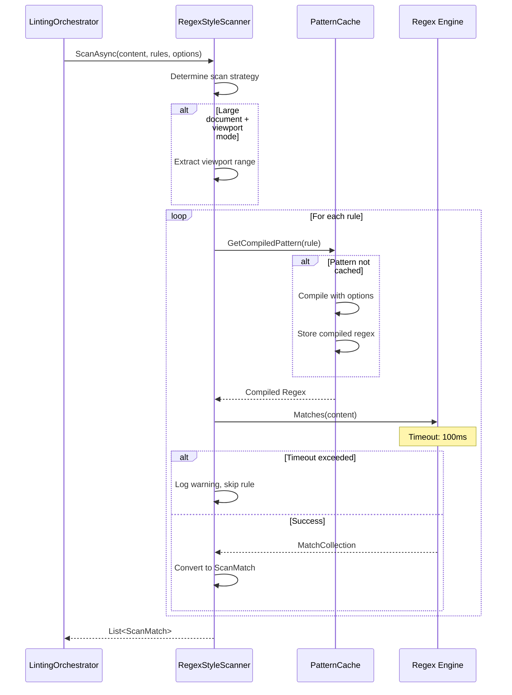
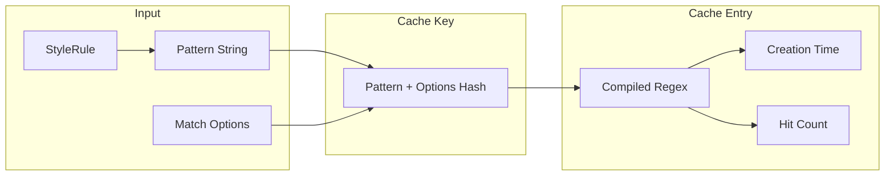

# LCS-DES-023c: The Scanner (Regex)

## 1. Metadata & Categorization

| Field              | Value                     | Description                               |
| :----------------- | :------------------------ | :---------------------------------------- |
| **Document ID**    | LCS-DES-023c              | Design Specification v0.2.3c              |
| **Feature ID**     | INF-023c                  | Sub-part C of Linter Engine               |
| **Feature Name**   | The Scanner (Regex)       | Pattern matching engine with optimization |
| **Target Version** | `v0.2.3c`                 | Third sub-part of v0.2.3                  |
| **Module Scope**   | `Lexichord.Modules.Style` | Style governance module                   |
| **Swimlane**       | `Product`                 | Core User-Facing Feature                  |
| **License Tier**   | `Core`                    | Foundation (Available in Free tier)       |
| **Author**         | System Architect          |                                           |
| **Status**         | **Draft**                 | Pending implementation                    |
| **Last Updated**   | 2026-01-27                |                                           |

---

## 2. Executive Summary

### 2.1 The Requirement

Lexichord needs a **high-performance regex scanning engine** that:

- Iterates through active StyleRules and Terms from the database.
- Executes `Regex.Matches()` against document content efficiently.
- Caches compiled regex patterns to avoid repeated compilation.
- Implements timeout protection against ReDoS (regex denial of service).
- Optimizes for large documents via viewport-only or paragraph scanning.

### 2.2 The Proposed Solution

We **SHALL** implement a regex scanner with:

1. **IStyleScanner Interface** — Contract for scanning operations.
2. **RegexStyleScanner** — Implementation with compiled pattern caching.
3. **Timeout Protection** — Per-pattern timeout to prevent ReDoS.
4. **Viewport Optimization** — Scan only visible range for large documents.
5. **Paragraph Scanning** — Incremental scan of modified paragraphs.

---

## 3. Architecture

### 3.1 Scanner Component Structure



### 3.2 Scan Execution Flow



### 3.3 Pattern Cache Strategy



---

## 4. Decision Tree: Scan Strategy

```text
START: "ScanAsync called with content and rules"
|
+-- Validate inputs
|   +-- Content null/empty? -> Return empty list
|   +-- Rules null/empty? -> Return empty list
|
+-- Determine scan strategy
|   +-- ContentLength > LargeDocumentThreshold?
|   |   +-- YES -> Is viewport range provided?
|   |   |   +-- YES -> Scan viewport only
|   |   |   +-- NO -> Scan full (log warning)
|   |   +-- NO -> Scan full content
|
+-- Prepare rules
|   +-- Filter to enabled rules only
|   +-- Sort by priority (if defined)
|
+-- Execute scan loop
|   +-- For each rule:
|       +-- Get compiled pattern from cache
|       |   +-- Cache miss? -> Compile and cache
|       +-- Execute Regex.Matches with timeout
|       |   +-- Timeout? -> Skip rule, log warning
|       |   +-- Success? -> Collect matches
|       +-- Convert matches to ScanMatch objects
|       +-- Check MaxMatches limit
|           +-- Exceeded? -> Stop collecting, continue to next rule
|
+-- Return aggregated matches
|
END

---

OPTIMIZATION DECISION: Viewport vs Full Scan
|
+-- Document size analysis:
|   +-- <1000 lines: Full scan (fast enough)
|   +-- 1000-5000 lines: Full scan with chunking
|   +-- >5000 lines: Viewport-only default
|   +-- >50000 lines: Force viewport-only
|
+-- Viewport scanning:
|   +-- Get visible line range from Editor
|   +-- Expand by 50 lines each direction (context)
|   +-- Scan only that text range
|   +-- Adjust match offsets to document coordinates
```

---

## 5. Data Contracts

### 5.1 IStyleScanner Interface

```csharp
namespace Lexichord.Abstractions.Contracts;

/// <summary>
/// Scans document content for style rule violations.
/// </summary>
/// <remarks>
/// LOGIC: The scanner is the core pattern matching engine.
/// It is stateless except for the compiled pattern cache.
///
/// Key characteristics:
/// - Caches compiled regex patterns for performance
/// - Supports timeout per pattern (ReDoS protection)
/// - Supports full-document and range-based scanning
/// - Thread-safe (cache uses ConcurrentDictionary)
/// </remarks>
public interface IStyleScanner
{
    /// <summary>
    /// Scans content against a set of rules.
    /// </summary>
    /// <param name="content">The document content to scan.</param>
    /// <param name="rules">The rules to check against.</param>
    /// <param name="options">Scan configuration options.</param>
    /// <param name="cancellationToken">Cancellation token.</param>
    /// <returns>List of scan matches.</returns>
    /// <remarks>
    /// LOGIC: Main entry point for scanning. Iterates through rules,
    /// compiles patterns (or uses cache), and executes matches.
    ///
    /// Performance considerations:
    /// - Patterns compiled once and cached
    /// - Each pattern has individual timeout
    /// - Results limited by MaxMatches option
    /// </remarks>
    Task<IReadOnlyList<ScanMatch>> ScanAsync(
        string content,
        IEnumerable<StyleRule> rules,
        ScanOptions options,
        CancellationToken cancellationToken = default);

    /// <summary>
    /// Scans a specific range within content.
    /// </summary>
    /// <param name="content">The full document content.</param>
    /// <param name="startOffset">Start offset of range to scan.</param>
    /// <param name="endOffset">End offset of range to scan.</param>
    /// <param name="rules">The rules to check against.</param>
    /// <param name="cancellationToken">Cancellation token.</param>
    /// <returns>List of scan matches within range.</returns>
    /// <remarks>
    /// LOGIC: Optimized for viewport-only or incremental scanning.
    /// Match offsets are returned relative to the FULL document,
    /// not the scanned range.
    /// </remarks>
    Task<IReadOnlyList<ScanMatch>> ScanRangeAsync(
        string content,
        int startOffset,
        int endOffset,
        IEnumerable<StyleRule> rules,
        CancellationToken cancellationToken = default);

    /// <summary>
    /// Warms up the pattern cache with rules.
    /// </summary>
    /// <param name="rules">Rules to pre-compile.</param>
    /// <param name="cancellationToken">Cancellation token.</param>
    /// <remarks>
    /// LOGIC: Called at startup to pre-compile patterns.
    /// Improves first-scan performance.
    /// </remarks>
    Task WarmupCacheAsync(
        IEnumerable<StyleRule>? rules = null,
        CancellationToken cancellationToken = default);

    /// <summary>
    /// Clears the pattern cache.
    /// </summary>
    /// <remarks>
    /// LOGIC: Called when rules change to invalidate stale patterns.
    /// </remarks>
    void ClearCache();

    /// <summary>
    /// Gets cache statistics.
    /// </summary>
    PatternCacheStats GetCacheStats();
}

/// <summary>
/// Statistics about the pattern cache.
/// </summary>
/// <param name="PatternCount">Number of cached patterns.</param>
/// <param name="TotalHits">Total cache hits.</param>
/// <param name="TotalMisses">Total cache misses.</param>
/// <param name="TotalCompilationTime">Total time spent compiling patterns.</param>
public record PatternCacheStats(
    int PatternCount,
    long TotalHits,
    long TotalMisses,
    TimeSpan TotalCompilationTime
)
{
    /// <summary>
    /// Cache hit rate (0.0 - 1.0).
    /// </summary>
    public double HitRate => TotalHits + TotalMisses == 0
        ? 0
        : (double)TotalHits / (TotalHits + TotalMisses);
}
```

### 5.2 ScanOptions Record

```csharp
namespace Lexichord.Abstractions.Contracts;

/// <summary>
/// Options for scan operations.
/// </summary>
/// <remarks>
/// LOGIC: Configures how the scanner behaves for a specific operation.
/// </remarks>
public record ScanOptions
{
    /// <summary>
    /// Maximum time for single regex pattern execution.
    /// </summary>
    /// <remarks>
    /// LOGIC: Prevents ReDoS attacks. Each pattern must complete
    /// within this time or it's skipped with a warning.
    /// </remarks>
    public TimeSpan RegexTimeout { get; init; } = TimeSpan.FromMilliseconds(100);

    /// <summary>
    /// Maximum matches to return per rule.
    /// </summary>
    /// <remarks>
    /// LOGIC: Prevents memory exhaustion from pathological content.
    /// After this limit, remaining matches for the rule are skipped.
    /// </remarks>
    public int MaxMatchesPerRule { get; init; } = 100;

    /// <summary>
    /// Maximum total matches to return.
    /// </summary>
    /// <remarks>
    /// LOGIC: Overall limit across all rules.
    /// </remarks>
    public int MaxTotalMatches { get; init; } = 1000;

    /// <summary>
    /// Whether to include disabled rules.
    /// </summary>
    public bool IncludeDisabledRules { get; init; } = false;

    /// <summary>
    /// Whether to run scans in parallel.
    /// </summary>
    /// <remarks>
    /// LOGIC: Can improve performance for many rules, but uses more CPU.
    /// Default false for predictable behavior.
    /// </remarks>
    public bool ParallelScan { get; init; } = false;

    /// <summary>
    /// Maximum degree of parallelism for parallel scans.
    /// </summary>
    public int MaxParallelism { get; init; } = 4;

    /// <summary>
    /// Default scan options.
    /// </summary>
    public static ScanOptions Default { get; } = new();
}
```

### 5.3 ScanMatch Record

```csharp
namespace Lexichord.Abstractions.Contracts;

/// <summary>
/// Represents a pattern match found during scanning.
/// </summary>
/// <remarks>
/// LOGIC: Raw match data from the scanner. Transformed into
/// StyleViolation by the ViolationAggregator (v0.2.3d).
/// </remarks>
/// <param name="RuleId">The ID of the matched rule.</param>
/// <param name="StartOffset">Start position in document (0-based).</param>
/// <param name="Length">Length of matched text.</param>
/// <param name="MatchedText">The actual text that matched.</param>
/// <param name="Rule">Reference to the matched rule.</param>
/// <param name="CaptureGroups">Named capture groups from regex (if any).</param>
public record ScanMatch(
    string RuleId,
    int StartOffset,
    int Length,
    string MatchedText,
    StyleRule Rule,
    IReadOnlyDictionary<string, string>? CaptureGroups = null
)
{
    /// <summary>
    /// Gets the end offset of the match.
    /// </summary>
    public int EndOffset => StartOffset + Length;

    /// <summary>
    /// Creates a ScanMatch with adjusted offset.
    /// </summary>
    /// <remarks>
    /// LOGIC: Used when scanning a range to convert local offsets
    /// to document offsets.
    /// </remarks>
    public ScanMatch WithOffsetAdjustment(int adjustment) =>
        this with { StartOffset = StartOffset + adjustment };
}
```

### 5.4 StyleRule Reference (from v0.2.1)

```csharp
namespace Lexichord.Abstractions.Contracts;

/// <summary>
/// Defines a style rule for document analysis.
/// </summary>
/// <remarks>
/// LOGIC: Defined in v0.2.1b, referenced here for scanner usage.
/// </remarks>
/// <param name="Id">Unique identifier for the rule.</param>
/// <param name="Name">Human-readable rule name.</param>
/// <param name="Pattern">Regex pattern to match.</param>
/// <param name="Message">Message to show when violated.</param>
/// <param name="Suggestion">Suggested replacement text.</param>
/// <param name="Severity">Violation severity level.</param>
/// <param name="Category">Rule category (Terminology, Formatting, Syntax).</param>
/// <param name="IsEnabled">Whether the rule is active.</param>
/// <param name="MatchCase">Whether pattern matching is case-sensitive.</param>
public record StyleRule(
    string Id,
    string Name,
    string Pattern,
    string Message,
    string? Suggestion,
    ViolationSeverity Severity,
    RuleCategory Category,
    bool IsEnabled = true,
    bool MatchCase = false
)
{
    /// <summary>
    /// Gets the regex options based on rule settings.
    /// </summary>
    public RegexOptions GetRegexOptions()
    {
        var options = RegexOptions.Compiled | RegexOptions.Multiline;
        if (!MatchCase)
        {
            options |= RegexOptions.IgnoreCase;
        }
        return options;
    }
}
```

### 5.5 RegexStyleScanner Implementation

```csharp
using System.Collections.Concurrent;
using System.Diagnostics;
using System.Text.RegularExpressions;
using Lexichord.Abstractions.Contracts;
using Microsoft.Extensions.Logging;

namespace Lexichord.Modules.Style.Services;

/// <summary>
/// Regex-based implementation of the style scanner.
/// </summary>
/// <remarks>
/// LOGIC: Core scanning engine that executes regex patterns against content.
///
/// Performance optimizations:
/// - Compiled regex patterns cached in ConcurrentDictionary
/// - Per-pattern timeout prevents ReDoS
/// - Optional parallel scanning for many rules
/// - Range scanning for large documents
///
/// Thread Safety:
/// - Pattern cache is ConcurrentDictionary
/// - No shared mutable state during scans
/// - Safe for concurrent calls from multiple documents
/// </remarks>
public sealed class RegexStyleScanner : IStyleScanner
{
    private readonly IStyleRuleCache _ruleCache;
    private readonly ILintingConfiguration _config;
    private readonly ILogger<RegexStyleScanner> _logger;

    // LOGIC: Cache compiled patterns keyed by (pattern + options hash)
    private readonly ConcurrentDictionary<string, CachedPattern> _patternCache = new();

    // LOGIC: Statistics tracking
    private long _cacheHits;
    private long _cacheMisses;
    private TimeSpan _totalCompilationTime = TimeSpan.Zero;

    public RegexStyleScanner(
        IStyleRuleCache ruleCache,
        ILintingConfiguration config,
        ILogger<RegexStyleScanner> logger)
    {
        _ruleCache = ruleCache;
        _config = config;
        _logger = logger;
    }

    /// <inheritdoc/>
    public async Task<IReadOnlyList<ScanMatch>> ScanAsync(
        string content,
        IEnumerable<StyleRule> rules,
        ScanOptions options,
        CancellationToken cancellationToken = default)
    {
        // LOGIC: Validate inputs
        if (string.IsNullOrEmpty(content))
        {
            _logger.LogDebug("Empty content, returning no matches");
            return Array.Empty<ScanMatch>();
        }

        var ruleList = rules.ToList();
        if (ruleList.Count == 0)
        {
            _logger.LogDebug("No rules to scan against");
            return Array.Empty<ScanMatch>();
        }

        // LOGIC: Filter to enabled rules unless explicitly including disabled
        var activeRules = options.IncludeDisabledRules
            ? ruleList
            : ruleList.Where(r => r.IsEnabled).ToList();

        _logger.LogDebug(
            "Scanning {ContentLength} chars against {RuleCount} rules",
            content.Length, activeRules.Count);

        var stopwatch = Stopwatch.StartNew();
        var allMatches = new List<ScanMatch>();

        // LOGIC: Execute scans (sequential or parallel)
        if (options.ParallelScan && activeRules.Count > 4)
        {
            allMatches = await ScanParallelAsync(
                content, activeRules, options, cancellationToken);
        }
        else
        {
            allMatches = await ScanSequentialAsync(
                content, activeRules, options, cancellationToken);
        }

        stopwatch.Stop();

        _logger.LogDebug(
            "Scan completed: {MatchCount} matches in {Duration}ms",
            allMatches.Count, stopwatch.ElapsedMilliseconds);

        return allMatches;
    }

    /// <inheritdoc/>
    public async Task<IReadOnlyList<ScanMatch>> ScanRangeAsync(
        string content,
        int startOffset,
        int endOffset,
        IEnumerable<StyleRule> rules,
        CancellationToken cancellationToken = default)
    {
        // LOGIC: Validate range
        if (startOffset < 0 || endOffset > content.Length || startOffset >= endOffset)
        {
            _logger.LogWarning(
                "Invalid range [{Start}, {End}] for content length {Length}",
                startOffset, endOffset, content.Length);
            return Array.Empty<ScanMatch>();
        }

        // LOGIC: Extract the range
        var rangeContent = content.Substring(startOffset, endOffset - startOffset);

        // LOGIC: Scan the range
        var rangeMatches = await ScanAsync(
            rangeContent,
            rules,
            ScanOptions.Default,
            cancellationToken);

        // LOGIC: Adjust offsets to document coordinates
        return rangeMatches
            .Select(m => m.WithOffsetAdjustment(startOffset))
            .ToList();
    }

    /// <inheritdoc/>
    public async Task WarmupCacheAsync(
        IEnumerable<StyleRule>? rules = null,
        CancellationToken cancellationToken = default)
    {
        var rulesToWarm = rules ?? await _ruleCache.GetActiveRulesAsync(cancellationToken);
        var ruleList = rulesToWarm.ToList();

        _logger.LogInformation("Warming pattern cache with {Count} rules", ruleList.Count);

        foreach (var rule in ruleList)
        {
            if (cancellationToken.IsCancellationRequested)
                break;

            try
            {
                GetOrCompilePattern(rule);
            }
            catch (Exception ex)
            {
                _logger.LogWarning(ex, "Failed to compile pattern for rule {RuleId}", rule.Id);
            }
        }

        _logger.LogInformation(
            "Pattern cache warmed: {Count} patterns compiled",
            _patternCache.Count);
    }

    /// <inheritdoc/>
    public void ClearCache()
    {
        var count = _patternCache.Count;
        _patternCache.Clear();
        _cacheHits = 0;
        _cacheMisses = 0;
        _totalCompilationTime = TimeSpan.Zero;

        _logger.LogInformation("Pattern cache cleared ({Count} patterns removed)", count);
    }

    /// <inheritdoc/>
    public PatternCacheStats GetCacheStats() => new(
        PatternCount: _patternCache.Count,
        TotalHits: _cacheHits,
        TotalMisses: _cacheMisses,
        TotalCompilationTime: _totalCompilationTime
    );

    #region Private Methods

    private async Task<List<ScanMatch>> ScanSequentialAsync(
        string content,
        List<StyleRule> rules,
        ScanOptions options,
        CancellationToken cancellationToken)
    {
        var allMatches = new List<ScanMatch>();

        foreach (var rule in rules)
        {
            if (cancellationToken.IsCancellationRequested)
                break;

            if (allMatches.Count >= options.MaxTotalMatches)
            {
                _logger.LogDebug("Max total matches reached, stopping scan");
                break;
            }

            var ruleMatches = await ScanWithRuleAsync(
                content, rule, options, cancellationToken);

            allMatches.AddRange(ruleMatches);
        }

        return allMatches;
    }

    private async Task<List<ScanMatch>> ScanParallelAsync(
        string content,
        List<StyleRule> rules,
        ScanOptions options,
        CancellationToken cancellationToken)
    {
        var parallelOptions = new ParallelOptions
        {
            MaxDegreeOfParallelism = options.MaxParallelism,
            CancellationToken = cancellationToken
        };

        var matchBags = new ConcurrentBag<ScanMatch>();

        await Parallel.ForEachAsync(
            rules,
            parallelOptions,
            async (rule, ct) =>
            {
                var ruleMatches = await ScanWithRuleAsync(content, rule, options, ct);
                foreach (var match in ruleMatches)
                {
                    matchBags.Add(match);
                }
            });

        return matchBags
            .Take(options.MaxTotalMatches)
            .ToList();
    }

    private Task<List<ScanMatch>> ScanWithRuleAsync(
        string content,
        StyleRule rule,
        ScanOptions options,
        CancellationToken cancellationToken)
    {
        return Task.Run(() =>
        {
            var matches = new List<ScanMatch>();

            try
            {
                var regex = GetOrCompilePattern(rule);

                // LOGIC: Execute with timeout
                var matchCollection = ExecuteWithTimeout(
                    regex,
                    content,
                    options.RegexTimeout);

                if (matchCollection is null)
                {
                    _logger.LogWarning(
                        "Regex timeout for rule {RuleId} ({Timeout}ms)",
                        rule.Id, options.RegexTimeout.TotalMilliseconds);
                    return matches;
                }

                // LOGIC: Convert to ScanMatch
                var matchCount = 0;
                foreach (Match match in matchCollection)
                {
                    if (cancellationToken.IsCancellationRequested)
                        break;

                    if (matchCount >= options.MaxMatchesPerRule)
                    {
                        _logger.LogDebug(
                            "Max matches per rule reached for {RuleId}",
                            rule.Id);
                        break;
                    }

                    matches.Add(CreateScanMatch(match, rule));
                    matchCount++;
                }

                if (matchCount > 0)
                {
                    _logger.LogDebug(
                        "Rule {RuleId} found {MatchCount} matches",
                        rule.Id, matchCount);
                }
            }
            catch (RegexMatchTimeoutException)
            {
                _logger.LogWarning(
                    "Regex match timeout for rule {RuleId}",
                    rule.Id);
            }
            catch (Exception ex)
            {
                _logger.LogError(
                    ex,
                    "Error scanning with rule {RuleId}",
                    rule.Id);
            }

            return matches;
        }, cancellationToken);
    }

    private Regex GetOrCompilePattern(StyleRule rule)
    {
        var cacheKey = GetCacheKey(rule);

        if (_patternCache.TryGetValue(cacheKey, out var cached))
        {
            Interlocked.Increment(ref _cacheHits);
            cached.IncrementHits();
            return cached.Regex;
        }

        Interlocked.Increment(ref _cacheMisses);

        var stopwatch = Stopwatch.StartNew();

        // LOGIC: Compile with options and timeout capability
        var options = rule.GetRegexOptions();
        var regex = new Regex(
            rule.Pattern,
            options,
            TimeSpan.FromMilliseconds(100)); // Per-match timeout

        stopwatch.Stop();

        var newCached = new CachedPattern(regex, stopwatch.Elapsed);
        _patternCache.TryAdd(cacheKey, newCached);

        lock (this)
        {
            _totalCompilationTime += stopwatch.Elapsed;
        }

        _logger.LogDebug(
            "Compiled pattern for rule {RuleId} in {Duration}ms",
            rule.Id, stopwatch.ElapsedMilliseconds);

        return regex;
    }

    private static MatchCollection? ExecuteWithTimeout(
        Regex regex,
        string content,
        TimeSpan timeout)
    {
        // LOGIC: The Regex constructor timeout applies per-match,
        // not total execution. We use a separate timeout for the
        // entire Matches() call.

        MatchCollection? result = null;
        var completed = false;

        var thread = new Thread(() =>
        {
            try
            {
                result = regex.Matches(content);
                completed = true;
            }
            catch (RegexMatchTimeoutException)
            {
                // Expected if pattern times out
            }
        });

        thread.Start();

        if (!thread.Join(timeout))
        {
            // LOGIC: Thread didn't complete in time
            // Note: We can't safely abort the thread in .NET Core
            // The timeout in Regex constructor is the real protection
            return null;
        }

        return completed ? result : null;
    }

    private static ScanMatch CreateScanMatch(Match match, StyleRule rule)
    {
        // LOGIC: Extract named capture groups if present
        Dictionary<string, string>? captures = null;

        if (match.Groups.Count > 1)
        {
            captures = new Dictionary<string, string>();
            foreach (Group group in match.Groups)
            {
                if (!string.IsNullOrEmpty(group.Name) &&
                    !int.TryParse(group.Name, out _)) // Skip numbered groups
                {
                    captures[group.Name] = group.Value;
                }
            }
        }

        return new ScanMatch(
            RuleId: rule.Id,
            StartOffset: match.Index,
            Length: match.Length,
            MatchedText: match.Value,
            Rule: rule,
            CaptureGroups: captures?.Count > 0 ? captures : null
        );
    }

    private static string GetCacheKey(StyleRule rule) =>
        $"{rule.Pattern}|{rule.MatchCase}";

    #endregion

    /// <summary>
    /// Cached pattern entry.
    /// </summary>
    private sealed class CachedPattern
    {
        public Regex Regex { get; }
        public TimeSpan CompilationTime { get; }
        public DateTimeOffset CreatedAt { get; }
        private long _hits;

        public CachedPattern(Regex regex, TimeSpan compilationTime)
        {
            Regex = regex;
            CompilationTime = compilationTime;
            CreatedAt = DateTimeOffset.UtcNow;
        }

        public long Hits => _hits;
        public void IncrementHits() => Interlocked.Increment(ref _hits);
    }
}
```

---

## 6. Implementation Logic

### 6.1 ReDoS Prevention Strategy

```csharp
/// <summary>
/// Validates regex patterns before compilation.
/// </summary>
/// <remarks>
/// LOGIC: Detects potentially dangerous regex patterns that could
/// cause exponential backtracking (ReDoS).
///
/// Dangerous patterns:
/// - Nested quantifiers: (a+)+
/// - Overlapping alternations: (a|a)*
/// - Catastrophic backtracking: .*.*
/// </remarks>
public static class RegexValidator
{
    private static readonly Regex NestedQuantifiers = new(
        @"\([^)]*[+*]\)[+*]",
        RegexOptions.Compiled);

    private static readonly Regex RepeatedWildcards = new(
        @"\.\*\.\*",
        RegexOptions.Compiled);

    /// <summary>
    /// Validates a pattern is safe to execute.
    /// </summary>
    /// <param name="pattern">The regex pattern.</param>
    /// <returns>Validation result.</returns>
    public static PatternValidationResult Validate(string pattern)
    {
        var warnings = new List<string>();

        // LOGIC: Check for nested quantifiers
        if (NestedQuantifiers.IsMatch(pattern))
        {
            warnings.Add("Pattern contains nested quantifiers which may cause performance issues");
        }

        // LOGIC: Check for repeated wildcards
        if (RepeatedWildcards.IsMatch(pattern))
        {
            warnings.Add("Pattern contains repeated wildcards (.*.*) which may be slow");
        }

        // LOGIC: Check pattern length
        if (pattern.Length > 500)
        {
            warnings.Add("Pattern is very long (>500 chars) which may impact performance");
        }

        // LOGIC: Try to compile to verify syntax
        try
        {
            var _ = new Regex(pattern, RegexOptions.None, TimeSpan.FromMilliseconds(10));
        }
        catch (ArgumentException ex)
        {
            return PatternValidationResult.Invalid(ex.Message);
        }

        return warnings.Count > 0
            ? PatternValidationResult.ValidWithWarnings(warnings)
            : PatternValidationResult.Valid();
    }
}

public record PatternValidationResult
{
    public bool IsValid { get; init; }
    public string? Error { get; init; }
    public IReadOnlyList<string> Warnings { get; init; } = Array.Empty<string>();

    public static PatternValidationResult Valid() => new() { IsValid = true };

    public static PatternValidationResult ValidWithWarnings(IEnumerable<string> warnings) =>
        new() { IsValid = true, Warnings = warnings.ToList() };

    public static PatternValidationResult Invalid(string error) =>
        new() { IsValid = false, Error = error };
}
```

### 6.2 Viewport Scanning Optimization

```csharp
/// <summary>
/// Calculates the optimal scan range for large documents.
/// </summary>
/// <remarks>
/// LOGIC: For large documents, we only scan the visible viewport
/// plus a buffer for context. This dramatically improves performance.
/// </remarks>
public static class ViewportCalculator
{
    private const int BufferLines = 50;

    /// <summary>
    /// Gets the scan range for viewport-based scanning.
    /// </summary>
    /// <param name="content">Full document content.</param>
    /// <param name="visibleStartLine">First visible line (1-based).</param>
    /// <param name="visibleEndLine">Last visible line (1-based).</param>
    /// <returns>Start and end offsets to scan.</returns>
    public static (int Start, int End) GetScanRange(
        string content,
        int visibleStartLine,
        int visibleEndLine)
    {
        // LOGIC: Expand viewport by buffer for context
        var scanStartLine = Math.Max(1, visibleStartLine - BufferLines);
        var scanEndLine = visibleEndLine + BufferLines;

        var lines = content.Split('\n');
        var lineCount = lines.Length;

        scanEndLine = Math.Min(scanEndLine, lineCount);

        // LOGIC: Calculate offsets
        var startOffset = 0;
        for (int i = 0; i < scanStartLine - 1 && i < lineCount; i++)
        {
            startOffset += lines[i].Length + 1; // +1 for newline
        }

        var endOffset = 0;
        for (int i = 0; i < scanEndLine && i < lineCount; i++)
        {
            endOffset += lines[i].Length + 1;
        }
        endOffset = Math.Min(endOffset, content.Length);

        return (startOffset, endOffset);
    }
}
```

### 6.3 Paragraph-Based Incremental Scanning

```csharp
/// <summary>
/// Identifies modified paragraphs for incremental scanning.
/// </summary>
/// <remarks>
/// LOGIC: Instead of scanning the whole document, we identify
/// which paragraphs changed and only scan those.
/// </remarks>
public static class ParagraphDetector
{
    /// <summary>
    /// Gets the paragraph range containing an offset.
    /// </summary>
    /// <param name="content">Document content.</param>
    /// <param name="offset">The change offset.</param>
    /// <returns>Start and end offsets of the paragraph.</returns>
    public static (int Start, int End) GetParagraphRange(string content, int offset)
    {
        if (string.IsNullOrEmpty(content))
            return (0, 0);

        // LOGIC: Find paragraph start (previous double newline or start)
        var start = offset;
        while (start > 0)
        {
            if (start >= 2 && content[start - 1] == '\n' && content[start - 2] == '\n')
            {
                break;
            }
            start--;
        }

        // LOGIC: Find paragraph end (next double newline or end)
        var end = offset;
        while (end < content.Length - 1)
        {
            if (content[end] == '\n' && end + 1 < content.Length && content[end + 1] == '\n')
            {
                end += 2; // Include the double newline
                break;
            }
            end++;
        }
        if (end >= content.Length - 1)
        {
            end = content.Length;
        }

        return (start, end);
    }
}
```

---

## 7. Use Cases

### UC-01: Full Document Scan

**Preconditions:**

- Small document (<5000 lines).
- All rules are enabled.

**Flow:**

1. LintingOrchestrator calls ScanAsync with full content.
2. Scanner iterates through all enabled rules.
3. For each rule, compiled pattern retrieved from cache.
4. Regex.Matches executed with timeout.
5. Matches converted to ScanMatch objects.
6. All matches returned to orchestrator.

**Postconditions:**

- All violations in document detected.
- Cache populated for next scan.

---

### UC-02: Viewport-Only Scan

**Preconditions:**

- Large document (>5000 lines).
- User viewing lines 1000-1050.

**Flow:**

1. Editor provides visible range to orchestrator.
2. ViewportCalculator expands to lines 950-1100.
3. Orchestrator calls ScanRangeAsync with range.
4. Scanner extracts substring for range.
5. Scan executes on subset of content.
6. Match offsets adjusted to document coordinates.
7. Results returned.

**Postconditions:**

- Only visible violations detected.
- Scan completes in <100ms.

---

### UC-03: Pattern Timeout

**Preconditions:**

- Malicious or poorly-written regex pattern.
- Content triggers catastrophic backtracking.

**Flow:**

1. Scanner attempts to execute pattern.
2. 100ms timeout triggers.
3. RegexMatchTimeoutException caught.
4. Warning logged with rule ID.
5. Rule skipped, scan continues with next rule.
6. Partial results returned.

**Postconditions:**

- No hang or crash.
- Timeout logged for investigation.
- Other rules still evaluated.

---

## 8. Observability & Logging

| Level       | Context           | Message Template                                             |
| :---------- | :---------------- | :----------------------------------------------------------- |
| Debug       | RegexStyleScanner | `Empty content, returning no matches`                        |
| Debug       | RegexStyleScanner | `No rules to scan against`                                   |
| Debug       | RegexStyleScanner | `Scanning {ContentLength} chars against {RuleCount} rules`   |
| Debug       | RegexStyleScanner | `Scan completed: {MatchCount} matches in {Duration}ms`       |
| Debug       | RegexStyleScanner | `Rule {RuleId} found {MatchCount} matches`                   |
| Debug       | RegexStyleScanner | `Max matches per rule reached for {RuleId}`                  |
| Debug       | RegexStyleScanner | `Max total matches reached, stopping scan`                   |
| Debug       | RegexStyleScanner | `Compiled pattern for rule {RuleId} in {Duration}ms`         |
| Warning     | RegexStyleScanner | `Regex timeout for rule {RuleId} ({Timeout}ms)`              |
| Warning     | RegexStyleScanner | `Regex match timeout for rule {RuleId}`                      |
| Warning     | RegexStyleScanner | `Invalid range [{Start}, {End}] for content length {Length}` |
| Error       | RegexStyleScanner | `Error scanning with rule {RuleId}`                          |
| Information | RegexStyleScanner | `Warming pattern cache with {Count} rules`                   |
| Information | RegexStyleScanner | `Pattern cache warmed: {Count} patterns compiled`            |
| Information | RegexStyleScanner | `Pattern cache cleared ({Count} patterns removed)`           |

### 8.1 Metrics

| Metric                        | Type      | Description               |
| :---------------------------- | :-------- | :------------------------ |
| `scanner.scan.duration_ms`    | Histogram | Time to complete scan     |
| `scanner.scan.matches`        | Counter   | Total matches found       |
| `scanner.scan.rules_checked`  | Gauge     | Rules evaluated per scan  |
| `scanner.cache.hits`          | Counter   | Pattern cache hits        |
| `scanner.cache.misses`        | Counter   | Pattern cache misses      |
| `scanner.cache.size`          | Gauge     | Number of cached patterns |
| `scanner.timeout.count`       | Counter   | Regex timeout occurrences |
| `scanner.compile.duration_ms` | Histogram | Pattern compilation time  |

---

## 9. Unit Testing Requirements

### 9.1 RegexStyleScanner Tests

```csharp
[TestFixture]
[Category("Unit")]
public class RegexStyleScannerTests
{
    private RegexStyleScanner _sut = null!;
    private Mock<IStyleRuleCache> _mockRuleCache = null!;
    private Mock<ILintingConfiguration> _mockConfig = null!;

    [SetUp]
    public void SetUp()
    {
        _mockRuleCache = new Mock<IStyleRuleCache>();
        _mockConfig = new Mock<ILintingConfiguration>();

        _mockConfig.Setup(c => c.RegexTimeout)
            .Returns(TimeSpan.FromMilliseconds(100));

        _sut = new RegexStyleScanner(
            _mockRuleCache.Object,
            _mockConfig.Object,
            Mock.Of<ILogger<RegexStyleScanner>>());
    }

    [Test]
    public async Task ScanAsync_EmptyContent_ReturnsEmpty()
    {
        // Arrange
        var rules = new[] { CreateRule("test", @"\btest\b") };

        // Act
        var result = await _sut.ScanAsync("", rules, ScanOptions.Default);

        // Assert
        Assert.That(result, Is.Empty);
    }

    [Test]
    public async Task ScanAsync_NoRules_ReturnsEmpty()
    {
        // Act
        var result = await _sut.ScanAsync(
            "test content",
            Array.Empty<StyleRule>(),
            ScanOptions.Default);

        // Assert
        Assert.That(result, Is.Empty);
    }

    [Test]
    public async Task ScanAsync_SimpleMatch_ReturnsMatch()
    {
        // Arrange
        var rules = new[] { CreateRule("test", @"\bwhitelist\b") };
        var content = "Use whitelist for allowed items";

        // Act
        var result = await _sut.ScanAsync(content, rules, ScanOptions.Default);

        // Assert
        Assert.That(result, Has.Count.EqualTo(1));
        Assert.Multiple(() =>
        {
            Assert.That(result[0].MatchedText, Is.EqualTo("whitelist"));
            Assert.That(result[0].StartOffset, Is.EqualTo(4));
            Assert.That(result[0].Length, Is.EqualTo(9));
        });
    }

    [Test]
    public async Task ScanAsync_MultipleMatches_ReturnsAll()
    {
        // Arrange
        var rules = new[] { CreateRule("test", @"\btest\b") };
        var content = "test one test two test three";

        // Act
        var result = await _sut.ScanAsync(content, rules, ScanOptions.Default);

        // Assert
        Assert.That(result, Has.Count.EqualTo(3));
    }

    [Test]
    public async Task ScanAsync_DisabledRule_SkippedByDefault()
    {
        // Arrange
        var rules = new[]
        {
            CreateRule("enabled", @"\benabled\b", isEnabled: true),
            CreateRule("disabled", @"\bdisabled\b", isEnabled: false)
        };
        var content = "enabled and disabled words";

        // Act
        var result = await _sut.ScanAsync(content, rules, ScanOptions.Default);

        // Assert
        Assert.That(result, Has.Count.EqualTo(1));
        Assert.That(result[0].RuleId, Is.EqualTo("enabled"));
    }

    [Test]
    public async Task ScanAsync_CaseInsensitive_MatchesBothCases()
    {
        // Arrange
        var rules = new[] { CreateRule("test", @"\bTest\b", matchCase: false) };
        var content = "test TEST Test TeSt";

        // Act
        var result = await _sut.ScanAsync(content, rules, ScanOptions.Default);

        // Assert
        Assert.That(result, Has.Count.EqualTo(4));
    }

    [Test]
    public async Task ScanAsync_CaseSensitive_MatchesExact()
    {
        // Arrange
        var rules = new[] { CreateRule("test", @"\bTest\b", matchCase: true) };
        var content = "test TEST Test TeSt";

        // Act
        var result = await _sut.ScanAsync(content, rules, ScanOptions.Default);

        // Assert
        Assert.That(result, Has.Count.EqualTo(1));
        Assert.That(result[0].MatchedText, Is.EqualTo("Test"));
    }

    [Test]
    public async Task ScanAsync_MaxMatchesPerRule_LimitsResults()
    {
        // Arrange
        var rules = new[] { CreateRule("test", @"\bword\b") };
        var content = string.Join(" ", Enumerable.Repeat("word", 50));
        var options = ScanOptions.Default with { MaxMatchesPerRule = 10 };

        // Act
        var result = await _sut.ScanAsync(content, rules, options);

        // Assert
        Assert.That(result, Has.Count.EqualTo(10));
    }

    [Test]
    public async Task ScanRangeAsync_ReturnsAdjustedOffsets()
    {
        // Arrange
        var rules = new[] { CreateRule("test", @"\bfind\b") };
        var content = "prefix find suffix";
        // "find" starts at offset 7

        // Act
        var result = await _sut.ScanRangeAsync(content, 0, 18, rules);

        // Assert
        Assert.That(result, Has.Count.EqualTo(1));
        Assert.That(result[0].StartOffset, Is.EqualTo(7));
    }

    [Test]
    public void GetCacheStats_ReturnsStatistics()
    {
        // Act
        var stats = _sut.GetCacheStats();

        // Assert
        Assert.That(stats.PatternCount, Is.GreaterThanOrEqualTo(0));
    }

    [Test]
    public async Task ScanAsync_CachesCompiledPatterns()
    {
        // Arrange
        var rules = new[] { CreateRule("test", @"\btest\b") };

        // Act - scan twice
        await _sut.ScanAsync("test", rules, ScanOptions.Default);
        await _sut.ScanAsync("test", rules, ScanOptions.Default);

        // Assert - should have cache hits
        var stats = _sut.GetCacheStats();
        Assert.That(stats.TotalHits, Is.GreaterThan(0));
    }

    [Test]
    public void ClearCache_RemovesAllPatterns()
    {
        // Arrange - add to cache
        var rules = new[] { CreateRule("test", @"\btest\b") };
        _sut.ScanAsync("test", rules, ScanOptions.Default).Wait();

        // Act
        _sut.ClearCache();

        // Assert
        var stats = _sut.GetCacheStats();
        Assert.That(stats.PatternCount, Is.EqualTo(0));
    }

    private static StyleRule CreateRule(
        string id,
        string pattern,
        bool isEnabled = true,
        bool matchCase = false) =>
        new(
            Id: id,
            Name: $"Rule {id}",
            Pattern: pattern,
            Message: "Test message",
            Suggestion: "Test suggestion",
            Severity: ViolationSeverity.Warning,
            Category: RuleCategory.Terminology,
            IsEnabled: isEnabled,
            MatchCase: matchCase);
}
```

### 9.2 Pattern Validation Tests

```csharp
[TestFixture]
[Category("Unit")]
public class RegexValidatorTests
{
    [Test]
    public void Validate_ValidPattern_ReturnsValid()
    {
        // Arrange
        var pattern = @"\bword\b";

        // Act
        var result = RegexValidator.Validate(pattern);

        // Assert
        Assert.That(result.IsValid, Is.True);
        Assert.That(result.Warnings, Is.Empty);
    }

    [Test]
    public void Validate_NestedQuantifiers_ReturnsWarning()
    {
        // Arrange
        var pattern = @"(a+)+";

        // Act
        var result = RegexValidator.Validate(pattern);

        // Assert
        Assert.That(result.IsValid, Is.True);
        Assert.That(result.Warnings, Has.Count.GreaterThan(0));
    }

    [Test]
    public void Validate_InvalidSyntax_ReturnsInvalid()
    {
        // Arrange
        var pattern = @"(unclosed";

        // Act
        var result = RegexValidator.Validate(pattern);

        // Assert
        Assert.That(result.IsValid, Is.False);
        Assert.That(result.Error, Is.Not.Null);
    }
}
```

---

## 10. Security & Safety

### 10.1 ReDoS Protection

> [!CRITICAL]
> Regular expressions from user input can cause denial of service.

- **Timeout:** Every regex has a 100ms per-match timeout.
- **Pattern Validation:** Warn on nested quantifiers and repeated wildcards.
- **Total Timeout:** Each rule has an overall execution timeout.
- **Logging:** All timeouts are logged for investigation.

### 10.2 Memory Safety

- **Max Matches:** Limited per rule and total to prevent memory exhaustion.
- **Cache Bounds:** Pattern cache uses ConcurrentDictionary (no unbounded growth).
- **Content Limits:** Large documents use viewport scanning.

---

## 11. Risks & Mitigations

| Risk                               | Impact | Mitigation                              |
| :--------------------------------- | :----- | :-------------------------------------- |
| ReDoS from malicious patterns      | High   | Per-pattern timeout; pattern validation |
| Memory exhaustion from matches     | High   | MaxMatches limits; streaming if needed  |
| Cache stale after rule changes     | Medium | ClearCache on LexiconChangedEvent       |
| Thread contention in parallel scan | Medium | Configurable MaxParallelism             |
| Invalid regex crashes scanner      | Low    | Try-catch around compilation            |

---

## 12. Acceptance Criteria (QA)

| #   | Category      | Criterion                              |
| :-- | :------------ | :------------------------------------- |
| 1   | **[Match]**   | Simple patterns match correctly        |
| 2   | **[Match]**   | Case-insensitive matching works        |
| 3   | **[Match]**   | Case-sensitive matching works          |
| 4   | **[Match]**   | Word boundary patterns work            |
| 5   | **[Limit]**   | MaxMatchesPerRule enforced             |
| 6   | **[Limit]**   | MaxTotalMatches enforced               |
| 7   | **[Timeout]** | Slow patterns timeout gracefully       |
| 8   | **[Cache]**   | Patterns cached after first use        |
| 9   | **[Cache]**   | ClearCache removes all patterns        |
| 10  | **[Range]**   | ScanRangeAsync returns correct offsets |
| 11  | **[Perf]**    | 10K rules scan in <5 seconds           |
| 12  | **[Safety]**  | Invalid patterns don't crash           |

---

## 13. Verification Commands

```bash
# 1. Run scanner unit tests
dotnet test --filter "FullyQualifiedName~RegexStyleScanner"

# 2. Run validation tests
dotnet test --filter "FullyQualifiedName~RegexValidator"

# 3. Performance test
dotnet test --filter "Category=Performance&FullyQualifiedName~Scanner"

# 4. Manual verification:
# - Add rule with pattern "\btest\b"
# - Type "test" in document
# - Verify match at correct position

# 5. Timeout test:
# - Add rule with pattern "(a+)+"
# - Type long string of 'a' characters
# - Verify timeout logged, no hang
```

---

## 14. Deliverable Checklist

| Step | Description                    | Status |
| :--- | :----------------------------- | :----- |
| 1    | Define IStyleScanner interface | [ ]    |
| 2    | Define ScanOptions record      | [ ]    |
| 3    | Define ScanMatch record        | [ ]    |
| 4    | Implement RegexStyleScanner    | [ ]    |
| 5    | Implement pattern caching      | [ ]    |
| 6    | Implement timeout protection   | [ ]    |
| 7    | Implement ScanRangeAsync       | [ ]    |
| 8    | Implement WarmupCacheAsync     | [ ]    |
| 9    | Create RegexValidator          | [ ]    |
| 10   | Create ViewportCalculator      | [ ]    |
| 11   | Create ParagraphDetector       | [ ]    |
| 12   | Unit tests for scanner         | [ ]    |
| 13   | Unit tests for validation      | [ ]    |
| 14   | Performance tests              | [ ]    |
