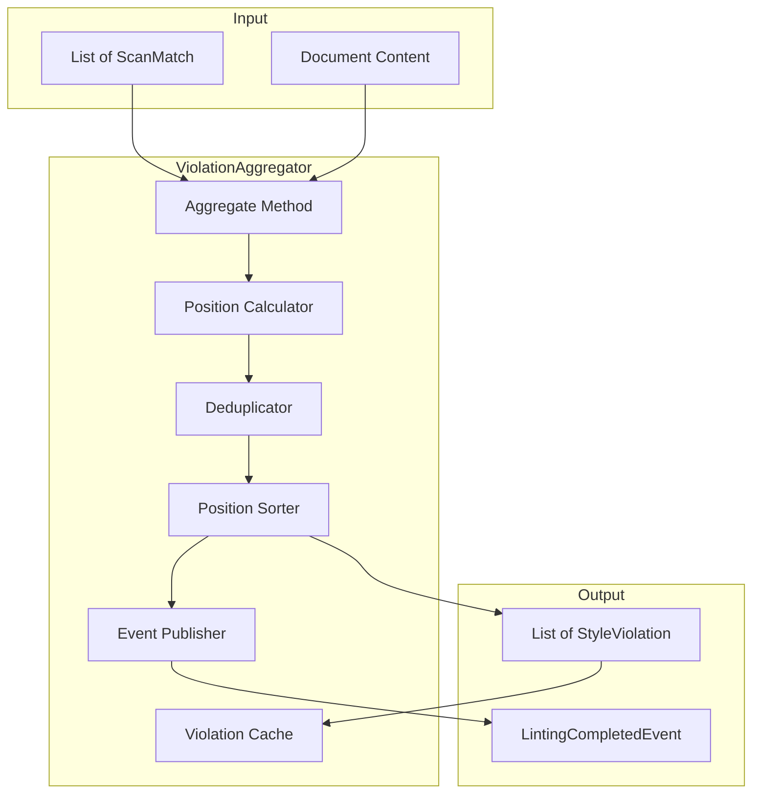
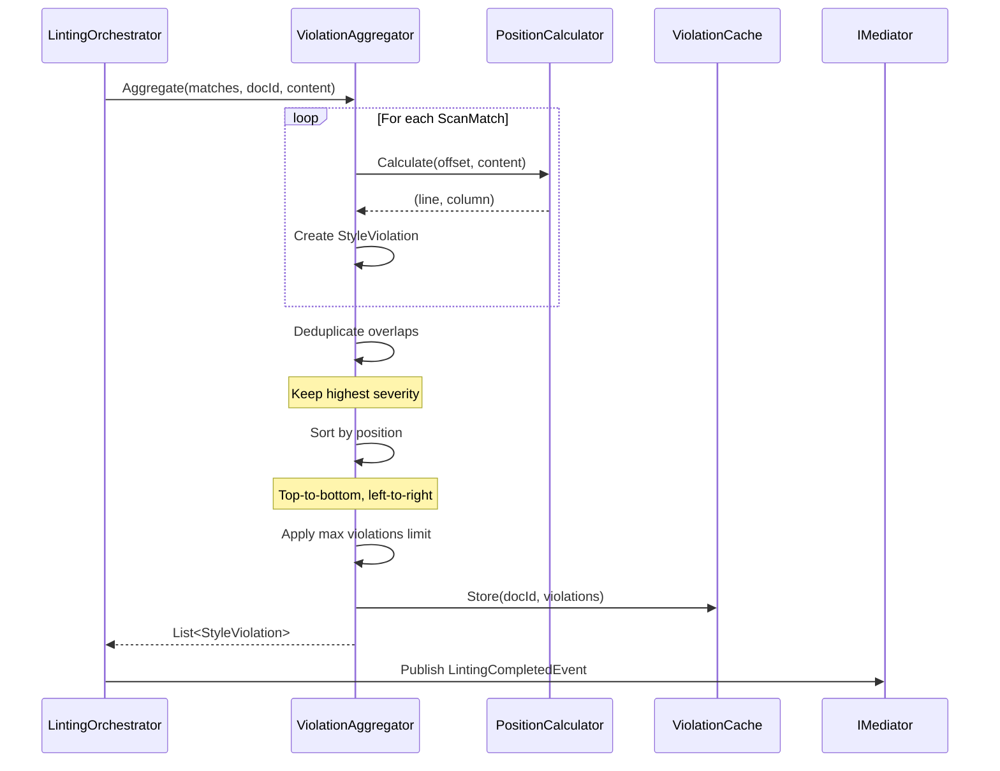
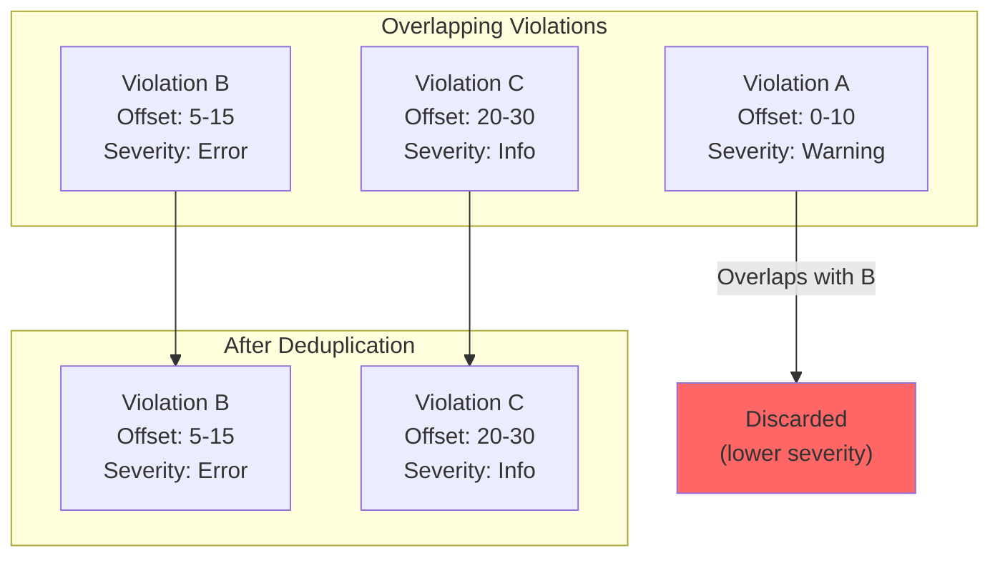

# LCS-DES-023d: Violation Aggregator

## 1. Metadata & Categorization

| Field              | Value                     | Description                                 |
| :----------------- | :------------------------ | :------------------------------------------ |
| **Document ID**    | LCS-DES-023d              | Design Specification v0.2.3d                |
| **Feature ID**     | INF-023d                  | Sub-part D of Linter Engine                 |
| **Feature Name**   | Violation Aggregator      | Transform matches to violations and publish |
| **Target Version** | `v0.2.3d`                 | Fourth sub-part of v0.2.3                   |
| **Module Scope**   | `Lexichord.Modules.Style` | Style governance module                     |
| **Swimlane**       | `Product`                 | Core User-Facing Feature                    |
| **License Tier**   | `Core`                    | Foundation (Available in Free tier)         |
| **Author**         | System Architect          |                                             |
| **Status**         | **Draft**                 | Pending implementation                      |
| **Last Updated**   | 2026-01-27                |                                             |

---

## 2. Executive Summary

### 2.1 The Requirement

Lexichord needs a **violation aggregation layer** that:

- Transforms raw `ScanMatch` results into user-facing `StyleViolation` objects.
- Calculates line and column numbers from character offsets.
- Deduplicates overlapping violations (keeping highest severity).
- Sorts violations by document position for ordered display.
- Caches violations per document for quick retrieval.
- Publishes `LintingCompletedEvent` via MediatR.

### 2.2 The Proposed Solution

We **SHALL** implement a violation aggregator with:

1. **IViolationAggregator Interface** — Contract for aggregation operations.
2. **ViolationAggregator** — Implementation with position calculation.
3. **Deduplication Logic** — Remove overlaps, keep highest severity.
4. **Position Sorting** — Order violations top-to-bottom, left-to-right.
5. **Event Publishing** — Emit `LintingCompletedEvent` for consumers.

---

## 3. Architecture

### 3.1 Aggregator Component Structure



### 3.2 Aggregation Pipeline Flow



### 3.3 Deduplication Strategy



---

## 4. Decision Tree: Aggregation Logic

```text
START: "Aggregate(matches, documentId, content)"
|
+-- Validate inputs
|   +-- Matches null/empty? -> Return empty list
|   +-- Content null? -> Return empty list
|
+-- Transform matches to violations
|   +-- For each ScanMatch:
|       +-- Generate unique violation ID
|       +-- Calculate line number from offset
|       +-- Calculate column number
|       +-- Build message from rule template
|       +-- Create StyleViolation record
|
+-- Deduplicate overlapping violations
|   +-- Sort by start offset
|   +-- For each violation:
|       +-- Check overlap with previous
|       +-- If overlapping:
|           +-- Compare severities
|           +-- Keep higher severity
|           +-- Merge ranges if needed
|       +-- If not overlapping:
|           +-- Add to result set
|
+-- Sort by document position
|   +-- Primary: Line number (ascending)
|   +-- Secondary: Column number (ascending)
|
+-- Apply limits
|   +-- If count > MaxViolationsPerDocument
|       +-- Truncate to limit
|       +-- Log warning
|
+-- Cache violations
|   +-- Store in document cache
|
+-- Return violations
|
END

---

OVERLAP DETECTION:
|
+-- Two violations overlap if:
|   +-- A.StartOffset < B.EndOffset AND B.StartOffset < A.EndOffset
|
+-- Severity precedence:
|   +-- Error > Warning > Info > Hint
|
+-- When severities equal:
|   +-- Keep the violation that starts first
```

---

## 5. Data Contracts

### 5.1 IViolationAggregator Interface

```csharp
namespace Lexichord.Abstractions.Contracts;

/// <summary>
/// Aggregates scan matches into violations and manages violation state.
/// </summary>
/// <remarks>
/// LOGIC: The aggregator is the bridge between raw scanner output
/// and user-facing violation data. It handles:
/// - Position calculation (offset to line/column)
/// - Deduplication of overlapping matches
/// - Sorting for consistent display order
/// - Caching for quick retrieval
///
/// Thread Safety:
/// - Violation cache uses ConcurrentDictionary
/// - Aggregate operation is stateless (cache is separate)
/// </remarks>
public interface IViolationAggregator
{
    /// <summary>
    /// Aggregates scan matches into violations.
    /// </summary>
    /// <param name="matches">Raw matches from scanner.</param>
    /// <param name="documentId">The document ID.</param>
    /// <param name="content">Document content for position calculation.</param>
    /// <returns>Aggregated and processed violations.</returns>
    /// <remarks>
    /// LOGIC: Performs the following transformations:
    /// 1. Convert ScanMatch to StyleViolation with line/column
    /// 2. Deduplicate overlapping violations (keep highest severity)
    /// 3. Sort by document position (top to bottom)
    /// 4. Cap at maximum violations limit
    /// 5. Cache results for later retrieval
    /// </remarks>
    IReadOnlyList<StyleViolation> Aggregate(
        IEnumerable<ScanMatch> matches,
        string documentId,
        string content);

    /// <summary>
    /// Clears cached violations for a document.
    /// </summary>
    /// <param name="documentId">The document ID.</param>
    /// <remarks>
    /// LOGIC: Called when document closes or rules change.
    /// </remarks>
    void ClearViolations(string documentId);

    /// <summary>
    /// Gets cached violations for a document.
    /// </summary>
    /// <param name="documentId">The document ID.</param>
    /// <returns>Cached violations, empty list if none.</returns>
    IReadOnlyList<StyleViolation> GetViolations(string documentId);

    /// <summary>
    /// Gets a specific violation by ID.
    /// </summary>
    /// <param name="documentId">The document ID.</param>
    /// <param name="violationId">The violation ID.</param>
    /// <returns>The violation, or null if not found.</returns>
    StyleViolation? GetViolation(string documentId, string violationId);

    /// <summary>
    /// Gets the violation at a specific document offset.
    /// </summary>
    /// <param name="documentId">The document ID.</param>
    /// <param name="offset">The document offset.</param>
    /// <returns>The violation at offset, or null if none.</returns>
    /// <remarks>
    /// LOGIC: Used by editor to show tooltip on hover.
    /// Returns the first violation whose range contains the offset.
    /// </remarks>
    StyleViolation? GetViolationAt(string documentId, int offset);

    /// <summary>
    /// Gets all violations in a specific range.
    /// </summary>
    /// <param name="documentId">The document ID.</param>
    /// <param name="startOffset">Start of range.</param>
    /// <param name="endOffset">End of range.</param>
    /// <returns>Violations that overlap with the range.</returns>
    IReadOnlyList<StyleViolation> GetViolationsInRange(
        string documentId,
        int startOffset,
        int endOffset);

    /// <summary>
    /// Gets violation counts grouped by severity.
    /// </summary>
    /// <param name="documentId">The document ID.</param>
    /// <returns>Dictionary of severity to count.</returns>
    IReadOnlyDictionary<ViolationSeverity, int> GetViolationCounts(string documentId);
}
```

### 5.2 StyleViolation Record (Full Definition)

```csharp
namespace Lexichord.Abstractions.Contracts;

/// <summary>
/// Represents a style rule violation in a document.
/// </summary>
/// <remarks>
/// LOGIC: StyleViolation is the primary data structure passed to
/// visualization components (v0.2.4). It contains all information
/// needed to display, navigate to, and fix the violation.
/// </remarks>
public record StyleViolation
{
    /// <summary>
    /// Unique identifier for this violation instance.
    /// </summary>
    /// <remarks>
    /// LOGIC: Generated using documentId + ruleId + offset hash.
    /// Stable across re-lints if content hasn't changed.
    /// </remarks>
    public required string Id { get; init; }

    /// <summary>
    /// The document containing the violation.
    /// </summary>
    public required string DocumentId { get; init; }

    /// <summary>
    /// The rule that was violated.
    /// </summary>
    public required string RuleId { get; init; }

    /// <summary>
    /// Start position in document (0-based).
    /// </summary>
    public required int StartOffset { get; init; }

    /// <summary>
    /// Length of violating text.
    /// </summary>
    public required int Length { get; init; }

    /// <summary>
    /// Line number (1-based).
    /// </summary>
    public required int Line { get; init; }

    /// <summary>
    /// Column number (1-based).
    /// </summary>
    public required int Column { get; init; }

    /// <summary>
    /// The text that caused the violation.
    /// </summary>
    public required string ViolatingText { get; init; }

    /// <summary>
    /// Human-readable violation message.
    /// </summary>
    public required string Message { get; init; }

    /// <summary>
    /// Violation severity level.
    /// </summary>
    public required ViolationSeverity Severity { get; init; }

    /// <summary>
    /// Recommended replacement text (nullable).
    /// </summary>
    public string? Suggestion { get; init; }

    /// <summary>
    /// Rule category for grouping.
    /// </summary>
    public required RuleCategory Category { get; init; }

    /// <summary>
    /// Gets the end offset of the violation.
    /// </summary>
    public int EndOffset => StartOffset + Length;

    /// <summary>
    /// Gets whether this violation has a suggested fix.
    /// </summary>
    public bool HasSuggestion => !string.IsNullOrEmpty(Suggestion);

    /// <summary>
    /// Gets the end line number (for multi-line violations).
    /// </summary>
    public int EndLine { get; init; }

    /// <summary>
    /// Gets the end column number.
    /// </summary>
    public int EndColumn { get; init; }

    /// <summary>
    /// Creates a new violation with updated position.
    /// </summary>
    /// <remarks>
    /// LOGIC: Used when document edits shift violation positions.
    /// </remarks>
    public StyleViolation WithOffset(int delta) =>
        this with { StartOffset = StartOffset + delta };

    /// <summary>
    /// Checks if this violation overlaps with another.
    /// </summary>
    public bool OverlapsWith(StyleViolation other) =>
        StartOffset < other.EndOffset && other.StartOffset < EndOffset;

    /// <summary>
    /// Checks if a position is within this violation's range.
    /// </summary>
    public bool ContainsOffset(int offset) =>
        offset >= StartOffset && offset < EndOffset;
}
```

### 5.3 ViolationAggregator Implementation

```csharp
using System.Collections.Concurrent;
using Lexichord.Abstractions.Contracts;
using Microsoft.Extensions.Logging;

namespace Lexichord.Modules.Style.Services;

/// <summary>
/// Aggregates scan matches into violations.
/// </summary>
/// <remarks>
/// LOGIC: The aggregator transforms raw regex matches into user-facing
/// violations with full position information and proper deduplication.
///
/// Key responsibilities:
/// - Calculate line/column from character offset
/// - Deduplicate overlapping violations
/// - Sort violations by position
/// - Cache violations per document
/// </remarks>
public sealed class ViolationAggregator : IViolationAggregator
{
    private readonly ILintingConfiguration _config;
    private readonly ILogger<ViolationAggregator> _logger;

    // LOGIC: Per-document violation cache
    private readonly ConcurrentDictionary<string, ViolationCache> _documentCaches = new();

    public ViolationAggregator(
        ILintingConfiguration config,
        ILogger<ViolationAggregator> logger)
    {
        _config = config;
        _logger = logger;
    }

    /// <inheritdoc/>
    public IReadOnlyList<StyleViolation> Aggregate(
        IEnumerable<ScanMatch> matches,
        string documentId,
        string content)
    {
        ArgumentException.ThrowIfNullOrEmpty(documentId);

        var matchList = matches?.ToList() ?? new List<ScanMatch>();

        if (matchList.Count == 0)
        {
            _logger.LogDebug("No matches to aggregate for document {DocumentId}", documentId);
            var emptyCache = GetOrCreateCache(documentId);
            emptyCache.Update(Array.Empty<StyleViolation>());
            return Array.Empty<StyleViolation>();
        }

        _logger.LogDebug(
            "Aggregating {MatchCount} matches for document {DocumentId}",
            matchList.Count, documentId);

        // LOGIC: Build position index for fast line/column lookup
        var positionIndex = new PositionIndex(content);

        // LOGIC: Transform matches to violations
        var violations = matchList
            .Select(match => CreateViolation(match, documentId, positionIndex))
            .ToList();

        _logger.LogDebug(
            "Created {ViolationCount} violations before deduplication",
            violations.Count);

        // LOGIC: Deduplicate overlapping violations
        var deduplicated = DeduplicateViolations(violations);

        _logger.LogDebug(
            "After deduplication: {Count} violations (removed {Removed})",
            deduplicated.Count, violations.Count - deduplicated.Count);

        // LOGIC: Sort by position
        var sorted = deduplicated
            .OrderBy(v => v.Line)
            .ThenBy(v => v.Column)
            .ToList();

        // LOGIC: Apply max limit
        var final = sorted.Count > _config.MaxViolationsPerDocument
            ? sorted.Take(_config.MaxViolationsPerDocument).ToList()
            : sorted;

        if (sorted.Count > _config.MaxViolationsPerDocument)
        {
            _logger.LogWarning(
                "Violations truncated from {Original} to {Limit} for document {DocumentId}",
                sorted.Count, _config.MaxViolationsPerDocument, documentId);
        }

        // LOGIC: Cache results
        var cache = GetOrCreateCache(documentId);
        cache.Update(final);

        _logger.LogDebug(
            "Aggregation complete for {DocumentId}: {Count} violations",
            documentId, final.Count);

        return final;
    }

    /// <inheritdoc/>
    public void ClearViolations(string documentId)
    {
        if (_documentCaches.TryRemove(documentId, out var cache))
        {
            _logger.LogDebug(
                "Cleared violations for document {DocumentId} ({Count} removed)",
                documentId, cache.Violations.Count);
        }
    }

    /// <inheritdoc/>
    public IReadOnlyList<StyleViolation> GetViolations(string documentId)
    {
        return _documentCaches.TryGetValue(documentId, out var cache)
            ? cache.Violations
            : Array.Empty<StyleViolation>();
    }

    /// <inheritdoc/>
    public StyleViolation? GetViolation(string documentId, string violationId)
    {
        if (!_documentCaches.TryGetValue(documentId, out var cache))
            return null;

        return cache.ViolationsById.TryGetValue(violationId, out var violation)
            ? violation
            : null;
    }

    /// <inheritdoc/>
    public StyleViolation? GetViolationAt(string documentId, int offset)
    {
        if (!_documentCaches.TryGetValue(documentId, out var cache))
            return null;

        return cache.Violations.FirstOrDefault(v => v.ContainsOffset(offset));
    }

    /// <inheritdoc/>
    public IReadOnlyList<StyleViolation> GetViolationsInRange(
        string documentId,
        int startOffset,
        int endOffset)
    {
        if (!_documentCaches.TryGetValue(documentId, out var cache))
            return Array.Empty<StyleViolation>();

        return cache.Violations
            .Where(v => v.StartOffset < endOffset && v.EndOffset > startOffset)
            .ToList();
    }

    /// <inheritdoc/>
    public IReadOnlyDictionary<ViolationSeverity, int> GetViolationCounts(string documentId)
    {
        if (!_documentCaches.TryGetValue(documentId, out var cache))
        {
            return new Dictionary<ViolationSeverity, int>
            {
                [ViolationSeverity.Error] = 0,
                [ViolationSeverity.Warning] = 0,
                [ViolationSeverity.Info] = 0,
                [ViolationSeverity.Hint] = 0
            };
        }

        return cache.Violations
            .GroupBy(v => v.Severity)
            .ToDictionary(g => g.Key, g => g.Count());
    }

    #region Private Methods

    private StyleViolation CreateViolation(
        ScanMatch match,
        string documentId,
        PositionIndex positionIndex)
    {
        // LOGIC: Calculate position
        var (line, column) = positionIndex.GetPosition(match.StartOffset);
        var (endLine, endColumn) = positionIndex.GetPosition(match.EndOffset);

        // LOGIC: Build message (supports template substitution)
        var message = BuildMessage(match.Rule.Message, match);

        // LOGIC: Generate stable ID
        var id = GenerateViolationId(documentId, match);

        return new StyleViolation
        {
            Id = id,
            DocumentId = documentId,
            RuleId = match.RuleId,
            StartOffset = match.StartOffset,
            Length = match.Length,
            Line = line,
            Column = column,
            EndLine = endLine,
            EndColumn = endColumn,
            ViolatingText = match.MatchedText,
            Message = message,
            Severity = match.Rule.Severity,
            Suggestion = match.Rule.Suggestion,
            Category = match.Rule.Category
        };
    }

    private static string BuildMessage(string template, ScanMatch match)
    {
        // LOGIC: Replace placeholders in message template
        // {0} = matched text
        // {suggestion} = suggestion text
        // Named capture groups from regex

        var result = template
            .Replace("{0}", match.MatchedText)
            .Replace("{text}", match.MatchedText)
            .Replace("{suggestion}", match.Rule.Suggestion ?? "");

        // LOGIC: Replace named capture groups
        if (match.CaptureGroups is not null)
        {
            foreach (var (name, value) in match.CaptureGroups)
            {
                result = result.Replace($"{{{name}}}", value);
            }
        }

        return result;
    }

    private static string GenerateViolationId(string documentId, ScanMatch match)
    {
        // LOGIC: Create stable ID from content hash
        // Same content at same position = same ID
        var hashInput = $"{documentId}|{match.RuleId}|{match.StartOffset}|{match.MatchedText}";
        var hash = hashInput.GetHashCode();
        return $"v-{Math.Abs(hash):x8}";
    }

    private static List<StyleViolation> DeduplicateViolations(List<StyleViolation> violations)
    {
        if (violations.Count <= 1)
            return violations;

        // LOGIC: Sort by start offset for overlap detection
        var sorted = violations.OrderBy(v => v.StartOffset).ToList();
        var result = new List<StyleViolation>();

        StyleViolation? current = null;

        foreach (var violation in sorted)
        {
            if (current is null)
            {
                current = violation;
                continue;
            }

            if (violation.OverlapsWith(current))
            {
                // LOGIC: Keep higher severity, or earlier if equal
                if (CompareSeverity(violation.Severity, current.Severity) > 0)
                {
                    current = violation;
                }
                // else keep current
            }
            else
            {
                result.Add(current);
                current = violation;
            }
        }

        if (current is not null)
        {
            result.Add(current);
        }

        return result;
    }

    private static int CompareSeverity(ViolationSeverity a, ViolationSeverity b)
    {
        // LOGIC: Error > Warning > Info > Hint
        return (int)a - (int)b;
    }

    private ViolationCache GetOrCreateCache(string documentId)
    {
        return _documentCaches.GetOrAdd(documentId, _ => new ViolationCache());
    }

    #endregion

    /// <summary>
    /// Cache for violations of a single document.
    /// </summary>
    private sealed class ViolationCache
    {
        private IReadOnlyList<StyleViolation> _violations = Array.Empty<StyleViolation>();
        private Dictionary<string, StyleViolation> _violationsById = new();

        public IReadOnlyList<StyleViolation> Violations => _violations;
        public Dictionary<string, StyleViolation> ViolationsById => _violationsById;

        public void Update(IReadOnlyList<StyleViolation> violations)
        {
            _violations = violations;
            _violationsById = violations.ToDictionary(v => v.Id);
        }
    }
}

/// <summary>
/// Index for fast offset-to-position lookup.
/// </summary>
/// <remarks>
/// LOGIC: Pre-computes line start offsets for O(log n) position lookup.
/// </remarks>
internal sealed class PositionIndex
{
    private readonly int[] _lineStarts;
    private readonly int _contentLength;

    public PositionIndex(string content)
    {
        _contentLength = content?.Length ?? 0;

        if (string.IsNullOrEmpty(content))
        {
            _lineStarts = new[] { 0 };
            return;
        }

        // LOGIC: Build array of line start offsets
        var lineStarts = new List<int> { 0 };

        for (int i = 0; i < content.Length; i++)
        {
            if (content[i] == '\n')
            {
                lineStarts.Add(i + 1);
            }
        }

        _lineStarts = lineStarts.ToArray();
    }

    /// <summary>
    /// Gets the (line, column) for an offset.
    /// </summary>
    /// <param name="offset">Character offset (0-based).</param>
    /// <returns>Line (1-based) and column (1-based).</returns>
    public (int Line, int Column) GetPosition(int offset)
    {
        if (offset < 0)
            return (1, 1);

        if (offset >= _contentLength)
            offset = Math.Max(0, _contentLength - 1);

        // LOGIC: Binary search for the line
        var lineIndex = BinarySearchLine(offset);
        var line = lineIndex + 1; // Convert to 1-based
        var column = offset - _lineStarts[lineIndex] + 1; // 1-based column

        return (line, column);
    }

    private int BinarySearchLine(int offset)
    {
        int low = 0;
        int high = _lineStarts.Length - 1;

        while (low <= high)
        {
            int mid = (low + high) / 2;

            if (mid == _lineStarts.Length - 1 ||
                (_lineStarts[mid] <= offset && offset < _lineStarts[mid + 1]))
            {
                return mid;
            }
            else if (_lineStarts[mid] > offset)
            {
                high = mid - 1;
            }
            else
            {
                low = mid + 1;
            }
        }

        return 0;
    }
}
```

### 5.4 LintingCompletedEvent Handler Example

```csharp
using Lexichord.Abstractions.Events;
using MediatR;
using Microsoft.Extensions.Logging;

namespace Lexichord.Modules.Style.Handlers;

/// <summary>
/// Example handler for LintingCompletedEvent.
/// </summary>
/// <remarks>
/// LOGIC: Demonstrates how downstream components can subscribe
/// to linting results. The Problems Panel (v0.2.6) will use a
/// similar pattern.
/// </remarks>
public class LintingCompletedHandler : INotificationHandler<LintingCompletedEvent>
{
    private readonly ILogger<LintingCompletedHandler> _logger;

    public LintingCompletedHandler(ILogger<LintingCompletedHandler> logger)
    {
        _logger = logger;
    }

    public Task Handle(LintingCompletedEvent notification, CancellationToken cancellationToken)
    {
        var result = notification.Result;

        _logger.LogInformation(
            "Linting completed for {DocumentId}: {Errors} errors, {Warnings} warnings in {Duration}ms",
            result.DocumentId,
            result.ErrorCount,
            result.WarningCount,
            result.ScanDuration.TotalMilliseconds);

        // LOGIC: v0.2.4 will wire this to the editor visualization
        // LOGIC: v0.2.6 will wire this to the Problems Panel

        return Task.CompletedTask;
    }
}
```

---

## 6. Implementation Logic

### 6.1 Message Template System

```csharp
/// <summary>
/// Handles message template substitution for violations.
/// </summary>
/// <remarks>
/// LOGIC: Supports flexible message templates with placeholders:
/// - {0} or {text}: The matched text
/// - {suggestion}: The suggested replacement
/// - {rule}: The rule name
/// - {severity}: The severity level
/// - Custom named groups from regex captures
/// </remarks>
public static class MessageTemplateEngine
{
    private static readonly Regex PlaceholderPattern = new(
        @"\{(\w+)\}",
        RegexOptions.Compiled);

    /// <summary>
    /// Expands a message template with context values.
    /// </summary>
    public static string Expand(
        string template,
        ScanMatch match,
        IReadOnlyDictionary<string, string>? additionalValues = null)
    {
        if (string.IsNullOrEmpty(template))
            return string.Empty;

        // LOGIC: Build context dictionary
        var context = new Dictionary<string, string>(StringComparer.OrdinalIgnoreCase)
        {
            ["0"] = match.MatchedText,
            ["text"] = match.MatchedText,
            ["suggestion"] = match.Rule.Suggestion ?? "",
            ["rule"] = match.Rule.Name,
            ["severity"] = match.Rule.Severity.ToString()
        };

        // LOGIC: Add capture groups
        if (match.CaptureGroups is not null)
        {
            foreach (var (key, value) in match.CaptureGroups)
            {
                context[key] = value;
            }
        }

        // LOGIC: Add additional values
        if (additionalValues is not null)
        {
            foreach (var (key, value) in additionalValues)
            {
                context[key] = value;
            }
        }

        // LOGIC: Replace placeholders
        return PlaceholderPattern.Replace(template, m =>
        {
            var placeholder = m.Groups[1].Value;
            return context.TryGetValue(placeholder, out var value) ? value : m.Value;
        });
    }
}
```

### 6.2 Violation Diff for Incremental Updates

```csharp
/// <summary>
/// Calculates the difference between two violation sets.
/// </summary>
/// <remarks>
/// LOGIC: Used for incremental UI updates - only repaint
/// violations that changed.
/// </remarks>
public static class ViolationDiff
{
    /// <summary>
    /// Calculates added and removed violations.
    /// </summary>
    public static ViolationChanges Calculate(
        IReadOnlyList<StyleViolation> previous,
        IReadOnlyList<StyleViolation> current)
    {
        var previousSet = previous.ToDictionary(v => v.Id);
        var currentSet = current.ToDictionary(v => v.Id);

        var added = current
            .Where(v => !previousSet.ContainsKey(v.Id))
            .ToList();

        var removed = previous
            .Where(v => !currentSet.ContainsKey(v.Id))
            .ToList();

        var modified = current
            .Where(v => previousSet.TryGetValue(v.Id, out var old) && !v.Equals(old))
            .ToList();

        return new ViolationChanges(added, removed, modified);
    }
}

/// <summary>
/// Represents changes between violation sets.
/// </summary>
public record ViolationChanges(
    IReadOnlyList<StyleViolation> Added,
    IReadOnlyList<StyleViolation> Removed,
    IReadOnlyList<StyleViolation> Modified
)
{
    /// <summary>
    /// Gets whether there are any changes.
    /// </summary>
    public bool HasChanges => Added.Count > 0 || Removed.Count > 0 || Modified.Count > 0;
}
```

---

## 7. Use Cases

### UC-01: Basic Aggregation

**Preconditions:**

- Scanner returns 5 matches from different rules.
- No overlapping violations.

**Flow:**

1. LintingOrchestrator calls Aggregate with matches.
2. Aggregator calculates position for each match.
3. No deduplication needed (no overlaps).
4. Violations sorted by line/column.
5. Results cached.
6. Violations returned.

**Postconditions:**

- 5 violations with correct line/column numbers.
- Cache populated for quick retrieval.

---

### UC-02: Overlapping Violation Deduplication

**Preconditions:**

- Two rules match the same text "whitelist".
- Rule A: Warning - "Use inclusive language"
- Rule B: Error - "Forbidden term"

**Flow:**

1. Scanner returns 2 matches at same offset.
2. Aggregator detects overlap.
3. Compares severity: Error > Warning.
4. Keeps Error violation, discards Warning.
5. Returns single violation.

**Postconditions:**

- Only 1 violation with Error severity.
- Warning violation not included.

---

### UC-03: Tooltip on Hover

**Preconditions:**

- Document has violations.
- User hovers over violation at offset 150.

**Flow:**

1. Editor detects hover at offset 150.
2. Editor calls GetViolationAt("doc-1", 150).
3. Aggregator searches cached violations.
4. Finds violation spanning 145-160.
5. Returns violation with message and suggestion.
6. Editor displays tooltip.

**Postconditions:**

- User sees violation message.
- User can click to apply suggestion.

---

## 8. Observability & Logging

| Level       | Context                 | Message Template                                                                           |
| :---------- | :---------------------- | :----------------------------------------------------------------------------------------- |
| Debug       | ViolationAggregator     | `No matches to aggregate for document {DocumentId}`                                        |
| Debug       | ViolationAggregator     | `Aggregating {MatchCount} matches for document {DocumentId}`                               |
| Debug       | ViolationAggregator     | `Created {ViolationCount} violations before deduplication`                                 |
| Debug       | ViolationAggregator     | `After deduplication: {Count} violations (removed {Removed})`                              |
| Debug       | ViolationAggregator     | `Aggregation complete for {DocumentId}: {Count} violations`                                |
| Debug       | ViolationAggregator     | `Cleared violations for document {DocumentId} ({Count} removed)`                           |
| Warning     | ViolationAggregator     | `Violations truncated from {Original} to {Limit} for document {DocumentId}`                |
| Information | LintingCompletedHandler | `Linting completed for {DocumentId}: {Errors} errors, {Warnings} warnings in {Duration}ms` |

### 8.1 Metrics

| Metric                               | Type      | Description                         |
| :----------------------------------- | :-------- | :---------------------------------- |
| `aggregator.violations.total`        | Counter   | Total violations created            |
| `aggregator.violations.deduplicated` | Counter   | Violations removed by deduplication |
| `aggregator.violations.per_document` | Histogram | Violations per document             |
| `aggregator.cache.documents`         | Gauge     | Documents with cached violations    |
| `aggregator.position.lookup_ms`      | Histogram | Position calculation time           |

---

## 9. Unit Testing Requirements

### 9.1 ViolationAggregator Tests

```csharp
[TestFixture]
[Category("Unit")]
public class ViolationAggregatorTests
{
    private ViolationAggregator _sut = null!;
    private Mock<ILintingConfiguration> _mockConfig = null!;

    [SetUp]
    public void SetUp()
    {
        _mockConfig = new Mock<ILintingConfiguration>();
        _mockConfig.Setup(c => c.MaxViolationsPerDocument).Returns(1000);

        _sut = new ViolationAggregator(
            _mockConfig.Object,
            Mock.Of<ILogger<ViolationAggregator>>());
    }

    [Test]
    public void Aggregate_EmptyMatches_ReturnsEmpty()
    {
        // Act
        var result = _sut.Aggregate(
            Enumerable.Empty<ScanMatch>(),
            "doc-1",
            "content");

        // Assert
        Assert.That(result, Is.Empty);
    }

    [Test]
    public void Aggregate_SingleMatch_ReturnsViolation()
    {
        // Arrange
        var rule = CreateRule("rule-1", ViolationSeverity.Warning);
        var match = new ScanMatch("rule-1", 0, 5, "match", rule);

        // Act
        var result = _sut.Aggregate(new[] { match }, "doc-1", "match text");

        // Assert
        Assert.That(result, Has.Count.EqualTo(1));
        Assert.Multiple(() =>
        {
            Assert.That(result[0].RuleId, Is.EqualTo("rule-1"));
            Assert.That(result[0].StartOffset, Is.EqualTo(0));
            Assert.That(result[0].Length, Is.EqualTo(5));
        });
    }

    [Test]
    public void Aggregate_CalculatesLineAndColumn()
    {
        // Arrange
        var rule = CreateRule("rule-1", ViolationSeverity.Warning);
        var content = "Line 1\nLine 2\nLine 3 match";
        var match = new ScanMatch("rule-1", 21, 5, "match", rule);

        // Act
        var result = _sut.Aggregate(new[] { match }, "doc-1", content);

        // Assert
        Assert.Multiple(() =>
        {
            Assert.That(result[0].Line, Is.EqualTo(3));
            Assert.That(result[0].Column, Is.EqualTo(8));
        });
    }

    [Test]
    public void Aggregate_OverlappingMatches_KeepsHighestSeverity()
    {
        // Arrange
        var warningRule = CreateRule("warn", ViolationSeverity.Warning);
        var errorRule = CreateRule("error", ViolationSeverity.Error);

        var matches = new[]
        {
            new ScanMatch("warn", 0, 5, "match", warningRule),
            new ScanMatch("error", 0, 5, "match", errorRule)
        };

        // Act
        var result = _sut.Aggregate(matches, "doc-1", "match text");

        // Assert
        Assert.That(result, Has.Count.EqualTo(1));
        Assert.That(result[0].Severity, Is.EqualTo(ViolationSeverity.Error));
    }

    [Test]
    public void Aggregate_MultipleMatches_SortsByPosition()
    {
        // Arrange
        var rule = CreateRule("rule-1", ViolationSeverity.Warning);
        var content = "first second third";
        var matches = new[]
        {
            new ScanMatch("rule-1", 13, 5, "third", rule),
            new ScanMatch("rule-1", 0, 5, "first", rule),
            new ScanMatch("rule-1", 6, 6, "second", rule)
        };

        // Act
        var result = _sut.Aggregate(matches, "doc-1", content);

        // Assert
        Assert.Multiple(() =>
        {
            Assert.That(result[0].ViolatingText, Is.EqualTo("first"));
            Assert.That(result[1].ViolatingText, Is.EqualTo("second"));
            Assert.That(result[2].ViolatingText, Is.EqualTo("third"));
        });
    }

    [Test]
    public void Aggregate_ExceedsMax_Truncates()
    {
        // Arrange
        _mockConfig.Setup(c => c.MaxViolationsPerDocument).Returns(5);
        var rule = CreateRule("rule-1", ViolationSeverity.Warning);
        var matches = Enumerable.Range(0, 10)
            .Select(i => new ScanMatch("rule-1", i * 5, 4, "test", rule))
            .ToList();

        // Act
        var result = _sut.Aggregate(matches, "doc-1", new string(' ', 50));

        // Assert
        Assert.That(result, Has.Count.EqualTo(5));
    }

    [Test]
    public void GetViolations_AfterAggregate_ReturnsCached()
    {
        // Arrange
        var rule = CreateRule("rule-1", ViolationSeverity.Warning);
        var match = new ScanMatch("rule-1", 0, 5, "match", rule);
        _sut.Aggregate(new[] { match }, "doc-1", "match text");

        // Act
        var result = _sut.GetViolations("doc-1");

        // Assert
        Assert.That(result, Has.Count.EqualTo(1));
    }

    [Test]
    public void GetViolations_NoCache_ReturnsEmpty()
    {
        // Act
        var result = _sut.GetViolations("unknown");

        // Assert
        Assert.That(result, Is.Empty);
    }

    [Test]
    public void ClearViolations_RemovesFromCache()
    {
        // Arrange
        var rule = CreateRule("rule-1", ViolationSeverity.Warning);
        var match = new ScanMatch("rule-1", 0, 5, "match", rule);
        _sut.Aggregate(new[] { match }, "doc-1", "match text");

        // Act
        _sut.ClearViolations("doc-1");

        // Assert
        Assert.That(_sut.GetViolations("doc-1"), Is.Empty);
    }

    [Test]
    public void GetViolationAt_ReturnsMatchingViolation()
    {
        // Arrange
        var rule = CreateRule("rule-1", ViolationSeverity.Warning);
        var match = new ScanMatch("rule-1", 10, 5, "match", rule);
        _sut.Aggregate(new[] { match }, "doc-1", "0123456789match");

        // Act
        var result = _sut.GetViolationAt("doc-1", 12);

        // Assert
        Assert.That(result, Is.Not.Null);
        Assert.That(result!.StartOffset, Is.EqualTo(10));
    }

    [Test]
    public void GetViolationAt_OutsideRange_ReturnsNull()
    {
        // Arrange
        var rule = CreateRule("rule-1", ViolationSeverity.Warning);
        var match = new ScanMatch("rule-1", 10, 5, "match", rule);
        _sut.Aggregate(new[] { match }, "doc-1", "0123456789match");

        // Act
        var result = _sut.GetViolationAt("doc-1", 5);

        // Assert
        Assert.That(result, Is.Null);
    }

    [Test]
    public void GetViolationsInRange_ReturnsOverlapping()
    {
        // Arrange
        var rule = CreateRule("rule-1", ViolationSeverity.Warning);
        var content = "aaa bbb ccc ddd eee";
        var matches = new[]
        {
            new ScanMatch("rule-1", 0, 3, "aaa", rule),   // 0-3
            new ScanMatch("rule-1", 4, 3, "bbb", rule),   // 4-7
            new ScanMatch("rule-1", 8, 3, "ccc", rule),   // 8-11
            new ScanMatch("rule-1", 12, 3, "ddd", rule),  // 12-15
            new ScanMatch("rule-1", 16, 3, "eee", rule)   // 16-19
        };
        _sut.Aggregate(matches, "doc-1", content);

        // Act - get violations in range 5-14
        var result = _sut.GetViolationsInRange("doc-1", 5, 14);

        // Assert - should include bbb (4-7), ccc (8-11), ddd (12-15)
        Assert.That(result, Has.Count.EqualTo(3));
    }

    [Test]
    public void GetViolationCounts_ReturnsBySeverity()
    {
        // Arrange
        var errorRule = CreateRule("error", ViolationSeverity.Error);
        var warnRule = CreateRule("warn", ViolationSeverity.Warning);
        var matches = new[]
        {
            new ScanMatch("error", 0, 3, "err", errorRule),
            new ScanMatch("warn", 4, 4, "warn", warnRule),
            new ScanMatch("warn", 9, 4, "warn", warnRule)
        };
        _sut.Aggregate(matches, "doc-1", "err warn warn");

        // Act
        var counts = _sut.GetViolationCounts("doc-1");

        // Assert
        Assert.Multiple(() =>
        {
            Assert.That(counts[ViolationSeverity.Error], Is.EqualTo(1));
            Assert.That(counts[ViolationSeverity.Warning], Is.EqualTo(2));
        });
    }

    private static StyleRule CreateRule(string id, ViolationSeverity severity) =>
        new(
            Id: id,
            Name: $"Rule {id}",
            Pattern: "pattern",
            Message: "Test message",
            Suggestion: "suggestion",
            Severity: severity,
            Category: RuleCategory.Terminology,
            IsEnabled: true,
            MatchCase: false);
}
```

### 9.2 PositionIndex Tests

```csharp
[TestFixture]
[Category("Unit")]
public class PositionIndexTests
{
    [Test]
    public void GetPosition_FirstCharacter_ReturnsLine1Column1()
    {
        // Arrange
        var sut = new PositionIndex("hello");

        // Act
        var (line, column) = sut.GetPosition(0);

        // Assert
        Assert.Multiple(() =>
        {
            Assert.That(line, Is.EqualTo(1));
            Assert.That(column, Is.EqualTo(1));
        });
    }

    [Test]
    public void GetPosition_SecondLine_ReturnsCorrectPosition()
    {
        // Arrange
        var sut = new PositionIndex("hello\nworld");

        // Act - 'w' is at offset 6
        var (line, column) = sut.GetPosition(6);

        // Assert
        Assert.Multiple(() =>
        {
            Assert.That(line, Is.EqualTo(2));
            Assert.That(column, Is.EqualTo(1));
        });
    }

    [Test]
    public void GetPosition_MiddleOfLine_ReturnsCorrectColumn()
    {
        // Arrange
        var sut = new PositionIndex("hello\nworld");

        // Act - 'r' is at offset 8
        var (line, column) = sut.GetPosition(8);

        // Assert
        Assert.Multiple(() =>
        {
            Assert.That(line, Is.EqualTo(2));
            Assert.That(column, Is.EqualTo(3));
        });
    }

    [Test]
    public void GetPosition_EmptyContent_ReturnsLine1Column1()
    {
        // Arrange
        var sut = new PositionIndex("");

        // Act
        var (line, column) = sut.GetPosition(0);

        // Assert
        Assert.Multiple(() =>
        {
            Assert.That(line, Is.EqualTo(1));
            Assert.That(column, Is.EqualTo(1));
        });
    }

    [Test]
    public void GetPosition_NegativeOffset_ReturnsLine1Column1()
    {
        // Arrange
        var sut = new PositionIndex("hello");

        // Act
        var (line, column) = sut.GetPosition(-5);

        // Assert
        Assert.Multiple(() =>
        {
            Assert.That(line, Is.EqualTo(1));
            Assert.That(column, Is.EqualTo(1));
        });
    }

    [Test]
    public void GetPosition_MultipleLines_PerformanceTest()
    {
        // Arrange - large document
        var content = string.Join("\n", Enumerable.Range(0, 10000).Select(i => $"Line {i}"));
        var sut = new PositionIndex(content);

        // Act - get position in last line
        var offset = content.Length - 5;
        var sw = System.Diagnostics.Stopwatch.StartNew();
        var (line, column) = sut.GetPosition(offset);
        sw.Stop();

        // Assert - should be fast (binary search)
        Assert.That(sw.ElapsedMilliseconds, Is.LessThan(10));
        Assert.That(line, Is.EqualTo(10000));
    }
}
```

---

## 10. Security & Safety

### 10.1 Input Validation

- **Null Checks:** All public methods validate inputs.
- **Bounds Checking:** Offsets clamped to valid ranges.
- **Empty Handling:** Empty inputs return empty results (no exceptions).

### 10.2 Memory Safety

- **Max Violations:** Configurable limit prevents memory exhaustion.
- **Cache Cleanup:** ClearViolations removes old data.
- **No Unbounded Growth:** Cache entries tied to document lifecycle.

---

## 11. Risks & Mitigations

| Risk                         | Impact | Mitigation                     |
| :--------------------------- | :----- | :----------------------------- |
| Large number of matches      | High   | MaxViolationsPerDocument limit |
| Position calculation slow    | Medium | Pre-computed PositionIndex     |
| Cache memory growth          | Medium | Clear on document close        |
| Deduplication too aggressive | Low    | Only dedupe overlapping ranges |
| Stale cache after edit       | Medium | Clear and re-aggregate on edit |

---

## 12. Acceptance Criteria (QA)

| #   | Category        | Criterion                                |
| :-- | :-------------- | :--------------------------------------- |
| 1   | **[Transform]** | Matches converted to violations          |
| 2   | **[Position]**  | Line numbers calculated correctly        |
| 3   | **[Position]**  | Column numbers calculated correctly      |
| 4   | **[Dedup]**     | Overlapping violations deduplicated      |
| 5   | **[Dedup]**     | Higher severity kept on overlap          |
| 6   | **[Sort]**      | Violations sorted by position            |
| 7   | **[Limit]**     | Max violations enforced                  |
| 8   | **[Cache]**     | Results cached for retrieval             |
| 9   | **[Query]**     | GetViolationAt returns correct violation |
| 10  | **[Query]**     | GetViolationsInRange returns overlapping |
| 11  | **[Event]**     | LintingCompletedEvent published          |
| 12  | **[Clear]**     | ClearViolations removes cache            |

---

## 13. Verification Commands

```bash
# 1. Run aggregator unit tests
dotnet test --filter "FullyQualifiedName~ViolationAggregator"

# 2. Run position index tests
dotnet test --filter "FullyQualifiedName~PositionIndex"

# 3. Integration test: full pipeline
dotnet test --filter "Category=Integration&FullyQualifiedName~Linting"

# 4. Manual verification:
# - Add rule matching "test"
# - Type "test" at line 5, column 10
# - Verify violation shows line 5, column 10
# - Hover over "test" - verify tooltip appears
```

---

## 14. Deliverable Checklist

| Step | Description                            | Status |
| :--- | :------------------------------------- | :----- |
| 1    | Define IViolationAggregator interface  | [ ]    |
| 2    | Define StyleViolation record           | [ ]    |
| 3    | Implement ViolationAggregator          | [ ]    |
| 4    | Implement PositionIndex                | [ ]    |
| 5    | Implement deduplication logic          | [ ]    |
| 6    | Implement position sorting             | [ ]    |
| 7    | Implement violation caching            | [ ]    |
| 8    | Implement GetViolationAt               | [ ]    |
| 9    | Implement GetViolationsInRange         | [ ]    |
| 10   | Implement GetViolationCounts           | [ ]    |
| 11   | Create MessageTemplateEngine           | [ ]    |
| 12   | Create ViolationDiff helper            | [ ]    |
| 13   | Create LintingCompletedHandler example | [ ]    |
| 14   | Unit tests for aggregator              | [ ]    |
| 15   | Unit tests for position index          | [ ]    |
| 16   | Integration tests with full pipeline   | [ ]    |
