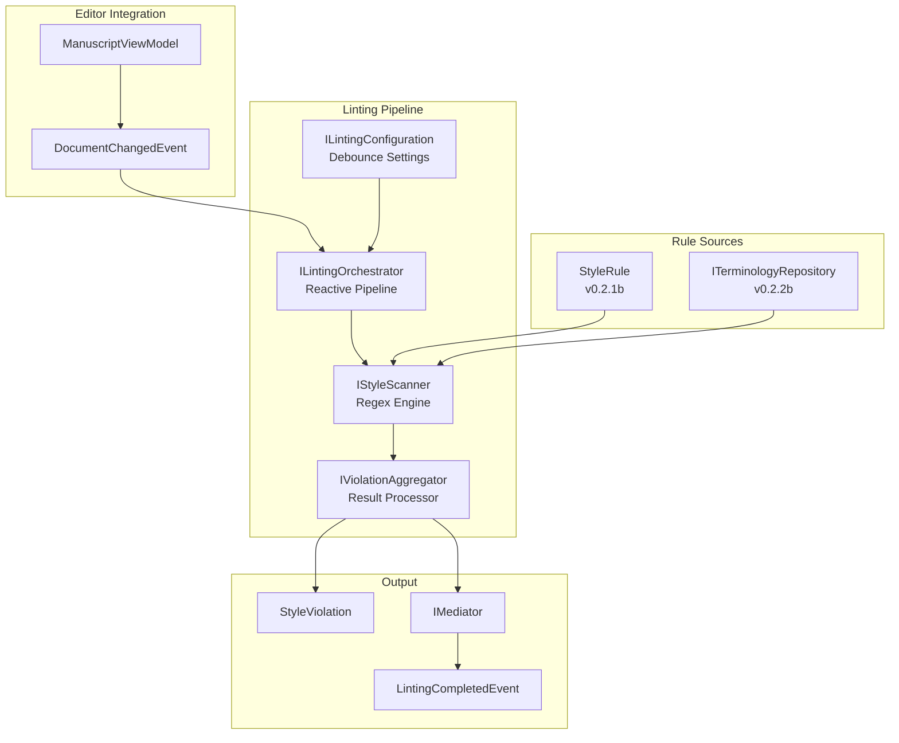
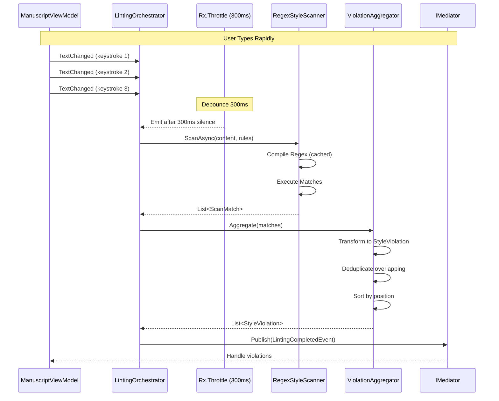
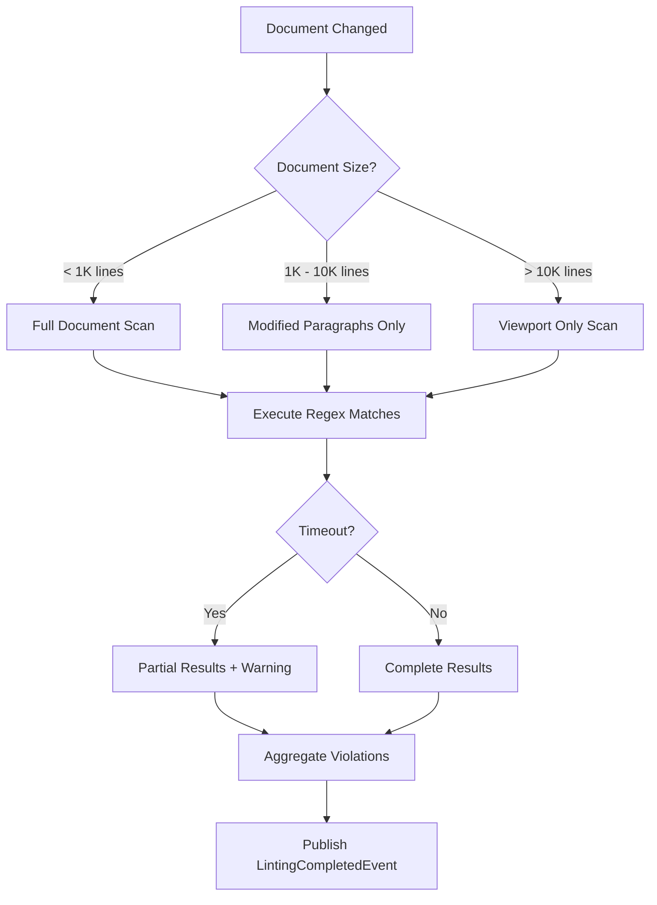

# LCS-DES-023: Design Specification Index — The Critic (Linter Engine)

## Document Control

| Field              | Value                      |
| :----------------- | :------------------------- |
| **Document ID**    | LCS-DES-023-INDEX          |
| **Feature ID**     | INF-023                    |
| **Feature Name**   | The Critic (Linter Engine) |
| **Target Version** | v0.2.3                     |
| **Status**         | Draft                      |
| **Last Updated**   | 2026-01-27                 |

---

## Executive Summary

The Critic (Linter Engine) is the **analytical brain of Lexichord's governance system**. It transforms passive text editing into an active, rule-driven writing experience by continuously analyzing document content against defined style rules and terminology standards.

This module introduces reactive programming patterns via System.Reactive (Rx.NET) to create a performant, non-blocking linting pipeline that operates seamlessly in the background while the user writes.

### Business Value

- **Real-Time Feedback:** Writers receive immediate guidance on style violations without manual checks
- **Performance:** Reactive debouncing prevents UI lag even during rapid typing
- **Scalability:** Architecture supports thousands of rules without degrading user experience
- **Foundation:** Provides the violation data that v0.2.4 (Editor Integration) will visualize
- **Enterprise Ready:** Supports corporate style guides with consistent enforcement

---

## Related Documents

| Document Type       | Document ID  | Title                | Path                |
| :------------------ | :----------- | :------------------- | :------------------ |
| **Scope Breakdown** | LCS-SBD-023  | Linter Engine Scope  | `./LCS-SBD-023.md`  |
| **Sub-Part 023a**   | LCS-DES-023a | Reactive Pipeline    | `./LCS-DES-023a.md` |
| **Sub-Part 023b**   | LCS-DES-023b | Debounce Logic       | `./LCS-DES-023b.md` |
| **Sub-Part 023c**   | LCS-DES-023c | The Scanner (Regex)  | `./LCS-DES-023c.md` |
| **Sub-Part 023d**   | LCS-DES-023d | Violation Aggregator | `./LCS-DES-023d.md` |

---

## Architecture Overview

### High-Level Component Diagram



### Reactive Pipeline Flow



### Scanning Strategy



---

## Dependencies

### Upstream Dependencies

| Component              | Source Version | Usage                                          |
| :--------------------- | :------------- | :--------------------------------------------- |
| StyleRule              | v0.2.1b        | Rule definitions to scan against               |
| ViolationSeverity      | v0.2.1b        | Severity levels for violations                 |
| ITerminologyRepository | v0.2.2b        | Database of terms to enforce                   |
| ITerminologyService    | v0.2.2d        | Term CRUD operations                           |
| LexiconChangedEvent    | v0.2.2d        | Invalidate rule cache on changes               |
| IManuscriptViewModel   | v0.1.3a        | Document content source                        |
| DocumentChangedEvent   | v0.1.3a        | Trigger for linting pipeline                   |
| IMediator              | v0.0.7a        | Publish LintingCompletedEvent                  |
| IConfiguration         | v0.0.3d        | Linter settings (via IOptions<LintingOptions>) |
| ILogger<T>             | v0.0.3b        | Performance and diagnostic logging             |

### External Dependencies

| Package                          | Purpose                                     |
| :------------------------------- | :------------------------------------------ |
| `System.Reactive`                | Rx.NET for reactive pipeline and debouncing |
| `System.Text.RegularExpressions` | Pattern matching engine                     |

---

## License Gating Strategy

| Feature                   | Core Tier                   | WriterPro Tier               |
| :------------------------ | :-------------------------- | :--------------------------- |
| **Basic Linting**         | ✅ Embedded rules only      | ✅ Full access               |
| **Custom Rules**          | ❌ Not available            | ✅ Full custom rules         |
| **Debounce Config**       | ✅ Fixed 300ms              | ✅ Configurable (100-1000ms) |
| **Viewport Optimization** | ✅ Always on for large docs | ✅ Configurable              |
| **Max Violations**        | ✅ Max 100 per document     | ✅ Unlimited                 |

**Rationale:**

- Core tier provides essential style checking with embedded Microsoft Manual of Style rules
- WriterPro unlocks custom rules, configurable debounce, and unlimited violations
- Future: Enterprise tier adds team-shared rule repositories

---

## Key Interfaces Summary

### ILintingOrchestrator (v0.2.3a)

Reactive pipeline coordinator that subscribes to document changes and orchestrates the scanning process. Implements IDisposable for clean subscription management.

**See:** `LCS-DES-023a.md` for full specification

### ILintingConfiguration (v0.2.3b)

Configuration for debounce interval, max lint duration, viewport-only scanning, and violation limits. Supports configurable debounce (100ms-1000ms).

**See:** `LCS-DES-023b.md` for full specification

### IStyleScanner (v0.2.3c)

Core scanning engine that executes regex patterns against document content. Includes compiled regex caching, timeout protection (ReDoS prevention), and optimized scanning modes.

**See:** `LCS-DES-023c.md` for full specification

### IViolationAggregator (v0.2.3d)

Transforms scan matches into StyleViolation objects with deduplication, sorting, and event publication via MediatR.

**See:** `LCS-DES-023d.md` for full specification

### Core Domain Model

```csharp
public record StyleViolation
{
    public required Guid Id { get; init; }
    public required string DocumentId { get; init; }
    public required int StartOffset { get; init; }
    public required int Length { get; init; }
    public required string Message { get; init; }
    public required string Recommendation { get; init; }
    public required ViolationSeverity Severity { get; init; }
    public required string RuleId { get; init; }
    public required string Category { get; init; }
}

public record LintingCompletedEvent : DomainEventBase
{
    public required string DocumentId { get; init; }
    public required IReadOnlyList<StyleViolation> Violations { get; init; }
    public required TimeSpan ScanDuration { get; init; }
    public required bool WasPartialScan { get; init; }
}
```

---

## Implementation Checklist Summary

| Sub-Part        | Est. Hours | Key Deliverables                                                           |
| :-------------- | :--------- | :------------------------------------------------------------------------- |
| **v0.2.3a**     | 11.5h      | System.Reactive, ILintingOrchestrator, DocumentChangedEvent subscription   |
| **v0.2.3b**     | 11h        | ILintingConfiguration, Rx.Throttle operator, cancellation support          |
| **v0.2.3c**     | 19h        | IStyleScanner, RegexStyleScanner, caching, timeout protection              |
| **v0.2.3d**     | 14h        | StyleViolation, IViolationAggregator, deduplication, LintingCompletedEvent |
| **Integration** | 6h         | Full pipeline integration tests                                            |
| **Total**       | **61h**    | Complete reactive linting engine                                           |

**See:** `LCS-SBD-023.md` for detailed task breakdown

---

## Success Criteria Summary

### Performance Targets

| Metric                              | Target           | Rationale                             |
| :---------------------------------- | :--------------- | :------------------------------------ |
| Debounce response time              | 300ms ± 10ms     | Responsive without excessive scanning |
| Scan latency (1K lines)             | < 50ms           | Fast for typical documents            |
| Scan latency (10K lines)            | < 200ms          | Acceptable for large documents        |
| Scan latency (100K lines, viewport) | < 100ms          | Viewport optimization essential       |
| UI thread blocking                  | 0ms              | All scanning on background thread     |
| Memory per active document          | < 5MB violations | Bounded memory usage                  |
| Subscription cleanup                | 100%             | No leaks after document close         |

### Quality Targets

- 100% code coverage for domain objects
- 95%+ code coverage for scanner logic
- All regex patterns protected with timeout
- No memory leaks in subscription management

---

## Test Coverage Summary

### Unit Testing

| Component            | Coverage Target | Key Tests                          |
| :------------------- | :-------------- | :--------------------------------- |
| LintingOrchestrator  | 95%             | Subscription, disposal, start/stop |
| LintingConfiguration | 100%            | Validation, defaults               |
| RegexStyleScanner    | 95%             | Pattern matching, timeout, caching |
| ViolationAggregator  | 95%             | Deduplication, sorting, publishing |

### Integration Testing

- Full pipeline: Document change → Debounce → Scan → Violations → Event
- Subscription cleanup verification
- Large document performance benchmarks
- ReDoS protection validation

### Manual Testing

- Type rapidly in editor, observe debounce behavior
- Open large document, verify viewport-only scanning
- Close document, verify no memory leaks
- Trigger LexiconChangedEvent, verify rule cache invalidation

**See:** Individual sub-part specifications for detailed test requirements

---

## What This Enables

After v0.2.3, Lexichord will support:

1. **Real-Time Analysis**
    - Background style checking without UI impact
    - Immediate feedback on style violations
    - Seamless writing experience

2. **Reactive Architecture**
    - Foundation for all future real-time features
    - Proven debounce patterns
    - Clean subscription management

3. **Violation Data**
    - Complete violation information ready for visualization (v0.2.4)
    - Position, severity, message, recommendation
    - Sorted and deduplicated results

4. **Foundation for v0.2.4+**
    - Editor integration can render squiggles/highlights
    - Side panel can display violation list
    - Quick-fix suggestions can be offered

---

## Risks & Mitigations

| Risk                                     | Impact | Mitigation                                              |
| :--------------------------------------- | :----- | :------------------------------------------------------ |
| Regex patterns cause ReDoS               | High   | Timeout all regex execution; limit pattern complexity   |
| Memory pressure from many violations     | High   | Cap max violations per document; stream results         |
| Rx subscription leaks                    | Medium | Strict IDisposable pattern; integration tests           |
| Debounce too aggressive (missed changes) | Medium | Configurable interval; smart debounce on silence        |
| Large document scanning blocks UI        | High   | Async scanning on background thread; chunked processing |
| Rule cache invalidation race conditions  | Medium | Thread-safe cache; version-based invalidation           |

---

## Document History

| Version | Date       | Author           | Changes                                                      |
| :------ | :--------- | :--------------- | :----------------------------------------------------------- |
| 1.0     | 2026-01-27 | System Architect | Created INDEX from legacy LCS-INF-023 during standardization |
