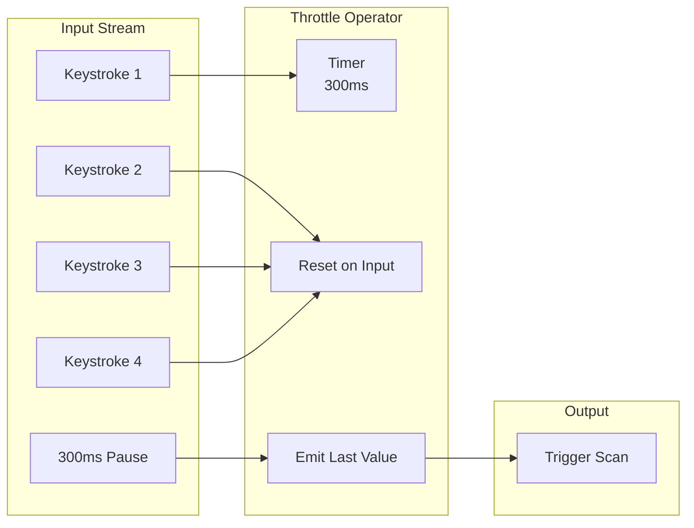
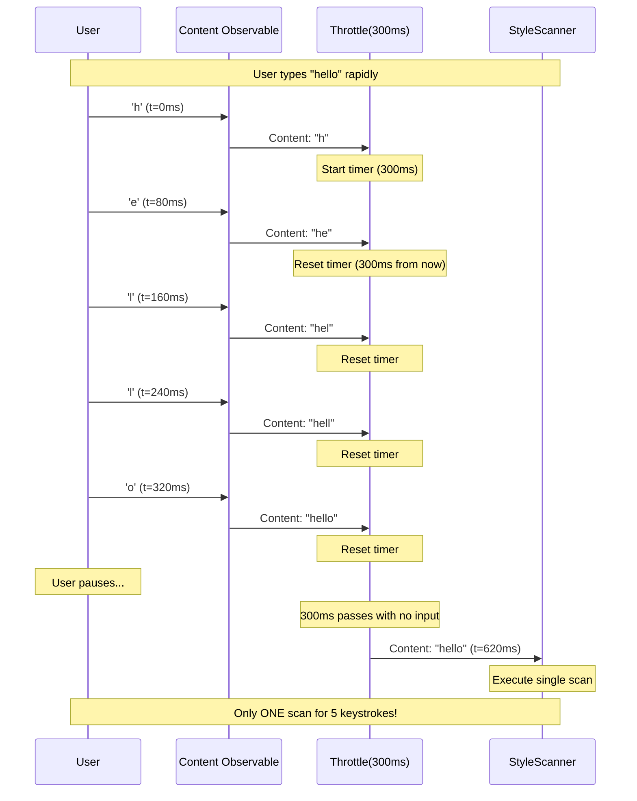

# LCS-DES-023b: Debounce Logic

## 1. Metadata & Categorization

| Field              | Value                     | Description                                   |
| :----------------- | :------------------------ | :-------------------------------------------- |
| **Document ID**    | LCS-DES-023b              | Design Specification v0.2.3b                  |
| **Feature ID**     | INF-023b                  | Sub-part B of Linter Engine                   |
| **Feature Name**   | Debounce Logic            | Throttle configuration for text change events |
| **Target Version** | `v0.2.3b`                 | Second sub-part of v0.2.3                     |
| **Module Scope**   | `Lexichord.Modules.Style` | Style governance module                       |
| **Swimlane**       | `Product`                 | Core User-Facing Feature                      |
| **License Tier**   | `Core`                    | Foundation (Available in Free tier)           |
| **Author**         | System Architect          |                                               |
| **Status**         | **Draft**                 | Pending implementation                        |
| **Last Updated**   | 2026-01-27                |                                               |

---

## 2. Executive Summary

### 2.1 The Requirement

Lexichord's linting engine must **NOT** run regex scans on every keystroke:

- Running scans on every character would cause UI lag during rapid typing.
- Regex pattern matching is CPU-intensive, especially with many rules.
- Users type at 40-80 WPM (3-6 characters/second), generating many events.
- The solution must balance responsiveness with performance.

### 2.2 The Proposed Solution

We **SHALL** implement configurable debounce logic with:

1. **Throttle Operator** — Rx `Throttle` with configurable interval (default 300ms).
2. **ILintingConfiguration** — Interface for debounce and timeout settings.
3. **Cancellation Support** — Cancel in-progress scans when new content arrives.
4. **Smart Debounce** — Reset timer on continued typing, fire on silence.

---

## 3. Architecture

### 3.1 Debounce Pipeline Flow



### 3.2 Timing Diagram



### 3.3 Configuration State Diagram

```mermaid
stateDiagram-v2
    [*] --> Idle: Initial state
    Idle --> Waiting: Content changed
    Waiting --> Waiting: More changes (reset timer)
    Waiting --> Scanning: Timer expires
    Scanning --> Idle: Scan complete
    Scanning --> Cancelled: New content during scan
    Cancelled --> Waiting: Start new timer

    note right of Waiting: Timer: 300ms default
    note right of Scanning: Respects MaxLintDuration
```

---

## 4. Decision Tree: Debounce Behavior

```text
START: "Content change event received"
|
+-- Is throttle timer active?
|   +-- YES -> Reset timer to full interval
|   +-- NO -> Start timer with configured interval
|
+-- Timer expires (silence period elapsed)
|   +-- Is previous scan still running?
|   |   +-- YES -> Cancel previous scan
|   |   +-- NO -> Continue
|   +-- Get current content snapshot
|   +-- Execute scan
|
+-- Scan completes or is cancelled
|   +-- Reset to idle state
|   +-- Ready for next content change
|
END

---

CONFIGURATION DECISION:
|
+-- User typing speed analysis:
|   +-- Slow typist (20 WPM): 250ms between chars
|   |   -> 200ms debounce feels responsive
|   +-- Average typist (40 WPM): 150ms between chars
|   |   -> 300ms debounce optimal
|   +-- Fast typist (80 WPM): 75ms between chars
|   |   -> 300ms debounce still works
|
+-- Network/large doc considerations:
|   +-- Local file, small doc: 100-200ms debounce
|   +-- Large document (>10K lines): 500ms debounce
|   +-- Very large (>100K lines): 1000ms debounce
|
+-- Default: 300ms (balances responsiveness and performance)
```

---

## 5. Data Contracts

### 5.1 ILintingConfiguration Interface

```csharp
namespace Lexichord.Abstractions.Contracts;

/// <summary>
/// Configuration for linting behavior and performance tuning.
/// </summary>
/// <remarks>
/// LOGIC: These settings control the tradeoff between responsiveness
/// and performance. The defaults are tuned for typical usage patterns.
///
/// Key considerations:
/// - DebounceInterval: How long to wait after typing stops
/// - RegexTimeout: Prevents ReDoS from malicious patterns
/// - MaxLintDuration: Overall timeout for lint operations
/// - LargeDocumentThreshold: When to switch to optimized scanning
/// </remarks>
public interface ILintingConfiguration
{
    /// <summary>
    /// Debounce interval between text changes and scan start.
    /// </summary>
    /// <remarks>
    /// LOGIC: This is the "silence period" after typing before scanning.
    ///
    /// Recommended values:
    /// - 100ms: Very responsive, may cause lag on slow machines
    /// - 300ms: Default, good balance (waits for word completion)
    /// - 500ms: Conservative, better for large documents
    /// - 1000ms: Maximum, for very large or complex rule sets
    ///
    /// The Rx Throttle operator uses this value.
    /// </remarks>
    TimeSpan DebounceInterval { get; }

    /// <summary>
    /// Maximum duration for a complete lint operation.
    /// </summary>
    /// <remarks>
    /// LOGIC: If a lint takes longer than this, it's cancelled.
    /// Prevents runaway scans from blocking the pipeline.
    /// Default: 5 seconds
    /// </remarks>
    TimeSpan MaxLintDuration { get; }

    /// <summary>
    /// Maximum time for a single regex pattern execution.
    /// </summary>
    /// <remarks>
    /// LOGIC: ReDoS prevention. Each pattern must complete within this time.
    /// Default: 100ms per pattern
    /// </remarks>
    TimeSpan RegexTimeout { get; }

    /// <summary>
    /// Whether to only lint the visible viewport for large documents.
    /// </summary>
    /// <remarks>
    /// LOGIC: When true and document exceeds LargeDocumentThreshold,
    /// only the visible portion is scanned for performance.
    /// Default: true
    /// </remarks>
    bool LintOnlyVisibleRange { get; }

    /// <summary>
    /// Threshold (in lines) above which viewport-only linting activates.
    /// </summary>
    /// <remarks>
    /// LOGIC: Documents larger than this use optimized scanning.
    /// Default: 5000 lines (~100 pages)
    /// </remarks>
    int LargeDocumentThreshold { get; }

    /// <summary>
    /// Maximum violations to return per document.
    /// </summary>
    /// <remarks>
    /// LOGIC: Prevents memory exhaustion from pathological documents.
    /// Default: 1000 violations
    /// </remarks>
    int MaxViolationsPerDocument { get; }

    /// <summary>
    /// Whether linting is enabled globally.
    /// </summary>
    /// <remarks>
    /// LOGIC: Master switch for all linting operations.
    /// When false, subscriptions remain active but scans skip.
    /// </remarks>
    bool IsEnabled { get; }

    /// <summary>
    /// Minimum debounce interval allowed.
    /// </summary>
    /// <remarks>
    /// LOGIC: Prevents users from setting dangerously low values.
    /// Default: 50ms
    /// </remarks>
    TimeSpan MinDebounceInterval { get; }

    /// <summary>
    /// Maximum debounce interval allowed.
    /// </summary>
    /// <remarks>
    /// LOGIC: Prevents impractically long wait times.
    /// Default: 2000ms
    /// </remarks>
    TimeSpan MaxDebounceInterval { get; }
}
```

### 5.2 LintingConfiguration Implementation

```csharp
using Lexichord.Abstractions.Contracts;
using Microsoft.Extensions.Options;

namespace Lexichord.Modules.Style.Configuration;

/// <summary>
/// Settings record for linting configuration persistence.
/// </summary>
/// <remarks>
/// LOGIC: This record is serialized to/from settings storage.
/// It maps to ILintingConfiguration through LintingConfiguration.
/// </remarks>
public record LintingSettings
{
    /// <summary>
    /// Settings section name for IOptions pattern.
    /// </summary>
    public const string SectionName = "Linting";

    /// <summary>
    /// Debounce interval in milliseconds.
    /// </summary>
    public int DebounceIntervalMs { get; init; } = 300;

    /// <summary>
    /// Maximum lint duration in milliseconds.
    /// </summary>
    public int MaxLintDurationMs { get; init; } = 5000;

    /// <summary>
    /// Regex timeout in milliseconds.
    /// </summary>
    public int RegexTimeoutMs { get; init; } = 100;

    /// <summary>
    /// Whether to use viewport-only scanning.
    /// </summary>
    public bool LintOnlyVisibleRange { get; init; } = true;

    /// <summary>
    /// Large document threshold in lines.
    /// </summary>
    public int LargeDocumentThreshold { get; init; } = 5000;

    /// <summary>
    /// Maximum violations per document.
    /// </summary>
    public int MaxViolationsPerDocument { get; init; } = 1000;

    /// <summary>
    /// Whether linting is enabled.
    /// </summary>
    public bool IsEnabled { get; init; } = true;
}

/// <summary>
/// Implementation of ILintingConfiguration using IOptions pattern.
/// </summary>
/// <remarks>
/// LOGIC: Wraps LintingSettings and provides validation.
/// Uses IOptionsMonitor for hot-reload support.
/// </remarks>
public sealed class LintingConfiguration : ILintingConfiguration, IDisposable
{
    private readonly IOptionsMonitor<LintingSettings> _options;
    private readonly IDisposable? _changeToken;

    // LOGIC: Cache TimeSpan values to avoid repeated conversion
    private TimeSpan _debounceInterval;
    private TimeSpan _maxLintDuration;
    private TimeSpan _regexTimeout;

    public LintingConfiguration(IOptionsMonitor<LintingSettings> options)
    {
        _options = options ?? throw new ArgumentNullException(nameof(options));

        UpdateCachedValues(_options.CurrentValue);

        // LOGIC: Subscribe to settings changes for hot-reload
        _changeToken = _options.OnChange(UpdateCachedValues);
    }

    /// <inheritdoc/>
    public TimeSpan DebounceInterval => _debounceInterval;

    /// <inheritdoc/>
    public TimeSpan MaxLintDuration => _maxLintDuration;

    /// <inheritdoc/>
    public TimeSpan RegexTimeout => _regexTimeout;

    /// <inheritdoc/>
    public bool LintOnlyVisibleRange => _options.CurrentValue.LintOnlyVisibleRange;

    /// <inheritdoc/>
    public int LargeDocumentThreshold => _options.CurrentValue.LargeDocumentThreshold;

    /// <inheritdoc/>
    public int MaxViolationsPerDocument => _options.CurrentValue.MaxViolationsPerDocument;

    /// <inheritdoc/>
    public bool IsEnabled => _options.CurrentValue.IsEnabled;

    /// <inheritdoc/>
    public TimeSpan MinDebounceInterval => TimeSpan.FromMilliseconds(50);

    /// <inheritdoc/>
    public TimeSpan MaxDebounceInterval => TimeSpan.FromMilliseconds(2000);

    private void UpdateCachedValues(LintingSettings settings)
    {
        // LOGIC: Clamp debounce to valid range
        var debounceMs = Math.Clamp(
            settings.DebounceIntervalMs,
            (int)MinDebounceInterval.TotalMilliseconds,
            (int)MaxDebounceInterval.TotalMilliseconds);

        _debounceInterval = TimeSpan.FromMilliseconds(debounceMs);
        _maxLintDuration = TimeSpan.FromMilliseconds(
            Math.Max(settings.MaxLintDurationMs, 1000));
        _regexTimeout = TimeSpan.FromMilliseconds(
            Math.Max(settings.RegexTimeoutMs, 10));
    }

    public void Dispose()
    {
        _changeToken?.Dispose();
    }
}
```

### 5.3 Throttle Extension Methods

```csharp
using System.Reactive.Linq;

namespace Lexichord.Modules.Style.Extensions;

/// <summary>
/// Extension methods for observable throttling in the linting pipeline.
/// </summary>
/// <remarks>
/// LOGIC: Provides convenience methods for common throttling patterns
/// used in the linting pipeline.
/// </remarks>
public static class ThrottleExtensions
{
    /// <summary>
    /// Applies debounce throttling to a content observable.
    /// </summary>
    /// <param name="source">The source observable.</param>
    /// <param name="config">Linting configuration.</param>
    /// <returns>Throttled observable.</returns>
    /// <remarks>
    /// LOGIC: Uses Rx Throttle operator which:
    /// - Waits for silence (no emissions for interval)
    /// - Emits the LAST value received
    /// - Resets timer on each new emission
    ///
    /// This is different from Sample which emits at regular intervals.
    /// </remarks>
    public static IObservable<string> ApplyLintingThrottle(
        this IObservable<string> source,
        ILintingConfiguration config)
    {
        return source.Throttle(config.DebounceInterval);
    }

    /// <summary>
    /// Applies throttle with cancellation for superseded operations.
    /// </summary>
    /// <typeparam name="TSource">Source element type.</typeparam>
    /// <typeparam name="TResult">Result element type.</typeparam>
    /// <param name="source">The source observable.</param>
    /// <param name="throttleInterval">Throttle interval.</param>
    /// <param name="selector">Async selector with cancellation.</param>
    /// <returns>Observable of results.</returns>
    /// <remarks>
    /// LOGIC: Combines Throttle with SelectMany/Switch pattern.
    /// When new content arrives, any in-progress operation is cancelled.
    ///
    /// Pipeline: Throttle -> Select (start async) -> Switch (cancel previous)
    /// </remarks>
    public static IObservable<TResult> ThrottleAndCancelPrevious<TSource, TResult>(
        this IObservable<TSource> source,
        TimeSpan throttleInterval,
        Func<TSource, CancellationToken, Task<TResult>> selector)
    {
        return source
            .Throttle(throttleInterval)
            .Select(item => Observable.FromAsync(ct => selector(item, ct)))
            .Switch(); // Cancels previous inner observable
    }
}
```

### 5.4 Debounce Controller

```csharp
using System.Reactive.Disposables;
using System.Reactive.Linq;
using System.Reactive.Subjects;
using Microsoft.Extensions.Logging;

namespace Lexichord.Modules.Style.Services;

/// <summary>
/// Controls debounce behavior for a single document's linting.
/// </summary>
/// <remarks>
/// LOGIC: Encapsulates the debounce state machine for one document.
/// Used internally by LintingOrchestrator to manage per-document throttling.
///
/// State transitions:
/// - Idle -> Waiting: Content changed, timer started
/// - Waiting -> Waiting: More content, timer reset
/// - Waiting -> Scanning: Timer expired, scan starts
/// - Scanning -> Idle: Scan completed
/// - Scanning -> Waiting: New content during scan (cancel + restart)
/// </remarks>
internal sealed class DebounceController : IDisposable
{
    private readonly ILintingConfiguration _config;
    private readonly ILogger _logger;
    private readonly CompositeDisposable _disposables = new();

    private readonly Subject<string> _contentInput = new();
    private readonly Subject<string> _scanTrigger = new();

    private CancellationTokenSource? _currentScanCts;
    private DebounceState _state = DebounceState.Idle;
    private readonly object _stateLock = new();

    public DebounceController(
        ILintingConfiguration config,
        ILogger logger)
    {
        _config = config;
        _logger = logger;

        // LOGIC: Build the throttle pipeline
        var throttled = _contentInput
            .Throttle(_config.DebounceInterval)
            .Do(content => OnThrottleTriggered(content));

        _disposables.Add(throttled.Subscribe(
            content => _scanTrigger.OnNext(content),
            error => _logger.LogError(error, "Throttle pipeline error")));
    }

    /// <summary>
    /// Observable that emits when a scan should be triggered.
    /// </summary>
    public IObservable<string> ScanTrigger => _scanTrigger.AsObservable();

    /// <summary>
    /// Current debounce state.
    /// </summary>
    public DebounceState State
    {
        get { lock (_stateLock) return _state; }
    }

    /// <summary>
    /// Pushes new content into the debounce pipeline.
    /// </summary>
    /// <param name="content">The new content.</param>
    public void OnContentChanged(string content)
    {
        lock (_stateLock)
        {
            if (_state == DebounceState.Scanning)
            {
                // LOGIC: Cancel current scan - new content supersedes
                _logger.LogDebug("Content changed during scan, cancelling");
                _currentScanCts?.Cancel();
                _state = DebounceState.Waiting;
            }
            else if (_state == DebounceState.Idle)
            {
                _state = DebounceState.Waiting;
            }
            // If already Waiting, timer resets automatically via Throttle
        }

        _contentInput.OnNext(content);
    }

    /// <summary>
    /// Gets a cancellation token for the current scan operation.
    /// </summary>
    /// <returns>Cancellation token.</returns>
    public CancellationToken GetScanCancellationToken()
    {
        lock (_stateLock)
        {
            _currentScanCts?.Dispose();
            _currentScanCts = new CancellationTokenSource();

            // LOGIC: Also cancel after MaxLintDuration
            _currentScanCts.CancelAfter(_config.MaxLintDuration);

            return _currentScanCts.Token;
        }
    }

    /// <summary>
    /// Called when scan starts.
    /// </summary>
    public void OnScanStarted()
    {
        lock (_stateLock)
        {
            _state = DebounceState.Scanning;
        }
    }

    /// <summary>
    /// Called when scan completes (success or failure).
    /// </summary>
    public void OnScanCompleted()
    {
        lock (_stateLock)
        {
            if (_state == DebounceState.Scanning)
            {
                _state = DebounceState.Idle;
            }
            // If state is Waiting, a new content change occurred during scan
        }
    }

    private void OnThrottleTriggered(string content)
    {
        _logger.LogDebug(
            "Throttle triggered, content length: {Length}",
            content.Length);
    }

    public void Dispose()
    {
        _currentScanCts?.Cancel();
        _currentScanCts?.Dispose();
        _contentInput.Dispose();
        _scanTrigger.Dispose();
        _disposables.Dispose();
    }
}

/// <summary>
/// States for the debounce controller.
/// </summary>
internal enum DebounceState
{
    /// <summary>
    /// No pending content changes.
    /// </summary>
    Idle,

    /// <summary>
    /// Content changed, waiting for silence period.
    /// </summary>
    Waiting,

    /// <summary>
    /// Scan is in progress.
    /// </summary>
    Scanning
}
```

---

## 6. Implementation Logic

### 6.1 Integration with LintingOrchestrator

```csharp
// In LintingOrchestrator.StartLinting

public void StartLinting(IManuscriptViewModel document)
{
    // ... validation ...

    var state = new DocumentLintState(document);

    // LOGIC: Create debounce controller for this document
    var debounceController = new DebounceController(_config, _logger);

    // LOGIC: Subscribe to content changes
    var contentObservable = DocumentObservableFactory
        .CreateContentObservable(document);

    // LOGIC: Push changes to debounce controller
    var inputSubscription = contentObservable.Subscribe(
        content => debounceController.OnContentChanged(content));

    // LOGIC: Subscribe to scan triggers from debounce controller
    var scanSubscription = debounceController.ScanTrigger.Subscribe(
        content => OnDebouncedContentReady(document.Id, content, debounceController));

    // LOGIC: Combine subscriptions for cleanup
    state.Subscription = new CompositeDisposable(
        inputSubscription,
        scanSubscription,
        debounceController);

    _documentStates[document.Id] = state;
}

private void OnDebouncedContentReady(
    string documentId,
    string content,
    DebounceController controller)
{
    // LOGIC: Get cancellation token that respects MaxLintDuration
    var cancellationToken = controller.GetScanCancellationToken();

    controller.OnScanStarted();

    // LOGIC: Execute scan asynchronously
    _ = ExecuteLintAsync(documentId, content, cancellationToken)
        .ContinueWith(_ => controller.OnScanCompleted());
}
```

### 6.2 Configuration Registration

```csharp
// In StyleModule.ConfigureServices

public void ConfigureServices(IServiceCollection services)
{
    // LOGIC: Register settings with Options pattern
    services.Configure<LintingSettings>(
        configuration.GetSection(LintingSettings.SectionName));

    // LOGIC: Register configuration as singleton
    services.AddSingleton<ILintingConfiguration, LintingConfiguration>();
}
```

### 6.3 Settings UI Integration (Preview)

```csharp
// This will be fully implemented in v0.2.5 (Management UI)
// Shown here for reference on how settings are exposed

public record DebounceSettingsViewModel
{
    private readonly ILintingConfiguration _config;
    private readonly ISettingsService _settings;

    public int DebounceMs
    {
        get => (int)_config.DebounceInterval.TotalMilliseconds;
        set
        {
            // LOGIC: Validate and persist
            var clamped = Math.Clamp(value,
                (int)_config.MinDebounceInterval.TotalMilliseconds,
                (int)_config.MaxDebounceInterval.TotalMilliseconds);

            _settings.SetAsync("Linting:DebounceIntervalMs", clamped);
        }
    }

    public bool IsEnabled
    {
        get => _config.IsEnabled;
        set => _settings.SetAsync("Linting:IsEnabled", value);
    }
}
```

---

## 7. Use Cases

### UC-01: Normal Typing with Debounce

**Preconditions:**

- Document is open and linting is active.
- Debounce interval is 300ms.

**Flow:**

1. User types "hello world" (11 characters + space).
2. Each keystroke pushes to debounce controller.
3. Throttle timer resets on each keystroke.
4. User pauses after "world".
5. 300ms passes with no input.
6. Throttle emits "hello world".
7. Scanner receives full content.
8. Single scan operation executes.

**Postconditions:**

- Only ONE scan for 12 keystrokes.
- UI remained responsive during typing.

---

### UC-02: Content Change During Scan

**Preconditions:**

- Document is open and scan is in progress.
- User starts typing again.

**Flow:**

1. Scan is running on "hello world".
2. User types " goodbye".
3. DebounceController detects Scanning state.
4. Current scan CancellationToken is cancelled.
5. State transitions to Waiting.
6. New throttle timer starts.
7. 300ms passes.
8. New scan starts with "hello world goodbye".

**Postconditions:**

- Previous scan was cancelled (not completed).
- New scan includes all content.
- No duplicate or stale results.

---

### UC-03: Configuration Change

**Preconditions:**

- User opens settings.
- Current debounce is 300ms.

**Flow:**

1. User changes debounce to 500ms.
2. Settings saved to storage.
3. IOptionsMonitor detects change.
4. LintingConfiguration updates cached value.
5. New documents use 500ms throttle.

**Note:** Existing subscriptions use the value at creation time.
Full hot-reload requires subscription recreation (future enhancement).

---

## 8. Observability & Logging

| Level       | Context              | Message Template                                             |
| :---------- | :------------------- | :----------------------------------------------------------- |
| Debug       | DebounceController   | `Content changed during scan, cancelling`                    |
| Debug       | DebounceController   | `Throttle triggered, content length: {Length}`               |
| Debug       | LintingConfiguration | `Debounce interval updated: {IntervalMs}ms`                  |
| Debug       | LintingConfiguration | `Linting enabled: {IsEnabled}`                               |
| Warning     | LintingConfiguration | `Debounce interval clamped from {Requested}ms to {Actual}ms` |
| Information | LintingConfiguration | `Configuration hot-reload applied`                           |

### 8.1 Metrics

| Metric                           | Type      | Description                     |
| :------------------------------- | :-------- | :------------------------------ |
| `linting.debounce.interval_ms`   | Gauge     | Current debounce interval       |
| `linting.debounce.triggers`      | Counter   | Total throttle triggers         |
| `linting.debounce.resets`        | Counter   | Timer resets (typing continued) |
| `linting.debounce.cancellations` | Counter   | Scans cancelled by new content  |
| `linting.debounce.wait_time_ms`  | Histogram | Actual wait time before trigger |

---

## 9. Unit Testing Requirements

### 9.1 Debounce Timing Tests

```csharp
[TestFixture]
[Category("Unit")]
public class DebounceControllerTests
{
    private Mock<ILintingConfiguration> _mockConfig = null!;
    private DebounceController _sut = null!;

    [SetUp]
    public void SetUp()
    {
        _mockConfig = new Mock<ILintingConfiguration>();
        _mockConfig.Setup(c => c.DebounceInterval)
            .Returns(TimeSpan.FromMilliseconds(100));
        _mockConfig.Setup(c => c.MaxLintDuration)
            .Returns(TimeSpan.FromSeconds(5));

        _sut = new DebounceController(
            _mockConfig.Object,
            Mock.Of<ILogger>());
    }

    [TearDown]
    public void TearDown()
    {
        _sut.Dispose();
    }

    [Test]
    public async Task OnContentChanged_TriggersAfterDebounceInterval()
    {
        // Arrange
        var triggered = false;
        _sut.ScanTrigger.Subscribe(_ => triggered = true);

        // Act
        _sut.OnContentChanged("test");

        // Assert - not yet
        Assert.That(triggered, Is.False);

        // Wait for debounce
        await Task.Delay(150);

        // Assert - now triggered
        Assert.That(triggered, Is.True);
    }

    [Test]
    public async Task OnContentChanged_RapidChanges_OnlyOneTrigger()
    {
        // Arrange
        var triggerCount = 0;
        _sut.ScanTrigger.Subscribe(_ => triggerCount++);

        // Act - rapid changes
        for (int i = 0; i < 10; i++)
        {
            _sut.OnContentChanged($"content-{i}");
            await Task.Delay(20); // Less than debounce interval
        }

        // Wait for final debounce
        await Task.Delay(150);

        // Assert - only one trigger
        Assert.That(triggerCount, Is.EqualTo(1));
    }

    [Test]
    public async Task OnContentChanged_EmitsLastContent()
    {
        // Arrange
        string? emittedContent = null;
        _sut.ScanTrigger.Subscribe(content => emittedContent = content);

        // Act
        _sut.OnContentChanged("first");
        await Task.Delay(20);
        _sut.OnContentChanged("second");
        await Task.Delay(20);
        _sut.OnContentChanged("last");

        // Wait for debounce
        await Task.Delay(150);

        // Assert - got the last value
        Assert.That(emittedContent, Is.EqualTo("last"));
    }

    [Test]
    public void State_InitiallyIdle()
    {
        Assert.That(_sut.State, Is.EqualTo(DebounceState.Idle));
    }

    [Test]
    public void State_TransitionsToWaiting_OnContentChange()
    {
        // Act
        _sut.OnContentChanged("test");

        // Assert
        Assert.That(_sut.State, Is.EqualTo(DebounceState.Waiting));
    }

    [Test]
    public void State_TransitionsToScanning_OnScanStarted()
    {
        // Arrange
        _sut.OnContentChanged("test");

        // Act
        _sut.OnScanStarted();

        // Assert
        Assert.That(_sut.State, Is.EqualTo(DebounceState.Scanning));
    }

    [Test]
    public void State_TransitionsToIdle_OnScanCompleted()
    {
        // Arrange
        _sut.OnContentChanged("test");
        _sut.OnScanStarted();

        // Act
        _sut.OnScanCompleted();

        // Assert
        Assert.That(_sut.State, Is.EqualTo(DebounceState.Idle));
    }

    [Test]
    public void ContentDuringScan_CancelsPreviousScan()
    {
        // Arrange
        _sut.OnContentChanged("test");
        _sut.OnScanStarted();
        var cts = _sut.GetScanCancellationToken();

        // Act
        _sut.OnContentChanged("new content");

        // Assert
        Assert.That(cts.IsCancellationRequested, Is.True);
        Assert.That(_sut.State, Is.EqualTo(DebounceState.Waiting));
    }
}
```

### 9.2 Configuration Tests

```csharp
[TestFixture]
[Category("Unit")]
public class LintingConfigurationTests
{
    [Test]
    public void DebounceInterval_ClampedToMinimum()
    {
        // Arrange
        var options = CreateOptions(new LintingSettings { DebounceIntervalMs = 10 });
        var sut = new LintingConfiguration(options);

        // Assert - clamped to 50ms minimum
        Assert.That(sut.DebounceInterval.TotalMilliseconds, Is.EqualTo(50));
    }

    [Test]
    public void DebounceInterval_ClampedToMaximum()
    {
        // Arrange
        var options = CreateOptions(new LintingSettings { DebounceIntervalMs = 5000 });
        var sut = new LintingConfiguration(options);

        // Assert - clamped to 2000ms maximum
        Assert.That(sut.DebounceInterval.TotalMilliseconds, Is.EqualTo(2000));
    }

    [Test]
    public void DebounceInterval_ValidValueUnchanged()
    {
        // Arrange
        var options = CreateOptions(new LintingSettings { DebounceIntervalMs = 300 });
        var sut = new LintingConfiguration(options);

        // Assert
        Assert.That(sut.DebounceInterval.TotalMilliseconds, Is.EqualTo(300));
    }

    [Test]
    public void IsEnabled_ReturnsSettingValue()
    {
        // Arrange
        var options = CreateOptions(new LintingSettings { IsEnabled = false });
        var sut = new LintingConfiguration(options);

        // Assert
        Assert.That(sut.IsEnabled, Is.False);
    }

    [Test]
    public void MaxViolationsPerDocument_ReturnsSettingValue()
    {
        // Arrange
        var options = CreateOptions(new LintingSettings { MaxViolationsPerDocument = 500 });
        var sut = new LintingConfiguration(options);

        // Assert
        Assert.That(sut.MaxViolationsPerDocument, Is.EqualTo(500));
    }

    private static IOptionsMonitor<LintingSettings> CreateOptions(LintingSettings settings)
    {
        var mock = new Mock<IOptionsMonitor<LintingSettings>>();
        mock.Setup(m => m.CurrentValue).Returns(settings);
        return mock.Object;
    }
}
```

### 9.3 Integration Tests

```csharp
[TestFixture]
[Category("Integration")]
public class DebounceIntegrationTests
{
    [Test]
    [Timeout(5000)]
    public async Task FullPipeline_DebounceWorksEndToEnd()
    {
        // Arrange
        var config = new Mock<ILintingConfiguration>();
        config.Setup(c => c.DebounceInterval).Returns(TimeSpan.FromMilliseconds(100));
        config.Setup(c => c.IsEnabled).Returns(true);
        config.Setup(c => c.RegexTimeout).Returns(TimeSpan.FromMilliseconds(100));
        config.Setup(c => c.MaxLintDuration).Returns(TimeSpan.FromSeconds(5));

        var orchestrator = CreateOrchestratorWithConfig(config.Object);
        var document = CreateMockDocument("doc-1");
        var resultReceived = new TaskCompletionSource<LintingResult>();

        orchestrator.LintingResults.Subscribe(result =>
            resultReceived.TrySetResult(result));

        orchestrator.StartLinting(document.Object);

        // Act - simulate typing
        for (int i = 0; i < 5; i++)
        {
            document.Object.Content = $"content-{i}";
            document.Raise(d => d.PropertyChanged += null,
                new PropertyChangedEventArgs(nameof(IManuscriptViewModel.Content)));
            await Task.Delay(20);
        }

        // Wait for result
        var result = await resultReceived.Task;

        // Assert
        Assert.That(result.DocumentId, Is.EqualTo("doc-1"));

        orchestrator.Dispose();
    }
}
```

---

## 10. Security & Safety

### 10.1 Configuration Validation

> [!NOTE]
> All configuration values are validated and clamped to safe ranges.

- **Minimum Debounce:** 50ms prevents CPU thrashing.
- **Maximum Debounce:** 2000ms prevents impractical wait times.
- **Timeout Protection:** All scans have MaxLintDuration timeout.

### 10.2 Cancellation Safety

- **Cooperative Cancellation:** All async operations respect CancellationToken.
- **No Orphaned Scans:** New content always cancels in-progress scans.
- **Clean Disposal:** All resources released on subscription cleanup.

---

## 11. Risks & Mitigations

| Risk                               | Impact | Mitigation                             |
| :--------------------------------- | :----- | :------------------------------------- |
| Debounce too short causes lag      | High   | Minimum 50ms, default 300ms            |
| Debounce too long frustrates users | Medium | Maximum 2000ms, configurable           |
| Cancellation not propagated        | Medium | CancellationToken in all async paths   |
| Timer not reset properly           | Medium | Rx Throttle handles this automatically |
| Memory leak in disposables         | Medium | CompositeDisposable pattern            |

---

## 12. Acceptance Criteria (QA)

| #   | Category          | Criterion                               |
| :-- | :---------------- | :-------------------------------------- |
| 1   | **[Throttle]**    | 10 rapid keystrokes result in 1 scan    |
| 2   | **[Throttle]**    | Scan triggers after configured interval |
| 3   | **[Throttle]**    | Last content value is emitted           |
| 4   | **[Cancel]**      | New content cancels in-progress scan    |
| 5   | **[Cancel]**      | Cancelled scan does not publish results |
| 6   | **[Config]**      | Debounce interval configurable          |
| 7   | **[Config]**      | Values clamped to valid range           |
| 8   | **[Config]**      | IsEnabled toggle works                  |
| 9   | **[State]**       | State transitions correctly             |
| 10  | **[Performance]** | UI responsive during rapid typing       |

---

## 13. Verification Commands

```bash
# 1. Run debounce unit tests
dotnet test --filter "FullyQualifiedName~DebounceController"

# 2. Run configuration tests
dotnet test --filter "FullyQualifiedName~LintingConfiguration"

# 3. Run integration tests
dotnet test --filter "Category=Integration&FullyQualifiedName~Debounce"

# 4. Manual testing:
# - Open document
# - Type rapidly (observe no scan during typing)
# - Pause (observe single scan after 300ms)
# - Check logs for throttle triggers

# 5. Performance test:
# - Type at 80 WPM for 30 seconds
# - Count scan operations (should be ~10-15, not 240)
```

---

## 14. Deliverable Checklist

| Step | Description                            | Status |
| :--- | :------------------------------------- | :----- |
| 1    | Define ILintingConfiguration interface | [ ]    |
| 2    | Create LintingSettings record          | [ ]    |
| 3    | Implement LintingConfiguration         | [ ]    |
| 4    | Create DebounceController class        | [ ]    |
| 5    | Implement state machine                | [ ]    |
| 6    | Implement cancellation support         | [ ]    |
| 7    | Create ThrottleExtensions              | [ ]    |
| 8    | Wire into LintingOrchestrator          | [ ]    |
| 9    | Register in DI container               | [ ]    |
| 10   | Unit tests for DebounceController      | [ ]    |
| 11   | Unit tests for LintingConfiguration    | [ ]    |
| 12   | Integration tests for full pipeline    | [ ]    |
| 13   | Performance tests for rapid typing     | [ ]    |
