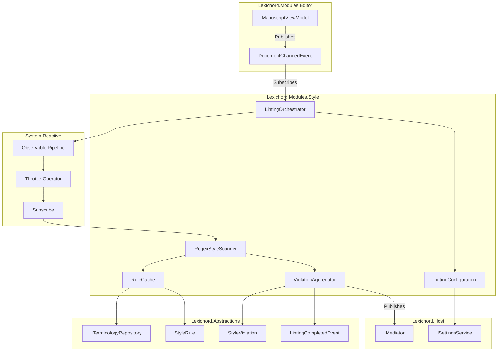
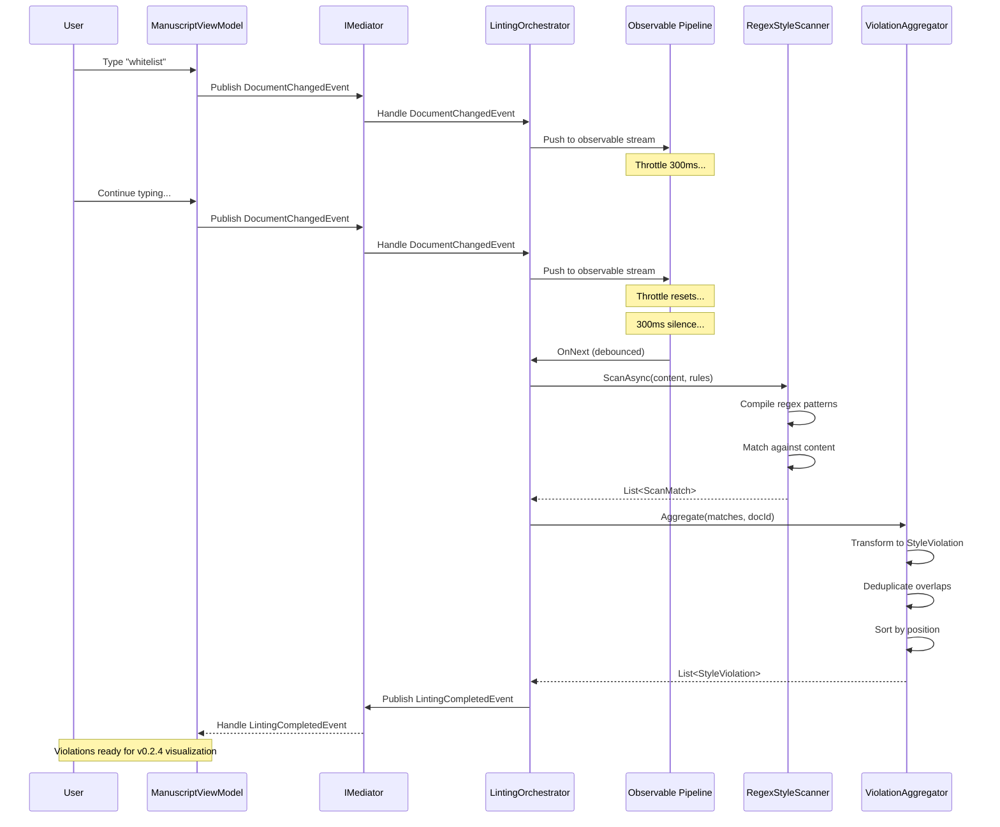

# LCS-INF-023: Feature Design Specification — The Critic (Linter Engine)

## 1. Metadata & Categorization

| Field                | Value                                    | Description                                           |
| :------------------- | :--------------------------------------- | :---------------------------------------------------- |
| **Feature ID**       | `INF-023`                                | Infrastructure - Linter Engine                        |
| **Feature Name**     | The Critic (Linter Engine)               | Real-time style analysis engine                       |
| **Target Version**   | `v0.2.3`                                 | Governance Module Phase 1                             |
| **Module Scope**     | `Lexichord.Modules.Style`                | Style governance module                               |
| **Swimlane**         | `Product`                                | Core User-Facing Feature                              |
| **License Tier**     | `Core`                                   | Foundation (Available in Free tier)                   |
| **Feature Gate Key** | N/A                                      | No runtime gating for core linting                    |
| **Author**           | System Architect                         |                                                       |
| **Status**           | **Draft**                                | Pending implementation                                |
| **Last Updated**     | 2026-01-26                               |                                                       |

---

## 2. Executive Summary

### 2.1 The Requirement

Lexichord needs a **real-time style analysis engine** that:

- Monitors document changes and identifies style violations as users type.
- Operates efficiently without blocking the UI or causing input lag.
- Supports large rule sets (1000+ terms) without performance degradation.
- Provides detailed violation data for downstream visualization (v0.2.4).
- Scales from single-paragraph checks to full-document scans.

Without this module, Lexichord has rules but no enforcement mechanism.

### 2.2 The Proposed Solution

We **SHALL** implement a complete Linter Engine with:

1. **v0.2.3a: Reactive Pipeline** — System.Reactive subscription to TextChanged events.
2. **v0.2.3b: Debounce Logic** — 300ms throttle preventing per-keystroke scanning.
3. **v0.2.3c: The Scanner (Regex)** — Pattern matching engine with optimization.
4. **v0.2.3d: Violation Aggregator** — Transform matches to violations and publish events.

---

## 3. Architecture & Modular Strategy

### 3.1 High-Level Architecture



### 3.2 Linting Pipeline Sequence



### 3.3 Dependencies

**NuGet Packages:**

| Package | Version | Purpose |
|:--------|:--------|:--------|
| `System.Reactive` | 6.x | Reactive Extensions for .NET |
| `System.Reactive.Linq` | 6.x | LINQ operators for observables |

**Project References:**

| Project | Reference Direction |
|:--------|:--------------------|
| `Lexichord.Modules.Style` | -> `Lexichord.Abstractions` |
| `Lexichord.Modules.Style` | -> `Lexichord.Modules.Editor` (for events) |
| `Lexichord.Host` | -> `Lexichord.Modules.Style` (module load) |

### 3.4 Licensing Behavior

- **Core License:** Full linting functionality available in Free tier.
- **WriterPro License:** AI-powered suggestions (future v0.3.x).
- **Enterprise License:** Custom rule packages and team sharing (future).

---

## 4. Decision Tree: Linting Operations

```text
START: "Document change detected"
|
+-- Is linting enabled for this document?
|   +-- NO -> Exit (no action)
|   +-- YES -> Continue
|
+-- Push change to observable stream
|   +-- Throttle active?
|       +-- YES -> Reset throttle timer
|       +-- NO -> Start throttle timer
|
+-- Throttle timer expires (300ms silence)
|   +-- Fetch current document content
|   +-- Fetch active rules from cache
|
+-- Determine scan scope
|   +-- Document > 100 pages?
|   |   +-- YES -> Scan visible viewport only
|   |   +-- NO -> Continue
|   +-- Is incremental scan possible?
|       +-- YES -> Scan modified paragraph only
|       +-- NO -> Scan full document
|
+-- Execute scan
|   +-- For each rule:
|       +-- Get compiled regex (from cache)
|       +-- Execute Regex.Matches()
|       +-- Timeout exceeded?
|           +-- YES -> Skip rule, log warning
|           +-- NO -> Collect matches
|
+-- Aggregate results
|   +-- Transform matches to violations
|   +-- Deduplicate overlapping violations
|   +-- Sort by document position
|   +-- Cap at max violations limit
|
+-- Publish results
|   +-- Emit LintingCompletedEvent
|   +-- Update violation cache
|
END
```

---

## 5. Data Contracts

### 5.1 ILintingOrchestrator Interface

```csharp
namespace Lexichord.Abstractions.Contracts;

/// <summary>
/// Orchestrates the linting pipeline for documents.
/// </summary>
/// <remarks>
/// LOGIC: The LintingOrchestrator is the central coordinator for all linting
/// operations. It manages observable subscriptions, coordinates debouncing,
/// and triggers scan operations. Each document has its own subscription.
///
/// Thread Safety:
/// - Subscriptions are managed per-document
/// - Scan operations run on background threads
/// - Results are marshalled to appropriate context
/// </remarks>
public interface ILintingOrchestrator : IDisposable
{
    /// <summary>
    /// Starts linting for a specific document.
    /// </summary>
    /// <param name="document">The document to lint.</param>
    /// <remarks>
    /// LOGIC: Creates an observable subscription to the document's
    /// TextChanged events. Idempotent - calling multiple times for
    /// the same document has no effect.
    /// </remarks>
    void StartLinting(IManuscriptViewModel document);

    /// <summary>
    /// Stops linting for a specific document.
    /// </summary>
    /// <param name="documentId">The document ID to stop linting.</param>
    /// <remarks>
    /// LOGIC: Disposes the subscription and clears cached violations.
    /// Safe to call for documents that aren't being linted.
    /// </remarks>
    void StopLinting(string documentId);

    /// <summary>
    /// Forces an immediate lint of a document, bypassing debounce.
    /// </summary>
    /// <param name="documentId">The document ID to lint.</param>
    /// <param name="cancellationToken">Cancellation token.</param>
    /// <returns>The linting result.</returns>
    Task<LintingResult> LintNowAsync(
        string documentId,
        CancellationToken cancellationToken = default);

    /// <summary>
    /// Gets whether a document is currently being linted.
    /// </summary>
    /// <param name="documentId">The document ID to check.</param>
    /// <returns>True if linting is active.</returns>
    bool IsLinting(string documentId);

    /// <summary>
    /// Observable stream of linting results.
    /// </summary>
    /// <remarks>
    /// LOGIC: Subscribers receive all linting results across all documents.
    /// Filter by DocumentId if only interested in specific documents.
    /// </remarks>
    IObservable<LintingResult> LintingResults { get; }

    /// <summary>
    /// Gets the most recent violations for a document.
    /// </summary>
    /// <param name="documentId">The document ID.</param>
    /// <returns>List of violations, empty if none.</returns>
    IReadOnlyList<StyleViolation> GetViolations(string documentId);
}
```

### 5.2 IStyleScanner Interface

```csharp
namespace Lexichord.Abstractions.Contracts;

/// <summary>
/// Scans document content for style rule violations.
/// </summary>
/// <remarks>
/// LOGIC: The scanner is stateless and performs pattern matching
/// against provided content. It does not manage subscriptions or
/// caching - that responsibility belongs to the orchestrator.
/// </remarks>
public interface IStyleScanner
{
    /// <summary>
    /// Scans content against a set of rules.
    /// </summary>
    /// <param name="content">The document content to scan.</param>
    /// <param name="rules">The rules to check against.</param>
    /// <param name="options">Scan configuration options.</param>
    /// <param name="cancellationToken">Cancellation token.</param>
    /// <returns>List of scan matches.</returns>
    /// <remarks>
    /// LOGIC: Iterates through rules and executes regex patterns.
    /// Respects timeout settings to prevent ReDoS attacks.
    /// </remarks>
    Task<IReadOnlyList<ScanMatch>> ScanAsync(
        string content,
        IEnumerable<StyleRule> rules,
        ScanOptions options,
        CancellationToken cancellationToken = default);

    /// <summary>
    /// Scans a specific range within content.
    /// </summary>
    /// <param name="content">The full document content.</param>
    /// <param name="startOffset">Start offset of range.</param>
    /// <param name="endOffset">End offset of range.</param>
    /// <param name="rules">The rules to check against.</param>
    /// <param name="cancellationToken">Cancellation token.</param>
    /// <returns>List of scan matches within range.</returns>
    /// <remarks>
    /// LOGIC: Optimized for incremental scanning. Matches are
    /// returned with offsets relative to full document.
    /// </remarks>
    Task<IReadOnlyList<ScanMatch>> ScanRangeAsync(
        string content,
        int startOffset,
        int endOffset,
        IEnumerable<StyleRule> rules,
        CancellationToken cancellationToken = default);
}

/// <summary>
/// Options for scan operations.
/// </summary>
/// <param name="RegexTimeout">Maximum time for single regex execution.</param>
/// <param name="MaxMatches">Maximum matches to return per rule.</param>
/// <param name="IncludeDisabledRules">Whether to include disabled rules.</param>
public record ScanOptions(
    TimeSpan RegexTimeout,
    int MaxMatches = 1000,
    bool IncludeDisabledRules = false
)
{
    /// <summary>
    /// Default scan options.
    /// </summary>
    public static ScanOptions Default { get; } = new(
        RegexTimeout: TimeSpan.FromMilliseconds(100),
        MaxMatches: 1000,
        IncludeDisabledRules: false
    );
}

/// <summary>
/// Represents a pattern match found during scanning.
/// </summary>
/// <param name="RuleId">The ID of the matched rule.</param>
/// <param name="StartOffset">Start position in document.</param>
/// <param name="Length">Length of matched text.</param>
/// <param name="MatchedText">The actual text that matched.</param>
/// <param name="Rule">Reference to the matched rule.</param>
public record ScanMatch(
    string RuleId,
    int StartOffset,
    int Length,
    string MatchedText,
    StyleRule Rule
);
```

### 5.3 StyleViolation Record

```csharp
namespace Lexichord.Abstractions.Contracts;

/// <summary>
/// Represents a style rule violation in a document.
/// </summary>
/// <remarks>
/// LOGIC: StyleViolation is the primary data structure passed to
/// visualization components (v0.2.4). It contains all information
/// needed to display and fix the violation.
/// </remarks>
/// <param name="Id">Unique identifier for this violation instance.</param>
/// <param name="DocumentId">The document containing the violation.</param>
/// <param name="RuleId">The rule that was violated.</param>
/// <param name="StartOffset">Start position in document (0-based).</param>
/// <param name="Length">Length of violating text.</param>
/// <param name="Line">Line number (1-based).</param>
/// <param name="Column">Column number (1-based).</param>
/// <param name="ViolatingText">The text that caused the violation.</param>
/// <param name="Message">Human-readable violation message.</param>
/// <param name="Severity">Violation severity level.</param>
/// <param name="Suggestion">Recommended replacement text (nullable).</param>
/// <param name="Category">Rule category for grouping.</param>
public record StyleViolation(
    string Id,
    string DocumentId,
    string RuleId,
    int StartOffset,
    int Length,
    int Line,
    int Column,
    string ViolatingText,
    string Message,
    ViolationSeverity Severity,
    string? Suggestion,
    RuleCategory Category
)
{
    /// <summary>
    /// Gets the end offset of the violation.
    /// </summary>
    public int EndOffset => StartOffset + Length;

    /// <summary>
    /// Gets whether this violation has a suggested fix.
    /// </summary>
    public bool HasSuggestion => !string.IsNullOrEmpty(Suggestion);

    /// <summary>
    /// Creates a new violation with updated position.
    /// </summary>
    /// <remarks>
    /// LOGIC: Used when document edits shift violation positions.
    /// </remarks>
    public StyleViolation WithOffset(int delta) =>
        this with
        {
            StartOffset = StartOffset + delta,
            // Line/Column would need recalculation
        };
}
```

### 5.4 LintingResult and Events

```csharp
namespace Lexichord.Abstractions.Contracts;

/// <summary>
/// Result of a linting operation.
/// </summary>
/// <param name="DocumentId">The linted document ID.</param>
/// <param name="Violations">List of detected violations.</param>
/// <param name="ScanDuration">How long the scan took.</param>
/// <param name="RulesChecked">Number of rules evaluated.</param>
/// <param name="ContentLength">Length of scanned content.</param>
/// <param name="WasPartialScan">Whether this was a partial/incremental scan.</param>
/// <param name="Timestamp">When the lint completed.</param>
public record LintingResult(
    string DocumentId,
    IReadOnlyList<StyleViolation> Violations,
    TimeSpan ScanDuration,
    int RulesChecked,
    int ContentLength,
    bool WasPartialScan,
    DateTimeOffset Timestamp
)
{
    /// <summary>
    /// Gets the total violation count.
    /// </summary>
    public int ViolationCount => Violations.Count;

    /// <summary>
    /// Gets violations grouped by severity.
    /// </summary>
    public ILookup<ViolationSeverity, StyleViolation> BySeverity =>
        Violations.ToLookup(v => v.Severity);

    /// <summary>
    /// Gets the error count.
    /// </summary>
    public int ErrorCount => Violations.Count(v => v.Severity == ViolationSeverity.Error);

    /// <summary>
    /// Gets the warning count.
    /// </summary>
    public int WarningCount => Violations.Count(v => v.Severity == ViolationSeverity.Warning);
}

namespace Lexichord.Abstractions.Events;

using MediatR;

/// <summary>
/// Event published when linting completes for a document.
/// </summary>
/// <param name="Result">The complete linting result.</param>
public record LintingCompletedEvent(LintingResult Result) : INotification;

/// <summary>
/// Event published when linting starts for a document.
/// </summary>
/// <param name="DocumentId">The document being linted.</param>
public record LintingStartedEvent(string DocumentId) : INotification;

/// <summary>
/// Event published when a linting operation is cancelled.
/// </summary>
/// <param name="DocumentId">The document whose lint was cancelled.</param>
/// <param name="Reason">Why the lint was cancelled.</param>
public record LintingCancelledEvent(
    string DocumentId,
    string Reason
) : INotification;
```

### 5.5 ILintingConfiguration Interface

```csharp
namespace Lexichord.Abstractions.Contracts;

/// <summary>
/// Configuration for linting behavior.
/// </summary>
/// <remarks>
/// LOGIC: These settings control performance vs. responsiveness
/// tradeoffs. Defaults are tuned for typical usage.
/// </remarks>
public interface ILintingConfiguration
{
    /// <summary>
    /// Debounce interval between text changes and scan start.
    /// </summary>
    /// <remarks>
    /// LOGIC: 300ms is optimal for typing - fast enough to feel
    /// responsive, slow enough to batch rapid keystrokes.
    /// </remarks>
    TimeSpan DebounceInterval { get; }

    /// <summary>
    /// Maximum duration for a single lint operation.
    /// </summary>
    /// <remarks>
    /// LOGIC: Prevents runaway scans from blocking the pipeline.
    /// </remarks>
    TimeSpan MaxLintDuration { get; }

    /// <summary>
    /// Maximum time for a single regex pattern execution.
    /// </summary>
    TimeSpan RegexTimeout { get; }

    /// <summary>
    /// Whether to only lint the visible viewport for large documents.
    /// </summary>
    bool LintOnlyVisibleRange { get; }

    /// <summary>
    /// Threshold (in lines) above which viewport-only linting activates.
    /// </summary>
    int LargeDocumentThreshold { get; }

    /// <summary>
    /// Maximum violations to return per document.
    /// </summary>
    int MaxViolationsPerDocument { get; }

    /// <summary>
    /// Whether linting is enabled globally.
    /// </summary>
    bool IsEnabled { get; }
}
```

### 5.6 IViolationAggregator Interface

```csharp
namespace Lexichord.Abstractions.Contracts;

/// <summary>
/// Aggregates scan matches into violations and manages violation state.
/// </summary>
/// <remarks>
/// LOGIC: The aggregator transforms raw regex matches into user-facing
/// violations. It handles deduplication, sorting, and caching.
/// </remarks>
public interface IViolationAggregator
{
    /// <summary>
    /// Aggregates scan matches into violations.
    /// </summary>
    /// <param name="matches">Raw matches from scanner.</param>
    /// <param name="documentId">The document ID.</param>
    /// <param name="content">Document content for position calculation.</param>
    /// <returns>Aggregated and processed violations.</returns>
    /// <remarks>
    /// LOGIC: Performs the following transformations:
    /// 1. Convert ScanMatch to StyleViolation with line/column
    /// 2. Deduplicate overlapping violations (keep highest severity)
    /// 3. Sort by document position (top to bottom)
    /// 4. Cap at maximum violations limit
    /// </remarks>
    IReadOnlyList<StyleViolation> Aggregate(
        IEnumerable<ScanMatch> matches,
        string documentId,
        string content);

    /// <summary>
    /// Clears cached violations for a document.
    /// </summary>
    /// <param name="documentId">The document ID.</param>
    void ClearViolations(string documentId);

    /// <summary>
    /// Gets cached violations for a document.
    /// </summary>
    /// <param name="documentId">The document ID.</param>
    /// <returns>Cached violations, empty if none.</returns>
    IReadOnlyList<StyleViolation> GetViolations(string documentId);

    /// <summary>
    /// Gets a specific violation by ID.
    /// </summary>
    /// <param name="documentId">The document ID.</param>
    /// <param name="violationId">The violation ID.</param>
    /// <returns>The violation, or null if not found.</returns>
    StyleViolation? GetViolation(string documentId, string violationId);

    /// <summary>
    /// Gets the violation at a specific document offset.
    /// </summary>
    /// <param name="documentId">The document ID.</param>
    /// <param name="offset">The document offset.</param>
    /// <returns>The violation at offset, or null if none.</returns>
    StyleViolation? GetViolationAt(string documentId, int offset);
}
```

---

## 6. Implementation Logic

### 6.1 StyleModule Extension

```csharp
using Lexichord.Abstractions.Contracts;
using Microsoft.Extensions.DependencyInjection;
using Microsoft.Extensions.Logging;

namespace Lexichord.Modules.Style;

/// <summary>
/// Module registration for the Style module (extended for v0.2.3).
/// </summary>
/// <remarks>
/// LOGIC: v0.2.3 adds linting services to the existing Style module
/// from v0.2.1 and v0.2.2.
/// </remarks>
public partial class StyleModule : IModule
{
    public string Name => "Style";
    public string Description => "Style governance and terminology enforcement";
    public Version Version => new(0, 2, 3);
    public LicenseTier RequiredTier => LicenseTier.Core;

    public void ConfigureServices(IServiceCollection services)
    {
        // v0.2.1 services
        services.AddSingleton<IStyleSheetLoader, YamlStyleSheetLoader>();
        services.AddSingleton<IStyleRuleCache, StyleRuleCache>();

        // v0.2.2 services
        services.AddSingleton<ITerminologyRepository, DapperTerminologyRepository>();
        services.AddSingleton<ITerminologyService, TerminologyService>();

        // v0.2.3 services - Linter Engine
        services.AddSingleton<ILintingConfiguration, LintingConfiguration>();
        services.AddSingleton<IStyleScanner, RegexStyleScanner>();
        services.AddSingleton<IViolationAggregator, ViolationAggregator>();
        services.AddSingleton<ILintingOrchestrator, LintingOrchestrator>();
    }

    public async Task InitializeAsync(IServiceProvider services)
    {
        var logger = services.GetRequiredService<ILogger<StyleModule>>();
        logger.LogInformation("Initializing Style module v{Version}", Version);

        // Initialize terminology repository
        var termRepo = services.GetRequiredService<ITerminologyRepository>();
        await termRepo.InitializeAsync();

        // Pre-compile regex patterns
        var scanner = services.GetRequiredService<IStyleScanner>();
        if (scanner is RegexStyleScanner regexScanner)
        {
            await regexScanner.WarmupCacheAsync();
        }

        logger.LogInformation("Style module initialized successfully");
    }

    public Task ShutdownAsync()
    {
        // Dispose linting orchestrator
        return Task.CompletedTask;
    }
}
```

### 6.2 LintingOrchestrator Implementation

```csharp
using System.Collections.Concurrent;
using System.Reactive.Linq;
using System.Reactive.Subjects;
using Lexichord.Abstractions.Contracts;
using Lexichord.Abstractions.Events;
using MediatR;
using Microsoft.Extensions.Logging;

namespace Lexichord.Modules.Style.Services;

/// <summary>
/// Orchestrates the linting pipeline using reactive extensions.
/// </summary>
/// <remarks>
/// LOGIC: The orchestrator creates a per-document observable subscription
/// that debounces text changes and triggers scans. It coordinates between
/// the scanner, aggregator, and event publishing.
///
/// Thread Safety:
/// - Document subscriptions stored in ConcurrentDictionary
/// - Scans run on TaskPool threads
/// - Results published through Subject (thread-safe)
/// </remarks>
public sealed class LintingOrchestrator : ILintingOrchestrator
{
    private readonly IStyleScanner _scanner;
    private readonly IViolationAggregator _aggregator;
    private readonly ILintingConfiguration _config;
    private readonly IStyleRuleCache _ruleCache;
    private readonly IMediator _mediator;
    private readonly ILogger<LintingOrchestrator> _logger;

    private readonly ConcurrentDictionary<string, DocumentLintState> _documentStates = new();
    private readonly Subject<LintingResult> _resultsSubject = new();
    private bool _disposed;

    public LintingOrchestrator(
        IStyleScanner scanner,
        IViolationAggregator aggregator,
        ILintingConfiguration config,
        IStyleRuleCache ruleCache,
        IMediator mediator,
        ILogger<LintingOrchestrator> logger)
    {
        _scanner = scanner;
        _aggregator = aggregator;
        _config = config;
        _ruleCache = ruleCache;
        _mediator = mediator;
        _logger = logger;
    }

    /// <inheritdoc/>
    public IObservable<LintingResult> LintingResults => _resultsSubject.AsObservable();

    /// <inheritdoc/>
    public void StartLinting(IManuscriptViewModel document)
    {
        ObjectDisposedException.ThrowIf(_disposed, this);

        if (_documentStates.ContainsKey(document.Id))
        {
            _logger.LogDebug("Linting already active for document {DocumentId}", document.Id);
            return;
        }

        _logger.LogInformation("Starting linting for document {DocumentId}", document.Id);

        var state = new DocumentLintState(document);

        // LOGIC: Create observable from PropertyChanged events on Content
        var contentChanges = Observable
            .FromEventPattern<PropertyChangedEventHandler, PropertyChangedEventArgs>(
                h => document.PropertyChanged += h,
                h => document.PropertyChanged -= h)
            .Where(e => e.EventArgs.PropertyName == nameof(IManuscriptViewModel.Content))
            .Select(_ => document.Content);

        // LOGIC: Apply debounce (Throttle in Rx terminology)
        var subscription = contentChanges
            .Throttle(_config.DebounceInterval)
            .Subscribe(
                content => _ = ExecuteLintAsync(document.Id, content, state.CancellationTokenSource.Token),
                error => _logger.LogError(error, "Linting subscription error for {DocumentId}", document.Id)
            );

        state.Subscription = subscription;
        _documentStates[document.Id] = state;
    }

    /// <inheritdoc/>
    public void StopLinting(string documentId)
    {
        if (_documentStates.TryRemove(documentId, out var state))
        {
            _logger.LogInformation("Stopping linting for document {DocumentId}", documentId);

            state.CancellationTokenSource.Cancel();
            state.Subscription?.Dispose();
            state.CancellationTokenSource.Dispose();

            _aggregator.ClearViolations(documentId);
        }
    }

    /// <inheritdoc/>
    public async Task<LintingResult> LintNowAsync(
        string documentId,
        CancellationToken cancellationToken = default)
    {
        if (!_documentStates.TryGetValue(documentId, out var state))
        {
            throw new InvalidOperationException($"Document {documentId} is not being linted");
        }

        return await ExecuteLintAsync(
            documentId,
            state.Document.Content,
            cancellationToken);
    }

    /// <inheritdoc/>
    public bool IsLinting(string documentId) => _documentStates.ContainsKey(documentId);

    /// <inheritdoc/>
    public IReadOnlyList<StyleViolation> GetViolations(string documentId) =>
        _aggregator.GetViolations(documentId);

    private async Task<LintingResult> ExecuteLintAsync(
        string documentId,
        string content,
        CancellationToken cancellationToken)
    {
        if (!_config.IsEnabled)
        {
            return new LintingResult(
                documentId,
                Array.Empty<StyleViolation>(),
                TimeSpan.Zero,
                0,
                content.Length,
                false,
                DateTimeOffset.UtcNow);
        }

        _logger.LogDebug(
            "Executing lint for document {DocumentId} ({Length} chars)",
            documentId, content.Length);

        var stopwatch = System.Diagnostics.Stopwatch.StartNew();

        try
        {
            // LOGIC: Notify lint started
            await _mediator.Publish(new LintingStartedEvent(documentId), cancellationToken);

            // LOGIC: Get active rules
            var rules = await _ruleCache.GetActiveRulesAsync(cancellationToken);

            // LOGIC: Execute scan
            var scanOptions = ScanOptions.Default with
            {
                RegexTimeout = _config.RegexTimeout
            };

            var matches = await _scanner.ScanAsync(
                content,
                rules,
                scanOptions,
                cancellationToken);

            // LOGIC: Aggregate into violations
            var violations = _aggregator.Aggregate(matches, documentId, content);

            stopwatch.Stop();

            var result = new LintingResult(
                documentId,
                violations,
                stopwatch.Elapsed,
                rules.Count,
                content.Length,
                WasPartialScan: false,
                DateTimeOffset.UtcNow);

            // LOGIC: Publish completion event
            await _mediator.Publish(new LintingCompletedEvent(result), cancellationToken);

            // LOGIC: Emit to observable stream
            _resultsSubject.OnNext(result);

            _logger.LogDebug(
                "Lint completed for {DocumentId}: {ViolationCount} violations in {Duration}ms",
                documentId, result.ViolationCount, stopwatch.ElapsedMilliseconds);

            return result;
        }
        catch (OperationCanceledException)
        {
            _logger.LogDebug("Lint cancelled for document {DocumentId}", documentId);
            await _mediator.Publish(
                new LintingCancelledEvent(documentId, "Operation cancelled"),
                CancellationToken.None);
            throw;
        }
        catch (Exception ex)
        {
            _logger.LogError(ex, "Lint failed for document {DocumentId}", documentId);
            throw;
        }
    }

    public void Dispose()
    {
        if (_disposed)
            return;

        _disposed = true;

        foreach (var documentId in _documentStates.Keys.ToList())
        {
            StopLinting(documentId);
        }

        _resultsSubject.Dispose();
    }

    /// <summary>
    /// Internal state for a document being linted.
    /// </summary>
    private sealed class DocumentLintState
    {
        public IManuscriptViewModel Document { get; }
        public CancellationTokenSource CancellationTokenSource { get; } = new();
        public IDisposable? Subscription { get; set; }

        public DocumentLintState(IManuscriptViewModel document)
        {
            Document = document;
        }
    }
}
```

### 6.3 Module Folder Structure

```text
src/Lexichord.Modules.Style/
├── StyleModule.cs
├── Lexichord.Modules.Style.csproj
├── Configuration/
│   ├── LintingConfiguration.cs
│   └── StyleSettings.cs
├── Services/
│   ├── LintingOrchestrator.cs
│   ├── RegexStyleScanner.cs
│   ├── ViolationAggregator.cs
│   ├── StyleRuleCache.cs
│   └── TerminologyService.cs (v0.2.2)
├── Repositories/
│   └── DapperTerminologyRepository.cs (v0.2.2)
└── Resources/
    └── lexichord.yaml (default rules)
```

---

## 7. Use Cases & User Stories

### 7.1 User Stories

| ID | Role | Story | Acceptance Criteria |
|:---|:-----|:------|:--------------------|
| US-01 | Writer | As a writer, I want style violations detected automatically as I type. | Violations appear within 500ms of typing pause. |
| US-02 | Writer | As a writer, I want typing to remain smooth without lag. | No perceptible input delay during linting. |
| US-03 | Writer | As a writer, I want to see why text is flagged. | Violations include message and suggestion. |
| US-04 | Admin | As an admin, I want to configure debounce timing. | Settings UI allows 100-1000ms range. |
| US-05 | Admin | As an admin, I want to disable linting if needed. | Global toggle in settings. |
| US-06 | Developer | As a developer, I want linting events I can subscribe to. | LintingCompletedEvent published via MediatR. |

### 7.2 Use Cases

#### UC-01: Real-Time Linting During Editing

**Preconditions:**
- Document is open in editor.
- Style rules are loaded (v0.2.1).
- Terminology database is populated (v0.2.2).

**Flow:**
1. User types "whitelist" in the document.
2. DocumentChangedEvent fires.
3. LintingOrchestrator receives event via subscription.
4. Throttle timer starts (300ms).
5. User continues typing "s are bad".
6. Throttle timer resets.
7. User pauses typing.
8. 300ms passes, throttle triggers.
9. Scanner executes against full content.
10. "whitelist" matches rule "use allowlist instead".
11. Aggregator creates StyleViolation.
12. LintingCompletedEvent published.
13. (v0.2.4 will visualize the violation)

**Postconditions:**
- StyleViolation created with position, message, suggestion.
- Event published for downstream consumers.

---

#### UC-02: Large Document Viewport Scanning

**Preconditions:**
- Document has 50,000 lines (>100 pages).
- LintOnlyVisibleRange is enabled.

**Flow:**
1. User types at line 25,000.
2. Throttle triggers scan.
3. Scanner detects large document.
4. Scanner determines visible viewport (lines 24,900-25,100).
5. Scan executes only on viewport content.
6. Results limited to viewport range.
7. LintingResult.WasPartialScan = true.

**Postconditions:**
- Scan completes in <100ms.
- Only visible violations reported.

---

## 8. Observability & Logging

### 8.1 Log Events

| Level | Context | Message Template |
|:------|:--------|:-----------------|
| Information | StyleModule | `Initializing Style module v{Version}` |
| Information | StyleModule | `Style module initialized successfully` |
| Information | LintingOrchestrator | `Starting linting for document {DocumentId}` |
| Information | LintingOrchestrator | `Stopping linting for document {DocumentId}` |
| Debug | LintingOrchestrator | `Linting already active for document {DocumentId}` |
| Debug | LintingOrchestrator | `Executing lint for document {DocumentId} ({Length} chars)` |
| Debug | LintingOrchestrator | `Lint completed for {DocumentId}: {ViolationCount} violations in {Duration}ms` |
| Debug | LintingOrchestrator | `Lint cancelled for document {DocumentId}` |
| Error | LintingOrchestrator | `Lint failed for document {DocumentId}` |
| Debug | RegexStyleScanner | `Scanning with {RuleCount} rules` |
| Debug | RegexStyleScanner | `Rule {RuleId} found {MatchCount} matches` |
| Warning | RegexStyleScanner | `Rule {RuleId} regex timeout after {Timeout}ms` |
| Debug | ViolationAggregator | `Aggregated {InputCount} matches to {OutputCount} violations` |
| Debug | ViolationAggregator | `Deduplicated {Count} overlapping violations` |

### 8.2 Metrics

| Metric | Type | Description |
|:-------|:-----|:------------|
| `linting.scan.duration_ms` | Histogram | Time to complete scan |
| `linting.scan.violations` | Counter | Total violations detected |
| `linting.scan.rules_checked` | Gauge | Rules evaluated per scan |
| `linting.debounce.triggered` | Counter | Debounce triggers |
| `linting.debounce.cancelled` | Counter | Cancelled due to continued typing |
| `linting.regex.timeout` | Counter | Regex timeout occurrences |

---

## 9. Unit Testing Requirements

### 9.1 LintingOrchestrator Tests

```csharp
[TestFixture]
[Category("Unit")]
public class LintingOrchestratorTests
{
    private Mock<IStyleScanner> _mockScanner = null!;
    private Mock<IViolationAggregator> _mockAggregator = null!;
    private Mock<ILintingConfiguration> _mockConfig = null!;
    private Mock<IStyleRuleCache> _mockRuleCache = null!;
    private Mock<IMediator> _mockMediator = null!;
    private Mock<ILogger<LintingOrchestrator>> _mockLogger = null!;
    private LintingOrchestrator _sut = null!;

    [SetUp]
    public void SetUp()
    {
        _mockScanner = new Mock<IStyleScanner>();
        _mockAggregator = new Mock<IViolationAggregator>();
        _mockConfig = new Mock<ILintingConfiguration>();
        _mockRuleCache = new Mock<IStyleRuleCache>();
        _mockMediator = new Mock<IMediator>();
        _mockLogger = new Mock<ILogger<LintingOrchestrator>>();

        _mockConfig.Setup(c => c.DebounceInterval).Returns(TimeSpan.FromMilliseconds(100));
        _mockConfig.Setup(c => c.IsEnabled).Returns(true);
        _mockConfig.Setup(c => c.RegexTimeout).Returns(TimeSpan.FromMilliseconds(100));

        _mockRuleCache
            .Setup(c => c.GetActiveRulesAsync(It.IsAny<CancellationToken>()))
            .ReturnsAsync(new List<StyleRule>());

        _mockScanner
            .Setup(s => s.ScanAsync(
                It.IsAny<string>(),
                It.IsAny<IEnumerable<StyleRule>>(),
                It.IsAny<ScanOptions>(),
                It.IsAny<CancellationToken>()))
            .ReturnsAsync(new List<ScanMatch>());

        _mockAggregator
            .Setup(a => a.Aggregate(
                It.IsAny<IEnumerable<ScanMatch>>(),
                It.IsAny<string>(),
                It.IsAny<string>()))
            .Returns(new List<StyleViolation>());

        _sut = new LintingOrchestrator(
            _mockScanner.Object,
            _mockAggregator.Object,
            _mockConfig.Object,
            _mockRuleCache.Object,
            _mockMediator.Object,
            _mockLogger.Object);
    }

    [TearDown]
    public void TearDown()
    {
        _sut.Dispose();
    }

    [Test]
    public void StartLinting_NewDocument_CreatesSubscription()
    {
        // Arrange
        var mockDocument = CreateMockDocument("doc-1");

        // Act
        _sut.StartLinting(mockDocument.Object);

        // Assert
        Assert.That(_sut.IsLinting("doc-1"), Is.True);
    }

    [Test]
    public void StartLinting_SameDocumentTwice_NoEffect()
    {
        // Arrange
        var mockDocument = CreateMockDocument("doc-1");
        _sut.StartLinting(mockDocument.Object);

        // Act - second call
        _sut.StartLinting(mockDocument.Object);

        // Assert - should not throw, still linting
        Assert.That(_sut.IsLinting("doc-1"), Is.True);
    }

    [Test]
    public void StopLinting_ActiveDocument_RemovesSubscription()
    {
        // Arrange
        var mockDocument = CreateMockDocument("doc-1");
        _sut.StartLinting(mockDocument.Object);

        // Act
        _sut.StopLinting("doc-1");

        // Assert
        Assert.That(_sut.IsLinting("doc-1"), Is.False);
    }

    [Test]
    public void StopLinting_UnknownDocument_NoError()
    {
        // Act & Assert - should not throw
        Assert.DoesNotThrow(() => _sut.StopLinting("unknown-doc"));
    }

    [Test]
    public async Task LintNowAsync_ActiveDocument_ExecutesScan()
    {
        // Arrange
        var mockDocument = CreateMockDocument("doc-1", "test content");
        _sut.StartLinting(mockDocument.Object);

        // Act
        var result = await _sut.LintNowAsync("doc-1");

        // Assert
        Assert.That(result.DocumentId, Is.EqualTo("doc-1"));
        _mockScanner.Verify(s => s.ScanAsync(
            "test content",
            It.IsAny<IEnumerable<StyleRule>>(),
            It.IsAny<ScanOptions>(),
            It.IsAny<CancellationToken>()), Times.Once);
    }

    [Test]
    public void LintNowAsync_InactiveDocument_ThrowsInvalidOperation()
    {
        // Act & Assert
        Assert.ThrowsAsync<InvalidOperationException>(
            async () => await _sut.LintNowAsync("unknown-doc"));
    }

    [Test]
    public async Task LintNowAsync_PublishesEvents()
    {
        // Arrange
        var mockDocument = CreateMockDocument("doc-1", "content");
        _sut.StartLinting(mockDocument.Object);

        // Act
        await _sut.LintNowAsync("doc-1");

        // Assert
        _mockMediator.Verify(m => m.Publish(
            It.IsAny<LintingStartedEvent>(),
            It.IsAny<CancellationToken>()), Times.Once);

        _mockMediator.Verify(m => m.Publish(
            It.IsAny<LintingCompletedEvent>(),
            It.IsAny<CancellationToken>()), Times.Once);
    }

    [Test]
    public void GetViolations_DelegatesToAggregator()
    {
        // Arrange
        var violations = new List<StyleViolation>
        {
            CreateViolation("doc-1", "viol-1")
        };
        _mockAggregator
            .Setup(a => a.GetViolations("doc-1"))
            .Returns(violations);

        // Act
        var result = _sut.GetViolations("doc-1");

        // Assert
        Assert.That(result, Is.EqualTo(violations));
    }

    [Test]
    public void Dispose_CleansUpAllSubscriptions()
    {
        // Arrange
        var doc1 = CreateMockDocument("doc-1");
        var doc2 = CreateMockDocument("doc-2");
        _sut.StartLinting(doc1.Object);
        _sut.StartLinting(doc2.Object);

        // Act
        _sut.Dispose();

        // Assert
        Assert.Multiple(() =>
        {
            Assert.That(_sut.IsLinting("doc-1"), Is.False);
            Assert.That(_sut.IsLinting("doc-2"), Is.False);
        });
    }

    private static Mock<IManuscriptViewModel> CreateMockDocument(
        string id,
        string content = "")
    {
        var mock = new Mock<IManuscriptViewModel>();
        mock.Setup(d => d.Id).Returns(id);
        mock.Setup(d => d.Content).Returns(content);
        return mock;
    }

    private static StyleViolation CreateViolation(string docId, string violId) =>
        new(
            Id: violId,
            DocumentId: docId,
            RuleId: "rule-1",
            StartOffset: 0,
            Length: 5,
            Line: 1,
            Column: 1,
            ViolatingText: "test",
            Message: "Test violation",
            Severity: ViolationSeverity.Warning,
            Suggestion: "fix",
            Category: RuleCategory.Terminology);
}
```

### 9.2 ViolationAggregator Tests

```csharp
[TestFixture]
[Category("Unit")]
public class ViolationAggregatorTests
{
    private ViolationAggregator _sut = null!;

    [SetUp]
    public void SetUp()
    {
        _sut = new ViolationAggregator();
    }

    [Test]
    public void Aggregate_EmptyMatches_ReturnsEmpty()
    {
        // Act
        var result = _sut.Aggregate(
            Enumerable.Empty<ScanMatch>(),
            "doc-1",
            "content");

        // Assert
        Assert.That(result, Is.Empty);
    }

    [Test]
    public void Aggregate_SingleMatch_ReturnsViolation()
    {
        // Arrange
        var rule = CreateRule("rule-1", "pattern", ViolationSeverity.Warning);
        var match = new ScanMatch("rule-1", 0, 5, "match", rule);

        // Act
        var result = _sut.Aggregate(new[] { match }, "doc-1", "match text");

        // Assert
        Assert.That(result, Has.Count.EqualTo(1));
        Assert.Multiple(() =>
        {
            Assert.That(result[0].RuleId, Is.EqualTo("rule-1"));
            Assert.That(result[0].StartOffset, Is.EqualTo(0));
            Assert.That(result[0].Length, Is.EqualTo(5));
            Assert.That(result[0].Line, Is.EqualTo(1));
            Assert.That(result[0].Column, Is.EqualTo(1));
        });
    }

    [Test]
    public void Aggregate_OverlappingMatches_KeepsHighestSeverity()
    {
        // Arrange
        var warningRule = CreateRule("warn", "pattern", ViolationSeverity.Warning);
        var errorRule = CreateRule("error", "pattern", ViolationSeverity.Error);

        var matches = new[]
        {
            new ScanMatch("warn", 0, 5, "match", warningRule),
            new ScanMatch("error", 0, 5, "match", errorRule)
        };

        // Act
        var result = _sut.Aggregate(matches, "doc-1", "match text");

        // Assert
        Assert.That(result, Has.Count.EqualTo(1));
        Assert.That(result[0].Severity, Is.EqualTo(ViolationSeverity.Error));
    }

    [Test]
    public void Aggregate_MultipleMatches_SortsByPosition()
    {
        // Arrange
        var rule = CreateRule("rule-1", "pattern", ViolationSeverity.Warning);
        var matches = new[]
        {
            new ScanMatch("rule-1", 20, 5, "third", rule),
            new ScanMatch("rule-1", 0, 5, "first", rule),
            new ScanMatch("rule-1", 10, 5, "second", rule)
        };

        // Act
        var result = _sut.Aggregate(matches, "doc-1", "first text second third");

        // Assert
        Assert.Multiple(() =>
        {
            Assert.That(result[0].StartOffset, Is.EqualTo(0));
            Assert.That(result[1].StartOffset, Is.EqualTo(10));
            Assert.That(result[2].StartOffset, Is.EqualTo(20));
        });
    }

    [Test]
    public void Aggregate_CalculatesLineAndColumn()
    {
        // Arrange
        var rule = CreateRule("rule-1", "pattern", ViolationSeverity.Warning);
        var content = "Line 1\nLine 2\nLine 3 match";
        var match = new ScanMatch("rule-1", 21, 5, "match", rule);

        // Act
        var result = _sut.Aggregate(new[] { match }, "doc-1", content);

        // Assert
        Assert.Multiple(() =>
        {
            Assert.That(result[0].Line, Is.EqualTo(3));
            Assert.That(result[0].Column, Is.EqualTo(8));
        });
    }

    [Test]
    public void GetViolations_AfterAggregate_ReturnsCached()
    {
        // Arrange
        var rule = CreateRule("rule-1", "pattern", ViolationSeverity.Warning);
        var match = new ScanMatch("rule-1", 0, 5, "match", rule);
        _sut.Aggregate(new[] { match }, "doc-1", "match text");

        // Act
        var result = _sut.GetViolations("doc-1");

        // Assert
        Assert.That(result, Has.Count.EqualTo(1));
    }

    [Test]
    public void ClearViolations_RemovesFromCache()
    {
        // Arrange
        var rule = CreateRule("rule-1", "pattern", ViolationSeverity.Warning);
        var match = new ScanMatch("rule-1", 0, 5, "match", rule);
        _sut.Aggregate(new[] { match }, "doc-1", "match text");

        // Act
        _sut.ClearViolations("doc-1");

        // Assert
        Assert.That(_sut.GetViolations("doc-1"), Is.Empty);
    }

    [Test]
    public void GetViolationAt_ReturnsMatchingViolation()
    {
        // Arrange
        var rule = CreateRule("rule-1", "pattern", ViolationSeverity.Warning);
        var match = new ScanMatch("rule-1", 10, 5, "match", rule);
        _sut.Aggregate(new[] { match }, "doc-1", "0123456789match");

        // Act
        var result = _sut.GetViolationAt("doc-1", 12);

        // Assert
        Assert.That(result, Is.Not.Null);
        Assert.That(result!.StartOffset, Is.EqualTo(10));
    }

    [Test]
    public void GetViolationAt_NoMatch_ReturnsNull()
    {
        // Arrange
        var rule = CreateRule("rule-1", "pattern", ViolationSeverity.Warning);
        var match = new ScanMatch("rule-1", 10, 5, "match", rule);
        _sut.Aggregate(new[] { match }, "doc-1", "0123456789match");

        // Act
        var result = _sut.GetViolationAt("doc-1", 5);

        // Assert
        Assert.That(result, Is.Null);
    }

    private static StyleRule CreateRule(
        string id,
        string pattern,
        ViolationSeverity severity) =>
        new(
            Id: id,
            Name: $"Rule {id}",
            Pattern: pattern,
            Message: "Test message",
            Suggestion: "Test suggestion",
            Severity: severity,
            Category: RuleCategory.Terminology,
            IsEnabled: true,
            MatchCase: false);
}
```

---

## 10. Security & Safety

### 10.1 ReDoS Prevention

> [!WARNING]
> Regular expressions from untrusted sources can cause denial of service.

- **Timeout:** All regex execution limited to configurable timeout (default 100ms).
- **Validation:** User-defined patterns validated for dangerous constructs.
- **Sandbox:** Regex runs in isolated context with cancellation support.

### 10.2 Memory Safety

- **Violation Cap:** Maximum violations per document prevents memory exhaustion.
- **Subscription Cleanup:** Strict IDisposable prevents subscription leaks.
- **Cache Limits:** Pattern cache bounded to prevent unbounded growth.

### 10.3 Thread Safety

- **Concurrent Collections:** All shared state uses thread-safe collections.
- **Immutable Data:** Violations and results are immutable records.
- **Cancellation:** All async operations support cooperative cancellation.

---

## 11. Risks & Mitigations

| Risk | Impact | Mitigation |
|:-----|:-------|:-----------|
| ReDoS from malicious patterns | High | Strict timeouts; pattern validation |
| UI lag from synchronous scanning | High | All scanning on background threads |
| Memory leak from subscriptions | Medium | IDisposable pattern; integration tests |
| Race conditions in cache | Medium | Thread-safe collections; immutable data |
| Debounce too long (poor UX) | Low | Configurable interval; 300ms default |
| Rule cache stale | Low | Event-driven invalidation |

---

## 12. Acceptance Criteria (QA)

| # | Category | Criterion |
|:--|:---------|:----------|
| 1 | **[Pipeline]** | LintingOrchestrator subscribes to document changes |
| 2 | **[Pipeline]** | Subscription created per document |
| 3 | **[Pipeline]** | Subscription disposed on StopLinting |
| 4 | **[Debounce]** | Scans debounced by 300ms default |
| 5 | **[Debounce]** | Rapid typing does not trigger multiple scans |
| 6 | **[Debounce]** | Debounce interval configurable |
| 7 | **[Scanner]** | Rules matched against content |
| 8 | **[Scanner]** | Regex timeout prevents ReDoS |
| 9 | **[Scanner]** | Viewport-only scan for large docs |
| 10 | **[Aggregator]** | Matches transformed to violations |
| 11 | **[Aggregator]** | Overlapping violations deduplicated |
| 12 | **[Aggregator]** | Violations sorted by position |
| 13 | **[Aggregator]** | Line/column calculated correctly |
| 14 | **[Events]** | LintingStartedEvent published |
| 15 | **[Events]** | LintingCompletedEvent published with results |
| 16 | **[Performance]** | 10K line document scans in <200ms |
| 17 | **[Performance]** | UI thread never blocked |
| 18 | **[Memory]** | No subscription leaks after document close |

---

## 13. Verification Commands

```bash
# 1. Add System.Reactive package
dotnet add src/Lexichord.Modules.Style package System.Reactive --version 6.0.1

# 2. Build the Style module
dotnet build src/Lexichord.Modules.Style

# 3. Run unit tests for linting
dotnet test --filter "FullyQualifiedName~Linting"
dotnet test --filter "FullyQualifiedName~ViolationAggregator"
dotnet test --filter "FullyQualifiedName~StyleScanner"

# 4. Run performance tests
dotnet test --filter "Category=Performance"

# 5. Test debounce behavior manually:
# - Open document
# - Type rapidly
# - Verify single scan after 300ms pause

# 6. Test large document:
# - Open 10K line file
# - Verify scan <200ms in logs

# 7. Verify no memory leaks:
# - Open/close 50 documents
# - Check memory profile stable

# 8. Run integration tests
dotnet test --filter "Category=Integration&FullyQualifiedName~Style"
```

---

## 14. Deliverable Checklist

| Step | Description | Status |
|:-----|:------------|:-------|
| 1 | Add System.Reactive NuGet package | [ ] |
| 2 | Define ILintingOrchestrator interface in Abstractions | [ ] |
| 3 | Define IStyleScanner interface | [ ] |
| 4 | Define IViolationAggregator interface | [ ] |
| 5 | Define ILintingConfiguration interface | [ ] |
| 6 | Define StyleViolation record | [ ] |
| 7 | Define ScanMatch record | [ ] |
| 8 | Define ScanOptions record | [ ] |
| 9 | Define LintingResult record | [ ] |
| 10 | Define LintingCompletedEvent | [ ] |
| 11 | Define LintingStartedEvent | [ ] |
| 12 | Define LintingCancelledEvent | [ ] |
| 13 | Implement LintingConfiguration | [ ] |
| 14 | Implement LintingOrchestrator | [ ] |
| 15 | Implement RegexStyleScanner | [ ] |
| 16 | Implement ViolationAggregator | [ ] |
| 17 | Wire debounce with Throttle operator | [ ] |
| 18 | Implement regex timeout protection | [ ] |
| 19 | Implement viewport scanning optimization | [ ] |
| 20 | Implement violation deduplication | [ ] |
| 21 | Register services in StyleModule | [ ] |
| 22 | Unit tests for LintingOrchestrator | [ ] |
| 23 | Unit tests for RegexStyleScanner | [ ] |
| 24 | Unit tests for ViolationAggregator | [ ] |
| 25 | Integration tests for full pipeline | [ ] |
| 26 | Performance tests for large documents | [ ] |
| 27 | Update CHANGELOG.md | [ ] |
