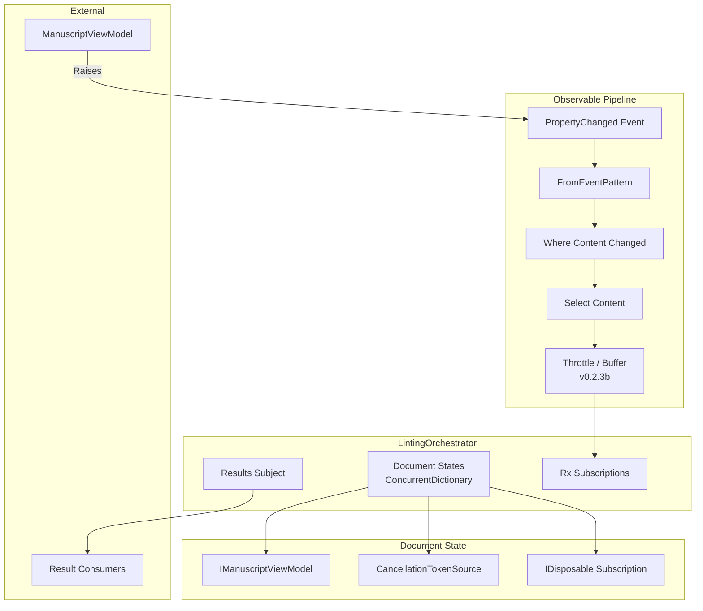
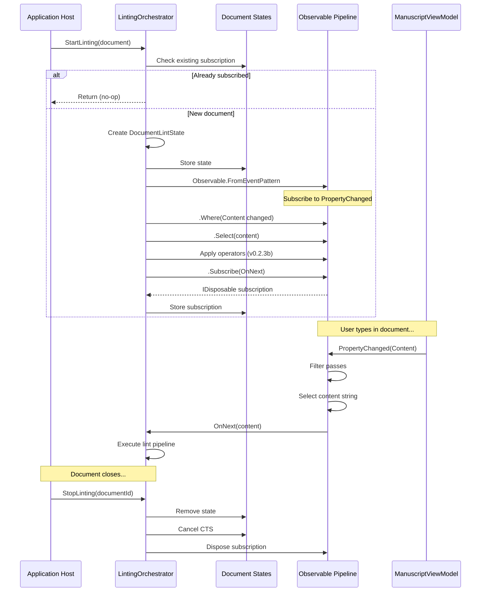
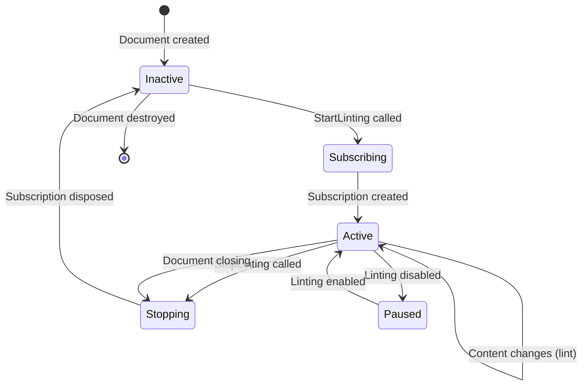

# LCS-INF-023a: Reactive Pipeline

## 1. Metadata & Categorization

| Field                | Value                                | Description                                      |
| :------------------- | :----------------------------------- | :----------------------------------------------- |
| **Feature ID**       | `INF-023a`                           | Sub-part A of Linter Engine                      |
| **Feature Name**     | Reactive Pipeline                    | System.Reactive subscription infrastructure      |
| **Target Version**   | `v0.2.3a`                            | First sub-part of v0.2.3                         |
| **Module Scope**     | `Lexichord.Modules.Style`            | Style governance module                          |
| **Swimlane**         | `Product`                            | Core User-Facing Feature                         |
| **License Tier**     | `Core`                               | Foundation (Available in Free tier)              |
| **Author**           | System Architect                     |                                                  |
| **Status**           | **Draft**                            | Pending implementation                           |
| **Last Updated**     | 2026-01-26                           |                                                  |

---

## 2. Executive Summary

### 2.1 The Requirement

Lexichord needs a **reactive programming foundation** to:

- Subscribe to document change events without tight coupling.
- Create per-document observable streams for linting pipelines.
- Support composition of operators (debounce, filter, transform).
- Enable clean subscription lifecycle management.
- Provide observable results stream for downstream consumers.

### 2.2 The Proposed Solution

We **SHALL** implement a reactive pipeline infrastructure with:

1. **System.Reactive Package** — Install Rx.NET for observable patterns.
2. **LintingOrchestrator** — Central coordinator managing document subscriptions.
3. **Observable Subscriptions** — Per-document streams from PropertyChanged events.
4. **Results Subject** — Shared observable for linting results distribution.

---

## 3. Architecture

### 3.1 Component Structure



### 3.2 Subscription Lifecycle Sequence



### 3.3 Subscription State Diagram



---

## 4. Decision Tree: Subscription Management

```text
START: "StartLinting(document) called"
|
+-- Is orchestrator disposed?
|   +-- YES -> Throw ObjectDisposedException
|   +-- NO -> Continue
|
+-- Does document have active subscription?
|   +-- YES -> Log debug, return (idempotent)
|   +-- NO -> Continue
|
+-- Create DocumentLintState
|   +-- Store document reference
|   +-- Create CancellationTokenSource
|
+-- Build observable pipeline
|   +-- FromEventPattern(PropertyChanged)
|   +-- Where(property == "Content")
|   +-- Select(document.Content)
|   +-- Apply Throttle (v0.2.3b)
|
+-- Subscribe to pipeline
|   +-- OnNext: Execute lint
|   +-- OnError: Log and continue
|
+-- Store subscription in state
+-- Store state in ConcurrentDictionary
+-- Log: "Started linting for {documentId}"
|
END

---

START: "StopLinting(documentId) called"
|
+-- Try remove from dictionary
|   +-- NOT FOUND -> Return (no-op)
|   +-- FOUND -> Continue with state
|
+-- Cancel CancellationTokenSource
+-- Dispose subscription
+-- Dispose CancellationTokenSource
+-- Clear violations from aggregator
+-- Log: "Stopped linting for {documentId}"
|
END
```

---

## 5. Data Contracts

### 5.1 ILintingOrchestrator Interface

```csharp
namespace Lexichord.Abstractions.Contracts;

using System;
using System.Collections.Generic;
using System.Threading;
using System.Threading.Tasks;

/// <summary>
/// Orchestrates the linting pipeline for documents using reactive patterns.
/// </summary>
/// <remarks>
/// LOGIC: The LintingOrchestrator creates and manages observable subscriptions
/// for each document being linted. It is the entry point for:
/// - Starting/stopping linting per document
/// - Forcing immediate lint operations
/// - Subscribing to linting results
///
/// Implementation uses System.Reactive for:
/// - Observable.FromEventPattern for PropertyChanged
/// - Throttle for debouncing (v0.2.3b)
/// - Subject for results distribution
///
/// Thread Safety:
/// - ConcurrentDictionary for document states
/// - Subject is thread-safe for OnNext
/// - All public methods are thread-safe
/// </remarks>
public interface ILintingOrchestrator : IDisposable
{
    /// <summary>
    /// Starts linting for a specific document.
    /// </summary>
    /// <param name="document">The document to lint.</param>
    /// <remarks>
    /// LOGIC: Creates an observable subscription to the document's
    /// Content property changes. This method is idempotent - calling
    /// multiple times for the same document has no additional effect.
    ///
    /// The subscription will:
    /// 1. Monitor PropertyChanged events for "Content"
    /// 2. Apply debounce operator (configurable, default 300ms)
    /// 3. Trigger scan when debounce window closes
    /// 4. Publish results to LintingResults observable
    /// </remarks>
    void StartLinting(IManuscriptViewModel document);

    /// <summary>
    /// Stops linting for a specific document.
    /// </summary>
    /// <param name="documentId">The document ID to stop linting.</param>
    /// <remarks>
    /// LOGIC: Disposes the subscription and clears cached violations.
    /// Cancels any in-progress lint operation for this document.
    /// Safe to call for documents that aren't being linted.
    /// </remarks>
    void StopLinting(string documentId);

    /// <summary>
    /// Forces an immediate lint of a document, bypassing debounce.
    /// </summary>
    /// <param name="documentId">The document ID to lint.</param>
    /// <param name="cancellationToken">Cancellation token.</param>
    /// <returns>The linting result.</returns>
    /// <remarks>
    /// LOGIC: Useful for:
    /// - Initial lint on document open
    /// - User-triggered "Lint Now" command
    /// - Test scenarios
    /// </remarks>
    /// <exception cref="InvalidOperationException">
    /// Thrown if document is not being linted.
    /// </exception>
    Task<LintingResult> LintNowAsync(
        string documentId,
        CancellationToken cancellationToken = default);

    /// <summary>
    /// Gets whether a document is currently being linted.
    /// </summary>
    /// <param name="documentId">The document ID to check.</param>
    /// <returns>True if linting is active for this document.</returns>
    bool IsLinting(string documentId);

    /// <summary>
    /// Gets all document IDs currently being linted.
    /// </summary>
    /// <returns>Collection of active document IDs.</returns>
    IReadOnlyCollection<string> GetActiveDocuments();

    /// <summary>
    /// Observable stream of linting results.
    /// </summary>
    /// <remarks>
    /// LOGIC: Subscribers receive all linting results across all documents.
    /// Use LINQ Where operator to filter by DocumentId if needed.
    ///
    /// Example:
    /// <code>
    /// orchestrator.LintingResults
    ///     .Where(r => r.DocumentId == "my-doc")
    ///     .Subscribe(result => HandleResult(result));
    /// </code>
    /// </remarks>
    IObservable<LintingResult> LintingResults { get; }

    /// <summary>
    /// Gets the most recent violations for a document.
    /// </summary>
    /// <param name="documentId">The document ID.</param>
    /// <returns>List of violations, empty if none or not linting.</returns>
    IReadOnlyList<StyleViolation> GetViolations(string documentId);

    /// <summary>
    /// Pauses linting for all documents without disposing subscriptions.
    /// </summary>
    /// <remarks>
    /// LOGIC: Useful when user disables linting in settings.
    /// Subscriptions remain active but scans are skipped.
    /// </remarks>
    void PauseAll();

    /// <summary>
    /// Resumes linting for all paused documents.
    /// </summary>
    void ResumeAll();

    /// <summary>
    /// Gets whether linting is globally paused.
    /// </summary>
    bool IsPaused { get; }
}
```

### 5.2 DocumentLintState Internal Class

```csharp
namespace Lexichord.Modules.Style.Services;

using System;
using System.Threading;
using Lexichord.Abstractions.Contracts;

/// <summary>
/// Internal state tracking for a document being linted.
/// </summary>
/// <remarks>
/// LOGIC: Each document has its own state instance containing:
/// - Reference to the document being linted
/// - CancellationTokenSource for cancelling in-progress operations
/// - The Rx subscription (IDisposable) for cleanup
///
/// This class is internal to the LintingOrchestrator and not
/// exposed through the public interface.
/// </remarks>
internal sealed class DocumentLintState : IDisposable
{
    /// <summary>
    /// The document being linted.
    /// </summary>
    /// <remarks>
    /// LOGIC: Held as a reference to access Content property
    /// during lint operations.
    /// </remarks>
    public IManuscriptViewModel Document { get; }

    /// <summary>
    /// Cancellation source for this document's operations.
    /// </summary>
    /// <remarks>
    /// LOGIC: Cancelled when:
    /// - StopLinting is called
    /// - Orchestrator is disposed
    /// - New lint supersedes in-progress lint
    /// </remarks>
    public CancellationTokenSource CancellationTokenSource { get; } = new();

    /// <summary>
    /// The Rx subscription to PropertyChanged events.
    /// </summary>
    /// <remarks>
    /// LOGIC: Set after subscription is created. Must be disposed
    /// to stop receiving events and prevent memory leaks.
    /// </remarks>
    public IDisposable? Subscription { get; set; }

    /// <summary>
    /// Timestamp of the last completed lint operation.
    /// </summary>
    public DateTimeOffset? LastLintTime { get; set; }

    /// <summary>
    /// Count of lint operations for this document.
    /// </summary>
    public int LintCount { get; set; }

    /// <summary>
    /// Whether this document's linting is currently paused.
    /// </summary>
    public bool IsPaused { get; set; }

    public DocumentLintState(IManuscriptViewModel document)
    {
        Document = document ?? throw new ArgumentNullException(nameof(document));
    }

    public void Dispose()
    {
        CancellationTokenSource.Cancel();
        Subscription?.Dispose();
        CancellationTokenSource.Dispose();
    }
}
```

### 5.3 Observable Factory Helper

```csharp
namespace Lexichord.Modules.Style.Services;

using System;
using System.ComponentModel;
using System.Reactive.Linq;
using Lexichord.Abstractions.Contracts;

/// <summary>
/// Factory for creating observable streams from document events.
/// </summary>
/// <remarks>
/// LOGIC: Encapsulates the Rx setup for observing document changes.
/// Allows for easier testing and potential customization of the
/// observable pipeline.
/// </remarks>
internal static class DocumentObservableFactory
{
    /// <summary>
    /// Creates an observable stream of content changes for a document.
    /// </summary>
    /// <param name="document">The document to observe.</param>
    /// <returns>Observable of content strings.</returns>
    /// <remarks>
    /// LOGIC: Pipeline stages:
    /// 1. FromEventPattern - converts .NET event to observable
    /// 2. Where - filters to Content property only
    /// 3. Select - extracts the content string
    ///
    /// Downstream operators (Throttle) added by orchestrator.
    /// </remarks>
    public static IObservable<string> CreateContentObservable(
        IManuscriptViewModel document)
    {
        // LOGIC: Convert PropertyChanged to observable
        // This creates a "hot" observable that emits when the event fires
        return Observable
            .FromEventPattern<PropertyChangedEventHandler, PropertyChangedEventArgs>(
                handler => document.PropertyChanged += handler,
                handler => document.PropertyChanged -= handler)
            // LOGIC: Only interested in Content changes
            .Where(e => e.EventArgs.PropertyName == nameof(IManuscriptViewModel.Content))
            // LOGIC: Extract the actual content string
            .Select(_ => document.Content);
    }

    /// <summary>
    /// Creates an observable that emits when specific document properties change.
    /// </summary>
    /// <param name="document">The document to observe.</param>
    /// <param name="propertyNames">Properties to monitor.</param>
    /// <returns>Observable of property names that changed.</returns>
    public static IObservable<string> CreatePropertyObservable(
        IManuscriptViewModel document,
        params string[] propertyNames)
    {
        var propertySet = new HashSet<string>(propertyNames, StringComparer.Ordinal);

        return Observable
            .FromEventPattern<PropertyChangedEventHandler, PropertyChangedEventArgs>(
                handler => document.PropertyChanged += handler,
                handler => document.PropertyChanged -= handler)
            .Where(e => e.EventArgs.PropertyName is not null &&
                       propertySet.Contains(e.EventArgs.PropertyName))
            .Select(e => e.EventArgs.PropertyName!);
    }
}
```

### 5.4 LintingOrchestrator Implementation

```csharp
using System.Collections.Concurrent;
using System.Reactive.Linq;
using System.Reactive.Subjects;
using Lexichord.Abstractions.Contracts;
using Lexichord.Abstractions.Events;
using MediatR;
using Microsoft.Extensions.Logging;

namespace Lexichord.Modules.Style.Services;

/// <summary>
/// Orchestrates the linting pipeline using reactive extensions.
/// </summary>
/// <remarks>
/// LOGIC: This is the v0.2.3a implementation focusing on the reactive
/// infrastructure. Debounce (v0.2.3b) and scan execution (v0.2.3c/d)
/// are handled by injected dependencies.
///
/// Key responsibilities:
/// - Manage per-document observable subscriptions
/// - Coordinate between scanner, aggregator, and event publishing
/// - Provide observable stream for result consumers
///
/// Thread Safety:
/// - Document states in ConcurrentDictionary
/// - Subject provides thread-safe OnNext
/// - All subscription operations are atomic via dictionary
/// </remarks>
public sealed class LintingOrchestrator : ILintingOrchestrator
{
    private readonly IStyleScanner _scanner;
    private readonly IViolationAggregator _aggregator;
    private readonly ILintingConfiguration _config;
    private readonly IStyleRuleCache _ruleCache;
    private readonly IMediator _mediator;
    private readonly ILogger<LintingOrchestrator> _logger;

    // LOGIC: ConcurrentDictionary for thread-safe document state management
    private readonly ConcurrentDictionary<string, DocumentLintState> _documentStates = new();

    // LOGIC: Subject provides both IObservable and IObserver interfaces
    // Used to push results to subscribers
    private readonly Subject<LintingResult> _resultsSubject = new();

    private bool _disposed;
    private bool _isPaused;

    public LintingOrchestrator(
        IStyleScanner scanner,
        IViolationAggregator aggregator,
        ILintingConfiguration config,
        IStyleRuleCache ruleCache,
        IMediator mediator,
        ILogger<LintingOrchestrator> logger)
    {
        _scanner = scanner ?? throw new ArgumentNullException(nameof(scanner));
        _aggregator = aggregator ?? throw new ArgumentNullException(nameof(aggregator));
        _config = config ?? throw new ArgumentNullException(nameof(config));
        _ruleCache = ruleCache ?? throw new ArgumentNullException(nameof(ruleCache));
        _mediator = mediator ?? throw new ArgumentNullException(nameof(mediator));
        _logger = logger ?? throw new ArgumentNullException(nameof(logger));
    }

    /// <inheritdoc/>
    public IObservable<LintingResult> LintingResults =>
        _resultsSubject.AsObservable();

    /// <inheritdoc/>
    public bool IsPaused => _isPaused;

    /// <inheritdoc/>
    public void StartLinting(IManuscriptViewModel document)
    {
        ObjectDisposedException.ThrowIf(_disposed, this);
        ArgumentNullException.ThrowIfNull(document);

        // LOGIC: Idempotent check - if already linting, do nothing
        if (_documentStates.ContainsKey(document.Id))
        {
            _logger.LogDebug(
                "Linting already active for document {DocumentId}, ignoring StartLinting",
                document.Id);
            return;
        }

        _logger.LogInformation(
            "Starting linting for document {DocumentId} ({Title})",
            document.Id, document.Title);

        // LOGIC: Create state object for this document
        var state = new DocumentLintState(document);

        // LOGIC: Build the observable pipeline
        var contentObservable = DocumentObservableFactory
            .CreateContentObservable(document);

        // LOGIC: Apply debounce operator (v0.2.3b)
        // Throttle waits for silence, then emits last value
        var throttledObservable = contentObservable
            .Throttle(_config.DebounceInterval);

        // LOGIC: Subscribe to the throttled stream
        var subscription = throttledObservable.Subscribe(
            // OnNext: Content has stabilized, execute lint
            content => OnContentStabilized(document.Id, content, state),
            // OnError: Log but don't crash - observable continues
            error => _logger.LogError(
                error,
                "Observable error for document {DocumentId}",
                document.Id),
            // OnCompleted: Document closed or subscription disposed
            () => _logger.LogDebug(
                "Observable completed for document {DocumentId}",
                document.Id)
        );

        state.Subscription = subscription;

        // LOGIC: Store in dictionary - atomic operation
        if (!_documentStates.TryAdd(document.Id, state))
        {
            // LOGIC: Race condition - another thread added first
            // Clean up our subscription and exit
            _logger.LogDebug(
                "Race condition in StartLinting for {DocumentId}, cleaning up",
                document.Id);
            subscription.Dispose();
            state.Dispose();
            return;
        }

        _logger.LogDebug(
            "Subscription created for document {DocumentId}",
            document.Id);
    }

    /// <inheritdoc/>
    public void StopLinting(string documentId)
    {
        ArgumentException.ThrowIfNullOrEmpty(documentId);

        // LOGIC: Try to remove and get the state atomically
        if (_documentStates.TryRemove(documentId, out var state))
        {
            _logger.LogInformation(
                "Stopping linting for document {DocumentId}",
                documentId);

            // LOGIC: Clean up in order:
            // 1. Cancel any in-progress operations
            // 2. Dispose subscription to stop receiving events
            // 3. Clear cached violations
            state.Dispose();
            _aggregator.ClearViolations(documentId);

            _logger.LogDebug(
                "Linting stopped and cleaned up for document {DocumentId}",
                documentId);
        }
        else
        {
            _logger.LogDebug(
                "StopLinting called for unknown document {DocumentId}, ignoring",
                documentId);
        }
    }

    /// <inheritdoc/>
    public async Task<LintingResult> LintNowAsync(
        string documentId,
        CancellationToken cancellationToken = default)
    {
        ArgumentException.ThrowIfNullOrEmpty(documentId);
        ObjectDisposedException.ThrowIf(_disposed, this);

        if (!_documentStates.TryGetValue(documentId, out var state))
        {
            throw new InvalidOperationException(
                $"Document {documentId} is not being linted. Call StartLinting first.");
        }

        _logger.LogDebug(
            "LintNow requested for document {DocumentId}",
            documentId);

        // LOGIC: Execute lint directly, bypassing debounce
        return await ExecuteLintAsync(
            documentId,
            state.Document.Content,
            cancellationToken);
    }

    /// <inheritdoc/>
    public bool IsLinting(string documentId) =>
        _documentStates.ContainsKey(documentId);

    /// <inheritdoc/>
    public IReadOnlyCollection<string> GetActiveDocuments() =>
        _documentStates.Keys.ToList();

    /// <inheritdoc/>
    public IReadOnlyList<StyleViolation> GetViolations(string documentId) =>
        _aggregator.GetViolations(documentId);

    /// <inheritdoc/>
    public void PauseAll()
    {
        _isPaused = true;
        foreach (var state in _documentStates.Values)
        {
            state.IsPaused = true;
        }
        _logger.LogInformation("Linting paused for all documents");
    }

    /// <inheritdoc/>
    public void ResumeAll()
    {
        _isPaused = false;
        foreach (var state in _documentStates.Values)
        {
            state.IsPaused = false;
        }
        _logger.LogInformation("Linting resumed for all documents");
    }

    /// <summary>
    /// Called when content has stabilized after debounce.
    /// </summary>
    private void OnContentStabilized(
        string documentId,
        string content,
        DocumentLintState state)
    {
        // LOGIC: Check if paused or disabled before executing
        if (_isPaused || state.IsPaused || !_config.IsEnabled)
        {
            _logger.LogDebug(
                "Skipping lint for {DocumentId} - paused or disabled",
                documentId);
            return;
        }

        // LOGIC: Fire and forget the async lint operation
        // Errors are logged within ExecuteLintAsync
        _ = ExecuteLintAsync(documentId, content, state.CancellationTokenSource.Token);
    }

    /// <summary>
    /// Executes the actual linting operation.
    /// </summary>
    private async Task<LintingResult> ExecuteLintAsync(
        string documentId,
        string content,
        CancellationToken cancellationToken)
    {
        _logger.LogDebug(
            "Executing lint for document {DocumentId} ({Length} chars)",
            documentId, content.Length);

        var stopwatch = System.Diagnostics.Stopwatch.StartNew();

        try
        {
            // LOGIC: Notify lint started
            await _mediator.Publish(
                new LintingStartedEvent(documentId),
                cancellationToken);

            // LOGIC: Get active rules from cache
            var rules = await _ruleCache.GetActiveRulesAsync(cancellationToken);

            // LOGIC: Execute scan (v0.2.3c)
            var scanOptions = ScanOptions.Default with
            {
                RegexTimeout = _config.RegexTimeout
            };

            var matches = await _scanner.ScanAsync(
                content,
                rules,
                scanOptions,
                cancellationToken);

            // LOGIC: Aggregate into violations (v0.2.3d)
            var violations = _aggregator.Aggregate(matches, documentId, content);

            stopwatch.Stop();

            // LOGIC: Build result
            var result = new LintingResult(
                DocumentId: documentId,
                Violations: violations,
                ScanDuration: stopwatch.Elapsed,
                RulesChecked: rules.Count,
                ContentLength: content.Length,
                WasPartialScan: false,
                Timestamp: DateTimeOffset.UtcNow);

            // LOGIC: Update state
            if (_documentStates.TryGetValue(documentId, out var state))
            {
                state.LastLintTime = result.Timestamp;
                state.LintCount++;
            }

            // LOGIC: Publish completion event
            await _mediator.Publish(
                new LintingCompletedEvent(result),
                cancellationToken);

            // LOGIC: Emit to observable stream
            _resultsSubject.OnNext(result);

            _logger.LogDebug(
                "Lint completed for {DocumentId}: {ViolationCount} violations in {Duration}ms",
                documentId, result.ViolationCount, stopwatch.ElapsedMilliseconds);

            return result;
        }
        catch (OperationCanceledException)
        {
            _logger.LogDebug(
                "Lint cancelled for document {DocumentId}",
                documentId);

            await _mediator.Publish(
                new LintingCancelledEvent(documentId, "Operation cancelled"),
                CancellationToken.None);

            throw;
        }
        catch (Exception ex)
        {
            _logger.LogError(
                ex,
                "Lint failed for document {DocumentId}",
                documentId);

            // LOGIC: Publish empty result on error
            var errorResult = new LintingResult(
                DocumentId: documentId,
                Violations: Array.Empty<StyleViolation>(),
                ScanDuration: stopwatch.Elapsed,
                RulesChecked: 0,
                ContentLength: content.Length,
                WasPartialScan: false,
                Timestamp: DateTimeOffset.UtcNow);

            _resultsSubject.OnNext(errorResult);

            return errorResult;
        }
    }

    /// <inheritdoc/>
    public void Dispose()
    {
        if (_disposed)
            return;

        _disposed = true;

        _logger.LogInformation("Disposing LintingOrchestrator");

        // LOGIC: Stop all active linting
        foreach (var documentId in _documentStates.Keys.ToList())
        {
            StopLinting(documentId);
        }

        // LOGIC: Complete the subject (notifies subscribers)
        _resultsSubject.OnCompleted();
        _resultsSubject.Dispose();

        _logger.LogDebug("LintingOrchestrator disposed");
    }
}
```

---

## 6. Implementation Logic

### 6.1 Project Configuration

**File:** `src/Lexichord.Modules.Style/Lexichord.Modules.Style.csproj`

```xml
<Project Sdk="Microsoft.NET.Sdk">

  <PropertyGroup>
    <TargetFramework>net9.0</TargetFramework>
    <ImplicitUsings>enable</ImplicitUsings>
    <Nullable>enable</Nullable>
    <RootNamespace>Lexichord.Modules.Style</RootNamespace>
  </PropertyGroup>

  <ItemGroup>
    <!-- Reactive Extensions for observable patterns -->
    <PackageReference Include="System.Reactive" Version="6.0.1" />

    <!-- MVVM Toolkit for commands and observables -->
    <PackageReference Include="CommunityToolkit.Mvvm" Version="8.3.2" />

    <!-- MediatR for event publishing -->
    <PackageReference Include="MediatR" Version="12.4.1" />
  </ItemGroup>

  <ItemGroup>
    <ProjectReference Include="..\Lexichord.Abstractions\Lexichord.Abstractions.csproj" />
  </ItemGroup>

</Project>
```

### 6.2 Module Registration

```csharp
using Lexichord.Abstractions.Contracts;
using Microsoft.Extensions.DependencyInjection;

namespace Lexichord.Modules.Style;

public partial class StyleModule : IModule
{
    public void ConfigureServices(IServiceCollection services)
    {
        // v0.2.3a: Reactive Pipeline
        services.AddSingleton<ILintingOrchestrator, LintingOrchestrator>();

        // v0.2.3b: Linting Configuration (provides debounce settings)
        services.AddSingleton<ILintingConfiguration, LintingConfiguration>();

        // v0.2.3c/d: Scanner and Aggregator (placeholder until implemented)
        services.AddSingleton<IStyleScanner, RegexStyleScanner>();
        services.AddSingleton<IViolationAggregator, ViolationAggregator>();

        // From v0.2.1/v0.2.2
        services.AddSingleton<IStyleRuleCache, StyleRuleCache>();
    }
}
```

### 6.3 Integration with Editor Module

```csharp
using Lexichord.Abstractions.Contracts;
using Lexichord.Abstractions.Events;
using MediatR;

namespace Lexichord.Modules.Style.Handlers;

/// <summary>
/// Handles document lifecycle events to start/stop linting.
/// </summary>
/// <remarks>
/// LOGIC: This handler bridges the Editor module with the Style module.
/// When documents open, linting starts. When they close, it stops.
/// </remarks>
public class DocumentLifecycleHandler :
    INotificationHandler<DocumentOpenedEvent>,
    INotificationHandler<DocumentClosedEvent>
{
    private readonly ILintingOrchestrator _orchestrator;
    private readonly IEditorService _editorService;

    public DocumentLifecycleHandler(
        ILintingOrchestrator orchestrator,
        IEditorService editorService)
    {
        _orchestrator = orchestrator;
        _editorService = editorService;
    }

    public Task Handle(DocumentOpenedEvent notification, CancellationToken cancellationToken)
    {
        // LOGIC: Find the document and start linting
        var document = _editorService.OpenDocuments
            .FirstOrDefault(d => d.Id == notification.DocumentId);

        if (document is not null)
        {
            _orchestrator.StartLinting(document);

            // LOGIC: Perform initial lint
            _ = _orchestrator.LintNowAsync(notification.DocumentId, cancellationToken);
        }

        return Task.CompletedTask;
    }

    public Task Handle(DocumentClosedEvent notification, CancellationToken cancellationToken)
    {
        _orchestrator.StopLinting(notification.DocumentId);
        return Task.CompletedTask;
    }
}
```

---

## 7. Use Cases

### UC-01: Start Linting on Document Open

**Preconditions:**
- Style module is loaded and initialized.
- User opens a document in the editor.

**Flow:**
1. EditorService publishes DocumentOpenedEvent.
2. DocumentLifecycleHandler receives event.
3. Handler calls orchestrator.StartLinting(document).
4. Orchestrator creates DocumentLintState.
5. Observable pipeline created from PropertyChanged.
6. Throttle operator applied (300ms).
7. Subscription stored in state.
8. Handler calls LintNowAsync for initial lint.

**Postconditions:**
- Document is actively monitored for changes.
- Initial violations detected and published.

---

### UC-02: Stop Linting on Document Close

**Preconditions:**
- Document is open and being linted.
- User closes the document.

**Flow:**
1. EditorService publishes DocumentClosedEvent.
2. DocumentLifecycleHandler receives event.
3. Handler calls orchestrator.StopLinting(documentId).
4. Orchestrator removes state from dictionary.
5. CancellationTokenSource cancelled.
6. Subscription disposed.
7. Violations cleared from aggregator.

**Postconditions:**
- No subscription leaks.
- No violations cached for closed document.

---

### UC-03: Subscribe to Linting Results

**Preconditions:**
- Consumer wants to react to linting results.
- Orchestrator is initialized.

**Flow:**
1. Consumer subscribes to orchestrator.LintingResults.
2. User types in a document.
3. Debounce triggers after 300ms.
4. Lint executes and produces result.
5. Result pushed to Subject.
6. Consumer's OnNext handler invoked.

**Postconditions:**
- Consumer receives result with violations.
- Consumer can filter by DocumentId if needed.

---

## 8. Observability & Logging

| Level | Context | Message Template |
|:------|:--------|:-----------------|
| Information | LintingOrchestrator | `Starting linting for document {DocumentId} ({Title})` |
| Information | LintingOrchestrator | `Stopping linting for document {DocumentId}` |
| Information | LintingOrchestrator | `Linting paused for all documents` |
| Information | LintingOrchestrator | `Linting resumed for all documents` |
| Information | LintingOrchestrator | `Disposing LintingOrchestrator` |
| Debug | LintingOrchestrator | `Linting already active for document {DocumentId}, ignoring StartLinting` |
| Debug | LintingOrchestrator | `Subscription created for document {DocumentId}` |
| Debug | LintingOrchestrator | `LintNow requested for document {DocumentId}` |
| Debug | LintingOrchestrator | `Executing lint for document {DocumentId} ({Length} chars)` |
| Debug | LintingOrchestrator | `Lint completed for {DocumentId}: {ViolationCount} violations in {Duration}ms` |
| Debug | LintingOrchestrator | `Lint cancelled for document {DocumentId}` |
| Debug | LintingOrchestrator | `Skipping lint for {DocumentId} - paused or disabled` |
| Debug | LintingOrchestrator | `StopLinting called for unknown document {DocumentId}, ignoring` |
| Error | LintingOrchestrator | `Observable error for document {DocumentId}` |
| Error | LintingOrchestrator | `Lint failed for document {DocumentId}` |

---

## 9. Unit Testing Requirements

### 9.1 LintingOrchestrator Subscription Tests

```csharp
[TestFixture]
[Category("Unit")]
public class LintingOrchestratorSubscriptionTests
{
    private LintingOrchestrator _sut = null!;
    private Mock<IStyleScanner> _mockScanner = null!;
    private Mock<IViolationAggregator> _mockAggregator = null!;
    private Mock<ILintingConfiguration> _mockConfig = null!;
    private Mock<IStyleRuleCache> _mockRuleCache = null!;
    private Mock<IMediator> _mockMediator = null!;

    [SetUp]
    public void SetUp()
    {
        _mockScanner = new Mock<IStyleScanner>();
        _mockAggregator = new Mock<IViolationAggregator>();
        _mockConfig = new Mock<ILintingConfiguration>();
        _mockRuleCache = new Mock<IStyleRuleCache>();
        _mockMediator = new Mock<IMediator>();

        _mockConfig.Setup(c => c.DebounceInterval)
            .Returns(TimeSpan.FromMilliseconds(50)); // Short for tests
        _mockConfig.Setup(c => c.IsEnabled).Returns(true);
        _mockConfig.Setup(c => c.RegexTimeout)
            .Returns(TimeSpan.FromMilliseconds(100));

        _mockRuleCache
            .Setup(c => c.GetActiveRulesAsync(It.IsAny<CancellationToken>()))
            .ReturnsAsync(new List<StyleRule>());

        _mockScanner
            .Setup(s => s.ScanAsync(
                It.IsAny<string>(),
                It.IsAny<IEnumerable<StyleRule>>(),
                It.IsAny<ScanOptions>(),
                It.IsAny<CancellationToken>()))
            .ReturnsAsync(new List<ScanMatch>());

        _mockAggregator
            .Setup(a => a.Aggregate(
                It.IsAny<IEnumerable<ScanMatch>>(),
                It.IsAny<string>(),
                It.IsAny<string>()))
            .Returns(new List<StyleViolation>());

        _sut = CreateOrchestrator();
    }

    [TearDown]
    public void TearDown()
    {
        _sut.Dispose();
    }

    [Test]
    public void StartLinting_CreatesActiveSubscription()
    {
        // Arrange
        var document = CreateMockDocument("doc-1");

        // Act
        _sut.StartLinting(document.Object);

        // Assert
        Assert.That(_sut.IsLinting("doc-1"), Is.True);
        Assert.That(_sut.GetActiveDocuments(), Contains.Item("doc-1"));
    }

    [Test]
    public void StartLinting_IsIdempotent()
    {
        // Arrange
        var document = CreateMockDocument("doc-1");

        // Act
        _sut.StartLinting(document.Object);
        _sut.StartLinting(document.Object);
        _sut.StartLinting(document.Object);

        // Assert
        Assert.That(_sut.GetActiveDocuments().Count, Is.EqualTo(1));
    }

    [Test]
    public void StopLinting_RemovesSubscription()
    {
        // Arrange
        var document = CreateMockDocument("doc-1");
        _sut.StartLinting(document.Object);

        // Act
        _sut.StopLinting("doc-1");

        // Assert
        Assert.That(_sut.IsLinting("doc-1"), Is.False);
        Assert.That(_sut.GetActiveDocuments(), Is.Empty);
    }

    [Test]
    public void StopLinting_ClearsViolations()
    {
        // Arrange
        var document = CreateMockDocument("doc-1");
        _sut.StartLinting(document.Object);

        // Act
        _sut.StopLinting("doc-1");

        // Assert
        _mockAggregator.Verify(a => a.ClearViolations("doc-1"), Times.Once);
    }

    [Test]
    public void StopLinting_UnknownDocument_DoesNotThrow()
    {
        // Act & Assert
        Assert.DoesNotThrow(() => _sut.StopLinting("unknown"));
    }

    [Test]
    public void Dispose_StopsAllLinting()
    {
        // Arrange
        _sut.StartLinting(CreateMockDocument("doc-1").Object);
        _sut.StartLinting(CreateMockDocument("doc-2").Object);
        _sut.StartLinting(CreateMockDocument("doc-3").Object);

        // Act
        _sut.Dispose();

        // Assert
        Assert.That(_sut.GetActiveDocuments(), Is.Empty);
    }

    [Test]
    public void Dispose_CompletesResultsObservable()
    {
        // Arrange
        var completed = false;
        _sut.LintingResults.Subscribe(
            onNext: _ => { },
            onCompleted: () => completed = true);

        // Act
        _sut.Dispose();

        // Assert
        Assert.That(completed, Is.True);
    }

    [Test]
    public void StartLinting_AfterDispose_ThrowsObjectDisposed()
    {
        // Arrange
        _sut.Dispose();
        var document = CreateMockDocument("doc-1");

        // Act & Assert
        Assert.Throws<ObjectDisposedException>(() =>
            _sut.StartLinting(document.Object));
    }

    [Test]
    public void PauseAll_SetsIsPaused()
    {
        // Act
        _sut.PauseAll();

        // Assert
        Assert.That(_sut.IsPaused, Is.True);
    }

    [Test]
    public void ResumeAll_ClearsIsPaused()
    {
        // Arrange
        _sut.PauseAll();

        // Act
        _sut.ResumeAll();

        // Assert
        Assert.That(_sut.IsPaused, Is.False);
    }

    private LintingOrchestrator CreateOrchestrator() =>
        new(
            _mockScanner.Object,
            _mockAggregator.Object,
            _mockConfig.Object,
            _mockRuleCache.Object,
            _mockMediator.Object,
            Mock.Of<ILogger<LintingOrchestrator>>());

    private static Mock<IManuscriptViewModel> CreateMockDocument(
        string id,
        string content = "")
    {
        var mock = new Mock<IManuscriptViewModel>();
        mock.Setup(d => d.Id).Returns(id);
        mock.Setup(d => d.Title).Returns($"Document {id}");
        mock.Setup(d => d.Content).Returns(content);
        return mock;
    }
}
```

### 9.2 Observable Pipeline Tests

```csharp
[TestFixture]
[Category("Unit")]
public class DocumentObservableFactoryTests
{
    [Test]
    public void CreateContentObservable_EmitsOnContentChange()
    {
        // Arrange
        var document = new TestManuscriptViewModel("doc-1");
        var observable = DocumentObservableFactory.CreateContentObservable(document);
        var receivedContent = new List<string>();

        using var subscription = observable.Subscribe(content =>
            receivedContent.Add(content));

        // Act
        document.Content = "Hello";
        document.Content = "World";

        // Assert
        Assert.That(receivedContent, Has.Count.EqualTo(2));
        Assert.That(receivedContent[0], Is.EqualTo("Hello"));
        Assert.That(receivedContent[1], Is.EqualTo("World"));
    }

    [Test]
    public void CreateContentObservable_IgnoresOtherProperties()
    {
        // Arrange
        var document = new TestManuscriptViewModel("doc-1");
        var observable = DocumentObservableFactory.CreateContentObservable(document);
        var emitCount = 0;

        using var subscription = observable.Subscribe(_ => emitCount++);

        // Act
        document.Title = "New Title"; // Should not emit
        document.Content = "Content"; // Should emit

        // Assert
        Assert.That(emitCount, Is.EqualTo(1));
    }

    [Test]
    public void CreateContentObservable_DisposePreventsEmissions()
    {
        // Arrange
        var document = new TestManuscriptViewModel("doc-1");
        var observable = DocumentObservableFactory.CreateContentObservable(document);
        var emitCount = 0;

        var subscription = observable.Subscribe(_ => emitCount++);

        // Act
        document.Content = "First"; // Should emit
        subscription.Dispose();
        document.Content = "Second"; // Should not emit

        // Assert
        Assert.That(emitCount, Is.EqualTo(1));
    }

    /// <summary>
    /// Test implementation of IManuscriptViewModel with PropertyChanged.
    /// </summary>
    private class TestManuscriptViewModel : IManuscriptViewModel, INotifyPropertyChanged
    {
        private string _content = "";
        private string _title = "";

        public TestManuscriptViewModel(string id)
        {
            Id = id;
        }

        public event PropertyChangedEventHandler? PropertyChanged;

        public string Id { get; }
        public string FilePath { get; set; } = "";
        public string FileExtension => ".txt";
        public bool IsDirty => false;
        public bool IsPinned { get; set; }
        public System.Text.Encoding Encoding => System.Text.Encoding.UTF8;
        public CaretPosition CaretPosition => new(1, 1, 0);
        public TextSelection Selection => new(0, 0, 0, "");
        public int LineCount => 1;
        public int CharacterCount => Content.Length;
        public int WordCount => 0;
        public string DisplayTitle => Title;

        public string Title
        {
            get => _title;
            set
            {
                _title = value;
                PropertyChanged?.Invoke(this,
                    new PropertyChangedEventArgs(nameof(Title)));
            }
        }

        public string Content
        {
            get => _content;
            set
            {
                _content = value;
                PropertyChanged?.Invoke(this,
                    new PropertyChangedEventArgs(nameof(Content)));
            }
        }

        public void Select(int startOffset, int length) { }
        public void ScrollToLine(int line) { }
        public void InsertText(string text) { }
    }
}
```

---

## 10. Security & Safety

### 10.1 Subscription Lifecycle

> [!WARNING]
> Subscription leaks can cause memory issues and unexpected behavior.

- **IDisposable Pattern:** All subscriptions stored and disposed properly.
- **ConcurrentDictionary:** Thread-safe state management.
- **Explicit Cleanup:** StopLinting cancels and disposes all resources.

### 10.2 Thread Safety

- **Concurrent Collections:** Document states in ConcurrentDictionary.
- **Subject Thread Safety:** Subject.OnNext is thread-safe.
- **No Shared Mutable State:** DocumentLintState instances are isolated.

---

## 11. Risks & Mitigations

| Risk | Impact | Mitigation |
|:-----|:-------|:-----------|
| Subscription leaks | High | Strict IDisposable; integration tests |
| Race conditions in state management | Medium | ConcurrentDictionary operations |
| Observable errors crash pipeline | Medium | OnError handler logs and continues |
| Subject disposed during emit | Low | Check disposed before operations |

---

## 12. Acceptance Criteria (QA)

| # | Category | Criterion |
|:--|:---------|:----------|
| 1 | **[Subscribe]** | StartLinting creates subscription |
| 2 | **[Subscribe]** | StartLinting is idempotent |
| 3 | **[Subscribe]** | StopLinting disposes subscription |
| 4 | **[Subscribe]** | StopLinting clears violations |
| 5 | **[Lifecycle]** | Dispose stops all linting |
| 6 | **[Lifecycle]** | Dispose completes results observable |
| 7 | **[Observable]** | Content changes emit to pipeline |
| 8 | **[Observable]** | Non-content changes filtered out |
| 9 | **[Results]** | LintingResults receives all results |
| 10 | **[Results]** | Subscribers can filter by DocumentId |

---

## 13. Verification Commands

```bash
# 1. Install System.Reactive
dotnet add src/Lexichord.Modules.Style package System.Reactive --version 6.0.1

# 2. Build the module
dotnet build src/Lexichord.Modules.Style

# 3. Run subscription tests
dotnet test --filter "FullyQualifiedName~LintingOrchestratorSubscription"

# 4. Run observable tests
dotnet test --filter "FullyQualifiedName~DocumentObservableFactory"

# 5. Verify no memory leaks
# - Start/stop linting 100 times
# - Check memory profile stable
```

---

## 14. Deliverable Checklist

| Step | Description | Status |
|:-----|:------------|:-------|
| 1 | Add System.Reactive NuGet package | [ ] |
| 2 | Define ILintingOrchestrator interface | [ ] |
| 3 | Create DocumentLintState internal class | [ ] |
| 4 | Create DocumentObservableFactory helper | [ ] |
| 5 | Implement LintingOrchestrator.StartLinting | [ ] |
| 6 | Implement LintingOrchestrator.StopLinting | [ ] |
| 7 | Implement LintingOrchestrator.LintNowAsync | [ ] |
| 8 | Implement LintingOrchestrator.Dispose | [ ] |
| 9 | Implement PauseAll/ResumeAll | [ ] |
| 10 | Register in StyleModule DI | [ ] |
| 11 | Create DocumentLifecycleHandler | [ ] |
| 12 | Unit tests for subscription management | [ ] |
| 13 | Unit tests for observable pipeline | [ ] |
| 14 | Integration tests with Editor module | [ ] |
