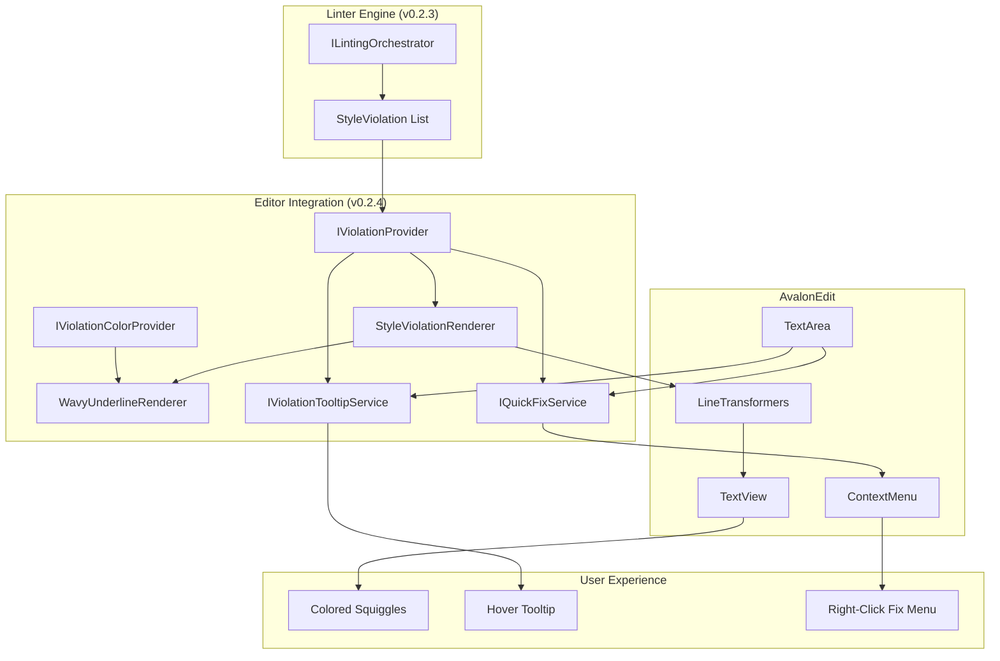
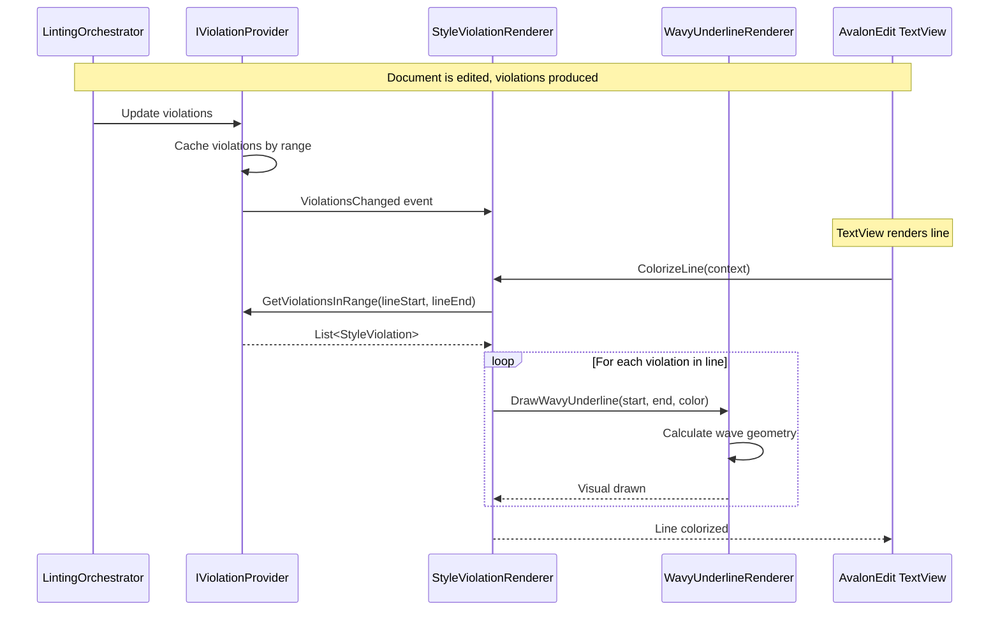
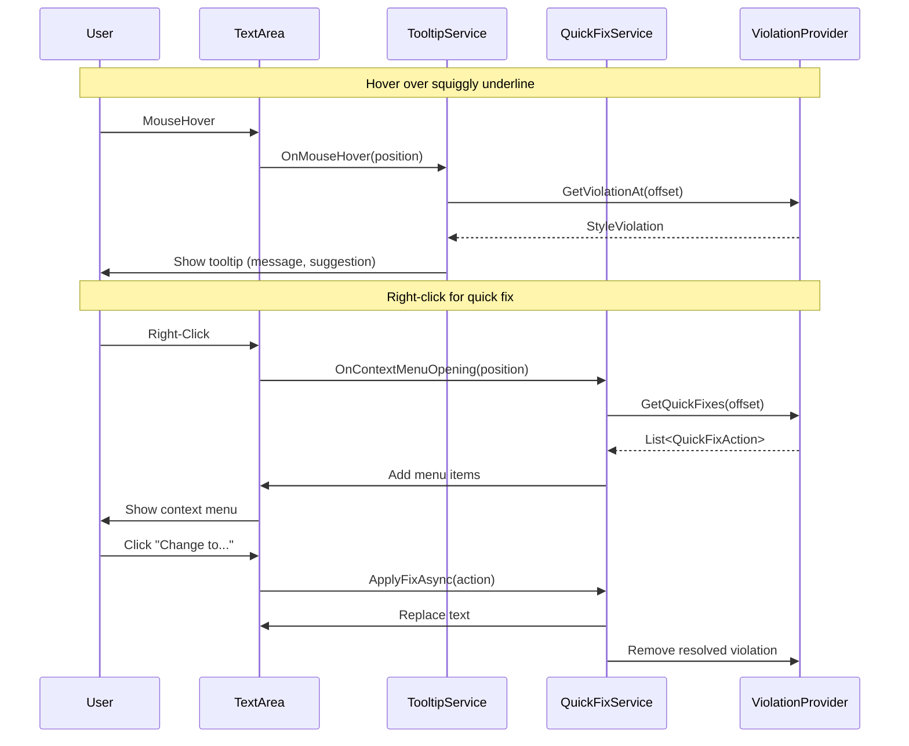

# LCS-DES-024: Design Specification Index — Red Pen (Editor Integration)

## Document Control

| Field              | Value                        |
| :----------------- | :--------------------------- |
| **Document ID**    | LCS-DES-024-INDEX            |
| **Feature ID**     | INF-024                      |
| **Feature Name**   | Red Pen (Editor Integration) |
| **Target Version** | v0.2.4                       |
| **Status**         | Draft                        |
| **Last Updated**   | 2026-01-27                   |

---

## Executive Summary

Red Pen (Editor Integration) is the **visual manifestation of the Style system** — the user-facing component that transforms abstract style violations into actionable visual feedback. By rendering wavy underlines, hover tooltips, and context menu quick-fixes directly in the AvalonEdit editor, Lexichord provides writers with real-time style guidance without interrupting their creative flow.

This module bridges the gap between the v0.2.3 Linter Engine (which analyzes text and produces violations) and the writer's experience, making style recommendations visible, understandable, and immediately actionable.

### Business Value

- **Visual Feedback:** Writers see style issues directly in their text, like spell-check but for writing style
- **Immediate Context:** Hover tooltips explain what's wrong and why, building writer understanding
- **One-Click Fixes:** Right-click menu enables instant corrections, reducing friction in the editing process
- **Professional Polish:** Familiar visual language (colored squiggly lines) matches industry-standard tools
- **Premium Differentiation:** Core feature for WriterPro tier; demonstrates AI-powered value

---

## Related Documents

| Document Type       | Document ID  | Title                     | Path                |
| :------------------ | :----------- | :------------------------ | :------------------ |
| **Scope Breakdown** | LCS-SBD-024  | Editor Integration Scope  | `./LCS-SBD-024.md`  |
| **Sub-Part 024a**   | LCS-DES-024a | StyleViolationRenderer    | `./LCS-DES-024a.md` |
| **Sub-Part 024b**   | LCS-DES-024b | Wavy Underline Rendering  | `./LCS-DES-024b.md` |
| **Sub-Part 024c**   | LCS-DES-024c | Hover Tooltip Integration | `./LCS-DES-024c.md` |
| **Sub-Part 024d**   | LCS-DES-024d | Context Menu Quick-Fix    | `./LCS-DES-024d.md` |

---

## Architecture Overview

### High-Level Component Diagram



### Rendering Pipeline Flow



### User Interaction Flow



---

## Dependencies

### Upstream Dependencies

| Component                   | Source Version | Usage                                                                 |
| :-------------------------- | :------------- | :-------------------------------------------------------------------- |
| StyleViolation              | v0.2.1b        | Data model for violations with coordinates, severity, recommendations |
| ILintingOrchestrator        | v0.2.3a        | Service that produces violations from document analysis               |
| LintResult                  | v0.2.3c        | Container for multiple violations from a lint operation               |
| ManuscriptView              | v0.1.3a        | Host control for the TextEditor where violations are rendered         |
| ManuscriptViewModel         | v0.1.3a        | ViewModel that triggers linting on document changes                   |
| TextEditor (AvalonEdit)     | v0.1.3a        | Target control for DocumentColorizingTransformer                      |
| IEditorConfigurationService | v0.1.3d        | Editor settings that may affect rendering                             |
| IThemeManager               | v0.0.2c        | Theme-aware colors for violation severity levels                      |

### External Dependencies

| Package             | Purpose                                            |
| :------------------ | :------------------------------------------------- |
| `AvaloniaEdit`      | Text editor control providing LineTransformers API |
| `Avalonia.Controls` | ToolTip and ContextMenu controls                   |

---

## License Gating Strategy

| Feature                 | Core Tier              | WriterPro Tier                   |
| :---------------------- | :--------------------- | :------------------------------- |
| **Squiggly Underlines** | ✅ Embedded rules only | ✅ Full access                   |
| **Hover Tooltips**      | ✅ Basic message       | ✅ Full details + recommendation |
| **Quick-Fix Menu**      | ❌ Not available       | ✅ Full fix suggestions          |
| **Color Customization** | ❌ Default colors      | ✅ Custom severity colors        |

**Rationale:**

- Core tier provides basic visual feedback with embedded Microsoft Manual of Style rules
- WriterPro unlocks full tooltip details, quick-fix functionality, and customization
- Premium value proposition: "See AND fix style issues instantly"

---

## Key Interfaces Summary

### IViolationProvider (v0.2.4a)

Supplies violations to rendering components and provides change notifications. Acts as the bridge between the LintingOrchestrator and the editor integration layer.

**See:** `LCS-DES-024a.md` for full specification

### IViolationColorProvider (v0.2.4b)

Provides theme-aware colors for violation severity levels. Supports light/dark themes and accessibility considerations.

**Color Palette:**

- Error: #E51400 (light) / #FF6B6B (dark)
- Warning: #F0A30A (light) / #FFB347 (dark)
- Info: #0078D4 (light) / #4FC3F7 (dark)

**See:** `LCS-DES-024b.md` for full specification

### IViolationTooltipService (v0.2.4c)

Manages tooltip display for violations on hover. Calculates document offset from mouse position and displays styled tooltip with violation details.

**See:** `LCS-DES-024c.md` for full specification

### IQuickFixService (v0.2.4d)

Provides quick-fix actions for violations with recommendations. Handles context menu integration and text replacement.

**See:** `LCS-DES-024d.md` for full specification

### Core Domain Model

```csharp
public interface IViolationProvider
{
    IReadOnlyList<StyleViolation> GetViolationsInRange(int startOffset, int endOffset);
    StyleViolation? GetViolationAt(int offset);
    event EventHandler<ViolationsChangedEventArgs> ViolationsChanged;
}

public record QuickFixAction(
    string DisplayText,
    StyleViolation Violation,
    int ReplacementStart,
    int ReplacementLength,
    string ReplacementText
);
```

---

## Implementation Checklist Summary

| Sub-Part        | Est. Hours | Key Deliverables                                                         |
| :-------------- | :--------- | :----------------------------------------------------------------------- |
| **v0.2.4a**     | 16h        | IViolationProvider, StyleViolationRenderer, ColorizeLine, event handling |
| **v0.2.4b**     | 15h        | WavyUnderlineRenderer, color palette, wave geometry, scroll optimization |
| **v0.2.4c**     | 12h        | IViolationTooltipService, hover handling, tooltip view, positioning      |
| **v0.2.4d**     | 12h        | IQuickFixService, context menu integration, text replacement             |
| **Integration** | 6h         | Full integration tests, performance testing                              |
| **Total**       | **60h**    | Complete editor integration with visual style feedback                   |

**See:** `LCS-SBD-024.md` for detailed task breakdown

---

## Success Criteria Summary

### Performance Targets

| Metric                                | Target      | Rationale                           |
| :------------------------------------ | :---------- | :---------------------------------- |
| Render time per line (100 violations) | < 2ms       | Smooth typing experience            |
| Tooltip display latency               | < 100ms     | Responsive hover feedback           |
| Quick-fix application time            | < 50ms      | Instant correction feel             |
| Memory per violation marker           | < 100 bytes | Bounded memory usage                |
| Scroll FPS with 100 violations        | 60fps       | No visual stuttering                |
| Tooltip accuracy                      | 100%        | Correct violation shown at position |

### Quality Targets

- 100% code coverage for violation provider
- 95%+ code coverage for rendering logic
- All colors tested for WCAG AA contrast
- No memory leaks after document close

---

## Test Coverage Summary

### Unit Testing

| Component               | Coverage Target | Key Tests                             |
| :---------------------- | :-------------- | :------------------------------------ |
| IViolationProvider      | 95%             | Range queries, caching, change events |
| StyleViolationRenderer  | 90%             | ColorizeLine, violation lookup        |
| WavyUnderlineRenderer   | 85%             | Wave geometry, color selection        |
| ViolationTooltipService | 90%             | Offset calculation, tooltip lifecycle |
| QuickFixService         | 95%             | Menu generation, text replacement     |

### Integration Testing

- Full pipeline: Violation produced → Squiggle rendered → Hover → Tooltip → Quick-fix
- Performance benchmarks with 100+ violations
- Theme switching (light/dark colors)
- Scroll performance verification

### Manual Testing

- Type in editor, observe squiggles appear after debounce
- Hover over squiggle, verify correct tooltip content
- Right-click squiggle, verify quick-fix menu
- Apply fix, verify text replaced and squiggle removed

**See:** Individual sub-part specifications for detailed test requirements

---

## What This Enables

After v0.2.4, Lexichord will support:

1. **Visual Style Feedback**
    - Writers see style issues as colored underlines in real-time
    - Familiar visual language matching IDEs and word processors
    - Severity-based colors (red/orange/blue) indicate urgency

2. **Contextual Help**
    - Hover tooltips explain issues and provide recommendations
    - Writers learn style rules through inline education
    - No need to navigate to separate panels

3. **One-Click Fixes**
    - Right-click menu enables instant corrections
    - Reduces friction in the editing process
    - Writers can fix issues without knowing the exact replacement

4. **Foundation for Future Features**
    - v0.2.5: Style Panel can show aggregated violation list
    - v0.2.6: Style settings can toggle violation display
    - v0.3.x: Bulk fix operations

---

## Risks & Mitigations

| Risk                                         | Impact | Mitigation                                                     |
| :------------------------------------------- | :----- | :------------------------------------------------------------- |
| AvalonEdit rendering API changes             | High   | Pin AvaloniaEdit version; abstract rendering                   |
| Performance degradation with many violations | High   | Virtualize visible violations; throttle re-render              |
| Tooltip flickering on rapid mouse movement   | Medium | Debounce hover events; smooth hide transitions                 |
| Color accessibility for colorblind users     | Medium | Use patterns/icons in addition to colors; test with simulators |
| Context menu collision with system menu      | Low    | Merge with existing menu; use standard patterns                |
| Wave drawing clipping at line boundaries     | Medium | Handle line wrapping; test edge cases                          |

---

## Document History

| Version | Date       | Author           | Changes                                                      |
| :------ | :--------- | :--------------- | :----------------------------------------------------------- |
| 1.0     | 2026-01-27 | System Architect | Created INDEX from legacy LCS-INF-024 during standardization |
