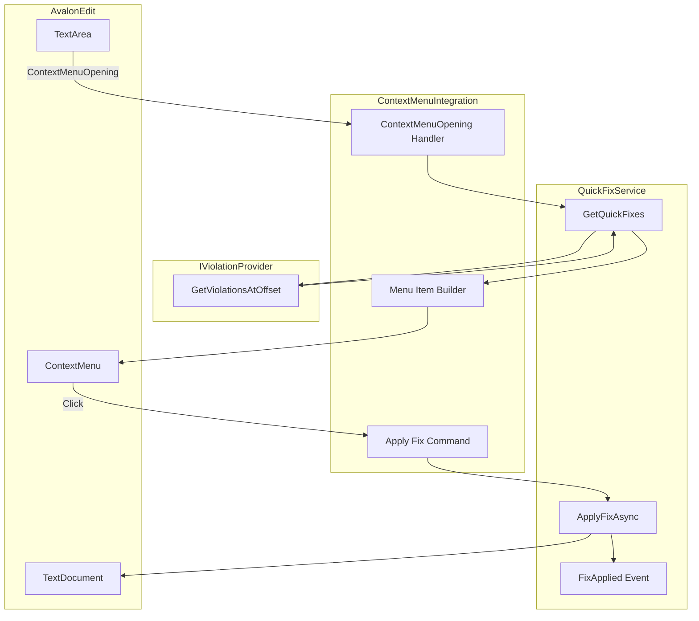
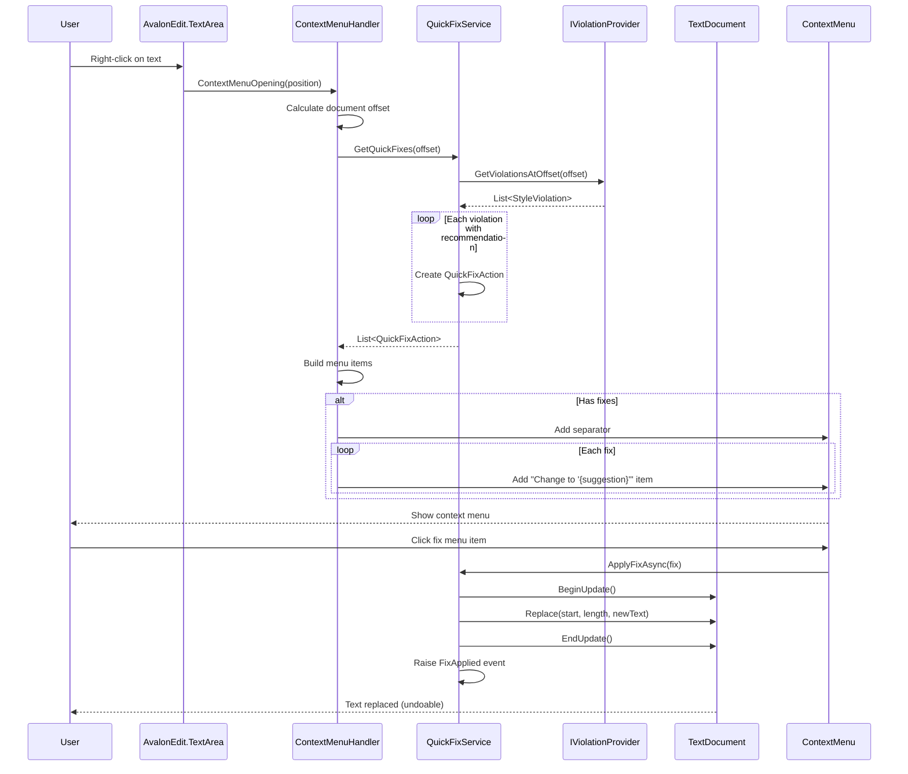
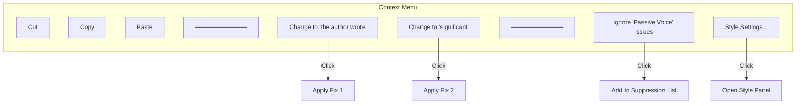

# LCS-DES-024d: Right-Click Fix Menu (Context Menu Quick-Fixes)

## 1. Metadata & Categorization

| Field              | Value                     | Description                         |
| :----------------- | :------------------------ | :---------------------------------- |
| **Document ID**    | LCS-DES-024d              | Design Specification v0.2.4d        |
| **Feature ID**     | INF-024d                  | Sub-part D of Editor Integration    |
| **Feature Name**   | Right-Click Fix Menu      | Context menu with quick-fix actions |
| **Target Version** | `v0.2.4d`                 | Fourth sub-part of v0.2.4           |
| **Module Scope**   | `Lexichord.Modules.Style` | Style module UI                     |
| **Swimlane**       | `Product`                 | Core User-Facing Feature            |
| **License Tier**   | `Core`                    | Foundation (Available in Free tier) |
| **Author**         | System Architect          |                                     |
| **Status**         | **Draft**                 | Pending implementation              |
| **Last Updated**   | 2026-01-27                |                                     |

---

## 2. Executive Summary

### 2.1 The Requirement

When writers see a style issue, they want to fix it quickly without:

- Manually selecting and retyping text.
- Copying from the tooltip and pasting.
- Leaving the keyboard/mouse workflow.

The context menu (right-click) must:

- Detect violations at the click position.
- Show a "Change to '{suggestion}'" menu item if a fix is available.
- Apply the fix instantly when clicked.
- Support undo via Ctrl+Z.
- Handle multiple violations at the same position.
- Integrate seamlessly with the existing context menu.

### 2.2 The Proposed Solution

We **SHALL** implement `QuickFixService` and context menu integration that:

1. **Hooks** into TextArea's ContextMenuOpening event.
2. **Queries** violations at the right-click position.
3. **Generates** menu items for violations with recommendations.
4. **Replaces** text when menu item is clicked.
5. **Wraps** replacement in a document change transaction for undo.

---

## 3. Architecture

### 3.1 Component Structure



### 3.2 Quick-Fix Flow



### 3.3 Menu Structure



---

## 4. Decision Tree: Context Menu Population

```text
START: "ContextMenuOpening event received"
│
├── Get click position
│   ├── If over selection → Use selection start offset
│   └── Otherwise → Calculate offset from mouse position
│
├── Query violations at offset
│   └── violations = provider.GetViolationsAtOffset(offset)
│
├── Has violations with recommendations?
│   ├── NO → Skip (use default menu)
│   └── YES → Continue
│
├── Build quick-fix actions
│   └── For each violation with non-null Recommendation:
│       └── Create QuickFixAction
│
├── Add menu separator
│
├── Add quick-fix menu items
│   └── For each QuickFixAction:
│       ├── Create MenuItem
│       │   ├── Header = "Change to '{Truncated(Suggestion)}'"
│       │   ├── Icon = Lightbulb or severity icon
│       │   └── Command = ApplyFix(action)
│       └── Add to ContextMenu
│
├── (Optional) Add "Ignore" items
│   ├── "Ignore 'RuleName' in this file"
│   └── "Ignore 'RuleName' everywhere"
│
└── END
```

---

## 5. Data Contracts

### 5.1 QuickFixService Implementation

```csharp
using AvaloniaEdit.Document;
using Lexichord.Abstractions.Contracts;
using Microsoft.Extensions.Logging;

namespace Lexichord.Modules.Style.Services;

/// <summary>
/// Service for providing and applying quick-fix actions.
/// </summary>
/// <remarks>
/// LOGIC: QuickFixService bridges style violations with text modifications:
///
/// 1. GetQuickFixes() queries violations and filters for those with recommendations
/// 2. ApplyFixAsync() performs the text replacement in a transaction
/// 3. FixApplied event notifies listeners (for analytics, re-lint, etc.)
///
/// Text Replacement:
/// - Wrapped in BeginUpdate/EndUpdate for single undo operation
/// - Triggers document change events
/// - Subsequent lint will remove the violation if fix was correct
///
/// Thread Safety:
/// - All methods must be called on the UI thread
/// - Document modifications are synchronous within transaction
/// </remarks>
public sealed class QuickFixService : IQuickFixService
{
    private readonly IViolationProvider _violationProvider;
    private readonly ILogger<QuickFixService> _logger;

    private TextDocument? _document;

    /// <summary>
    /// Initializes a new instance of QuickFixService.
    /// </summary>
    public QuickFixService(
        IViolationProvider violationProvider,
        ILogger<QuickFixService> logger)
    {
        _violationProvider = violationProvider ?? throw new ArgumentNullException(nameof(violationProvider));
        _logger = logger ?? throw new ArgumentNullException(nameof(logger));
    }

    /// <inheritdoc/>
    public event EventHandler<QuickFixAppliedEventArgs>? FixApplied;

    /// <summary>
    /// Attaches the service to a TextDocument.
    /// </summary>
    /// <param name="document">The document to modify.</param>
    public void AttachToDocument(TextDocument document)
    {
        _document = document ?? throw new ArgumentNullException(nameof(document));
        _logger.LogDebug("QuickFixService attached to document");
    }

    /// <summary>
    /// Detaches the service from its document.
    /// </summary>
    public void DetachFromDocument()
    {
        _document = null;
        _logger.LogDebug("QuickFixService detached from document");
    }

    /// <inheritdoc/>
    public IReadOnlyList<QuickFixAction> GetQuickFixes(int offset)
    {
        var violations = _violationProvider.GetViolationsAtOffset(offset);

        if (violations.Count == 0)
        {
            _logger.LogDebug("No violations at offset {Offset}", offset);
            return Array.Empty<QuickFixAction>();
        }

        // LOGIC: Filter to violations with recommendations and create actions
        var fixes = violations
            .Where(v => !string.IsNullOrEmpty(v.Recommendation))
            .Select(v => QuickFixAction.FromViolation(v))
            .Where(a => a is not null)
            .Cast<QuickFixAction>()
            .ToList();

        _logger.LogDebug(
            "Found {FixCount} quick-fixes for {ViolationCount} violations at offset {Offset}",
            fixes.Count, violations.Count, offset);

        return fixes;
    }

    /// <inheritdoc/>
    public async Task<bool> ApplyFixAsync(QuickFixAction fix, CancellationToken cancellationToken = default)
    {
        if (_document is null)
        {
            _logger.LogWarning("Cannot apply fix: no document attached");
            return false;
        }

        _logger.LogInformation(
            "Applying fix: {DisplayText} at offset {Offset}",
            fix.DisplayText, fix.ReplacementStart);

        try
        {
            // LOGIC: Wrap in update to ensure single undo operation
            _document.BeginUpdate();

            try
            {
                // LOGIC: Validate offsets are still valid
                if (fix.ReplacementStart < 0 ||
                    fix.ReplacementStart + fix.ReplacementLength > _document.TextLength)
                {
                    _logger.LogWarning(
                        "Fix offsets invalid: start={Start}, length={Length}, docLength={DocLength}",
                        fix.ReplacementStart, fix.ReplacementLength, _document.TextLength);
                    return false;
                }

                // LOGIC: Verify the text to replace matches expected
                var currentText = _document.GetText(fix.ReplacementStart, fix.ReplacementLength);
                if (currentText != fix.Violation.OriginalText)
                {
                    _logger.LogWarning(
                        "Text mismatch: expected '{Expected}', found '{Found}'",
                        fix.Violation.OriginalText, currentText);
                    // Still apply - text may have changed but fix might still be valid
                }

                // LOGIC: Perform the replacement
                _document.Replace(fix.ReplacementStart, fix.ReplacementLength, fix.ReplacementText);

                _logger.LogInformation(
                    "Fix applied successfully: replaced {Length} chars with '{NewText}'",
                    fix.ReplacementLength, fix.ReplacementText);
            }
            finally
            {
                _document.EndUpdate();
            }

            // LOGIC: Raise event for analytics/re-lint
            RaiseFixApplied(fix, success: true);

            return true;
        }
        catch (Exception ex)
        {
            _logger.LogError(ex, "Failed to apply fix: {DisplayText}", fix.DisplayText);
            RaiseFixApplied(fix, success: false);
            return false;
        }
    }

    /// <summary>
    /// Raises the FixApplied event.
    /// </summary>
    private void RaiseFixApplied(QuickFixAction fix, bool success)
    {
        FixApplied?.Invoke(this, new QuickFixAppliedEventArgs
        {
            Fix = fix,
            Success = success
        });
    }
}
```

### 5.2 Context Menu Integration

```csharp
using Avalonia.Controls;
using Avalonia.Input;
using Avalonia.Media;
using AvaloniaEdit;
using AvaloniaEdit.Editing;
using CommunityToolkit.Mvvm.Input;
using Lexichord.Abstractions.Contracts;
using Microsoft.Extensions.Logging;

namespace Lexichord.Modules.Style.Services;

/// <summary>
/// Handles context menu integration for quick-fixes.
/// </summary>
/// <remarks>
/// LOGIC: ContextMenuIntegration hooks into the TextArea's context menu
/// and adds quick-fix items when right-clicking on a style violation:
///
/// 1. Subscribe to ContextMenuOpening event
/// 2. Calculate offset from click position
/// 3. Query QuickFixService for available fixes
/// 4. Generate menu items with commands
/// 5. Insert items into context menu
///
/// Menu Items:
/// - "Change to '{suggestion}'" - applies the fix
/// - "Ignore this issue" - suppresses for this file (future)
/// - "Disable rule" - disables rule globally (future)
/// </remarks>
public sealed class ContextMenuIntegration : IDisposable
{
    private readonly IQuickFixService _quickFixService;
    private readonly IViolationColorProvider _colorProvider;
    private readonly ILogger<ContextMenuIntegration> _logger;

    private TextArea? _textArea;
    private TextEditor? _textEditor;
    private bool _isDisposed;

    /// <summary>
    /// Initializes a new instance of ContextMenuIntegration.
    /// </summary>
    public ContextMenuIntegration(
        IQuickFixService quickFixService,
        IViolationColorProvider colorProvider,
        ILogger<ContextMenuIntegration> logger)
    {
        _quickFixService = quickFixService ?? throw new ArgumentNullException(nameof(quickFixService));
        _colorProvider = colorProvider ?? throw new ArgumentNullException(nameof(colorProvider));
        _logger = logger ?? throw new ArgumentNullException(nameof(logger));
    }

    /// <summary>
    /// Attaches the integration to a TextEditor.
    /// </summary>
    public void AttachToEditor(TextEditor textEditor)
    {
        DetachFromEditor();

        _textEditor = textEditor ?? throw new ArgumentNullException(nameof(textEditor));
        _textArea = textEditor.TextArea;

        // LOGIC: Subscribe to context menu opening
        _textArea.ContextMenuOpening += OnContextMenuOpening;

        _logger.LogDebug("ContextMenuIntegration attached to editor");
    }

    /// <summary>
    /// Detaches the integration from its editor.
    /// </summary>
    public void DetachFromEditor()
    {
        if (_textArea is not null)
        {
            _textArea.ContextMenuOpening -= OnContextMenuOpening;
            _textArea = null;
        }

        _textEditor = null;
    }

    /// <summary>
    /// Handles the context menu opening event.
    /// </summary>
    private void OnContextMenuOpening(object? sender, ContextMenuEventArgs e)
    {
        if (_textArea is null || _textEditor is null)
            return;

        // LOGIC: Get offset from click position or caret
        var offset = GetOffsetFromClick(e);

        if (offset is null)
            return;

        // LOGIC: Get available quick-fixes
        var fixes = _quickFixService.GetQuickFixes(offset.Value);

        if (fixes.Count == 0)
            return;

        // LOGIC: Get or create context menu
        var menu = _textArea.ContextMenu ?? new ContextMenu();
        var items = menu.Items as IList<object> ?? new List<object>();

        // LOGIC: Add separator before our items
        if (items.Count > 0)
        {
            items.Add(new Separator());
        }

        // LOGIC: Add quick-fix menu items
        foreach (var fix in fixes)
        {
            var menuItem = CreateQuickFixMenuItem(fix);
            items.Add(menuItem);
        }

        // LOGIC: Add style-related utility items
        items.Add(new Separator());
        items.Add(CreateIgnoreMenuItem(fixes));
        items.Add(CreateSettingsMenuItem());

        if (_textArea.ContextMenu is null)
        {
            _textArea.ContextMenu = menu;
        }

        _logger.LogDebug("Added {Count} quick-fix items to context menu", fixes.Count);
    }

    /// <summary>
    /// Gets the document offset from the context menu event.
    /// </summary>
    private int? GetOffsetFromClick(ContextMenuEventArgs e)
    {
        if (_textArea is null || _textEditor is null)
            return null;

        var textView = _textArea.TextView;
        var document = textView.Document;

        if (document is null)
            return null;

        // LOGIC: If there's a selection, use selection start
        if (!_textArea.Selection.IsEmpty)
        {
            return _textArea.Selection.SurroundingSegment.Offset;
        }

        // LOGIC: Otherwise, get position from pointer
        var position = e.TryGetPosition(_textView);
        if (position is null)
        {
            // Fall back to caret position
            return _textArea.Caret.Offset;
        }

        var textPosition = textView.GetPositionFloor(position.Value);
        if (textPosition is null)
        {
            return _textArea.Caret.Offset;
        }

        var line = document.GetLineByNumber(textPosition.Value.Line);
        var column = Math.Min(textPosition.Value.Column - 1, line.Length);

        return line.Offset + column;
    }

    /// <summary>
    /// Creates a menu item for a quick-fix action.
    /// </summary>
    private MenuItem CreateQuickFixMenuItem(QuickFixAction fix)
    {
        var icon = CreateLightbulbIcon(fix.Violation.Severity);

        var menuItem = new MenuItem
        {
            Header = fix.DisplayText,
            Icon = icon,
            Command = new AsyncRelayCommand(async () =>
            {
                await _quickFixService.ApplyFixAsync(fix);
            })
        };

        // LOGIC: Add tooltip with full recommendation
        if (fix.ReplacementText.Length > 30)
        {
            ToolTip.SetTip(menuItem, $"Replace with: {fix.ReplacementText}");
        }

        return menuItem;
    }

    /// <summary>
    /// Creates a lightbulb icon for the menu item.
    /// </summary>
    private PathIcon CreateLightbulbIcon(ViolationSeverity severity)
    {
        // LOGIC: Lightbulb icon with severity color
        var color = _colorProvider.GetUnderlineColor(severity);

        return new PathIcon
        {
            Data = Geometry.Parse("M12,2A7,7 0 0,0 5,9C5,11.38 6.19,13.47 8,14.74V17A1,1 0 0,0 9,18H15A1,1 0 0,0 16,17V14.74C17.81,13.47 19,11.38 19,9A7,7 0 0,0 12,2M9,21A1,1 0 0,0 10,22H14A1,1 0 0,0 15,21V20H9V21Z"),
            Width = 14,
            Height = 14,
            Foreground = new SolidColorBrush(color)
        };
    }

    /// <summary>
    /// Creates an "Ignore" menu item.
    /// </summary>
    private MenuItem CreateIgnoreMenuItem(IReadOnlyList<QuickFixAction> fixes)
    {
        var ignoreMenu = new MenuItem
        {
            Header = "Ignore Style Issues",
            Icon = new PathIcon
            {
                Data = Geometry.Parse("M12,2C17.53,2 22,6.47 22,12C22,17.53 17.53,22 12,22C6.47,22 2,17.53 2,12C2,6.47 6.47,2 12,2M15.59,7L12,10.59L8.41,7L7,8.41L10.59,12L7,15.59L8.41,17L12,13.41L15.59,17L17,15.59L13.41,12L17,8.41L15.59,7Z"),
                Width = 14,
                Height = 14
            }
        };

        // LOGIC: Create sub-items for each unique rule
        var rules = fixes.Select(f => f.Violation.Rule).Distinct().ToList();

        foreach (var rule in rules)
        {
            ignoreMenu.Items.Add(new MenuItem
            {
                Header = $"Ignore '{rule.Name}' in this file",
                Command = new RelayCommand(() =>
                {
                    _logger.LogInformation("Ignore rule {RuleId} in file (not implemented)", rule.Id);
                    // TODO: Implement file-level rule suppression
                })
            });
        }

        ignoreMenu.Items.Add(new Separator());

        foreach (var rule in rules)
        {
            ignoreMenu.Items.Add(new MenuItem
            {
                Header = $"Disable '{rule.Name}' everywhere",
                Command = new RelayCommand(() =>
                {
                    _logger.LogInformation("Disable rule {RuleId} globally (not implemented)", rule.Id);
                    // TODO: Implement global rule disable
                })
            });
        }

        return ignoreMenu;
    }

    /// <summary>
    /// Creates a "Style Settings" menu item.
    /// </summary>
    private MenuItem CreateSettingsMenuItem()
    {
        return new MenuItem
        {
            Header = "Style Settings...",
            Icon = new PathIcon
            {
                Data = Geometry.Parse("M12,15.5A3.5,3.5 0 0,1 8.5,12A3.5,3.5 0 0,1 12,8.5A3.5,3.5 0 0,1 15.5,12A3.5,3.5 0 0,1 12,15.5M19.43,12.97C19.47,12.65 19.5,12.33 19.5,12C19.5,11.67 19.47,11.34 19.43,11L21.54,9.37C21.73,9.22 21.78,8.95 21.66,8.73L19.66,5.27C19.54,5.05 19.27,4.96 19.05,5.05L16.56,6.05C16.04,5.66 15.5,5.32 14.87,5.07L14.5,2.42C14.46,2.18 14.25,2 14,2H10C9.75,2 9.54,2.18 9.5,2.42L9.13,5.07C8.5,5.32 7.96,5.66 7.44,6.05L4.95,5.05C4.73,4.96 4.46,5.05 4.34,5.27L2.34,8.73C2.21,8.95 2.27,9.22 2.46,9.37L4.57,11C4.53,11.34 4.5,11.67 4.5,12C4.5,12.33 4.53,12.65 4.57,12.97L2.46,14.63C2.27,14.78 2.21,15.05 2.34,15.27L4.34,18.73C4.46,18.95 4.73,19.03 4.95,18.95L7.44,17.94C7.96,18.34 8.5,18.68 9.13,18.93L9.5,21.58C9.54,21.82 9.75,22 10,22H14C14.25,22 14.46,21.82 14.5,21.58L14.87,18.93C15.5,18.67 16.04,18.34 16.56,17.94L19.05,18.95C19.27,19.03 19.54,18.95 19.66,18.73L21.66,15.27C21.78,15.05 21.73,14.78 21.54,14.63L19.43,12.97Z"),
                Width = 14,
                Height = 14
            },
            Command = new RelayCommand(() =>
            {
                _logger.LogInformation("Open style settings (not implemented)");
                // TODO: Open style settings panel/dialog
            })
        };
    }

    /// <summary>
    /// Disposes of the integration.
    /// </summary>
    public void Dispose()
    {
        if (_isDisposed)
            return;

        DetachFromEditor();
        _isDisposed = true;

        _logger.LogDebug("ContextMenuIntegration disposed");
    }
}
```

### 5.3 QuickFixAction Extensions

```csharp
namespace Lexichord.Abstractions.Contracts;

/// <summary>
/// Extensions for QuickFixAction.
/// </summary>
public static class QuickFixActionExtensions
{
    /// <summary>
    /// Creates multiple quick-fix actions from a list of violations.
    /// </summary>
    /// <param name="violations">Violations to create fixes for.</param>
    /// <returns>Quick-fix actions for violations with recommendations.</returns>
    public static IEnumerable<QuickFixAction> ToQuickFixes(this IEnumerable<StyleViolation> violations)
    {
        foreach (var violation in violations)
        {
            var action = QuickFixAction.FromViolation(violation);
            if (action is not null)
            {
                yield return action;
            }
        }
    }

    /// <summary>
    /// Groups quick-fix actions by rule.
    /// </summary>
    /// <param name="fixes">Fixes to group.</param>
    /// <returns>Fixes grouped by rule ID.</returns>
    public static ILookup<string, QuickFixAction> GroupByRule(this IEnumerable<QuickFixAction> fixes)
    {
        return fixes.ToLookup(f => f.Violation.Rule.Id);
    }
}
```

### 5.4 ManuscriptView Integration

```csharp
// Extension to ManuscriptView for v0.2.4d

public partial class ManuscriptView
{
    private QuickFixService? _quickFixService;
    private ContextMenuIntegration? _contextMenuIntegration;

    /// <summary>
    /// Initializes quick-fix services for this editor.
    /// </summary>
    public void InitializeQuickFixServices(
        IViolationProvider violationProvider,
        IViolationColorProvider colorProvider,
        ILogger<QuickFixService> quickFixLogger,
        ILogger<ContextMenuIntegration> contextMenuLogger)
    {
        // Create QuickFixService
        _quickFixService = new QuickFixService(violationProvider, quickFixLogger);
        _quickFixService.AttachToDocument(TextEditor.Document);

        // Create ContextMenuIntegration
        _contextMenuIntegration = new ContextMenuIntegration(
            _quickFixService,
            colorProvider,
            contextMenuLogger);
        _contextMenuIntegration.AttachToEditor(TextEditor);

        // Subscribe to fix applied for re-lint
        _quickFixService.FixApplied += OnFixApplied;
    }

    /// <summary>
    /// Cleans up quick-fix services.
    /// </summary>
    public void CleanupQuickFixServices()
    {
        if (_quickFixService is not null)
        {
            _quickFixService.FixApplied -= OnFixApplied;
            _quickFixService.DetachFromDocument();
            _quickFixService = null;
        }

        _contextMenuIntegration?.Dispose();
        _contextMenuIntegration = null;
    }

    /// <summary>
    /// Handles fix applied by triggering re-lint.
    /// </summary>
    private void OnFixApplied(object? sender, QuickFixAppliedEventArgs e)
    {
        if (e.Success && DataContext is ManuscriptViewModel vm)
        {
            // LOGIC: Trigger immediate re-lint to update violations
            vm.RequestLintAsync();
        }
    }
}
```

---

## 6. Implementation Logic

### 6.1 Keyboard Shortcut for Quick-Fix

```csharp
/// <summary>
/// Extensions for keyboard-triggered quick-fix.
/// </summary>
public partial class ContextMenuIntegration
{
    /// <summary>
    /// Registers keyboard shortcuts for quick-fix.
    /// </summary>
    public void RegisterKeyboardShortcuts()
    {
        if (_textArea is null)
            return;

        // LOGIC: Ctrl+. to open quick-fix menu (VS Code convention)
        _textArea.KeyDown += OnKeyDown;
    }

    private void OnKeyDown(object? sender, KeyEventArgs e)
    {
        if (e.Key == Key.OemPeriod && e.KeyModifiers.HasFlag(KeyModifiers.Control))
        {
            ShowQuickFixMenuAtCaret();
            e.Handled = true;
        }
    }

    /// <summary>
    /// Shows quick-fix menu at the current caret position.
    /// </summary>
    private void ShowQuickFixMenuAtCaret()
    {
        if (_textArea is null || _textEditor is null)
            return;

        var offset = _textArea.Caret.Offset;
        var fixes = _quickFixService.GetQuickFixes(offset);

        if (fixes.Count == 0)
        {
            _logger.LogDebug("No quick-fixes at caret position");
            return;
        }

        // LOGIC: Create and show flyout menu
        var menu = new ContextMenu();

        foreach (var fix in fixes)
        {
            menu.Items.Add(CreateQuickFixMenuItem(fix));
        }

        // LOGIC: Position at caret
        var visualLine = _textArea.TextView.GetVisualLine(_textArea.Caret.Line);
        if (visualLine is not null)
        {
            var position = visualLine.GetVisualPosition(
                _textArea.Caret.Column - 1,
                VisualYPosition.LineBottom);

            menu.PlacementTarget = _textArea;
            menu.PlacementRect = new Rect(position.X, position.Y, 1, 1);
        }

        menu.Open(_textArea);
    }
}
```

### 6.2 Undo Support Verification

```csharp
/// <summary>
/// Verifies that quick-fix can be undone correctly.
/// </summary>
/// <remarks>
/// LOGIC: The fix is wrapped in BeginUpdate/EndUpdate which creates
/// a single undo operation. This test verifies the undo behavior.
/// </remarks>
[Test]
public async Task ApplyFix_CanBeUndone()
{
    // Arrange
    var document = new TextDocument("The book was written by the author.");
    _sut.AttachToDocument(document);

    var fix = new QuickFixAction(
        DisplayText: "Change to 'The author wrote the book'",
        Violation: CreateViolation(9, 26, "The author wrote the book"),
        ReplacementStart: 9,
        ReplacementLength: 26,
        ReplacementText: "The author wrote the book"
    );

    var originalText = document.Text;

    // Act - Apply fix
    var result = await _sut.ApplyFixAsync(fix);

    // Assert - Fix applied
    Assert.That(result, Is.True);
    Assert.That(document.Text, Is.Not.EqualTo(originalText));

    // Act - Undo
    document.UndoStack.Undo();

    // Assert - Text restored
    Assert.That(document.Text, Is.EqualTo(originalText));
}
```

---

## 7. Use Cases

### UC-01: Apply Quick-Fix via Context Menu

**Preconditions:**

- Document has "was written by the author" with passive voice violation.
- Violation has recommendation: "the author wrote".

**Flow:**

1. User right-clicks on "was written".
2. Context menu appears with standard items.
3. Below separator, menu shows: "Change to 'the author wrote'"
4. User clicks the menu item.
5. Text "was written by the author" is replaced with "the author wrote".
6. Violation underline disappears after re-lint.
7. Document is marked dirty.

**Postconditions:**

- Text is corrected.
- User can press Ctrl+Z to undo.

---

### UC-02: Apply Quick-Fix via Keyboard

**Preconditions:**

- Caret is positioned on a violation.
- Violation has a recommendation.

**Flow:**

1. User presses Ctrl+.
2. Quick-fix menu appears at caret.
3. User presses Enter (or clicks) to apply fix.
4. Text is replaced.

**Postconditions:**

- Fix applied without using mouse.

---

### UC-03: Multiple Violations at Same Position

**Preconditions:**

- Text has two overlapping violations.
- Both have recommendations.

**Flow:**

1. User right-clicks on overlapping region.
2. Context menu shows both fixes:
    - "Change to 'suggestion 1'"
    - "Change to 'suggestion 2'"
3. User clicks preferred fix.
4. Only that fix is applied.

**Postconditions:**

- User chose which fix to apply.

---

## 8. Observability & Logging

| Level       | Context                | Message Template                                               |
| :---------- | :--------------------- | :------------------------------------------------------------- |
| Debug       | QuickFixService        | `QuickFixService attached to document`                         |
| Debug       | QuickFixService        | `No violations at offset {Offset}`                             |
| Debug       | QuickFixService        | `Found {FixCount} quick-fixes for {ViolationCount} violations` |
| Information | QuickFixService        | `Applying fix: {DisplayText} at offset {Offset}`               |
| Information | QuickFixService        | `Fix applied successfully: replaced {Length} chars`            |
| Warning     | QuickFixService        | `Text mismatch: expected '{Expected}', found '{Found}'`        |
| Warning     | QuickFixService        | `Fix offsets invalid`                                          |
| Error       | QuickFixService        | `Failed to apply fix: {DisplayText}`                           |
| Debug       | ContextMenuIntegration | `ContextMenuIntegration attached to editor`                    |
| Debug       | ContextMenuIntegration | `Added {Count} quick-fix items to context menu`                |

---

## 9. Unit Testing Requirements

### 9.1 QuickFixService Tests

```csharp
[TestFixture]
[Category("Unit")]
public class QuickFixServiceTests
{
    private Mock<IViolationProvider> _mockProvider = null!;
    private Mock<ILogger<QuickFixService>> _mockLogger = null!;
    private QuickFixService _sut = null!;

    [SetUp]
    public void SetUp()
    {
        _mockProvider = new Mock<IViolationProvider>();
        _mockLogger = new Mock<ILogger<QuickFixService>>();

        _sut = new QuickFixService(_mockProvider.Object, _mockLogger.Object);
    }

    [Test]
    public void GetQuickFixes_ViolationWithRecommendation_ReturnsFix()
    {
        // Arrange
        var violation = CreateViolation(10, 20, "the author wrote");
        _mockProvider.Setup(p => p.GetViolationsAtOffset(15))
            .Returns(new[] { violation });

        // Act
        var fixes = _sut.GetQuickFixes(15);

        // Assert
        Assert.That(fixes, Has.Count.EqualTo(1));
        Assert.That(fixes[0].ReplacementText, Is.EqualTo("the author wrote"));
    }

    [Test]
    public void GetQuickFixes_ViolationWithoutRecommendation_ReturnsEmpty()
    {
        // Arrange
        var violation = CreateViolationNoRecommendation(10, 20);
        _mockProvider.Setup(p => p.GetViolationsAtOffset(15))
            .Returns(new[] { violation });

        // Act
        var fixes = _sut.GetQuickFixes(15);

        // Assert
        Assert.That(fixes, Is.Empty);
    }

    [Test]
    public void GetQuickFixes_NoViolations_ReturnsEmpty()
    {
        // Arrange
        _mockProvider.Setup(p => p.GetViolationsAtOffset(It.IsAny<int>()))
            .Returns(Array.Empty<StyleViolation>());

        // Act
        var fixes = _sut.GetQuickFixes(15);

        // Assert
        Assert.That(fixes, Is.Empty);
    }

    [Test]
    public async Task ApplyFixAsync_NoDocument_ReturnsFalse()
    {
        // Arrange - don't attach document
        var fix = CreateFix(10, 20, "replacement");

        // Act
        var result = await _sut.ApplyFixAsync(fix);

        // Assert
        Assert.That(result, Is.False);
    }

    [Test]
    public async Task ApplyFixAsync_ValidFix_ReplacesText()
    {
        // Arrange
        var document = new TextDocument("Hello world, testing.");
        _sut.AttachToDocument(document);

        var fix = new QuickFixAction(
            DisplayText: "Change to 'universe'",
            Violation: CreateViolation(6, 5, "universe"),
            ReplacementStart: 6,
            ReplacementLength: 5,
            ReplacementText: "universe"
        );

        // Act
        var result = await _sut.ApplyFixAsync(fix);

        // Assert
        Assert.That(result, Is.True);
        Assert.That(document.Text, Is.EqualTo("Hello universe, testing."));
    }

    [Test]
    public async Task ApplyFixAsync_RaisesFixAppliedEvent()
    {
        // Arrange
        var document = new TextDocument("test content");
        _sut.AttachToDocument(document);

        var eventRaised = false;
        _sut.FixApplied += (s, e) => eventRaised = true;

        var fix = CreateFix(0, 4, "TEST");

        // Act
        await _sut.ApplyFixAsync(fix);

        // Assert
        Assert.That(eventRaised, Is.True);
    }

    private static StyleViolation CreateViolation(int start, int length, string? recommendation)
    {
        return new StyleViolation
        {
            Id = Guid.NewGuid().ToString(),
            Rule = new StyleRule("TEST001", "Test Rule", "Test", ViolationSeverity.Warning, "Test"),
            StartOffset = start,
            Length = length,
            Severity = ViolationSeverity.Warning,
            Message = "Test message",
            OriginalText = "original",
            Recommendation = recommendation
        };
    }

    private static StyleViolation CreateViolationNoRecommendation(int start, int length)
    {
        return CreateViolation(start, length, null);
    }

    private static QuickFixAction CreateFix(int start, int length, string replacement)
    {
        return new QuickFixAction(
            DisplayText: $"Change to '{replacement}'",
            Violation: CreateViolation(start, length, replacement),
            ReplacementStart: start,
            ReplacementLength: length,
            ReplacementText: replacement
        );
    }
}
```

### 9.2 ContextMenuIntegration Tests

```csharp
[TestFixture]
[Category("Unit")]
public class ContextMenuIntegrationTests
{
    private Mock<IQuickFixService> _mockQuickFixService = null!;
    private Mock<IViolationColorProvider> _mockColorProvider = null!;
    private Mock<ILogger<ContextMenuIntegration>> _mockLogger = null!;
    private ContextMenuIntegration _sut = null!;

    [SetUp]
    public void SetUp()
    {
        _mockQuickFixService = new Mock<IQuickFixService>();
        _mockColorProvider = new Mock<IViolationColorProvider>();
        _mockLogger = new Mock<ILogger<ContextMenuIntegration>>();

        _mockColorProvider
            .Setup(c => c.GetUnderlineColor(It.IsAny<ViolationSeverity>()))
            .Returns(Colors.Red);

        _sut = new ContextMenuIntegration(
            _mockQuickFixService.Object,
            _mockColorProvider.Object,
            _mockLogger.Object);
    }

    [TearDown]
    public void TearDown()
    {
        _sut.Dispose();
    }

    [Test]
    public void Dispose_DetachesFromEditor()
    {
        // Arrange - attach first (would need mock TextEditor)
        // _sut.AttachToEditor(mockEditor);

        // Act
        _sut.Dispose();

        // Assert - no exception
        Assert.Pass();
    }
}
```

---

## 10. Security & Safety

### 10.1 Text Modification Safety

> [!WARNING]
> Text modifications are user-initiated actions. The service validates
> that offsets are still valid before applying.

- **Offset Validation:** Check offsets are within document bounds.
- **Transaction Wrapping:** Changes wrapped for atomic undo.
- **User Consent:** Fix only applied when user clicks menu item.

### 10.2 Menu Item Safety

- **No Script Execution:** Menu items only perform text replacement.
- **Bounded Display:** Menu text is truncated to prevent UI issues.
- **Sanitized Content:** Display text comes from linter, not user input.

---

## 11. Risks & Mitigations

| Risk                                 | Impact | Mitigation                     |
| :----------------------------------- | :----- | :----------------------------- |
| Fix applied to wrong text            | High   | Validate original text matches |
| Document changed since fix generated | Medium | Refresh fixes on menu open     |
| Undo corrupts document               | High   | Wrap in single transaction     |
| Too many menu items                  | Medium | Limit displayed fixes          |

---

## 12. Acceptance Criteria (QA)

| #   | Category       | Criterion                               |
| :-- | :------------- | :-------------------------------------- |
| 1   | **[Menu]**     | Right-click on violation shows fix item |
| 2   | **[Menu]**     | Fix item text shows suggestion          |
| 3   | **[Menu]**     | Menu item has lightbulb icon            |
| 4   | **[Apply]**    | Clicking fix replaces text              |
| 5   | **[Apply]**    | Violation disappears after fix          |
| 6   | **[Undo]**     | Ctrl+Z undoes the fix                   |
| 7   | **[Multi]**    | Multiple violations show multiple items |
| 8   | **[Keyboard]** | Ctrl+. opens quick-fix menu             |
| 9   | **[NoFix]**    | No fix item if no recommendation        |
| 10  | **[Dirty]**    | Document marked dirty after fix         |

---

## 13. Verification Commands

```bash
# 1. Build the Style module
dotnet build src/Lexichord.Modules.Style

# 2. Run unit tests
dotnet test --filter "FullyQualifiedName~QuickFix"
dotnet test --filter "FullyQualifiedName~ContextMenu"

# 3. Manual testing:
# - Open document with violations that have recommendations
# - Right-click on violation
# - Verify "Change to '...'" menu item appears
# - Click menu item
# - Verify text is replaced
# - Press Ctrl+Z
# - Verify text is restored
# - Press Ctrl+. on violation
# - Verify quick-fix menu appears
```

---

## 14. Deliverable Checklist

| Step | Description                             | Status |
| :--- | :-------------------------------------- | :----- |
| 1    | Define QuickFixAppliedEventArgs         | [ ]    |
| 2    | Create QuickFixService class            | [ ]    |
| 3    | Implement GetQuickFixes method          | [ ]    |
| 4    | Implement ApplyFixAsync method          | [ ]    |
| 5    | Implement document transaction wrapping | [ ]    |
| 6    | Create ContextMenuIntegration class     | [ ]    |
| 7    | Implement OnContextMenuOpening handler  | [ ]    |
| 8    | Implement GetOffsetFromClick method     | [ ]    |
| 9    | Implement CreateQuickFixMenuItem method | [ ]    |
| 10   | Add Ctrl+. keyboard shortcut            | [ ]    |
| 11   | Integrate with ManuscriptView           | [ ]    |
| 12   | Wire FixApplied to trigger re-lint      | [ ]    |
| 13   | Unit tests for QuickFixService          | [ ]    |
| 14   | Unit tests for ContextMenuIntegration   | [ ]    |
| 15   | Test undo behavior                      | [ ]    |
