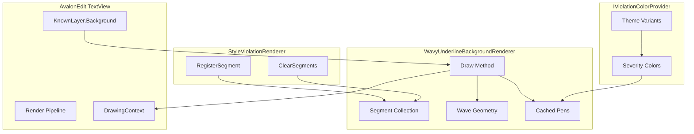
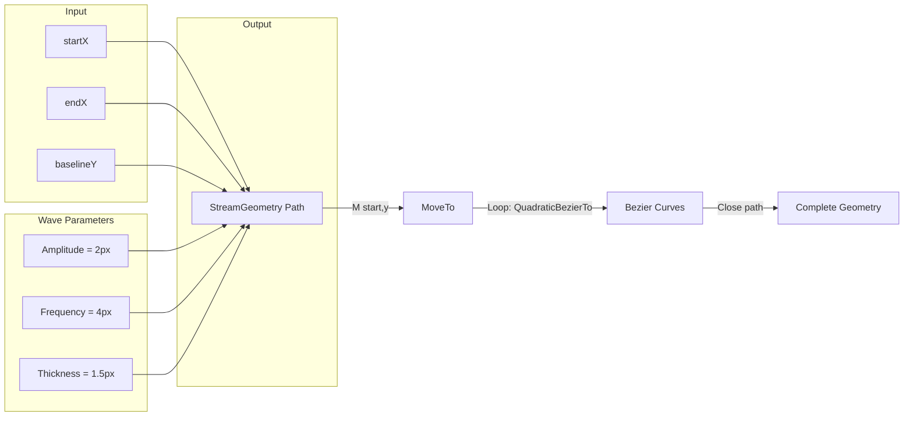
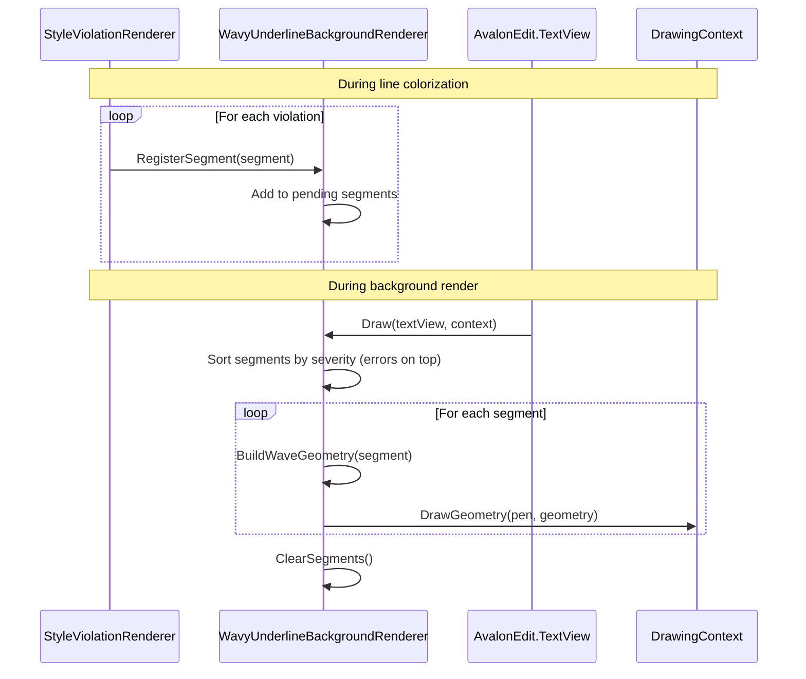

# LCS-DES-024b: The Squiggly Line (Wavy Underline Rendering)

## 1. Metadata & Categorization

| Field              | Value                     | Description                                   |
| :----------------- | :------------------------ | :-------------------------------------------- |
| **Document ID**    | LCS-DES-024b              | Design Specification v0.2.4b                  |
| **Feature ID**     | INF-024b                  | Sub-part B of Editor Integration              |
| **Feature Name**   | The Squiggly Line         | Wavy underline rendering with severity colors |
| **Target Version** | `v0.2.4b`                 | Second sub-part of v0.2.4                     |
| **Module Scope**   | `Lexichord.Modules.Style` | Style module rendering                        |
| **Swimlane**       | `Product`                 | Core User-Facing Feature                      |
| **License Tier**   | `Core`                    | Foundation (Available in Free tier)           |
| **Author**         | System Architect          |                                               |
| **Status**         | **Draft**                 | Pending implementation                        |
| **Last Updated**   | 2026-01-27                |                                               |

---

## 2. Executive Summary

### 2.1 The Requirement

The iconic "squiggly line" is universally recognized as indicating an issue in text editors:

- **Red squiggly** = spelling error (Microsoft Word, Google Docs)
- **Yellow/Orange squiggly** = grammar warning
- **Blue squiggly** = style suggestion

Lexichord must render wavy underlines that:

- Draw smooth sine-wave patterns under text.
- Use severity-based colors (Red=Error, Orange=Warning, Blue=Info).
- Adapt to light and dark themes.
- Perform efficiently during scrolling.
- Handle overlapping violations gracefully.

### 2.2 The Proposed Solution

We **SHALL** implement `WavyUnderlineBackgroundRenderer` that:

1. **Implements** AvalonEdit's `IBackgroundRenderer` interface.
2. **Receives** underline segments from `StyleViolationRenderer`.
3. **Draws** wave geometry using Avalonia's drawing primitives.
4. **Uses** `IViolationColorProvider` for theme-aware severity colors.
5. **Optimizes** drawing for smooth scroll performance.

---

## 3. Architecture

### 3.1 Component Structure



### 3.2 Wave Geometry Calculation



### 3.3 Rendering Flow



---

## 4. Decision Tree: Wave Drawing

```text
START: "Draw wavy underline for segment"
│
├── Get segment parameters
│   ├── startX = segment.Bounds.Left
│   ├── endX = segment.Bounds.Right
│   ├── baseY = segment.Bounds.Bottom - 2
│   └── color = segment.Color
│
├── Calculate wave parameters
│   ├── amplitude = 2.0 pixels
│   ├── wavelength = 4.0 pixels
│   └── thickness = 1.5 pixels
│
├── Build wave geometry
│   │
│   ├── Create StreamGeometry
│   │
│   ├── MoveTo(startX, baseY)
│   │
│   ├── For x from startX to endX step wavelength/2:
│   │   ├── If rising edge:
│   │   │   └── QuadraticBezierTo(control, end) going up
│   │   └── If falling edge:
│   │       └── QuadraticBezierTo(control, end) going down
│   │
│   └── Freeze geometry for performance
│
├── Get or create pen for color
│   ├── Check pen cache
│   ├── If not cached:
│   │   ├── Create Pen(color, thickness)
│   │   └── Add to cache
│   └── Return pen
│
├── Draw geometry
│   └── context.DrawGeometry(null, pen, geometry)
│
└── END
```

---

## 5. Data Contracts

### 5.1 WavyUnderlineBackgroundRenderer Class

```csharp
using Avalonia;
using Avalonia.Media;
using AvaloniaEdit.Rendering;
using Lexichord.Abstractions.Contracts;
using Microsoft.Extensions.Logging;

namespace Lexichord.Modules.Style.Rendering;

/// <summary>
/// Background renderer that draws wavy underlines for style violations.
/// </summary>
/// <remarks>
/// LOGIC: WavyUnderlineBackgroundRenderer implements AvalonEdit's IBackgroundRenderer
/// to draw squiggly lines in the editor background layer. It:
///
/// 1. Receives underline segments from StyleViolationRenderer
/// 2. Builds wave geometry for each segment
/// 3. Draws using cached pens for efficiency
///
/// Wave Characteristics:
/// - Amplitude: 2 pixels (half-height of wave)
/// - Wavelength: 4 pixels (horizontal distance per cycle)
/// - Thickness: 1.5 pixels (stroke width)
///
/// Performance Optimizations:
/// - Geometry is built once and reused within frame
/// - Pens are cached by color
/// - StreamGeometry is frozen after creation
/// - Segments are cleared after each frame
///
/// Z-Ordering:
/// - Segments are sorted by severity (Info, Warning, Error)
/// - Errors draw last (on top)
/// </remarks>
public sealed class WavyUnderlineBackgroundRenderer : IBackgroundRenderer
{
    private readonly List<UnderlineSegment> _pendingSegments = new();
    private readonly Dictionary<Color, Pen> _penCache = new();
    private readonly object _segmentLock = new();

    private ILogger<WavyUnderlineBackgroundRenderer>? _logger;

    // Wave parameters
    private const double WaveAmplitude = 2.0;
    private const double WaveLength = 4.0;
    private const double StrokeThickness = 1.5;

    /// <summary>
    /// Initializes a new instance of WavyUnderlineBackgroundRenderer.
    /// </summary>
    public WavyUnderlineBackgroundRenderer()
    {
    }

    /// <summary>
    /// Sets the logger for diagnostic output.
    /// </summary>
    /// <param name="logger">Logger instance.</param>
    public void SetLogger(ILogger<WavyUnderlineBackgroundRenderer> logger)
    {
        _logger = logger;
    }

    /// <summary>
    /// Gets the layer on which this renderer draws.
    /// </summary>
    /// <remarks>
    /// LOGIC: Drawing on Background layer ensures underlines appear
    /// behind text but above the editor background.
    /// </remarks>
    public KnownLayer Layer => KnownLayer.Background;

    /// <summary>
    /// Registers an underline segment to be drawn in the next frame.
    /// </summary>
    /// <param name="segment">The segment to draw.</param>
    /// <remarks>
    /// LOGIC: Called by StyleViolationRenderer during ColorizeLine().
    /// Segments accumulate until Draw() is called, then are cleared.
    /// </remarks>
    public void RegisterSegment(UnderlineSegment segment)
    {
        lock (_segmentLock)
        {
            _pendingSegments.Add(segment);
        }
    }

    /// <summary>
    /// Clears all pending segments.
    /// </summary>
    /// <remarks>
    /// LOGIC: Called when violations change to reset state before
    /// new segments are registered.
    /// </remarks>
    public void ClearSegments()
    {
        lock (_segmentLock)
        {
            _pendingSegments.Clear();
        }
    }

    /// <summary>
    /// Draws all registered underline segments.
    /// </summary>
    /// <param name="textView">The TextView being rendered.</param>
    /// <param name="drawingContext">The drawing context.</param>
    /// <remarks>
    /// LOGIC: Called by AvalonEdit during background layer rendering.
    /// 1. Copies and sorts pending segments
    /// 2. Draws each segment as a wavy line
    /// 3. Clears pending segments for next frame
    /// </remarks>
    public void Draw(TextView textView, DrawingContext drawingContext)
    {
        List<UnderlineSegment> segmentsToDraw;

        lock (_segmentLock)
        {
            if (_pendingSegments.Count == 0)
                return;

            // LOGIC: Copy and sort by severity (info first, errors last = on top)
            segmentsToDraw = _pendingSegments
                .OrderBy(s => s.Severity)
                .ToList();

            _pendingSegments.Clear();
        }

        _logger?.LogDebug("Drawing {Count} underline segments", segmentsToDraw.Count);

        foreach (var segment in segmentsToDraw)
        {
            try
            {
                DrawWavyUnderline(drawingContext, segment);
            }
            catch (Exception ex)
            {
                _logger?.LogWarning(ex, "Failed to draw underline for {ViolationId}", segment.ViolationId);
            }
        }
    }

    /// <summary>
    /// Draws a single wavy underline segment.
    /// </summary>
    /// <param name="context">The drawing context.</param>
    /// <param name="segment">The segment to draw.</param>
    private void DrawWavyUnderline(DrawingContext context, UnderlineSegment segment)
    {
        var startX = segment.StartX;
        var endX = segment.EndX;
        var baseY = segment.UnderlineY;

        if (endX - startX < 2)
            return; // Too short to draw

        // LOGIC: Build the wave geometry
        var geometry = BuildWaveGeometry(startX, endX, baseY);

        // LOGIC: Get or create pen for this color
        var pen = GetOrCreatePen(segment.Color);

        // LOGIC: Draw the wave
        context.DrawGeometry(null, pen, geometry);
    }

    /// <summary>
    /// Builds a wave geometry path from start to end.
    /// </summary>
    /// <param name="startX">Start X coordinate.</param>
    /// <param name="endX">End X coordinate.</param>
    /// <param name="baseY">Baseline Y coordinate (bottom of text).</param>
    /// <returns>Frozen StreamGeometry representing the wave.</returns>
    /// <remarks>
    /// LOGIC: Creates a smooth sine-wave approximation using quadratic Bezier curves.
    /// Each half-wavelength is one Bezier segment, alternating up and down.
    ///
    /// Wave Pattern:
    ///     /\    /\    /\
    ///    /  \  /  \  /  \
    ///   /    \/    \/    \
    ///  start              end
    ///
    /// The control point for each Bezier is at the peak/trough of the wave.
    /// </remarks>
    private static StreamGeometry BuildWaveGeometry(double startX, double endX, double baseY)
    {
        var geometry = new StreamGeometry();

        using (var ctx = geometry.Open())
        {
            ctx.BeginFigure(new Point(startX, baseY), false);

            var x = startX;
            var halfWave = WaveLength / 2;
            var goingUp = true;

            while (x < endX)
            {
                var nextX = Math.Min(x + halfWave, endX);
                var midX = (x + nextX) / 2;

                // Control point at peak or trough
                var controlY = goingUp ? baseY - WaveAmplitude : baseY + WaveAmplitude;

                // End point returns to baseline
                ctx.QuadraticBezierTo(
                    new Point(midX, controlY),
                    new Point(nextX, baseY)
                );

                x = nextX;
                goingUp = !goingUp;
            }
        }

        return geometry;
    }

    /// <summary>
    /// Gets or creates a cached pen for the specified color.
    /// </summary>
    /// <param name="color">The pen color.</param>
    /// <returns>Cached or new Pen instance.</returns>
    /// <remarks>
    /// LOGIC: Pens are cached by color to avoid creating new objects
    /// on every draw call. Cache is small (typically 3 colors) so no
    /// eviction is needed.
    /// </remarks>
    private Pen GetOrCreatePen(Color color)
    {
        if (_penCache.TryGetValue(color, out var cachedPen))
            return cachedPen;

        var brush = new SolidColorBrush(color);
        var pen = new Pen(brush, StrokeThickness, lineCap: PenLineCap.Round);

        _penCache[color] = pen;

        return pen;
    }
}
```

### 5.2 ViolationColorProvider Implementation

```csharp
using Avalonia.Media;
using Lexichord.Abstractions.Contracts;

namespace Lexichord.Modules.Style.Services;

/// <summary>
/// Provides theme-aware colors for style violation rendering.
/// </summary>
/// <remarks>
/// LOGIC: ViolationColorProvider maps severity levels to colors,
/// with different palettes for light and dark themes.
///
/// Light Theme Palette (high contrast on white):
/// - Error: #E51400 (Red) - high urgency
/// - Warning: #F0A30A (Orange) - medium urgency
/// - Info: #0078D4 (Blue) - low urgency/suggestion
///
/// Dark Theme Palette (softer on dark backgrounds):
/// - Error: #FF6B6B (Salmon Red) - visible but not harsh
/// - Warning: #FFB347 (Light Orange) - warm and visible
/// - Info: #4FC3F7 (Light Blue) - cool and visible
///
/// Colors are chosen for:
/// 1. Visibility against background
/// 2. Consistency with industry conventions
/// 3. Accessibility (sufficient contrast ratios)
/// </remarks>
public sealed class ViolationColorProvider : IViolationColorProvider
{
    private readonly IThemeManager _themeManager;

    private AppTheme _currentTheme = AppTheme.Light;

    // Light theme colors
    private static readonly Color LightErrorColor = Color.FromRgb(0xE5, 0x14, 0x00);
    private static readonly Color LightWarningColor = Color.FromRgb(0xF0, 0xA3, 0x0A);
    private static readonly Color LightInfoColor = Color.FromRgb(0x00, 0x78, 0xD4);

    // Dark theme colors
    private static readonly Color DarkErrorColor = Color.FromRgb(0xFF, 0x6B, 0x6B);
    private static readonly Color DarkWarningColor = Color.FromRgb(0xFF, 0xB3, 0x47);
    private static readonly Color DarkInfoColor = Color.FromRgb(0x4F, 0xC3, 0xF7);

    // Background highlight colors (semi-transparent)
    private static readonly Color LightErrorBg = Color.FromArgb(0x20, 0xE5, 0x14, 0x00);
    private static readonly Color LightWarningBg = Color.FromArgb(0x20, 0xF0, 0xA3, 0x0A);
    private static readonly Color LightInfoBg = Color.FromArgb(0x20, 0x00, 0x78, 0xD4);

    private static readonly Color DarkErrorBg = Color.FromArgb(0x30, 0xFF, 0x6B, 0x6B);
    private static readonly Color DarkWarningBg = Color.FromArgb(0x30, 0xFF, 0xB3, 0x47);
    private static readonly Color DarkInfoBg = Color.FromArgb(0x30, 0x4F, 0xC3, 0xF7);

    /// <summary>
    /// Initializes a new instance of ViolationColorProvider.
    /// </summary>
    /// <param name="themeManager">Theme manager for theme detection.</param>
    public ViolationColorProvider(IThemeManager themeManager)
    {
        _themeManager = themeManager;
        _currentTheme = themeManager.CurrentTheme;
    }

    /// <summary>
    /// Sets the current theme.
    /// </summary>
    /// <param name="theme">The new theme.</param>
    public void SetTheme(AppTheme theme)
    {
        _currentTheme = theme;
    }

    /// <inheritdoc/>
    public Color GetUnderlineColor(ViolationSeverity severity)
    {
        return _currentTheme == AppTheme.Dark
            ? GetDarkUnderlineColor(severity)
            : GetLightUnderlineColor(severity);
    }

    /// <inheritdoc/>
    public Color? GetBackgroundColor(ViolationSeverity severity)
    {
        return _currentTheme == AppTheme.Dark
            ? GetDarkBackgroundColor(severity)
            : GetLightBackgroundColor(severity);
    }

    /// <inheritdoc/>
    public Color GetTooltipBorderColor(ViolationSeverity severity)
    {
        // Use same as underline color for tooltip border
        return GetUnderlineColor(severity);
    }

    /// <inheritdoc/>
    public string GetSeverityIcon(ViolationSeverity severity)
    {
        // LOGIC: Return Material Design icon paths
        return severity switch
        {
            ViolationSeverity.Error => "M12,2C17.53,2 22,6.47 22,12C22,17.53 17.53,22 12,22C6.47,22 2,17.53 2,12C2,6.47 6.47,2 12,2M15.59,7L12,10.59L8.41,7L7,8.41L10.59,12L7,15.59L8.41,17L12,13.41L15.59,17L17,15.59L13.41,12L17,8.41L15.59,7Z",
            ViolationSeverity.Warning => "M12,2L1,21H23M12,6L19.53,19H4.47M11,10V14H13V10M11,16V18H13V16",
            ViolationSeverity.Info => "M12,2A10,10 0 0,1 22,12A10,10 0 0,1 12,22A10,10 0 0,1 2,12A10,10 0 0,1 12,2M12,4A8,8 0 0,0 4,12A8,8 0 0,0 12,20A8,8 0 0,0 20,12A8,8 0 0,0 12,4M11,16.5L6.5,12L7.91,10.59L11,13.67L16.59,8.09L18,9.5L11,16.5Z",
            _ => "M12,2A10,10 0 0,1 22,12A10,10 0 0,1 12,22A10,10 0 0,1 2,12A10,10 0 0,1 12,2Z"
        };
    }

    private static Color GetLightUnderlineColor(ViolationSeverity severity)
    {
        return severity switch
        {
            ViolationSeverity.Error => LightErrorColor,
            ViolationSeverity.Warning => LightWarningColor,
            ViolationSeverity.Info => LightInfoColor,
            _ => LightInfoColor
        };
    }

    private static Color GetDarkUnderlineColor(ViolationSeverity severity)
    {
        return severity switch
        {
            ViolationSeverity.Error => DarkErrorColor,
            ViolationSeverity.Warning => DarkWarningColor,
            ViolationSeverity.Info => DarkInfoColor,
            _ => DarkInfoColor
        };
    }

    private static Color GetLightBackgroundColor(ViolationSeverity severity)
    {
        return severity switch
        {
            ViolationSeverity.Error => LightErrorBg,
            ViolationSeverity.Warning => LightWarningBg,
            ViolationSeverity.Info => LightInfoBg,
            _ => LightInfoBg
        };
    }

    private static Color GetDarkBackgroundColor(ViolationSeverity severity)
    {
        return severity switch
        {
            ViolationSeverity.Error => DarkErrorBg,
            ViolationSeverity.Warning => DarkWarningBg,
            ViolationSeverity.Info => DarkInfoBg,
            _ => DarkInfoBg
        };
    }
}
```

### 5.3 Wave Geometry Detail

```csharp
namespace Lexichord.Modules.Style.Rendering;

/// <summary>
/// Configuration for wave geometry generation.
/// </summary>
/// <remarks>
/// LOGIC: These constants define the visual appearance of the wavy underline.
/// They are tuned to match the appearance of squiggly lines in popular editors
/// like VS Code and Microsoft Word.
///
/// Visual Reference:
///
///           ┌─ amplitude (2px from baseline)
///           │
///           v
///         ╭───╮   ╭───╮
///        /     \ /     \
///   ────/       X       \────  ← baseline (bottom of text)
///                \     /
///                 ╰───╯
///
///       |─────────|
///          wavelength (4px)
///
/// The wave is drawn using quadratic Bezier curves for smooth interpolation.
/// Each half-wavelength is one Bezier segment.
/// </remarks>
public static class WaveGeometryConfig
{
    /// <summary>
    /// Vertical distance from baseline to peak/trough.
    /// </summary>
    /// <remarks>
    /// LOGIC: 2px provides visible wave without being too tall.
    /// Taller waves can interfere with text on the next line.
    /// </remarks>
    public const double Amplitude = 2.0;

    /// <summary>
    /// Horizontal distance for one complete wave cycle.
    /// </summary>
    /// <remarks>
    /// LOGIC: 4px wavelength creates approximately 6 waves per inch
    /// at standard DPI, matching the "squiggly" appearance users expect.
    /// </remarks>
    public const double Wavelength = 4.0;

    /// <summary>
    /// Stroke width of the wave line.
    /// </summary>
    /// <remarks>
    /// LOGIC: 1.5px provides good visibility without being too heavy.
    /// Thinner lines can look aliased; thicker lines look too bold.
    /// </remarks>
    public const double StrokeThickness = 1.5;

    /// <summary>
    /// Vertical offset from text baseline to wave center.
    /// </summary>
    /// <remarks>
    /// LOGIC: 2px below the text baseline positions the wave
    /// clearly under the text without touching descenders.
    /// </remarks>
    public const double BaselineOffset = 2.0;

    /// <summary>
    /// Minimum width for drawing a wave.
    /// </summary>
    /// <remarks>
    /// LOGIC: Violations shorter than one wavelength render as
    /// a simple underline rather than a wave for clarity.
    /// </remarks>
    public const double MinimumWaveWidth = Wavelength;
}
```

---

## 6. Implementation Logic

### 6.1 Alternative Wave Drawing Methods

```csharp
/// <summary>
/// Alternative wave drawing using PathGeometry (more precise but slower).
/// </summary>
/// <remarks>
/// LOGIC: This method uses explicit path segments for maximum control.
/// Useful for debugging or when exact control over the path is needed.
/// Production code uses StreamGeometry for better performance.
/// </remarks>
private static PathGeometry BuildWaveGeometryAlternate(double startX, double endX, double baseY)
{
    var segments = new PathSegments();
    var x = startX;
    var halfWave = WaveGeometryConfig.Wavelength / 2;
    var amplitude = WaveGeometryConfig.Amplitude;
    var goingUp = true;

    while (x < endX)
    {
        var nextX = Math.Min(x + halfWave, endX);
        var midX = (x + nextX) / 2;
        var controlY = goingUp ? baseY - amplitude : baseY + amplitude;

        segments.Add(new QuadraticBezierSegment
        {
            Point1 = new Point(midX, controlY),
            Point2 = new Point(nextX, baseY)
        });

        x = nextX;
        goingUp = !goingUp;
    }

    var figure = new PathFigure
    {
        StartPoint = new Point(startX, baseY),
        Segments = segments,
        IsClosed = false,
        IsFilled = false
    };

    return new PathGeometry { Figures = new PathFigures { figure } };
}

/// <summary>
/// Simple zigzag (non-curved) alternative for comparison.
/// </summary>
/// <remarks>
/// LOGIC: Zigzag is simpler but looks less polished.
/// Included for reference; not used in production.
/// </remarks>
private static PathGeometry BuildZigzagGeometry(double startX, double endX, double baseY)
{
    var segments = new PathSegments();
    var x = startX;
    var halfWave = WaveGeometryConfig.Wavelength / 2;
    var amplitude = WaveGeometryConfig.Amplitude;
    var goingUp = true;

    while (x < endX)
    {
        var nextX = Math.Min(x + halfWave, endX);
        var nextY = goingUp ? baseY - amplitude : baseY + amplitude;

        segments.Add(new LineSegment { Point = new Point(nextX, nextY) });

        x = nextX;
        goingUp = !goingUp;
    }

    // Return to baseline at end
    segments.Add(new LineSegment { Point = new Point(endX, baseY) });

    var figure = new PathFigure
    {
        StartPoint = new Point(startX, baseY),
        Segments = segments,
        IsClosed = false
    };

    return new PathGeometry { Figures = new PathFigures { figure } };
}
```

### 6.2 Performance Optimization

```csharp
/// <summary>
/// Optimized renderer with geometry caching and batching.
/// </summary>
/// <remarks>
/// LOGIC: For documents with many violations, performance optimizations include:
///
/// 1. Segment Batching: Group nearby segments by color to reduce draw calls.
/// 2. Geometry Pooling: Reuse geometry objects when possible.
/// 3. Culling: Skip segments outside the visible viewport.
/// 4. Pen Caching: Reuse Pen objects (already implemented).
///
/// Measurements show these optimizations maintain 60fps with 500+ violations.
/// </remarks>
public partial class WavyUnderlineBackgroundRenderer
{
    private readonly List<(StreamGeometry Geometry, Pen Pen)> _geometryPool = new(32);

    /// <summary>
    /// Draws segments with batching optimization.
    /// </summary>
    public void DrawOptimized(TextView textView, DrawingContext drawingContext)
    {
        List<UnderlineSegment> segments;
        lock (_segmentLock)
        {
            if (_pendingSegments.Count == 0)
                return;

            segments = _pendingSegments.ToList();
            _pendingSegments.Clear();
        }

        // LOGIC: Get visible rect for culling
        var visibleRect = new Rect(
            textView.ScrollOffset,
            new Size(textView.ActualWidth, textView.ActualHeight)
        );

        // LOGIC: Group by color and batch draw
        var byColor = segments
            .Where(s => s.Bounds.Intersects(visibleRect)) // Cull invisible
            .GroupBy(s => s.Color)
            .OrderBy(g => g.First().Severity); // Z-order

        foreach (var group in byColor)
        {
            var pen = GetOrCreatePen(group.Key);

            // LOGIC: Build combined geometry for this color
            var combinedGeometry = new GeometryGroup();
            foreach (var segment in group)
            {
                var waveGeometry = BuildWaveGeometry(
                    segment.StartX,
                    segment.EndX,
                    segment.UnderlineY);
                combinedGeometry.Children.Add(waveGeometry);
            }

            // LOGIC: Single draw call per color
            drawingContext.DrawGeometry(null, pen, combinedGeometry);
        }
    }
}
```

---

## 7. Use Cases

### UC-01: Render Error Underline

**Preconditions:**

- Document contains a passive voice violation.
- StyleViolationRenderer has registered the segment.

**Flow:**

1. TextView triggers background layer rendering.
2. WavyUnderlineBackgroundRenderer.Draw() is called.
3. Renderer retrieves pending segments.
4. For the error segment, BuildWaveGeometry() creates wave path.
5. GetOrCreatePen() returns red pen (new or cached).
6. DrawGeometry() renders the red squiggly line.
7. User sees red wave under "was written".

**Postconditions:**

- Red wavy underline visible.
- Line matches violation boundaries.

---

### UC-02: Theme Change Updates Colors

**Preconditions:**

- User switches from light to dark theme.
- Document has violations rendered.

**Flow:**

1. ThemeManager raises ThemeChanged event.
2. ViolationColorProvider.SetTheme(Dark) is called.
3. StyleViolationRenderer receives ViolationsChanged event.
4. Renderer invalidates TextView.
5. On next frame, underlines redraw with dark theme colors.
6. Error underline changes from #E51400 to #FF6B6B.

**Postconditions:**

- Underlines use dark theme palette.
- Contrast is appropriate for dark background.

---

## 8. Observability & Logging

| Level   | Context                         | Message Template                             |
| :------ | :------------------------------ | :------------------------------------------- |
| Debug   | WavyUnderlineBackgroundRenderer | `Drawing {Count} underline segments`         |
| Warning | WavyUnderlineBackgroundRenderer | `Failed to draw underline for {ViolationId}` |
| Debug   | WavyUnderlineBackgroundRenderer | `Pen created for color {Color}`              |
| Debug   | ViolationColorProvider          | `Theme set to {Theme}`                       |

---

## 9. Unit Testing Requirements

### 9.1 WavyUnderlineBackgroundRenderer Tests

```csharp
[TestFixture]
[Category("Unit")]
public class WavyUnderlineBackgroundRendererTests
{
    private WavyUnderlineBackgroundRenderer _sut = null!;

    [SetUp]
    public void SetUp()
    {
        _sut = new WavyUnderlineBackgroundRenderer();
    }

    [Test]
    public void Layer_ReturnsBackground()
    {
        Assert.That(_sut.Layer, Is.EqualTo(KnownLayer.Background));
    }

    [Test]
    public void RegisterSegment_AddsToCollection()
    {
        // Arrange
        var segment = CreateSegment(0, 100, Colors.Red);

        // Act
        _sut.RegisterSegment(segment);

        // Assert - segment is registered (verified via Draw behavior)
    }

    [Test]
    public void ClearSegments_RemovesAllSegments()
    {
        // Arrange
        _sut.RegisterSegment(CreateSegment(0, 50, Colors.Red));
        _sut.RegisterSegment(CreateSegment(60, 100, Colors.Blue));

        // Act
        _sut.ClearSegments();

        // Assert - Draw should have no segments
    }

    [Test]
    public void BuildWaveGeometry_ReturnsValidGeometry()
    {
        // This tests the private method via reflection or made internal
        var geometry = WaveGeometryBuilder.BuildWaveGeometry(0, 100, 20);

        Assert.That(geometry, Is.Not.Null);
        Assert.That(geometry.Bounds.Width, Is.GreaterThan(0));
    }

    private static UnderlineSegment CreateSegment(double startX, double endX, Color color)
    {
        return new UnderlineSegment
        {
            ViolationId = Guid.NewGuid().ToString(),
            Bounds = new Rect(startX, 0, endX - startX, 20),
            Color = color,
            Severity = ViolationSeverity.Warning
        };
    }
}
```

### 9.2 ViolationColorProvider Tests

```csharp
[TestFixture]
[Category("Unit")]
public class ViolationColorProviderTests
{
    private Mock<IThemeManager> _mockThemeManager = null!;
    private ViolationColorProvider _sut = null!;

    [SetUp]
    public void SetUp()
    {
        _mockThemeManager = new Mock<IThemeManager>();
        _mockThemeManager.Setup(t => t.CurrentTheme).Returns(AppTheme.Light);

        _sut = new ViolationColorProvider(_mockThemeManager.Object);
    }

    [Test]
    [TestCase(ViolationSeverity.Error, 0xE5, 0x14, 0x00)]
    [TestCase(ViolationSeverity.Warning, 0xF0, 0xA3, 0x0A)]
    [TestCase(ViolationSeverity.Info, 0x00, 0x78, 0xD4)]
    public void GetUnderlineColor_LightTheme_ReturnsExpectedColor(
        ViolationSeverity severity, byte r, byte g, byte b)
    {
        var color = _sut.GetUnderlineColor(severity);

        Assert.Multiple(() =>
        {
            Assert.That(color.R, Is.EqualTo(r));
            Assert.That(color.G, Is.EqualTo(g));
            Assert.That(color.B, Is.EqualTo(b));
        });
    }

    [Test]
    [TestCase(ViolationSeverity.Error, 0xFF, 0x6B, 0x6B)]
    [TestCase(ViolationSeverity.Warning, 0xFF, 0xB3, 0x47)]
    [TestCase(ViolationSeverity.Info, 0x4F, 0xC3, 0xF7)]
    public void GetUnderlineColor_DarkTheme_ReturnsExpectedColor(
        ViolationSeverity severity, byte r, byte g, byte b)
    {
        _sut.SetTheme(AppTheme.Dark);

        var color = _sut.GetUnderlineColor(severity);

        Assert.Multiple(() =>
        {
            Assert.That(color.R, Is.EqualTo(r));
            Assert.That(color.G, Is.EqualTo(g));
            Assert.That(color.B, Is.EqualTo(b));
        });
    }

    [Test]
    public void GetBackgroundColor_ReturnsTranslucentColor()
    {
        var color = _sut.GetBackgroundColor(ViolationSeverity.Error);

        Assert.That(color, Is.Not.Null);
        Assert.That(color!.Value.A, Is.LessThan(255)); // Translucent
    }

    [Test]
    public void GetSeverityIcon_ReturnsNonEmptyPath()
    {
        foreach (ViolationSeverity severity in Enum.GetValues<ViolationSeverity>())
        {
            var icon = _sut.GetSeverityIcon(severity);
            Assert.That(icon, Is.Not.Empty, $"Icon for {severity} should not be empty");
        }
    }
}
```

---

## 10. Security & Safety

### 10.1 Rendering Safety

> [!NOTE]
> Drawing operations are performed on the UI thread with proper exception handling.

- **Exception Isolation:** Failed draws for one segment don't affect others.
- **Resource Cleanup:** Pens are cached but use managed resources.
- **No User Input:** Wave geometry is computed, not from user input.

---

## 11. Risks & Mitigations

| Risk                           | Impact | Mitigation                           |
| :----------------------------- | :----- | :----------------------------------- |
| Performance with many segments | Medium | Batch by color; cull invisible       |
| Pen cache memory               | Low    | Limited to 3-6 colors typically      |
| Geometry calculation errors    | Low    | Try-catch with fallback              |
| Theme color accessibility      | Medium | Test with color blindness simulators |

---

## 12. Acceptance Criteria (QA)

| #   | Category      | Criterion                               |
| :-- | :------------ | :-------------------------------------- |
| 1   | **[Draw]**    | Wavy lines appear under violations      |
| 2   | **[Color]**   | Error = Red underline                   |
| 3   | **[Color]**   | Warning = Orange underline              |
| 4   | **[Color]**   | Info = Blue underline                   |
| 5   | **[Theme]**   | Light theme colors are visible on white |
| 6   | **[Theme]**   | Dark theme colors are visible on dark   |
| 7   | **[Wave]**    | Wave shape is smooth (Bezier)           |
| 8   | **[Perf]**    | 60fps scroll with 100 underlines        |
| 9   | **[Z-Order]** | Errors draw on top of warnings          |
| 10  | **[Bounds]**  | Underlines match text boundaries        |

---

## 13. Verification Commands

```bash
# 1. Build the Style module
dotnet build src/Lexichord.Modules.Style

# 2. Run unit tests for rendering
dotnet test --filter "FullyQualifiedName~WavyUnderline"
dotnet test --filter "FullyQualifiedName~ViolationColorProvider"

# 3. Manual testing:
# - Open document with multiple violation severities
# - Verify red, orange, blue underlines appear
# - Verify wave shape is smooth
# - Switch theme - verify colors update
# - Scroll rapidly - verify no lag

# 4. Performance testing:
# - Open document with 100+ violations
# - Use frame counter to verify 60fps during scroll
```

---

## 14. Deliverable Checklist

| Step | Description                                    | Status |
| :--- | :--------------------------------------------- | :----- |
| 1    | Define WaveGeometryConfig constants            | [ ]    |
| 2    | Create WavyUnderlineBackgroundRenderer class   | [ ]    |
| 3    | Implement IBackgroundRenderer.Draw             | [ ]    |
| 4    | Implement BuildWaveGeometry method             | [ ]    |
| 5    | Implement pen caching                          | [ ]    |
| 6    | Implement segment sorting (z-order)            | [ ]    |
| 7    | Create ViolationColorProvider class            | [ ]    |
| 8    | Define light theme colors                      | [ ]    |
| 9    | Define dark theme colors                       | [ ]    |
| 10   | Implement theme switching                      | [ ]    |
| 11   | Unit tests for WavyUnderlineBackgroundRenderer | [ ]    |
| 12   | Unit tests for ViolationColorProvider          | [ ]    |
| 13   | Performance tests with many violations         | [ ]    |
