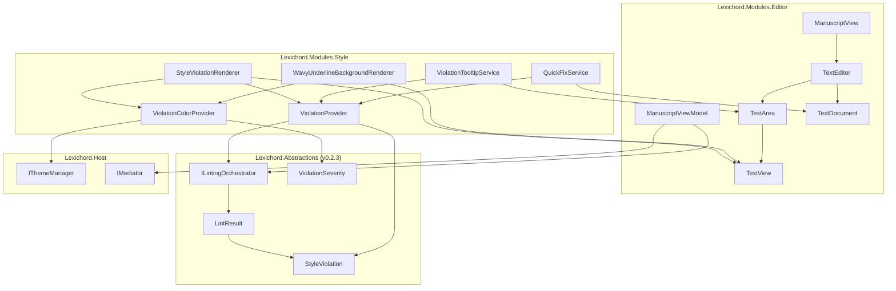
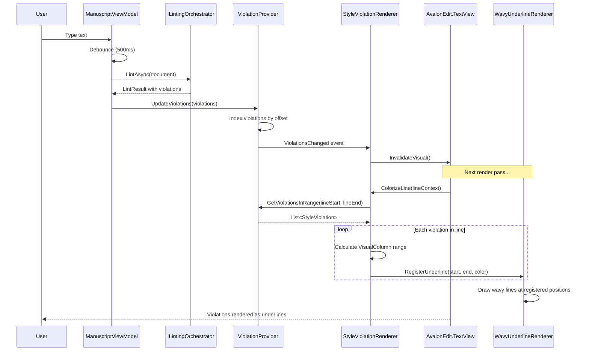
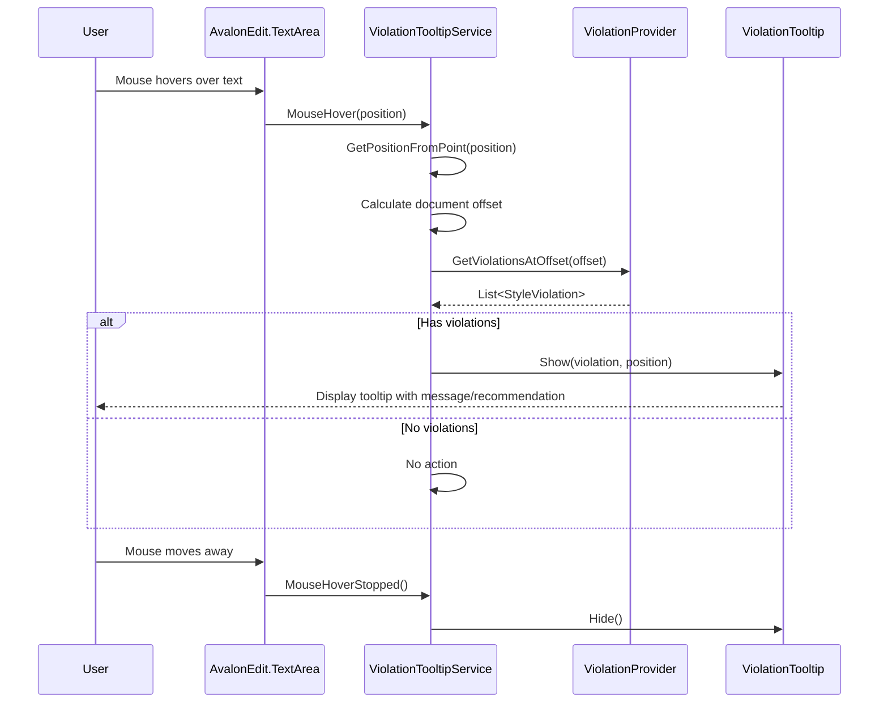

# LCS-INF-024: Feature Design Specification — Red Pen (Editor Integration)

## 1. Metadata & Categorization

| Field                | Value                                                     | Description                                           |
| :------------------- | :-------------------------------------------------------- | :---------------------------------------------------- |
| **Feature ID**       | `INF-024`                                                 | Infrastructure - Editor Integration                   |
| **Feature Name**     | Red Pen (Editor Integration)                              | Visual style feedback in AvalonEdit                   |
| **Target Version**   | `v0.2.4`                                                  | Style System UI Milestone                             |
| **Module Scope**     | `Lexichord.Modules.Editor`, `Lexichord.Modules.Style`     | Cross-module integration                              |
| **Swimlane**         | `Product`                                                 | Core User-Facing Feature                              |
| **License Tier**     | `Core`                                                    | Foundation (Available in Free tier for basic rules)   |
| **Feature Gate Key** | `style.editor.integration`                                | Optional premium rules gated separately               |
| **Author**           | System Architect                                          |                                                       |
| **Status**           | **Draft**                                                 | Pending implementation                                |
| **Last Updated**     | 2026-01-26                                                |                                                       |

---

## 2. Executive Summary

### 2.1 The Requirement

Lexichord's style system (v0.2.3) analyzes text and produces violations, but without visual integration, writers cannot see these issues in context:

- Writers need to see style violations **directly in their text**, not in a separate panel.
- Visual feedback must be **familiar** — colored wavy underlines like spell-checkers.
- Hovering over an issue should show **what's wrong** and **how to fix it**.
- Right-clicking should offer **one-click corrections** when suggestions are available.
- The system must handle **100+ violations** without degrading editor performance.

Without this integration, the style system is invisible and unusable.

### 2.2 The Proposed Solution

We **SHALL** implement a complete editor integration layer with:

1. **v0.2.4a: StyleViolationRenderer** — DocumentColorizingTransformer that applies visual decorations during text rendering.
2. **v0.2.4b: Wavy Underline Drawing** — Custom drawing logic for squiggly lines with severity-based colors (Red/Orange/Blue).
3. **v0.2.4c: Hover Tooltips** — Mouse hover detection showing violation details and recommendations.
4. **v0.2.4d: Context Menu Quick-Fixes** — Right-click menu with "Change to '{suggestion}'" actions.

---

## 3. Architecture & Modular Strategy

### 3.1 High-Level Architecture



### 3.2 Violation Rendering Flow



### 3.3 Tooltip Interaction Flow



### 3.4 Dependencies

**From v0.2.3 (Linter Engine):**

| Component | Type | Usage |
|:----------|:-----|:------|
| `StyleViolation` | Record | Data model with offset, length, severity, message, recommendation |
| `ViolationSeverity` | Enum | Error, Warning, Info levels |
| `ILintingOrchestrator` | Interface | Produces LintResult from document text |
| `LintResult` | Record | Container for violations and metadata |
| `StyleRule` | Record | Rule definition with ID, name, description |

**From v0.1.3 (Editor Module):**

| Component | Type | Usage |
|:----------|:-----|:------|
| `ManuscriptView` | UserControl | Host for TextEditor, provides access to TextArea |
| `ManuscriptViewModel` | ViewModel | Triggers linting, manages violation state |
| `TextEditor` | Control | AvalonEdit's main control |
| `TextArea` | Control | Inner control for text editing |
| `TextView` | Control | Visual rendering surface |
| `TextDocument` | Class | Mutable text content |

**NuGet Packages:**

| Package | Version | Purpose |
|:--------|:--------|:--------|
| `AvaloniaEdit` | 11.x | Text editor control with transformer API |

### 3.5 Licensing Behavior

- **Core License:** Basic style rules rendered (e.g., passive voice, wordiness).
- **WriterPro License:** Advanced rules (e.g., clarity score, readability grade).
- **Enterprise License:** Custom style rules with custom colors.

---

## 4. Decision Tree: Violation Rendering

```text
START: "How to render style violations?"
│
├── Document content changes
│   ├── Trigger lint after debounce (500ms)
│   ├── Receive LintResult from ILintingOrchestrator
│   ├── Update ViolationProvider with new violations
│   └── Invalidate TextView visual
│
├── TextView requests line colorization
│   ├── For each visible line:
│   │   ├── Query violations intersecting line bounds
│   │   ├── For each violation:
│   │   │   ├── Calculate visual column start/end
│   │   │   ├── Get color for severity
│   │   │   │   ├── Error → Red (#E51400 light / #FF6B6B dark)
│   │   │   │   ├── Warning → Orange (#F0A30A light / #FFB347 dark)
│   │   │   │   └── Info → Blue (#0078D4 light / #4FC3F7 dark)
│   │   │   └── Register underline for background renderer
│   │   └── Continue to next violation
│   └── Continue to next line
│
├── Background renderer draws underlines
│   ├── For each registered underline:
│   │   ├── Get text bounds from visual line
│   │   ├── Calculate wave path geometry
│   │   ├── Draw path with severity color
│   │   └── Continue
│   └── Complete
│
└── END
```

---

## 5. Data Contracts

### 5.1 StyleViolation (from v0.2.3)

```csharp
namespace Lexichord.Abstractions.Contracts;

/// <summary>
/// Represents a style violation detected in a document.
/// </summary>
/// <remarks>
/// LOGIC: StyleViolation contains all information needed to:
/// 1. Locate the issue in the document (offset, length)
/// 2. Render the issue visually (severity determines color)
/// 3. Explain the issue to the user (message)
/// 4. Offer a fix (recommendation, if available)
/// </remarks>
public record StyleViolation
{
    /// <summary>
    /// Unique identifier for this violation instance.
    /// </summary>
    public required string Id { get; init; }

    /// <summary>
    /// The rule that was violated.
    /// </summary>
    public required StyleRule Rule { get; init; }

    /// <summary>
    /// Start offset in the document (0-based).
    /// </summary>
    /// <remarks>
    /// LOGIC: Offset is relative to document start, not line start.
    /// Use TextDocument.GetLocation(offset) to get line/column.
    /// </remarks>
    public required int StartOffset { get; init; }

    /// <summary>
    /// Length of the violating text span.
    /// </summary>
    public required int Length { get; init; }

    /// <summary>
    /// End offset (computed from StartOffset + Length).
    /// </summary>
    public int EndOffset => StartOffset + Length;

    /// <summary>
    /// Severity level determining visual treatment.
    /// </summary>
    /// <remarks>
    /// LOGIC: Severity determines underline color:
    /// - Error: Red - must be addressed
    /// - Warning: Orange - should be addressed
    /// - Info: Blue - suggestion for improvement
    /// </remarks>
    public required ViolationSeverity Severity { get; init; }

    /// <summary>
    /// Human-readable message explaining the issue.
    /// </summary>
    /// <example>"Passive voice detected: 'was written'"</example>
    public required string Message { get; init; }

    /// <summary>
    /// The original text that triggered the violation.
    /// </summary>
    public required string OriginalText { get; init; }

    /// <summary>
    /// Suggested replacement text, if available.
    /// </summary>
    /// <remarks>
    /// LOGIC: When non-null, enables "Change to '{Recommendation}'" quick-fix.
    /// When null, no automatic fix is available.
    /// </remarks>
    /// <example>"Consider: 'The author wrote the book'"</example>
    public string? Recommendation { get; init; }

    /// <summary>
    /// Additional context or explanation for the violation.
    /// </summary>
    /// <example>"Passive voice can make writing less direct..."</example>
    public string? Explanation { get; init; }
}

/// <summary>
/// Severity levels for style violations.
/// </summary>
public enum ViolationSeverity
{
    /// <summary>
    /// Informational suggestion (blue underline).
    /// </summary>
    Info = 0,

    /// <summary>
    /// Warning that should be addressed (orange underline).
    /// </summary>
    Warning = 1,

    /// <summary>
    /// Error that must be addressed (red underline).
    /// </summary>
    Error = 2
}

/// <summary>
/// Defines a style rule.
/// </summary>
/// <param name="Id">Unique rule identifier (e.g., "STYLE001").</param>
/// <param name="Name">Human-readable rule name.</param>
/// <param name="Description">Detailed rule description.</param>
/// <param name="DefaultSeverity">Default severity for violations.</param>
/// <param name="Category">Rule category for grouping.</param>
public record StyleRule(
    string Id,
    string Name,
    string Description,
    ViolationSeverity DefaultSeverity,
    string Category
);
```

### 5.2 IViolationProvider Interface

```csharp
namespace Lexichord.Abstractions.Contracts;

/// <summary>
/// Provides access to style violations for rendering and interaction.
/// </summary>
/// <remarks>
/// LOGIC: IViolationProvider acts as the bridge between the linter engine
/// (which produces violations) and the editor integration (which consumes them).
///
/// The provider maintains an indexed collection of violations that can be
/// efficiently queried by document offset. It notifies listeners when
/// violations change so they can refresh their visual state.
///
/// Thread Safety:
/// - GetViolations methods are thread-safe for reading
/// - UpdateViolations must be called from the UI thread
/// - Event handlers are invoked on the UI thread
/// </remarks>
public interface IViolationProvider
{
    /// <summary>
    /// Gets all violations intersecting the specified document range.
    /// </summary>
    /// <param name="startOffset">Start of the range (inclusive).</param>
    /// <param name="endOffset">End of the range (exclusive).</param>
    /// <returns>Violations that overlap with the range.</returns>
    /// <remarks>
    /// LOGIC: A violation intersects if its span overlaps with the query range:
    /// violation.StartOffset &lt; endOffset AND violation.EndOffset &gt; startOffset
    /// </remarks>
    IReadOnlyList<StyleViolation> GetViolationsInRange(int startOffset, int endOffset);

    /// <summary>
    /// Gets all violations at the exact document offset.
    /// </summary>
    /// <param name="offset">Document offset to query.</param>
    /// <returns>Violations that contain the offset.</returns>
    /// <remarks>
    /// LOGIC: Used for hover tooltip - finds violations where:
    /// violation.StartOffset &lt;= offset AND violation.EndOffset &gt; offset
    /// </remarks>
    IReadOnlyList<StyleViolation> GetViolationsAtOffset(int offset);

    /// <summary>
    /// Gets all violations for the current document.
    /// </summary>
    IReadOnlyList<StyleViolation> AllViolations { get; }

    /// <summary>
    /// Gets the count of violations by severity.
    /// </summary>
    /// <param name="severity">Severity level to count.</param>
    /// <returns>Number of violations at that severity.</returns>
    int GetViolationCount(ViolationSeverity severity);

    /// <summary>
    /// Updates the violation collection with new lint results.
    /// </summary>
    /// <param name="violations">New set of violations.</param>
    /// <remarks>
    /// LOGIC: Completely replaces existing violations.
    /// Raises ViolationsChanged event after update.
    /// </remarks>
    void UpdateViolations(IEnumerable<StyleViolation> violations);

    /// <summary>
    /// Clears all violations.
    /// </summary>
    void Clear();

    /// <summary>
    /// Event raised when violations are added, removed, or updated.
    /// </summary>
    event EventHandler<ViolationsChangedEventArgs> ViolationsChanged;
}

/// <summary>
/// Event arguments for violation changes.
/// </summary>
public class ViolationsChangedEventArgs : EventArgs
{
    /// <summary>
    /// The type of change that occurred.
    /// </summary>
    public required ViolationChangeType ChangeType { get; init; }

    /// <summary>
    /// Total number of violations after the change.
    /// </summary>
    public required int TotalCount { get; init; }

    /// <summary>
    /// Count of errors after the change.
    /// </summary>
    public required int ErrorCount { get; init; }

    /// <summary>
    /// Count of warnings after the change.
    /// </summary>
    public required int WarningCount { get; init; }

    /// <summary>
    /// Count of info items after the change.
    /// </summary>
    public required int InfoCount { get; init; }
}

/// <summary>
/// Types of violation collection changes.
/// </summary>
public enum ViolationChangeType
{
    /// <summary>Violations were replaced with new lint results.</summary>
    Replaced,

    /// <summary>Violations were cleared.</summary>
    Cleared
}
```

### 5.3 IViolationColorProvider Interface

```csharp
namespace Lexichord.Abstractions.Contracts;

using Avalonia.Media;

/// <summary>
/// Provides colors for rendering style violations based on severity.
/// </summary>
/// <remarks>
/// LOGIC: IViolationColorProvider abstracts color selection from rendering,
/// allowing theme-aware colors and potential customization.
///
/// Color Palette:
/// - Light Theme: Red=#E51400, Orange=#F0A30A, Blue=#0078D4
/// - Dark Theme: Red=#FF6B6B, Orange=#FFB347, Blue=#4FC3F7
/// </remarks>
public interface IViolationColorProvider
{
    /// <summary>
    /// Gets the underline color for a severity level.
    /// </summary>
    /// <param name="severity">Violation severity.</param>
    /// <returns>Color for the wavy underline.</returns>
    Color GetUnderlineColor(ViolationSeverity severity);

    /// <summary>
    /// Gets the optional background highlight color for a severity level.
    /// </summary>
    /// <param name="severity">Violation severity.</param>
    /// <returns>Color for background highlight, or null if no highlight.</returns>
    /// <remarks>
    /// LOGIC: Background highlight is optional and semi-transparent.
    /// Used when violation is selected or hovered.
    /// </remarks>
    Color? GetBackgroundColor(ViolationSeverity severity);

    /// <summary>
    /// Gets the tooltip border color for a severity level.
    /// </summary>
    /// <param name="severity">Violation severity.</param>
    /// <returns>Color for tooltip border.</returns>
    Color GetTooltipBorderColor(ViolationSeverity severity);

    /// <summary>
    /// Gets the icon for a severity level.
    /// </summary>
    /// <param name="severity">Violation severity.</param>
    /// <returns>Icon geometry or path data.</returns>
    string GetSeverityIcon(ViolationSeverity severity);
}
```

### 5.4 IViolationTooltipService Interface

```csharp
namespace Lexichord.Abstractions.Contracts;

using Avalonia;
using Avalonia.Controls;

/// <summary>
/// Service for displaying violation tooltips on hover.
/// </summary>
/// <remarks>
/// LOGIC: IViolationTooltipService manages tooltip lifecycle:
/// 1. Creates tooltip UI when hovering over violation
/// 2. Positions tooltip near the violation
/// 3. Hides tooltip when mouse moves away
/// 4. Handles multiple violations at same position
/// </remarks>
public interface IViolationTooltipService
{
    /// <summary>
    /// Shows a tooltip for the specified violation.
    /// </summary>
    /// <param name="textArea">The TextArea control (for positioning).</param>
    /// <param name="position">Screen position for tooltip.</param>
    /// <param name="violation">Violation to display.</param>
    void ShowTooltip(Control textArea, Point position, StyleViolation violation);

    /// <summary>
    /// Shows a tooltip for multiple violations at the same position.
    /// </summary>
    /// <param name="textArea">The TextArea control (for positioning).</param>
    /// <param name="position">Screen position for tooltip.</param>
    /// <param name="violations">Violations to display.</param>
    void ShowTooltip(Control textArea, Point position, IReadOnlyList<StyleViolation> violations);

    /// <summary>
    /// Hides the currently visible tooltip.
    /// </summary>
    void HideTooltip();

    /// <summary>
    /// Gets whether a tooltip is currently visible.
    /// </summary>
    bool IsTooltipVisible { get; }

    /// <summary>
    /// Gets or sets the hover delay before showing tooltip (milliseconds).
    /// </summary>
    int HoverDelayMs { get; set; }
}
```

### 5.5 IQuickFixService Interface

```csharp
namespace Lexichord.Abstractions.Contracts;

/// <summary>
/// Service for providing and applying quick-fix actions.
/// </summary>
/// <remarks>
/// LOGIC: IQuickFixService bridges violations with text modifications:
/// 1. Queries available fixes for violations at an offset
/// 2. Generates menu items for display
/// 3. Applies selected fix by modifying document
///
/// Fixes respect document change tracking for undo/redo.
/// </remarks>
public interface IQuickFixService
{
    /// <summary>
    /// Gets available quick-fix actions at the specified document offset.
    /// </summary>
    /// <param name="offset">Document offset (from context menu position).</param>
    /// <returns>List of available quick-fix actions.</returns>
    IReadOnlyList<QuickFixAction> GetQuickFixes(int offset);

    /// <summary>
    /// Applies a quick-fix action to the document.
    /// </summary>
    /// <param name="fix">The fix to apply.</param>
    /// <param name="cancellationToken">Cancellation token.</param>
    /// <returns>True if fix was applied successfully.</returns>
    /// <remarks>
    /// LOGIC: The fix is applied as a single document change,
    /// allowing undo with a single Ctrl+Z.
    /// </remarks>
    Task<bool> ApplyFixAsync(QuickFixAction fix, CancellationToken cancellationToken = default);

    /// <summary>
    /// Event raised when a fix is applied.
    /// </summary>
    event EventHandler<QuickFixAppliedEventArgs> FixApplied;
}

/// <summary>
/// Represents a quick-fix action that can be applied to resolve a violation.
/// </summary>
/// <param name="DisplayText">Text to show in the context menu.</param>
/// <param name="Violation">The violation being fixed.</param>
/// <param name="ReplacementStart">Start offset for replacement.</param>
/// <param name="ReplacementLength">Length of text to replace.</param>
/// <param name="ReplacementText">New text to insert.</param>
public record QuickFixAction(
    string DisplayText,
    StyleViolation Violation,
    int ReplacementStart,
    int ReplacementLength,
    string ReplacementText
)
{
    /// <summary>
    /// Creates a QuickFixAction from a violation with recommendation.
    /// </summary>
    /// <param name="violation">Violation with non-null Recommendation.</param>
    /// <returns>QuickFixAction, or null if violation has no recommendation.</returns>
    public static QuickFixAction? FromViolation(StyleViolation violation)
    {
        if (string.IsNullOrEmpty(violation.Recommendation))
            return null;

        var displayText = $"Change to '{TruncateForDisplay(violation.Recommendation)}'";

        return new QuickFixAction(
            DisplayText: displayText,
            Violation: violation,
            ReplacementStart: violation.StartOffset,
            ReplacementLength: violation.Length,
            ReplacementText: violation.Recommendation
        );
    }

    private static string TruncateForDisplay(string text, int maxLength = 30)
    {
        if (text.Length <= maxLength)
            return text;
        return text[..(maxLength - 3)] + "...";
    }
}

/// <summary>
/// Event arguments for quick-fix application.
/// </summary>
public class QuickFixAppliedEventArgs : EventArgs
{
    /// <summary>
    /// The fix that was applied.
    /// </summary>
    public required QuickFixAction Fix { get; init; }

    /// <summary>
    /// Whether the fix was successful.
    /// </summary>
    public required bool Success { get; init; }
}
```

---

## 6. Implementation Logic

### 6.1 StyleModule Registration (Extended)

```csharp
using Lexichord.Abstractions.Contracts;
using Microsoft.Extensions.DependencyInjection;
using Microsoft.Extensions.Logging;

namespace Lexichord.Modules.Style;

/// <summary>
/// Module registration for the Style module (extended for v0.2.4).
/// </summary>
/// <remarks>
/// LOGIC: v0.2.4 adds editor integration services to the existing Style module:
/// - ViolationProvider for managing violation state
/// - ViolationColorProvider for theme-aware colors
/// - ViolationTooltipService for hover tooltips
/// - QuickFixService for context menu actions
/// </remarks>
public class StyleModule : IModule
{
    public string Name => "Style";
    public string Description => "AI-powered writing style analysis and feedback";
    public Version Version => new(0, 2, 4);
    public LicenseTier RequiredTier => LicenseTier.Core;

    private ILogger<StyleModule>? _logger;

    public void ConfigureServices(IServiceCollection services)
    {
        // v0.2.3: Linter engine services
        services.AddSingleton<ILintingOrchestrator, LinterService>();
        services.AddSingleton<IStyleRuleRegistry, StyleRuleRegistry>();

        // v0.2.4: Editor integration services
        services.AddScoped<IViolationProvider, ViolationProvider>();
        services.AddSingleton<IViolationColorProvider, ViolationColorProvider>();
        services.AddScoped<IViolationTooltipService, ViolationTooltipService>();
        services.AddScoped<IQuickFixService, QuickFixService>();

        // Renderer (per-document instance)
        services.AddTransient<StyleViolationRenderer>();

        // Tooltip view
        services.AddTransient<ViolationTooltipView>();
    }

    public async Task InitializeAsync(IServiceProvider services)
    {
        _logger = services.GetRequiredService<ILogger<StyleModule>>();
        _logger.LogInformation("Initializing Style module v{Version}", Version);

        // Initialize color provider with current theme
        var colorProvider = services.GetRequiredService<IViolationColorProvider>();
        var themeManager = services.GetRequiredService<IThemeManager>();

        if (colorProvider is ViolationColorProvider vcp)
        {
            vcp.SetTheme(themeManager.CurrentTheme);
            themeManager.ThemeChanged += (s, e) => vcp.SetTheme(e.NewTheme);
        }

        _logger.LogInformation("Style module initialized successfully");
        await Task.CompletedTask;
    }

    public Task ShutdownAsync()
    {
        _logger?.LogInformation("Style module shutting down");
        return Task.CompletedTask;
    }
}
```

### 6.2 ManuscriptViewModel Integration

```csharp
// Extensions to ManuscriptViewModel for v0.2.4

public partial class ManuscriptViewModel
{
    private readonly ILintingOrchestrator _linterService;
    private readonly IViolationProvider _violationProvider;
    private CancellationTokenSource? _lintCancellation;
    private const int LintDebounceMs = 500;

    /// <summary>
    /// Gets the violation provider for this document.
    /// </summary>
    public IViolationProvider ViolationProvider => _violationProvider;

    /// <summary>
    /// Gets the current violation counts for status display.
    /// </summary>
    public ViolationCounts Violations => new(
        _violationProvider.GetViolationCount(ViolationSeverity.Error),
        _violationProvider.GetViolationCount(ViolationSeverity.Warning),
        _violationProvider.GetViolationCount(ViolationSeverity.Info)
    );

    partial void OnContentChanged(string value)
    {
        // Existing logic...
        SetDirty();
        OnPropertyChanged(nameof(LineCount));

        // v0.2.4: Trigger lint on content change
        TriggerLintAsync();
    }

    private async void TriggerLintAsync()
    {
        // LOGIC: Cancel previous lint operation and debounce
        _lintCancellation?.Cancel();
        _lintCancellation = new CancellationTokenSource();

        try
        {
            await Task.Delay(LintDebounceMs, _lintCancellation.Token);

            var result = await _linterService.LintAsync(
                Content,
                FileExtension,
                _lintCancellation.Token);

            _violationProvider.UpdateViolations(result.Violations);
            OnPropertyChanged(nameof(Violations));
        }
        catch (OperationCanceledException)
        {
            // Debounce cancelled, ignore
        }
        catch (Exception ex)
        {
            _logger.LogError(ex, "Lint operation failed");
        }
    }
}

/// <summary>
/// Violation counts for status bar display.
/// </summary>
public record ViolationCounts(int Errors, int Warnings, int Info)
{
    public int Total => Errors + Warnings + Info;
}
```

---

## 7. Use Cases & User Stories

### 7.1 User Stories

| ID | Role | Story | Acceptance Criteria |
|:---|:-----|:------|:--------------------|
| US-01 | Writer | As a writer, I want to see style issues underlined in my text. | Violations render as colored squiggly lines. |
| US-02 | Writer | As a writer, I want different colors for different severity levels. | Red=Error, Orange=Warning, Blue=Info. |
| US-03 | Writer | As a writer, I want to hover over an issue to see what's wrong. | Tooltip shows message and recommendation. |
| US-04 | Writer | As a writer, I want to fix issues with one click. | Right-click shows fix option; clicking applies. |
| US-05 | Writer | As a writer, I want violations to update as I type. | Underlines refresh within 1 second of typing. |
| US-06 | Writer | As a writer, I want good performance even with many issues. | 100+ violations don't cause lag. |

### 7.2 Use Cases

#### UC-01: View Style Violations

**Preconditions:**
- Document is open with text content.
- Style linting is enabled.

**Flow:**
1. User types or pastes text into editor.
2. After 500ms debounce, lint operation executes.
3. Linter returns violations for passive voice, wordiness, etc.
4. ViolationProvider updates with new violations.
5. StyleViolationRenderer invalidates affected lines.
6. On next paint, wavy underlines appear under violations.
7. Status bar shows violation counts.

**Postconditions:**
- Violations visible as colored underlines.
- User can see issues in context.

---

#### UC-02: Read Violation Explanation

**Preconditions:**
- Document has at least one style violation.
- Mouse is over the editor area.

**Flow:**
1. User moves mouse over underlined text.
2. MouseHover event fires after hover delay.
3. ViolationTooltipService queries violations at offset.
4. Tooltip appears showing:
   - Severity icon (red/orange/blue)
   - Rule name
   - Message explaining the issue
   - Recommendation (if available)
5. User reads the explanation.
6. User moves mouse away.
7. Tooltip fades out.

**Postconditions:**
- User understands why text is flagged.
- User knows how to fix it (if recommendation exists).

---

#### UC-03: Apply Quick-Fix

**Preconditions:**
- Document has a violation with a recommendation.
- User wants to accept the suggestion.

**Flow:**
1. User right-clicks on underlined text.
2. Context menu opens with violation-specific items.
3. Menu shows "Change to 'The author wrote'" item.
4. User clicks the menu item.
5. QuickFixService replaces "was written by the author" with "The author wrote".
6. Document is modified (dirty flag set).
7. Violation disappears (no longer applicable).
8. Next lint cycle shows remaining violations.

**Postconditions:**
- Text is corrected.
- User can undo with Ctrl+Z.

---

## 8. Observability & Logging

### 8.1 Log Events

| Level | Context | Message Template |
|:------|:--------|:-----------------|
| Information | StyleModule | `Initializing Style module v{Version}` |
| Information | StyleModule | `Style module initialized successfully` |
| Debug | ManuscriptViewModel | `Triggering lint for document {Id}` |
| Debug | ManuscriptViewModel | `Lint completed: {ViolationCount} violations` |
| Debug | ViolationProvider | `Updating violations: {Count} items` |
| Debug | ViolationProvider | `Query violations in range [{Start}, {End}]: {Count} found` |
| Debug | StyleViolationRenderer | `Colorizing line {LineNumber}: {ViolationCount} violations` |
| Debug | ViolationTooltipService | `Showing tooltip at offset {Offset}` |
| Debug | ViolationTooltipService | `Hiding tooltip` |
| Information | QuickFixService | `Applying fix: {DisplayText}` |
| Information | QuickFixService | `Fix applied successfully at offset {Offset}` |
| Error | LinterService | `Lint operation failed: {Error}` |
| Warning | ViolationColorProvider | `Unknown severity {Severity}, using default color` |

---

## 9. Unit Testing Requirements

### 9.1 ViolationProvider Tests

```csharp
[TestFixture]
[Category("Unit")]
public class ViolationProviderTests
{
    private ViolationProvider _sut = null!;

    [SetUp]
    public void SetUp()
    {
        _sut = new ViolationProvider();
    }

    [Test]
    public void GetViolationsInRange_ReturnsIntersectingViolations()
    {
        // Arrange
        var violations = new[]
        {
            CreateViolation(startOffset: 0, length: 10),   // 0-10
            CreateViolation(startOffset: 15, length: 5),   // 15-20
            CreateViolation(startOffset: 25, length: 10),  // 25-35
        };
        _sut.UpdateViolations(violations);

        // Act
        var result = _sut.GetViolationsInRange(10, 20);

        // Assert
        Assert.That(result, Has.Count.EqualTo(1));
        Assert.That(result[0].StartOffset, Is.EqualTo(15));
    }

    [Test]
    public void GetViolationsAtOffset_ReturnsContainingViolations()
    {
        // Arrange
        var violations = new[]
        {
            CreateViolation(startOffset: 0, length: 20),  // Contains offset 10
            CreateViolation(startOffset: 5, length: 10),  // Contains offset 10
            CreateViolation(startOffset: 25, length: 10), // Does not contain offset 10
        };
        _sut.UpdateViolations(violations);

        // Act
        var result = _sut.GetViolationsAtOffset(10);

        // Assert
        Assert.That(result, Has.Count.EqualTo(2));
    }

    [Test]
    public void UpdateViolations_RaisesViolationsChangedEvent()
    {
        // Arrange
        var eventRaised = false;
        _sut.ViolationsChanged += (s, e) => eventRaised = true;

        // Act
        _sut.UpdateViolations([CreateViolation(0, 10)]);

        // Assert
        Assert.That(eventRaised, Is.True);
    }

    [Test]
    public void GetViolationCount_ReturnsBysSeverity()
    {
        // Arrange
        var violations = new[]
        {
            CreateViolation(0, 5, ViolationSeverity.Error),
            CreateViolation(10, 5, ViolationSeverity.Error),
            CreateViolation(20, 5, ViolationSeverity.Warning),
            CreateViolation(30, 5, ViolationSeverity.Info),
        };
        _sut.UpdateViolations(violations);

        // Assert
        Assert.Multiple(() =>
        {
            Assert.That(_sut.GetViolationCount(ViolationSeverity.Error), Is.EqualTo(2));
            Assert.That(_sut.GetViolationCount(ViolationSeverity.Warning), Is.EqualTo(1));
            Assert.That(_sut.GetViolationCount(ViolationSeverity.Info), Is.EqualTo(1));
        });
    }

    private static StyleViolation CreateViolation(
        int startOffset,
        int length,
        ViolationSeverity severity = ViolationSeverity.Warning)
    {
        return new StyleViolation
        {
            Id = Guid.NewGuid().ToString(),
            Rule = new StyleRule("TEST001", "Test Rule", "Test", severity, "Test"),
            StartOffset = startOffset,
            Length = length,
            Severity = severity,
            Message = "Test violation",
            OriginalText = "test"
        };
    }
}
```

### 9.2 ViolationColorProvider Tests

```csharp
[TestFixture]
[Category("Unit")]
public class ViolationColorProviderTests
{
    private Mock<IThemeManager> _mockThemeManager = null!;
    private ViolationColorProvider _sut = null!;

    [SetUp]
    public void SetUp()
    {
        _mockThemeManager = new Mock<IThemeManager>();
        _mockThemeManager.Setup(t => t.CurrentTheme).Returns(AppTheme.Light);

        _sut = new ViolationColorProvider(_mockThemeManager.Object);
    }

    [Test]
    [TestCase(ViolationSeverity.Error, 0xE5, 0x14, 0x00)]   // Red
    [TestCase(ViolationSeverity.Warning, 0xF0, 0xA3, 0x0A)] // Orange
    [TestCase(ViolationSeverity.Info, 0x00, 0x78, 0xD4)]    // Blue
    public void GetUnderlineColor_LightTheme_ReturnsCorrectColor(
        ViolationSeverity severity, byte r, byte g, byte b)
    {
        // Act
        var color = _sut.GetUnderlineColor(severity);

        // Assert
        Assert.Multiple(() =>
        {
            Assert.That(color.R, Is.EqualTo(r));
            Assert.That(color.G, Is.EqualTo(g));
            Assert.That(color.B, Is.EqualTo(b));
        });
    }

    [Test]
    public void SetTheme_Dark_ChangesColors()
    {
        // Arrange
        _sut.SetTheme(AppTheme.Dark);

        // Act
        var errorColor = _sut.GetUnderlineColor(ViolationSeverity.Error);

        // Assert - Dark theme uses #FF6B6B for error
        Assert.That(errorColor.R, Is.EqualTo(0xFF));
        Assert.That(errorColor.G, Is.EqualTo(0x6B));
        Assert.That(errorColor.B, Is.EqualTo(0x6B));
    }
}
```

### 9.3 QuickFixService Tests

```csharp
[TestFixture]
[Category("Unit")]
public class QuickFixServiceTests
{
    private Mock<IViolationProvider> _mockProvider = null!;
    private Mock<ILogger<QuickFixService>> _mockLogger = null!;
    private QuickFixService _sut = null!;

    [SetUp]
    public void SetUp()
    {
        _mockProvider = new Mock<IViolationProvider>();
        _mockLogger = new Mock<ILogger<QuickFixService>>();

        _sut = new QuickFixService(_mockProvider.Object, _mockLogger.Object);
    }

    [Test]
    public void GetQuickFixes_ViolationWithRecommendation_ReturnsAction()
    {
        // Arrange
        var violation = new StyleViolation
        {
            Id = "1",
            Rule = new StyleRule("STYLE001", "Test", "Test", ViolationSeverity.Warning, "Test"),
            StartOffset = 10,
            Length = 20,
            Severity = ViolationSeverity.Warning,
            Message = "Consider active voice",
            OriginalText = "was written by the author",
            Recommendation = "the author wrote"
        };
        _mockProvider.Setup(p => p.GetViolationsAtOffset(15))
            .Returns([violation]);

        // Act
        var fixes = _sut.GetQuickFixes(15);

        // Assert
        Assert.That(fixes, Has.Count.EqualTo(1));
        Assert.That(fixes[0].DisplayText, Does.Contain("the author wrote"));
        Assert.That(fixes[0].ReplacementText, Is.EqualTo("the author wrote"));
    }

    [Test]
    public void GetQuickFixes_ViolationWithoutRecommendation_ReturnsEmpty()
    {
        // Arrange
        var violation = new StyleViolation
        {
            Id = "1",
            Rule = new StyleRule("STYLE001", "Test", "Test", ViolationSeverity.Warning, "Test"),
            StartOffset = 10,
            Length = 20,
            Severity = ViolationSeverity.Warning,
            Message = "Sentence too long",
            OriginalText = "long sentence",
            Recommendation = null
        };
        _mockProvider.Setup(p => p.GetViolationsAtOffset(15))
            .Returns([violation]);

        // Act
        var fixes = _sut.GetQuickFixes(15);

        // Assert
        Assert.That(fixes, Is.Empty);
    }
}
```

---

## 10. Security & Safety

### 10.1 Content Safety

> [!NOTE]
> The Red Pen system only reads and displays user content. It does not
> transmit data externally or execute any code from the document.

- **Read-Only Analysis:** Linter analyzes text without modifying it.
- **Local Processing:** All style analysis runs locally; no external API calls.
- **User-Initiated Changes:** Quick-fixes only apply when user clicks menu item.

### 10.2 Performance Safety

> [!WARNING]
> Large documents with many violations could impact rendering performance.

- **Violation Limits:** Consider limiting displayed violations (e.g., first 500).
- **Debounced Linting:** 500ms debounce prevents excessive lint operations.
- **Virtualized Rendering:** Only violations in visible viewport are rendered.

---

## 11. Risks & Mitigations

| Risk | Impact | Mitigation |
|:-----|:-------|:-----------|
| AvalonEdit API changes | High | Pin version; abstract transformer |
| Performance with 1000+ violations | High | Virtualize rendering; limit displayed violations |
| Tooltip obscures text | Medium | Position above/below; fade on mouse move |
| Color accessibility | Medium | Use patterns in addition to colors; test with simulators |
| Fix corrupts document | Medium | Wrap in document transaction; test edge cases |
| Theme change causes flicker | Low | Cache colors; smooth transition |

---

## 12. Acceptance Criteria (QA)

| # | Category | Criterion |
|:--|:---------|:----------|
| 1 | **[Render]** | Violations render as wavy underlines |
| 2 | **[Render]** | Errors are red, warnings orange, info blue |
| 3 | **[Render]** | Underlines appear within 1s of typing |
| 4 | **[Render]** | Underlines update when text is edited |
| 5 | **[Tooltip]** | Hover shows tooltip after delay |
| 6 | **[Tooltip]** | Tooltip shows message and recommendation |
| 7 | **[Tooltip]** | Tooltip hides when mouse moves away |
| 8 | **[Menu]** | Right-click shows fix option (when available) |
| 9 | **[Menu]** | Clicking fix replaces text |
| 10 | **[Menu]** | Fix can be undone with Ctrl+Z |
| 11 | **[Perf]** | 100 violations render without lag |
| 12 | **[Perf]** | Scrolling is smooth with violations |
| 13 | **[Theme]** | Colors change with app theme |
| 14 | **[Theme]** | Tooltip matches app theme |

---

## 13. Verification Commands

```bash
# 1. Build the Style module
dotnet build src/Lexichord.Modules.Style

# 2. Run unit tests for editor integration
dotnet test --filter "FullyQualifiedName~Violation"
dotnet test --filter "FullyQualifiedName~QuickFix"

# 3. Run application and verify integration
dotnet run --project src/Lexichord.Host

# 4. Manual testing:
# - Open a document
# - Type "The book was written by the author"
# - Verify passive voice violation appears (wavy underline)
# - Hover over underline - verify tooltip
# - Right-click - verify "Change to..." menu item
# - Click menu item - verify text replaced
# - Press Ctrl+Z - verify undo works

# 5. Performance test:
# - Open document with 100+ known violations
# - Scroll up/down - verify smooth 60fps
# - Type text - verify responsive

# 6. Theme test:
# - Switch to dark theme
# - Verify underline colors update
# - Verify tooltip theme updates
```

---

## 14. Deliverable Checklist

| Step | Description | Status |
|:-----|:------------|:-------|
| 1 | Define IViolationProvider interface | [ ] |
| 2 | Implement ViolationProvider | [ ] |
| 3 | Define IViolationColorProvider interface | [ ] |
| 4 | Implement ViolationColorProvider | [ ] |
| 5 | Create StyleViolationRenderer : DocumentColorizingTransformer | [ ] |
| 6 | Implement WavyUnderlineBackgroundRenderer | [ ] |
| 7 | Wire renderer into ManuscriptView | [ ] |
| 8 | Define IViolationTooltipService interface | [ ] |
| 9 | Implement ViolationTooltipService | [ ] |
| 10 | Create ViolationTooltipView.axaml | [ ] |
| 11 | Wire MouseHover events | [ ] |
| 12 | Define IQuickFixService interface | [ ] |
| 13 | Define QuickFixAction record | [ ] |
| 14 | Implement QuickFixService | [ ] |
| 15 | Wire ContextMenuOpening event | [ ] |
| 16 | Implement context menu generation | [ ] |
| 17 | Integrate with ManuscriptViewModel | [ ] |
| 18 | Unit tests for ViolationProvider | [ ] |
| 19 | Unit tests for ViolationColorProvider | [ ] |
| 20 | Unit tests for QuickFixService | [ ] |
| 21 | Integration tests for full flow | [ ] |
| 22 | Performance tests with 100+ violations | [ ] |
| 23 | Update CHANGELOG.md | [ ] |
