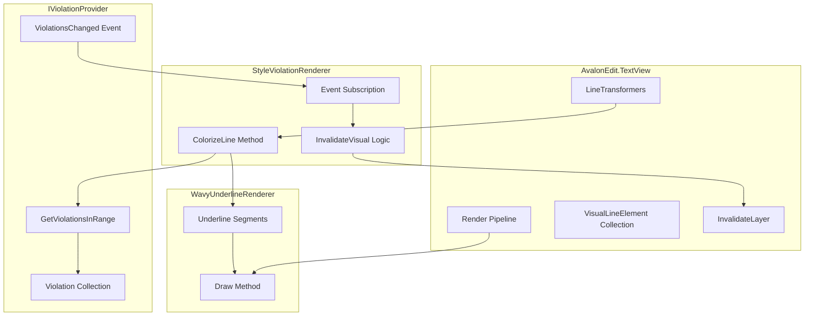
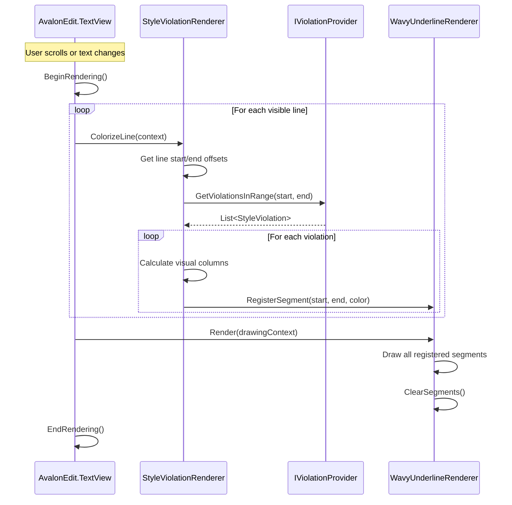
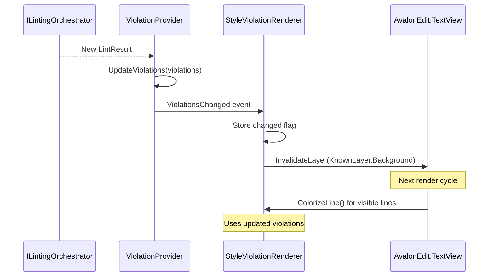

# LCS-INF-024a: Rendering Transformer (StyleViolationRenderer)

## 1. Metadata & Categorization

| Field                | Value                                                     | Description                                      |
| :------------------- | :-------------------------------------------------------- | :----------------------------------------------- |
| **Feature ID**       | `INF-024a`                                                | Sub-part A of Editor Integration                 |
| **Feature Name**     | Rendering Transformer                                     | DocumentColorizingTransformer for violations     |
| **Target Version**   | `v0.2.4a`                                                 | First sub-part of v0.2.4                         |
| **Module Scope**     | `Lexichord.Modules.Style`, `Lexichord.Modules.Editor`     | Cross-module integration                         |
| **Swimlane**         | `Product`                                                 | Core User-Facing Feature                         |
| **License Tier**     | `Core`                                                    | Foundation (Available in Free tier)              |
| **Author**           | System Architect                                          |                                                  |
| **Status**           | **Draft**                                                 | Pending implementation                           |
| **Last Updated**     | 2026-01-26                                                |                                                  |

---

## 2. Executive Summary

### 2.1 The Requirement

To visualize style violations in the AvalonEdit editor, we need a mechanism to:

- Hook into AvalonEdit's text rendering pipeline.
- Query violations that intersect with each visible line.
- Apply visual decorations (underlines) at violation coordinates.
- Respond to violation changes by invalidating affected visual regions.
- Support efficient rendering even with many violations per line.

AvalonEdit provides `DocumentColorizingTransformer` as the extension point for applying custom visual transformations during text rendering.

### 2.2 The Proposed Solution

We **SHALL** implement `StyleViolationRenderer` that:

1. **Inherits** from `DocumentColorizingTransformer` (AvalonEdit API).
2. **Queries** `IViolationProvider` for violations in each line's range.
3. **Registers** underline segments with the wavy line background renderer.
4. **Listens** to `ViolationsChanged` event to trigger visual invalidation.
5. **Integrates** with `ManuscriptView` by adding to `LineTransformers` collection.

---

## 3. Architecture

### 3.1 Component Structure



### 3.2 Rendering Pipeline Flow



### 3.3 Violation Change Handling



---

## 4. Decision Tree: Line Colorization

```text
START: "ColorizeLine(context) called"
│
├── Get line document offset range
│   ├── startOffset = context.DocumentLine.Offset
│   └── endOffset = context.DocumentLine.EndOffset
│
├── Query violations in range
│   └── violations = _provider.GetViolationsInRange(start, end)
│
├── For each violation:
│   │
│   ├── Calculate intersection with current line
│   │   ├── visStart = max(violation.StartOffset, lineStart)
│   │   └── visEnd = min(violation.EndOffset, lineEnd)
│   │
│   ├── Convert document offsets to visual columns
│   │   ├── startColumn = context.GetVisualColumn(visStart)
│   │   └── endColumn = context.GetVisualColumn(visEnd)
│   │
│   ├── Get color for severity
│   │   └── color = _colorProvider.GetUnderlineColor(violation.Severity)
│   │
│   ├── Register underline segment
│   │   └── _waveRenderer.RegisterSegment(startColumn, endColumn, color, lineY)
│   │
│   └── Continue to next violation
│
└── END
```

---

## 5. Data Contracts

### 5.1 StyleViolationRenderer Class

```csharp
using Avalonia;
using Avalonia.Media;
using AvaloniaEdit.Document;
using AvaloniaEdit.Rendering;
using Lexichord.Abstractions.Contracts;
using Microsoft.Extensions.Logging;

namespace Lexichord.Modules.Style.Rendering;

/// <summary>
/// Document colorizing transformer that applies visual decorations for style violations.
/// </summary>
/// <remarks>
/// LOGIC: StyleViolationRenderer integrates with AvalonEdit's rendering pipeline
/// via the DocumentColorizingTransformer base class. For each visible line:
///
/// 1. Query IViolationProvider for violations intersecting the line
/// 2. Calculate visual column positions for each violation
/// 3. Register underline segments with the background renderer
///
/// The renderer does not directly draw underlines; it delegates to
/// WavyUnderlineBackgroundRenderer which handles the actual drawing.
///
/// Thread Safety:
/// - ColorizeLine is called on the UI thread during rendering
/// - Violation queries are thread-safe (IViolationProvider contract)
/// - InvalidateVisual must be called from UI thread
///
/// Performance Considerations:
/// - Violations are indexed by offset in IViolationProvider for O(log n) lookup
/// - Visual column calculation uses AvalonEdit's built-in methods
/// - Invalidation is batched via DispatcherPriority.Render
/// </remarks>
public sealed class StyleViolationRenderer : DocumentColorizingTransformer, IDisposable
{
    private readonly IViolationProvider _violationProvider;
    private readonly IViolationColorProvider _colorProvider;
    private readonly ILogger<StyleViolationRenderer> _logger;

    private WavyUnderlineBackgroundRenderer? _waveRenderer;
    private TextView? _textView;
    private bool _isDisposed;

    /// <summary>
    /// Initializes a new instance of the StyleViolationRenderer.
    /// </summary>
    /// <param name="violationProvider">Provider for style violations.</param>
    /// <param name="colorProvider">Provider for severity colors.</param>
    /// <param name="logger">Logger instance.</param>
    public StyleViolationRenderer(
        IViolationProvider violationProvider,
        IViolationColorProvider colorProvider,
        ILogger<StyleViolationRenderer> logger)
    {
        _violationProvider = violationProvider ?? throw new ArgumentNullException(nameof(violationProvider));
        _colorProvider = colorProvider ?? throw new ArgumentNullException(nameof(colorProvider));
        _logger = logger ?? throw new ArgumentNullException(nameof(logger));

        // LOGIC: Subscribe to violation changes to trigger re-render
        _violationProvider.ViolationsChanged += OnViolationsChanged;
    }

    /// <summary>
    /// Attaches the renderer to a TextView.
    /// </summary>
    /// <param name="textView">The TextView to attach to.</param>
    /// <param name="waveRenderer">The background renderer for drawing underlines.</param>
    /// <remarks>
    /// LOGIC: Must be called after adding to LineTransformers collection.
    /// The waveRenderer is shared between this transformer and the draw layer.
    /// </remarks>
    public void AttachToTextView(TextView textView, WavyUnderlineBackgroundRenderer waveRenderer)
    {
        _textView = textView ?? throw new ArgumentNullException(nameof(textView));
        _waveRenderer = waveRenderer ?? throw new ArgumentNullException(nameof(waveRenderer));

        _logger.LogDebug("StyleViolationRenderer attached to TextView");
    }

    /// <summary>
    /// Detaches the renderer from its TextView.
    /// </summary>
    public void DetachFromTextView()
    {
        _textView = null;
        _waveRenderer = null;
        _logger.LogDebug("StyleViolationRenderer detached from TextView");
    }

    /// <summary>
    /// Called by AvalonEdit for each visible line during rendering.
    /// </summary>
    /// <param name="context">The colorization context for the current line.</param>
    /// <remarks>
    /// LOGIC: This is the core rendering entry point. For each line:
    /// 1. Determine the document offset range of the line
    /// 2. Query violations that intersect this range
    /// 3. For each violation, register an underline segment
    ///
    /// The actual drawing is deferred to WavyUnderlineBackgroundRenderer.
    /// </remarks>
    protected override void ColorizeLine(DocumentLine line)
    {
        if (_waveRenderer is null || _textView is null)
            return;

        var lineStartOffset = line.Offset;
        var lineEndOffset = line.EndOffset;

        // LOGIC: Query violations in this line's range
        var violations = _violationProvider.GetViolationsInRange(lineStartOffset, lineEndOffset);

        if (violations.Count == 0)
            return;

        _logger.LogDebug(
            "Colorizing line {LineNumber}: {ViolationCount} violations",
            line.LineNumber, violations.Count);

        foreach (var violation in violations)
        {
            try
            {
                RegisterViolationUnderline(line, violation);
            }
            catch (Exception ex)
            {
                _logger.LogWarning(
                    ex,
                    "Failed to register underline for violation {ViolationId}",
                    violation.Id);
            }
        }
    }

    /// <summary>
    /// Registers an underline segment for a single violation.
    /// </summary>
    /// <param name="line">The document line being rendered.</param>
    /// <param name="violation">The violation to render.</param>
    private void RegisterViolationUnderline(DocumentLine line, StyleViolation violation)
    {
        if (_waveRenderer is null || _textView is null)
            return;

        // LOGIC: Calculate the intersection of violation span with current line
        var visibleStart = Math.Max(violation.StartOffset, line.Offset);
        var visibleEnd = Math.Min(violation.EndOffset, line.EndOffset);

        if (visibleStart >= visibleEnd)
            return; // No visible portion on this line

        // LOGIC: Get visual line for coordinate calculation
        var visualLine = _textView.GetVisualLine(line.LineNumber);
        if (visualLine is null)
            return;

        // LOGIC: Convert document offsets to visual positions
        var startVisualColumn = visualLine.GetVisualColumn(visibleStart - line.Offset);
        var endVisualColumn = visualLine.GetVisualColumn(visibleEnd - line.Offset);

        // LOGIC: Get text bounds for the violation span
        var textBounds = GetTextBounds(visualLine, startVisualColumn, endVisualColumn);

        if (textBounds is null || textBounds.Value.Width <= 0)
            return;

        // LOGIC: Get color based on severity
        var color = _colorProvider.GetUnderlineColor(violation.Severity);

        // LOGIC: Register the underline segment
        _waveRenderer.RegisterSegment(new UnderlineSegment
        {
            ViolationId = violation.Id,
            Bounds = textBounds.Value,
            Color = color,
            Severity = violation.Severity
        });
    }

    /// <summary>
    /// Gets the bounding rectangle for text between two visual columns.
    /// </summary>
    /// <param name="visualLine">The visual line.</param>
    /// <param name="startColumn">Start visual column.</param>
    /// <param name="endColumn">End visual column.</param>
    /// <returns>Bounding rectangle, or null if calculation fails.</returns>
    private static Rect? GetTextBounds(VisualLine visualLine, int startColumn, int endColumn)
    {
        try
        {
            // LOGIC: Use AvalonEdit's built-in method to get text bounds
            var startPoint = visualLine.GetVisualPosition(startColumn, VisualYPosition.LineBottom);
            var endPoint = visualLine.GetVisualPosition(endColumn, VisualYPosition.LineBottom);

            var lineTop = visualLine.GetVisualPosition(startColumn, VisualYPosition.LineTop);

            return new Rect(
                startPoint.X,
                lineTop.Y,
                endPoint.X - startPoint.X,
                startPoint.Y - lineTop.Y
            );
        }
        catch
        {
            return null;
        }
    }

    /// <summary>
    /// Handles violation changes by invalidating the view.
    /// </summary>
    private void OnViolationsChanged(object? sender, ViolationsChangedEventArgs e)
    {
        _logger.LogDebug(
            "Violations changed: {ChangeType}, Total={Total}",
            e.ChangeType, e.TotalCount);

        // LOGIC: Invalidate the background layer to trigger re-render
        if (_textView is not null)
        {
            // Use Avalonia's dispatcher to ensure UI thread execution
            Avalonia.Threading.Dispatcher.UIThread.Post(() =>
            {
                _waveRenderer?.ClearSegments();
                _textView?.InvalidateLayer(KnownLayer.Background);
            }, Avalonia.Threading.DispatcherPriority.Render);
        }
    }

    /// <summary>
    /// Disposes of the renderer and unsubscribes from events.
    /// </summary>
    public void Dispose()
    {
        if (_isDisposed)
            return;

        _violationProvider.ViolationsChanged -= OnViolationsChanged;
        DetachFromTextView();

        _isDisposed = true;
        _logger.LogDebug("StyleViolationRenderer disposed");
    }
}
```

### 5.2 UnderlineSegment Record

```csharp
using Avalonia;
using Avalonia.Media;
using Lexichord.Abstractions.Contracts;

namespace Lexichord.Modules.Style.Rendering;

/// <summary>
/// Represents an underline segment to be drawn by the background renderer.
/// </summary>
/// <remarks>
/// LOGIC: UnderlineSegment is a lightweight data structure passed from
/// StyleViolationRenderer to WavyUnderlineBackgroundRenderer. It contains
/// all information needed to draw a single wavy underline:
///
/// - Bounds: Rectangle defining where to draw
/// - Color: Severity-based color
/// - ViolationId: For associating with tooltips/menus
/// </remarks>
public record UnderlineSegment
{
    /// <summary>
    /// Unique identifier of the associated violation.
    /// </summary>
    /// <remarks>
    /// LOGIC: Used to correlate underlines with tooltips and quick-fixes.
    /// </remarks>
    public required string ViolationId { get; init; }

    /// <summary>
    /// Bounding rectangle for the underline in visual coordinates.
    /// </summary>
    /// <remarks>
    /// LOGIC: The underline is drawn at the bottom of this rectangle.
    /// Width determines underline length; height is used for positioning.
    /// </remarks>
    public required Rect Bounds { get; init; }

    /// <summary>
    /// Color of the underline wave.
    /// </summary>
    public required Color Color { get; init; }

    /// <summary>
    /// Severity level (used for z-ordering - errors on top).
    /// </summary>
    public required ViolationSeverity Severity { get; init; }

    /// <summary>
    /// Gets the Y coordinate for the underline (bottom of bounds).
    /// </summary>
    public double UnderlineY => Bounds.Bottom - 2;

    /// <summary>
    /// Gets the start X coordinate.
    /// </summary>
    public double StartX => Bounds.Left;

    /// <summary>
    /// Gets the end X coordinate.
    /// </summary>
    public double EndX => Bounds.Right;
}
```

### 5.3 ViolationProvider Implementation

```csharp
using System.Collections.Immutable;
using Lexichord.Abstractions.Contracts;

namespace Lexichord.Modules.Style.Services;

/// <summary>
/// Default implementation of IViolationProvider.
/// </summary>
/// <remarks>
/// LOGIC: ViolationProvider maintains an indexed collection of violations
/// for efficient querying by document offset. It uses an immutable list
/// for thread-safe reads and notifies listeners on updates.
///
/// Indexing Strategy:
/// - Violations are stored sorted by StartOffset
/// - Range queries use binary search for O(log n) start point
/// - Linear scan within range (typically small number of violations per line)
///
/// Thread Safety:
/// - Read operations (GetViolations*) are lock-free via immutable snapshot
/// - Write operations (UpdateViolations, Clear) use lock and replace
/// - Event handlers are invoked synchronously after update
/// </remarks>
public sealed class ViolationProvider : IViolationProvider
{
    private ImmutableList<StyleViolation> _violations = ImmutableList<StyleViolation>.Empty;
    private readonly object _updateLock = new();

    /// <inheritdoc/>
    public IReadOnlyList<StyleViolation> AllViolations => _violations;

    /// <inheritdoc/>
    public event EventHandler<ViolationsChangedEventArgs>? ViolationsChanged;

    /// <inheritdoc/>
    public IReadOnlyList<StyleViolation> GetViolationsInRange(int startOffset, int endOffset)
    {
        // LOGIC: Get snapshot for thread-safe iteration
        var snapshot = _violations;

        if (snapshot.IsEmpty)
            return Array.Empty<StyleViolation>();

        // LOGIC: Find violations that intersect [startOffset, endOffset)
        // Intersection: violation.Start < endOffset AND violation.End > startOffset
        var results = new List<StyleViolation>();

        foreach (var violation in snapshot)
        {
            // Skip violations entirely before the range
            if (violation.EndOffset <= startOffset)
                continue;

            // Stop at violations entirely after the range
            if (violation.StartOffset >= endOffset)
                break;

            // This violation intersects the range
            results.Add(violation);
        }

        return results;
    }

    /// <inheritdoc/>
    public IReadOnlyList<StyleViolation> GetViolationsAtOffset(int offset)
    {
        // LOGIC: Find violations that contain the offset
        // Containment: violation.Start <= offset AND violation.End > offset
        var snapshot = _violations;

        return snapshot
            .Where(v => v.StartOffset <= offset && v.EndOffset > offset)
            .ToList();
    }

    /// <inheritdoc/>
    public int GetViolationCount(ViolationSeverity severity)
    {
        return _violations.Count(v => v.Severity == severity);
    }

    /// <inheritdoc/>
    public void UpdateViolations(IEnumerable<StyleViolation> violations)
    {
        lock (_updateLock)
        {
            // LOGIC: Sort by StartOffset for efficient range queries
            _violations = violations
                .OrderBy(v => v.StartOffset)
                .ToImmutableList();
        }

        RaiseViolationsChanged(ViolationChangeType.Replaced);
    }

    /// <inheritdoc/>
    public void Clear()
    {
        lock (_updateLock)
        {
            _violations = ImmutableList<StyleViolation>.Empty;
        }

        RaiseViolationsChanged(ViolationChangeType.Cleared);
    }

    /// <summary>
    /// Raises the ViolationsChanged event with current counts.
    /// </summary>
    private void RaiseViolationsChanged(ViolationChangeType changeType)
    {
        var snapshot = _violations;

        ViolationsChanged?.Invoke(this, new ViolationsChangedEventArgs
        {
            ChangeType = changeType,
            TotalCount = snapshot.Count,
            ErrorCount = snapshot.Count(v => v.Severity == ViolationSeverity.Error),
            WarningCount = snapshot.Count(v => v.Severity == ViolationSeverity.Warning),
            InfoCount = snapshot.Count(v => v.Severity == ViolationSeverity.Info)
        });
    }
}
```

### 5.4 ManuscriptView Integration

```csharp
// Extension to ManuscriptView.axaml.cs for v0.2.4a

public partial class ManuscriptView : UserControl
{
    private StyleViolationRenderer? _violationRenderer;
    private WavyUnderlineBackgroundRenderer? _waveRenderer;

    /// <summary>
    /// Initializes style violation rendering for this editor instance.
    /// </summary>
    /// <param name="violationProvider">Provider for violations.</param>
    /// <param name="colorProvider">Provider for severity colors.</param>
    /// <param name="logger">Logger for the renderer.</param>
    /// <remarks>
    /// LOGIC: Called by ManuscriptViewModel after linting is enabled.
    /// Sets up the rendering pipeline:
    /// 1. Create WavyUnderlineBackgroundRenderer (draws the squiggles)
    /// 2. Create StyleViolationRenderer (determines what to draw)
    /// 3. Add to TextView's rendering collections
    /// </remarks>
    public void InitializeViolationRendering(
        IViolationProvider violationProvider,
        IViolationColorProvider colorProvider,
        ILogger<StyleViolationRenderer> logger)
    {
        var textView = TextEditor.TextArea.TextView;

        // LOGIC: Create background renderer for wave drawing
        _waveRenderer = new WavyUnderlineBackgroundRenderer();
        textView.BackgroundRenderers.Add(_waveRenderer);

        // LOGIC: Create line transformer for violation detection
        _violationRenderer = new StyleViolationRenderer(
            violationProvider,
            colorProvider,
            logger);
        _violationRenderer.AttachToTextView(textView, _waveRenderer);
        textView.LineTransformers.Add(_violationRenderer);
    }

    /// <summary>
    /// Cleans up violation rendering resources.
    /// </summary>
    public void CleanupViolationRendering()
    {
        if (_violationRenderer is not null)
        {
            TextEditor.TextArea.TextView.LineTransformers.Remove(_violationRenderer);
            _violationRenderer.Dispose();
            _violationRenderer = null;
        }

        if (_waveRenderer is not null)
        {
            TextEditor.TextArea.TextView.BackgroundRenderers.Remove(_waveRenderer);
            _waveRenderer = null;
        }
    }

    protected override void OnUnloaded(RoutedEventArgs e)
    {
        base.OnUnloaded(e);
        CleanupViolationRendering();
    }
}
```

---

## 6. Implementation Logic

### 6.1 Module Registration Extension

```csharp
// In StyleModule.ConfigureServices for v0.2.4a

public void ConfigureServices(IServiceCollection services)
{
    // ... existing v0.2.3 registrations ...

    // v0.2.4a: Rendering components
    services.AddScoped<IViolationProvider, ViolationProvider>();
    services.AddTransient<StyleViolationRenderer>();
    services.AddTransient<WavyUnderlineBackgroundRenderer>();
}
```

### 6.2 ViewModel Integration

```csharp
// Extension to ManuscriptViewModel for v0.2.4a

public partial class ManuscriptViewModel
{
    private readonly IViolationProvider _violationProvider;
    private readonly ILintingOrchestrator _linterService;
    private ManuscriptView? _view;

    /// <summary>
    /// Gets the violation provider for this document.
    /// </summary>
    public IViolationProvider ViolationProvider => _violationProvider;

    /// <summary>
    /// Attaches the view and initializes violation rendering.
    /// </summary>
    /// <remarks>
    /// LOGIC: Called from View's DataContext binding or explicit wire-up.
    /// </remarks>
    public void AttachView(ManuscriptView view)
    {
        _view = view;

        // Initialize violation rendering with this document's provider
        var colorProvider = _serviceProvider.GetRequiredService<IViolationColorProvider>();
        var logger = _serviceProvider.GetRequiredService<ILogger<StyleViolationRenderer>>();

        _view.InitializeViolationRendering(_violationProvider, colorProvider, logger);
    }

    /// <summary>
    /// Called after lint completes to update violations.
    /// </summary>
    private void OnLintCompleted(LintResult result)
    {
        _violationProvider.UpdateViolations(result.Violations);

        OnPropertyChanged(nameof(Violations));
    }
}
```

---

## 7. Use Cases

### UC-01: Initial Rendering of Violations

**Preconditions:**
- Document is open with style violations from previous lint.
- StyleViolationRenderer is attached to TextView.

**Flow:**
1. TextView begins rendering visible lines.
2. For each visible line, ColorizeLine() is called.
3. Renderer queries ViolationProvider for violations in line range.
4. For each violation, renderer calculates visual bounds.
5. Renderer registers UnderlineSegment with WavyUnderlineBackgroundRenderer.
6. WavyUnderlineBackgroundRenderer draws all registered segments.
7. User sees wavy underlines under violations.

**Postconditions:**
- Violations are visually indicated.
- Underlines match violation positions.

---

### UC-02: Dynamic Violation Update

**Preconditions:**
- User is editing document.
- Lint runs after debounce delay.

**Flow:**
1. User types text, triggering content change.
2. After 500ms debounce, lint executes.
3. LinterService returns new LintResult.
4. ManuscriptViewModel calls ViolationProvider.UpdateViolations().
5. ViolationProvider raises ViolationsChanged event.
6. StyleViolationRenderer receives event.
7. Renderer clears old segments and invalidates TextView.
8. TextView re-renders with new violations.
9. User sees updated underlines.

**Postconditions:**
- Underlines reflect current violations.
- Old violations are removed.
- New violations are shown.

---

## 8. Observability & Logging

| Level | Context | Message Template |
|:------|:--------|:-----------------|
| Debug | StyleViolationRenderer | `StyleViolationRenderer attached to TextView` |
| Debug | StyleViolationRenderer | `StyleViolationRenderer detached from TextView` |
| Debug | StyleViolationRenderer | `Colorizing line {LineNumber}: {ViolationCount} violations` |
| Debug | StyleViolationRenderer | `Violations changed: {ChangeType}, Total={Total}` |
| Warning | StyleViolationRenderer | `Failed to register underline for violation {ViolationId}` |
| Debug | StyleViolationRenderer | `StyleViolationRenderer disposed` |
| Debug | ViolationProvider | `Updating violations: {Count} items` |
| Debug | ViolationProvider | `Query violations in range [{Start}, {End}]: {Count} found` |

---

## 9. Unit Testing Requirements

### 9.1 StyleViolationRenderer Tests

```csharp
[TestFixture]
[Category("Unit")]
public class StyleViolationRendererTests
{
    private Mock<IViolationProvider> _mockProvider = null!;
    private Mock<IViolationColorProvider> _mockColorProvider = null!;
    private Mock<ILogger<StyleViolationRenderer>> _mockLogger = null!;
    private StyleViolationRenderer _sut = null!;

    [SetUp]
    public void SetUp()
    {
        _mockProvider = new Mock<IViolationProvider>();
        _mockColorProvider = new Mock<IViolationColorProvider>();
        _mockLogger = new Mock<ILogger<StyleViolationRenderer>>();

        _mockColorProvider
            .Setup(c => c.GetUnderlineColor(It.IsAny<ViolationSeverity>()))
            .Returns(Colors.Red);

        _sut = new StyleViolationRenderer(
            _mockProvider.Object,
            _mockColorProvider.Object,
            _mockLogger.Object);
    }

    [TearDown]
    public void TearDown()
    {
        _sut.Dispose();
    }

    [Test]
    public void Constructor_SubscribesToViolationsChanged()
    {
        // Assert
        _mockProvider.VerifyAdd(
            p => p.ViolationsChanged += It.IsAny<EventHandler<ViolationsChangedEventArgs>>(),
            Times.Once);
    }

    [Test]
    public void Dispose_UnsubscribesFromEvents()
    {
        // Act
        _sut.Dispose();

        // Assert
        _mockProvider.VerifyRemove(
            p => p.ViolationsChanged -= It.IsAny<EventHandler<ViolationsChangedEventArgs>>(),
            Times.Once);
    }

    [Test]
    public void AttachToTextView_StoresReferences()
    {
        // Arrange
        var mockTextView = new Mock<TextView>();
        var mockWaveRenderer = new Mock<WavyUnderlineBackgroundRenderer>();

        // Act
        _sut.AttachToTextView(mockTextView.Object, mockWaveRenderer.Object);

        // Assert - no exception thrown
        Assert.Pass();
    }

    [Test]
    public void AttachToTextView_NullTextView_ThrowsArgumentNullException()
    {
        // Arrange
        var mockWaveRenderer = new Mock<WavyUnderlineBackgroundRenderer>();

        // Act & Assert
        Assert.Throws<ArgumentNullException>(() =>
            _sut.AttachToTextView(null!, mockWaveRenderer.Object));
    }

    [Test]
    public void ViolationsChanged_InvalidatesTextView()
    {
        // Arrange
        var mockTextView = new Mock<TextView>();
        var mockWaveRenderer = new Mock<WavyUnderlineBackgroundRenderer>();
        _sut.AttachToTextView(mockTextView.Object, mockWaveRenderer.Object);

        // Act
        _mockProvider.Raise(
            p => p.ViolationsChanged += null,
            new ViolationsChangedEventArgs
            {
                ChangeType = ViolationChangeType.Replaced,
                TotalCount = 1,
                ErrorCount = 1,
                WarningCount = 0,
                InfoCount = 0
            });

        // Need to pump dispatcher for async invalidation
        // Assert would verify InvalidateLayer was called
    }
}
```

### 9.2 ViolationProvider Integration Tests

```csharp
[TestFixture]
[Category("Unit")]
public class ViolationProviderIntegrationTests
{
    private ViolationProvider _provider = null!;
    private StyleViolationRenderer _renderer = null!;

    [SetUp]
    public void SetUp()
    {
        _provider = new ViolationProvider();
        // Setup renderer with provider...
    }

    [Test]
    public void FullPipeline_ViolationUpdate_TriggersRendering()
    {
        // Arrange
        var violations = new[]
        {
            CreateViolation(0, 10, ViolationSeverity.Error),
            CreateViolation(20, 10, ViolationSeverity.Warning)
        };

        var eventRaised = false;
        _provider.ViolationsChanged += (s, e) => eventRaised = true;

        // Act
        _provider.UpdateViolations(violations);

        // Assert
        Assert.That(eventRaised, Is.True);
        Assert.That(_provider.AllViolations, Has.Count.EqualTo(2));
    }

    private static StyleViolation CreateViolation(
        int startOffset, int length, ViolationSeverity severity)
    {
        return new StyleViolation
        {
            Id = Guid.NewGuid().ToString(),
            Rule = new StyleRule("TEST001", "Test", "Test", severity, "Test"),
            StartOffset = startOffset,
            Length = length,
            Severity = severity,
            Message = "Test violation",
            OriginalText = "test"
        };
    }
}
```

---

## 10. Security & Safety

### 10.1 Resource Management

> [!NOTE]
> StyleViolationRenderer implements IDisposable to clean up event subscriptions.

- **Event Subscription:** Unsubscribe from ViolationsChanged on dispose.
- **View References:** Clear references to TextView on detach.
- **Memory Leaks:** Proper cleanup prevents renderer from keeping ViewModel alive.

### 10.2 Thread Safety

- **Read Operations:** Use immutable snapshots for thread-safe queries.
- **Write Operations:** Lock during collection updates.
- **UI Updates:** Marshal to UI thread via Dispatcher.

---

## 11. Risks & Mitigations

| Risk | Impact | Mitigation |
|:-----|:-------|:-----------|
| Memory leak from event subscription | High | Implement IDisposable; verify in tests |
| Performance with many violations | Medium | Limit violations per line; virtualize |
| Invalid visual column calculation | Medium | Handle exceptions; log warnings |
| Race condition in violation update | Medium | Use immutable collections; proper locking |

---

## 12. Acceptance Criteria (QA)

| # | Category | Criterion |
|:--|:---------|:----------|
| 1 | **[Attach]** | Renderer attaches to TextView without errors |
| 2 | **[Attach]** | Renderer detaches cleanly |
| 3 | **[Query]** | Violations in range are found correctly |
| 4 | **[Query]** | Violations outside range are excluded |
| 5 | **[Register]** | Underline segments are registered for violations |
| 6 | **[Update]** | ViolationsChanged triggers re-render |
| 7 | **[Dispose]** | Dispose unsubscribes from events |
| 8 | **[Thread]** | No deadlocks on concurrent updates |

---

## 13. Verification Commands

```bash
# 1. Build the Style module
dotnet build src/Lexichord.Modules.Style

# 2. Run unit tests for renderer
dotnet test --filter "FullyQualifiedName~StyleViolationRenderer"

# 3. Run unit tests for provider
dotnet test --filter "FullyQualifiedName~ViolationProvider"

# 4. Manual testing:
# - Open document with violations
# - Verify underlines appear
# - Edit document
# - Verify underlines update
# - Close document
# - Verify no memory leaks (check task manager)
```

---

## 14. Deliverable Checklist

| Step | Description | Status |
|:-----|:------------|:-------|
| 1 | Define UnderlineSegment record | [ ] |
| 2 | Implement ViolationProvider | [ ] |
| 3 | Create StyleViolationRenderer class | [ ] |
| 4 | Implement ColorizeLine method | [ ] |
| 5 | Implement visual column calculation | [ ] |
| 6 | Implement ViolationsChanged handler | [ ] |
| 7 | Implement IDisposable pattern | [ ] |
| 8 | Extend ManuscriptView for integration | [ ] |
| 9 | Extend ManuscriptViewModel for integration | [ ] |
| 10 | Unit tests for StyleViolationRenderer | [ ] |
| 11 | Unit tests for ViolationProvider | [ ] |
| 12 | Integration tests for rendering pipeline | [ ] |
