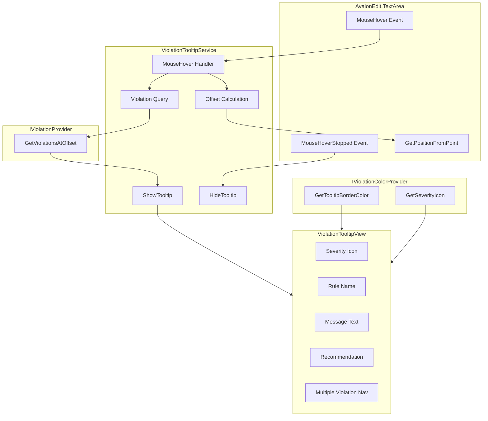
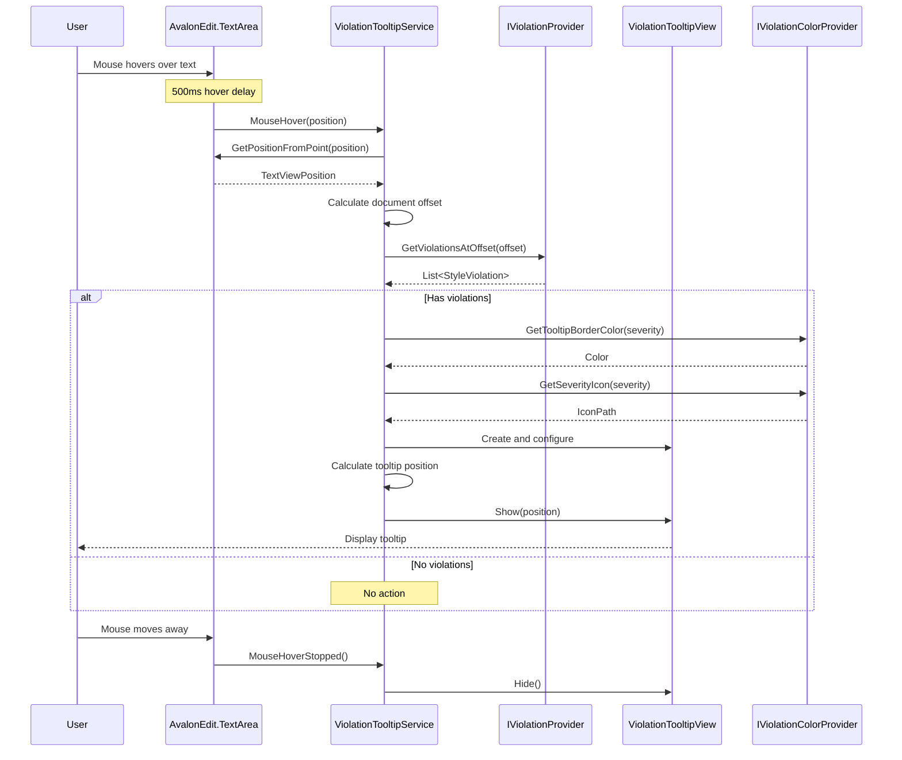

# LCS-INF-024c: Hover Tooltips (Violation Details on Hover)

## 1. Metadata & Categorization

| Field                | Value                                                     | Description                                      |
| :------------------- | :-------------------------------------------------------- | :----------------------------------------------- |
| **Feature ID**       | `INF-024c`                                                | Sub-part C of Editor Integration                 |
| **Feature Name**     | Hover Tooltips                                            | Display violation details on mouse hover         |
| **Target Version**   | `v0.2.4c`                                                 | Third sub-part of v0.2.4                         |
| **Module Scope**     | `Lexichord.Modules.Style`                                 | Style module UI                                  |
| **Swimlane**         | `Product`                                                 | Core User-Facing Feature                         |
| **License Tier**     | `Core`                                                    | Foundation (Available in Free tier)              |
| **Author**           | System Architect                                          |                                                  |
| **Status**           | **Draft**                                                 | Pending implementation                           |
| **Last Updated**     | 2026-01-26                                                |                                                  |

---

## 2. Executive Summary

### 2.1 The Requirement

When writers see a squiggly underline, they need to understand:

- **What's wrong?** — The specific style issue detected.
- **Why does it matter?** — Context about the rule.
- **How to fix it?** — A recommended correction.

The hover tooltip must:

- Appear when the mouse hovers over underlined text.
- Display the violation message and recommendation.
- Show the severity level (icon and color).
- Support multiple violations at the same position.
- Hide smoothly when the mouse moves away.
- Match the application's light/dark theme.

### 2.2 The Proposed Solution

We **SHALL** implement `ViolationTooltipService` that:

1. **Listens** to TextArea's MouseHover and MouseHoverStopped events.
2. **Calculates** the document offset from mouse position.
3. **Queries** `IViolationProvider` for violations at that offset.
4. **Displays** a styled tooltip with violation details.
5. **Supports** keyboard trigger (Ctrl+K, Ctrl+I) for accessibility.

---

## 3. Architecture

### 3.1 Component Structure



### 3.2 Tooltip Display Flow



### 3.3 Offset Calculation Logic

```mermaid
graph TB
    subgraph "Input"
        MOUSEPOS[Mouse Position (screen coords)]
    end

    subgraph "Step 1: Screen to Control"
        CONTROL[TextArea.TranslatePoint]
        LOCALPOS[Local Position]
    end

    subgraph "Step 2: Position to Document"
        GETPOS[TextView.GetPositionFromPoint]
        TVPOS[TextViewPosition?]
    end

    subgraph "Step 3: Position to Offset"
        DOCUMENT[TextDocument]
        GETOFFSET[GetOffset(line, column)]
        OFFSET[Document Offset]
    end

    MOUSEPOS --> CONTROL
    CONTROL --> LOCALPOS
    LOCALPOS --> GETPOS
    GETPOS --> TVPOS
    TVPOS --> |"If valid"| DOCUMENT
    DOCUMENT --> GETOFFSET
    GETOFFSET --> OFFSET
```

---

## 4. Decision Tree: Tooltip Display

```text
START: "MouseHover event received"
│
├── Get mouse position relative to TextView
│   └── localPoint = textView.TranslatePoint(args.Position, textView)
│
├── Convert position to TextViewPosition
│   ├── position = textView.GetPositionFromPoint(localPoint)
│   │
│   ├── Position is null?
│   │   ├── YES → Exit (not over text)
│   │   └── NO → Continue
│   │
│   └── Extract line and column
│
├── Calculate document offset
│   ├── documentLine = document.GetLineByNumber(position.Line)
│   └── offset = documentLine.Offset + position.Column - 1
│
├── Query violations at offset
│   └── violations = provider.GetViolationsAtOffset(offset)
│
├── Has violations?
│   ├── NO → Exit (nothing to show)
│   └── YES → Continue
│
├── Calculate tooltip position
│   ├── Get text bounds for first violation
│   ├── Position below text (if room) or above
│   └── Ensure tooltip stays within window bounds
│
├── Build tooltip content
│   ├── For single violation:
│   │   ├── Show severity icon
│   │   ├── Show rule name
│   │   ├── Show message
│   │   └── Show recommendation (if present)
│   │
│   └── For multiple violations:
│       ├── Show "1 of N" navigation
│       ├── Show prev/next arrows
│       └── Display current violation
│
├── Show tooltip
│   └── tooltip.Show(position)
│
└── END
```

---

## 5. Data Contracts

### 5.1 ViolationTooltipService Implementation

```csharp
using Avalonia;
using Avalonia.Controls;
using Avalonia.Controls.Primitives;
using Avalonia.Input;
using Avalonia.Threading;
using AvaloniaEdit;
using AvaloniaEdit.Editing;
using AvaloniaEdit.Rendering;
using Lexichord.Abstractions.Contracts;
using Microsoft.Extensions.Logging;

namespace Lexichord.Modules.Style.Services;

/// <summary>
/// Service for displaying violation tooltips on hover.
/// </summary>
/// <remarks>
/// LOGIC: ViolationTooltipService manages the tooltip lifecycle:
///
/// 1. Hook TextArea's MouseHover event
/// 2. Calculate document offset from mouse position
/// 3. Query violations at that offset
/// 4. Display tooltip if violations exist
/// 5. Hide tooltip on MouseHoverStopped or mouse move
///
/// Positioning Strategy:
/// - Primary: Below the text (like VS Code)
/// - Fallback: Above the text if near bottom of window
/// - Horizontal: Aligned with violation start
///
/// Thread Safety:
/// - All operations run on the UI thread
/// - Debounced hover to prevent flickering
/// </remarks>
public sealed class ViolationTooltipService : IViolationTooltipService, IDisposable
{
    private readonly IViolationProvider _violationProvider;
    private readonly IViolationColorProvider _colorProvider;
    private readonly ILogger<ViolationTooltipService> _logger;

    private TextArea? _textArea;
    private TextView? _textView;
    private Popup? _tooltipPopup;
    private ViolationTooltipView? _tooltipView;
    private IReadOnlyList<StyleViolation>? _currentViolations;
    private int _currentViolationIndex;
    private bool _isDisposed;

    private const int DefaultHoverDelayMs = 500;

    /// <summary>
    /// Initializes a new instance of ViolationTooltipService.
    /// </summary>
    public ViolationTooltipService(
        IViolationProvider violationProvider,
        IViolationColorProvider colorProvider,
        ILogger<ViolationTooltipService> logger)
    {
        _violationProvider = violationProvider ?? throw new ArgumentNullException(nameof(violationProvider));
        _colorProvider = colorProvider ?? throw new ArgumentNullException(nameof(colorProvider));
        _logger = logger ?? throw new ArgumentNullException(nameof(logger));
    }

    /// <inheritdoc/>
    public bool IsTooltipVisible => _tooltipPopup?.IsOpen ?? false;

    /// <inheritdoc/>
    public int HoverDelayMs { get; set; } = DefaultHoverDelayMs;

    /// <summary>
    /// Attaches the tooltip service to a TextArea.
    /// </summary>
    /// <param name="textArea">The TextArea to attach to.</param>
    public void AttachToTextArea(TextArea textArea)
    {
        DetachFromTextArea();

        _textArea = textArea ?? throw new ArgumentNullException(nameof(textArea));
        _textView = textArea.TextView;

        // LOGIC: Subscribe to hover events
        _textArea.PointerHover += OnPointerHover;
        _textArea.PointerHoverStopped += OnPointerHoverStopped;
        _textArea.PointerMoved += OnPointerMoved;

        // LOGIC: Create tooltip popup
        _tooltipView = new ViolationTooltipView();
        _tooltipView.NavigateRequested += OnNavigateRequested;

        _tooltipPopup = new Popup
        {
            Child = _tooltipView,
            PlacementMode = PlacementMode.Pointer,
            IsLightDismissEnabled = false,
            Topmost = true
        };

        _logger.LogDebug("ViolationTooltipService attached to TextArea");
    }

    /// <summary>
    /// Detaches the tooltip service from its TextArea.
    /// </summary>
    public void DetachFromTextArea()
    {
        if (_textArea is not null)
        {
            _textArea.PointerHover -= OnPointerHover;
            _textArea.PointerHoverStopped -= OnPointerHoverStopped;
            _textArea.PointerMoved -= OnPointerMoved;
            _textArea = null;
        }

        if (_tooltipView is not null)
        {
            _tooltipView.NavigateRequested -= OnNavigateRequested;
            _tooltipView = null;
        }

        HideTooltip();
        _tooltipPopup = null;
        _textView = null;
    }

    /// <inheritdoc/>
    public void ShowTooltip(Control textArea, Point position, StyleViolation violation)
    {
        ShowTooltip(textArea, position, new[] { violation });
    }

    /// <inheritdoc/>
    public void ShowTooltip(Control textArea, Point position, IReadOnlyList<StyleViolation> violations)
    {
        if (violations.Count == 0)
            return;

        _currentViolations = violations;
        _currentViolationIndex = 0;

        UpdateTooltipContent();
        PositionAndShowTooltip(textArea, position);

        _logger.LogDebug(
            "Showing tooltip at ({X}, {Y}) with {Count} violation(s)",
            position.X, position.Y, violations.Count);
    }

    /// <inheritdoc/>
    public void HideTooltip()
    {
        if (_tooltipPopup?.IsOpen == true)
        {
            _tooltipPopup.IsOpen = false;
            _logger.LogDebug("Tooltip hidden");
        }

        _currentViolations = null;
        _currentViolationIndex = 0;
    }

    /// <summary>
    /// Handles pointer hover event.
    /// </summary>
    private void OnPointerHover(object? sender, PointerEventArgs e)
    {
        if (_textView is null || _textArea is null)
            return;

        var position = e.GetPosition(_textView);
        var offset = GetOffsetFromPoint(position);

        if (offset is null)
        {
            HideTooltip();
            return;
        }

        var violations = _violationProvider.GetViolationsAtOffset(offset.Value);

        if (violations.Count == 0)
        {
            HideTooltip();
            return;
        }

        // LOGIC: Calculate tooltip position (below the text)
        var tooltipPosition = CalculateTooltipPosition(violations[0], position);
        ShowTooltip(_textArea, tooltipPosition, violations);
    }

    /// <summary>
    /// Handles pointer hover stopped event.
    /// </summary>
    private void OnPointerHoverStopped(object? sender, PointerEventArgs e)
    {
        // LOGIC: Don't hide immediately if mouse is over the tooltip
        if (_tooltipPopup?.IsPointerOver == true)
            return;

        HideTooltip();
    }

    /// <summary>
    /// Handles pointer moved event (for hiding tooltip when moving away).
    /// </summary>
    private void OnPointerMoved(object? sender, PointerEventArgs e)
    {
        if (!IsTooltipVisible)
            return;

        // LOGIC: Check if still over a violation
        var position = e.GetPosition(_textView!);
        var offset = GetOffsetFromPoint(position);

        if (offset is null)
        {
            HideTooltip();
            return;
        }

        var violations = _violationProvider.GetViolationsAtOffset(offset.Value);

        if (violations.Count == 0)
        {
            HideTooltip();
        }
    }

    /// <summary>
    /// Handles navigation between multiple violations.
    /// </summary>
    private void OnNavigateRequested(object? sender, NavigateViolationEventArgs e)
    {
        if (_currentViolations is null || _currentViolations.Count <= 1)
            return;

        _currentViolationIndex = e.Direction switch
        {
            NavigateDirection.Previous =>
                (_currentViolationIndex - 1 + _currentViolations.Count) % _currentViolations.Count,
            NavigateDirection.Next =>
                (_currentViolationIndex + 1) % _currentViolations.Count,
            _ => _currentViolationIndex
        };

        UpdateTooltipContent();
    }

    /// <summary>
    /// Gets document offset from a point in the TextView.
    /// </summary>
    /// <param name="point">Point relative to TextView.</param>
    /// <returns>Document offset, or null if not over text.</returns>
    private int? GetOffsetFromPoint(Point point)
    {
        if (_textView is null)
            return null;

        // LOGIC: Use AvalonEdit's built-in method
        var position = _textView.GetPositionFloor(point);

        if (position is null)
            return null;

        var textPosition = position.Value;

        // LOGIC: Get the document line
        var document = _textView.Document;
        if (document is null || textPosition.Line < 1 || textPosition.Line > document.LineCount)
            return null;

        var line = document.GetLineByNumber(textPosition.Line);

        // LOGIC: Calculate offset within line
        var columnOffset = Math.Min(textPosition.Column - 1, line.Length);
        var offset = line.Offset + columnOffset;

        return offset;
    }

    /// <summary>
    /// Calculates the position for the tooltip.
    /// </summary>
    /// <param name="violation">The primary violation.</param>
    /// <param name="hoverPosition">The hover position.</param>
    /// <returns>Tooltip position in screen coordinates.</returns>
    private Point CalculateTooltipPosition(StyleViolation violation, Point hoverPosition)
    {
        if (_textView is null)
            return hoverPosition;

        // LOGIC: Get the visual position of the violation start
        var document = _textView.Document;
        if (document is null)
            return hoverPosition;

        var location = document.GetLocation(violation.StartOffset);
        var visualLine = _textView.GetVisualLine(location.Line);

        if (visualLine is null)
            return hoverPosition;

        // LOGIC: Position below the baseline
        var y = visualLine.GetVisualPosition(0, VisualYPosition.LineBottom).Y + 4;

        // LOGIC: Align with violation start
        var x = visualLine.GetVisualPosition(
            location.Column - 1,
            VisualYPosition.LineBottom).X;

        // LOGIC: Convert to screen coordinates
        var screenPoint = _textView.PointToScreen(new Point(x, y));

        return screenPoint;
    }

    /// <summary>
    /// Updates the tooltip content for the current violation.
    /// </summary>
    private void UpdateTooltipContent()
    {
        if (_tooltipView is null || _currentViolations is null || _currentViolations.Count == 0)
            return;

        var violation = _currentViolations[_currentViolationIndex];

        _tooltipView.SetViolation(
            violation,
            _colorProvider.GetTooltipBorderColor(violation.Severity),
            _colorProvider.GetSeverityIcon(violation.Severity),
            _currentViolationIndex + 1,
            _currentViolations.Count);
    }

    /// <summary>
    /// Positions and shows the tooltip popup.
    /// </summary>
    private void PositionAndShowTooltip(Control placementTarget, Point position)
    {
        if (_tooltipPopup is null)
            return;

        _tooltipPopup.PlacementTarget = placementTarget;
        _tooltipPopup.HorizontalOffset = position.X;
        _tooltipPopup.VerticalOffset = position.Y;
        _tooltipPopup.IsOpen = true;
    }

    /// <summary>
    /// Disposes of the tooltip service.
    /// </summary>
    public void Dispose()
    {
        if (_isDisposed)
            return;

        DetachFromTextArea();
        _isDisposed = true;

        _logger.LogDebug("ViolationTooltipService disposed");
    }
}

/// <summary>
/// Direction for navigating between violations.
/// </summary>
public enum NavigateDirection
{
    Previous,
    Next
}

/// <summary>
/// Event arguments for violation navigation.
/// </summary>
public class NavigateViolationEventArgs : EventArgs
{
    public required NavigateDirection Direction { get; init; }
}
```

### 5.2 ViolationTooltipView.axaml

```xml
<UserControl xmlns="https://github.com/avaloniaui"
             xmlns:x="http://schemas.microsoft.com/winfx/2006/xaml"
             x:Class="Lexichord.Modules.Style.Views.ViolationTooltipView"
             MaxWidth="450"
             MinWidth="250">

    <UserControl.Styles>
        <!-- LOGIC: Card-like appearance with severity-colored border -->
        <Style Selector="Border.tooltip-container">
            <Setter Property="Background" Value="{DynamicResource SystemControlBackgroundChromeMediumBrush}" />
            <Setter Property="BorderThickness" Value="1,1,1,4" />
            <Setter Property="CornerRadius" Value="4" />
            <Setter Property="Padding" Value="12" />
            <Setter Property="Effect">
                <DropShadowEffect BlurRadius="8" Opacity="0.3" OffsetY="2" />
            </Setter>
        </Style>

        <Style Selector="TextBlock.rule-name">
            <Setter Property="FontWeight" Value="SemiBold" />
            <Setter Property="FontSize" Value="13" />
            <Setter Property="Margin" Value="0,0,0,4" />
        </Style>

        <Style Selector="TextBlock.message">
            <Setter Property="TextWrapping" Value="Wrap" />
            <Setter Property="FontSize" Value="12" />
            <Setter Property="Foreground" Value="{DynamicResource SystemControlForegroundBaseHighBrush}" />
        </Style>

        <Style Selector="Border.recommendation">
            <Setter Property="Background" Value="{DynamicResource SystemControlBackgroundChromeLowBrush}" />
            <Setter Property="CornerRadius" Value="3" />
            <Setter Property="Padding" Value="8,6" />
            <Setter Property="Margin" Value="0,8,0,0" />
        </Style>

        <Style Selector="TextBlock.recommendation-label">
            <Setter Property="FontSize" Value="11" />
            <Setter Property="Foreground" Value="{DynamicResource SystemControlForegroundBaseMediumBrush}" />
            <Setter Property="Margin" Value="0,0,0,2" />
        </Style>

        <Style Selector="TextBlock.recommendation-text">
            <Setter Property="FontFamily" Value="{DynamicResource MonospaceFontFamily}" />
            <Setter Property="FontSize" Value="12" />
            <Setter Property="TextWrapping" Value="Wrap" />
        </Style>

        <Style Selector="StackPanel.nav-panel">
            <Setter Property="Orientation" Value="Horizontal" />
            <Setter Property="HorizontalAlignment" Value="Right" />
            <Setter Property="Margin" Value="0,8,0,0" />
        </Style>

        <Style Selector="Button.nav-button">
            <Setter Property="Padding" Value="4" />
            <Setter Property="MinWidth" Value="24" />
            <Setter Property="MinHeight" Value="24" />
            <Setter Property="Background" Value="Transparent" />
        </Style>
    </UserControl.Styles>

    <!-- LOGIC: Main tooltip container with severity-colored left border -->
    <Border x:Name="TooltipContainer"
            Classes="tooltip-container"
            BorderBrush="{Binding BorderColor}">

        <StackPanel Spacing="4">

            <!-- Header: Icon + Rule Name -->
            <StackPanel Orientation="Horizontal" Spacing="8">
                <!-- Severity Icon -->
                <PathIcon x:Name="SeverityIcon"
                          Width="16" Height="16"
                          Foreground="{Binding BorderColor}"
                          Data="{Binding IconPath}" />

                <!-- Rule Name -->
                <TextBlock x:Name="RuleNameText"
                           Classes="rule-name"
                           Text="{Binding RuleName}" />
            </StackPanel>

            <!-- Message -->
            <TextBlock x:Name="MessageText"
                       Classes="message"
                       Text="{Binding Message}" />

            <!-- Recommendation (if present) -->
            <Border x:Name="RecommendationContainer"
                    Classes="recommendation"
                    IsVisible="{Binding HasRecommendation}">
                <StackPanel>
                    <TextBlock Classes="recommendation-label"
                               Text="Suggestion:" />
                    <TextBlock x:Name="RecommendationText"
                               Classes="recommendation-text"
                               Text="{Binding Recommendation}" />
                </StackPanel>
            </Border>

            <!-- Explanation (if present) -->
            <TextBlock x:Name="ExplanationText"
                       Classes="message"
                       Foreground="{DynamicResource SystemControlForegroundBaseMediumBrush}"
                       FontStyle="Italic"
                       Text="{Binding Explanation}"
                       IsVisible="{Binding HasExplanation}"
                       Margin="0,4,0,0" />

            <!-- Navigation (for multiple violations) -->
            <StackPanel x:Name="NavigationPanel"
                        Classes="nav-panel"
                        IsVisible="{Binding HasMultiple}">

                <TextBlock VerticalAlignment="Center"
                           Margin="0,0,8,0"
                           FontSize="11"
                           Foreground="{DynamicResource SystemControlForegroundBaseMediumBrush}">
                    <Run Text="{Binding CurrentIndex}" />
                    <Run Text=" of " />
                    <Run Text="{Binding TotalCount}" />
                </TextBlock>

                <Button Classes="nav-button"
                        Command="{Binding NavigatePreviousCommand}"
                        ToolTip.Tip="Previous issue">
                    <PathIcon Data="M15.41,7.41L14,6L8,12L14,18L15.41,16.59L10.83,12L15.41,7.41Z"
                              Width="12" Height="12" />
                </Button>

                <Button Classes="nav-button"
                        Command="{Binding NavigateNextCommand}"
                        ToolTip.Tip="Next issue">
                    <PathIcon Data="M8.59,16.59L13.17,12L8.59,7.41L10,6L16,12L10,18L8.59,16.59Z"
                              Width="12" Height="12" />
                </Button>
            </StackPanel>

        </StackPanel>
    </Border>
</UserControl>
```

### 5.3 ViolationTooltipView.axaml.cs

```csharp
using Avalonia.Controls;
using Avalonia.Media;
using CommunityToolkit.Mvvm.ComponentModel;
using CommunityToolkit.Mvvm.Input;
using Lexichord.Abstractions.Contracts;

namespace Lexichord.Modules.Style.Views;

/// <summary>
/// View for displaying violation details in a tooltip.
/// </summary>
public partial class ViolationTooltipView : UserControl
{
    private readonly ViolationTooltipViewModel _viewModel;

    /// <summary>
    /// Event raised when navigation is requested.
    /// </summary>
    public event EventHandler<NavigateViolationEventArgs>? NavigateRequested;

    public ViolationTooltipView()
    {
        InitializeComponent();

        _viewModel = new ViolationTooltipViewModel();
        _viewModel.NavigateRequested += (s, e) => NavigateRequested?.Invoke(this, e);
        DataContext = _viewModel;
    }

    /// <summary>
    /// Sets the violation to display.
    /// </summary>
    /// <param name="violation">The violation details.</param>
    /// <param name="borderColor">Color for the severity indicator.</param>
    /// <param name="iconPath">SVG path for severity icon.</param>
    /// <param name="currentIndex">Current index (1-based) for multi-violation nav.</param>
    /// <param name="totalCount">Total violations for multi-violation nav.</param>
    public void SetViolation(
        StyleViolation violation,
        Color borderColor,
        string iconPath,
        int currentIndex,
        int totalCount)
    {
        _viewModel.Update(violation, borderColor, iconPath, currentIndex, totalCount);
    }
}

/// <summary>
/// ViewModel for ViolationTooltipView.
/// </summary>
public partial class ViolationTooltipViewModel : ObservableObject
{
    [ObservableProperty]
    private string _ruleName = string.Empty;

    [ObservableProperty]
    private string _message = string.Empty;

    [ObservableProperty]
    private string? _recommendation;

    [ObservableProperty]
    private string? _explanation;

    [ObservableProperty]
    private IBrush _borderColor = Brushes.Gray;

    [ObservableProperty]
    private Geometry? _iconPath;

    [ObservableProperty]
    private int _currentIndex;

    [ObservableProperty]
    private int _totalCount;

    public bool HasRecommendation => !string.IsNullOrEmpty(Recommendation);
    public bool HasExplanation => !string.IsNullOrEmpty(Explanation);
    public bool HasMultiple => TotalCount > 1;

    /// <summary>
    /// Event raised when navigation is requested.
    /// </summary>
    public event EventHandler<NavigateViolationEventArgs>? NavigateRequested;

    /// <summary>
    /// Updates the view model with violation data.
    /// </summary>
    public void Update(
        StyleViolation violation,
        Color borderColor,
        string iconPath,
        int currentIndex,
        int totalCount)
    {
        RuleName = violation.Rule.Name;
        Message = violation.Message;
        Recommendation = violation.Recommendation;
        Explanation = violation.Explanation;
        BorderColor = new SolidColorBrush(borderColor);
        IconPath = Geometry.Parse(iconPath);
        CurrentIndex = currentIndex;
        TotalCount = totalCount;

        OnPropertyChanged(nameof(HasRecommendation));
        OnPropertyChanged(nameof(HasExplanation));
        OnPropertyChanged(nameof(HasMultiple));
    }

    [RelayCommand]
    private void NavigatePrevious()
    {
        NavigateRequested?.Invoke(this, new NavigateViolationEventArgs
        {
            Direction = NavigateDirection.Previous
        });
    }

    [RelayCommand]
    private void NavigateNext()
    {
        NavigateRequested?.Invoke(this, new NavigateViolationEventArgs
        {
            Direction = NavigateDirection.Next
        });
    }
}
```

---

## 6. Implementation Logic

### 6.1 Keyboard Shortcut Support

```csharp
/// <summary>
/// Extensions for keyboard-triggered tooltip display.
/// </summary>
public partial class ViolationTooltipService
{
    /// <summary>
    /// Shows tooltip at the current caret position.
    /// </summary>
    /// <remarks>
    /// LOGIC: Called when user presses Ctrl+K, Ctrl+I (VS Code convention)
    /// or F1 (traditional help key). Shows tooltip for violation at caret.
    /// </remarks>
    public void ShowTooltipAtCaret()
    {
        if (_textArea is null || _textView is null)
            return;

        var caret = _textArea.Caret;
        var offset = caret.Offset;

        var violations = _violationProvider.GetViolationsAtOffset(offset);

        if (violations.Count == 0)
        {
            _logger.LogDebug("No violations at caret position {Offset}", offset);
            return;
        }

        // LOGIC: Get visual position of caret
        var visualLine = _textView.GetVisualLine(caret.Line);
        if (visualLine is null)
            return;

        var position = visualLine.GetVisualPosition(
            caret.Column - 1,
            VisualYPosition.LineBottom);

        var tooltipPosition = _textView.PointToScreen(
            new Point(position.X, position.Y + 4));

        ShowTooltip(_textArea, tooltipPosition, violations);
    }

    /// <summary>
    /// Registers keyboard shortcuts for tooltip display.
    /// </summary>
    /// <param name="textArea">TextArea to register shortcuts on.</param>
    public void RegisterKeyboardShortcuts(TextArea textArea)
    {
        // LOGIC: Ctrl+K, Ctrl+I to show tooltip (VS Code convention)
        textArea.KeyDown += (s, e) =>
        {
            if (e.Key == Key.I &&
                e.KeyModifiers.HasFlag(KeyModifiers.Control) &&
                _isWaitingForI)
            {
                _isWaitingForI = false;
                ShowTooltipAtCaret();
                e.Handled = true;
            }
            else if (e.Key == Key.K && e.KeyModifiers.HasFlag(KeyModifiers.Control))
            {
                _isWaitingForI = true;
                // Set timeout to reset flag
                DispatcherTimer.RunOnce(() => _isWaitingForI = false, TimeSpan.FromSeconds(2));
            }
            else
            {
                _isWaitingForI = false;
            }
        };
    }

    private bool _isWaitingForI;
}
```

### 6.2 Wire-up in ManuscriptView

```csharp
// Extension to ManuscriptView for v0.2.4c

public partial class ManuscriptView
{
    private ViolationTooltipService? _tooltipService;

    /// <summary>
    /// Initializes the tooltip service for this editor.
    /// </summary>
    public void InitializeTooltipService(
        IViolationProvider violationProvider,
        IViolationColorProvider colorProvider,
        ILogger<ViolationTooltipService> logger)
    {
        _tooltipService = new ViolationTooltipService(
            violationProvider,
            colorProvider,
            logger);

        _tooltipService.AttachToTextArea(TextEditor.TextArea);
        _tooltipService.RegisterKeyboardShortcuts(TextEditor.TextArea);
    }

    /// <summary>
    /// Cleans up the tooltip service.
    /// </summary>
    public void CleanupTooltipService()
    {
        _tooltipService?.Dispose();
        _tooltipService = null;
    }
}
```

---

## 7. Use Cases

### UC-01: View Violation Details on Hover

**Preconditions:**
- Document has style violations rendered as underlines.
- Mouse is positioned over editor.

**Flow:**
1. User moves mouse over underlined text.
2. After 500ms hover delay, MouseHover event fires.
3. ViolationTooltipService calculates document offset.
4. Service queries IViolationProvider for violations.
5. Tooltip appears showing:
   - Red error icon
   - Rule name: "Passive Voice"
   - Message: "Passive voice detected..."
   - Recommendation: "Consider: 'The author wrote...'"
6. User reads the information.
7. User moves mouse away.
8. Tooltip fades out.

**Postconditions:**
- User understands the issue.
- User knows the suggested fix.

---

### UC-02: Navigate Multiple Violations

**Preconditions:**
- Two violations overlap at the same position.
- User hovers over the overlapping region.

**Flow:**
1. Tooltip shows "1 of 2" indicator.
2. User clicks the next arrow.
3. Tooltip updates to show second violation.
4. Indicator shows "2 of 2".
5. User clicks next again.
6. Tooltip wraps to "1 of 2".

**Postconditions:**
- User can review all violations at position.

---

### UC-03: Keyboard-Triggered Tooltip

**Preconditions:**
- Caret is positioned on a violation.
- User prefers keyboard navigation.

**Flow:**
1. User presses Ctrl+K.
2. User presses Ctrl+I within 2 seconds.
3. Tooltip appears at caret position.
4. User reads violation details.
5. User presses Escape.
6. Tooltip closes.

**Postconditions:**
- Accessible without mouse.

---

## 8. Observability & Logging

| Level | Context | Message Template |
|:------|:--------|:-----------------|
| Debug | ViolationTooltipService | `ViolationTooltipService attached to TextArea` |
| Debug | ViolationTooltipService | `Showing tooltip at ({X}, {Y}) with {Count} violation(s)` |
| Debug | ViolationTooltipService | `Tooltip hidden` |
| Debug | ViolationTooltipService | `No violations at caret position {Offset}` |
| Debug | ViolationTooltipService | `ViolationTooltipService disposed` |

---

## 9. Unit Testing Requirements

### 9.1 ViolationTooltipService Tests

```csharp
[TestFixture]
[Category("Unit")]
public class ViolationTooltipServiceTests
{
    private Mock<IViolationProvider> _mockProvider = null!;
    private Mock<IViolationColorProvider> _mockColorProvider = null!;
    private Mock<ILogger<ViolationTooltipService>> _mockLogger = null!;
    private ViolationTooltipService _sut = null!;

    [SetUp]
    public void SetUp()
    {
        _mockProvider = new Mock<IViolationProvider>();
        _mockColorProvider = new Mock<IViolationColorProvider>();
        _mockLogger = new Mock<ILogger<ViolationTooltipService>>();

        _mockColorProvider
            .Setup(c => c.GetTooltipBorderColor(It.IsAny<ViolationSeverity>()))
            .Returns(Colors.Red);
        _mockColorProvider
            .Setup(c => c.GetSeverityIcon(It.IsAny<ViolationSeverity>()))
            .Returns("M0,0");

        _sut = new ViolationTooltipService(
            _mockProvider.Object,
            _mockColorProvider.Object,
            _mockLogger.Object);
    }

    [TearDown]
    public void TearDown()
    {
        _sut.Dispose();
    }

    [Test]
    public void IsTooltipVisible_InitiallyFalse()
    {
        Assert.That(_sut.IsTooltipVisible, Is.False);
    }

    [Test]
    public void HoverDelayMs_DefaultValue()
    {
        Assert.That(_sut.HoverDelayMs, Is.EqualTo(500));
    }

    [Test]
    public void HoverDelayMs_CanBeChanged()
    {
        _sut.HoverDelayMs = 250;
        Assert.That(_sut.HoverDelayMs, Is.EqualTo(250));
    }

    [Test]
    public void HideTooltip_WhenNotVisible_DoesNotThrow()
    {
        Assert.DoesNotThrow(() => _sut.HideTooltip());
    }
}
```

### 9.2 ViolationTooltipViewModel Tests

```csharp
[TestFixture]
[Category("Unit")]
public class ViolationTooltipViewModelTests
{
    private ViolationTooltipViewModel _sut = null!;

    [SetUp]
    public void SetUp()
    {
        _sut = new ViolationTooltipViewModel();
    }

    [Test]
    public void HasRecommendation_WhenRecommendationSet_ReturnsTrue()
    {
        _sut.Recommendation = "Fix this";
        Assert.That(_sut.HasRecommendation, Is.True);
    }

    [Test]
    public void HasRecommendation_WhenRecommendationNull_ReturnsFalse()
    {
        _sut.Recommendation = null;
        Assert.That(_sut.HasRecommendation, Is.False);
    }

    [Test]
    public void HasMultiple_WhenTotalCountGreaterThanOne_ReturnsTrue()
    {
        _sut.TotalCount = 3;
        Assert.That(_sut.HasMultiple, Is.True);
    }

    [Test]
    public void HasMultiple_WhenTotalCountOne_ReturnsFalse()
    {
        _sut.TotalCount = 1;
        Assert.That(_sut.HasMultiple, Is.False);
    }

    [Test]
    public void NavigatePreviousCommand_RaisesNavigateRequested()
    {
        var eventRaised = false;
        NavigateDirection? direction = null;

        _sut.NavigateRequested += (s, e) =>
        {
            eventRaised = true;
            direction = e.Direction;
        };

        _sut.NavigatePreviousCommand.Execute(null);

        Assert.Multiple(() =>
        {
            Assert.That(eventRaised, Is.True);
            Assert.That(direction, Is.EqualTo(NavigateDirection.Previous));
        });
    }

    [Test]
    public void NavigateNextCommand_RaisesNavigateRequested()
    {
        var eventRaised = false;
        NavigateDirection? direction = null;

        _sut.NavigateRequested += (s, e) =>
        {
            eventRaised = true;
            direction = e.Direction;
        };

        _sut.NavigateNextCommand.Execute(null);

        Assert.Multiple(() =>
        {
            Assert.That(eventRaised, Is.True);
            Assert.That(direction, Is.EqualTo(NavigateDirection.Next));
        });
    }
}
```

---

## 10. Security & Safety

### 10.1 Content Safety

> [!NOTE]
> Tooltips only display violation data from the linter. No user input is executed.

- **Display Only:** Tooltip shows pre-sanitized violation messages.
- **No HTML:** Content is plain text, not interpreted as markup.
- **Bounded:** Message length is implicitly bounded by linter rules.

---

## 11. Risks & Mitigations

| Risk | Impact | Mitigation |
|:-----|:-------|:-----------|
| Tooltip flickering | Medium | Debounce hover; smooth transitions |
| Tooltip obscures text | Medium | Position below; allow keyboard dismiss |
| Memory leak from popup | Medium | Dispose service properly |
| Offset calculation error | Low | Handle null positions gracefully |

---

## 12. Acceptance Criteria (QA)

| # | Category | Criterion |
|:--|:---------|:----------|
| 1 | **[Show]** | Tooltip appears after hover delay |
| 2 | **[Show]** | Tooltip shows violation message |
| 3 | **[Show]** | Tooltip shows recommendation (if present) |
| 4 | **[Show]** | Tooltip shows severity icon |
| 5 | **[Color]** | Border color matches severity |
| 6 | **[Hide]** | Tooltip hides on mouse away |
| 7 | **[Nav]** | Multiple violations navigable |
| 8 | **[Keyboard]** | Ctrl+K, Ctrl+I shows tooltip |
| 9 | **[Theme]** | Tooltip matches app theme |
| 10 | **[Position]** | Tooltip doesn't go off-screen |

---

## 13. Verification Commands

```bash
# 1. Build the Style module
dotnet build src/Lexichord.Modules.Style

# 2. Run unit tests
dotnet test --filter "FullyQualifiedName~ViolationTooltip"

# 3. Manual testing:
# - Hover over violation - verify tooltip appears
# - Verify message and recommendation displayed
# - Move mouse away - verify tooltip hides
# - Hover where two violations overlap - verify navigation
# - Press Ctrl+K, Ctrl+I at violation - verify tooltip
# - Switch theme - verify tooltip colors
```

---

## 14. Deliverable Checklist

| Step | Description | Status |
|:-----|:------------|:-------|
| 1 | Define NavigateDirection enum | [ ] |
| 2 | Define NavigateViolationEventArgs | [ ] |
| 3 | Create ViolationTooltipService class | [ ] |
| 4 | Implement AttachToTextArea method | [ ] |
| 5 | Implement GetOffsetFromPoint method | [ ] |
| 6 | Implement OnPointerHover handler | [ ] |
| 7 | Implement CalculateTooltipPosition | [ ] |
| 8 | Create ViolationTooltipView.axaml | [ ] |
| 9 | Create ViolationTooltipViewModel | [ ] |
| 10 | Implement multi-violation navigation | [ ] |
| 11 | Implement keyboard shortcut (Ctrl+K, Ctrl+I) | [ ] |
| 12 | Integrate with ManuscriptView | [ ] |
| 13 | Unit tests for ViolationTooltipService | [ ] |
| 14 | Unit tests for ViolationTooltipViewModel | [ ] |
