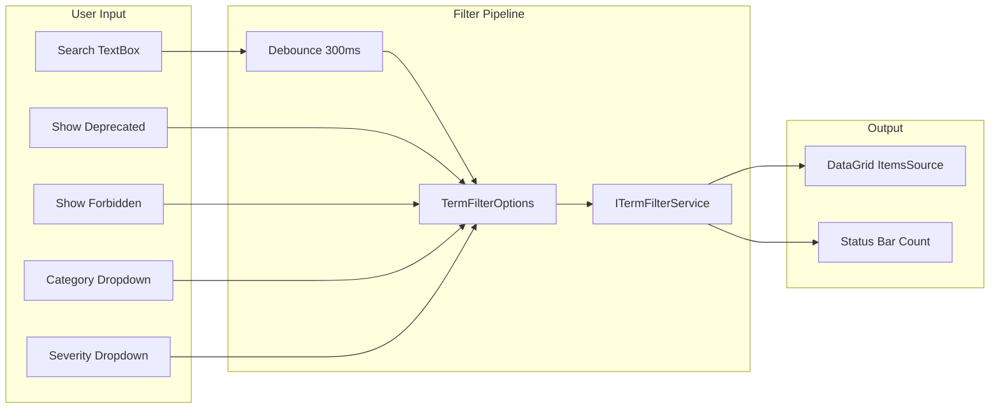
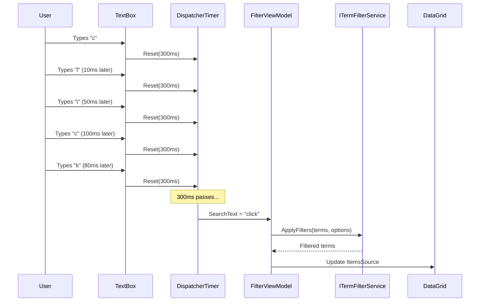

# LCS-DES-025b: Search & Filter

## 1. Metadata & Categorization

| Field              | Value                       | Description                              |
| :----------------- | :-------------------------- | :--------------------------------------- |
| **Document ID**    | LCS-DES-025b                | Design Specification v0.2.5b             |
| **Feature ID**     | INF-025b                    | Style Module - Search & Filter           |
| **Feature Name**   | Terminology Search & Filter | Real-time filtering with toggle controls |
| **Target Version** | `v0.2.5b`                   | Second sub-part of v0.2.5                |
| **Module Scope**   | `Lexichord.Modules.Style`   | Style governance infrastructure          |
| **Swimlane**       | `Features`                  | Style Governance Domain                  |
| **License Tier**   | `Core`                      | Available to all tiers                   |
| **Author**         | System Architect            |                                          |
| **Status**         | **Draft**                   | Pending implementation                   |
| **Last Updated**   | 2026-01-27                  |                                          |

---

## 2. Executive Summary

### 2.1 The Requirement

The Terminology Grid needs **filtering capabilities** to help users find specific terms:

- Search bar with real-time filtering (debounced input).
- Toggle checkboxes for "Show Deprecated" and "Show Forbidden".
- Category and Severity dropdown filters.
- Filter state persistence across sessions.
- Clear all filters button.

### 2.2 The Proposed Solution

We **SHALL** implement a FilterBar component with:

1. **Search TextBox:** Debounced (300ms) case-insensitive search across Pattern, Recommendation, Category.
2. **Show Deprecated CheckBox:** Toggles visibility of `IsActive = false` terms.
3. **Show Forbidden CheckBox:** Toggles visibility of `Severity = 'error'` terms.
4. **Category ComboBox:** Filter to specific category.
5. **Severity ComboBox:** Filter to specific severity.
6. **Clear Button:** Reset all filters to defaults.
7. **Persistence:** Save filter state via `ISettingsService`.

---

## 3. Architecture

### 3.1 FilterBar Layout

```
+-------------------------------------------------------------------------+
| [🔍] [Search terms...                          ] [X]                     |
| [✓] Show Deprecated  [✓] Show Forbidden  Category: [All ▼] Severity: [All ▼] |
+-------------------------------------------------------------------------+
```

### 3.2 Filter Flow



### 3.3 Debounce Implementation



---

## 4. Decision Tree: Filter Operations

```text
START: "What filter operation is requested?"
|
+-- User types in search box
|   +-- Reset debounce timer (300ms)
|   +-- On timer elapsed:
|   |   +-- Update FilterOptions.SearchText
|   |   +-- Trigger filter refresh
|   +-- END
|
+-- User toggles "Show Deprecated"
|   +-- Update FilterOptions.ShowDeprecated
|   +-- Trigger filter refresh immediately
|   +-- Persist to settings
|   +-- END
|
+-- User toggles "Show Forbidden"
|   +-- Update FilterOptions.ShowForbidden
|   +-- Trigger filter refresh immediately
|   +-- Persist to settings
|   +-- END
|
+-- User selects category
|   +-- Update FilterOptions.CategoryFilter
|   +-- Trigger filter refresh immediately
|   +-- Persist to settings
|   +-- END
|
+-- User selects severity
|   +-- Update FilterOptions.SeverityFilter
|   +-- Trigger filter refresh immediately
|   +-- Persist to settings
|   +-- END
|
+-- User clicks Clear (X) button
|   +-- Reset all filter options to defaults
|   +-- Clear search text
|   +-- Trigger filter refresh
|   +-- END
|
+-- View loads
|   +-- Load persisted filter state from settings
|   +-- Populate category/severity dropdowns from data
|   +-- Apply loaded filters
|   +-- END
```

---

## 5. Data Contracts

### 5.1 FilterBar View

```xml
<UserControl xmlns="https://github.com/avaloniaui"
             xmlns:x="http://schemas.microsoft.com/winfx/2006/xaml"
             xmlns:vm="using:Lexichord.Modules.Style.ViewModels"
             x:Class="Lexichord.Modules.Style.Views.FilterBar"
             x:DataType="vm:FilterViewModel">

    <Border Classes="FilterBar" Padding="8">
        <Grid RowDefinitions="Auto,Auto" ColumnDefinitions="*">
            <!-- Row 0: Search Box -->
            <Grid ColumnDefinitions="Auto,*,Auto">
                <!-- Search Icon -->
                <PathIcon Grid.Column="0"
                          Data="{StaticResource SearchIcon}"
                          Width="16" Height="16"
                          Margin="0,0,8,0"
                          Opacity="0.6" />

                <!-- Search TextBox -->
                <TextBox Grid.Column="1"
                         Text="{Binding SearchText, Mode=TwoWay}"
                         Watermark="Search terms..."
                         Classes="SearchBox">
                    <TextBox.InnerRightContent>
                        <Button Classes="ClearButton"
                                Command="{Binding ClearSearchCommand}"
                                IsVisible="{Binding HasSearchText}"
                                ToolTip.Tip="Clear search">
                            <PathIcon Data="{StaticResource CloseIcon}"
                                      Width="12" Height="12" />
                        </Button>
                    </TextBox.InnerRightContent>
                </TextBox>

                <!-- Clear All Filters -->
                <Button Grid.Column="2"
                        Command="{Binding ClearAllFiltersCommand}"
                        IsVisible="{Binding HasActiveFilters}"
                        Margin="8,0,0,0"
                        ToolTip.Tip="Clear all filters">
                    <StackPanel Orientation="Horizontal" Spacing="4">
                        <PathIcon Data="{StaticResource FilterOffIcon}"
                                  Width="14" Height="14" />
                        <TextBlock Text="Clear" />
                    </StackPanel>
                </Button>
            </Grid>

            <!-- Row 1: Toggle Checkboxes and Dropdowns -->
            <WrapPanel Grid.Row="1" Margin="0,8,0,0">
                <!-- Show Deprecated -->
                <CheckBox IsChecked="{Binding ShowDeprecated}"
                          Content="Show Deprecated"
                          Margin="0,0,16,0"
                          ToolTip.Tip="Show inactive/deprecated terms" />

                <!-- Show Forbidden -->
                <CheckBox IsChecked="{Binding ShowForbidden}"
                          Content="Show Forbidden"
                          Margin="0,0,16,0"
                          ToolTip.Tip="Show error-severity terms" />

                <!-- Category Filter -->
                <StackPanel Orientation="Horizontal" Margin="0,0,16,0">
                    <TextBlock Text="Category:"
                               VerticalAlignment="Center"
                               Margin="0,0,4,0" />
                    <ComboBox ItemsSource="{Binding Categories}"
                              SelectedItem="{Binding SelectedCategory}"
                              MinWidth="120"
                              PlaceholderText="All" />
                </StackPanel>

                <!-- Severity Filter -->
                <StackPanel Orientation="Horizontal">
                    <TextBlock Text="Severity:"
                               VerticalAlignment="Center"
                               Margin="0,0,4,0" />
                    <ComboBox ItemsSource="{Binding Severities}"
                              SelectedItem="{Binding SelectedSeverity}"
                              MinWidth="100"
                              PlaceholderText="All" />
                </StackPanel>

                <!-- Active Filter Count Badge -->
                <Border Classes="FilterBadge"
                        IsVisible="{Binding HasActiveFilters}"
                        Margin="16,0,0,0">
                    <TextBlock Text="{Binding ActiveFilterCount, StringFormat='{}{0} filter(s)'}" />
                </Border>
            </WrapPanel>
        </Grid>
    </Border>
</UserControl>
```

### 5.2 FilterViewModel

```csharp
namespace Lexichord.Modules.Style.ViewModels;

using System.Timers;
using CommunityToolkit.Mvvm.ComponentModel;
using CommunityToolkit.Mvvm.Input;

/// <summary>
/// ViewModel for the filter bar in Lexicon view.
/// </summary>
/// <remarks>
/// LOGIC: FilterViewModel manages filter state and triggers parent
/// ViewModel to refresh the grid when filters change.
///
/// Debouncing:
/// - Search text changes are debounced (300ms) to avoid excessive filtering
/// - Toggle changes apply immediately
/// - Dropdown changes apply immediately
///
/// Persistence:
/// - Filter state saved to ISettingsService on change
/// - State restored when view loads
/// </remarks>
public partial class FilterViewModel : ObservableObject, IDisposable
{
    private readonly ITermFilterService _filterService;
    private readonly ISettingsService _settingsService;
    private readonly ILogger<FilterViewModel> _logger;
    private readonly Timer _debounceTimer;

    private const int DebounceDelayMs = 300;

    /// <summary>
    /// Search text for filtering.
    /// </summary>
    /// <remarks>
    /// LOGIC: Debounced - triggers filter after 300ms of no input.
    /// </remarks>
    [ObservableProperty]
    [NotifyPropertyChangedFor(nameof(HasSearchText))]
    [NotifyPropertyChangedFor(nameof(HasActiveFilters))]
    [NotifyPropertyChangedFor(nameof(ActiveFilterCount))]
    private string _searchText = string.Empty;

    /// <summary>
    /// Whether to show inactive (deprecated) terms.
    /// </summary>
    /// <remarks>
    /// LOGIC: Default false - hide deprecated for cleaner view.
    /// </remarks>
    [ObservableProperty]
    [NotifyPropertyChangedFor(nameof(HasActiveFilters))]
    [NotifyPropertyChangedFor(nameof(ActiveFilterCount))]
    private bool _showDeprecated = false;

    /// <summary>
    /// Whether to show error-severity (forbidden) terms.
    /// </summary>
    /// <remarks>
    /// LOGIC: Default true - show all severities including errors.
    /// </remarks>
    [ObservableProperty]
    [NotifyPropertyChangedFor(nameof(HasActiveFilters))]
    [NotifyPropertyChangedFor(nameof(ActiveFilterCount))]
    private bool _showForbidden = true;

    /// <summary>
    /// Selected category filter. Null means all categories.
    /// </summary>
    [ObservableProperty]
    [NotifyPropertyChangedFor(nameof(HasActiveFilters))]
    [NotifyPropertyChangedFor(nameof(ActiveFilterCount))]
    private string? _selectedCategory;

    /// <summary>
    /// Selected severity filter. Null means all severities.
    /// </summary>
    [ObservableProperty]
    [NotifyPropertyChangedFor(nameof(HasActiveFilters))]
    [NotifyPropertyChangedFor(nameof(ActiveFilterCount))]
    private string? _selectedSeverity;

    /// <summary>
    /// Available categories for dropdown.
    /// </summary>
    [ObservableProperty]
    private ObservableCollection<string> _categories = new();

    /// <summary>
    /// Available severities for dropdown.
    /// </summary>
    [ObservableProperty]
    private ObservableCollection<string> _severities = new();

    /// <summary>
    /// Whether search text is not empty.
    /// </summary>
    public bool HasSearchText => !string.IsNullOrWhiteSpace(SearchText);

    /// <summary>
    /// Whether any filter is active.
    /// </summary>
    /// <remarks>
    /// LOGIC: Used to show/hide clear button and filter badge.
    /// </remarks>
    public bool HasActiveFilters =>
        HasSearchText ||
        !ShowDeprecated || // Default is false, so true means filtering
        !ShowForbidden ||  // Default is true, so false means filtering
        SelectedCategory is not null ||
        SelectedSeverity is not null;

    /// <summary>
    /// Number of active filters for badge display.
    /// </summary>
    public int ActiveFilterCount
    {
        get
        {
            int count = 0;
            if (HasSearchText) count++;
            if (!ShowDeprecated) count++; // Hiding deprecated is a filter
            if (!ShowForbidden) count++;  // Hiding forbidden is a filter
            if (SelectedCategory is not null) count++;
            if (SelectedSeverity is not null) count++;
            return count;
        }
    }

    /// <summary>
    /// Event raised when filters change and grid should refresh.
    /// </summary>
    public event EventHandler<TermFilterOptions>? FiltersChanged;

    public FilterViewModel(
        ITermFilterService filterService,
        ISettingsService settingsService,
        ILogger<FilterViewModel> logger)
    {
        _filterService = filterService;
        _settingsService = settingsService;
        _logger = logger;

        // LOGIC: Initialize debounce timer
        _debounceTimer = new Timer(DebounceDelayMs);
        _debounceTimer.Elapsed += OnDebounceTimerElapsed;
        _debounceTimer.AutoReset = false;

        // LOGIC: Populate severity options
        Severities = new ObservableCollection<string>(StyleTermSeverity.All);
    }

    /// <summary>
    /// Initializes filter state from persisted settings.
    /// </summary>
    public async Task InitializeAsync(IEnumerable<StyleTerm> terms)
    {
        // LOGIC: Populate categories from actual data
        var categories = _filterService.GetDistinctCategories(terms);
        Categories = new ObservableCollection<string>(categories);

        // LOGIC: Load persisted filter state
        var persisted = await _settingsService.GetAsync<TermFilterOptions>("Lexicon.FilterOptions");
        if (persisted is not null)
        {
            SearchText = persisted.SearchText;
            ShowDeprecated = persisted.ShowDeprecated;
            ShowForbidden = persisted.ShowForbidden;
            SelectedCategory = persisted.CategoryFilter;
            SelectedSeverity = persisted.SeverityFilter;

            _logger.LogDebug("Restored filter state: {Options}", persisted);
        }
    }

    /// <summary>
    /// Builds current filter options.
    /// </summary>
    public TermFilterOptions BuildOptions() => new()
    {
        SearchText = SearchText,
        ShowDeprecated = ShowDeprecated,
        ShowForbidden = ShowForbidden,
        CategoryFilter = SelectedCategory,
        SeverityFilter = SelectedSeverity
    };

    /// <summary>
    /// Clears search text.
    /// </summary>
    [RelayCommand]
    private void ClearSearch()
    {
        SearchText = string.Empty;
    }

    /// <summary>
    /// Clears all filters to defaults.
    /// </summary>
    [RelayCommand]
    private void ClearAllFilters()
    {
        SearchText = string.Empty;
        ShowDeprecated = false;
        ShowForbidden = true;
        SelectedCategory = null;
        SelectedSeverity = null;

        _logger.LogDebug("Cleared all filters");
    }

    partial void OnSearchTextChanged(string value)
    {
        // LOGIC: Debounce search text changes
        _debounceTimer.Stop();
        _debounceTimer.Start();
    }

    partial void OnShowDeprecatedChanged(bool value)
    {
        // LOGIC: Immediate filter on toggle change
        RaiseFiltersChanged();
        PersistFilterState();
    }

    partial void OnShowForbiddenChanged(bool value)
    {
        RaiseFiltersChanged();
        PersistFilterState();
    }

    partial void OnSelectedCategoryChanged(string? value)
    {
        RaiseFiltersChanged();
        PersistFilterState();
    }

    partial void OnSelectedSeverityChanged(string? value)
    {
        RaiseFiltersChanged();
        PersistFilterState();
    }

    private void OnDebounceTimerElapsed(object? sender, ElapsedEventArgs e)
    {
        // LOGIC: Timer elapsed - apply search filter
        Avalonia.Threading.Dispatcher.UIThread.Post(() =>
        {
            RaiseFiltersChanged();
            PersistFilterState();
        });
    }

    private void RaiseFiltersChanged()
    {
        var options = BuildOptions();
        _logger.LogDebug("Filters changed: {Options}", options);
        FiltersChanged?.Invoke(this, options);
    }

    private async void PersistFilterState()
    {
        var options = BuildOptions();
        await _settingsService.SetAsync("Lexicon.FilterOptions", options);
    }

    public void Dispose()
    {
        _debounceTimer.Dispose();
    }
}
```

### 5.3 ITermFilterService Implementation

```csharp
namespace Lexichord.Modules.Style.Services;

/// <summary>
/// Implementation of ITermFilterService.
/// </summary>
/// <remarks>
/// LOGIC: Applies filters in a specific order for predictable results.
/// Each filter is applied independently, narrowing the result set.
///
/// Filter Order:
/// 1. Search text (pattern OR recommendation OR category)
/// 2. ShowDeprecated (is_active)
/// 3. ShowForbidden (severity = 'error')
/// 4. Category (exact match)
/// 5. Severity (exact match)
/// </remarks>
public sealed class TermFilterService : ITermFilterService
{
    private readonly ILogger<TermFilterService> _logger;

    public TermFilterService(ILogger<TermFilterService> logger)
    {
        _logger = logger;
    }

    /// <inheritdoc/>
    public IEnumerable<StyleTerm> ApplyFilters(
        IEnumerable<StyleTerm> terms,
        TermFilterOptions options)
    {
        var result = terms;

        // LOGIC: Filter 1 - Search text
        if (!string.IsNullOrWhiteSpace(options.SearchText))
        {
            var search = options.SearchText.Trim();
            result = result.Where(t =>
                t.TermPattern.Contains(search, StringComparison.OrdinalIgnoreCase) ||
                t.Recommendation.Contains(search, StringComparison.OrdinalIgnoreCase) ||
                t.Category.Contains(search, StringComparison.OrdinalIgnoreCase));

            _logger.LogDebug("Search filter '{Search}' applied", search);
        }

        // LOGIC: Filter 2 - Show Deprecated
        if (!options.ShowDeprecated)
        {
            result = result.Where(t => t.IsActive);
            _logger.LogDebug("Hiding deprecated terms");
        }

        // LOGIC: Filter 3 - Show Forbidden (error severity)
        if (!options.ShowForbidden)
        {
            result = result.Where(t => t.Severity != StyleTermSeverity.Error);
            _logger.LogDebug("Hiding error-severity terms");
        }

        // LOGIC: Filter 4 - Category
        if (!string.IsNullOrEmpty(options.CategoryFilter))
        {
            result = result.Where(t =>
                t.Category.Equals(options.CategoryFilter, StringComparison.OrdinalIgnoreCase));
            _logger.LogDebug("Category filter '{Category}' applied", options.CategoryFilter);
        }

        // LOGIC: Filter 5 - Severity
        if (!string.IsNullOrEmpty(options.SeverityFilter))
        {
            result = result.Where(t =>
                t.Severity.Equals(options.SeverityFilter, StringComparison.OrdinalIgnoreCase));
            _logger.LogDebug("Severity filter '{Severity}' applied", options.SeverityFilter);
        }

        return result;
    }

    /// <inheritdoc/>
    public IReadOnlyList<string> GetDistinctCategories(IEnumerable<StyleTerm> terms) =>
        terms.Select(t => t.Category).Distinct().OrderBy(c => c).ToList();

    /// <inheritdoc/>
    public IReadOnlyList<string> GetDistinctSeverities(IEnumerable<StyleTerm> terms) =>
        terms.Select(t => t.Severity).Distinct().OrderBy(s => s).ToList();
}
```

---

## 6. Implementation Logic

### 6.1 Filter Combination Logic

```csharp
// LOGIC: Filters are combined with AND logic
// Term is shown if:
//   (SearchText matches OR SearchText is empty)
//   AND (ShowDeprecated OR term.IsActive)
//   AND (ShowForbidden OR term.Severity != 'error')
//   AND (CategoryFilter matches OR CategoryFilter is empty)
//   AND (SeverityFilter matches OR SeverityFilter is empty)
```

### 6.2 Settings Persistence Schema

```json
{
    "Lexicon.FilterOptions": {
        "SearchText": "",
        "ShowDeprecated": false,
        "ShowForbidden": true,
        "CategoryFilter": null,
        "SeverityFilter": null
    }
}
```

### 6.3 Debounce Timer Lifecycle

```csharp
// LOGIC: Debounce lifecycle management
public FilterViewModel()
{
    _debounceTimer = new Timer(300);
    _debounceTimer.AutoReset = false; // Only fire once
}

partial void OnSearchTextChanged(string value)
{
    _debounceTimer.Stop();  // Cancel pending
    _debounceTimer.Start(); // Start fresh
}

private void OnDebounceTimerElapsed(object? sender, ElapsedEventArgs e)
{
    // LOGIC: Must dispatch to UI thread for property updates
    Dispatcher.UIThread.Post(ApplyFilter);
}

public void Dispose()
{
    _debounceTimer.Dispose(); // Clean up timer
}
```

---

## 7. Use Cases

### UC-01: Search for Terms

**Preconditions:**

- Lexicon view is open with 127 terms loaded.

**Flow:**

1. User clicks in search box.
2. User types "click".
3. 300ms debounce timer starts.
4. User finishes typing.
5. After 300ms, filter applies.
6. Grid shows 5 terms containing "click".
7. Status bar: "5 of 127 terms (filtered)".

**Postconditions:**

- Only matching terms visible.
- Filter badge shows "1 filter(s)".

---

### UC-02: Toggle Show Deprecated

**Preconditions:**

- Grid showing 127 active terms.
- 10 inactive terms exist in database.

**Flow:**

1. User checks "Show Deprecated" checkbox.
2. Filter immediately updates.
3. Grid shows 137 terms (127 active + 10 inactive).
4. Inactive terms shown with gray X icon.
5. Status bar: "137 terms".

**Postconditions:**

- All terms visible including inactive.
- Filter state persisted.

---

### UC-03: Combine Multiple Filters

**Preconditions:**

- Grid showing all 127 terms.

**Flow:**

1. User types "click" in search (5 matches).
2. User selects Category: "Terminology" (4 matches).
3. User unchecks "Show Forbidden" (3 matches - 1 error hidden).
4. Filter badge: "3 filter(s)".
5. Grid shows 3 terms.

**Postconditions:**

- All filters combined with AND logic.
- Clear button visible.

---

### UC-04: Clear All Filters

**Preconditions:**

- Multiple filters active.
- Grid showing 3 of 127 terms.

**Flow:**

1. User clicks "Clear" button.
2. All filters reset to defaults.
3. Search text cleared.
4. ShowDeprecated = false, ShowForbidden = true.
5. Category and Severity = null.
6. Grid shows all 127 terms.

**Postconditions:**

- All filters at default state.
- Filter badge hidden.

---

## 8. Observability & Logging

### 8.1 Log Events

| Level | Source            | Message Template                       |
| :---- | :---------------- | :------------------------------------- |
| Debug | FilterViewModel   | `Restored filter state: {Options}`     |
| Debug | FilterViewModel   | `Filters changed: {Options}`           |
| Debug | FilterViewModel   | `Cleared all filters`                  |
| Debug | TermFilterService | `Search filter '{Search}' applied`     |
| Debug | TermFilterService | `Hiding deprecated terms`              |
| Debug | TermFilterService | `Hiding error-severity terms`          |
| Debug | TermFilterService | `Category filter '{Category}' applied` |
| Debug | TermFilterService | `Severity filter '{Severity}' applied` |

---

## 9. Unit Testing Requirements

### 9.1 FilterViewModel Tests

```csharp
[TestFixture]
[Category("Unit")]
public class FilterViewModelTests
{
    private Mock<ITermFilterService> _mockFilterService = null!;
    private Mock<ISettingsService> _mockSettings = null!;
    private Mock<ILogger<FilterViewModel>> _mockLogger = null!;
    private FilterViewModel _sut = null!;

    [SetUp]
    public void SetUp()
    {
        _mockFilterService = new Mock<ITermFilterService>();
        _mockSettings = new Mock<ISettingsService>();
        _mockLogger = new Mock<ILogger<FilterViewModel>>();

        _sut = new FilterViewModel(
            _mockFilterService.Object,
            _mockSettings.Object,
            _mockLogger.Object);
    }

    [TearDown]
    public void TearDown()
    {
        _sut.Dispose();
    }

    [Test]
    public void HasActiveFilters_WhenSearchTextSet_ReturnsTrue()
    {
        // Act
        _sut.SearchText = "click";

        // Assert
        Assert.That(_sut.HasActiveFilters, Is.True);
        Assert.That(_sut.HasSearchText, Is.True);
    }

    [Test]
    public void HasActiveFilters_WhenShowDeprecatedFalse_ReturnsTrue()
    {
        // Arrange - ShowDeprecated defaults to false
        // So hiding deprecated IS a filter

        // Assert
        Assert.That(_sut.HasActiveFilters, Is.True);
    }

    [Test]
    public void HasActiveFilters_WhenAllDefaults_ReturnsTrue()
    {
        // LOGIC: Default state has ShowDeprecated=false which is filtering
        Assert.That(_sut.HasActiveFilters, Is.True);
    }

    [Test]
    public void HasActiveFilters_WhenShowingAll_ReturnsFalse()
    {
        // Arrange - show everything
        _sut.ShowDeprecated = true;
        _sut.ShowForbidden = true;

        // Assert
        Assert.That(_sut.HasActiveFilters, Is.False);
    }

    [Test]
    public void ActiveFilterCount_CountsEachActiveFilter()
    {
        // Arrange
        _sut.SearchText = "click";
        _sut.ShowDeprecated = false; // +1
        _sut.ShowForbidden = false;  // +1
        _sut.SelectedCategory = "Terminology";

        // Assert
        // Search: 1 + ShowDeprecated: 1 + ShowForbidden: 1 + Category: 1 = 4
        Assert.That(_sut.ActiveFilterCount, Is.EqualTo(4));
    }

    [Test]
    public void ClearAllFiltersCommand_ResetsAllToDefaults()
    {
        // Arrange
        _sut.SearchText = "test";
        _sut.ShowDeprecated = true;
        _sut.ShowForbidden = false;
        _sut.SelectedCategory = "Category";

        // Act
        _sut.ClearAllFiltersCommand.Execute(null);

        // Assert
        Assert.Multiple(() =>
        {
            Assert.That(_sut.SearchText, Is.Empty);
            Assert.That(_sut.ShowDeprecated, Is.False);
            Assert.That(_sut.ShowForbidden, Is.True);
            Assert.That(_sut.SelectedCategory, Is.Null);
            Assert.That(_sut.SelectedSeverity, Is.Null);
        });
    }

    [Test]
    public void BuildOptions_ReturnsCurrentState()
    {
        // Arrange
        _sut.SearchText = "click";
        _sut.ShowDeprecated = true;
        _sut.ShowForbidden = false;
        _sut.SelectedCategory = "Terminology";
        _sut.SelectedSeverity = "warning";

        // Act
        var options = _sut.BuildOptions();

        // Assert
        Assert.Multiple(() =>
        {
            Assert.That(options.SearchText, Is.EqualTo("click"));
            Assert.That(options.ShowDeprecated, Is.True);
            Assert.That(options.ShowForbidden, Is.False);
            Assert.That(options.CategoryFilter, Is.EqualTo("Terminology"));
            Assert.That(options.SeverityFilter, Is.EqualTo("warning"));
        });
    }

    [Test]
    public void FiltersChanged_RaisedOnToggleChange()
    {
        // Arrange
        var eventRaised = false;
        _sut.FiltersChanged += (s, e) => eventRaised = true;

        // Act
        _sut.ShowDeprecated = true;

        // Assert
        Assert.That(eventRaised, Is.True);
    }
}
```

### 9.2 TermFilterService Tests

See LCS-INF-025.md Section 9.1 for comprehensive filter service tests.

---

## 10. Security & Safety

### 10.1 Input Sanitization

> [!NOTE]
> Search text is used for in-memory filtering only.
> No database queries are constructed from user input.

```csharp
// LOGIC: Safe - only string.Contains() on loaded data
result = result.Where(t =>
    t.TermPattern.Contains(search, StringComparison.OrdinalIgnoreCase));
```

### 10.2 Settings Validation

```csharp
// LOGIC: Validate loaded settings before applying
var persisted = await _settingsService.GetAsync<TermFilterOptions>("Lexicon.FilterOptions");
if (persisted is not null)
{
    // LOGIC: Validate category exists in current data
    if (persisted.CategoryFilter is not null &&
        !Categories.Contains(persisted.CategoryFilter))
    {
        persisted = persisted with { CategoryFilter = null };
    }

    // LOGIC: Validate severity is valid
    if (persisted.SeverityFilter is not null &&
        !StyleTermSeverity.IsValid(persisted.SeverityFilter))
    {
        persisted = persisted with { SeverityFilter = null };
    }
}
```

---

## 11. Risks & Mitigations

| Risk                              | Impact | Probability | Mitigation                                         |
| :-------------------------------- | :----- | :---------- | :------------------------------------------------- |
| Debounce timer leaks              | Low    | Low         | Implement IDisposable; dispose timer               |
| Filter state corrupted            | Low    | Low         | Validate on load; reset to defaults on error       |
| Slow filtering with 10,000+ terms | Medium | Medium      | Consider background worker; show loading indicator |
| Category dropdown too long        | Low    | Medium      | Limit dropdown height; add search within dropdown  |

---

## 12. Acceptance Criteria (QA)

| #   | Criterion                                                    |
| :-- | :----------------------------------------------------------- |
| 1   | Search box filters as user types (after 300ms delay).        |
| 2   | Search matches Pattern, Recommendation, and Category fields. |
| 3   | Search is case-insensitive.                                  |
| 4   | "Show Deprecated" toggle shows/hides inactive terms.         |
| 5   | "Show Forbidden" toggle shows/hides error-severity terms.    |
| 6   | Category dropdown filters to selected category.              |
| 7   | Severity dropdown filters to selected severity.              |
| 8   | Clear (X) button clears search text only.                    |
| 9   | "Clear" button resets all filters to defaults.               |
| 10  | Filter badge shows count of active filters.                  |
| 11  | Filter state persists across application restarts.           |
| 12  | Status bar updates to show filtered count.                   |

---

## 13. Verification Commands

```bash
# 1. Run application
dotnet run --project src/Lexichord.Host

# 2. Open Lexicon view
# View > Lexicon

# 3. Test search
# Type "click" in search box
# Wait 300ms
# Expected: Grid shows only terms containing "click"

# 4. Test debounce
# Type rapidly "c", "l", "i", "c", "k"
# Expected: No filtering until 300ms after last keystroke

# 5. Test Show Deprecated
# Check "Show Deprecated" checkbox
# Expected: Inactive terms appear (if any exist)

# 6. Test Show Forbidden
# Uncheck "Show Forbidden" checkbox
# Expected: Error-severity terms disappear

# 7. Test Category filter
# Select "Terminology" from Category dropdown
# Expected: Only Terminology terms shown

# 8. Test Clear All
# Apply multiple filters
# Click "Clear" button
# Expected: All filters reset, all terms shown

# 9. Test persistence
# Apply filters, close app, reopen
# Expected: Filter state restored

# 10. Run unit tests
dotnet test --filter "FullyQualifiedName~FilterViewModel"
```

---

## 14. Deliverable Checklist

| Step | Description                                    | Status |
| :--- | :--------------------------------------------- | :----- |
| 1    | `FilterBar.axaml` with search box and toggles  | [ ]    |
| 2    | Search TextBox with watermark and clear button | [ ]    |
| 3    | "Show Deprecated" CheckBox                     | [ ]    |
| 4    | "Show Forbidden" CheckBox                      | [ ]    |
| 5    | Category ComboBox with "All" placeholder       | [ ]    |
| 6    | Severity ComboBox with "All" placeholder       | [ ]    |
| 7    | Clear All Filters button                       | [ ]    |
| 8    | Filter badge showing active filter count       | [ ]    |
| 9    | `FilterViewModel` with debounced search        | [ ]    |
| 10   | `ITermFilterService` implementation            | [ ]    |
| 11   | Filter state persistence via ISettingsService  | [ ]    |
| 12   | `FiltersChanged` event for grid refresh        | [ ]    |
| 13   | Unit tests for FilterViewModel                 | [ ]    |
| 14   | Unit tests for TermFilterService               | [ ]    |
