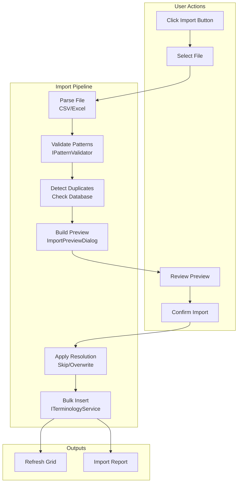
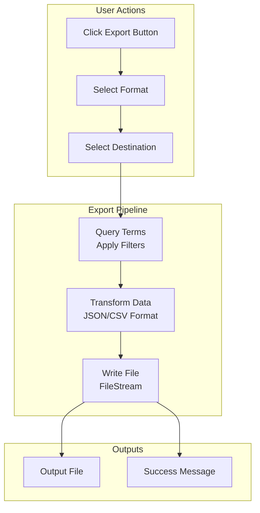

# LCS-DES-025d: Bulk Import/Export

## 1. Metadata & Categorization

| Field              | Value                     | Description                                    |
| :----------------- | :------------------------ | :--------------------------------------------- |
| **Document ID**    | LCS-DES-025d              | Design Specification v0.2.5d                   |
| **Feature ID**     | INF-025d                  | Style Module - Bulk Import/Export              |
| **Feature Name**   | Terminology Import/Export | CSV/Excel import, JSON export for team sharing |
| **Target Version** | `v0.2.5d`                 | Fourth sub-part of v0.2.5                      |
| **Module Scope**   | `Lexichord.Modules.Style` | Style governance infrastructure                |
| **Swimlane**       | `Features`                | Style Governance Domain                        |
| **License Tier**   | `WriterPro`               | Import/Export requires WriterPro tier          |
| **Author**         | System Architect          |                                                |
| **Status**         | **Draft**                 | Pending implementation                         |
| **Last Updated**   | 2026-01-27                |                                                |

---

## 2. Executive Summary

### 2.1 The Requirement

Teams need to **share terminology libraries** and bulk-manage style rules:

- Import terms from CSV files for spreadsheet editing.
- Import terms from Excel (.xlsx) for enterprise workflows.
- Export current database to JSON for version control and sharing.
- Export to CSV for editing in spreadsheet applications.
- Handle duplicate detection with user-selectable resolution.
- Validate all patterns before importing.

### 2.2 The Proposed Solution

We **SHALL** implement import/export services with:

1. **ITermImportService:** Parse CSV/Excel, preview, validate, import.
2. **ITermExportService:** Export to JSON/CSV with filtering options.
3. **ImportPreviewDialog:** Show parsed data before commit.
4. **Progress Reporting:** Show progress for large file operations.
5. **Error Handling:** Detailed error reports for failed rows.

---

## 3. Architecture

### 3.1 Import Flow



### 3.2 Export Flow



### 3.3 File Format Specifications

**CSV Format:**

```csv
pattern,recommendation,category,severity,match_case,is_active
"click on","Use 'select' instead of 'click on' for touchscreen compatibility","Terminology","warning",false,true
"e-mail","Use 'email' (no hyphen) per modern style guides","Terminology","suggestion",false,true
"\butilize\b","Use 'use' instead of 'utilize' for clarity","Clarity","suggestion",false,true
```

**Excel Format:**
| Column | Type | Required | Notes |
|:-------|:-----|:---------|:------|
| pattern | String | Yes | Regex or literal text |
| recommendation | String | Yes | Guidance text |
| category | String | Yes | Category name |
| severity | String | No | error/warning/suggestion/info (default: suggestion) |
| match_case | Boolean | No | true/false (default: false) |
| is_active | Boolean | No | true/false (default: true) |

**JSON Export Format:**

```json
{
    "$schema": "https://lexichord.io/schemas/terminology-export-v1.json",
    "version": "1.0",
    "metadata": {
        "exported_at": "2026-01-26T14:30:00.000Z",
        "exported_by": "Lexichord v0.2.5",
        "source_database": "lexichord_production",
        "total_terms": 127,
        "filters_applied": {
            "categories": null,
            "severities": null,
            "include_inactive": false
        }
    },
    "terms": [
        {
            "pattern": "click on",
            "recommendation": "Use 'select' instead of 'click on' for touchscreen compatibility",
            "category": "Terminology",
            "severity": "warning",
            "match_case": false,
            "is_active": true
        }
    ]
}
```

---

## 4. Decision Tree: Import/Export Operations

```text
START: "What import/export operation is requested?"
|
+-- User clicks Import > CSV
|   +-- Check license tier (WriterPro required)
|   |   +-- Not licensed -> Show upgrade prompt, END
|   +-- Show file picker (*.csv filter)
|   +-- User selects file
|   +-- Parse CSV with CsvHelper
|   +-- Validate all patterns
|   +-- Check for duplicates in database
|   +-- Show ImportPreviewDialog
|   +-- User reviews and selects conflict resolution
|   +-- User clicks Import
|   +-- Execute bulk insert with progress
|   +-- Show import report
|   +-- Refresh grid
|   +-- END
|
+-- User clicks Import > Excel
|   +-- Check license tier (WriterPro required)
|   |   +-- Not licensed -> Show upgrade prompt, END
|   +-- Show file picker (*.xlsx filter)
|   +-- User selects file
|   +-- Parse Excel with ClosedXML
|   +-- If multiple sheets, prompt for sheet selection
|   +-- Validate all patterns
|   +-- Check for duplicates in database
|   +-- Show ImportPreviewDialog
|   +-- User reviews and selects conflict resolution
|   +-- User clicks Import
|   +-- Execute bulk insert with progress
|   +-- Show import report
|   +-- Refresh grid
|   +-- END
|
+-- User clicks Export > JSON
|   +-- Check license tier (WriterPro required)
|   |   +-- Not licensed -> Show upgrade prompt, END
|   +-- Show export options dialog (optional)
|   |   +-- Include inactive terms?
|   |   +-- Filter by category?
|   |   +-- Pretty print?
|   +-- Show save file dialog
|   +-- User selects destination
|   +-- Query terms with filters
|   +-- Serialize to JSON
|   +-- Write to file
|   +-- Show success notification
|   +-- END
|
+-- User clicks Export > CSV
|   +-- Check license tier (WriterPro required)
|   |   +-- Not licensed -> Show upgrade prompt, END
|   +-- Show export options dialog (optional)
|   +-- Show save file dialog
|   +-- Query terms with filters
|   +-- Serialize to CSV
|   +-- Write to file
|   +-- Show success notification
|   +-- END
|
+-- Parse error during import
|   +-- Log error with row number
|   +-- Add to error list
|   +-- Continue parsing remaining rows
|   +-- Show errors in preview dialog
|   +-- User can proceed without invalid rows
|   +-- END
|
+-- Validation error during import
|   +-- Pattern fails regex validation
|   +-- Add to error list with details
|   +-- Show in preview with error icon
|   +-- User can fix in preview or skip row
|   +-- END
```

---

## 5. Data Contracts

### 5.1 ITermImportService Interface

```csharp
namespace Lexichord.Modules.Style.Services;

/// <summary>
/// Service for importing terminology terms from external files.
/// </summary>
/// <remarks>
/// LOGIC: ITermImportService handles parsing, validation, and bulk
/// insertion of terms from CSV and Excel files.
///
/// Import Process:
/// 1. Parse file to ImportRow objects
/// 2. Validate each row (pattern, required fields)
/// 3. Detect duplicates against existing database
/// 4. Present preview to user
/// 5. Apply conflict resolution
/// 6. Bulk insert valid rows
/// 7. Return import result with statistics
///
/// License: Requires WriterPro tier
/// </remarks>
public interface ITermImportService
{
    /// <summary>
    /// Parses a CSV file and returns import rows.
    /// </summary>
    /// <param name="stream">The CSV file stream.</param>
    /// <param name="options">Import options.</param>
    /// <param name="ct">Cancellation token.</param>
    /// <returns>Parsed import data.</returns>
    Task<ImportParseResult> ParseCsvAsync(
        Stream stream,
        ImportOptions options,
        CancellationToken ct = default);

    /// <summary>
    /// Parses an Excel file and returns import rows.
    /// </summary>
    /// <param name="stream">The Excel file stream.</param>
    /// <param name="sheetName">Sheet name to import (null for first sheet).</param>
    /// <param name="options">Import options.</param>
    /// <param name="ct">Cancellation token.</param>
    /// <returns>Parsed import data.</returns>
    Task<ImportParseResult> ParseExcelAsync(
        Stream stream,
        string? sheetName,
        ImportOptions options,
        CancellationToken ct = default);

    /// <summary>
    /// Gets available sheet names from an Excel file.
    /// </summary>
    /// <param name="stream">The Excel file stream.</param>
    /// <returns>List of sheet names.</returns>
    IReadOnlyList<string> GetExcelSheetNames(Stream stream);

    /// <summary>
    /// Executes the import operation.
    /// </summary>
    /// <param name="parseResult">Parsed import data.</param>
    /// <param name="conflictResolution">How to handle duplicates.</param>
    /// <param name="progress">Progress reporter.</param>
    /// <param name="ct">Cancellation token.</param>
    /// <returns>Import result with statistics.</returns>
    Task<ImportResult> ExecuteImportAsync(
        ImportParseResult parseResult,
        DuplicateHandling conflictResolution,
        IProgress<ImportProgress>? progress = null,
        CancellationToken ct = default);

    /// <summary>
    /// Shows the full import dialog workflow.
    /// </summary>
    /// <param name="ct">Cancellation token.</param>
    /// <returns>Import result, or null if cancelled.</returns>
    Task<ImportResult?> ShowImportDialogAsync(CancellationToken ct = default);
}
```

### 5.2 Import Data Models

```csharp
namespace Lexichord.Modules.Style.Models;

/// <summary>
/// Options for import operations.
/// </summary>
/// <remarks>
/// LOGIC: Controls parsing and validation behavior during import.
/// </remarks>
public sealed record ImportOptions
{
    /// <summary>
    /// Whether to validate regex patterns during parsing.
    /// </summary>
    /// <remarks>
    /// LOGIC: Default true. Set false for fast preview of large files.
    /// </remarks>
    public bool ValidatePatterns { get; init; } = true;

    /// <summary>
    /// Maximum rows to preview (null for all).
    /// </summary>
    /// <remarks>
    /// LOGIC: Limits preview dialog for performance.
    /// </remarks>
    public int? PreviewRowLimit { get; init; } = 100;

    /// <summary>
    /// Whether first row is header.
    /// </summary>
    /// <remarks>
    /// LOGIC: Default true for CSV. Excel auto-detects.
    /// </remarks>
    public bool HasHeaderRow { get; init; } = true;

    /// <summary>
    /// Default category for rows without category.
    /// </summary>
    public string DefaultCategory { get; init; } = StyleTermCategory.Terminology;

    /// <summary>
    /// Default severity for rows without severity.
    /// </summary>
    public string DefaultSeverity { get; init; } = StyleTermSeverity.Suggestion;
}

/// <summary>
/// Result of parsing an import file.
/// </summary>
/// <param name="Rows">Parsed rows.</param>
/// <param name="TotalRowCount">Total rows in file.</param>
/// <param name="ValidRowCount">Rows that passed validation.</param>
/// <param name="DuplicateCount">Rows matching existing terms.</param>
/// <param name="ErrorCount">Rows with errors.</param>
/// <param name="Errors">List of parse/validation errors.</param>
public sealed record ImportParseResult(
    IReadOnlyList<ImportRow> Rows,
    int TotalRowCount,
    int ValidRowCount,
    int DuplicateCount,
    int ErrorCount,
    IReadOnlyList<ImportError> Errors
);

/// <summary>
/// A single row from an import file.
/// </summary>
/// <remarks>
/// LOGIC: Represents parsed data before database insertion.
/// </remarks>
public sealed record ImportRow
{
    /// <summary>
    /// Row number in source file (1-based).
    /// </summary>
    public int RowNumber { get; init; }

    /// <summary>
    /// Pattern field value.
    /// </summary>
    public string Pattern { get; init; } = string.Empty;

    /// <summary>
    /// Recommendation field value.
    /// </summary>
    public string Recommendation { get; init; } = string.Empty;

    /// <summary>
    /// Category field value.
    /// </summary>
    public string Category { get; init; } = string.Empty;

    /// <summary>
    /// Severity field value.
    /// </summary>
    public string Severity { get; init; } = StyleTermSeverity.Suggestion;

    /// <summary>
    /// Match case value.
    /// </summary>
    public bool MatchCase { get; init; } = false;

    /// <summary>
    /// Is active value.
    /// </summary>
    public bool IsActive { get; init; } = true;

    /// <summary>
    /// Validation status.
    /// </summary>
    public ImportRowStatus Status { get; init; } = ImportRowStatus.Valid;

    /// <summary>
    /// Error message if status is Error.
    /// </summary>
    public string? ErrorMessage { get; init; }

    /// <summary>
    /// ID of existing term if duplicate.
    /// </summary>
    public Guid? ExistingTermId { get; init; }

    /// <summary>
    /// Whether this row should be imported.
    /// </summary>
    /// <remarks>
    /// LOGIC: User can toggle individual rows in preview.
    /// </remarks>
    public bool Selected { get; set; } = true;
}

/// <summary>
/// Status of an import row.
/// </summary>
public enum ImportRowStatus
{
    /// <summary>
    /// Row is valid and ready to import.
    /// </summary>
    Valid,

    /// <summary>
    /// Row matches existing term in database.
    /// </summary>
    Duplicate,

    /// <summary>
    /// Row has validation errors.
    /// </summary>
    Error,

    /// <summary>
    /// Row was skipped by user.
    /// </summary>
    Skipped
}

/// <summary>
/// Error encountered during import parsing.
/// </summary>
/// <param name="RowNumber">Row number where error occurred.</param>
/// <param name="Column">Column name if applicable.</param>
/// <param name="Message">Error description.</param>
/// <param name="Severity">Error severity.</param>
public sealed record ImportError(
    int RowNumber,
    string? Column,
    string Message,
    ImportErrorSeverity Severity = ImportErrorSeverity.Error
);

/// <summary>
/// Severity of import error.
/// </summary>
public enum ImportErrorSeverity
{
    Warning,
    Error
}

/// <summary>
/// How to handle duplicate terms during import.
/// </summary>
public enum DuplicateHandling
{
    /// <summary>
    /// Skip duplicate rows, keep existing.
    /// </summary>
    Skip,

    /// <summary>
    /// Overwrite existing with imported data.
    /// </summary>
    Overwrite,

    /// <summary>
    /// Fail import if duplicates found.
    /// </summary>
    Error
}

/// <summary>
/// Progress update during import.
/// </summary>
/// <param name="Current">Current row being processed.</param>
/// <param name="Total">Total rows to process.</param>
/// <param name="Message">Status message.</param>
public sealed record ImportProgress(
    int Current,
    int Total,
    string Message
);

/// <summary>
/// Result of import operation.
/// </summary>
/// <param name="TotalRows">Total rows in source file.</param>
/// <param name="ImportedCount">Successfully imported rows.</param>
/// <param name="SkippedCount">Skipped rows (duplicates, user-deselected).</param>
/// <param name="OverwrittenCount">Overwritten existing terms.</param>
/// <param name="ErrorCount">Rows with errors.</param>
/// <param name="Errors">List of errors encountered.</param>
/// <param name="Duration">Total import duration.</param>
public sealed record ImportResult(
    int TotalRows,
    int ImportedCount,
    int SkippedCount,
    int OverwrittenCount,
    int ErrorCount,
    IReadOnlyList<ImportError> Errors,
    TimeSpan Duration
)
{
    /// <summary>
    /// Whether import was successful (at least some rows imported).
    /// </summary>
    public bool IsSuccess => ImportedCount > 0 || OverwrittenCount > 0;
}
```

### 5.3 ITermExportService Interface

```csharp
namespace Lexichord.Modules.Style.Services;

/// <summary>
/// Service for exporting terminology terms to external files.
/// </summary>
/// <remarks>
/// LOGIC: ITermExportService handles serialization of terms to
/// JSON and CSV formats for sharing and backup.
///
/// Export Formats:
/// - JSON: Full schema with metadata, ideal for versioning
/// - CSV: Simple format for spreadsheet editing
///
/// License: Requires WriterPro tier
/// </remarks>
public interface ITermExportService
{
    /// <summary>
    /// Exports terms to JSON format.
    /// </summary>
    /// <param name="outputStream">Stream to write JSON to.</param>
    /// <param name="options">Export options.</param>
    /// <param name="ct">Cancellation token.</param>
    /// <returns>Export result.</returns>
    Task<ExportResult> ExportToJsonAsync(
        Stream outputStream,
        ExportOptions options,
        CancellationToken ct = default);

    /// <summary>
    /// Exports terms to CSV format.
    /// </summary>
    /// <param name="outputStream">Stream to write CSV to.</param>
    /// <param name="options">Export options.</param>
    /// <param name="ct">Cancellation token.</param>
    /// <returns>Export result.</returns>
    Task<ExportResult> ExportToCsvAsync(
        Stream outputStream,
        ExportOptions options,
        CancellationToken ct = default);

    /// <summary>
    /// Shows the full export dialog workflow.
    /// </summary>
    /// <param name="ct">Cancellation token.</param>
    /// <returns>Export result, or null if cancelled.</returns>
    Task<ExportResult?> ShowExportDialogAsync(CancellationToken ct = default);
}
```

### 5.4 Export Data Models

```csharp
namespace Lexichord.Modules.Style.Models;

/// <summary>
/// Options for export operations.
/// </summary>
public sealed record ExportOptions
{
    /// <summary>
    /// Whether to include inactive (deprecated) terms.
    /// </summary>
    public bool IncludeInactive { get; init; } = false;

    /// <summary>
    /// Filter to specific categories (null for all).
    /// </summary>
    public string[]? Categories { get; init; }

    /// <summary>
    /// Filter to specific severities (null for all).
    /// </summary>
    public string[]? Severities { get; init; }

    /// <summary>
    /// Whether to pretty-print JSON output.
    /// </summary>
    public bool PrettyPrint { get; init; } = true;

    /// <summary>
    /// Include schema URL in JSON output.
    /// </summary>
    public bool IncludeSchema { get; init; } = true;
}

/// <summary>
/// Result of export operation.
/// </summary>
/// <param name="TermCount">Number of terms exported.</param>
/// <param name="FileSizeBytes">Size of output file.</param>
/// <param name="Duration">Export duration.</param>
/// <param name="OutputPath">Path of output file.</param>
public sealed record ExportResult(
    int TermCount,
    long FileSizeBytes,
    TimeSpan Duration,
    string? OutputPath = null
)
{
    /// <summary>
    /// Whether export was successful.
    /// </summary>
    public bool IsSuccess => TermCount > 0;
}

/// <summary>
/// JSON export document structure.
/// </summary>
/// <remarks>
/// LOGIC: Matches the JSON schema for terminology exports.
/// </remarks>
public sealed class TerminologyExportDocument
{
    [JsonPropertyName("$schema")]
    public string? Schema { get; set; }

    [JsonPropertyName("version")]
    public string Version { get; set; } = "1.0";

    [JsonPropertyName("metadata")]
    public ExportMetadata Metadata { get; set; } = new();

    [JsonPropertyName("terms")]
    public List<ExportTerm> Terms { get; set; } = new();
}

/// <summary>
/// Metadata section of export document.
/// </summary>
public sealed class ExportMetadata
{
    [JsonPropertyName("exported_at")]
    public DateTimeOffset ExportedAt { get; set; }

    [JsonPropertyName("exported_by")]
    public string ExportedBy { get; set; } = "Lexichord";

    [JsonPropertyName("total_terms")]
    public int TotalTerms { get; set; }

    [JsonPropertyName("filters_applied")]
    public ExportFilters FiltersApplied { get; set; } = new();
}

/// <summary>
/// Filters applied during export.
/// </summary>
public sealed class ExportFilters
{
    [JsonPropertyName("categories")]
    public string[]? Categories { get; set; }

    [JsonPropertyName("severities")]
    public string[]? Severities { get; set; }

    [JsonPropertyName("include_inactive")]
    public bool IncludeInactive { get; set; }
}

/// <summary>
/// A term in the export document.
/// </summary>
public sealed class ExportTerm
{
    [JsonPropertyName("pattern")]
    public string Pattern { get; set; } = string.Empty;

    [JsonPropertyName("recommendation")]
    public string Recommendation { get; set; } = string.Empty;

    [JsonPropertyName("category")]
    public string Category { get; set; } = string.Empty;

    [JsonPropertyName("severity")]
    public string Severity { get; set; } = StyleTermSeverity.Suggestion;

    [JsonPropertyName("match_case")]
    public bool MatchCase { get; set; }

    [JsonPropertyName("is_active")]
    public bool IsActive { get; set; } = true;
}
```

---

## 6. Implementation Logic

### 6.1 CSV Import Implementation

```csharp
namespace Lexichord.Modules.Style.Services;

using CsvHelper;
using CsvHelper.Configuration;

/// <summary>
/// Implementation of ITermImportService.
/// </summary>
public sealed class TermImportService : ITermImportService
{
    private readonly IPatternValidator _patternValidator;
    private readonly ITerminologyRepository _repository;
    private readonly ITerminologyService _terminologyService;
    private readonly ILicenseContext _licenseContext;
    private readonly ILogger<TermImportService> _logger;

    // ... constructor ...

    /// <inheritdoc/>
    public async Task<ImportParseResult> ParseCsvAsync(
        Stream stream,
        ImportOptions options,
        CancellationToken ct = default)
    {
        _logger.LogInformation("Parsing CSV file");

        var rows = new List<ImportRow>();
        var errors = new List<ImportError>();
        var existingPatterns = await GetExistingPatternsAsync(ct);

        using var reader = new StreamReader(stream);
        using var csv = new CsvReader(reader, new CsvConfiguration(CultureInfo.InvariantCulture)
        {
            HasHeaderRecord = options.HasHeaderRow,
            MissingFieldFound = null,
            BadDataFound = null
        });

        // LOGIC: Read header to determine column mapping
        if (options.HasHeaderRow)
        {
            await csv.ReadAsync();
            csv.ReadHeader();
        }

        var rowNumber = options.HasHeaderRow ? 1 : 0;

        while (await csv.ReadAsync())
        {
            rowNumber++;
            ct.ThrowIfCancellationRequested();

            try
            {
                var row = new ImportRow
                {
                    RowNumber = rowNumber,
                    Pattern = csv.GetField("pattern") ?? string.Empty,
                    Recommendation = csv.GetField("recommendation") ?? string.Empty,
                    Category = csv.GetField("category") ?? options.DefaultCategory,
                    Severity = csv.GetField("severity") ?? options.DefaultSeverity,
                    MatchCase = ParseBool(csv.GetField("match_case"), false),
                    IsActive = ParseBool(csv.GetField("is_active"), true)
                };

                // LOGIC: Validate required fields
                if (string.IsNullOrWhiteSpace(row.Pattern))
                {
                    row = row with
                    {
                        Status = ImportRowStatus.Error,
                        ErrorMessage = "Pattern is required"
                    };
                    errors.Add(new ImportError(rowNumber, "pattern", "Pattern is required"));
                }
                else if (string.IsNullOrWhiteSpace(row.Recommendation))
                {
                    row = row with
                    {
                        Status = ImportRowStatus.Error,
                        ErrorMessage = "Recommendation is required"
                    };
                    errors.Add(new ImportError(rowNumber, "recommendation", "Recommendation is required"));
                }
                // LOGIC: Validate pattern if enabled
                else if (options.ValidatePatterns)
                {
                    var validationResult = _patternValidator.Validate(row.Pattern);
                    if (!validationResult.IsValid)
                    {
                        row = row with
                        {
                            Status = ImportRowStatus.Error,
                            ErrorMessage = validationResult.ErrorMessage
                        };
                        errors.Add(new ImportError(rowNumber, "pattern", validationResult.ErrorMessage!));
                    }
                }

                // LOGIC: Check for duplicates
                if (row.Status == ImportRowStatus.Valid &&
                    existingPatterns.TryGetValue(row.Pattern.ToLowerInvariant(), out var existingId))
                {
                    row = row with
                    {
                        Status = ImportRowStatus.Duplicate,
                        ExistingTermId = existingId
                    };
                }

                rows.Add(row);
            }
            catch (Exception ex)
            {
                _logger.LogWarning(ex, "Error parsing row {Row}", rowNumber);
                errors.Add(new ImportError(rowNumber, null, $"Parse error: {ex.Message}"));
                rows.Add(new ImportRow
                {
                    RowNumber = rowNumber,
                    Status = ImportRowStatus.Error,
                    ErrorMessage = ex.Message
                });
            }
        }

        var result = new ImportParseResult(
            Rows: rows,
            TotalRowCount: rows.Count,
            ValidRowCount: rows.Count(r => r.Status == ImportRowStatus.Valid),
            DuplicateCount: rows.Count(r => r.Status == ImportRowStatus.Duplicate),
            ErrorCount: rows.Count(r => r.Status == ImportRowStatus.Error),
            Errors: errors
        );

        _logger.LogInformation(
            "CSV parsed: {Total} rows, {Valid} valid, {Duplicates} duplicates, {Errors} errors",
            result.TotalRowCount, result.ValidRowCount, result.DuplicateCount, result.ErrorCount);

        return result;
    }

    /// <inheritdoc/>
    public async Task<ImportResult> ExecuteImportAsync(
        ImportParseResult parseResult,
        DuplicateHandling conflictResolution,
        IProgress<ImportProgress>? progress = null,
        CancellationToken ct = default)
    {
        var stopwatch = Stopwatch.StartNew();
        var errors = new List<ImportError>();

        var rowsToImport = parseResult.Rows
            .Where(r => r.Selected && r.Status != ImportRowStatus.Error)
            .ToList();

        var imported = 0;
        var skipped = 0;
        var overwritten = 0;

        for (int i = 0; i < rowsToImport.Count; i++)
        {
            var row = rowsToImport[i];
            ct.ThrowIfCancellationRequested();

            progress?.Report(new ImportProgress(i + 1, rowsToImport.Count, $"Importing {row.Pattern}..."));

            try
            {
                if (row.Status == ImportRowStatus.Duplicate)
                {
                    switch (conflictResolution)
                    {
                        case DuplicateHandling.Skip:
                            skipped++;
                            continue;

                        case DuplicateHandling.Overwrite:
                            await UpdateExistingTermAsync(row, ct);
                            overwritten++;
                            break;

                        case DuplicateHandling.Error:
                            errors.Add(new ImportError(row.RowNumber, null, "Duplicate pattern"));
                            continue;
                    }
                }
                else
                {
                    await CreateNewTermAsync(row, ct);
                    imported++;
                }
            }
            catch (Exception ex)
            {
                _logger.LogError(ex, "Error importing row {Row}", row.RowNumber);
                errors.Add(new ImportError(row.RowNumber, null, ex.Message));
            }
        }

        stopwatch.Stop();

        var result = new ImportResult(
            TotalRows: parseResult.TotalRowCount,
            ImportedCount: imported,
            SkippedCount: skipped + parseResult.Rows.Count(r => !r.Selected),
            OverwrittenCount: overwritten,
            ErrorCount: errors.Count,
            Errors: errors,
            Duration: stopwatch.Elapsed
        );

        _logger.LogInformation(
            "Import completed in {Duration}ms: {Imported} imported, {Skipped} skipped, {Overwritten} overwritten, {Errors} errors",
            stopwatch.ElapsedMilliseconds, imported, skipped, overwritten, errors.Count);

        return result;
    }

    private async Task<Dictionary<string, Guid>> GetExistingPatternsAsync(CancellationToken ct)
    {
        var terms = await _repository.GetAllActiveTermsAsync(ct);
        return terms.ToDictionary(t => t.TermPattern.ToLowerInvariant(), t => t.Id);
    }

    private async Task CreateNewTermAsync(ImportRow row, CancellationToken ct)
    {
        var command = new CreateTermCommand
        {
            TermPattern = row.Pattern,
            Recommendation = row.Recommendation,
            Category = row.Category,
            Severity = row.Severity,
            MatchCase = row.MatchCase
        };

        await _terminologyService.CreateAsync(command, ct);
    }

    private async Task UpdateExistingTermAsync(ImportRow row, CancellationToken ct)
    {
        var command = new UpdateTermCommand
        {
            Id = row.ExistingTermId!.Value,
            TermPattern = row.Pattern,
            Recommendation = row.Recommendation,
            Category = row.Category,
            Severity = row.Severity,
            MatchCase = row.MatchCase,
            IsActive = row.IsActive
        };

        await _terminologyService.UpdateAsync(command, ct);
    }

    private static bool ParseBool(string? value, bool defaultValue)
    {
        if (string.IsNullOrWhiteSpace(value))
            return defaultValue;

        return value.ToLowerInvariant() switch
        {
            "true" or "yes" or "1" => true,
            "false" or "no" or "0" => false,
            _ => defaultValue
        };
    }
}
```

### 6.2 JSON Export Implementation

```csharp
namespace Lexichord.Modules.Style.Services;

/// <summary>
/// Implementation of ITermExportService.
/// </summary>
public sealed class TermExportService : ITermExportService
{
    private readonly ITerminologyRepository _repository;
    private readonly ILicenseContext _licenseContext;
    private readonly ILogger<TermExportService> _logger;

    // ... constructor ...

    /// <inheritdoc/>
    public async Task<ExportResult> ExportToJsonAsync(
        Stream outputStream,
        ExportOptions options,
        CancellationToken ct = default)
    {
        var stopwatch = Stopwatch.StartNew();

        _logger.LogInformation("Exporting terms to JSON");

        // LOGIC: Query terms with filters
        var terms = await QueryTermsAsync(options, ct);

        // LOGIC: Build export document
        var document = new TerminologyExportDocument
        {
            Schema = options.IncludeSchema
                ? "https://lexichord.io/schemas/terminology-export-v1.json"
                : null,
            Version = "1.0",
            Metadata = new ExportMetadata
            {
                ExportedAt = DateTimeOffset.UtcNow,
                ExportedBy = $"Lexichord v{GetVersion()}",
                TotalTerms = terms.Count,
                FiltersApplied = new ExportFilters
                {
                    Categories = options.Categories,
                    Severities = options.Severities,
                    IncludeInactive = options.IncludeInactive
                }
            },
            Terms = terms.Select(t => new ExportTerm
            {
                Pattern = t.TermPattern,
                Recommendation = t.Recommendation,
                Category = t.Category,
                Severity = t.Severity,
                MatchCase = t.MatchCase,
                IsActive = t.IsActive
            }).ToList()
        };

        // LOGIC: Serialize to JSON
        var jsonOptions = new JsonSerializerOptions
        {
            WriteIndented = options.PrettyPrint,
            DefaultIgnoreCondition = JsonIgnoreCondition.WhenWritingNull
        };

        await JsonSerializer.SerializeAsync(outputStream, document, jsonOptions, ct);
        await outputStream.FlushAsync(ct);

        stopwatch.Stop();

        var result = new ExportResult(
            TermCount: terms.Count,
            FileSizeBytes: outputStream.Length,
            Duration: stopwatch.Elapsed
        );

        _logger.LogInformation(
            "JSON export completed: {Count} terms, {Size} bytes in {Duration}ms",
            terms.Count, outputStream.Length, stopwatch.ElapsedMilliseconds);

        return result;
    }

    /// <inheritdoc/>
    public async Task<ExportResult> ExportToCsvAsync(
        Stream outputStream,
        ExportOptions options,
        CancellationToken ct = default)
    {
        var stopwatch = Stopwatch.StartNew();

        _logger.LogInformation("Exporting terms to CSV");

        var terms = await QueryTermsAsync(options, ct);

        using var writer = new StreamWriter(outputStream, leaveOpen: true);
        using var csv = new CsvWriter(writer, CultureInfo.InvariantCulture);

        // LOGIC: Write header
        csv.WriteField("pattern");
        csv.WriteField("recommendation");
        csv.WriteField("category");
        csv.WriteField("severity");
        csv.WriteField("match_case");
        csv.WriteField("is_active");
        await csv.NextRecordAsync();

        // LOGIC: Write rows
        foreach (var term in terms)
        {
            ct.ThrowIfCancellationRequested();

            csv.WriteField(term.TermPattern);
            csv.WriteField(term.Recommendation);
            csv.WriteField(term.Category);
            csv.WriteField(term.Severity);
            csv.WriteField(term.MatchCase.ToString().ToLower());
            csv.WriteField(term.IsActive.ToString().ToLower());
            await csv.NextRecordAsync();
        }

        await csv.FlushAsync();
        await writer.FlushAsync();

        stopwatch.Stop();

        var result = new ExportResult(
            TermCount: terms.Count,
            FileSizeBytes: outputStream.Length,
            Duration: stopwatch.Elapsed
        );

        _logger.LogInformation(
            "CSV export completed: {Count} terms, {Size} bytes in {Duration}ms",
            terms.Count, outputStream.Length, stopwatch.ElapsedMilliseconds);

        return result;
    }

    private async Task<List<StyleTerm>> QueryTermsAsync(ExportOptions options, CancellationToken ct)
    {
        var allTerms = options.IncludeInactive
            ? await _repository.GetAllTermsAsync(ct)
            : await _repository.GetAllActiveTermsAsync(ct);

        var query = allTerms.AsEnumerable();

        if (options.Categories is { Length: > 0 })
        {
            var categories = new HashSet<string>(options.Categories, StringComparer.OrdinalIgnoreCase);
            query = query.Where(t => categories.Contains(t.Category));
        }

        if (options.Severities is { Length: > 0 })
        {
            var severities = new HashSet<string>(options.Severities, StringComparer.OrdinalIgnoreCase);
            query = query.Where(t => severities.Contains(t.Severity));
        }

        return query.OrderBy(t => t.Category).ThenBy(t => t.TermPattern).ToList();
    }

    private static string GetVersion() =>
        typeof(TermExportService).Assembly.GetName().Version?.ToString() ?? "0.2.5";
}
```

---

## 7. Use Cases

### UC-01: Import from CSV

**Preconditions:**

- User has WriterPro tier.
- User has CSV file with 50 terms.

**Flow:**

1. User clicks Import > CSV.
2. File picker opens (\*.csv filter).
3. User selects "house-style.csv".
4. System parses CSV file.
5. ImportPreviewDialog shows:
    - 50 total rows
    - 45 valid rows
    - 3 duplicate rows (highlighted yellow)
    - 2 error rows (invalid patterns, highlighted red)
6. User selects "Skip duplicates".
7. User unchecks 1 row they don't want.
8. User clicks "Import 44 Terms".
9. Progress dialog shows import progress.
10. Success message: "Imported 44 terms in 2.3s".
11. Grid refreshes with new terms.

**Postconditions:**

- 44 new terms in database.
- 3 duplicates skipped.
- 2 errors skipped.
- 1 user-deselected row skipped.

---

### UC-02: Export to JSON

**Preconditions:**

- User has WriterPro tier.
- Database contains 127 terms.

**Flow:**

1. User clicks Export > JSON.
2. Export Options dialog (optional):
    - [ ] Include inactive terms
    - [x] Pretty print
    - Category filter: All
3. User clicks Continue.
4. Save file dialog opens.
5. User enters "team-style-guide.json".
6. System queries terms and serializes.
7. Success message: "Exported 127 terms (42KB) in 0.8s".
8. File written to disk.

**Postconditions:**

- JSON file contains all 127 terms.
- File follows export schema.
- Metadata includes export timestamp.

---

### UC-03: Handle Import Errors

**Preconditions:**

- User importing CSV with malformed data.

**Flow:**

1. User imports CSV file.
2. Parser encounters errors:
    - Row 5: Missing pattern
    - Row 12: Invalid regex "click["
    - Row 23: Missing recommendation
3. Preview dialog shows errors in red.
4. User can:
    - Click row to see error details
    - Fix error in source file and re-import
    - Proceed without error rows
5. User clicks "Import 47 of 50 Terms" (skipping errors).
6. Import succeeds with 47 terms.

**Postconditions:**

- 47 valid terms imported.
- Error rows skipped with logged reasons.

---

## 8. Observability & Logging

### 8.1 Log Events

| Level       | Source            | Message Template                                                                                                       |
| :---------- | :---------------- | :--------------------------------------------------------------------------------------------------------------------- |
| Information | TermImportService | `Parsing CSV file`                                                                                                     |
| Information | TermImportService | `CSV parsed: {Total} rows, {Valid} valid, {Duplicates} duplicates, {Errors} errors`                                    |
| Information | TermImportService | `Import completed in {Duration}ms: {Imported} imported, {Skipped} skipped, {Overwritten} overwritten, {Errors} errors` |
| Warning     | TermImportService | `Error parsing row {Row}`                                                                                              |
| Error       | TermImportService | `Error importing row {Row}`                                                                                            |
| Information | TermExportService | `Exporting terms to JSON`                                                                                              |
| Information | TermExportService | `JSON export completed: {Count} terms, {Size} bytes in {Duration}ms`                                                   |
| Information | TermExportService | `Exporting terms to CSV`                                                                                               |
| Information | TermExportService | `CSV export completed: {Count} terms, {Size} bytes in {Duration}ms`                                                    |

---

## 9. Unit Testing Requirements

### 9.1 Import Service Tests

```csharp
[TestFixture]
[Category("Unit")]
public class TermImportServiceTests
{
    private Mock<IPatternValidator> _mockValidator = null!;
    private Mock<ITerminologyRepository> _mockRepo = null!;
    private Mock<ITerminologyService> _mockService = null!;
    private TermImportService _sut = null!;

    [SetUp]
    public void SetUp()
    {
        _mockValidator = new Mock<IPatternValidator>();
        _mockRepo = new Mock<ITerminologyRepository>();
        _mockService = new Mock<ITerminologyService>();

        _mockValidator.Setup(v => v.Validate(It.IsAny<string>()))
            .Returns(PatternValidationResult.Success());

        _mockRepo.Setup(r => r.GetAllActiveTermsAsync(It.IsAny<CancellationToken>()))
            .ReturnsAsync(new HashSet<StyleTerm>());

        _sut = new TermImportService(
            _mockValidator.Object,
            _mockRepo.Object,
            _mockService.Object,
            Mock.Of<ILicenseContext>(),
            Mock.Of<ILogger<TermImportService>>());
    }

    [Test]
    public async Task ParseCsvAsync_ValidCsv_ReturnsValidRows()
    {
        // Arrange
        var csv = """
            pattern,recommendation,category,severity
            "click on","Use select","Terminology","warning"
            "e-mail","Use email","Terminology","suggestion"
            """;
        using var stream = new MemoryStream(Encoding.UTF8.GetBytes(csv));

        // Act
        var result = await _sut.ParseCsvAsync(stream, new ImportOptions());

        // Assert
        Assert.That(result.TotalRowCount, Is.EqualTo(2));
        Assert.That(result.ValidRowCount, Is.EqualTo(2));
        Assert.That(result.ErrorCount, Is.EqualTo(0));
    }

    [Test]
    public async Task ParseCsvAsync_MissingPattern_ReturnsError()
    {
        // Arrange
        var csv = """
            pattern,recommendation,category,severity
            "","Missing pattern","Terminology","warning"
            """;
        using var stream = new MemoryStream(Encoding.UTF8.GetBytes(csv));

        // Act
        var result = await _sut.ParseCsvAsync(stream, new ImportOptions());

        // Assert
        Assert.That(result.ErrorCount, Is.EqualTo(1));
        Assert.That(result.Errors[0].Column, Is.EqualTo("pattern"));
    }

    [Test]
    public async Task ParseCsvAsync_InvalidPattern_ReturnsError()
    {
        // Arrange
        var csv = """
            pattern,recommendation,category,severity
            "click[","Invalid regex","Terminology","warning"
            """;
        using var stream = new MemoryStream(Encoding.UTF8.GetBytes(csv));

        _mockValidator.Setup(v => v.Validate("click["))
            .Returns(PatternValidationResult.Failure("Unterminated character class"));

        // Act
        var result = await _sut.ParseCsvAsync(stream, new ImportOptions());

        // Assert
        Assert.That(result.ErrorCount, Is.EqualTo(1));
        Assert.That(result.Rows[0].Status, Is.EqualTo(ImportRowStatus.Error));
    }

    [Test]
    public async Task ParseCsvAsync_DuplicatePattern_DetectedAsDuplicate()
    {
        // Arrange
        var existingTerm = new StyleTerm { Id = Guid.NewGuid(), TermPattern = "click on" };
        _mockRepo.Setup(r => r.GetAllActiveTermsAsync(It.IsAny<CancellationToken>()))
            .ReturnsAsync(new HashSet<StyleTerm> { existingTerm });

        var csv = """
            pattern,recommendation,category,severity
            "click on","Duplicate","Terminology","warning"
            """;
        using var stream = new MemoryStream(Encoding.UTF8.GetBytes(csv));

        // Act
        var result = await _sut.ParseCsvAsync(stream, new ImportOptions());

        // Assert
        Assert.That(result.DuplicateCount, Is.EqualTo(1));
        Assert.That(result.Rows[0].Status, Is.EqualTo(ImportRowStatus.Duplicate));
        Assert.That(result.Rows[0].ExistingTermId, Is.EqualTo(existingTerm.Id));
    }

    [Test]
    public async Task ExecuteImportAsync_WithSkipDuplicates_SkipsDuplicates()
    {
        // Arrange
        var parseResult = new ImportParseResult(
            new[]
            {
                new ImportRow { RowNumber = 1, Pattern = "new", Status = ImportRowStatus.Valid },
                new ImportRow { RowNumber = 2, Pattern = "existing", Status = ImportRowStatus.Duplicate,
                    ExistingTermId = Guid.NewGuid() }
            },
            TotalRowCount: 2,
            ValidRowCount: 1,
            DuplicateCount: 1,
            ErrorCount: 0,
            Errors: Array.Empty<ImportError>()
        );

        _mockService.Setup(s => s.CreateAsync(It.IsAny<CreateTermCommand>(), It.IsAny<CancellationToken>()))
            .ReturnsAsync(Result<Guid>.Success(Guid.NewGuid()));

        // Act
        var result = await _sut.ExecuteImportAsync(parseResult, DuplicateHandling.Skip);

        // Assert
        Assert.That(result.ImportedCount, Is.EqualTo(1));
        Assert.That(result.SkippedCount, Is.EqualTo(1));
        _mockService.Verify(s => s.CreateAsync(It.IsAny<CreateTermCommand>(), It.IsAny<CancellationToken>()), Times.Once);
    }

    [Test]
    public async Task ExecuteImportAsync_WithOverwriteDuplicates_UpdatesExisting()
    {
        // Arrange
        var existingId = Guid.NewGuid();
        var parseResult = new ImportParseResult(
            new[]
            {
                new ImportRow { RowNumber = 1, Pattern = "existing", Status = ImportRowStatus.Duplicate,
                    ExistingTermId = existingId, Recommendation = "Updated" }
            },
            TotalRowCount: 1,
            ValidRowCount: 0,
            DuplicateCount: 1,
            ErrorCount: 0,
            Errors: Array.Empty<ImportError>()
        );

        _mockService.Setup(s => s.UpdateAsync(It.IsAny<UpdateTermCommand>(), It.IsAny<CancellationToken>()))
            .ReturnsAsync(Result<bool>.Success(true));

        // Act
        var result = await _sut.ExecuteImportAsync(parseResult, DuplicateHandling.Overwrite);

        // Assert
        Assert.That(result.OverwrittenCount, Is.EqualTo(1));
        _mockService.Verify(s => s.UpdateAsync(
            It.Is<UpdateTermCommand>(c => c.Id == existingId),
            It.IsAny<CancellationToken>()), Times.Once);
    }
}
```

### 9.2 Export Service Tests

```csharp
[TestFixture]
[Category("Unit")]
public class TermExportServiceTests
{
    private Mock<ITerminologyRepository> _mockRepo = null!;
    private TermExportService _sut = null!;

    [SetUp]
    public void SetUp()
    {
        _mockRepo = new Mock<ITerminologyRepository>();

        _sut = new TermExportService(
            _mockRepo.Object,
            Mock.Of<ILicenseContext>(),
            Mock.Of<ILogger<TermExportService>>());
    }

    [Test]
    public async Task ExportToJsonAsync_ExportsAllTerms()
    {
        // Arrange
        var terms = new HashSet<StyleTerm>
        {
            new() { TermPattern = "click on", Recommendation = "Use select", Category = "Terminology", Severity = "warning" },
            new() { TermPattern = "e-mail", Recommendation = "Use email", Category = "Terminology", Severity = "suggestion" }
        };

        _mockRepo.Setup(r => r.GetAllActiveTermsAsync(It.IsAny<CancellationToken>()))
            .ReturnsAsync(terms);

        using var stream = new MemoryStream();

        // Act
        var result = await _sut.ExportToJsonAsync(stream, new ExportOptions());

        // Assert
        Assert.That(result.TermCount, Is.EqualTo(2));
        Assert.That(result.IsSuccess, Is.True);

        stream.Position = 0;
        var json = await new StreamReader(stream).ReadToEndAsync();
        var document = JsonSerializer.Deserialize<TerminologyExportDocument>(json);

        Assert.That(document!.Terms, Has.Count.EqualTo(2));
        Assert.That(document.Metadata.TotalTerms, Is.EqualTo(2));
    }

    [Test]
    public async Task ExportToJsonAsync_WithCategoryFilter_ExportsOnlyMatchingTerms()
    {
        // Arrange
        var terms = new HashSet<StyleTerm>
        {
            new() { TermPattern = "t1", Category = "Terminology" },
            new() { TermPattern = "t2", Category = "Clarity" },
            new() { TermPattern = "t3", Category = "Terminology" }
        };

        _mockRepo.Setup(r => r.GetAllActiveTermsAsync(It.IsAny<CancellationToken>()))
            .ReturnsAsync(terms);

        using var stream = new MemoryStream();
        var options = new ExportOptions { Categories = new[] { "Terminology" } };

        // Act
        var result = await _sut.ExportToJsonAsync(stream, options);

        // Assert
        Assert.That(result.TermCount, Is.EqualTo(2));
    }

    [Test]
    public async Task ExportToCsvAsync_ExportsCorrectFormat()
    {
        // Arrange
        var terms = new HashSet<StyleTerm>
        {
            new() { TermPattern = "click on", Recommendation = "Use select", Category = "Terminology",
                Severity = "warning", MatchCase = false, IsActive = true }
        };

        _mockRepo.Setup(r => r.GetAllActiveTermsAsync(It.IsAny<CancellationToken>()))
            .ReturnsAsync(terms);

        using var stream = new MemoryStream();

        // Act
        var result = await _sut.ExportToCsvAsync(stream, new ExportOptions());

        // Assert
        Assert.That(result.TermCount, Is.EqualTo(1));

        stream.Position = 0;
        var csv = await new StreamReader(stream).ReadToEndAsync();

        Assert.That(csv, Does.Contain("pattern,recommendation,category,severity,match_case,is_active"));
        Assert.That(csv, Does.Contain("click on"));
        Assert.That(csv, Does.Contain("Use select"));
    }
}
```

---

## 10. Security & Safety

### 10.1 File Size Limits

> [!IMPORTANT]
> Imported files must not exceed 10MB to prevent memory exhaustion.

```csharp
private const int MaxFileSizeBytes = 10 * 1024 * 1024; // 10MB

public async Task<ImportParseResult> ParseCsvAsync(Stream stream, ...)
{
    if (stream.Length > MaxFileSizeBytes)
    {
        throw new ImportException($"File exceeds maximum size of {MaxFileSizeBytes / 1024 / 1024}MB");
    }
    // ...
}
```

### 10.2 Row Limits

> [!WARNING]
> Maximum 10,000 rows per import to prevent database overload.

```csharp
private const int MaxRowCount = 10_000;

// In parsing loop:
if (rows.Count > MaxRowCount)
{
    throw new ImportException($"File exceeds maximum of {MaxRowCount} rows");
}
```

### 10.3 Pattern Validation

> [!NOTE]
> All imported patterns are validated before insertion.
> Invalid patterns are rejected even in "fast" mode.

### 10.4 License Enforcement

```csharp
public async Task<ImportResult?> ShowImportDialogAsync(CancellationToken ct = default)
{
    if (_licenseContext.GetCurrentTier() < LicenseTier.WriterPro)
    {
        _logger.LogDebug("Import blocked - requires WriterPro");
        // Show upgrade prompt
        return null;
    }
    // ...
}
```

---

## 11. Risks & Mitigations

| Risk                            | Impact | Probability | Mitigation                                          |
| :------------------------------ | :----- | :---------- | :-------------------------------------------------- |
| Large file crashes application  | High   | Medium      | File size limit; streaming parser                   |
| Malformed CSV corrupts database | High   | Low         | Validate all rows; transaction rollback             |
| Excel file has malware macros   | High   | Low         | Use ClosedXML (no macro execution); warn user       |
| Import overwrites good data     | High   | Medium      | Require explicit overwrite selection; backup option |
| Export exposes sensitive data   | Medium | Low         | Terms are user-created; no PII expected             |
| Concurrent import corrupts data | Medium | Low         | Lock during import; queue large imports             |

---

## 12. Acceptance Criteria (QA)

| #   | Criterion                                               |
| :-- | :------------------------------------------------------ |
| 1   | Import > CSV opens file picker with \*.csv filter.      |
| 2   | Import > Excel opens file picker with \*.xlsx filter.   |
| 3   | CSV with valid data shows all rows in preview.          |
| 4   | Excel with multiple sheets prompts for sheet selection. |
| 5   | Invalid patterns shown with red error indicator.        |
| 6   | Duplicate patterns shown with yellow indicator.         |
| 7   | Duplicate handling options work (Skip/Overwrite).       |
| 8   | Progress bar shows during large imports.                |
| 9   | Import result shows correct counts.                     |
| 10  | Grid refreshes after successful import.                 |
| 11  | Export > JSON creates valid JSON file.                  |
| 12  | Export > CSV creates valid CSV file.                    |
| 13  | Export options filter terms correctly.                  |
| 14  | Exported JSON includes metadata.                        |
| 15  | Exported CSV has correct headers.                       |
| 16  | License check blocks non-WriterPro users.               |
| 17  | File size limit enforced.                               |
| 18  | Row limit enforced.                                     |

---

## 13. Verification Commands

```bash
# 1. Create test CSV file
cat > test-import.csv << EOF
pattern,recommendation,category,severity,match_case,is_active
"click on","Use select","Terminology","warning",false,true
"e-mail","Use email","Terminology","suggestion",false,true
"utilize","Use 'use'","Clarity","suggestion",false,true
EOF

# 2. Run application with WriterPro license
dotnet run --project src/Lexichord.Host

# 3. Test CSV import
# Click Import > CSV
# Select test-import.csv
# Expected: Preview shows 3 rows

# 4. Test with duplicates
# Import same file again
# Expected: 3 rows shown as duplicates

# 5. Test export to JSON
# Click Export > JSON
# Save as test-export.json
# Expected: File contains all terms

# 6. Validate exported JSON
cat test-export.json | jq '.metadata'
# Expected: metadata with export timestamp

# 7. Test export to CSV
# Click Export > CSV
# Save as test-export.csv
# Expected: CSV file with headers

# 8. Test file size limit
# Create 11MB file, attempt import
# Expected: Error "File exceeds maximum size"

# 9. Run unit tests
dotnet test --filter "FullyQualifiedName~TermImport"
dotnet test --filter "FullyQualifiedName~TermExport"
```

---

## 14. Deliverable Checklist

| Step | Description                                 | Status |
| :--- | :------------------------------------------ | :----- |
| 1    | `ITermImportService` interface defined      | [ ]    |
| 2    | CSV parsing with CsvHelper                  | [ ]    |
| 3    | Excel parsing with ClosedXML                | [ ]    |
| 4    | Sheet selection for multi-sheet Excel       | [ ]    |
| 5    | Pattern validation during import            | [ ]    |
| 6    | Duplicate detection                         | [ ]    |
| 7    | Import preview dialog                       | [ ]    |
| 8    | Row selection in preview                    | [ ]    |
| 9    | Duplicate handling options (Skip/Overwrite) | [ ]    |
| 10   | Progress reporting for large imports        | [ ]    |
| 11   | Import result with statistics               | [ ]    |
| 12   | `ITermExportService` interface defined      | [ ]    |
| 13   | JSON export with metadata                   | [ ]    |
| 14   | CSV export with headers                     | [ ]    |
| 15   | Export options (categories, inactive)       | [ ]    |
| 16   | File size limit enforcement                 | [ ]    |
| 17   | Row count limit enforcement                 | [ ]    |
| 18   | License tier gating                         | [ ]    |
| 19   | Unit tests for import service               | [ ]    |
| 20   | Unit tests for export service               | [ ]    |
| 21   | Integration tests for full workflow         | [ ]    |
