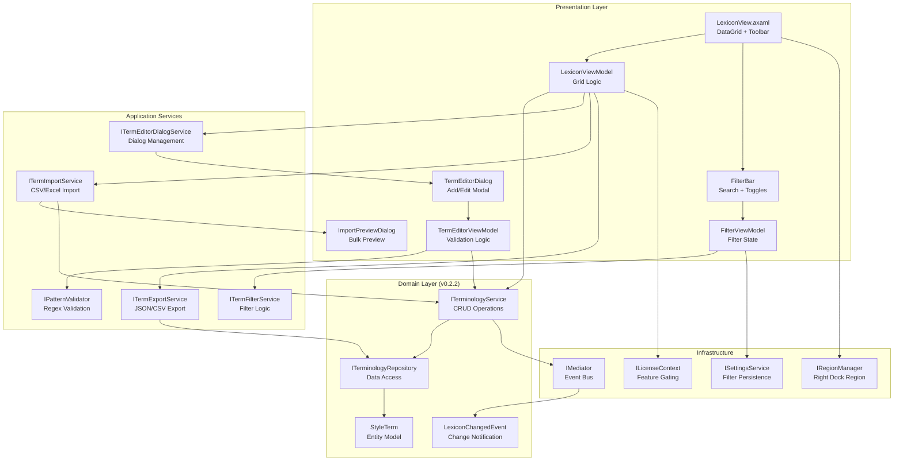
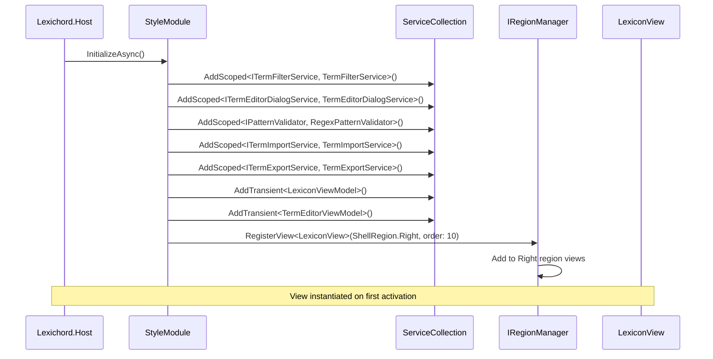

# LCS-INF-025: Feature Design Composition — The Librarian (Management UI)

## 1. Metadata & Categorization

| Field                | Value                                        | Description                                           |
| :------------------- | :------------------------------------------- | :---------------------------------------------------- |
| **Feature ID**       | `INF-025`                                    | Style Module - Terminology Management UI              |
| **Feature Name**     | The Librarian                                | GUI for managing style rules without SQL              |
| **Target Version**   | `v0.2.5`                                     | Style Governance Subsystem                            |
| **Module Scope**     | `Lexichord.Modules.Style`                    | Style governance and terminology management           |
| **Swimlane**         | `Features`                                   | Style Governance Domain                               |
| **License Tier**     | `Core` (grid view), `WriterPro` (import/export) | Tiered feature access                             |
| **Feature Gate Key** | `style.librarian.edit`, `style.librarian.import` | Runtime feature gating                          |
| **Author**           | System Architect                             |                                                       |
| **Status**           | **Draft**                                    | Pending approval                                      |
| **Last Updated**     | 2026-01-26                                   |                                                       |

---

## 2. Executive Summary

### 2.1 The Requirement

Lexichord's Style Governance module requires a **visual management interface** that:

- Displays all terminology rules in a sortable, filterable DataGrid.
- Enables real-time search across patterns, recommendations, and categories.
- Provides modal dialogs for adding and editing terms with validation.
- Supports bulk import from CSV/Excel and export to JSON for team sharing.
- Gates editing features behind WriterPro license tier.

Without this infrastructure:

- Users must write SQL or use database tools to manage terms.
- No validation prevents invalid regex patterns from entering the database.
- Team sharing requires manual database export/import procedures.
- Non-technical writers cannot customize their style guides.

### 2.2 The Proposed Solution

We **SHALL** implement a complete Terminology Management UI with:

1. **v0.2.5a: Terminology Grid View** — `LexiconView` dockable tab with Avalonia.DataGrid.
2. **v0.2.5b: Search & Filter** — Real-time filtering with toggle checkboxes.
3. **v0.2.5c: Term Editor Dialog** — Modal Add/Edit with regex validation.
4. **v0.2.5d: Bulk Import/Export** — CSV/Excel import, JSON export (WriterPro).

---

## 3. Architecture & Modular Strategy

### 3.1 High-Level Architecture



### 3.2 Module Registration



### 3.3 Dependencies

- **NuGet Packages:**

| Package                               | Version | Purpose                                  |
| :------------------------------------ | :------ | :--------------------------------------- |
| `Avalonia.Controls.DataGrid`          | 11.x    | DataGrid control for term display        |
| `CommunityToolkit.Mvvm`               | 8.x     | ObservableProperty, RelayCommand         |
| `CsvHelper`                           | 31.x    | CSV parsing for import                   |
| `ClosedXML`                           | 0.102.x | Excel file parsing for import            |
| `System.Text.Json`                    | 9.x     | JSON serialization for export            |

- **Project References:**

| Project                    | Reference Direction              |
| :------------------------- | :------------------------------- |
| `Lexichord.Modules.Style`  | -> `Lexichord.Abstractions`      |
| `Lexichord.Modules.Style`  | -> `Lexichord.Infrastructure`    |
| `Lexichord.Host`           | -> `Lexichord.Modules.Style`     |

### 3.4 Licensing Behavior

| Feature                   | Core | Writer | WriterPro |
|:--------------------------|:-----|:-------|:----------|
| View terms (read-only)    | Yes  | Yes    | Yes       |
| Search and filter         | Yes  | Yes    | Yes       |
| Add new terms             | No   | No     | Yes       |
| Edit existing terms       | No   | No     | Yes       |
| Delete terms              | No   | No     | Yes       |
| Import from CSV/Excel     | No   | No     | Yes       |
| Export to JSON/CSV        | No   | No     | Yes       |

---

## 4. Decision Tree: Librarian Operations

```text
START: "What operation is the user attempting?"
|
+-- User opens Lexicon tab
|   +-- Check: Is LexiconView registered in Right region?
|   |   +-- YES -> Activate view, load terms
|   |   +-- NO -> Log error, show empty placeholder
|   +-- Load terms from ITerminologyService.GetAllAsync()
|   +-- Apply persisted filter state
|   +-- Render DataGrid
|   +-- END
|
+-- User types in search box
|   +-- Debounce input (300ms)
|   +-- Apply filter via ITermFilterService
|   +-- Refresh DataGrid ItemsSource
|   +-- Update status bar counts
|   +-- END
|
+-- User toggles "Show Deprecated" / "Show Forbidden"
|   +-- Update filter options
|   +-- Persist to ISettingsService
|   +-- Refresh DataGrid
|   +-- END
|
+-- User clicks "Add Term"
|   +-- Check: Is user WriterPro tier?
|   |   +-- NO -> Show upgrade prompt, END
|   |   +-- YES -> Continue
|   +-- Open TermEditorDialog in Add mode
|   +-- User fills form, validates pattern
|   +-- On Save: CreateAsync via ITerminologyService
|   +-- Refresh grid on success
|   +-- END
|
+-- User double-clicks row / clicks "Edit"
|   +-- Check: Is user WriterPro tier?
|   |   +-- NO -> Show read-only dialog or upgrade prompt
|   |   +-- YES -> Continue
|   +-- Open TermEditorDialog in Edit mode with existing data
|   +-- User modifies form, validates pattern
|   +-- On Save: UpdateAsync via ITerminologyService
|   +-- Refresh grid on success
|   +-- END
|
+-- User clicks "Delete"
|   +-- Check: Is user WriterPro tier?
|   |   +-- NO -> Show upgrade prompt, END
|   |   +-- YES -> Continue
|   +-- Show confirmation dialog
|   +-- On Confirm: DeleteAsync via ITerminologyService
|   +-- Remove from grid
|   +-- END
|
+-- User clicks "Import"
|   +-- Check: Is user WriterPro tier?
|   |   +-- NO -> Show upgrade prompt, END
|   |   +-- YES -> Continue
|   +-- Show file picker (CSV/Excel)
|   +-- Parse file, show preview dialog
|   +-- User selects conflict resolution
|   +-- On Confirm: Bulk insert via ITermImportService
|   +-- Refresh grid
|   +-- END
|
+-- User clicks "Export"
|   +-- Check: Is user WriterPro tier?
|   |   +-- NO -> Show upgrade prompt, END
|   |   +-- YES -> Continue
|   +-- Show format selection (JSON/CSV)
|   +-- Show save file dialog
|   +-- Export via ITermExportService
|   +-- Show success notification
|   +-- END
```

---

## 5. Data Contracts

### 5.1 View Models (Lexichord.Modules.Style)

```csharp
namespace Lexichord.Modules.Style.ViewModels;

using System.Collections.ObjectModel;
using CommunityToolkit.Mvvm.ComponentModel;
using CommunityToolkit.Mvvm.Input;
using Lexichord.Modules.Style.Entities;

/// <summary>
/// ViewModel for the Lexicon management view (Terminology Grid).
/// </summary>
/// <remarks>
/// LOGIC: LexiconViewModel coordinates the DataGrid display, filtering,
/// and command execution for terminology management. It observes
/// LexiconChangedEvent to refresh when external changes occur.
///
/// License Gating:
/// - Read operations available to all tiers
/// - Write operations (Add, Edit, Delete) require WriterPro
/// - Import/Export operations require WriterPro
/// </remarks>
public partial class LexiconViewModel : ObservableObject, IDisposable
{
    private readonly ITerminologyService _terminologyService;
    private readonly ITermFilterService _filterService;
    private readonly ITermEditorDialogService _dialogService;
    private readonly ITermImportService _importService;
    private readonly ITermExportService _exportService;
    private readonly ILicenseContext _licenseContext;
    private readonly ISettingsService _settingsService;
    private readonly ILogger<LexiconViewModel> _logger;

    /// <summary>
    /// All terms loaded from the database.
    /// </summary>
    /// <remarks>
    /// LOGIC: This is the unfiltered source collection. FilteredTerms
    /// is derived from this based on current filter options.
    /// </remarks>
    [ObservableProperty]
    private ObservableCollection<StyleTermRowViewModel> _allTerms = new();

    /// <summary>
    /// Terms after applying current filter criteria.
    /// </summary>
    /// <remarks>
    /// LOGIC: Bound to DataGrid.ItemsSource. Updated whenever
    /// filter options change or AllTerms is modified.
    /// </remarks>
    [ObservableProperty]
    private ObservableCollection<StyleTermRowViewModel> _filteredTerms = new();

    /// <summary>
    /// Currently selected term in the DataGrid.
    /// </summary>
    [ObservableProperty]
    private StyleTermRowViewModel? _selectedTerm;

    /// <summary>
    /// Current filter options.
    /// </summary>
    [ObservableProperty]
    private TermFilterOptions _filterOptions = new();

    /// <summary>
    /// Total number of terms in database.
    /// </summary>
    [ObservableProperty]
    private int _totalCount;

    /// <summary>
    /// Number of terms after filtering.
    /// </summary>
    [ObservableProperty]
    private int _filteredCount;

    /// <summary>
    /// Whether the user can perform edit operations.
    /// </summary>
    /// <remarks>
    /// LOGIC: Returns true only for WriterPro tier users.
    /// </remarks>
    public bool CanEdit => _licenseContext.GetCurrentTier() >= LicenseTier.WriterPro;

    /// <summary>
    /// Loads all terms from the database.
    /// </summary>
    [RelayCommand]
    public async Task LoadTermsAsync(CancellationToken ct = default)
    {
        _logger.LogDebug("Loading terms from database");

        var terms = await _terminologyService.GetAllAsync(ct);
        var rowViewModels = terms.Select(t => new StyleTermRowViewModel(t)).ToList();

        AllTerms = new ObservableCollection<StyleTermRowViewModel>(rowViewModels);
        TotalCount = AllTerms.Count;

        ApplyFilter();

        _logger.LogInformation("Loaded {Count} terms", TotalCount);
    }

    /// <summary>
    /// Opens the Add Term dialog.
    /// </summary>
    [RelayCommand(CanExecute = nameof(CanEdit))]
    public async Task AddTermAsync(CancellationToken ct = default)
    {
        _logger.LogDebug("Opening Add Term dialog");

        var newTerm = await _dialogService.ShowAddDialogAsync(ct);
        if (newTerm is not null)
        {
            AllTerms.Add(new StyleTermRowViewModel(newTerm));
            TotalCount = AllTerms.Count;
            ApplyFilter();
        }
    }

    /// <summary>
    /// Opens the Edit Term dialog for the selected term.
    /// </summary>
    [RelayCommand(CanExecute = nameof(CanEditSelectedTerm))]
    public async Task EditTermAsync(CancellationToken ct = default)
    {
        if (SelectedTerm is null) return;

        _logger.LogDebug("Opening Edit Term dialog for {Id}", SelectedTerm.Id);

        var updatedTerm = await _dialogService.ShowEditDialogAsync(SelectedTerm.ToEntity(), ct);
        if (updatedTerm is not null)
        {
            SelectedTerm.UpdateFrom(updatedTerm);
            ApplyFilter();
        }
    }

    /// <summary>
    /// Deletes the selected term after confirmation.
    /// </summary>
    [RelayCommand(CanExecute = nameof(CanEditSelectedTerm))]
    public async Task DeleteTermAsync(CancellationToken ct = default)
    {
        if (SelectedTerm is null) return;

        // LOGIC: Confirmation handled by caller or dialog service
        var result = await _terminologyService.DeleteAsync(SelectedTerm.Id, ct);
        if (result.IsSuccess)
        {
            AllTerms.Remove(SelectedTerm);
            TotalCount = AllTerms.Count;
            ApplyFilter();
            _logger.LogInformation("Deleted term {Id}", SelectedTerm.Id);
        }
    }

    /// <summary>
    /// Opens the Import dialog.
    /// </summary>
    [RelayCommand(CanExecute = nameof(CanEdit))]
    public async Task ImportAsync(CancellationToken ct = default)
    {
        var result = await _importService.ShowImportDialogAsync(ct);
        if (result.ImportedCount > 0)
        {
            await LoadTermsAsync(ct);
            _logger.LogInformation("Imported {Count} terms", result.ImportedCount);
        }
    }

    /// <summary>
    /// Opens the Export dialog.
    /// </summary>
    [RelayCommand(CanExecute = nameof(CanEdit))]
    public async Task ExportAsync(CancellationToken ct = default)
    {
        await _exportService.ShowExportDialogAsync(ct);
    }

    /// <summary>
    /// Applies current filter options to the terms collection.
    /// </summary>
    private void ApplyFilter()
    {
        var filtered = _filterService.ApplyFilters(
            AllTerms.Select(r => r.ToEntity()),
            FilterOptions);

        FilteredTerms = new ObservableCollection<StyleTermRowViewModel>(
            filtered.Select(t => AllTerms.First(r => r.Id == t.Id)));

        FilteredCount = FilteredTerms.Count;

        _logger.LogDebug("Filter applied: {Filtered}/{Total} terms shown",
            FilteredCount, TotalCount);
    }

    private bool CanEditSelectedTerm() => CanEdit && SelectedTerm is not null;

    partial void OnFilterOptionsChanged(TermFilterOptions value)
    {
        ApplyFilter();
        _settingsService.SetAsync("Lexicon.FilterOptions", value);
    }

    public void Dispose()
    {
        // LOGIC: Unsubscribe from events
    }
}

/// <summary>
/// Row ViewModel for a single StyleTerm in the DataGrid.
/// </summary>
/// <remarks>
/// LOGIC: Wraps StyleTerm entity with observable properties for binding.
/// Provides display formatting (e.g., truncated recommendation).
/// </remarks>
public partial class StyleTermRowViewModel : ObservableObject
{
    /// <summary>
    /// Unique identifier.
    /// </summary>
    public Guid Id { get; }

    /// <summary>
    /// The pattern to match.
    /// </summary>
    [ObservableProperty]
    private string _pattern = string.Empty;

    /// <summary>
    /// The recommendation text.
    /// </summary>
    [ObservableProperty]
    private string _recommendation = string.Empty;

    /// <summary>
    /// Truncated recommendation for grid display.
    /// </summary>
    /// <remarks>
    /// LOGIC: Limit to 50 characters with ellipsis for readability.
    /// </remarks>
    public string RecommendationTruncated =>
        Recommendation.Length > 50
            ? Recommendation[..47] + "..."
            : Recommendation;

    /// <summary>
    /// The term category.
    /// </summary>
    [ObservableProperty]
    private string _category = string.Empty;

    /// <summary>
    /// The severity level.
    /// </summary>
    [ObservableProperty]
    private string _severity = StyleTermSeverity.Suggestion;

    /// <summary>
    /// Whether the term is active.
    /// </summary>
    [ObservableProperty]
    private bool _isActive = true;

    /// <summary>
    /// Whether pattern matching is case-sensitive.
    /// </summary>
    [ObservableProperty]
    private bool _matchCase;

    public StyleTermRowViewModel(StyleTerm entity)
    {
        Id = entity.Id;
        UpdateFrom(entity);
    }

    /// <summary>
    /// Updates properties from an entity.
    /// </summary>
    public void UpdateFrom(StyleTerm entity)
    {
        Pattern = entity.TermPattern;
        Recommendation = entity.Recommendation;
        Category = entity.Category;
        Severity = entity.Severity;
        IsActive = entity.IsActive;
        MatchCase = entity.MatchCase;
    }

    /// <summary>
    /// Converts back to entity.
    /// </summary>
    public StyleTerm ToEntity() => new()
    {
        Id = Id,
        TermPattern = Pattern,
        Recommendation = Recommendation,
        Category = Category,
        Severity = Severity,
        IsActive = IsActive,
        MatchCase = MatchCase
    };
}
```

### 5.2 Filter Service Contracts

```csharp
namespace Lexichord.Modules.Style.Services;

/// <summary>
/// Service for filtering terminology terms.
/// </summary>
/// <remarks>
/// LOGIC: ITermFilterService applies search and toggle filters to a
/// collection of StyleTerms. Used by LexiconViewModel to implement
/// DataGrid filtering without direct ICollectionView manipulation.
/// </remarks>
public interface ITermFilterService
{
    /// <summary>
    /// Applies filter options to a collection of terms.
    /// </summary>
    /// <param name="terms">Source terms to filter.</param>
    /// <param name="options">Filter criteria.</param>
    /// <returns>Filtered terms.</returns>
    /// <remarks>
    /// LOGIC: Filter is applied in order:
    /// 1. Search text (case-insensitive substring match)
    /// 2. ShowDeprecated toggle (is_active filter)
    /// 3. ShowForbidden toggle (severity = 'error' filter)
    /// 4. Category filter (exact match)
    /// 5. Severity filter (exact match)
    /// </remarks>
    IEnumerable<StyleTerm> ApplyFilters(
        IEnumerable<StyleTerm> terms,
        TermFilterOptions options);

    /// <summary>
    /// Gets distinct categories from a term collection.
    /// </summary>
    IReadOnlyList<string> GetDistinctCategories(IEnumerable<StyleTerm> terms);

    /// <summary>
    /// Gets distinct severities from a term collection.
    /// </summary>
    IReadOnlyList<string> GetDistinctSeverities(IEnumerable<StyleTerm> terms);
}

/// <summary>
/// Options for filtering terms.
/// </summary>
/// <remarks>
/// LOGIC: Serializable record for persistence via ISettingsService.
/// Default values show active terms of all severities.
/// </remarks>
public sealed record TermFilterOptions
{
    /// <summary>
    /// Search text for pattern, recommendation, and category matching.
    /// </summary>
    /// <remarks>
    /// LOGIC: Case-insensitive substring match. Empty string matches all.
    /// </remarks>
    public string SearchText { get; init; } = string.Empty;

    /// <summary>
    /// Whether to show inactive (deprecated) terms.
    /// </summary>
    /// <remarks>
    /// LOGIC: Default false - hide deprecated terms for cleaner view.
    /// </remarks>
    public bool ShowDeprecated { get; init; } = false;

    /// <summary>
    /// Whether to show error-severity (forbidden) terms.
    /// </summary>
    /// <remarks>
    /// LOGIC: Default true - show all severities including errors.
    /// Toggle allows hiding "hard" rules to focus on suggestions.
    /// </remarks>
    public bool ShowForbidden { get; init; } = true;

    /// <summary>
    /// Filter to specific category. Null or empty shows all.
    /// </summary>
    public string? CategoryFilter { get; init; }

    /// <summary>
    /// Filter to specific severity. Null or empty shows all.
    /// </summary>
    public string? SeverityFilter { get; init; }
}
```

### 5.3 Dialog Service Contracts

```csharp
namespace Lexichord.Modules.Style.Services;

/// <summary>
/// Service for managing the Term Editor dialog.
/// </summary>
/// <remarks>
/// LOGIC: Abstracts dialog presentation from ViewModel logic.
/// Enables testability by mocking dialog interactions.
/// </remarks>
public interface ITermEditorDialogService
{
    /// <summary>
    /// Shows the Add Term dialog.
    /// </summary>
    /// <param name="ct">Cancellation token.</param>
    /// <returns>The created term, or null if cancelled.</returns>
    /// <remarks>
    /// LOGIC: Opens modal dialog with empty form.
    /// On Save: Creates term via ITerminologyService.
    /// Returns the created StyleTerm on success.
    /// </remarks>
    Task<StyleTerm?> ShowAddDialogAsync(CancellationToken ct = default);

    /// <summary>
    /// Shows the Edit Term dialog for an existing term.
    /// </summary>
    /// <param name="existing">The term to edit.</param>
    /// <param name="ct">Cancellation token.</param>
    /// <returns>The updated term, or null if cancelled.</returns>
    /// <remarks>
    /// LOGIC: Opens modal dialog pre-populated with term data.
    /// On Save: Updates term via ITerminologyService.
    /// Returns the updated StyleTerm on success.
    /// </remarks>
    Task<StyleTerm?> ShowEditDialogAsync(StyleTerm existing, CancellationToken ct = default);

    /// <summary>
    /// Shows a confirmation dialog for deletion.
    /// </summary>
    /// <param name="term">The term to delete.</param>
    /// <param name="ct">Cancellation token.</param>
    /// <returns>True if user confirmed deletion.</returns>
    Task<bool> ShowDeleteConfirmationAsync(StyleTerm term, CancellationToken ct = default);
}
```

### 5.4 Pattern Validation Contracts

```csharp
namespace Lexichord.Modules.Style.Services;

/// <summary>
/// Service for validating regex patterns.
/// </summary>
/// <remarks>
/// LOGIC: IPatternValidator provides real-time validation feedback
/// for pattern input in the Term Editor dialog. It checks:
/// 1. Syntax validity (can the pattern compile?)
/// 2. Complexity (will the pattern timeout on large text?)
/// 3. Safety (does the pattern contain dangerous constructs?)
/// </remarks>
public interface IPatternValidator
{
    /// <summary>
    /// Validates a regex pattern.
    /// </summary>
    /// <param name="pattern">The pattern to validate.</param>
    /// <returns>Validation result with error details.</returns>
    /// <remarks>
    /// LOGIC: Performs synchronous validation with timeout protection.
    /// Uses Regex constructor with timeout option.
    /// </remarks>
    PatternValidationResult Validate(string pattern);

    /// <summary>
    /// Tests a pattern against sample text.
    /// </summary>
    /// <param name="pattern">The pattern to test.</param>
    /// <param name="sampleText">Text to match against.</param>
    /// <param name="matchCase">Whether matching is case-sensitive.</param>
    /// <returns>Test result with matches found.</returns>
    /// <remarks>
    /// LOGIC: Runs the pattern against sample text with timeout.
    /// Returns all matches with their positions for highlighting.
    /// </remarks>
    PatternTestResult TestPattern(string pattern, string sampleText, bool matchCase = false);
}

/// <summary>
/// Result of pattern validation.
/// </summary>
/// <param name="IsValid">Whether the pattern is valid.</param>
/// <param name="ErrorMessage">Error description if invalid.</param>
/// <param name="ErrorPosition">Character position of error (if applicable).</param>
/// <param name="Warnings">Non-fatal warnings about the pattern.</param>
public sealed record PatternValidationResult(
    bool IsValid,
    string? ErrorMessage = null,
    int? ErrorPosition = null,
    IReadOnlyList<string>? Warnings = null
)
{
    /// <summary>
    /// Creates a success result.
    /// </summary>
    public static PatternValidationResult Success(IReadOnlyList<string>? warnings = null) =>
        new(true, Warnings: warnings);

    /// <summary>
    /// Creates a failure result.
    /// </summary>
    public static PatternValidationResult Failure(string error, int? position = null) =>
        new(false, error, position);
}

/// <summary>
/// Result of pattern testing against sample text.
/// </summary>
/// <param name="HasMatch">Whether any matches were found.</param>
/// <param name="Matches">List of matches with positions.</param>
/// <param name="ExecutionTimeMs">Time taken for matching.</param>
/// <param name="TimedOut">Whether matching timed out.</param>
public sealed record PatternTestResult(
    bool HasMatch,
    IReadOnlyList<PatternMatch> Matches,
    double ExecutionTimeMs,
    bool TimedOut = false
);

/// <summary>
/// A single match from pattern testing.
/// </summary>
/// <param name="Start">Start offset in sample text.</param>
/// <param name="Length">Length of matched text.</param>
/// <param name="MatchedText">The actual matched text.</param>
public sealed record PatternMatch(int Start, int Length, string MatchedText);
```

---

## 6. Implementation Logic

### 6.1 Service Registration

```csharp
namespace Lexichord.Modules.Style;

using Microsoft.Extensions.DependencyInjection;
using Lexichord.Modules.Style.Services;
using Lexichord.Modules.Style.ViewModels;

/// <summary>
/// Extension methods for registering Librarian services.
/// </summary>
public static class LibrarianServiceExtensions
{
    /// <summary>
    /// Adds Librarian (Terminology Management UI) services to the DI container.
    /// </summary>
    /// <param name="services">The service collection.</param>
    /// <returns>The service collection for chaining.</returns>
    public static IServiceCollection AddLibrarianServices(
        this IServiceCollection services)
    {
        // LOGIC: Register filter service as singleton - stateless
        services.AddSingleton<ITermFilterService, TermFilterService>();

        // LOGIC: Register validator as singleton - stateless
        services.AddSingleton<IPatternValidator, RegexPatternValidator>();

        // LOGIC: Register dialog service as scoped - needs DI resolution
        services.AddScoped<ITermEditorDialogService, TermEditorDialogService>();

        // LOGIC: Register import/export services as scoped
        services.AddScoped<ITermImportService, TermImportService>();
        services.AddScoped<ITermExportService, TermExportService>();

        // LOGIC: Register ViewModels as transient - new instance per view
        services.AddTransient<LexiconViewModel>();
        services.AddTransient<TermEditorViewModel>();

        return services;
    }
}
```

### 6.2 Filter Service Implementation

```csharp
namespace Lexichord.Modules.Style.Services;

using Microsoft.Extensions.Logging;

/// <summary>
/// Implementation of ITermFilterService.
/// </summary>
/// <remarks>
/// LOGIC: Applies filters in a specific order for predictable results.
/// Each filter is applied independently, narrowing the result set.
/// </remarks>
public sealed class TermFilterService(
    ILogger<TermFilterService> logger) : ITermFilterService
{
    /// <inheritdoc/>
    public IEnumerable<StyleTerm> ApplyFilters(
        IEnumerable<StyleTerm> terms,
        TermFilterOptions options)
    {
        var result = terms;

        // LOGIC: Filter 1 - Search text (pattern OR recommendation OR category)
        if (!string.IsNullOrWhiteSpace(options.SearchText))
        {
            var search = options.SearchText.Trim();
            result = result.Where(t =>
                t.TermPattern.Contains(search, StringComparison.OrdinalIgnoreCase) ||
                t.Recommendation.Contains(search, StringComparison.OrdinalIgnoreCase) ||
                t.Category.Contains(search, StringComparison.OrdinalIgnoreCase));
        }

        // LOGIC: Filter 2 - Show Deprecated toggle
        if (!options.ShowDeprecated)
        {
            result = result.Where(t => t.IsActive);
        }

        // LOGIC: Filter 3 - Show Forbidden toggle (error severity)
        if (!options.ShowForbidden)
        {
            result = result.Where(t => t.Severity != StyleTermSeverity.Error);
        }

        // LOGIC: Filter 4 - Category exact match
        if (!string.IsNullOrEmpty(options.CategoryFilter))
        {
            result = result.Where(t =>
                t.Category.Equals(options.CategoryFilter, StringComparison.OrdinalIgnoreCase));
        }

        // LOGIC: Filter 5 - Severity exact match
        if (!string.IsNullOrEmpty(options.SeverityFilter))
        {
            result = result.Where(t =>
                t.Severity.Equals(options.SeverityFilter, StringComparison.OrdinalIgnoreCase));
        }

        var filtered = result.ToList();
        logger.LogDebug("Applied filters: {Options}, Result: {Count} terms",
            options, filtered.Count);

        return filtered;
    }

    /// <inheritdoc/>
    public IReadOnlyList<string> GetDistinctCategories(IEnumerable<StyleTerm> terms) =>
        terms.Select(t => t.Category).Distinct().OrderBy(c => c).ToList();

    /// <inheritdoc/>
    public IReadOnlyList<string> GetDistinctSeverities(IEnumerable<StyleTerm> terms) =>
        terms.Select(t => t.Severity).Distinct().OrderBy(s => s).ToList();
}
```

### 6.3 Pattern Validator Implementation

```csharp
namespace Lexichord.Modules.Style.Services;

using System.Text.RegularExpressions;
using Microsoft.Extensions.Logging;

/// <summary>
/// Regex-based implementation of IPatternValidator.
/// </summary>
/// <remarks>
/// LOGIC: Uses .NET Regex with timeout to validate patterns safely.
/// Catches RegexParseException for syntax errors and
/// RegexMatchTimeoutException for complexity issues.
/// </remarks>
public sealed class RegexPatternValidator(
    ILogger<RegexPatternValidator> logger) : IPatternValidator
{
    /// <summary>
    /// Maximum pattern length allowed.
    /// </summary>
    private const int MaxPatternLength = 500;

    /// <summary>
    /// Timeout for pattern compilation (milliseconds).
    /// </summary>
    private const int CompileTimeoutMs = 100;

    /// <summary>
    /// Timeout for pattern matching (milliseconds).
    /// </summary>
    private const int MatchTimeoutMs = 500;

    /// <inheritdoc/>
    public PatternValidationResult Validate(string pattern)
    {
        // LOGIC: Check for empty pattern
        if (string.IsNullOrWhiteSpace(pattern))
        {
            return PatternValidationResult.Failure("Pattern cannot be empty");
        }

        // LOGIC: Check pattern length
        if (pattern.Length > MaxPatternLength)
        {
            return PatternValidationResult.Failure(
                $"Pattern exceeds maximum length of {MaxPatternLength} characters");
        }

        // LOGIC: Attempt to compile the regex
        try
        {
            _ = new Regex(pattern, RegexOptions.None, TimeSpan.FromMilliseconds(CompileTimeoutMs));

            var warnings = new List<string>();

            // LOGIC: Check for potentially slow patterns
            if (pattern.Contains(".*.*") || pattern.Contains(".+.+"))
            {
                warnings.Add("Pattern contains nested quantifiers which may be slow");
            }

            if (Regex.IsMatch(pattern, @"\(\?[<']"))
            {
                warnings.Add("Pattern uses named capture groups");
            }

            logger.LogDebug("Pattern validated successfully: {Pattern}", pattern);
            return PatternValidationResult.Success(warnings.Count > 0 ? warnings : null);
        }
        catch (RegexParseException ex)
        {
            logger.LogDebug("Pattern validation failed: {Pattern}, Error: {Error}",
                pattern, ex.Message);

            return PatternValidationResult.Failure(
                $"Invalid regex: {ex.Message}",
                ex.Offset);
        }
        catch (ArgumentException ex)
        {
            return PatternValidationResult.Failure($"Invalid pattern: {ex.Message}");
        }
    }

    /// <inheritdoc/>
    public PatternTestResult TestPattern(string pattern, string sampleText, bool matchCase = false)
    {
        if (string.IsNullOrWhiteSpace(sampleText))
        {
            return new PatternTestResult(false, Array.Empty<PatternMatch>(), 0);
        }

        var options = matchCase ? RegexOptions.None : RegexOptions.IgnoreCase;
        var sw = System.Diagnostics.Stopwatch.StartNew();

        try
        {
            var regex = new Regex(pattern, options, TimeSpan.FromMilliseconds(MatchTimeoutMs));
            var matches = regex.Matches(sampleText);

            sw.Stop();

            var patternMatches = matches
                .Cast<Match>()
                .Select(m => new PatternMatch(m.Index, m.Length, m.Value))
                .ToList();

            logger.LogDebug("Pattern test: {Pattern} on '{Sample}' found {Count} matches in {Time}ms",
                pattern, sampleText.Length > 50 ? sampleText[..50] + "..." : sampleText,
                patternMatches.Count, sw.ElapsedMilliseconds);

            return new PatternTestResult(
                patternMatches.Count > 0,
                patternMatches,
                sw.Elapsed.TotalMilliseconds);
        }
        catch (RegexMatchTimeoutException)
        {
            sw.Stop();
            logger.LogWarning("Pattern test timed out: {Pattern}", pattern);
            return new PatternTestResult(false, Array.Empty<PatternMatch>(), sw.Elapsed.TotalMilliseconds, true);
        }
    }
}
```

---

## 7. Use Cases & User Stories

### 7.1 User Stories

| ID    | Role      | Story                                                                                     | Acceptance Criteria                                |
| :---- | :-------- | :---------------------------------------------------------------------------------------- | :------------------------------------------------- |
| US-01 | Writer    | As a writer, I want to see all style terms in a grid so I can browse available rules.     | DataGrid shows all terms with sorting.             |
| US-02 | Writer    | As a writer, I want to search terms so I can find specific rules quickly.                 | Search filters grid in real-time.                  |
| US-03 | Writer    | As a writer, I want to hide deprecated terms so I see only active rules.                  | Toggle hides inactive terms.                       |
| US-04 | Editor    | As an editor, I want to add custom terms so I can enforce house style.                    | Add dialog creates valid terms.                    |
| US-05 | Editor    | As an editor, I want validation feedback so I don't save invalid patterns.                | Invalid regex shows error message.                 |
| US-06 | Editor    | As an editor, I want to test patterns so I can verify they work correctly.                | Test field shows matches in sample text.           |
| US-07 | Team Lead | As a team lead, I want to export terms so I can share them with my team.                  | JSON export contains all terms.                    |
| US-08 | Team Lead | As a team lead, I want to import terms so I can distribute organizational style guides.   | CSV import adds terms in bulk.                     |

### 7.2 Use Cases

#### UC-01: Browse and Filter Terms

**Preconditions:**
- User has Lexichord open with WriterPro or higher tier.
- Terminology database contains 100+ terms.

**Flow:**
1. User clicks "Lexicon" tab in Right dock region.
2. DataGrid loads and displays all 127 terms.
3. User clicks "Severity" column header.
4. Grid sorts by severity (error first, then warning, suggestion, info).
5. User types "click" in search box.
6. Grid filters to show only 5 terms containing "click".
7. User toggles off "Show Deprecated".
8. Grid hides 1 inactive term, showing 4 terms.
9. Status bar updates: "4 of 127 terms".

**Postconditions:**
- User sees filtered, sorted view of terms.
- Filter state persisted for next session.

---

#### UC-02: Add New Term with Validation

**Preconditions:**
- User has WriterPro tier.
- Lexicon view is open.

**Flow:**
1. User clicks "Add Term" button.
2. Term Editor dialog opens with empty fields.
3. User enters pattern: `click[on` (invalid regex).
4. Error message appears: "Invalid regex: unterminated character class".
5. Save button remains disabled.
6. User corrects pattern to: `click\s+on`.
7. Error clears, Save button enables.
8. User enters recommendation: "Use 'select' instead".
9. User selects category: "Terminology".
10. User clicks Save.
11. Dialog closes, grid refreshes with new term.

**Postconditions:**
- New term saved to database.
- LexiconChangedEvent published.
- Grid shows new term.

---

#### UC-03: Bulk Import from CSV

**Preconditions:**
- User has WriterPro tier.
- User has CSV file with 50 terms.
- 3 terms already exist in database (duplicates).

**Flow:**
1. User clicks "Import" dropdown, selects "CSV".
2. File picker opens, user selects "house-style.csv".
3. Import Preview dialog opens.
4. Preview shows first 10 rows from file.
5. 3 rows marked as "duplicate" (highlighted yellow).
6. User selects "Skip duplicates" option.
7. Status shows: "50 terms, 3 duplicates, 0 invalid".
8. User clicks "Import 47 Terms".
9. Progress bar shows import progress.
10. Success message: "Imported 47 terms".
11. Grid refreshes with all terms.

**Postconditions:**
- 47 new terms in database.
- 3 duplicates skipped.
- LexiconChangedEvent published with BulkImport type.

---

## 8. Observability & Logging

### 8.1 Log Events

| Level       | Source                | Message Template                                                           |
| :---------- | :-------------------- | :------------------------------------------------------------------------- |
| Information | LexiconViewModel      | `Loaded {Count} terms`                                                     |
| Debug       | LexiconViewModel      | `Loading terms from database`                                              |
| Debug       | LexiconViewModel      | `Filter applied: {Filtered}/{Total} terms shown`                           |
| Information | LexiconViewModel      | `Deleted term {Id}`                                                        |
| Debug       | TermFilterService     | `Applied filters: {Options}, Result: {Count} terms`                        |
| Debug       | RegexPatternValidator | `Pattern validated successfully: {Pattern}`                                |
| Debug       | RegexPatternValidator | `Pattern validation failed: {Pattern}, Error: {Error}`                     |
| Warning     | RegexPatternValidator | `Pattern test timed out: {Pattern}`                                        |
| Information | TermImportService     | `Importing {Count} terms from {Format} file`                               |
| Information | TermImportService     | `Import completed: {Imported} imported, {Skipped} skipped, {Errors} errors`|
| Information | TermExportService     | `Exported {Count} terms to {Format} file`                                  |
| Error       | TermEditorDialog      | `Failed to save term: {Error}`                                             |

### 8.2 Metrics (Future)

| Metric Name                        | Type      | Description                                |
| :--------------------------------- | :-------- | :----------------------------------------- |
| `librarian_view_opens_total`       | Counter   | Number of times Lexicon view opened        |
| `librarian_terms_loaded`           | Gauge     | Terms loaded in current session            |
| `librarian_filter_operations`      | Counter   | Number of filter operations                |
| `librarian_term_edits_total`       | Counter   | Number of term edit operations             |
| `librarian_imports_total`          | Counter   | Number of import operations                |
| `librarian_exports_total`          | Counter   | Number of export operations                |
| `librarian_validation_failures`    | Counter   | Number of pattern validation failures      |

---

## 9. Unit Testing Requirements

### 9.1 Filter Service Tests

```csharp
[TestFixture]
[Category("Unit")]
public class TermFilterServiceTests
{
    private Mock<ILogger<TermFilterService>> _mockLogger = null!;
    private TermFilterService _sut = null!;

    [SetUp]
    public void SetUp()
    {
        _mockLogger = new Mock<ILogger<TermFilterService>>();
        _sut = new TermFilterService(_mockLogger.Object);
    }

    [Test]
    public void ApplyFilters_WithEmptyOptions_ReturnsAllTerms()
    {
        // Arrange
        var terms = CreateTestTerms(10);
        var options = new TermFilterOptions();

        // Act
        var result = _sut.ApplyFilters(terms, options).ToList();

        // Assert
        Assert.That(result, Has.Count.EqualTo(10));
    }

    [Test]
    public void ApplyFilters_WithSearchText_FiltersByPatternOrRecommendation()
    {
        // Arrange
        var terms = new[]
        {
            CreateTerm("click on", "Use select", "Terminology"),
            CreateTerm("utilize", "Use 'use'", "Clarity"),
            CreateTerm("e-mail", "Use email", "Terminology")
        };
        var options = new TermFilterOptions { SearchText = "click" };

        // Act
        var result = _sut.ApplyFilters(terms, options).ToList();

        // Assert
        Assert.That(result, Has.Count.EqualTo(1));
        Assert.That(result[0].TermPattern, Is.EqualTo("click on"));
    }

    [Test]
    public void ApplyFilters_WithShowDeprecatedFalse_HidesInactiveTerms()
    {
        // Arrange
        var terms = new[]
        {
            CreateTerm("active1", isActive: true),
            CreateTerm("inactive", isActive: false),
            CreateTerm("active2", isActive: true)
        };
        var options = new TermFilterOptions { ShowDeprecated = false };

        // Act
        var result = _sut.ApplyFilters(terms, options).ToList();

        // Assert
        Assert.That(result, Has.Count.EqualTo(2));
        Assert.That(result.All(t => t.IsActive), Is.True);
    }

    [Test]
    public void ApplyFilters_WithShowForbiddenFalse_HidesErrorSeverity()
    {
        // Arrange
        var terms = new[]
        {
            CreateTerm("term1", severity: StyleTermSeverity.Error),
            CreateTerm("term2", severity: StyleTermSeverity.Warning),
            CreateTerm("term3", severity: StyleTermSeverity.Suggestion)
        };
        var options = new TermFilterOptions { ShowForbidden = false };

        // Act
        var result = _sut.ApplyFilters(terms, options).ToList();

        // Assert
        Assert.That(result, Has.Count.EqualTo(2));
        Assert.That(result.All(t => t.Severity != StyleTermSeverity.Error), Is.True);
    }

    [Test]
    public void ApplyFilters_WithCategoryFilter_FiltersByExactCategory()
    {
        // Arrange
        var terms = new[]
        {
            CreateTerm("t1", category: "Terminology"),
            CreateTerm("t2", category: "Clarity"),
            CreateTerm("t3", category: "Terminology")
        };
        var options = new TermFilterOptions { CategoryFilter = "Terminology" };

        // Act
        var result = _sut.ApplyFilters(terms, options).ToList();

        // Assert
        Assert.That(result, Has.Count.EqualTo(2));
        Assert.That(result.All(t => t.Category == "Terminology"), Is.True);
    }

    [Test]
    public void ApplyFilters_WithMultipleFilters_AppliesAllInOrder()
    {
        // Arrange
        var terms = new[]
        {
            CreateTerm("click on", category: "Terminology", severity: StyleTermSeverity.Warning, isActive: true),
            CreateTerm("click here", category: "Terminology", severity: StyleTermSeverity.Error, isActive: true),
            CreateTerm("click away", category: "Clarity", severity: StyleTermSeverity.Warning, isActive: false),
            CreateTerm("tap on", category: "Terminology", severity: StyleTermSeverity.Warning, isActive: true)
        };
        var options = new TermFilterOptions
        {
            SearchText = "click",
            CategoryFilter = "Terminology",
            ShowDeprecated = false,
            ShowForbidden = false
        };

        // Act
        var result = _sut.ApplyFilters(terms, options).ToList();

        // Assert
        Assert.That(result, Has.Count.EqualTo(1));
        Assert.That(result[0].TermPattern, Is.EqualTo("click on"));
    }

    private static StyleTerm CreateTerm(
        string pattern = "test",
        string recommendation = "Test recommendation",
        string category = "Terminology",
        string severity = StyleTermSeverity.Suggestion,
        bool isActive = true) => new()
    {
        TermPattern = pattern,
        Recommendation = recommendation,
        Category = category,
        Severity = severity,
        IsActive = isActive
    };

    private static IEnumerable<StyleTerm> CreateTestTerms(int count) =>
        Enumerable.Range(1, count).Select(i => CreateTerm($"term{i}"));
}
```

### 9.2 Pattern Validator Tests

```csharp
[TestFixture]
[Category("Unit")]
public class RegexPatternValidatorTests
{
    private Mock<ILogger<RegexPatternValidator>> _mockLogger = null!;
    private RegexPatternValidator _sut = null!;

    [SetUp]
    public void SetUp()
    {
        _mockLogger = new Mock<ILogger<RegexPatternValidator>>();
        _sut = new RegexPatternValidator(_mockLogger.Object);
    }

    [Test]
    public void Validate_WithValidSimplePattern_ReturnsSuccess()
    {
        // Arrange
        var pattern = "click on";

        // Act
        var result = _sut.Validate(pattern);

        // Assert
        Assert.That(result.IsValid, Is.True);
        Assert.That(result.ErrorMessage, Is.Null);
    }

    [Test]
    public void Validate_WithValidRegexPattern_ReturnsSuccess()
    {
        // Arrange
        var pattern = @"\bclick\s+on\b";

        // Act
        var result = _sut.Validate(pattern);

        // Assert
        Assert.That(result.IsValid, Is.True);
    }

    [Test]
    public void Validate_WithInvalidRegex_ReturnsFailureWithMessage()
    {
        // Arrange
        var pattern = "click[on";

        // Act
        var result = _sut.Validate(pattern);

        // Assert
        Assert.That(result.IsValid, Is.False);
        Assert.That(result.ErrorMessage, Does.Contain("Invalid regex"));
    }

    [Test]
    public void Validate_WithEmptyPattern_ReturnsFailure()
    {
        // Arrange
        var pattern = "";

        // Act
        var result = _sut.Validate(pattern);

        // Assert
        Assert.That(result.IsValid, Is.False);
        Assert.That(result.ErrorMessage, Does.Contain("empty"));
    }

    [Test]
    public void Validate_WithTooLongPattern_ReturnsFailure()
    {
        // Arrange
        var pattern = new string('a', 501);

        // Act
        var result = _sut.Validate(pattern);

        // Assert
        Assert.That(result.IsValid, Is.False);
        Assert.That(result.ErrorMessage, Does.Contain("maximum length"));
    }

    [Test]
    public void Validate_WithPotentiallySlowPattern_ReturnsWarning()
    {
        // Arrange
        var pattern = "a.*.*b";

        // Act
        var result = _sut.Validate(pattern);

        // Assert
        Assert.That(result.IsValid, Is.True);
        Assert.That(result.Warnings, Is.Not.Null);
        Assert.That(result.Warnings, Has.Some.Contains("slow"));
    }

    [Test]
    public void TestPattern_WithMatchingPattern_ReturnsMatches()
    {
        // Arrange
        var pattern = "click on";
        var sampleText = "Please click on the button to continue";

        // Act
        var result = _sut.TestPattern(pattern, sampleText);

        // Assert
        Assert.That(result.HasMatch, Is.True);
        Assert.That(result.Matches, Has.Count.EqualTo(1));
        Assert.That(result.Matches[0].MatchedText, Is.EqualTo("click on"));
        Assert.That(result.Matches[0].Start, Is.EqualTo(7));
    }

    [Test]
    public void TestPattern_WithNoMatch_ReturnsEmpty()
    {
        // Arrange
        var pattern = "tap on";
        var sampleText = "Please click on the button";

        // Act
        var result = _sut.TestPattern(pattern, sampleText);

        // Assert
        Assert.That(result.HasMatch, Is.False);
        Assert.That(result.Matches, Is.Empty);
    }

    [Test]
    public void TestPattern_WithCaseSensitive_RespectsCase()
    {
        // Arrange
        var pattern = "Click";
        var sampleText = "Please click on the button";

        // Act
        var resultCaseSensitive = _sut.TestPattern(pattern, sampleText, matchCase: true);
        var resultCaseInsensitive = _sut.TestPattern(pattern, sampleText, matchCase: false);

        // Assert
        Assert.That(resultCaseSensitive.HasMatch, Is.False);
        Assert.That(resultCaseInsensitive.HasMatch, Is.True);
    }
}
```

---

## 10. Security & Safety

### 10.1 Input Validation

> [!IMPORTANT]
> All user input must be validated before storage to prevent regex injection
> and denial-of-service attacks via malicious patterns.

**Validation Layers:**

```csharp
// LOGIC: Multi-layer validation for term creation

// Layer 1: Client-side validation (TermEditorViewModel)
// - Real-time feedback as user types
// - Pattern length check
// - Regex compilation test with timeout

// Layer 2: Service-layer validation (TerminologyService)
// - Re-validate before database insert
// - Check for duplicate patterns
// - Sanitize category and severity values

// Layer 3: Database constraints (PostgreSQL)
// - CHECK constraint on severity values
// - NOT NULL constraints on required fields
// - VARCHAR length limits
```

### 10.2 License Enforcement

> [!WARNING]
> Edit features must be gated behind WriterPro tier to protect business model.

```csharp
// LOGIC: License check before any write operation
public async Task<StyleTerm?> ShowAddDialogAsync(CancellationToken ct = default)
{
    // LOGIC: Check license before showing dialog
    if (_licenseContext.GetCurrentTier() < LicenseTier.WriterPro)
    {
        await _dialogService.ShowUpgradePromptAsync("Term Editor", ct);
        return null;
    }

    // Continue with dialog...
}
```

### 10.3 Import Security

> [!CAUTION]
> Imported files may contain malicious content. Validate thoroughly.

- **File Size Limit:** 10MB maximum for CSV/Excel imports.
- **Row Limit:** 10,000 rows maximum per import.
- **Pattern Validation:** Every imported pattern validated before insert.
- **Transaction:** Entire import wrapped in transaction; rollback on any failure.
- **Sanitization:** Strip HTML/scripts from recommendation text.

---

## 11. Risks & Mitigations

| Risk                                    | Impact | Probability | Mitigation                                                       |
| :-------------------------------------- | :----- | :---------- | :--------------------------------------------------------------- |
| DataGrid performance with 10,000+ terms | High   | Medium      | Implement virtualization; add pagination option                  |
| Regex patterns cause CPU spikes         | High   | Low         | Timeout all regex operations; limit complexity                   |
| Import file contains malicious patterns | High   | Low         | Validate all patterns; transaction rollback; sandbox execution   |
| User loses unsaved dialog changes       | Medium | Medium      | Dirty state tracking; confirm on close                           |
| Filter state corruption                 | Low    | Low         | Version filter settings; reset to defaults on error              |
| License bypass attempts                 | Medium | Low         | Server-side validation; audit logging                            |

---

## 12. Acceptance Criteria (QA)

| #   | Category            | Criterion                                                                     |
| :-- | :------------------ | :---------------------------------------------------------------------------- |
| 1   | **[Grid]**          | LexiconView appears in Right dock region.                                     |
| 2   | **[Grid]**          | DataGrid displays all terms with Pattern, Category, Severity columns.         |
| 3   | **[Grid]**          | Clicking column header sorts grid.                                            |
| 4   | **[Grid]**          | Double-clicking row opens Edit dialog (WriterPro).                            |
| 5   | **[Grid]**          | Status bar shows total and filtered counts.                                   |
| 6   | **[Filter]**        | Search box filters in real-time (300ms debounce).                             |
| 7   | **[Filter]**        | "Show Deprecated" toggle hides/shows inactive terms.                          |
| 8   | **[Filter]**        | "Show Forbidden" toggle hides/shows error-severity terms.                     |
| 9   | **[Filter]**        | Filter state persists across sessions.                                        |
| 10  | **[Dialog]**        | Add Term dialog opens with empty fields.                                      |
| 11  | **[Dialog]**        | Edit Term dialog opens with existing data.                                    |
| 12  | **[Validation]**    | Invalid regex shows error message immediately.                                |
| 13  | **[Validation]**    | Save button disabled until pattern valid.                                     |
| 14  | **[Validation]**    | "Test Pattern" shows matches in sample text.                                  |
| 15  | **[License]**       | Add/Edit/Delete disabled for non-WriterPro users.                             |
| 16  | **[License]**       | Import/Export disabled for non-WriterPro users.                               |
| 17  | **[Import]**        | CSV import parses file and shows preview.                                     |
| 18  | **[Import]**        | Excel import parses .xlsx file.                                               |
| 19  | **[Import]**        | Duplicate handling options work correctly.                                    |
| 20  | **[Export]**        | JSON export creates valid, parseable file.                                    |

---

## 13. Verification Commands

```bash
# 1. Start database
./scripts/db-start.sh

# 2. Run seeder to populate terms
dotnet run --project src/Lexichord.Host -- --seed-terms

# 3. Run application
dotnet run --project src/Lexichord.Host

# 4. Verify Lexicon tab in Right dock
# Expected: "Lexicon" tab visible, DataGrid shows ~50 terms

# 5. Test sorting
# Click "Severity" column header
# Expected: Terms sorted by severity

# 6. Test search
# Type "click" in search box
# Expected: Only terms containing "click" shown

# 7. Test Add Term (requires WriterPro license)
# Click "Add Term" button
# Expected: Dialog opens if licensed, upgrade prompt if not

# 8. Test validation
# In Add dialog, enter pattern: "click["
# Expected: Error message shown, Save disabled

# 9. Test import (requires WriterPro license)
# Click Import > CSV, select test file
# Expected: Preview dialog shows parsed rows

# 10. Test export (requires WriterPro license)
# Click Export > JSON, select destination
# Expected: JSON file created with all terms

# 11. Run unit tests
dotnet test --filter "FullyQualifiedName~Librarian"

# 12. Run integration tests
dotnet test --filter "Category=Integration&FullyQualifiedName~Lexicon"
```

---

## 14. Deliverable Checklist

| Step | Description                                                               | Status |
| :--- | :------------------------------------------------------------------------ | :----- |
| 1    | `LexiconView.axaml` with DataGrid and toolbar                             | [ ]    |
| 2    | `LexiconViewModel` with ObservableCollection binding                      | [ ]    |
| 3    | `StyleTermRowViewModel` for row display                                   | [ ]    |
| 4    | Column sorting on all columns                                             | [ ]    |
| 5    | Context menu: Edit, Delete, Toggle Active                                 | [ ]    |
| 6    | `ITermFilterService` interface defined                                    | [ ]    |
| 7    | `TermFilterService` implementation                                        | [ ]    |
| 8    | Search TextBox with 300ms debounce                                        | [ ]    |
| 9    | "Show Deprecated" CheckBox toggle                                         | [ ]    |
| 10   | "Show Forbidden" CheckBox toggle                                          | [ ]    |
| 11   | Filter state persistence via ISettingsService                             | [ ]    |
| 12   | `ITermEditorDialogService` interface defined                              | [ ]    |
| 13   | `TermEditorDialog.axaml` modal window                                     | [ ]    |
| 14   | `TermEditorViewModel` with validation                                     | [ ]    |
| 15   | `IPatternValidator` interface defined                                     | [ ]    |
| 16   | `RegexPatternValidator` implementation                                    | [ ]    |
| 17   | "Test Pattern" functionality                                              | [ ]    |
| 18   | `ITermImportService` interface defined                                    | [ ]    |
| 19   | CSV import with CsvHelper                                                 | [ ]    |
| 20   | Excel import with ClosedXML                                               | [ ]    |
| 21   | Import preview dialog                                                     | [ ]    |
| 22   | `ITermExportService` interface defined                                    | [ ]    |
| 23   | JSON export implementation                                                | [ ]    |
| 24   | CSV export implementation                                                 | [ ]    |
| 25   | License tier gating on all write operations                               | [ ]    |
| 26   | Unit tests for TermFilterService                                          | [ ]    |
| 27   | Unit tests for RegexPatternValidator                                      | [ ]    |
| 28   | Unit tests for LexiconViewModel                                           | [ ]    |
| 29   | Unit tests for TermEditorViewModel                                        | [ ]    |
| 30   | Integration tests for full workflow                                       | [ ]    |
| 31   | View registered in Right region via IRegionManager                        | [ ]    |
| 32   | DI registration in StyleModuleExtensions                                  | [ ]    |
