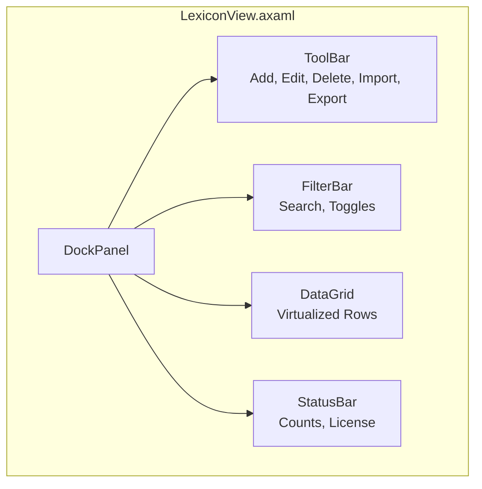
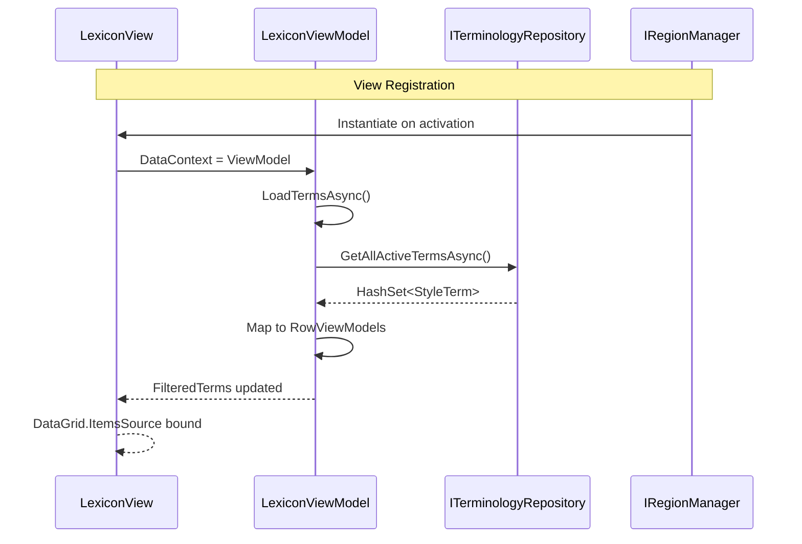

# LCS-INF-025a: Terminology Grid View

## 1. Metadata & Categorization

| Field                | Value                                        | Description                                           |
| :------------------- | :------------------------------------------- | :---------------------------------------------------- |
| **Feature ID**       | `INF-025a`                                   | Style Module - Terminology Grid View                  |
| **Feature Name**     | Lexicon Tab (Terminology Grid)               | DataGrid display of all style terms                   |
| **Target Version**   | `v0.2.5a`                                    | First sub-part of v0.2.5                              |
| **Module Scope**     | `Lexichord.Modules.Style`                    | Style governance infrastructure                       |
| **Swimlane**         | `Features`                                   | Style Governance Domain                               |
| **License Tier**     | `Core` (read-only), `WriterPro` (edit)       | Tiered feature access                                 |
| **Author**           | System Architect                             |                                                       |
| **Status**           | **Draft**                                    | Pending implementation                                |
| **Last Updated**     | 2026-01-26                                   |                                                       |

---

## 2. Executive Summary

### 2.1 The Requirement

Lexichord needs a visual **Terminology Grid View** that:

- Displays all style terms in a sortable Avalonia.DataGrid.
- Docks in the Right region of the Layout Engine.
- Supports column sorting by Severity and Category (default sort).
- Provides row selection for edit/delete operations.
- Shows term count and filter status in a status bar.

### 2.2 The Proposed Solution

We **SHALL** implement `LexiconView.axaml` with:

1. **DataGrid Control:** Avalonia.Controls.DataGrid bound to `FilteredTerms`.
2. **Toolbar:** Add, Edit, Delete buttons with Import/Export dropdowns.
3. **Status Bar:** Total count, filtered count, license tier indicator.
4. **Region Registration:** Inject into Right dock region via `IRegionManager`.

---

## 3. Architecture

### 3.1 View Structure



### 3.2 DataGrid Column Layout

```
+-------------+------------------+-------------+------------+--------+
| Pattern     | Recommendation   | Category    | Severity   | Active |
| (String)    | (String, trunc)  | (String)    | (Badge)    | (Icon) |
+-------------+------------------+-------------+------------+--------+
| click on    | Use 'select' ... | Terminology | [warning]  | [✓]    |
| e-mail      | Use 'email' (... | Terminology | [suggest]  | [✓]    |
| utilize     | Use 'use' inst...| Clarity     | [suggest]  | [✓]    |
| irregardless| Not a word. U... | Grammar     | [error]    | [✓]    |
| old-term    | Deprecated, us...| Terminology | [info]     | [ ]    |
+-------------+------------------+-------------+------------+--------+
```

### 3.3 View-ViewModel Binding



---

## 4. Decision Tree: Grid Operations

```text
START: "What grid operation is requested?"
|
+-- View activated
|   +-- LoadTermsAsync()
|   +-- Apply persisted sort order
|   +-- Apply persisted filters (via INF-025b)
|   +-- END
|
+-- User clicks column header
|   +-- Toggle sort direction for column
|   +-- If Shift held, add to sort (multi-column)
|   +-- Persist sort order
|   +-- END
|
+-- User clicks row
|   +-- Set SelectedTerm property
|   +-- Enable/disable toolbar buttons based on selection
|   +-- END
|
+-- User double-clicks row
|   +-- Check license tier
|   |   +-- WriterPro -> Open Edit dialog
|   |   +-- Other -> Show read-only detail or upgrade prompt
|   +-- END
|
+-- User right-clicks row
|   +-- Show context menu
|   +-- Options: Edit, Delete, Toggle Active, Copy Pattern
|   +-- END
|
+-- External LexiconChangedEvent received
|   +-- Refresh affected row(s)
|   +-- Or full reload if BulkImport
|   +-- Maintain scroll position
|   +-- END
```

---

## 5. Data Contracts

### 5.1 LexiconView.axaml Design

```xml
<UserControl xmlns="https://github.com/avaloniaui"
             xmlns:x="http://schemas.microsoft.com/winfx/2006/xaml"
             xmlns:vm="using:Lexichord.Modules.Style.ViewModels"
             x:Class="Lexichord.Modules.Style.Views.LexiconView"
             x:DataType="vm:LexiconViewModel">

    <Design.DataContext>
        <vm:LexiconViewModel />
    </Design.DataContext>

    <DockPanel>
        <!-- Toolbar -->
        <ToolBar DockPanel.Dock="Top">
            <Button Command="{Binding AddTermCommand}"
                    ToolTip.Tip="Add new term (WriterPro)"
                    IsEnabled="{Binding CanEdit}">
                <PathIcon Data="{StaticResource AddIcon}" />
            </Button>
            <Button Command="{Binding EditTermCommand}"
                    ToolTip.Tip="Edit selected term"
                    IsEnabled="{Binding CanEditSelectedTerm}">
                <PathIcon Data="{StaticResource EditIcon}" />
            </Button>
            <Button Command="{Binding DeleteTermCommand}"
                    ToolTip.Tip="Delete selected term"
                    IsEnabled="{Binding CanEditSelectedTerm}">
                <PathIcon Data="{StaticResource DeleteIcon}" />
            </Button>

            <Separator />

            <SplitButton Content="Import"
                         Command="{Binding ImportCommand}"
                         IsEnabled="{Binding CanEdit}">
                <SplitButton.Flyout>
                    <MenuFlyout>
                        <MenuItem Header="Import from CSV..."
                                  Command="{Binding ImportCsvCommand}" />
                        <MenuItem Header="Import from Excel..."
                                  Command="{Binding ImportExcelCommand}" />
                    </MenuFlyout>
                </SplitButton.Flyout>
            </SplitButton>

            <SplitButton Content="Export"
                         Command="{Binding ExportCommand}"
                         IsEnabled="{Binding CanEdit}">
                <SplitButton.Flyout>
                    <MenuFlyout>
                        <MenuItem Header="Export to JSON..."
                                  Command="{Binding ExportJsonCommand}" />
                        <MenuItem Header="Export to CSV..."
                                  Command="{Binding ExportCsvCommand}" />
                    </MenuFlyout>
                </SplitButton.Flyout>
            </SplitButton>
        </ToolBar>

        <!-- Filter Bar (defined in INF-025b) -->
        <ContentControl DockPanel.Dock="Top"
                        Content="{Binding FilterViewModel}" />

        <!-- Status Bar -->
        <Border DockPanel.Dock="Bottom"
                Classes="StatusBar">
            <Grid ColumnDefinitions="*,Auto,Auto">
                <TextBlock Text="{Binding StatusText}"
                           VerticalAlignment="Center" />
                <TextBlock Grid.Column="1"
                           Text="{Binding LicenseTierText}"
                           Margin="10,0" />
                <ProgressBar Grid.Column="2"
                             IsVisible="{Binding IsLoading}"
                             IsIndeterminate="True"
                             Width="100" />
            </Grid>
        </Border>

        <!-- DataGrid -->
        <DataGrid ItemsSource="{Binding FilteredTerms}"
                  SelectedItem="{Binding SelectedTerm}"
                  SelectionMode="Single"
                  CanUserSortColumns="True"
                  CanUserResizeColumns="True"
                  IsReadOnly="True"
                  AutoGenerateColumns="False"
                  GridLinesVisibility="Horizontal"
                  DoubleTapped="OnRowDoubleTapped">

            <DataGrid.Columns>
                <!-- Pattern Column -->
                <DataGridTextColumn Header="Pattern"
                                    Binding="{Binding Pattern}"
                                    Width="*"
                                    MinWidth="150">
                    <DataGridTextColumn.CellStyle>
                        <Style TargetType="DataGridCell">
                            <Setter Property="FontFamily" Value="Consolas, Courier New" />
                        </Style>
                    </DataGridTextColumn.CellStyle>
                </DataGridTextColumn>

                <!-- Recommendation Column (Truncated) -->
                <DataGridTextColumn Header="Recommendation"
                                    Binding="{Binding RecommendationTruncated}"
                                    Width="2*"
                                    MinWidth="200" />

                <!-- Category Column -->
                <DataGridTextColumn Header="Category"
                                    Binding="{Binding Category}"
                                    Width="120" />

                <!-- Severity Column (with color badge) -->
                <DataGridTemplateColumn Header="Severity"
                                        Width="100"
                                        SortMemberPath="Severity">
                    <DataGridTemplateColumn.CellTemplate>
                        <DataTemplate>
                            <Border Classes="SeverityBadge"
                                    Classes.Error="{Binding IsError}"
                                    Classes.Warning="{Binding IsWarning}"
                                    Classes.Suggestion="{Binding IsSuggestion}"
                                    Classes.Info="{Binding IsInfo}">
                                <TextBlock Text="{Binding Severity}"
                                           HorizontalAlignment="Center" />
                            </Border>
                        </DataTemplate>
                    </DataGridTemplateColumn.CellTemplate>
                </DataGridTemplateColumn>

                <!-- Active Column (checkbox icon) -->
                <DataGridTemplateColumn Header="Active"
                                        Width="60"
                                        SortMemberPath="IsActive">
                    <DataGridTemplateColumn.CellTemplate>
                        <DataTemplate>
                            <PathIcon Data="{Binding ActiveIcon}"
                                      Foreground="{Binding ActiveColor}"
                                      HorizontalAlignment="Center" />
                        </DataTemplate>
                    </DataGridTemplateColumn.CellTemplate>
                </DataGridTemplateColumn>
            </DataGrid.Columns>

            <!-- Context Menu -->
            <DataGrid.ContextMenu>
                <ContextMenu>
                    <MenuItem Header="Edit"
                              Command="{Binding EditTermCommand}"
                              IsEnabled="{Binding CanEditSelectedTerm}">
                        <MenuItem.Icon>
                            <PathIcon Data="{StaticResource EditIcon}" />
                        </MenuItem.Icon>
                    </MenuItem>
                    <MenuItem Header="Delete"
                              Command="{Binding DeleteTermCommand}"
                              IsEnabled="{Binding CanEditSelectedTerm}">
                        <MenuItem.Icon>
                            <PathIcon Data="{StaticResource DeleteIcon}" />
                        </MenuItem.Icon>
                    </MenuItem>
                    <Separator />
                    <MenuItem Header="Toggle Active"
                              Command="{Binding ToggleActiveCommand}"
                              IsEnabled="{Binding CanEditSelectedTerm}" />
                    <Separator />
                    <MenuItem Header="Copy Pattern"
                              Command="{Binding CopyPatternCommand}" />
                </ContextMenu>
            </DataGrid.ContextMenu>
        </DataGrid>
    </DockPanel>
</UserControl>
```

### 5.2 Row ViewModel Enhancement

```csharp
namespace Lexichord.Modules.Style.ViewModels;

using Avalonia.Media;

/// <summary>
/// Row ViewModel for StyleTerm in the DataGrid.
/// </summary>
/// <remarks>
/// LOGIC: Extends base properties with computed display properties
/// for severity badges, active icons, and color coding.
/// </remarks>
public partial class StyleTermRowViewModel : ObservableObject
{
    // ... base properties from INF-025 ...

    /// <summary>
    /// Whether this term has error severity.
    /// </summary>
    /// <remarks>
    /// LOGIC: Used for CSS class binding on severity badge.
    /// </remarks>
    public bool IsError => Severity == StyleTermSeverity.Error;

    /// <summary>
    /// Whether this term has warning severity.
    /// </summary>
    public bool IsWarning => Severity == StyleTermSeverity.Warning;

    /// <summary>
    /// Whether this term has suggestion severity.
    /// </summary>
    public bool IsSuggestion => Severity == StyleTermSeverity.Suggestion;

    /// <summary>
    /// Whether this term has info severity.
    /// </summary>
    public bool IsInfo => Severity == StyleTermSeverity.Info;

    /// <summary>
    /// Icon path data for active status.
    /// </summary>
    /// <remarks>
    /// LOGIC: Checkmark for active, X for inactive.
    /// </remarks>
    public string ActiveIcon => IsActive
        ? "M9,20.42L2.79,14.21L5.62,11.38L9,14.77L18.88,4.88L21.71,7.71L9,20.42Z"
        : "M19,6.41L17.59,5L12,10.59L6.41,5L5,6.41L10.59,12L5,17.59L6.41,19L12,13.41L17.59,19L19,17.59L13.41,12L19,6.41Z";

    /// <summary>
    /// Color for active status icon.
    /// </summary>
    public IBrush ActiveColor => IsActive
        ? Brushes.Green
        : Brushes.Gray;

    /// <summary>
    /// Sort order for severity (error=0, warning=1, suggestion=2, info=3).
    /// </summary>
    /// <remarks>
    /// LOGIC: Used for custom sorting by severity importance.
    /// </remarks>
    public int SeveritySortOrder => Severity switch
    {
        StyleTermSeverity.Error => 0,
        StyleTermSeverity.Warning => 1,
        StyleTermSeverity.Suggestion => 2,
        StyleTermSeverity.Info => 3,
        _ => 4
    };
}
```

### 5.3 Region Registration

```csharp
namespace Lexichord.Modules.Style;

using Lexichord.Abstractions.Shell;
using Lexichord.Modules.Style.Views;

/// <summary>
/// Style module initialization.
/// </summary>
public sealed class StyleModule : IModule
{
    private readonly IRegionManager _regionManager;
    private readonly IServiceProvider _serviceProvider;

    public StyleModule(
        IRegionManager regionManager,
        IServiceProvider serviceProvider)
    {
        _regionManager = regionManager;
        _serviceProvider = serviceProvider;
    }

    /// <inheritdoc/>
    public async Task InitializeAsync(CancellationToken ct = default)
    {
        // LOGIC: Register LexiconView in Right dock region
        // Order 10 places it after Project Explorer (order 0)
        _regionManager.RegisterView<LexiconView>(
            ShellRegion.Right,
            new ViewRegistrationOptions
            {
                Title = "Lexicon",
                Icon = "BookOpenPageVariant",
                Order = 10,
                CanClose = true,
                DefaultVisible = false // User must explicitly open
            });

        // ... other module initialization ...
    }

    /// <inheritdoc/>
    public Task ShutdownAsync(CancellationToken ct = default)
    {
        // LOGIC: Unregister view on module shutdown
        _regionManager.UnregisterView<LexiconView>();
        return Task.CompletedTask;
    }
}
```

---

## 6. Implementation Logic

### 6.1 Default Sorting

```csharp
/// <summary>
/// Applies default sort order to the terms collection.
/// </summary>
/// <remarks>
/// LOGIC: Default sort is Severity (ascending by importance) then Category.
/// This puts errors first, followed by warnings, suggestions, info.
/// Within each severity, terms are grouped by category.
/// </remarks>
private void ApplyDefaultSort()
{
    var sorted = FilteredTerms
        .OrderBy(t => t.SeveritySortOrder)
        .ThenBy(t => t.Category)
        .ThenBy(t => t.Pattern);

    FilteredTerms = new ObservableCollection<StyleTermRowViewModel>(sorted);
}
```

### 6.2 Status Text Generation

```csharp
/// <summary>
/// Generates status bar text.
/// </summary>
/// <remarks>
/// LOGIC: Shows filtered count vs total, with filter indicator.
/// Examples:
/// - "127 terms" (no filter)
/// - "5 of 127 terms (filtered)" (filter active)
/// - "Loading..." (during load)
/// </remarks>
private string GenerateStatusText()
{
    if (IsLoading)
        return "Loading...";

    if (FilteredCount == TotalCount)
        return $"{TotalCount} terms";

    return $"{FilteredCount} of {TotalCount} terms (filtered)";
}
```

### 6.3 Double-Click Handler

```csharp
/// <summary>
/// Handles double-click on DataGrid row.
/// </summary>
private async void OnRowDoubleTapped(object? sender, TappedEventArgs e)
{
    // LOGIC: Only handle if a row is selected
    if (SelectedTerm is null)
        return;

    // LOGIC: Check license before opening edit dialog
    if (CanEdit)
    {
        await EditTermAsync();
    }
    else
    {
        // LOGIC: Show read-only detail view for non-WriterPro users
        await ShowTermDetailAsync(SelectedTerm);
    }
}
```

---

## 7. Use Cases

### UC-01: Open Lexicon Tab

**Preconditions:**
- Lexichord is running.
- Right dock region is visible.

**Flow:**
1. User clicks View > Lexicon (or uses keyboard shortcut).
2. LexiconView instantiated by IRegionManager.
3. ViewModel's LoadTermsAsync() called.
4. DataGrid populates with all terms.
5. Default sort applied (Severity, Category).
6. Status bar shows "127 terms".

**Postconditions:**
- Lexicon tab visible in Right region.
- All terms displayed in grid.

---

### UC-02: Sort by Column

**Preconditions:**
- Lexicon view is open with terms loaded.

**Flow:**
1. User clicks "Category" column header.
2. Grid sorts ascending by category.
3. User clicks "Category" header again.
4. Grid sorts descending by category.
5. User Shift+clicks "Severity" header.
6. Grid sorts by Category then Severity.

**Postconditions:**
- Grid reflects requested sort order.
- Sort indicator shown on column headers.

---

### UC-03: Context Menu Delete

**Preconditions:**
- User has WriterPro tier.
- Term is selected in grid.

**Flow:**
1. User right-clicks selected row.
2. Context menu appears with Edit, Delete, Toggle Active.
3. User clicks "Delete".
4. Confirmation dialog: "Delete term 'click on'?"
5. User confirms.
6. Term removed from database.
7. Row disappears from grid.
8. Status bar updates count.

**Postconditions:**
- Term deleted from database.
- Grid reflects removal.

---

## 8. Observability & Logging

### 8.1 Log Events

| Level       | Source           | Message Template                                              |
| :---------- | :--------------- | :------------------------------------------------------------ |
| Information | LexiconView      | `Lexicon view activated`                                      |
| Debug       | LexiconViewModel | `Loading {Count} terms into grid`                             |
| Debug       | LexiconViewModel | `Applied default sort: Severity, Category`                    |
| Debug       | LexiconViewModel | `Row selected: {TermId} - {Pattern}`                          |
| Debug       | LexiconViewModel | `Row double-clicked: {TermId}`                                |
| Information | LexiconViewModel | `Term deleted via context menu: {TermId}`                     |

---

## 9. Unit Testing Requirements

### 9.1 ViewModel Tests

```csharp
[TestFixture]
[Category("Unit")]
public class LexiconViewModelGridTests
{
    private Mock<ITerminologyService> _mockService = null!;
    private Mock<ILicenseContext> _mockLicense = null!;
    private LexiconViewModel _sut = null!;

    [SetUp]
    public void SetUp()
    {
        _mockService = new Mock<ITerminologyService>();
        _mockLicense = new Mock<ILicenseContext>();
        // ... other mocks ...

        _sut = new LexiconViewModel(
            _mockService.Object,
            // ... other dependencies ...
            _mockLicense.Object);
    }

    [Test]
    public async Task LoadTermsAsync_PopulatesAllTermsCollection()
    {
        // Arrange
        var terms = CreateTestTerms(10);
        _mockService.Setup(s => s.GetAllAsync(It.IsAny<CancellationToken>()))
            .ReturnsAsync(terms);

        // Act
        await _sut.LoadTermsAsync();

        // Assert
        Assert.That(_sut.AllTerms, Has.Count.EqualTo(10));
        Assert.That(_sut.TotalCount, Is.EqualTo(10));
    }

    [Test]
    public async Task LoadTermsAsync_AppliesDefaultSort()
    {
        // Arrange
        var terms = new[]
        {
            CreateTerm("c", severity: StyleTermSeverity.Info),
            CreateTerm("a", severity: StyleTermSeverity.Error),
            CreateTerm("b", severity: StyleTermSeverity.Warning)
        };
        _mockService.Setup(s => s.GetAllAsync(It.IsAny<CancellationToken>()))
            .ReturnsAsync(terms);

        // Act
        await _sut.LoadTermsAsync();

        // Assert
        Assert.That(_sut.FilteredTerms[0].Pattern, Is.EqualTo("a")); // Error first
        Assert.That(_sut.FilteredTerms[1].Pattern, Is.EqualTo("b")); // Warning second
        Assert.That(_sut.FilteredTerms[2].Pattern, Is.EqualTo("c")); // Info last
    }

    [Test]
    public void SelectedTerm_WhenSet_UpdatesCanEditSelectedTerm()
    {
        // Arrange
        _mockLicense.Setup(l => l.GetCurrentTier()).Returns(LicenseTier.WriterPro);
        var term = new StyleTermRowViewModel(CreateTerm("test"));

        // Act
        _sut.SelectedTerm = term;

        // Assert
        Assert.That(_sut.EditTermCommand.CanExecute(null), Is.True);
        Assert.That(_sut.DeleteTermCommand.CanExecute(null), Is.True);
    }

    [Test]
    public void CanEdit_WhenNotWriterPro_ReturnsFalse()
    {
        // Arrange
        _mockLicense.Setup(l => l.GetCurrentTier()).Returns(LicenseTier.Core);

        // Assert
        Assert.That(_sut.CanEdit, Is.False);
        Assert.That(_sut.AddTermCommand.CanExecute(null), Is.False);
    }

    private static StyleTerm CreateTerm(
        string pattern,
        string severity = StyleTermSeverity.Suggestion) => new()
    {
        TermPattern = pattern,
        Recommendation = "Test",
        Category = "Terminology",
        Severity = severity
    };

    private static IEnumerable<StyleTerm> CreateTestTerms(int count) =>
        Enumerable.Range(1, count).Select(i => CreateTerm($"term{i}"));
}
```

---

## 10. Security & Safety

### 10.1 Read-Only Grid

> [!NOTE]
> DataGrid is set to `IsReadOnly="True"` to prevent inline editing.
> All modifications go through the Term Editor dialog with validation.

### 10.2 License Gating

```csharp
// LOGIC: All write operations check license tier
public bool CanEdit => _licenseContext.GetCurrentTier() >= LicenseTier.WriterPro;

// LOGIC: Commands bound to CanEdit
[RelayCommand(CanExecute = nameof(CanEdit))]
public async Task AddTermAsync() { /* ... */ }
```

---

## 11. Risks & Mitigations

| Risk | Impact | Probability | Mitigation |
|:-----|:-------|:------------|:-----------|
| DataGrid slow with 10,000+ rows | High | Medium | Enable virtualization; consider pagination |
| Sort operation blocks UI | Medium | Low | Use background sorting for large sets |
| Column width not persisted | Low | Medium | Save column widths to settings |
| Context menu on wrong row | Low | Low | Select row on right-click before showing menu |

---

## 12. Acceptance Criteria (QA)

| #   | Criterion                                                                     |
| :-- | :---------------------------------------------------------------------------- |
| 1   | LexiconView appears in Right dock region when activated.                      |
| 2   | DataGrid shows all terms with Pattern, Recommendation, Category, Severity, Active columns. |
| 3   | Clicking column header sorts grid by that column.                             |
| 4   | Clicking same header toggles sort direction.                                  |
| 5   | Shift+click enables multi-column sort.                                        |
| 6   | Default sort is Severity then Category.                                       |
| 7   | Selecting row enables Edit/Delete buttons (WriterPro).                        |
| 8   | Double-clicking row opens Edit dialog (WriterPro).                            |
| 9   | Right-clicking row shows context menu.                                        |
| 10  | Status bar shows "X terms" or "X of Y terms (filtered)".                      |
| 11  | Severity column shows colored badges.                                         |
| 12  | Active column shows checkmark/X icons.                                        |

---

## 13. Verification Commands

```bash
# 1. Run application
dotnet run --project src/Lexichord.Host

# 2. Open Lexicon view
# View > Lexicon (or Ctrl+Shift+L)
# Expected: Lexicon tab appears in Right dock

# 3. Verify grid columns
# Expected: Pattern, Recommendation, Category, Severity, Active columns visible

# 4. Verify sorting
# Click Severity header
# Expected: Grid sorts by severity (error first)

# 5. Verify selection
# Click any row
# Expected: Row highlighted, toolbar buttons enabled (WriterPro)

# 6. Verify context menu
# Right-click any row
# Expected: Menu with Edit, Delete, Toggle Active, Copy Pattern

# 7. Run unit tests
dotnet test --filter "FullyQualifiedName~LexiconViewModelGridTests"
```

---

## 14. Deliverable Checklist

| Step | Description                                                               | Status |
| :--- | :------------------------------------------------------------------------ | :----- |
| 1    | `LexiconView.axaml` with DockPanel layout                                 | [ ]    |
| 2    | Toolbar with Add, Edit, Delete, Import, Export buttons                    | [ ]    |
| 3    | DataGrid with all columns defined                                         | [ ]    |
| 4    | Severity column with colored badge template                               | [ ]    |
| 5    | Active column with icon template                                          | [ ]    |
| 6    | Context menu with Edit, Delete, Toggle Active, Copy Pattern               | [ ]    |
| 7    | Status bar with counts and license indicator                              | [ ]    |
| 8    | `StyleTermRowViewModel` with computed properties                          | [ ]    |
| 9    | Default sort implementation (Severity, Category)                          | [ ]    |
| 10   | Region registration in StyleModule                                        | [ ]    |
| 11   | Double-click handler for edit                                             | [ ]    |
| 12   | Unit tests for grid operations                                            | [ ]    |
