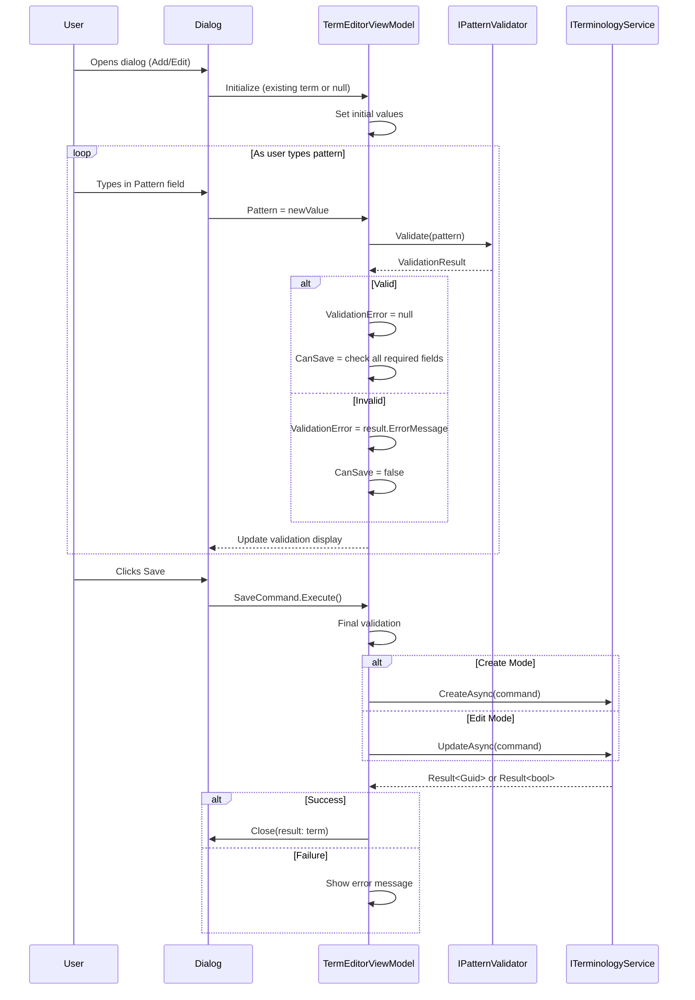
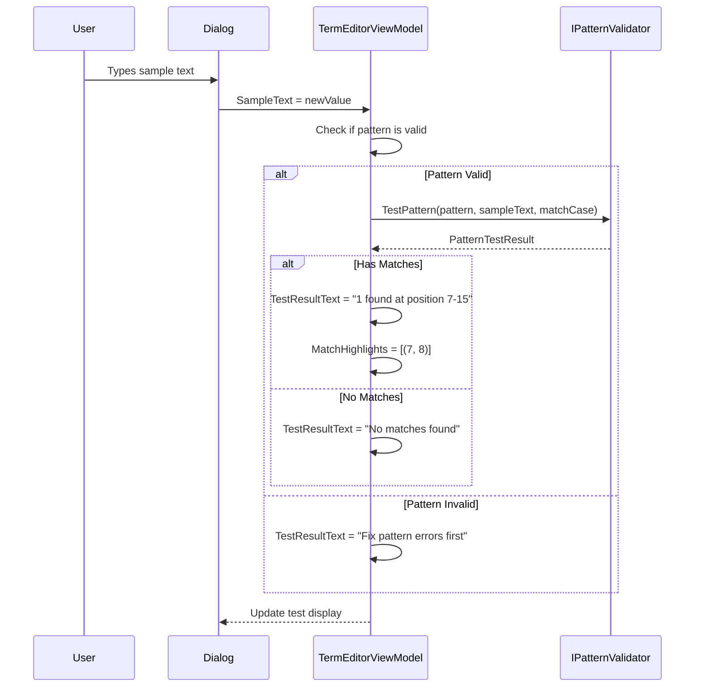

# LCS-INF-025c: Term Editor Dialog

## 1. Metadata & Categorization

| Field                | Value                                        | Description                                           |
| :------------------- | :------------------------------------------- | :---------------------------------------------------- |
| **Feature ID**       | `INF-025c`                                   | Style Module - Term Editor Dialog                     |
| **Feature Name**     | Term Editor Dialog                           | Modal dialog for Add/Edit terms with validation       |
| **Target Version**   | `v0.2.5c`                                    | Third sub-part of v0.2.5                              |
| **Module Scope**     | `Lexichord.Modules.Style`                    | Style governance infrastructure                       |
| **Swimlane**         | `Features`                                   | Style Governance Domain                               |
| **License Tier**     | `WriterPro`                                  | Editing requires WriterPro tier                       |
| **Author**           | System Architect                             |                                                       |
| **Status**           | **Draft**                                    | Pending implementation                                |
| **Last Updated**     | 2026-01-26                                   |                                                       |

---

## 2. Executive Summary

### 2.1 The Requirement

The Librarian needs a **modal dialog** for adding and editing terminology rules:

- Form fields for Pattern, Recommendation, Category, Severity, Match Case.
- Real-time regex validation with clear error messages.
- "Test Pattern" feature to verify pattern against sample text.
- Save button disabled until all validation passes.
- Cancel button with dirty state confirmation.

### 2.2 The Proposed Solution

We **SHALL** implement `TermEditorDialog.axaml` with:

1. **Pattern Field:** TextBox with real-time regex validation.
2. **Validation Display:** Inline error messages below pattern field.
3. **Test Pattern:** Sample text box with match highlighting.
4. **Recommendation Field:** Multi-line TextBox.
5. **Category ComboBox:** Editable with standard categories.
6. **Severity ComboBox:** Fixed list (error, warning, suggestion, info).
7. **Checkboxes:** Match Case, Is Active.
8. **Action Buttons:** Save (disabled until valid), Cancel.

---

## 3. Architecture

### 3.1 Dialog Layout

```
+------------------------------------------------------------+
|  Add Term                                            [X]   |
+------------------------------------------------------------+
| Pattern: *                                                 |
| +--------------------------------------------------------+ |
| | \bclick\s+on\b                                         | |
| +--------------------------------------------------------+ |
| [!] Valid regex pattern                                    |
|                                                            |
| Recommendation: *                                          |
| +--------------------------------------------------------+ |
| | Use 'select' instead of 'click on' for touchscreen     | |
| | compatibility. The term 'select' is device-agnostic.   | |
| +--------------------------------------------------------+ |
|                                                            |
| Category: *     [Terminology          v]                   |
| Severity:       [warning              v]                   |
|                                                            |
| [✓] Match Case     [ ] Deprecated (inactive)               |
|                                                            |
| --- Test Pattern ---                                       |
| Sample text:                                               |
| +--------------------------------------------------------+ |
| | Please click on the button to continue                 | |
| +--------------------------------------------------------+ |
| Matches: 1 found at position 7-15 ("click on")            |
|                                                            |
+------------------------------------------------------------+
|                              [Cancel]  [Save]              |
+------------------------------------------------------------+
```

### 3.2 Validation Flow



### 3.3 Pattern Test Flow



---

## 4. Decision Tree: Dialog Operations

```text
START: "What dialog operation is requested?"
|
+-- Open Add Dialog
|   +-- Create new TermEditorViewModel
|   +-- Initialize with empty/default values
|   +-- Pattern = "", Recommendation = ""
|   +-- Category = "Terminology", Severity = "suggestion"
|   +-- MatchCase = false, IsActive = true
|   +-- DialogTitle = "Add Term"
|   +-- Show dialog
|   +-- END
|
+-- Open Edit Dialog
|   +-- Create new TermEditorViewModel
|   +-- Initialize with existing term values
|   +-- Pattern = term.TermPattern, etc.
|   +-- DialogTitle = "Edit Term"
|   +-- OriginalTerm = term (for dirty tracking)
|   +-- Show dialog
|   +-- END
|
+-- User modifies Pattern field
|   +-- Validate pattern via IPatternValidator
|   +-- Update ValidationError property
|   +-- Update CanSave property
|   +-- If valid and sample text exists, run test
|   +-- Mark as dirty if different from original
|   +-- END
|
+-- User clicks "Test"
|   +-- Check pattern validity
|   |   +-- Invalid -> Show "Fix pattern first"
|   |   +-- Valid -> Run test
|   +-- Test pattern against sample text
|   +-- Display matches with positions
|   +-- END
|
+-- User clicks Save
|   +-- Final validation of all fields
|   +-- Pattern: Required, Valid regex
|   +-- Recommendation: Required
|   +-- Category: Required
|   +-- Severity: Required, valid value
|   +-- If all valid:
|   |   +-- Create/Update via ITerminologyService
|   |   +-- Close dialog with result
|   +-- If invalid:
|   |   +-- Show validation errors
|   +-- END
|
+-- User clicks Cancel
|   +-- Check IsDirty
|   |   +-- Dirty -> Confirm discard changes?
|   |   +-- Not dirty -> Close immediately
|   +-- On confirm -> Close with null result
|   +-- END
|
+-- User presses Escape
|   +-- Same as Cancel
|   +-- END
|
+-- User presses Enter
|   +-- If CanSave -> Execute Save
|   +-- If not CanSave -> Do nothing (or show validation)
|   +-- END
```

---

## 5. Data Contracts

### 5.1 TermEditorDialog.axaml

```xml
<Window xmlns="https://github.com/avaloniaui"
        xmlns:x="http://schemas.microsoft.com/winfx/2006/xaml"
        xmlns:vm="using:Lexichord.Modules.Style.ViewModels"
        x:Class="Lexichord.Modules.Style.Views.TermEditorDialog"
        x:DataType="vm:TermEditorViewModel"
        Title="{Binding DialogTitle}"
        Width="500" Height="600"
        WindowStartupLocation="CenterOwner"
        CanResize="False"
        ShowInTaskbar="False">

    <Window.KeyBindings>
        <KeyBinding Gesture="Enter" Command="{Binding SaveCommand}" />
        <KeyBinding Gesture="Escape" Command="{Binding CancelCommand}" />
    </Window.KeyBindings>

    <DockPanel Margin="16">
        <!-- Action Buttons -->
        <StackPanel DockPanel.Dock="Bottom"
                    Orientation="Horizontal"
                    HorizontalAlignment="Right"
                    Spacing="8"
                    Margin="0,16,0,0">
            <Button Content="Cancel"
                    Command="{Binding CancelCommand}"
                    Width="80" />
            <Button Content="Save"
                    Command="{Binding SaveCommand}"
                    IsEnabled="{Binding CanSave}"
                    Classes="Primary"
                    Width="80" />
        </StackPanel>

        <ScrollViewer>
            <StackPanel Spacing="16">
                <!-- Pattern Field -->
                <StackPanel>
                    <Label Content="Pattern: *" />
                    <TextBox Text="{Binding Pattern, Mode=TwoWay}"
                             FontFamily="Consolas, Courier New"
                             Watermark="Enter regex pattern..."
                             Classes.Error="{Binding HasValidationError}" />
                    <StackPanel Orientation="Horizontal"
                                Margin="0,4,0,0">
                        <PathIcon Data="{Binding ValidationIcon}"
                                  Foreground="{Binding ValidationColor}"
                                  Width="14" Height="14"
                                  Margin="0,0,4,0" />
                        <TextBlock Text="{Binding ValidationMessage}"
                                   Foreground="{Binding ValidationColor}"
                                   FontSize="12" />
                    </StackPanel>
                </StackPanel>

                <!-- Recommendation Field -->
                <StackPanel>
                    <Label Content="Recommendation: *" />
                    <TextBox Text="{Binding Recommendation, Mode=TwoWay}"
                             AcceptsReturn="True"
                             TextWrapping="Wrap"
                             Height="80"
                             Watermark="Enter recommendation text..." />
                    <TextBlock Text="{Binding RecommendationCharCount, StringFormat='{}{0} characters'}"
                               Foreground="Gray"
                               FontSize="11"
                               HorizontalAlignment="Right"
                               Margin="0,2,0,0" />
                </StackPanel>

                <!-- Category and Severity -->
                <Grid ColumnDefinitions="*,16,*">
                    <StackPanel Grid.Column="0">
                        <Label Content="Category: *" />
                        <ComboBox ItemsSource="{Binding Categories}"
                                  SelectedItem="{Binding SelectedCategory}"
                                  IsEditable="True"
                                  Text="{Binding Category, Mode=TwoWay}" />
                    </StackPanel>

                    <StackPanel Grid.Column="2">
                        <Label Content="Severity:" />
                        <ComboBox ItemsSource="{Binding Severities}"
                                  SelectedItem="{Binding Severity}" />
                    </StackPanel>
                </Grid>

                <!-- Checkboxes -->
                <StackPanel Orientation="Horizontal" Spacing="24">
                    <CheckBox IsChecked="{Binding MatchCase}"
                              Content="Match Case"
                              ToolTip.Tip="When checked, pattern matching is case-sensitive" />
                    <CheckBox IsChecked="{Binding IsDeprecated}"
                              Content="Deprecated (inactive)"
                              ToolTip.Tip="Deprecated terms are hidden by default" />
                </StackPanel>

                <!-- Test Pattern Section -->
                <Border Classes="TestSection" Padding="12" CornerRadius="4">
                    <StackPanel Spacing="8">
                        <TextBlock Text="Test Pattern"
                                   FontWeight="SemiBold" />

                        <Label Content="Sample text:" />
                        <TextBox Text="{Binding SampleText, Mode=TwoWay}"
                                 AcceptsReturn="True"
                                 TextWrapping="Wrap"
                                 Height="60"
                                 Watermark="Enter text to test pattern against..." />

                        <StackPanel Orientation="Horizontal" Spacing="4">
                            <PathIcon Data="{Binding TestResultIcon}"
                                      Foreground="{Binding TestResultColor}"
                                      Width="14" Height="14"
                                      IsVisible="{Binding HasTestResult}" />
                            <TextBlock Text="{Binding TestResultText}"
                                       Foreground="{Binding TestResultColor}" />
                        </StackPanel>

                        <!-- Match Highlights (if matches found) -->
                        <ItemsControl ItemsSource="{Binding Matches}"
                                      IsVisible="{Binding HasMatches}">
                            <ItemsControl.ItemTemplate>
                                <DataTemplate>
                                    <Border Classes="MatchBadge" Padding="4,2">
                                        <TextBlock>
                                            <Run Text="&quot;" />
                                            <Run Text="{Binding MatchedText}" FontWeight="Bold" />
                                            <Run Text="&quot;" />
                                            <Run Text=" at " Foreground="Gray" />
                                            <Run Text="{Binding Start}" />
                                            <Run Text="-" Foreground="Gray" />
                                            <Run Text="{Binding End}" />
                                        </TextBlock>
                                    </Border>
                                </DataTemplate>
                            </ItemsControl.ItemTemplate>
                        </ItemsControl>
                    </StackPanel>
                </Border>
            </StackPanel>
        </ScrollViewer>
    </DockPanel>
</Window>
```

### 5.2 TermEditorViewModel

```csharp
namespace Lexichord.Modules.Style.ViewModels;

using CommunityToolkit.Mvvm.ComponentModel;
using CommunityToolkit.Mvvm.Input;
using Avalonia.Media;

/// <summary>
/// ViewModel for the Term Editor dialog.
/// </summary>
/// <remarks>
/// LOGIC: TermEditorViewModel manages form state, validation, and
/// interaction with ITerminologyService for creating/updating terms.
///
/// Mode:
/// - Add mode: OriginalTerm is null, creates new term on save
/// - Edit mode: OriginalTerm is set, updates existing term on save
///
/// Validation:
/// - Pattern validated on every change via IPatternValidator
/// - All required fields checked before enabling Save
/// - Final validation performed on Save command
///
/// Dirty Tracking:
/// - IsDirty tracks if any field differs from original
/// - Cancel prompts confirmation if dirty
/// </remarks>
public partial class TermEditorViewModel : ObservableObject
{
    private readonly IPatternValidator _patternValidator;
    private readonly ITerminologyService _terminologyService;
    private readonly ILogger<TermEditorViewModel> _logger;

    private StyleTerm? _originalTerm;

    /// <summary>
    /// Dialog title ("Add Term" or "Edit Term").
    /// </summary>
    [ObservableProperty]
    private string _dialogTitle = "Add Term";

    /// <summary>
    /// Pattern field value.
    /// </summary>
    [ObservableProperty]
    [NotifyPropertyChangedFor(nameof(CanSave))]
    [NotifyPropertyChangedFor(nameof(IsDirty))]
    [NotifyPropertyChangedFor(nameof(HasValidationError))]
    [NotifyPropertyChangedFor(nameof(ValidationMessage))]
    [NotifyPropertyChangedFor(nameof(ValidationIcon))]
    [NotifyPropertyChangedFor(nameof(ValidationColor))]
    private string _pattern = string.Empty;

    /// <summary>
    /// Recommendation field value.
    /// </summary>
    [ObservableProperty]
    [NotifyPropertyChangedFor(nameof(CanSave))]
    [NotifyPropertyChangedFor(nameof(IsDirty))]
    [NotifyPropertyChangedFor(nameof(RecommendationCharCount))]
    private string _recommendation = string.Empty;

    /// <summary>
    /// Category field value.
    /// </summary>
    [ObservableProperty]
    [NotifyPropertyChangedFor(nameof(CanSave))]
    [NotifyPropertyChangedFor(nameof(IsDirty))]
    private string _category = StyleTermCategory.Terminology;

    /// <summary>
    /// Severity field value.
    /// </summary>
    [ObservableProperty]
    [NotifyPropertyChangedFor(nameof(IsDirty))]
    private string _severity = StyleTermSeverity.Suggestion;

    /// <summary>
    /// Match case checkbox.
    /// </summary>
    [ObservableProperty]
    [NotifyPropertyChangedFor(nameof(IsDirty))]
    private bool _matchCase = false;

    /// <summary>
    /// Deprecated checkbox (inverse of IsActive).
    /// </summary>
    [ObservableProperty]
    [NotifyPropertyChangedFor(nameof(IsDirty))]
    private bool _isDeprecated = false;

    /// <summary>
    /// Sample text for pattern testing.
    /// </summary>
    [ObservableProperty]
    private string _sampleText = string.Empty;

    /// <summary>
    /// Pattern validation result.
    /// </summary>
    [ObservableProperty]
    private PatternValidationResult? _validationResult;

    /// <summary>
    /// Pattern test result.
    /// </summary>
    [ObservableProperty]
    [NotifyPropertyChangedFor(nameof(HasTestResult))]
    [NotifyPropertyChangedFor(nameof(HasMatches))]
    [NotifyPropertyChangedFor(nameof(TestResultText))]
    [NotifyPropertyChangedFor(nameof(TestResultIcon))]
    [NotifyPropertyChangedFor(nameof(TestResultColor))]
    [NotifyPropertyChangedFor(nameof(Matches))]
    private PatternTestResult? _testResult;

    /// <summary>
    /// Available categories for dropdown.
    /// </summary>
    [ObservableProperty]
    private ObservableCollection<string> _categories = new(StyleTermCategory.Standard);

    /// <summary>
    /// Available severities for dropdown.
    /// </summary>
    [ObservableProperty]
    private ObservableCollection<string> _severities = new(StyleTermSeverity.All);

    /// <summary>
    /// Whether pattern has validation error.
    /// </summary>
    public bool HasValidationError =>
        ValidationResult is not null && !ValidationResult.IsValid;

    /// <summary>
    /// Validation message to display.
    /// </summary>
    public string ValidationMessage => ValidationResult switch
    {
        null => "Enter a pattern",
        { IsValid: true } => "Valid regex pattern",
        { IsValid: false } => ValidationResult.ErrorMessage ?? "Invalid pattern"
    };

    /// <summary>
    /// Icon for validation status.
    /// </summary>
    public string ValidationIcon => ValidationResult switch
    {
        null => "M12,2C17.53,2 22,6.47 22,12C22,17.53 17.53,22 12,22C6.47,22 2,17.53 2,12C2,6.47 6.47,2 12,2M12,4C7.58,4 4,7.58 4,12C4,16.42 7.58,20 12,20C16.42,20 20,16.42 20,12C20,7.58 16.42,4 12,4M11,7H13V13H11V7M11,15H13V17H11V15Z", // Info
        { IsValid: true } => "M12,2C17.52,2 22,6.48 22,12C22,17.52 17.52,22 12,22C6.48,22 2,17.52 2,12C2,6.48 6.48,2 12,2M11,16.5L18,9.5L16.59,8.09L11,13.67L7.91,10.59L6.5,12L11,16.5Z", // Checkmark
        { IsValid: false } => "M12,2C17.53,2 22,6.47 22,12C22,17.53 17.53,22 12,22C6.47,22 2,17.53 2,12C2,6.47 6.47,2 12,2M15.59,7L12,10.59L8.41,7L7,8.41L10.59,12L7,15.59L8.41,17L12,13.41L15.59,17L17,15.59L13.41,12L17,8.41L15.59,7Z" // Error
    };

    /// <summary>
    /// Color for validation status.
    /// </summary>
    public IBrush ValidationColor => ValidationResult switch
    {
        null => Brushes.Gray,
        { IsValid: true } => Brushes.Green,
        { IsValid: false } => Brushes.Red
    };

    /// <summary>
    /// Character count for recommendation.
    /// </summary>
    public int RecommendationCharCount => Recommendation.Length;

    /// <summary>
    /// Whether Save button should be enabled.
    /// </summary>
    /// <remarks>
    /// LOGIC: All required fields must have values and pattern must be valid.
    /// </remarks>
    public bool CanSave =>
        !string.IsNullOrWhiteSpace(Pattern) &&
        !string.IsNullOrWhiteSpace(Recommendation) &&
        !string.IsNullOrWhiteSpace(Category) &&
        ValidationResult is { IsValid: true };

    /// <summary>
    /// Whether any field has changed from original.
    /// </summary>
    public bool IsDirty
    {
        get
        {
            if (_originalTerm is null)
            {
                // Add mode: dirty if any required field has value
                return !string.IsNullOrWhiteSpace(Pattern) ||
                       !string.IsNullOrWhiteSpace(Recommendation);
            }

            // Edit mode: dirty if any field differs from original
            return Pattern != _originalTerm.TermPattern ||
                   Recommendation != _originalTerm.Recommendation ||
                   Category != _originalTerm.Category ||
                   Severity != _originalTerm.Severity ||
                   MatchCase != _originalTerm.MatchCase ||
                   IsDeprecated != !_originalTerm.IsActive;
        }
    }

    /// <summary>
    /// Whether test has been run.
    /// </summary>
    public bool HasTestResult => TestResult is not null;

    /// <summary>
    /// Whether test found matches.
    /// </summary>
    public bool HasMatches => TestResult is { HasMatch: true };

    /// <summary>
    /// Test result display text.
    /// </summary>
    public string TestResultText => TestResult switch
    {
        null => "",
        { TimedOut: true } => "Pattern timed out - too complex",
        { HasMatch: true } => $"{TestResult.Matches.Count} match(es) found",
        { HasMatch: false } => "No matches found"
    };

    /// <summary>
    /// Icon for test result.
    /// </summary>
    public string TestResultIcon => TestResult switch
    {
        { TimedOut: true } => "M12,2A10,10 0 0,0 2,12A10,10 0 0,0 12,22A10,10 0 0,0 22,12A10,10 0 0,0 12,2M12,4A8,8 0 0,1 20,12A8,8 0 0,1 12,20A8,8 0 0,1 4,12A8,8 0 0,1 12,4M12.5,7V12.25L17,14.92L16.25,16.15L11,13V7H12.5Z", // Clock
        { HasMatch: true } => "M12,2C17.52,2 22,6.48 22,12C22,17.52 17.52,22 12,22C6.48,22 2,17.52 2,12C2,6.48 6.48,2 12,2M11,16.5L18,9.5L16.59,8.09L11,13.67L7.91,10.59L6.5,12L11,16.5Z",
        _ => "M12,2C17.53,2 22,6.47 22,12C22,17.53 17.53,22 12,22C6.47,22 2,17.53 2,12C2,6.47 6.47,2 12,2M15.59,7L12,10.59L8.41,7L7,8.41L10.59,12L7,15.59L8.41,17L12,13.41L15.59,17L17,15.59L13.41,12L17,8.41L15.59,7Z"
    };

    /// <summary>
    /// Color for test result.
    /// </summary>
    public IBrush TestResultColor => TestResult switch
    {
        { TimedOut: true } => Brushes.Orange,
        { HasMatch: true } => Brushes.Green,
        _ => Brushes.Gray
    };

    /// <summary>
    /// Matches from test result.
    /// </summary>
    public IReadOnlyList<PatternMatchViewModel> Matches =>
        TestResult?.Matches
            .Select(m => new PatternMatchViewModel(m))
            .ToList() ?? Array.Empty<PatternMatchViewModel>();

    /// <summary>
    /// Result of the dialog (the created/updated term, or null if cancelled).
    /// </summary>
    public StyleTerm? Result { get; private set; }

    /// <summary>
    /// Event raised when dialog should close.
    /// </summary>
    public event EventHandler<bool>? CloseRequested;

    public TermEditorViewModel(
        IPatternValidator patternValidator,
        ITerminologyService terminologyService,
        ILogger<TermEditorViewModel> logger)
    {
        _patternValidator = patternValidator;
        _terminologyService = terminologyService;
        _logger = logger;
    }

    /// <summary>
    /// Initializes for Add mode.
    /// </summary>
    public void InitializeForAdd()
    {
        DialogTitle = "Add Term";
        _originalTerm = null;

        Pattern = string.Empty;
        Recommendation = string.Empty;
        Category = StyleTermCategory.Terminology;
        Severity = StyleTermSeverity.Suggestion;
        MatchCase = false;
        IsDeprecated = false;
        SampleText = string.Empty;

        _logger.LogDebug("Initialized Term Editor for Add mode");
    }

    /// <summary>
    /// Initializes for Edit mode.
    /// </summary>
    public void InitializeForEdit(StyleTerm term)
    {
        DialogTitle = "Edit Term";
        _originalTerm = term;

        Pattern = term.TermPattern;
        Recommendation = term.Recommendation;
        Category = term.Category;
        Severity = term.Severity;
        MatchCase = term.MatchCase;
        IsDeprecated = !term.IsActive;
        SampleText = string.Empty;

        // LOGIC: Validate existing pattern
        ValidatePattern();

        _logger.LogDebug("Initialized Term Editor for Edit mode: {TermId}", term.Id);
    }

    partial void OnPatternChanged(string value)
    {
        ValidatePattern();
        RunPatternTest();
    }

    partial void OnSampleTextChanged(string value)
    {
        RunPatternTest();
    }

    partial void OnMatchCaseChanged(bool value)
    {
        RunPatternTest();
    }

    private void ValidatePattern()
    {
        if (string.IsNullOrWhiteSpace(Pattern))
        {
            ValidationResult = null;
            return;
        }

        ValidationResult = _patternValidator.Validate(Pattern);

        if (ValidationResult.IsValid)
        {
            _logger.LogDebug("Pattern validated: {Pattern}", Pattern);
        }
        else
        {
            _logger.LogDebug("Pattern invalid: {Pattern}, Error: {Error}",
                Pattern, ValidationResult.ErrorMessage);
        }
    }

    private void RunPatternTest()
    {
        if (string.IsNullOrWhiteSpace(SampleText))
        {
            TestResult = null;
            return;
        }

        if (ValidationResult is not { IsValid: true })
        {
            TestResult = null;
            return;
        }

        TestResult = _patternValidator.TestPattern(Pattern, SampleText, MatchCase);
        _logger.LogDebug("Pattern test: {Matches} matches found", TestResult.Matches.Count);
    }

    /// <summary>
    /// Saves the term.
    /// </summary>
    [RelayCommand(CanExecute = nameof(CanSave))]
    private async Task SaveAsync(CancellationToken ct = default)
    {
        _logger.LogInformation("Saving term: {Pattern}", Pattern);

        try
        {
            if (_originalTerm is null)
            {
                // LOGIC: Create new term
                var command = new CreateTermCommand
                {
                    TermPattern = Pattern,
                    Recommendation = Recommendation,
                    Category = Category,
                    Severity = Severity,
                    MatchCase = MatchCase
                };

                // LOGIC: Handle IsActive (inverse of IsDeprecated)
                // CreateTermCommand creates active by default, but we might want inactive
                var createResult = await _terminologyService.CreateAsync(command, ct);
                if (createResult.IsSuccess)
                {
                    // LOGIC: If marked deprecated, update to set inactive
                    if (IsDeprecated)
                    {
                        var updateCommand = new UpdateTermCommand
                        {
                            Id = createResult.Value,
                            IsActive = false
                        };
                        await _terminologyService.UpdateAsync(updateCommand, ct);
                    }

                    Result = new StyleTerm
                    {
                        Id = createResult.Value,
                        TermPattern = Pattern,
                        Recommendation = Recommendation,
                        Category = Category,
                        Severity = Severity,
                        MatchCase = MatchCase,
                        IsActive = !IsDeprecated
                    };

                    _logger.LogInformation("Created term: {TermId}", createResult.Value);
                    CloseRequested?.Invoke(this, true);
                }
                else
                {
                    _logger.LogWarning("Failed to create term: {Error}", createResult.Error);
                    // TODO: Show error to user
                }
            }
            else
            {
                // LOGIC: Update existing term
                var command = new UpdateTermCommand
                {
                    Id = _originalTerm.Id,
                    TermPattern = Pattern,
                    Recommendation = Recommendation,
                    Category = Category,
                    Severity = Severity,
                    MatchCase = MatchCase,
                    IsActive = !IsDeprecated
                };

                var updateResult = await _terminologyService.UpdateAsync(command, ct);
                if (updateResult.IsSuccess)
                {
                    Result = _originalTerm with
                    {
                        TermPattern = Pattern,
                        Recommendation = Recommendation,
                        Category = Category,
                        Severity = Severity,
                        MatchCase = MatchCase,
                        IsActive = !IsDeprecated
                    };

                    _logger.LogInformation("Updated term: {TermId}", _originalTerm.Id);
                    CloseRequested?.Invoke(this, true);
                }
                else
                {
                    _logger.LogWarning("Failed to update term: {Error}", updateResult.Error);
                    // TODO: Show error to user
                }
            }
        }
        catch (Exception ex)
        {
            _logger.LogError(ex, "Error saving term");
            // TODO: Show error to user
        }
    }

    /// <summary>
    /// Cancels and closes the dialog.
    /// </summary>
    [RelayCommand]
    private async Task CancelAsync()
    {
        if (IsDirty)
        {
            // TODO: Show confirmation dialog
            // For now, just close
        }

        Result = null;
        CloseRequested?.Invoke(this, false);
    }
}

/// <summary>
/// ViewModel for displaying a pattern match.
/// </summary>
public class PatternMatchViewModel
{
    public int Start { get; }
    public int End { get; }
    public string MatchedText { get; }

    public PatternMatchViewModel(PatternMatch match)
    {
        Start = match.Start;
        End = match.Start + match.Length;
        MatchedText = match.MatchedText;
    }
}
```

### 5.3 ITermEditorDialogService Implementation

```csharp
namespace Lexichord.Modules.Style.Services;

/// <summary>
/// Implementation of ITermEditorDialogService.
/// </summary>
/// <remarks>
/// LOGIC: Manages dialog lifecycle and coordinates with ViewModel.
/// </remarks>
public sealed class TermEditorDialogService : ITermEditorDialogService
{
    private readonly IServiceProvider _serviceProvider;
    private readonly ILicenseContext _licenseContext;
    private readonly ILogger<TermEditorDialogService> _logger;

    public TermEditorDialogService(
        IServiceProvider serviceProvider,
        ILicenseContext licenseContext,
        ILogger<TermEditorDialogService> logger)
    {
        _serviceProvider = serviceProvider;
        _licenseContext = licenseContext;
        _logger = logger;
    }

    /// <inheritdoc/>
    public async Task<StyleTerm?> ShowAddDialogAsync(CancellationToken ct = default)
    {
        // LOGIC: Check license before showing dialog
        if (_licenseContext.GetCurrentTier() < LicenseTier.WriterPro)
        {
            _logger.LogDebug("Add dialog blocked - requires WriterPro");
            // TODO: Show upgrade prompt
            return null;
        }

        var viewModel = _serviceProvider.GetRequiredService<TermEditorViewModel>();
        viewModel.InitializeForAdd();

        var dialog = new TermEditorDialog { DataContext = viewModel };
        var result = await dialog.ShowDialog<bool?>(GetMainWindow());

        return result == true ? viewModel.Result : null;
    }

    /// <inheritdoc/>
    public async Task<StyleTerm?> ShowEditDialogAsync(StyleTerm existing, CancellationToken ct = default)
    {
        // LOGIC: Check license before showing dialog
        if (_licenseContext.GetCurrentTier() < LicenseTier.WriterPro)
        {
            _logger.LogDebug("Edit dialog blocked - requires WriterPro");
            // TODO: Show read-only detail view or upgrade prompt
            return null;
        }

        var viewModel = _serviceProvider.GetRequiredService<TermEditorViewModel>();
        viewModel.InitializeForEdit(existing);

        var dialog = new TermEditorDialog { DataContext = viewModel };
        var result = await dialog.ShowDialog<bool?>(GetMainWindow());

        return result == true ? viewModel.Result : null;
    }

    /// <inheritdoc/>
    public async Task<bool> ShowDeleteConfirmationAsync(StyleTerm term, CancellationToken ct = default)
    {
        // LOGIC: Simple confirmation dialog
        var result = await MessageBox.Show(
            GetMainWindow(),
            $"Delete term '{term.TermPattern}'?\n\nThis action cannot be undone.",
            "Confirm Delete",
            MessageBoxButtons.YesNo,
            MessageBoxIcon.Warning);

        return result == MessageBoxResult.Yes;
    }

    private static Window GetMainWindow() =>
        Application.Current?.ApplicationLifetime is IClassicDesktopStyleApplicationLifetime desktop
            ? desktop.MainWindow
            : throw new InvalidOperationException("No main window available");
}
```

---

## 6. Use Cases

### UC-01: Add New Term

**Preconditions:**
- User has WriterPro tier.
- Lexicon view is open.

**Flow:**
1. User clicks "Add Term" button.
2. Dialog opens with empty fields.
3. User enters pattern: `\bclick\s+on\b`.
4. Validation shows green checkmark: "Valid regex pattern".
5. User enters recommendation: "Use 'select' instead...".
6. User selects category: "Terminology".
7. User selects severity: "warning".
8. User enters sample text: "Please click on the button".
9. Test shows: "1 match(es) found" with "click on" highlighted.
10. User clicks Save.
11. Term created, dialog closes.
12. Grid refreshes with new term.

**Postconditions:**
- New term in database.
- Grid displays new term.

---

### UC-02: Edit with Invalid Pattern

**Preconditions:**
- User has WriterPro tier.
- Existing term selected.

**Flow:**
1. User double-clicks row.
2. Dialog opens with existing values.
3. User modifies pattern to: `click[on` (invalid).
4. Validation shows red X: "Invalid regex: unterminated character class".
5. Save button disabled.
6. User cannot save until fixing pattern.
7. User corrects to: `click on`.
8. Validation shows green: "Valid regex pattern".
9. Save button enables.
10. User clicks Save.

**Postconditions:**
- Invalid pattern prevented from saving.
- User guided to correct issue.

---

### UC-03: Cancel with Dirty State

**Preconditions:**
- Dialog open in edit mode.
- User has modified fields.

**Flow:**
1. User changes recommendation text.
2. IsDirty = true.
3. User clicks Cancel.
4. Confirmation: "Discard unsaved changes?".
5. User clicks "Yes".
6. Dialog closes, no changes saved.

**Postconditions:**
- Changes discarded.
- Original term unchanged.

---

## 7. Observability & Logging

### 7.1 Log Events

| Level       | Source                | Message Template                                              |
| :---------- | :-------------------- | :------------------------------------------------------------ |
| Debug       | TermEditorViewModel   | `Initialized Term Editor for Add mode`                        |
| Debug       | TermEditorViewModel   | `Initialized Term Editor for Edit mode: {TermId}`             |
| Debug       | TermEditorViewModel   | `Pattern validated: {Pattern}`                                |
| Debug       | TermEditorViewModel   | `Pattern invalid: {Pattern}, Error: {Error}`                  |
| Debug       | TermEditorViewModel   | `Pattern test: {Matches} matches found`                       |
| Information | TermEditorViewModel   | `Saving term: {Pattern}`                                      |
| Information | TermEditorViewModel   | `Created term: {TermId}`                                      |
| Information | TermEditorViewModel   | `Updated term: {TermId}`                                      |
| Warning     | TermEditorViewModel   | `Failed to create term: {Error}`                              |
| Error       | TermEditorViewModel   | `Error saving term`                                           |

---

## 8. Unit Testing Requirements

### 8.1 TermEditorViewModel Tests

```csharp
[TestFixture]
[Category("Unit")]
public class TermEditorViewModelTests
{
    private Mock<IPatternValidator> _mockValidator = null!;
    private Mock<ITerminologyService> _mockService = null!;
    private Mock<ILogger<TermEditorViewModel>> _mockLogger = null!;
    private TermEditorViewModel _sut = null!;

    [SetUp]
    public void SetUp()
    {
        _mockValidator = new Mock<IPatternValidator>();
        _mockService = new Mock<ITerminologyService>();
        _mockLogger = new Mock<ILogger<TermEditorViewModel>>();

        _mockValidator.Setup(v => v.Validate(It.IsAny<string>()))
            .Returns(PatternValidationResult.Success());

        _sut = new TermEditorViewModel(
            _mockValidator.Object,
            _mockService.Object,
            _mockLogger.Object);
    }

    [Test]
    public void InitializeForAdd_SetsDefaultValues()
    {
        // Act
        _sut.InitializeForAdd();

        // Assert
        Assert.Multiple(() =>
        {
            Assert.That(_sut.DialogTitle, Is.EqualTo("Add Term"));
            Assert.That(_sut.Pattern, Is.Empty);
            Assert.That(_sut.Recommendation, Is.Empty);
            Assert.That(_sut.Category, Is.EqualTo(StyleTermCategory.Terminology));
            Assert.That(_sut.Severity, Is.EqualTo(StyleTermSeverity.Suggestion));
            Assert.That(_sut.MatchCase, Is.False);
            Assert.That(_sut.IsDeprecated, Is.False);
        });
    }

    [Test]
    public void InitializeForEdit_SetsValuesFromTerm()
    {
        // Arrange
        var term = new StyleTerm
        {
            Id = Guid.NewGuid(),
            TermPattern = "test pattern",
            Recommendation = "test recommendation",
            Category = "Clarity",
            Severity = StyleTermSeverity.Warning,
            MatchCase = true,
            IsActive = false
        };

        // Act
        _sut.InitializeForEdit(term);

        // Assert
        Assert.Multiple(() =>
        {
            Assert.That(_sut.DialogTitle, Is.EqualTo("Edit Term"));
            Assert.That(_sut.Pattern, Is.EqualTo("test pattern"));
            Assert.That(_sut.Recommendation, Is.EqualTo("test recommendation"));
            Assert.That(_sut.Category, Is.EqualTo("Clarity"));
            Assert.That(_sut.Severity, Is.EqualTo(StyleTermSeverity.Warning));
            Assert.That(_sut.MatchCase, Is.True);
            Assert.That(_sut.IsDeprecated, Is.True); // Inverse of IsActive
        });
    }

    [Test]
    public void CanSave_WhenAllFieldsValidAndPatternValid_ReturnsTrue()
    {
        // Arrange
        _sut.InitializeForAdd();
        _mockValidator.Setup(v => v.Validate("test"))
            .Returns(PatternValidationResult.Success());

        // Act
        _sut.Pattern = "test";
        _sut.Recommendation = "recommendation";
        _sut.Category = "Category";

        // Assert
        Assert.That(_sut.CanSave, Is.True);
    }

    [Test]
    public void CanSave_WhenPatternInvalid_ReturnsFalse()
    {
        // Arrange
        _sut.InitializeForAdd();
        _mockValidator.Setup(v => v.Validate("test["))
            .Returns(PatternValidationResult.Failure("Invalid"));

        // Act
        _sut.Pattern = "test[";
        _sut.Recommendation = "recommendation";
        _sut.Category = "Category";

        // Assert
        Assert.That(_sut.CanSave, Is.False);
    }

    [Test]
    public void CanSave_WhenRequiredFieldEmpty_ReturnsFalse()
    {
        // Arrange
        _sut.InitializeForAdd();
        _sut.Pattern = "test";
        // Recommendation is empty

        // Assert
        Assert.That(_sut.CanSave, Is.False);
    }

    [Test]
    public void IsDirty_InAddMode_WhenFieldsModified_ReturnsTrue()
    {
        // Arrange
        _sut.InitializeForAdd();

        // Act
        _sut.Pattern = "modified";

        // Assert
        Assert.That(_sut.IsDirty, Is.True);
    }

    [Test]
    public void IsDirty_InEditMode_WhenFieldsUnchanged_ReturnsFalse()
    {
        // Arrange
        var term = CreateTestTerm();
        _sut.InitializeForEdit(term);

        // Assert - no changes made
        Assert.That(_sut.IsDirty, Is.False);
    }

    [Test]
    public void IsDirty_InEditMode_WhenFieldsChanged_ReturnsTrue()
    {
        // Arrange
        var term = CreateTestTerm();
        _sut.InitializeForEdit(term);

        // Act
        _sut.Recommendation = "changed";

        // Assert
        Assert.That(_sut.IsDirty, Is.True);
    }

    [Test]
    public void OnPatternChanged_ValidatesPattern()
    {
        // Arrange
        _sut.InitializeForAdd();
        _mockValidator.Setup(v => v.Validate("test"))
            .Returns(PatternValidationResult.Success());

        // Act
        _sut.Pattern = "test";

        // Assert
        _mockValidator.Verify(v => v.Validate("test"), Times.Once);
        Assert.That(_sut.ValidationResult!.IsValid, Is.True);
    }

    [Test]
    public void OnPatternChanged_WhenInvalidPattern_SetsValidationError()
    {
        // Arrange
        _sut.InitializeForAdd();
        _mockValidator.Setup(v => v.Validate("test["))
            .Returns(PatternValidationResult.Failure("Unterminated character class", 4));

        // Act
        _sut.Pattern = "test[";

        // Assert
        Assert.That(_sut.HasValidationError, Is.True);
        Assert.That(_sut.ValidationMessage, Does.Contain("Unterminated"));
    }

    [Test]
    public async Task SaveCommand_InAddMode_CreatesNewTerm()
    {
        // Arrange
        _sut.InitializeForAdd();
        _sut.Pattern = "test";
        _sut.Recommendation = "recommendation";
        _sut.Category = "Category";

        var newId = Guid.NewGuid();
        _mockService.Setup(s => s.CreateAsync(It.IsAny<CreateTermCommand>(), It.IsAny<CancellationToken>()))
            .ReturnsAsync(Result<Guid>.Success(newId));

        var closeRequested = false;
        _sut.CloseRequested += (s, e) => closeRequested = true;

        // Act
        await _sut.SaveCommand.ExecuteAsync(null);

        // Assert
        _mockService.Verify(s => s.CreateAsync(
            It.Is<CreateTermCommand>(c =>
                c.TermPattern == "test" &&
                c.Recommendation == "recommendation"),
            It.IsAny<CancellationToken>()), Times.Once);
        Assert.That(closeRequested, Is.True);
        Assert.That(_sut.Result, Is.Not.Null);
        Assert.That(_sut.Result!.Id, Is.EqualTo(newId));
    }

    private static StyleTerm CreateTestTerm() => new()
    {
        Id = Guid.NewGuid(),
        TermPattern = "original",
        Recommendation = "original recommendation",
        Category = "Terminology",
        Severity = StyleTermSeverity.Suggestion,
        MatchCase = false,
        IsActive = true
    };
}
```

---

## 9. Security & Safety

### 9.1 Input Validation

> [!IMPORTANT]
> Pattern validation runs with timeout to prevent ReDoS attacks.

```csharp
// LOGIC: Timeout prevents catastrophic backtracking
try
{
    _ = new Regex(pattern, RegexOptions.None, TimeSpan.FromMilliseconds(100));
}
catch (RegexMatchTimeoutException)
{
    return PatternValidationResult.Failure("Pattern is too complex");
}
```

### 9.2 License Enforcement

```csharp
// LOGIC: Dialog service checks license before showing
if (_licenseContext.GetCurrentTier() < LicenseTier.WriterPro)
{
    // Show upgrade prompt instead of dialog
    return null;
}
```

---

## 10. Risks & Mitigations

| Risk | Impact | Probability | Mitigation |
|:-----|:-------|:------------|:-----------|
| Complex regex crashes validation | Medium | Low | Timeout on regex compilation |
| User loses work on crash | Medium | Low | Auto-save draft to settings |
| Validation too slow | Low | Low | Debounce validation; show loading |
| Dialog closed accidentally | Medium | Medium | Dirty state confirmation |

---

## 11. Acceptance Criteria (QA)

| #   | Criterion                                                                     |
| :-- | :---------------------------------------------------------------------------- |
| 1   | Add dialog opens with empty fields.                                           |
| 2   | Edit dialog opens with existing term values.                                  |
| 3   | Pattern validation shows green check for valid regex.                         |
| 4   | Pattern validation shows red X for invalid regex.                             |
| 5   | Error message displays for invalid patterns.                                  |
| 6   | Error position indicated when available.                                      |
| 7   | Save button disabled when pattern invalid.                                    |
| 8   | Save button disabled when required fields empty.                              |
| 9   | Test Pattern shows matches with positions.                                    |
| 10  | Test Pattern shows "No matches" when none found.                              |
| 11  | Match Case toggle affects test results.                                       |
| 12  | Save creates new term (Add mode).                                             |
| 13  | Save updates existing term (Edit mode).                                       |
| 14  | Cancel closes without saving.                                                 |
| 15  | Cancel prompts confirmation when dirty.                                       |
| 16  | Enter key triggers Save (when valid).                                         |
| 17  | Escape key triggers Cancel.                                                   |

---

## 12. Verification Commands

```bash
# 1. Run application with WriterPro license
dotnet run --project src/Lexichord.Host

# 2. Open Lexicon view
# View > Lexicon

# 3. Test Add dialog
# Click "Add Term"
# Expected: Dialog opens with empty fields

# 4. Test validation
# Enter: "click["
# Expected: Red X, "Invalid regex: unterminated character class"
# Expected: Save button disabled

# 5. Test valid pattern
# Enter: "click on"
# Expected: Green check, "Valid regex pattern"
# Expected: Save button enabled (if other fields filled)

# 6. Test pattern testing
# Enter pattern: "click on"
# Enter sample: "Please click on the button"
# Expected: "1 match(es) found", "click on" at 7-15

# 7. Test Save
# Fill all fields, click Save
# Expected: Dialog closes, term appears in grid

# 8. Test Edit dialog
# Double-click existing term
# Expected: Dialog opens with term values

# 9. Test Cancel with dirty state
# Modify a field, click Cancel
# Expected: Confirmation prompt

# 10. Run unit tests
dotnet test --filter "FullyQualifiedName~TermEditorViewModel"
```

---

## 13. Deliverable Checklist

| Step | Description                                                               | Status |
| :--- | :------------------------------------------------------------------------ | :----- |
| 1    | `TermEditorDialog.axaml` window with form layout                          | [ ]    |
| 2    | Pattern TextBox with monospace font                                       | [ ]    |
| 3    | Validation icon and message display                                       | [ ]    |
| 4    | Recommendation multi-line TextBox                                         | [ ]    |
| 5    | Category editable ComboBox                                                | [ ]    |
| 6    | Severity ComboBox                                                         | [ ]    |
| 7    | Match Case and Deprecated checkboxes                                      | [ ]    |
| 8    | Test Pattern section with sample text input                               | [ ]    |
| 9    | Match display with positions                                              | [ ]    |
| 10   | Save/Cancel buttons with proper enablement                                | [ ]    |
| 11   | Keyboard shortcuts (Enter, Escape)                                        | [ ]    |
| 12   | `TermEditorViewModel` with validation logic                               | [ ]    |
| 13   | `ITermEditorDialogService` implementation                                 | [ ]    |
| 14   | Dirty state tracking                                                      | [ ]    |
| 15   | Cancel confirmation when dirty                                            | [ ]    |
| 16   | License tier check before opening                                         | [ ]    |
| 17   | Unit tests for TermEditorViewModel                                        | [ ]    |
