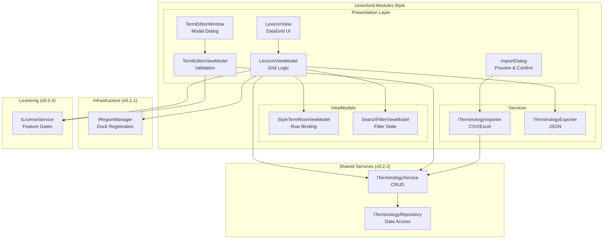
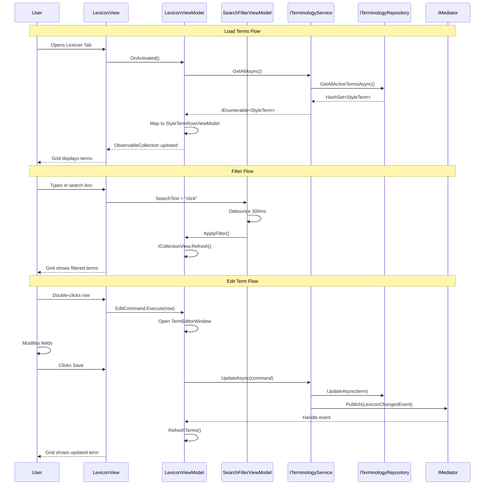

# LCS-SBD-025: Scope Breakdown - v0.2.5 The Librarian (Management UI)

## Document Control

| Field            | Value                                                        |
| :--------------- | :----------------------------------------------------------- |
| **Document ID**  | LCS-SBD-025                                                  |
| **Version**      | v0.2.5                                                       |
| **Codename**     | The Librarian (Terminology Management UI)                    |
| **Status**       | Draft                                                        |
| **Last Updated** | 2026-01-26                                                   |
| **Owner**        | Lead Architect                                               |
| **Depends On**   | v0.2.2 (Terminology Database), v0.1.1 (Layout Engine)        |

---

## 1. Executive Summary

### 1.1 The Vision

**v0.2.5** delivers the **Librarian** - a comprehensive GUI for managing style terminology rules without writing SQL. This release transforms the Terminology Database from a developer-only feature into an end-user capability, enabling WriterPro users to curate custom style guides through an intuitive Avalonia-based interface.

### 1.2 Business Value

- **Accessibility:** Non-technical users can add, edit, and remove style rules through a visual interface.
- **Efficiency:** DataGrid-based browsing with sorting and filtering replaces manual database queries.
- **Quality Control:** Regex validation prevents invalid patterns from corrupting the lexicon.
- **Team Collaboration:** Import/Export enables sharing terminology libraries between teams.
- **Enterprise Ready:** Custom organizational style guides without developer intervention.

### 1.3 The Success Criteria

This release succeeds when:

1. `LexiconView` displays all terms in a sortable Avalonia.DataGrid.
2. Users can filter terms by search text, severity, and active/deprecated status.
3. Modal dialog validates regex patterns before allowing Save.
4. CSV/Excel import adds terms in bulk; JSON export creates shareable libraries.

### 1.4 License Gating

The Librarian is a **WriterPro** feature. Core and Writer tiers will see:

- Read-only access to seed terms (no edit capability)
- "Upgrade to WriterPro" prompt when attempting modifications
- Import/Export buttons disabled with upgrade tooltip

---

## 2. Dependencies on Prior Versions

| Component                | Source Version | Usage in v0.2.5                                  |
| :----------------------- | :------------- | :----------------------------------------------- |
| `ITerminologyRepository` | v0.2.2b        | Data access for term CRUD operations             |
| `ITerminologyService`    | v0.2.2d        | Business logic and event publication             |
| `StyleTerm`              | v0.2.2b        | Entity model displayed in DataGrid               |
| `LexiconChangedEvent`    | v0.2.2d        | Refresh grid when terms change                   |
| `IRegionManager`         | v0.1.1b        | Register LexiconView in Right dock region        |
| `ILayoutService`         | v0.1.1c        | Persist panel state                              |
| `ILicenseContext`        | v0.0.4c        | Read-only license tier check                     |
| `ILicenseService`        | v0.1.6c        | Gate WriterPro features (extends ILicenseContext)|
| `IMediator`              | v0.0.7a        | Handle LexiconChangedEvent for refresh           |

---

## 3. Sub-Part Specifications

### 3.1 v0.2.5a: Terminology Grid View

| Field            | Value                                     |
| :--------------- | :---------------------------------------- |
| **Sub-Part ID**  | INF-025a                                  |
| **Title**        | Terminology Grid View                     |
| **Module**       | `Lexichord.Modules.Style`                 |
| **License Tier** | WriterPro (read-only for lower tiers)     |

**Goal:** Create a "Lexicon" tab/dock view using Avalonia.DataGrid to list all terms with sorting by Severity and Category.

**Key Deliverables:**
- `LexiconView.axaml` with Avalonia.DataGrid control
- `LexiconViewModel` with `ObservableCollection<StyleTermRowViewModel>`
- Column definitions: Pattern, Recommendation (truncated), Category, Severity, Active
- Sorting support for all columns
- Double-click row to open edit dialog
- Context menu: Edit, Delete, Toggle Active
- Selection binding for toolbar commands

**Key UI Components:**
```
+------------------------------------------------------------------+
|  Lexicon                                               [?] [_] [x]|
+------------------------------------------------------------------+
| [+ Add] [Edit] [Delete]  | [Import v] [Export v] | [Filter... ]   |
+------------------------------------------------------------------+
| Pattern          | Recommendation     | Category    | Severity    |
|------------------|--------------------+-------------+-------------|
| click on         | Use 'select' ins...| Terminology | warning     |
| e-mail           | Use 'email' (no ...| Terminology | suggestion  |
| utilize          | Use 'use' instead  | Clarity     | suggestion  |
+------------------------------------------------------------------+
| 127 terms (3 filtered) | WriterPro                                |
+------------------------------------------------------------------+
```

**Dependencies:**
- v0.2.2b: `ITerminologyRepository` for loading terms
- v0.1.1b: `IRegionManager` for docking

---

### 3.2 v0.2.5b: Search & Filter

| Field            | Value                                     |
| :--------------- | :---------------------------------------- |
| **Sub-Part ID**  | INF-025b                                  |
| **Title**        | Search & Filter                           |
| **Module**       | `Lexichord.Modules.Style`                 |
| **License Tier** | Core (available to all tiers)             |

**Goal:** Search bar to filter terms with checkboxes to toggle "Show Deprecated" and "Show Forbidden" visibility.

**Key Deliverables:**
- `SearchFilterViewModel` with filter properties
- Real-time filtering as user types (debounced 300ms)
- `ICollectionView` filtering on Pattern, Recommendation, Category
- Checkbox: "Show Deprecated" (is_active = false)
- Checkbox: "Show Forbidden" (severity = 'error')
- Category dropdown filter
- Severity dropdown filter
- Clear filters button
- Filter state persistence in user settings

**Filter Logic:**
```
DISPLAY term IF:
  (search_text is empty OR term.Pattern CONTAINS search_text OR term.Recommendation CONTAINS search_text)
  AND (show_deprecated OR term.IsActive = true)
  AND (category_filter is empty OR term.Category = category_filter)
  AND (severity_filter is empty OR term.Severity = severity_filter)
```

**Dependencies:**
- v0.2.5a: LexiconView (provides grid to filter)
- v0.0.3d: `IConfigurationService` for persisting filter state

---

### 3.3 v0.2.5c: Term Editor Dialog

| Field            | Value                                     |
| :--------------- | :---------------------------------------- |
| **Sub-Part ID**  | INF-025c                                  |
| **Title**        | Term Editor Dialog                        |
| **Module**       | `Lexichord.Modules.Style`                 |
| **License Tier** | WriterPro                                 |

**Goal:** Modal dialog to Add/Edit term with regex validation. Show validation error if invalid pattern and prevent Save.

**Key Deliverables:**
- `TermEditorWindow.axaml` modal dialog
- `TermEditorViewModel` with validation logic
- Pattern field with real-time regex validation
- Validation error message display
- Preview: test pattern against sample text
- Recommendation field (multiline)
- Category dropdown (with custom entry option)
- Severity dropdown (error, warning, suggestion, info)
- Match Case checkbox
- Is Active checkbox
- Save button disabled until valid
- Cancel button with dirty state confirmation

**Validation Rules:**
1. Pattern is required (non-empty)
2. Pattern must be valid regex (compile test)
3. Pattern must not exceed 500 characters
4. Pattern must not be catastrophically complex (timeout test)
5. Recommendation is required
6. Category is required

**Dialog Layout:**
```
+--------------------------------------------------+
|  Edit Term                               [X]     |
+--------------------------------------------------+
| Pattern:*                                        |
| [click\s+on                               ] [!]  |
| Error: Invalid regex - missing closing bracket   |
|                                                  |
| Recommendation:*                                 |
| +----------------------------------------------+ |
| | Use 'select' instead of 'click on' for      | |
| | touchscreen compatibility.                   | |
| +----------------------------------------------+ |
|                                                  |
| Category:*      [Terminology          v]         |
| Severity:       [warning              v]         |
|                                                  |
| [x] Match Case    [ ] Is Active (deprecated)     |
|                                                  |
| Test Pattern:                                    |
| [Please click on the button to continue]         |
| Match found at position 7-15: "click on"         |
|                                                  |
+--------------------------------------------------+
|                          [Cancel]  [Save]        |
+--------------------------------------------------+
```

**Dependencies:**
- v0.2.2d: `ITerminologyService.CreateAsync()` / `UpdateAsync()`
- v0.0.4c: `ILicenseService` for feature gate check

---

### 3.4 v0.2.5d: Bulk Import/Export

| Field            | Value                                     |
| :--------------- | :---------------------------------------- |
| **Sub-Part ID**  | INF-025d                                  |
| **Title**        | Bulk Import/Export                        |
| **Module**       | `Lexichord.Modules.Style`                 |
| **License Tier** | WriterPro                                 |

**Goal:** Import terms from CSV/Excel files and export current database to JSON for sharing between teams.

**Key Deliverables:**
- `ITerminologyImporter` interface and implementations
- `CsvTerminologyImporter` for CSV files
- `ExcelTerminologyImporter` for .xlsx files (using ClosedXML)
- `ITerminologyExporter` interface and implementations
- `JsonTerminologyExporter` for JSON export
- Import preview dialog showing rows to be added
- Conflict resolution: Skip, Overwrite, Rename
- Progress reporting for large imports
- Export format selection: JSON (full), JSON (minimal), CSV
- Include/exclude filters for export

**CSV Format:**
```csv
pattern,recommendation,category,severity,match_case
"click on","Use 'select' instead","Terminology","warning",false
"e-mail","Use 'email' (no hyphen)","Terminology","suggestion",false
```

**JSON Export Format:**
```json
{
  "version": "1.0",
  "exported_at": "2026-01-26T10:30:00Z",
  "exported_by": "Lexichord v0.2.5",
  "term_count": 127,
  "terms": [
    {
      "pattern": "click on",
      "match_case": false,
      "recommendation": "Use 'select' instead",
      "category": "Terminology",
      "severity": "warning"
    }
  ]
}
```

**Import Dialog:**
```
+--------------------------------------------------+
|  Import Terms                            [X]     |
+--------------------------------------------------+
| File: [C:\style-guide.csv           ] [Browse]   |
|                                                  |
| Preview (first 10 rows):                         |
| +----------------------------------------------+ |
| | [x] click on    | Terminology | warning      | |
| | [x] e-mail      | Terminology | suggestion   | |
| | [ ] utilize     | (duplicate - skip)         | |
| +----------------------------------------------+ |
|                                                  |
| Found: 45 terms, 3 duplicates, 2 invalid         |
|                                                  |
| On Conflict: ( ) Skip  (x) Overwrite  ( ) Rename |
|                                                  |
+--------------------------------------------------+
|                   [Cancel]  [Import 42 Terms]    |
+--------------------------------------------------+
```

**Dependencies:**
- v0.2.2d: `ITerminologyService` for bulk insert
- ClosedXML NuGet package for Excel support
- Avalonia file dialogs for file selection

---

## 4. Implementation Checklist

| #  | Sub-Part | Task                                            | Est. Hours |
| :- | :------- | :---------------------------------------------- | :--------- |
| 1  | v0.2.5a  | Create `LexiconView.axaml` with DataGrid        | 4          |
| 2  | v0.2.5a  | Implement `LexiconViewModel`                    | 3          |
| 3  | v0.2.5a  | Create `StyleTermRowViewModel`                  | 1          |
| 4  | v0.2.5a  | Implement column sorting                        | 2          |
| 5  | v0.2.5a  | Add context menu actions                        | 2          |
| 6  | v0.2.5a  | Register view with IRegionManager               | 1          |
| 7  | v0.2.5a  | Unit tests for ViewModel                        | 2          |
| 8  | v0.2.5b  | Create `SearchFilterViewModel`                  | 2          |
| 9  | v0.2.5b  | Implement ICollectionView filtering             | 3          |
| 10 | v0.2.5b  | Add debounced search input                      | 1          |
| 11 | v0.2.5b  | Implement filter checkboxes                     | 1          |
| 12 | v0.2.5b  | Add category/severity dropdowns                 | 2          |
| 13 | v0.2.5b  | Persist filter state                            | 1          |
| 14 | v0.2.5b  | Unit tests for filtering                        | 2          |
| 15 | v0.2.5c  | Create `TermEditorWindow.axaml`                 | 3          |
| 16 | v0.2.5c  | Implement `TermEditorViewModel`                 | 3          |
| 17 | v0.2.5c  | Implement regex validation                      | 2          |
| 18 | v0.2.5c  | Add pattern test preview                        | 2          |
| 19 | v0.2.5c  | Wire Save/Cancel with dirty state               | 1          |
| 20 | v0.2.5c  | Integrate license gating                        | 1          |
| 21 | v0.2.5c  | Unit tests for validation                       | 2          |
| 22 | v0.2.5d  | Define `ITerminologyImporter` interface         | 1          |
| 23 | v0.2.5d  | Implement `CsvTerminologyImporter`              | 3          |
| 24 | v0.2.5d  | Implement `ExcelTerminologyImporter`            | 3          |
| 25 | v0.2.5d  | Define `ITerminologyExporter` interface         | 1          |
| 26 | v0.2.5d  | Implement `JsonTerminologyExporter`             | 2          |
| 27 | v0.2.5d  | Create import preview dialog                    | 3          |
| 28 | v0.2.5d  | Implement conflict resolution                   | 2          |
| 29 | v0.2.5d  | Add progress reporting                          | 1          |
| 30 | v0.2.5d  | Unit tests for import/export                    | 3          |
| 31 | All      | Integration tests                               | 4          |
| 32 | All      | Update module registration                      | 1          |
| **Total** |   |                                                 | **64 hours** |

---

## 5. Architecture Diagram



---

## 6. Data Flow Diagram



---

## 7. Risks & Mitigations

| Risk | Impact | Probability | Mitigation |
| :--- | :----- | :---------- | :--------- |
| DataGrid performance with 10,000+ terms | Medium | Medium | Implement virtualization; paginate if needed |
| Regex validation bypassed via import | High | Low | Validate all imported patterns before insert |
| Excel file corrupted or malformed | Medium | Medium | Robust error handling; preview before import |
| Large import blocks UI thread | High | Medium | Use async/await; show progress dialog |
| User loses unsaved changes | Medium | Low | Confirm before closing dirty editor |
| License check latency affects UX | Low | Low | Cache license state; async check |

---

## 8. Success Metrics

| Metric | Target | Measurement |
| :----- | :----- | :---------- |
| Grid load time (500 terms) | < 200ms | Stopwatch timing |
| Filter response time | < 100ms | Debounce + refresh timing |
| Import 100 terms | < 2s | Progress dialog timing |
| Export 1000 terms to JSON | < 1s | File write timing |
| Memory usage (grid with 1000 rows) | < 50MB | Memory profiler |

---

## 9. What This Enables

After v0.2.5, Lexichord will support:

- **v0.2.6:** Style Analysis Engine can use user-defined terms
- **v0.2.7:** Real-time style checking during document editing
- **v0.3.x:** Custom style profiles (organization-specific)
- **v0.4.x:** Style guide templates marketplace
- **Future:** AI-assisted term suggestion based on writing patterns

---

## 10. Verification Commands

```bash
# 1. Build and run
dotnet build
dotnet run --project src/Lexichord.Host

# 2. Verify Lexicon tab appears in Right dock region
# Expected: "Lexicon" tab visible with DataGrid

# 3. Test sorting
# Click "Severity" column header
# Expected: Terms sorted by severity (error -> info)

# 4. Test filtering
# Type "click" in search box
# Expected: Only terms containing "click" shown

# 5. Test Add dialog
# Click [+ Add] button
# Expected: Modal dialog opens
# Enter invalid regex: "click["
# Expected: Error message, Save button disabled

# 6. Test Import
# Click [Import] > CSV
# Select test CSV file
# Expected: Preview dialog shows parsed terms

# 7. Test Export
# Click [Export] > JSON
# Select destination
# Expected: JSON file created with all terms

# 8. Run unit tests
dotnet test --filter "FullyQualifiedName~Lexicon"

# 9. Run integration tests
dotnet test --filter "Category=Integration&FullyQualifiedName~Lexicon"
```

---

## 11. Deliverable Checklist

| #  | Deliverable                                                    | Status |
| :- | :------------------------------------------------------------- | :----- |
| 1  | `LexiconView.axaml` with Avalonia.DataGrid                     | [ ]    |
| 2  | `LexiconViewModel` with term loading and commands              | [ ]    |
| 3  | `StyleTermRowViewModel` for grid row binding                   | [ ]    |
| 4  | Column sorting on all columns                                  | [ ]    |
| 5  | Context menu: Edit, Delete, Toggle Active                      | [ ]    |
| 6  | `SearchFilterViewModel` with filter logic                      | [ ]    |
| 7  | Debounced search text filtering                                | [ ]    |
| 8  | Show Deprecated checkbox filter                                | [ ]    |
| 9  | Category dropdown filter                                       | [ ]    |
| 10 | Severity dropdown filter                                       | [ ]    |
| 11 | `TermEditorWindow.axaml` modal dialog                          | [ ]    |
| 12 | `TermEditorViewModel` with validation                          | [ ]    |
| 13 | Regex pattern validation with error display                    | [ ]    |
| 14 | Pattern test preview feature                                   | [ ]    |
| 15 | Save button disabled until valid                               | [ ]    |
| 16 | WriterPro license gate on edit features                        | [ ]    |
| 17 | `ITerminologyImporter` interface                               | [ ]    |
| 18 | `CsvTerminologyImporter` implementation                        | [ ]    |
| 19 | `ExcelTerminologyImporter` implementation                      | [ ]    |
| 20 | Import preview dialog                                          | [ ]    |
| 21 | Conflict resolution (Skip/Overwrite/Rename)                    | [ ]    |
| 22 | `ITerminologyExporter` interface                               | [ ]    |
| 23 | `JsonTerminologyExporter` implementation                       | [ ]    |
| 24 | Export format selection                                        | [ ]    |
| 25 | Unit tests for LexiconViewModel                                | [ ]    |
| 26 | Unit tests for SearchFilterViewModel                           | [ ]    |
| 27 | Unit tests for TermEditorViewModel                             | [ ]    |
| 28 | Unit tests for importers/exporters                             | [ ]    |
| 29 | Integration tests for full workflow                            | [ ]    |
| 30 | View registered in Right dock region via IRegionManager        | [ ]    |
