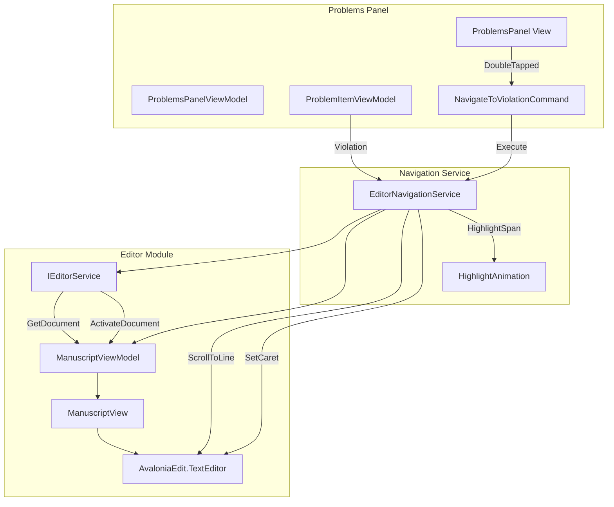
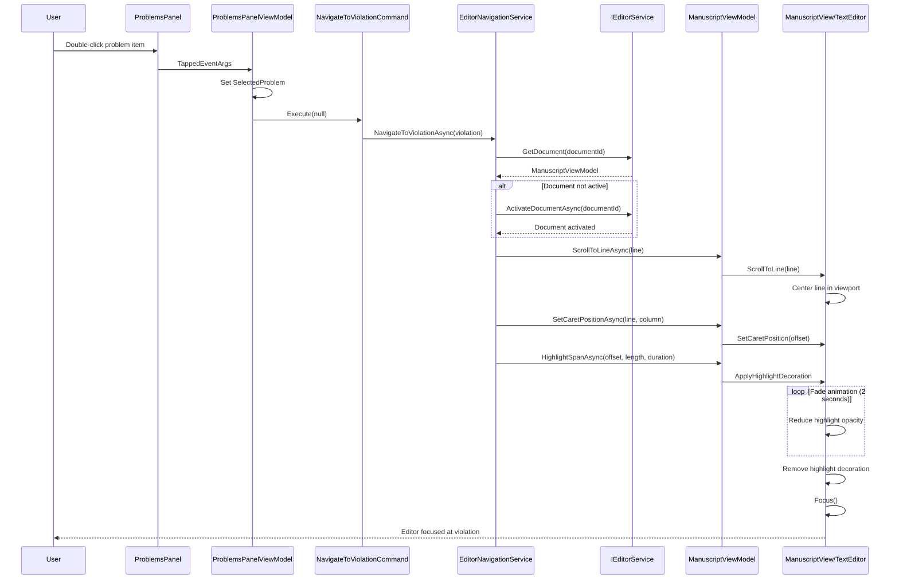

# LCS-DES-026b: Sub-Part Specification — Navigation Sync

## 1. Metadata & Categorization

| Field              | Value                                | Description                            |
| :----------------- | :----------------------------------- | :------------------------------------- |
| **Document ID**    | LCS-DES-026b                         | Design Specification v0.2.6b           |
| **Sub-Part ID**    | INF-026b                             | Navigation Sync (Double-Click to Line) |
| **Parent Feature** | INF-026 (Sidebar Real-Time Feedback) | Main feature specification             |
| **Target Version** | `v0.2.6b`                            | Second sub-part of v0.2.6              |
| **Module Scope**   | `Lexichord.Modules.Style`            | Style governance module                |
| **License Tier**   | `Core`                               | Foundation (Available in Free tier)    |
| **Author**         | System Architect                     |                                        |
| **Status**         | **Draft**                            | Pending implementation                 |
| **Last Updated**   | 2026-01-27                           |                                        |

---

## 2. Executive Summary

### 2.1 The Requirement

When writers see a violation in the Problems Panel, they need to quickly jump to that exact location in their document. Without navigation support, writers must:

- Manually scroll through the document
- Search for the violating text
- Count lines to find the location
- Lose context switching between panel and editor

### 2.2 The Proposed Solution

We **SHALL** implement Navigation Sync that:

1. Navigates to violation location on double-click
2. Sets caret position at exact line and column
3. Highlights the violation span temporarily (2 seconds)
4. Activates the correct document (for multi-document scenarios)
5. Supports keyboard navigation (Enter key)

---

## 3. Architecture

### 3.1 Component Diagram



### 3.2 Navigation Sequence



### 3.3 Dependencies

| Component              | Source  | Usage                             |
| :--------------------- | :------ | :-------------------------------- |
| `ProblemItemViewModel` | v0.2.6a | Source of navigation coordinates  |
| `StyleViolation`       | v0.2.3a | Line, Column, StartOffset, Length |
| `IEditorService`       | v0.1.3  | Document access and activation    |
| `ManuscriptViewModel`  | v0.1.3a | Scroll and caret control          |
| `ManuscriptView`       | v0.2.4a | TextEditor control                |

---

## 4. Decision Tree

```text
START: "User double-clicks problem item (or presses Enter)"
|
+-- Is SelectedProblem null?
|   +-- YES -> Exit (nothing to navigate to)
|   +-- NO -> Continue
|
+-- Extract coordinates from SelectedProblem.Violation
|   +-- DocumentId: Target document identifier
|   +-- Line: 1-based line number
|   +-- Column: 1-based column number
|   +-- StartOffset: 0-based character offset
|   +-- Length: Number of characters in violation
|
+-- Call EditorNavigationService.NavigateToViolationAsync()
|
+-- Get document from IEditorService
|   +-- Document not found?
|       +-- YES -> Log warning, show toast error, return false
|       +-- NO -> Continue
|
+-- Is document the active document?
|   +-- NO -> Call IEditorService.ActivateDocumentAsync()
|       +-- Wait for document to become active
|   +-- YES -> Continue
|
+-- Calculate editor offset from line/column
|   +-- offset = Document.GetOffsetFromLineColumn(line, column)
|
+-- Scroll editor to make line visible
|   +-- ManuscriptViewModel.ScrollToLineAsync(line)
|   +-- Target: Center line in viewport
|
+-- Set caret position
|   +-- ManuscriptViewModel.SetCaretPositionAsync(line, column)
|   +-- Move caret to exact position
|
+-- Apply highlight decoration
|   +-- ManuscriptViewModel.HighlightSpanAsync(offset, length, duration)
|   +-- Color: Yellow (#FFF59D) with opacity 0.5
|   +-- Fade: Linear fade over duration (2 seconds)
|
+-- Focus editor control
|   +-- ManuscriptView.Focus()
|
+-- Return true (navigation successful)
|
END
```

---

## 5. Data Contracts

### 5.1 IEditorNavigationService Interface

```csharp
namespace Lexichord.Abstractions.Contracts;

using System;
using System.Threading;
using System.Threading.Tasks;

/// <summary>
/// Service for navigating the editor to specific locations.
/// </summary>
/// <remarks>
/// LOGIC: IEditorNavigationService provides a unified API for navigating
/// to specific locations in documents. It coordinates with IEditorService
/// for document access and ManuscriptViewModel for scroll/caret control.
///
/// Key Behaviors:
/// 1. Document Activation: If target document is not active, activates it first
/// 2. Scroll Centering: Scrolls so target line is centered in viewport
/// 3. Caret Positioning: Places caret at exact line and column
/// 4. Highlight Animation: Temporarily highlights the violation span
/// 5. Focus Management: Focuses editor after navigation
///
/// Thread Safety:
/// - All methods are async and marshal to UI thread via Dispatcher
/// - Safe to call from background threads (e.g., command handlers)
///
/// Error Handling:
/// - Returns false if document not found (does not throw)
/// - Logs warnings for failed navigations
/// </remarks>
public interface IEditorNavigationService
{
    /// <summary>
    /// Navigates to a specific line and column in a document.
    /// </summary>
    /// <param name="documentId">The document ID to navigate to.</param>
    /// <param name="line">Line number (1-based).</param>
    /// <param name="column">Column number (1-based).</param>
    /// <param name="length">Optional selection length for highlighting.</param>
    /// <param name="cancellationToken">Cancellation token.</param>
    /// <returns>True if navigation succeeded, false if document not found.</returns>
    /// <remarks>
    /// LOGIC: Navigation sequence:
    /// 1. Find document by ID via IEditorService.GetDocument()
    /// 2. If document not active, call IEditorService.ActivateDocumentAsync()
    /// 3. Calculate offset: Document.GetOffsetFromLineColumn(line, column)
    /// 4. Scroll to line: ManuscriptViewModel.ScrollToLineAsync(line)
    /// 5. Set caret: ManuscriptViewModel.SetCaretPositionAsync(line, column)
    /// 6. If length provided, select text span
    /// 7. Focus editor: ManuscriptView.Focus()
    /// </remarks>
    Task<bool> NavigateToAsync(
        string documentId,
        int line,
        int column,
        int? length = null,
        CancellationToken cancellationToken = default);

    /// <summary>
    /// Navigates to a specific document offset.
    /// </summary>
    /// <param name="documentId">The document ID.</param>
    /// <param name="offset">Document offset (0-based character position).</param>
    /// <param name="length">Optional selection length.</param>
    /// <param name="cancellationToken">Cancellation token.</param>
    /// <returns>True if navigation succeeded.</returns>
    /// <remarks>
    /// LOGIC: Used when offset is known directly (e.g., from search results).
    /// Converts offset to line/column internally.
    /// </remarks>
    Task<bool> NavigateToOffsetAsync(
        string documentId,
        int offset,
        int? length = null,
        CancellationToken cancellationToken = default);

    /// <summary>
    /// Navigates to and highlights a style violation.
    /// </summary>
    /// <param name="violation">The violation to navigate to.</param>
    /// <param name="highlightDuration">Duration of highlight animation (default 2s).</param>
    /// <param name="cancellationToken">Cancellation token.</param>
    /// <returns>True if navigation succeeded.</returns>
    /// <remarks>
    /// LOGIC: Convenience method for Problems Panel navigation:
    /// 1. Extracts coordinates from violation.Line, violation.Column
    /// 2. Navigates to position
    /// 3. Applies temporary yellow highlight to violation.StartOffset..Length
    /// 4. Fades highlight over highlightDuration
    ///
    /// Highlight Styling:
    /// - Background color: #FFF59D (Material Yellow 200) at 50% opacity
    /// - Fade: Linear opacity fade from 0.5 to 0 over duration
    /// - Removed automatically after animation completes
    /// </remarks>
    Task<bool> NavigateToViolationAsync(
        StyleViolation violation,
        TimeSpan? highlightDuration = null,
        CancellationToken cancellationToken = default);

    /// <summary>
    /// Gets whether a document is currently navigable (open and accessible).
    /// </summary>
    /// <param name="documentId">The document ID to check.</param>
    /// <returns>True if document can be navigated to.</returns>
    /// <remarks>
    /// LOGIC: Checks if document exists in IEditorService.
    /// Does not check if document is active, only if it's open.
    /// </remarks>
    bool CanNavigateTo(string documentId);
}
```

### 5.2 EditorNavigationService Implementation

```csharp
namespace Lexichord.Modules.Style.Services;

using System;
using System.Threading;
using System.Threading.Tasks;
using Avalonia.Threading;
using Lexichord.Abstractions.Contracts;
using Microsoft.Extensions.Logging;

/// <summary>
/// Service for navigating the editor to specific locations.
/// </summary>
/// <remarks>
/// LOGIC: EditorNavigationService coordinates navigation between
/// the Problems Panel and the editor. It handles:
/// - Document lookup and activation
/// - Scroll positioning
/// - Caret placement
/// - Temporary highlight animations
///
/// Thread Safety:
/// - All UI operations marshal to Avalonia dispatcher
/// - Safe to call from any thread
///
/// Dependencies:
/// - IEditorService: Document access and lifecycle
/// - ILogger: Diagnostic logging
/// </remarks>
public class EditorNavigationService : IEditorNavigationService
{
    private readonly IEditorService _editorService;
    private readonly ILogger<EditorNavigationService> _logger;

    private static readonly TimeSpan DefaultHighlightDuration = TimeSpan.FromSeconds(2);
    private const string HighlightColor = "#FFF59D"; // Material Yellow 200
    private const double HighlightOpacity = 0.5;

    public EditorNavigationService(
        IEditorService editorService,
        ILogger<EditorNavigationService> logger)
    {
        _editorService = editorService ?? throw new ArgumentNullException(nameof(editorService));
        _logger = logger ?? throw new ArgumentNullException(nameof(logger));
    }

    /// <inheritdoc />
    public async Task<bool> NavigateToAsync(
        string documentId,
        int line,
        int column,
        int? length = null,
        CancellationToken cancellationToken = default)
    {
        _logger.LogInformation("Navigating to {DocumentId}:{Line}:{Column}", documentId, line, column);

        // LOGIC: Step 1 - Get document
        var document = _editorService.GetDocument(documentId);
        if (document is null)
        {
            _logger.LogWarning("Navigation failed: document {DocumentId} not found", documentId);
            return false;
        }

        try
        {
            // LOGIC: Step 2 - Activate document if not active
            if (_editorService.ActiveDocumentId != documentId)
            {
                _logger.LogDebug("Activating document {DocumentId}", documentId);
                await _editorService.ActivateDocumentAsync(documentId);
                // Wait a bit for UI to update
                await Task.Delay(50, cancellationToken);
            }

            // LOGIC: Step 3 - Scroll to line (centered in viewport)
            await Dispatcher.UIThread.InvokeAsync(async () =>
            {
                await document.ScrollToLineAsync(line);
            });

            // LOGIC: Step 4 - Set caret position
            await Dispatcher.UIThread.InvokeAsync(async () =>
            {
                await document.SetCaretPositionAsync(line, column);
            });

            // LOGIC: Step 5 - Select text if length provided
            if (length.HasValue && length.Value > 0)
            {
                await Dispatcher.UIThread.InvokeAsync(async () =>
                {
                    var offset = document.GetOffsetFromLineColumn(line, column);
                    await document.SelectTextAsync(offset, length.Value);
                });
            }

            // LOGIC: Step 6 - Focus editor
            await Dispatcher.UIThread.InvokeAsync(() =>
            {
                document.Focus();
            });

            _logger.LogDebug(
                "Document {DocumentId} activated, scrolled to offset at line {Line}",
                documentId, line);

            return true;
        }
        catch (Exception ex)
        {
            _logger.LogError(ex, "Navigation exception for {DocumentId}: {Message}", documentId, ex.Message);
            return false;
        }
    }

    /// <inheritdoc />
    public async Task<bool> NavigateToOffsetAsync(
        string documentId,
        int offset,
        int? length = null,
        CancellationToken cancellationToken = default)
    {
        var document = _editorService.GetDocument(documentId);
        if (document is null)
        {
            _logger.LogWarning("Navigation failed: document {DocumentId} not found", documentId);
            return false;
        }

        // LOGIC: Convert offset to line/column
        var (line, column) = document.GetLineColumnFromOffset(offset);

        return await NavigateToAsync(documentId, line, column, length, cancellationToken);
    }

    /// <inheritdoc />
    public async Task<bool> NavigateToViolationAsync(
        StyleViolation violation,
        TimeSpan? highlightDuration = null,
        CancellationToken cancellationToken = default)
    {
        if (violation is null)
        {
            _logger.LogWarning("NavigateToViolationAsync called with null violation");
            return false;
        }

        var duration = highlightDuration ?? DefaultHighlightDuration;

        _logger.LogInformation(
            "Navigating to violation {ViolationId} at {DocumentId}:{Line}:{Column}",
            violation.Id, violation.DocumentId, violation.Line, violation.Column);

        // LOGIC: Navigate to position
        var navigationSucceeded = await NavigateToAsync(
            violation.DocumentId,
            violation.Line,
            violation.Column,
            violation.Length,
            cancellationToken);

        if (!navigationSucceeded)
        {
            return false;
        }

        // LOGIC: Apply highlight animation
        var document = _editorService.GetDocument(violation.DocumentId);
        if (document is not null)
        {
            await Dispatcher.UIThread.InvokeAsync(async () =>
            {
                await document.HighlightSpanAsync(
                    violation.StartOffset,
                    violation.Length,
                    duration,
                    HighlightColor,
                    HighlightOpacity);
            });
        }

        return true;
    }

    /// <inheritdoc />
    public bool CanNavigateTo(string documentId)
    {
        return _editorService.GetDocument(documentId) is not null;
    }
}
```

### 5.3 ManuscriptViewModel Navigation Extensions

```csharp
namespace Lexichord.Modules.Editor.ViewModels;

// Extensions to ManuscriptViewModel for navigation support (added in v0.2.6b)

public partial class ManuscriptViewModel
{
    /// <summary>
    /// Scrolls the editor to center a specific line in the viewport.
    /// </summary>
    /// <param name="line">1-based line number.</param>
    /// <remarks>
    /// LOGIC: Calculates scroll offset to center the target line:
    /// scrollOffset = (line - visibleLines/2) * lineHeight
    /// Clamps to valid scroll range [0, maxScroll]
    /// </remarks>
    public Task ScrollToLineAsync(int line)
    {
        if (_textEditor is null) return Task.CompletedTask;

        // LOGIC: Center line in viewport
        var visualLine = _textEditor.TextArea.TextView.GetVisualLine(line);
        if (visualLine is not null)
        {
            var viewportHeight = _textEditor.TextArea.TextView.ActualHeight;
            var lineTop = visualLine.VisualTop;
            var targetScroll = lineTop - (viewportHeight / 2) + (visualLine.Height / 2);

            _textEditor.ScrollToVerticalOffset(Math.Max(0, targetScroll));
        }
        else
        {
            // Fallback: use built-in ScrollTo
            _textEditor.ScrollTo(line, 0);
        }

        return Task.CompletedTask;
    }

    /// <summary>
    /// Sets the caret position to a specific line and column.
    /// </summary>
    /// <param name="line">1-based line number.</param>
    /// <param name="column">1-based column number.</param>
    public Task SetCaretPositionAsync(int line, int column)
    {
        if (_textEditor is null) return Task.CompletedTask;

        var offset = GetOffsetFromLineColumn(line, column);
        _textEditor.TextArea.Caret.Offset = offset;
        _textEditor.TextArea.Caret.BringCaretToView();

        return Task.CompletedTask;
    }

    /// <summary>
    /// Converts line/column to document offset.
    /// </summary>
    /// <param name="line">1-based line number.</param>
    /// <param name="column">1-based column number.</param>
    /// <returns>0-based character offset.</returns>
    public int GetOffsetFromLineColumn(int line, int column)
    {
        if (_textEditor?.Document is null) return 0;

        var docLine = _textEditor.Document.GetLineByNumber(Math.Max(1, Math.Min(line, _textEditor.Document.LineCount)));
        var lineOffset = docLine.Offset;
        var maxColumn = docLine.Length;
        var adjustedColumn = Math.Max(0, Math.Min(column - 1, maxColumn));

        return lineOffset + adjustedColumn;
    }

    /// <summary>
    /// Converts document offset to line/column.
    /// </summary>
    /// <param name="offset">0-based character offset.</param>
    /// <returns>Tuple of (1-based line, 1-based column).</returns>
    public (int Line, int Column) GetLineColumnFromOffset(int offset)
    {
        if (_textEditor?.Document is null) return (1, 1);

        var location = _textEditor.Document.GetLocation(Math.Max(0, Math.Min(offset, _textEditor.Document.TextLength)));
        return (location.Line, location.Column);
    }

    /// <summary>
    /// Selects a text span.
    /// </summary>
    /// <param name="offset">Start offset (0-based).</param>
    /// <param name="length">Selection length.</param>
    public Task SelectTextAsync(int offset, int length)
    {
        if (_textEditor is null) return Task.CompletedTask;

        _textEditor.Select(offset, length);
        return Task.CompletedTask;
    }

    /// <summary>
    /// Applies a temporary highlight to a text span with fade animation.
    /// </summary>
    /// <param name="offset">Start offset (0-based).</param>
    /// <param name="length">Span length.</param>
    /// <param name="duration">Fade duration.</param>
    /// <param name="color">Highlight color (hex).</param>
    /// <param name="opacity">Initial opacity (0-1).</param>
    /// <remarks>
    /// LOGIC: Creates a TextMarkerService decoration:
    /// 1. Adds yellow background marker at offset..offset+length
    /// 2. Starts opacity animation from initial to 0
    /// 3. Removes marker when animation completes
    ///
    /// Implementation uses AvaloniaEdit's ITextMarkerService or
    /// custom IBackgroundRenderer for the highlight effect.
    /// </remarks>
    public async Task HighlightSpanAsync(
        int offset,
        int length,
        TimeSpan duration,
        string color = "#FFF59D",
        double opacity = 0.5)
    {
        if (_textEditor is null) return;

        // LOGIC: Create highlight marker
        var marker = _markerService.Create(offset, length);
        marker.BackgroundColor = Color.Parse(color);
        marker.MarkerType = TextMarkerTypes.None;

        // LOGIC: Animate opacity fade
        var startTime = DateTime.UtcNow;
        var endTime = startTime + duration;

        while (DateTime.UtcNow < endTime)
        {
            var elapsed = DateTime.UtcNow - startTime;
            var progress = elapsed.TotalMilliseconds / duration.TotalMilliseconds;
            var currentOpacity = opacity * (1 - progress);

            marker.BackgroundColor = Color.Parse(color).WithAlpha((byte)(currentOpacity * 255));
            _textEditor.TextArea.TextView.InvalidateLayer(KnownLayer.Background);

            await Task.Delay(16); // ~60fps
        }

        // LOGIC: Remove marker
        _markerService.Remove(marker);
    }

    /// <summary>
    /// Focuses the editor control.
    /// </summary>
    public void Focus()
    {
        _textEditor?.Focus();
    }
}
```

---

## 6. Implementation Logic

### 6.1 NavigateToViolationCommand

```csharp
namespace Lexichord.Modules.Style.Commands;

using System.Threading.Tasks;
using CommunityToolkit.Mvvm.Input;
using Lexichord.Abstractions.Contracts;

/// <summary>
/// Command to navigate to a selected violation.
/// </summary>
/// <remarks>
/// LOGIC: Bound to double-click and Enter key in Problems Panel.
/// Executes navigation via IEditorNavigationService.
/// </remarks>
public partial class ProblemsPanelViewModel
{
    private async Task NavigateToSelectedViolationAsync()
    {
        // LOGIC: Guard - ensure we have a selection
        if (SelectedProblem is null)
        {
            _logger.LogDebug("NavigateToViolation called with no selection");
            return;
        }

        var violation = SelectedProblem.Violation;
        _logger.LogInformation(
            "Executing NavigateToViolation for {ViolationId} at {Line}:{Column}",
            violation.Id, violation.Line, violation.Column);

        // LOGIC: Check if navigation is possible
        if (!_navigationService.CanNavigateTo(violation.DocumentId))
        {
            _logger.LogWarning(
                "Cannot navigate to document {DocumentId} - document not open",
                violation.DocumentId);

            // Show toast notification
            await ShowToastAsync("Document not open", "The document containing this violation is not currently open.");
            return;
        }

        // LOGIC: Execute navigation with 2-second highlight
        var success = await _navigationService.NavigateToViolationAsync(
            violation,
            TimeSpan.FromSeconds(2));

        if (!success)
        {
            _logger.LogWarning("Navigation failed for violation {ViolationId}", violation.Id);
            await ShowToastAsync("Navigation failed", "Could not navigate to the violation location.");
        }
    }

    private Task ShowToastAsync(string title, string message)
    {
        // LOGIC: Display toast notification via INotificationService
        // Implementation depends on Lexichord notification infrastructure
        return Task.CompletedTask;
    }
}
```

### 6.2 Keyboard Navigation Support

```csharp
// In ProblemsPanel.axaml.cs

protected override void OnKeyDown(KeyEventArgs e)
{
    base.OnKeyDown(e);

    if (DataContext is not ProblemsPanelViewModel vm) return;

    switch (e.Key)
    {
        case Key.Enter:
            // LOGIC: Enter key navigates to selected item
            if (vm.SelectedProblem is not null &&
                vm.NavigateToViolationCommand.CanExecute(null))
            {
                vm.NavigateToViolationCommand.Execute(null);
                e.Handled = true;
            }
            break;

        case Key.F4:
            // LOGIC: F4 also navigates (VS Code convention)
            if (vm.SelectedProblem is not null &&
                vm.NavigateToViolationCommand.CanExecute(null))
            {
                vm.NavigateToViolationCommand.Execute(null);
                e.Handled = true;
            }
            break;

        case Key.Up:
        case Key.Down:
            // LOGIC: Let TreeView handle arrow navigation
            break;
    }
}
```

---

## 7. Use Cases

### UC-01: Navigate to Violation via Double-Click

**Preconditions:**

- Document with style violations is open
- Problems Panel shows violations
- User sees violation "Passive voice detected" at Ln 42, Col 15

**Flow:**

1. User double-clicks the problem item
2. TappedEventArgs fires in ProblemsPanel
3. SelectedProblem is set to clicked item
4. NavigateToViolationCommand executes
5. EditorNavigationService.NavigateToViolationAsync() called
6. Service gets document from IEditorService
7. Service scrolls editor to line 42 (centered)
8. Service sets caret to column 15
9. Service applies yellow highlight (0.5 opacity)
10. Highlight fades over 2 seconds
11. Editor receives focus

**Postconditions:**

- Editor shows line 42 centered in viewport
- Caret positioned at column 15
- Violation text briefly highlighted
- User can immediately edit

### UC-02: Cross-Document Navigation

**Preconditions:**

- Multiple documents open
- OpenFiles scope selected in Problems Panel
- User selects violation from different document

**Flow:**

1. User double-clicks violation from "chapter2.md"
2. NavigateToViolationCommand executes
3. EditorNavigationService checks active document is "chapter1.md"
4. Service calls IEditorService.ActivateDocumentAsync("chapter2.md")
5. Document tabs switch to chapter2.md
6. Service waits 50ms for UI update
7. Service scrolls to violation line
8. Service sets caret and highlights

**Postconditions:**

- chapter2.md is now active document
- Violation location visible and highlighted

### UC-03: Keyboard Navigation

**Preconditions:**

- Problems Panel has keyboard focus
- User navigates with arrow keys to violation

**Flow:**

1. User presses Down arrow to select violation
2. User presses Enter key
3. OnKeyDown handles Enter
4. NavigateToViolationCommand executes
5. Same navigation flow as UC-01

**Postconditions:**

- Same as UC-01

---

## 8. Observability & Logging

| Level       | Message Template                                                        |
| :---------- | :---------------------------------------------------------------------- |
| Information | `Navigating to {DocumentId}:{Line}:{Column}`                            |
| Information | `Navigating to violation {ViolationId} at {DocumentId}:{Line}:{Column}` |
| Debug       | `Activating document {DocumentId}`                                      |
| Debug       | `Document {DocumentId} activated, scrolled to offset at line {Line}`    |
| Warning     | `Navigation failed: document {DocumentId} not found`                    |
| Warning     | `Cannot navigate to document {DocumentId} - document not open`          |
| Warning     | `NavigateToViolationAsync called with null violation`                   |
| Error       | `Navigation exception for {DocumentId}: {Message}`                      |

---

## 9. Unit Tests

```csharp
[TestFixture]
[Category("Unit")]
public class EditorNavigationServiceTests
{
    private Mock<IEditorService> _mockEditorService = null!;
    private Mock<ILogger<EditorNavigationService>> _mockLogger = null!;
    private EditorNavigationService _sut = null!;

    [SetUp]
    public void SetUp()
    {
        _mockEditorService = new Mock<IEditorService>();
        _mockLogger = new Mock<ILogger<EditorNavigationService>>();

        _sut = new EditorNavigationService(
            _mockEditorService.Object,
            _mockLogger.Object);
    }

    [Test]
    public async Task NavigateToAsync_ReturnsTrue_WhenDocumentExists()
    {
        // Arrange
        var mockDoc = CreateMockDocument("doc-1");
        _mockEditorService.Setup(e => e.GetDocument("doc-1")).Returns(mockDoc.Object);
        _mockEditorService.Setup(e => e.ActiveDocumentId).Returns("doc-1");

        // Act
        var result = await _sut.NavigateToAsync("doc-1", 10, 5, null);

        // Assert
        Assert.That(result, Is.True);
        mockDoc.Verify(d => d.ScrollToLineAsync(10), Times.Once);
        mockDoc.Verify(d => d.SetCaretPositionAsync(10, 5), Times.Once);
    }

    [Test]
    public async Task NavigateToAsync_ReturnsFalse_WhenDocumentNotFound()
    {
        // Arrange
        _mockEditorService.Setup(e => e.GetDocument("doc-1")).Returns((IManuscriptViewModel?)null);

        // Act
        var result = await _sut.NavigateToAsync("doc-1", 10, 5, null);

        // Assert
        Assert.That(result, Is.False);
    }

    [Test]
    public async Task NavigateToAsync_ActivatesDocument_WhenNotActive()
    {
        // Arrange
        var mockDoc = CreateMockDocument("doc-1");
        _mockEditorService.Setup(e => e.GetDocument("doc-1")).Returns(mockDoc.Object);
        _mockEditorService.Setup(e => e.ActiveDocumentId).Returns("doc-2"); // Different!

        // Act
        await _sut.NavigateToAsync("doc-1", 10, 5, null);

        // Assert
        _mockEditorService.Verify(e => e.ActivateDocumentAsync("doc-1"), Times.Once);
    }

    [Test]
    public async Task NavigateToViolationAsync_CallsHighlightSpan()
    {
        // Arrange
        var violation = CreateViolation("v1", "doc-1", 10, 5, 100, 15);
        var mockDoc = CreateMockDocument("doc-1");
        _mockEditorService.Setup(e => e.GetDocument("doc-1")).Returns(mockDoc.Object);
        _mockEditorService.Setup(e => e.ActiveDocumentId).Returns("doc-1");

        // Act
        await _sut.NavigateToViolationAsync(violation, TimeSpan.FromMilliseconds(100));

        // Assert
        mockDoc.Verify(d => d.HighlightSpanAsync(
            100, 15,
            It.IsAny<TimeSpan>(),
            It.IsAny<string>(),
            It.IsAny<double>()),
            Times.Once);
    }

    [Test]
    public void CanNavigateTo_ReturnsTrue_WhenDocumentExists()
    {
        // Arrange
        _mockEditorService.Setup(e => e.GetDocument("doc-1"))
            .Returns(new Mock<IManuscriptViewModel>().Object);

        // Act & Assert
        Assert.That(_sut.CanNavigateTo("doc-1"), Is.True);
    }

    [Test]
    public void CanNavigateTo_ReturnsFalse_WhenDocumentNotFound()
    {
        // Arrange
        _mockEditorService.Setup(e => e.GetDocument("doc-1"))
            .Returns((IManuscriptViewModel?)null);

        // Act & Assert
        Assert.That(_sut.CanNavigateTo("doc-1"), Is.False);
    }

    private Mock<IManuscriptViewModel> CreateMockDocument(string id)
    {
        var mock = new Mock<IManuscriptViewModel>();
        mock.Setup(d => d.Id).Returns(id);
        mock.Setup(d => d.ScrollToLineAsync(It.IsAny<int>())).Returns(Task.CompletedTask);
        mock.Setup(d => d.SetCaretPositionAsync(It.IsAny<int>(), It.IsAny<int>())).Returns(Task.CompletedTask);
        mock.Setup(d => d.SelectTextAsync(It.IsAny<int>(), It.IsAny<int>())).Returns(Task.CompletedTask);
        mock.Setup(d => d.HighlightSpanAsync(
            It.IsAny<int>(), It.IsAny<int>(), It.IsAny<TimeSpan>(), It.IsAny<string>(), It.IsAny<double>()))
            .Returns(Task.CompletedTask);
        mock.Setup(d => d.GetOffsetFromLineColumn(It.IsAny<int>(), It.IsAny<int>())).Returns(0);
        return mock;
    }

    private StyleViolation CreateViolation(
        string id, string docId, int line, int column, int offset, int length) =>
        new(id, docId, "RULE001", offset, length, line, column, "test", "Test",
            ViolationSeverity.Error, null, RuleCategory.Terminology);
}
```

---

## 10. Security & Safety

- **User-Initiated Only:** Navigation only on explicit user action (double-click/Enter)
- **No Document Modification:** Navigation is read-only, never modifies content
- **Graceful Failure:** Returns false instead of throwing if document not found
- **Focus Management:** Focus returns to editor after navigation

---

## 11. Risks & Mitigations

| Risk                               | Impact | Mitigation                                  |
| :--------------------------------- | :----- | :------------------------------------------ |
| Document closed during navigation  | Medium | Check document exists before each step      |
| Scroll position off-by-one         | Low    | Validate line numbers, clamp to valid range |
| Highlight animation causes flicker | Low    | Use hardware-accelerated opacity animation  |
| Navigation takes too long          | Medium | Add timeout, cancel if > 500ms              |

---

## 12. Acceptance Criteria

| #   | Criterion                                            |
| :-- | :--------------------------------------------------- |
| 1   | Double-click navigates to violation line             |
| 2   | Caret positioned at exact column                     |
| 3   | Editor scrolls to center line in viewport            |
| 4   | Yellow highlight appears for 2 seconds               |
| 5   | Highlight fades smoothly                             |
| 6   | Cross-document navigation activates correct document |
| 7   | Enter key triggers navigation                        |
| 8   | Navigation completes in < 200ms                      |
| 9   | Editor receives focus after navigation               |

---

## 13. Verification Commands

```bash
# Build
dotnet build src/Lexichord.Modules.Style

# Run unit tests
dotnet test --filter "FullyQualifiedName~EditorNavigationService"

# Run application
dotnet run --project src/Lexichord.Host

# Manual testing:
# 1. Open document with violations
# 2. Double-click violation in Problems Panel
# 3. Verify cursor at correct line/column
# 4. Verify yellow highlight fades
# 5. Test Enter key navigation
# 6. Open second document, test cross-document navigation
```

---

## 14. Deliverable Checklist

| Step | Description                                      | Status |
| :--- | :----------------------------------------------- | :----- |
| 1    | Define IEditorNavigationService interface        | [ ]    |
| 2    | Implement EditorNavigationService                | [ ]    |
| 3    | Add ScrollToLineAsync to ManuscriptViewModel     | [ ]    |
| 4    | Add SetCaretPositionAsync to ManuscriptViewModel | [ ]    |
| 5    | Add HighlightSpanAsync to ManuscriptViewModel    | [ ]    |
| 6    | Add double-click handler to ProblemsPanel        | [ ]    |
| 7    | Add keyboard navigation (Enter, F4)              | [ ]    |
| 8    | Register service in DI                           | [ ]    |
| 9    | Unit tests for EditorNavigationService           | [ ]    |
| 10   | Integration test for full navigation flow        | [ ]    |
