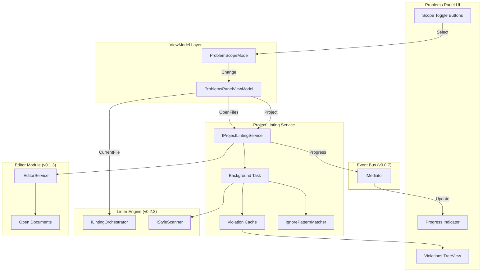
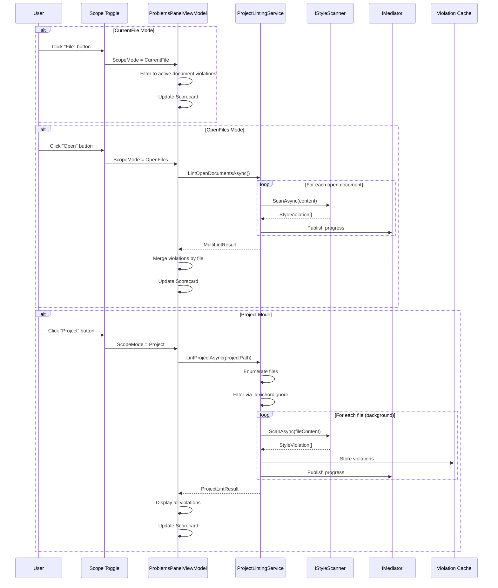

# LCS-DES-026d: Sub-Part Specification — Filter Scope

## 1. Metadata & Categorization

| Field              | Value                                | Description                                        |
| :----------------- | :----------------------------------- | :------------------------------------------------- |
| **Document ID**    | LCS-DES-026d                         | Design Specification v0.2.6d                       |
| **Sub-Part ID**    | INF-026d                             | Filter Scope (Current File / Open Files / Project) |
| **Parent Feature** | INF-026 (Sidebar Real-Time Feedback) | Main feature specification                         |
| **Target Version** | `v0.2.6d`                            | Fourth sub-part of v0.2.6                          |
| **Module Scope**   | `Lexichord.Modules.Style`            | Style governance module                            |
| **License Tier**   | `Core`                               | Foundation (Available in Free tier)                |
| **Author**         | System Architect                     |                                                    |
| **Status**         | **Draft**                            | Pending implementation                             |
| **Last Updated**   | 2026-01-27                           |                                                    |

---

## 2. Executive Summary

### 2.1 The Requirement

Writers working on multi-document projects need flexibility in viewing violations:

- **Single Document Focus:** When editing, focus on current file only
- **Multi-Document View:** When reviewing, see all open files at once
- **Project Overview:** For comprehensive review, see entire project health

Without scope control, the Problems Panel would either overwhelm with project-wide data or miss issues in other files.

### 2.2 The Proposed Solution

We **SHALL** implement Filter Scope that:

1. Provides three scope modes: Current File, Open Files, Project
2. Toggles via buttons in Problems Panel header
3. Runs project-wide linting as a background Task
4. Shows progress indicator during background operations
5. Caches results with file-based invalidation
6. Respects `.lexichordignore` patterns

---

## 3. Architecture

### 3.1 Component Diagram



### 3.2 Scope Mode Data Flow



### 3.3 Dependencies

| Component                | Source  | Usage                 |
| :----------------------- | :------ | :-------------------- |
| `ProblemsPanelViewModel` | v0.2.6a | Scope mode consumer   |
| `IStyleScanner`          | v0.2.3c | File content scanning |
| `ILintingOrchestrator`   | v0.2.3a | Per-document linting  |
| `ILintingConfiguration`  | v0.2.3b | Debounce settings     |
| `IEditorService`         | v0.1.3  | Open documents list   |
| `IMediator`              | v0.0.7a | Progress events       |

---

## 4. Decision Tree

```text
START: "User changes scope mode"
|
+-- Cancel any in-progress background operation
|   +-- Set _scopeChangeCts.Cancel()
|   +-- Create new CancellationTokenSource
|
+-- Check new scope mode
|   +-- CurrentFile
|   |   +-- Get active document ID
|   |   +-- Filter violations to active document only
|   |   +-- Update UI immediately (no background task)
|   |   +-- Update Scorecard
|   |
|   +-- OpenFiles
|   |   +-- Set IsLoading = true
|   |   +-- Get list of open document IDs
|   |   +-- Call ProjectLintingService.LintOpenDocumentsAsync()
|   |   +-- For each document:
|   |       +-- Skip if recently linted (within debounce)
|   |       +-- Get content from ManuscriptViewModel
|   |       +-- Call ILintingOrchestrator.LintAsync()
|   |       +-- Collect violations
|   |       +-- Report progress
|   |   +-- Merge all violations by file
|   |   +-- Group by file, then by severity
|   |   +-- Update Scorecard with totals
|   |   +-- Set IsLoading = false
|   |
|   +-- Project
|       +-- Set IsLoading = true
|       +-- Get project root path
|       +-- Call ProjectLintingService.LintProjectAsync()
|       +-- Enumerate all target files (.md, .txt, etc.)
|       +-- Filter out ignored files (.lexichordignore)
|       +-- For each file (background Task):
|           +-- Check cache: valid?
|               +-- YES -> Use cached violations
|               +-- NO -> Read file, scan, cache results
|           +-- Report progress
|       +-- Aggregate all violations
|       +-- Group by file, then by severity
|       +-- Update Scorecard with project totals
|       +-- Set IsLoading = false
|
END

---

START: "File saved (triggers cache invalidation)"
|
+-- Get saved file path
+-- Call ProjectLintingService.InvalidateFile(path)
+-- Remove file from cache
+-- If ScopeMode == Project:
|   +-- Mark as needs re-lint
|   +-- Optionally trigger incremental re-lint
|
END

---

START: "Parse .lexichordignore file"
|
+-- Read .lexichordignore from project root
|   +-- File not found -> Use empty pattern list
|
+-- Parse patterns (gitignore syntax):
|   +-- Lines starting with # are comments
|   +-- Empty lines are skipped
|   +-- Patterns support:
|       +-- * wildcard (any characters)
|       +-- ** recursive wildcard
|       +-- ! negation
|       +-- / directory separator
|
+-- For each file to check:
|   +-- Match against patterns
|   +-- First matching pattern wins
|   +-- Negation patterns can un-ignore
|
END
```

---

## 5. Data Contracts

### 5.1 ProblemScopeMode Enum

```csharp
namespace Lexichord.Abstractions.Contracts;

/// <summary>
/// Defines the scope modes for the Problems Panel.
/// </summary>
/// <remarks>
/// LOGIC: Controls which violations are displayed in the Problems Panel:
///
/// CurrentFile:
/// - Only violations from the currently active document
/// - Updates automatically when linting completes for active doc
/// - No background task required
/// - Default mode for focused editing
///
/// OpenFiles:
/// - Violations from all currently open documents
/// - Triggers background multi-document lint when selected
/// - Groups violations by file, then by severity
/// - Useful for reviewing a set of related files
///
/// Project:
/// - Violations from all files in the project directory
/// - Triggers background project-wide lint when selected
/// - Uses file caching for performance
/// - Respects .lexichordignore patterns
/// - Useful for comprehensive project review
/// </remarks>
public enum ProblemScopeMode
{
    /// <summary>
    /// Show problems only for the currently active document.
    /// </summary>
    /// <remarks>
    /// LOGIC: Filters violations to match IEditorService.ActiveDocumentId.
    /// Most efficient mode - no background processing required.
    /// </remarks>
    CurrentFile = 0,

    /// <summary>
    /// Show problems for all currently open documents.
    /// </summary>
    /// <remarks>
    /// LOGIC: Iterates through IEditorService.OpenDocuments.
    /// Triggers LintOpenDocumentsAsync() as background task.
    /// Progress reported via IMediator.
    /// </remarks>
    OpenFiles = 1,

    /// <summary>
    /// Show problems for all files in the project (background Task).
    /// </summary>
    /// <remarks>
    /// LOGIC: Scans all files under project root directory.
    /// Filters files via .lexichordignore patterns.
    /// Uses file-based caching for performance.
    /// Triggers LintProjectAsync() as background task.
    /// </remarks>
    Project = 2
}
```

### 5.2 IProjectLintingService Interface

```csharp
namespace Lexichord.Abstractions.Contracts;

using System;
using System.Collections.Generic;
using System.Threading;
using System.Threading.Tasks;

/// <summary>
/// Service for linting multiple documents or entire projects as a background task.
/// </summary>
/// <remarks>
/// LOGIC: IProjectLintingService coordinates linting across multiple files:
///
/// Open Documents Mode:
/// - Iterates through all open documents from IEditorService
/// - Reuses ILintingOrchestrator for per-document linting
/// - Respects debounce settings from ILintingConfiguration
///
/// Project Mode:
/// - Enumerates files recursively from project root
/// - Filters via .lexichordignore patterns (gitignore syntax)
/// - Uses IStyleScanner for file content scanning
/// - Caches results keyed by file path + modification time
/// - Invalidates cache when file is saved
///
/// Threading:
/// - All lint operations run on background thread via Task.Run
/// - Progress reported via IMediator (marshaled to UI thread)
/// - Respects CancellationToken for cancellation
///
/// Performance:
/// - Batch file reading to reduce I/O
/// - Parallel scanning where possible
/// - LRU cache with configurable max size
///
/// Dependencies:
/// - ILintingOrchestrator (v0.2.3a): Per-document linting
/// - IStyleScanner (v0.2.3c): File content scanning
/// - ILintingConfiguration (v0.2.3b): Debounce settings
/// - IMediator (v0.0.7a): Progress events
/// - IEditorService (v0.1.3): Open documents list
/// - IFileSystem: File access abstraction
/// </remarks>
public interface IProjectLintingService
{
    /// <summary>
    /// Lints all currently open documents.
    /// </summary>
    /// <param name="cancellationToken">Cancellation token.</param>
    /// <returns>Aggregated results from all open documents.</returns>
    /// <remarks>
    /// LOGIC: For each open document:
    /// 1. Get content from ManuscriptViewModel
    /// 2. Skip if linted within debounce window
    /// 3. Execute lint via ILintingOrchestrator
    /// 4. Collect violations
    /// 5. Report progress via IMediator
    /// 6. Aggregate all results
    ///
    /// Threading: Runs on background thread.
    /// </remarks>
    Task<MultiLintResult> LintOpenDocumentsAsync(
        CancellationToken cancellationToken = default);

    /// <summary>
    /// Lints a specific set of document IDs.
    /// </summary>
    /// <param name="documentIds">Document IDs to lint.</param>
    /// <param name="cancellationToken">Cancellation token.</param>
    /// <returns>Aggregated results.</returns>
    Task<MultiLintResult> LintDocumentsAsync(
        IEnumerable<string> documentIds,
        CancellationToken cancellationToken = default);

    /// <summary>
    /// Lints all files in a project directory.
    /// </summary>
    /// <param name="projectPath">Path to project root directory.</param>
    /// <param name="progress">Optional progress callback.</param>
    /// <param name="cancellationToken">Cancellation token.</param>
    /// <returns>Aggregated results from all project files.</returns>
    /// <remarks>
    /// LOGIC: Project linting process:
    /// 1. Enumerate all target files (*.md, *.txt by default)
    /// 2. Parse .lexichordignore and filter files
    /// 3. For each file:
    ///    a. Check cache validity (path + mtime)
    ///    b. If valid, use cached violations
    ///    c. If invalid, read file, scan, cache results
    /// 4. Report progress after each file
    /// 5. Aggregate all violations
    ///
    /// File Types: Configurable via ILintingConfiguration.TargetExtensions
    /// Default: [".md", ".markdown", ".txt"]
    ///
    /// Caching:
    /// - Key: file path + last modified time
    /// - Invalidated on file save
    /// - LRU eviction when cache exceeds max size
    /// </remarks>
    Task<ProjectLintResult> LintProjectAsync(
        string projectPath,
        IProgress<ProjectLintProgress>? progress = null,
        CancellationToken cancellationToken = default);

    /// <summary>
    /// Invalidates cached results for a specific file.
    /// </summary>
    /// <param name="filePath">Absolute path to the file to invalidate.</param>
    /// <remarks>
    /// LOGIC: Called when:
    /// - File is saved (via DocumentSavedEvent)
    /// - File is deleted
    /// - File is renamed
    ///
    /// After invalidation, next LintProjectAsync will re-scan the file.
    /// </remarks>
    void InvalidateFile(string filePath);

    /// <summary>
    /// Invalidates all cached results.
    /// </summary>
    /// <remarks>
    /// LOGIC: Called when:
    /// - Project is closed
    /// - User requests full refresh
    /// - Configuration changes (rules modified)
    /// </remarks>
    void InvalidateAll();

    /// <summary>
    /// Gets all cached violations (for incremental display).
    /// </summary>
    /// <returns>All cached violations across all files.</returns>
    /// <remarks>
    /// LOGIC: Returns violations from cache without triggering scan.
    /// Useful for initial display before background scan completes.
    /// </remarks>
    IReadOnlyList<StyleViolation> GetCachedViolations();

    /// <summary>
    /// Gets whether a lint operation is currently in progress.
    /// </summary>
    bool IsLintingInProgress { get; }

    /// <summary>
    /// Cancels any in-progress lint operation.
    /// </summary>
    /// <remarks>
    /// LOGIC: Sets internal CancellationTokenSource.
    /// In-progress scan will stop at next file boundary.
    /// </remarks>
    void Cancel();

    /// <summary>
    /// Event raised when lint progress changes.
    /// </summary>
    /// <remarks>
    /// LOGIC: Fired after each file is processed.
    /// Event handler should update UI progress indicator.
    /// </remarks>
    event EventHandler<ProjectLintProgressEventArgs>? ProgressChanged;
}

/// <summary>
/// Result of a multi-document linting operation.
/// </summary>
public record MultiLintResult(
    IReadOnlyDictionary<string, IReadOnlyList<StyleViolation>> ViolationsByDocument,
    TimeSpan TotalDuration,
    int DocumentsLinted,
    int TotalViolations,
    int ErrorCount,
    int WarningCount,
    int InfoCount
)
{
    /// <summary>
    /// Gets all violations flattened into a single list.
    /// </summary>
    public IReadOnlyList<StyleViolation> AllViolations =>
        ViolationsByDocument.Values.SelectMany(v => v).ToList();

    /// <summary>
    /// Gets whether the operation found any violations.
    /// </summary>
    public bool HasViolations => TotalViolations > 0;
}

/// <summary>
/// Result of a project-wide linting operation.
/// </summary>
public record ProjectLintResult(
    IReadOnlyDictionary<string, IReadOnlyList<StyleViolation>> ViolationsByFile,
    TimeSpan TotalDuration,
    int FilesScanned,
    int FilesSkipped,
    int TotalViolations,
    int ErrorCount,
    int WarningCount,
    int InfoCount
)
{
    /// <summary>
    /// Gets all violations flattened into a single list.
    /// </summary>
    public IReadOnlyList<StyleViolation> AllViolations =>
        ViolationsByFile.Values.SelectMany(v => v).ToList();
}

/// <summary>
/// Progress update during project linting.
/// </summary>
public record ProjectLintProgress(
    string CurrentFile,
    int FilesCompleted,
    int TotalFiles,
    double ProgressPercent,
    int ViolationsFoundSoFar
)
{
    /// <summary>
    /// Gets the current file name (without path).
    /// </summary>
    public string CurrentFileName => System.IO.Path.GetFileName(CurrentFile);
}

/// <summary>
/// Event args for project lint progress events.
/// </summary>
public class ProjectLintProgressEventArgs : EventArgs
{
    public required ProjectLintProgress Progress { get; init; }
}
```

### 5.3 ProjectLintingService Implementation

```csharp
namespace Lexichord.Modules.Style.Services;

using System;
using System.Collections.Concurrent;
using System.Collections.Generic;
using System.IO;
using System.Linq;
using System.Threading;
using System.Threading.Tasks;
using Lexichord.Abstractions.Contracts;
using Microsoft.Extensions.Logging;

/// <summary>
/// Service for linting multiple documents or entire projects.
/// </summary>
/// <remarks>
/// LOGIC: ProjectLintingService coordinates multi-file linting:
///
/// Architecture:
/// - Uses IStyleScanner for individual file scanning
/// - Maintains thread-safe violation cache
/// - Supports cancellation via CancellationToken
/// - Reports progress via events
///
/// Caching Strategy:
/// - Key: file path (case-insensitive on Windows)
/// - Value: (violations, lastModified timestamp)
/// - Invalidation: on file save or manual request
/// - Eviction: LRU when exceeding MaxCacheSize
///
/// Threading:
/// - Scan operations run on ThreadPool via Task.Run
/// - Progress events marshaled to calling context
/// - Cache access is thread-safe (ConcurrentDictionary)
/// </remarks>
public class ProjectLintingService : IProjectLintingService
{
    private readonly IEditorService _editorService;
    private readonly ILintingOrchestrator _orchestrator;
    private readonly IStyleScanner _scanner;
    private readonly IFileSystem _fileSystem;
    private readonly ILintingConfiguration _config;
    private readonly ILogger<ProjectLintingService> _logger;

    private readonly ConcurrentDictionary<string, CachedViolations> _cache = new(StringComparer.OrdinalIgnoreCase);
    private CancellationTokenSource? _currentCts;

    private const int MaxCacheSize = 1000;

    public bool IsLintingInProgress { get; private set; }

    public event EventHandler<ProjectLintProgressEventArgs>? ProgressChanged;

    public ProjectLintingService(
        IEditorService editorService,
        ILintingOrchestrator orchestrator,
        IStyleScanner scanner,
        IFileSystem fileSystem,
        ILintingConfiguration config,
        ILogger<ProjectLintingService> logger)
    {
        _editorService = editorService ?? throw new ArgumentNullException(nameof(editorService));
        _orchestrator = orchestrator ?? throw new ArgumentNullException(nameof(orchestrator));
        _scanner = scanner ?? throw new ArgumentNullException(nameof(scanner));
        _fileSystem = fileSystem ?? throw new ArgumentNullException(nameof(fileSystem));
        _config = config ?? throw new ArgumentNullException(nameof(config));
        _logger = logger ?? throw new ArgumentNullException(nameof(logger));
    }

    /// <inheritdoc />
    public async Task<MultiLintResult> LintOpenDocumentsAsync(
        CancellationToken cancellationToken = default)
    {
        var linkedCts = CancellationTokenSource.CreateLinkedTokenSource(cancellationToken);
        _currentCts = linkedCts;

        var startTime = DateTime.UtcNow;
        IsLintingInProgress = true;

        try
        {
            var openDocs = _editorService.OpenDocuments.ToList();
            _logger.LogInformation("Starting multi-document lint for {Count} open documents", openDocs.Count);

            var results = new Dictionary<string, IReadOnlyList<StyleViolation>>();
            var totalErrors = 0;
            var totalWarnings = 0;
            var totalInfo = 0;

            for (var i = 0; i < openDocs.Count; i++)
            {
                linkedCts.Token.ThrowIfCancellationRequested();

                var doc = openDocs[i];
                _logger.LogDebug("Linting open document {Index}/{Total}: {DocId}", i + 1, openDocs.Count, doc.Id);

                // LOGIC: Lint via orchestrator
                var lintResult = await _orchestrator.LintAsync(
                    doc.Id,
                    doc.Content,
                    linkedCts.Token);

                results[doc.Id] = lintResult.Violations;

                // Count by severity
                totalErrors += lintResult.Violations.Count(v => v.Severity == ViolationSeverity.Error);
                totalWarnings += lintResult.Violations.Count(v => v.Severity == ViolationSeverity.Warning);
                totalInfo += lintResult.Violations.Count(v => v.Severity == ViolationSeverity.Info);

                // Report progress
                var progress = new ProjectLintProgress(
                    doc.Title ?? doc.Id,
                    i + 1,
                    openDocs.Count,
                    ((i + 1) / (double)openDocs.Count) * 100,
                    results.Values.Sum(v => v.Count));

                OnProgressChanged(progress);
            }

            var duration = DateTime.UtcNow - startTime;
            var totalViolations = results.Values.Sum(v => v.Count);

            _logger.LogInformation(
                "Multi-document lint completed: {TotalViolations} violations in {Duration}ms",
                totalViolations, duration.TotalMilliseconds);

            return new MultiLintResult(
                results,
                duration,
                openDocs.Count,
                totalViolations,
                totalErrors,
                totalWarnings,
                totalInfo);
        }
        finally
        {
            IsLintingInProgress = false;
        }
    }

    /// <inheritdoc />
    public async Task<MultiLintResult> LintDocumentsAsync(
        IEnumerable<string> documentIds,
        CancellationToken cancellationToken = default)
    {
        var docIdList = documentIds.ToList();
        var results = new Dictionary<string, IReadOnlyList<StyleViolation>>();
        var startTime = DateTime.UtcNow;

        foreach (var docId in docIdList)
        {
            cancellationToken.ThrowIfCancellationRequested();

            var doc = _editorService.GetDocument(docId);
            if (doc is null) continue;

            var lintResult = await _orchestrator.LintAsync(docId, doc.Content, cancellationToken);
            results[docId] = lintResult.Violations;
        }

        var duration = DateTime.UtcNow - startTime;
        return new MultiLintResult(
            results,
            duration,
            results.Count,
            results.Values.Sum(v => v.Count),
            results.Values.SelectMany(v => v).Count(v => v.Severity == ViolationSeverity.Error),
            results.Values.SelectMany(v => v).Count(v => v.Severity == ViolationSeverity.Warning),
            results.Values.SelectMany(v => v).Count(v => v.Severity == ViolationSeverity.Info));
    }

    /// <inheritdoc />
    public async Task<ProjectLintResult> LintProjectAsync(
        string projectPath,
        IProgress<ProjectLintProgress>? progress = null,
        CancellationToken cancellationToken = default)
    {
        var linkedCts = CancellationTokenSource.CreateLinkedTokenSource(cancellationToken);
        _currentCts = linkedCts;

        var startTime = DateTime.UtcNow;
        IsLintingInProgress = true;

        try
        {
            _logger.LogInformation("Starting project lint for {ProjectPath}", projectPath);

            // LOGIC: Step 1 - Enumerate target files
            var targetExtensions = _config.TargetExtensions ?? new[] { ".md", ".markdown", ".txt" };
            var allFiles = EnumerateFiles(projectPath, targetExtensions);

            // LOGIC: Step 2 - Filter via .lexichordignore
            var ignorePatterns = LoadIgnorePatterns(projectPath);
            var filteredFiles = FilterIgnoredFiles(allFiles, projectPath, ignorePatterns).ToList();
            var skippedCount = allFiles.Count() - filteredFiles.Count;

            _logger.LogInformation(
                "Found {Total} files, {Skipped} ignored, {ToProcess} to process",
                allFiles.Count(), skippedCount, filteredFiles.Count);

            // LOGIC: Step 3 - Scan each file
            var results = new Dictionary<string, IReadOnlyList<StyleViolation>>();
            var totalErrors = 0;
            var totalWarnings = 0;
            var totalInfo = 0;

            for (var i = 0; i < filteredFiles.Count; i++)
            {
                linkedCts.Token.ThrowIfCancellationRequested();

                var filePath = filteredFiles[i];
                _logger.LogDebug("Linting file {Index}/{Total}: {FilePath}", i + 1, filteredFiles.Count, filePath);

                // LOGIC: Check cache
                var violations = await GetOrScanFileAsync(filePath, linkedCts.Token);
                results[filePath] = violations;

                // Count by severity
                totalErrors += violations.Count(v => v.Severity == ViolationSeverity.Error);
                totalWarnings += violations.Count(v => v.Severity == ViolationSeverity.Warning);
                totalInfo += violations.Count(v => v.Severity == ViolationSeverity.Info);

                // Report progress
                var progressData = new ProjectLintProgress(
                    filePath,
                    i + 1,
                    filteredFiles.Count,
                    ((i + 1) / (double)filteredFiles.Count) * 100,
                    results.Values.Sum(v => v.Count));

                progress?.Report(progressData);
                OnProgressChanged(progressData);
            }

            var duration = DateTime.UtcNow - startTime;
            var totalViolations = results.Values.Sum(v => v.Count);

            _logger.LogInformation(
                "Project lint completed: {TotalViolations} violations in {Duration}ms",
                totalViolations, duration.TotalMilliseconds);

            return new ProjectLintResult(
                results,
                duration,
                filteredFiles.Count,
                skippedCount,
                totalViolations,
                totalErrors,
                totalWarnings,
                totalInfo);
        }
        finally
        {
            IsLintingInProgress = false;
        }
    }

    private async Task<IReadOnlyList<StyleViolation>> GetOrScanFileAsync(
        string filePath,
        CancellationToken cancellationToken)
    {
        // LOGIC: Check cache validity
        var lastModified = _fileSystem.GetLastWriteTimeUtc(filePath);

        if (_cache.TryGetValue(filePath, out var cached) &&
            cached.LastModified >= lastModified)
        {
            _logger.LogDebug("Using cached violations for {FilePath}", filePath);
            return cached.Violations;
        }

        // LOGIC: Read and scan file
        var content = await _fileSystem.ReadAllTextAsync(filePath, cancellationToken);
        var violations = await _scanner.ScanAsync(filePath, content, cancellationToken);

        // LOGIC: Update cache
        var cacheEntry = new CachedViolations(violations.ToList(), lastModified);
        _cache.AddOrUpdate(filePath, cacheEntry, (_, _) => cacheEntry);

        // LOGIC: Evict if cache too large
        EnforceCacheSize();

        return violations;
    }

    private IEnumerable<string> EnumerateFiles(string projectPath, IEnumerable<string> extensions)
    {
        var extSet = extensions.Select(e => e.ToLowerInvariant()).ToHashSet();

        return _fileSystem.EnumerateFiles(projectPath, "*.*", SearchOption.AllDirectories)
            .Where(f => extSet.Contains(Path.GetExtension(f).ToLowerInvariant()));
    }

    private IReadOnlyList<string> LoadIgnorePatterns(string projectPath)
    {
        var ignoreFilePath = Path.Combine(projectPath, ".lexichordignore");

        if (!_fileSystem.FileExists(ignoreFilePath))
        {
            return Array.Empty<string>();
        }

        try
        {
            var lines = _fileSystem.ReadAllLines(ignoreFilePath);
            return lines
                .Where(line => !string.IsNullOrWhiteSpace(line) && !line.TrimStart().StartsWith("#"))
                .Select(line => line.Trim())
                .ToList();
        }
        catch (Exception ex)
        {
            _logger.LogWarning(ex, "Failed to read .lexichordignore at {Path}", ignoreFilePath);
            return Array.Empty<string>();
        }
    }

    private IEnumerable<string> FilterIgnoredFiles(
        IEnumerable<string> files,
        string projectPath,
        IReadOnlyList<string> patterns)
    {
        if (patterns.Count == 0)
        {
            return files;
        }

        var matcher = new IgnorePatternMatcher(patterns);

        foreach (var file in files)
        {
            var relativePath = Path.GetRelativePath(projectPath, file);

            if (!matcher.IsIgnored(relativePath))
            {
                yield return file;
            }
            else
            {
                _logger.LogDebug("Skipping ignored file: {FilePath}", relativePath);
            }
        }
    }

    private void EnforceCacheSize()
    {
        if (_cache.Count <= MaxCacheSize)
        {
            return;
        }

        // LOGIC: Simple eviction - remove oldest entries
        var toRemove = _cache
            .OrderBy(kvp => kvp.Value.LastModified)
            .Take(_cache.Count - MaxCacheSize)
            .Select(kvp => kvp.Key)
            .ToList();

        foreach (var key in toRemove)
        {
            _cache.TryRemove(key, out _);
        }
    }

    /// <inheritdoc />
    public void InvalidateFile(string filePath)
    {
        if (_cache.TryRemove(filePath, out _))
        {
            _logger.LogDebug("Cache invalidated for {FilePath}", filePath);
        }
    }

    /// <inheritdoc />
    public void InvalidateAll()
    {
        _cache.Clear();
        _logger.LogInformation("All cached violations cleared");
    }

    /// <inheritdoc />
    public IReadOnlyList<StyleViolation> GetCachedViolations()
    {
        return _cache.Values
            .SelectMany(c => c.Violations)
            .ToList();
    }

    /// <inheritdoc />
    public void Cancel()
    {
        _currentCts?.Cancel();
        _logger.LogInformation("Project lint cancelled");
    }

    /// <summary>
    /// Caches violations for a specific file (for testing).
    /// </summary>
    internal void CacheViolations(string filePath, IReadOnlyList<StyleViolation> violations)
    {
        _cache[filePath] = new CachedViolations(violations, DateTime.UtcNow);
    }

    private void OnProgressChanged(ProjectLintProgress progress)
    {
        ProgressChanged?.Invoke(this, new ProjectLintProgressEventArgs { Progress = progress });
    }

    /// <summary>
    /// Cached violations for a single file.
    /// </summary>
    private record CachedViolations(
        IReadOnlyList<StyleViolation> Violations,
        DateTime LastModified);
}
```

### 5.4 IgnorePatternMatcher Class

```csharp
namespace Lexichord.Modules.Style.Services;

using System;
using System.Collections.Generic;
using System.Text.RegularExpressions;

/// <summary>
/// Matches file paths against .lexichordignore patterns.
/// </summary>
/// <remarks>
/// LOGIC: Implements gitignore-like pattern matching:
/// - * matches any characters except /
/// - ** matches any characters including /
/// - ? matches single character
/// - ! prefix negates the pattern
/// - # prefix is a comment (handled by caller)
/// - Trailing / matches directories only
///
/// Patterns are applied in order; last matching pattern wins.
/// Negation patterns can "un-ignore" previously ignored files.
/// </remarks>
public class IgnorePatternMatcher
{
    private readonly List<(Regex Regex, bool IsNegation)> _patterns;

    public IgnorePatternMatcher(IEnumerable<string> patterns)
    {
        _patterns = new List<(Regex, bool)>();

        foreach (var pattern in patterns)
        {
            var isNegation = pattern.StartsWith("!");
            var cleanPattern = isNegation ? pattern[1..] : pattern;
            var regex = ConvertToRegex(cleanPattern);
            _patterns.Add((regex, isNegation));
        }
    }

    /// <summary>
    /// Checks if a path should be ignored.
    /// </summary>
    /// <param name="relativePath">Path relative to project root.</param>
    /// <returns>True if path matches an ignore pattern (not negated).</returns>
    public bool IsIgnored(string relativePath)
    {
        // LOGIC: Normalize path separators
        var normalizedPath = relativePath.Replace('\\', '/');
        var isIgnored = false;

        // LOGIC: Apply patterns in order; last match wins
        foreach (var (regex, isNegation) in _patterns)
        {
            if (regex.IsMatch(normalizedPath))
            {
                isIgnored = !isNegation;
            }
        }

        return isIgnored;
    }

    private static Regex ConvertToRegex(string pattern)
    {
        // LOGIC: Convert gitignore pattern to regex
        var regexPattern = "^";

        // Handle leading slash (anchored to root)
        if (pattern.StartsWith("/"))
        {
            pattern = pattern[1..];
        }
        else
        {
            // Match anywhere in path
            regexPattern += "(.*/)?";
        }

        for (var i = 0; i < pattern.Length; i++)
        {
            var c = pattern[i];

            switch (c)
            {
                case '*':
                    if (i + 1 < pattern.Length && pattern[i + 1] == '*')
                    {
                        // ** matches everything including /
                        regexPattern += ".*";
                        i++; // Skip second *

                        // Handle **/ or ** at end
                        if (i + 1 < pattern.Length && pattern[i + 1] == '/')
                        {
                            regexPattern += "/?";
                            i++;
                        }
                    }
                    else
                    {
                        // * matches everything except /
                        regexPattern += "[^/]*";
                    }
                    break;

                case '?':
                    regexPattern += "[^/]";
                    break;

                case '.':
                case '+':
                case '^':
                case '$':
                case '(':
                case ')':
                case '[':
                case ']':
                case '{':
                case '}':
                case '|':
                case '\\':
                    // Escape regex special characters
                    regexPattern += "\\" + c;
                    break;

                default:
                    regexPattern += c;
                    break;
            }
        }

        // Handle trailing slash (directory only)
        if (pattern.EndsWith("/"))
        {
            regexPattern += ".*";
        }

        regexPattern += "$";

        return new Regex(regexPattern, RegexOptions.IgnoreCase | RegexOptions.Compiled);
    }
}
```

---

## 6. Implementation Logic

### 6.1 Scope Toggle UI

```xml
<!-- In ProblemsPanel.axaml -->

<StackPanel Grid.Column="2" Orientation="Horizontal" Spacing="2">
    <!-- Segmented button style -->
    <Border CornerRadius="4" Background="{DynamicResource ToggleGroupBackground}">
        <StackPanel Orientation="Horizontal">

            <RadioButton Content="File"
                         GroupName="ScopeMode"
                         IsChecked="{Binding ScopeMode,
                             Converter={StaticResource EnumBoolConverter},
                             ConverterParameter={x:Static vm:ProblemScopeMode.CurrentFile}}"
                         Classes="ScopeToggle">
                <ToolTip.Tip>Show problems in current file only</ToolTip.Tip>
            </RadioButton>

            <RadioButton Content="Open"
                         GroupName="ScopeMode"
                         IsChecked="{Binding ScopeMode,
                             Converter={StaticResource EnumBoolConverter},
                             ConverterParameter={x:Static vm:ProblemScopeMode.OpenFiles}}"
                         Classes="ScopeToggle">
                <ToolTip.Tip>Show problems in all open files</ToolTip.Tip>
            </RadioButton>

            <RadioButton Content="Project"
                         GroupName="ScopeMode"
                         IsChecked="{Binding ScopeMode,
                             Converter={StaticResource EnumBoolConverter},
                             ConverterParameter={x:Static vm:ProblemScopeMode.Project}}"
                         Classes="ScopeToggle">
                <ToolTip.Tip>Show problems in all project files</ToolTip.Tip>
            </RadioButton>

        </StackPanel>
    </Border>

    <!-- Cancel button (visible during loading) -->
    <Button IsVisible="{Binding IsLoading}"
            Command="{Binding CancelCommand}"
            ToolTip.Tip="Cancel background scan">
        <Path Data="M19,6.41L17.59,5L12,10.59L6.41,5L5,6.41L10.59,12L5,17.59L6.41,19L12,13.41L17.59,19L19,17.59L13.41,12L19,6.41Z"
              Width="14" Height="14" />
    </Button>
</StackPanel>

<!-- Progress bar -->
<StackPanel DockPanel.Dock="Top"
            IsVisible="{Binding IsLoading}"
            Margin="8,4">
    <ProgressBar Value="{Binding Progress}"
                 Maximum="100"
                 Height="3"
                 Foreground="{DynamicResource AccentColor}" />
    <TextBlock Text="{Binding ProgressText}"
               FontSize="11"
               Opacity="0.6"
               Margin="0,2,0,0" />
</StackPanel>
```

### 6.2 Scope Change Handler in ViewModel

```csharp
// In ProblemsPanelViewModel.cs

partial void OnScopeModeChanged(ProblemScopeMode oldValue, ProblemScopeMode newValue)
{
    _logger.LogDebug("Scope changed from {OldScope} to {NewScope}", oldValue, newValue);

    // LOGIC: Cancel any in-progress operation
    _scopeChangeCts?.Cancel();
    _scopeChangeCts = new CancellationTokenSource();

    // LOGIC: Trigger scope-specific update
    _ = OnScopeModeChangedAsync(newValue, _scopeChangeCts.Token);
}

private async Task OnScopeModeChangedAsync(ProblemScopeMode newScope, CancellationToken cancellationToken)
{
    try
    {
        IsLoading = newScope != ProblemScopeMode.CurrentFile;
        Progress = 0;

        switch (newScope)
        {
            case ProblemScopeMode.CurrentFile:
                // LOGIC: Just filter existing violations to active document
                UpdateProblemsFromCache();
                break;

            case ProblemScopeMode.OpenFiles:
                // LOGIC: Trigger multi-document lint
                ProgressText = "Scanning open documents...";

                var multiResult = await _projectLintingService.LintOpenDocumentsAsync(cancellationToken);

                foreach (var kvp in multiResult.ViolationsByDocument)
                {
                    _violationsByDocument[kvp.Key] = kvp.Value;
                }

                UpdateProblemsFromCache();
                break;

            case ProblemScopeMode.Project:
                // LOGIC: Trigger project-wide lint
                ProgressText = "Scanning project files...";

                var projectPath = GetProjectPath();
                if (string.IsNullOrEmpty(projectPath))
                {
                    _logger.LogWarning("No project path available for project-wide lint");
                    return;
                }

                var progress = new Progress<ProjectLintProgress>(p =>
                {
                    Progress = p.ProgressPercent;
                    ProgressText = $"Scanning {p.CurrentFileName} ({p.FilesCompleted}/{p.TotalFiles})...";
                });

                var projectResult = await _projectLintingService.LintProjectAsync(
                    projectPath, progress, cancellationToken);

                // Update violations from project result
                _projectViolations = projectResult.ViolationsByFile;
                UpdateProblemsFromCache();
                break;
        }
    }
    catch (OperationCanceledException)
    {
        _logger.LogDebug("Scope change cancelled");
    }
    catch (Exception ex)
    {
        _logger.LogError(ex, "Error during scope change to {Scope}", newScope);
    }
    finally
    {
        IsLoading = false;
        ProgressText = string.Empty;
    }
}

private string? GetProjectPath()
{
    // LOGIC: Get project root from active document or workspace
    var activeDoc = _editorService.ActiveDocument;
    if (activeDoc?.FilePath is null) return null;

    return Path.GetDirectoryName(activeDoc.FilePath);
}
```

---

## 7. Use Cases

### UC-01: Switch to Open Files Mode

**Preconditions:**

- 3 documents open in editor
- CurrentFile mode selected

**Flow:**

1. User clicks "Open" toggle button
2. ScopeMode changes to OpenFiles
3. ProblemsPanelViewModel cancels any previous operation
4. IsLoading = true, progress bar appears
5. ProjectLintingService.LintOpenDocumentsAsync() called
6. For each open document:
    - Content retrieved from ManuscriptViewModel
    - LintingOrchestrator.LintAsync() called
    - Violations collected
    - Progress updated: "Scanning doc 1/3..."
7. Results aggregated by document
8. TreeView updates: groups by file, then severity
9. Scorecard updates with total across all files
10. IsLoading = false, progress bar hides

**Postconditions:**

- All open document violations visible
- Grouped by file name
- Score reflects total across all files

### UC-02: Project-Wide Scan

**Preconditions:**

- Project has 50 markdown files
- .lexichordignore excludes node_modules/, .git/

**Flow:**

1. User clicks "Project" toggle
2. ScopeMode changes to Project
3. ProjectLintingService.LintProjectAsync() called
4. Service enumerates \*.md files recursively
5. Service loads .lexichordignore patterns
6. Service filters: 50 files -> 42 after ignore
7. Progress bar shows "Scanning file 1/42 (2%)..."
8. For each file:
    - Check cache: miss, read file
    - Scan via IStyleScanner
    - Cache results
    - Update progress
9. After all files: display results grouped by file
10. Scorecard shows project-wide score

**Postconditions:**

- All 42 non-ignored files scanned
- Results cached for future queries
- Project-wide compliance score visible

### UC-03: Incremental Update After File Save

**Preconditions:**

- Project mode active
- User edits and saves "chapter3.md"

**Flow:**

1. DocumentSavedEvent fires
2. ProblemsPanelViewModel receives event
3. Calls ProjectLintingService.InvalidateFile("chapter3.md")
4. Cache entry removed
5. If still in Project mode, trigger re-lint for just that file
6. Update violations for chapter3.md only
7. Scorecard recalculates

**Postconditions:**

- Only changed file re-scanned
- Other files use cached results
- Fast incremental update

---

## 8. Observability & Logging

| Level       | Message Template                                                              |
| :---------- | :---------------------------------------------------------------------------- |
| Information | `Starting multi-document lint for {Count} open documents`                     |
| Information | `Starting project lint for {ProjectPath}`                                     |
| Information | `Found {Total} files, {Skipped} ignored, {ToProcess} to process`              |
| Information | `Multi-document lint completed: {TotalViolations} violations in {Duration}ms` |
| Information | `Project lint completed: {TotalViolations} violations in {Duration}ms`        |
| Information | `Project lint cancelled`                                                      |
| Information | `All cached violations cleared`                                               |
| Debug       | `Linting open document {Index}/{Total}: {DocId}`                              |
| Debug       | `Linting file {Index}/{Total}: {FilePath}`                                    |
| Debug       | `Using cached violations for {FilePath}`                                      |
| Debug       | `Cache invalidated for {FilePath}`                                            |
| Debug       | `Skipping ignored file: {FilePath}`                                           |
| Debug       | `Scope changed from {OldScope} to {NewScope}`                                 |
| Warning     | `Failed to read .lexichordignore at {Path}`                                   |
| Warning     | `No project path available for project-wide lint`                             |

---

## 9. Unit Tests

```csharp
[TestFixture]
[Category("Unit")]
public class ProjectLintingServiceTests
{
    private Mock<IEditorService> _mockEditorService = null!;
    private Mock<ILintingOrchestrator> _mockOrchestrator = null!;
    private Mock<IStyleScanner> _mockScanner = null!;
    private Mock<IFileSystem> _mockFileSystem = null!;
    private Mock<ILintingConfiguration> _mockConfig = null!;
    private Mock<ILogger<ProjectLintingService>> _mockLogger = null!;
    private ProjectLintingService _sut = null!;

    [SetUp]
    public void SetUp()
    {
        _mockEditorService = new Mock<IEditorService>();
        _mockOrchestrator = new Mock<ILintingOrchestrator>();
        _mockScanner = new Mock<IStyleScanner>();
        _mockFileSystem = new Mock<IFileSystem>();
        _mockConfig = new Mock<ILintingConfiguration>();
        _mockLogger = new Mock<ILogger<ProjectLintingService>>();

        _mockConfig.Setup(c => c.TargetExtensions).Returns(new[] { ".md" });

        _sut = new ProjectLintingService(
            _mockEditorService.Object,
            _mockOrchestrator.Object,
            _mockScanner.Object,
            _mockFileSystem.Object,
            _mockConfig.Object,
            _mockLogger.Object);
    }

    [Test]
    public async Task LintOpenDocumentsAsync_LintsAllOpenDocuments()
    {
        // Arrange
        var docs = new List<IManuscriptViewModel>
        {
            CreateMockDocument("doc-1", "content1").Object,
            CreateMockDocument("doc-2", "content2").Object
        };

        _mockEditorService.Setup(e => e.OpenDocuments).Returns(docs);

        _mockOrchestrator
            .Setup(o => o.LintAsync(It.IsAny<string>(), It.IsAny<string>(), It.IsAny<CancellationToken>()))
            .ReturnsAsync((string docId, string _, CancellationToken _) =>
                CreateLintResult(docId, Array.Empty<StyleViolation>()));

        // Act
        var result = await _sut.LintOpenDocumentsAsync();

        // Assert
        Assert.Multiple(() =>
        {
            Assert.That(result.DocumentsLinted, Is.EqualTo(2));
            Assert.That(result.ViolationsByDocument, Has.Count.EqualTo(2));
        });
    }

    [Test]
    public async Task LintProjectAsync_EnumeratesAndLintsFiles()
    {
        // Arrange
        var projectPath = "/project";
        var files = new[] { "/project/file1.md", "/project/sub/file2.md" };

        _mockFileSystem.Setup(fs => fs.EnumerateFiles(projectPath, "*.*", SearchOption.AllDirectories))
            .Returns(files);
        _mockFileSystem.Setup(fs => fs.FileExists(It.IsAny<string>())).Returns(false);
        _mockFileSystem.Setup(fs => fs.ReadAllTextAsync(It.IsAny<string>(), It.IsAny<CancellationToken>()))
            .ReturnsAsync("content");
        _mockFileSystem.Setup(fs => fs.GetLastWriteTimeUtc(It.IsAny<string>())).Returns(DateTime.UtcNow);

        _mockScanner.Setup(s => s.ScanAsync(It.IsAny<string>(), It.IsAny<string>(), It.IsAny<CancellationToken>()))
            .ReturnsAsync(Array.Empty<StyleViolation>());

        // Act
        var result = await _sut.LintProjectAsync(projectPath);

        // Assert
        Assert.That(result.FilesScanned, Is.EqualTo(2));
    }

    [Test]
    public async Task LintProjectAsync_RespectsIgnorePatterns()
    {
        // Arrange
        var projectPath = "/project";
        var files = new[] {
            "/project/file1.md",
            "/project/node_modules/pkg.md",
            "/project/docs/readme.md"
        };

        _mockFileSystem.Setup(fs => fs.EnumerateFiles(projectPath, "*.*", SearchOption.AllDirectories))
            .Returns(files);
        _mockFileSystem.Setup(fs => fs.FileExists(Path.Combine(projectPath, ".lexichordignore")))
            .Returns(true);
        _mockFileSystem.Setup(fs => fs.ReadAllLines(Path.Combine(projectPath, ".lexichordignore")))
            .Returns(new[] { "node_modules/" });
        _mockFileSystem.Setup(fs => fs.ReadAllTextAsync(It.IsAny<string>(), It.IsAny<CancellationToken>()))
            .ReturnsAsync("content");
        _mockFileSystem.Setup(fs => fs.GetLastWriteTimeUtc(It.IsAny<string>())).Returns(DateTime.UtcNow);

        _mockScanner.Setup(s => s.ScanAsync(It.IsAny<string>(), It.IsAny<string>(), It.IsAny<CancellationToken>()))
            .ReturnsAsync(Array.Empty<StyleViolation>());

        // Act
        var result = await _sut.LintProjectAsync(projectPath);

        // Assert
        Assert.Multiple(() =>
        {
            Assert.That(result.FilesScanned, Is.EqualTo(2));
            Assert.That(result.FilesSkipped, Is.EqualTo(1));
        });
    }

    [Test]
    public async Task LintProjectAsync_UsesCachedResults()
    {
        // Arrange
        var projectPath = "/project";
        var filePath = "/project/file1.md";
        var cachedViolations = new[] { CreateViolation("v1", filePath) };

        _sut.CacheViolations(filePath, cachedViolations);

        _mockFileSystem.Setup(fs => fs.EnumerateFiles(projectPath, "*.*", SearchOption.AllDirectories))
            .Returns(new[] { filePath });
        _mockFileSystem.Setup(fs => fs.FileExists(It.IsAny<string>())).Returns(false);
        _mockFileSystem.Setup(fs => fs.GetLastWriteTimeUtc(filePath))
            .Returns(DateTime.UtcNow.AddHours(-1)); // Older than cache

        // Act
        var result = await _sut.LintProjectAsync(projectPath);

        // Assert
        _mockScanner.Verify(
            s => s.ScanAsync(It.IsAny<string>(), It.IsAny<string>(), It.IsAny<CancellationToken>()),
            Times.Never);
        Assert.That(result.TotalViolations, Is.EqualTo(1));
    }

    [Test]
    public void InvalidateFile_RemovesFromCache()
    {
        // Arrange
        var filePath = "/project/file.md";
        _sut.CacheViolations(filePath, new[] { CreateViolation("v1", filePath) });

        // Act
        _sut.InvalidateFile(filePath);

        // Assert
        Assert.That(_sut.GetCachedViolations(), Is.Empty);
    }

    private Mock<IManuscriptViewModel> CreateMockDocument(string id, string content)
    {
        var mock = new Mock<IManuscriptViewModel>();
        mock.Setup(d => d.Id).Returns(id);
        mock.Setup(d => d.Content).Returns(content);
        mock.Setup(d => d.Title).Returns(id);
        return mock;
    }

    private LintingResult CreateLintResult(string docId, IReadOnlyList<StyleViolation> violations) =>
        new(docId, violations, TimeSpan.Zero, 0, 100, false, DateTimeOffset.UtcNow);

    private StyleViolation CreateViolation(string id, string docId) =>
        new(id, docId, "RULE001", 0, 5, 1, 1, "test", "Test", ViolationSeverity.Error, null, RuleCategory.Terminology);
}

[TestFixture]
[Category("Unit")]
public class IgnorePatternMatcherTests
{
    [Test]
    [TestCase("node_modules/", "node_modules/package.json", true)]
    [TestCase("node_modules/", "src/node_modules/file.md", true)]
    [TestCase("*.log", "app.log", true)]
    [TestCase("*.log", "logs/app.log", true)]
    [TestCase("*.log", "app.md", false)]
    [TestCase("/build/", "build/output.js", true)]
    [TestCase("/build/", "src/build/output.js", false)]
    [TestCase("**/*.tmp", "deep/nested/file.tmp", true)]
    [TestCase("docs/*.md", "docs/readme.md", true)]
    [TestCase("docs/*.md", "docs/sub/readme.md", false)]
    public void IsIgnored_MatchesPatterns(string pattern, string path, bool expected)
    {
        var matcher = new IgnorePatternMatcher(new[] { pattern });
        Assert.That(matcher.IsIgnored(path), Is.EqualTo(expected));
    }

    [Test]
    public void IsIgnored_NegationPatternUnignores()
    {
        var matcher = new IgnorePatternMatcher(new[]
        {
            "*.log",      // Ignore all .log files
            "!important.log"  // But not important.log
        });

        Assert.Multiple(() =>
        {
            Assert.That(matcher.IsIgnored("app.log"), Is.True);
            Assert.That(matcher.IsIgnored("important.log"), Is.False);
        });
    }
}
```

---

## 10. Security & Safety

- **Read-Only File Access:** Only reads files, never modifies
- **Path Validation:** All paths validated before access
- **Sandboxed to Project:** Only scans within project directory
- **Respect Ignore Patterns:** Users control what gets scanned
- **Cancellation Support:** Long operations can be cancelled

---

## 11. Risks & Mitigations

| Risk                        | Impact | Mitigation                       |
| :-------------------------- | :----- | :------------------------------- |
| Large project overwhelms UI | High   | Pagination; virtualized TreeView |
| Background lint blocks UI   | High   | Task.Run; proper async patterns  |
| Memory pressure from cache  | Medium | LRU eviction; max cache size     |
| Slow file enumeration       | Medium | Enumerate lazily; filter early   |
| Ignore pattern bugs         | Low    | Comprehensive unit tests         |

---

## 12. Acceptance Criteria

| #   | Criterion                                              |
| :-- | :----------------------------------------------------- |
| 1   | Scope toggle shows CurrentFile/OpenFiles/Project       |
| 2   | CurrentFile mode shows only active document violations |
| 3   | OpenFiles mode shows all open document violations      |
| 4   | Project mode scans all project files                   |
| 5   | Progress indicator shows during background scan        |
| 6   | Cancel button stops background operation               |
| 7   | .lexichordignore patterns are respected                |
| 8   | Cache is used for repeated scans                       |
| 9   | File save invalidates cache                            |
| 10  | Violations grouped by file in multi-file modes         |
| 11  | Scorecard reflects total for current scope             |

---

## 13. Verification Commands

```bash
# Build
dotnet build src/Lexichord.Modules.Style

# Run unit tests
dotnet test --filter "FullyQualifiedName~ProjectLintingService"
dotnet test --filter "FullyQualifiedName~IgnorePatternMatcher"

# Run application
dotnet run --project src/Lexichord.Host

# Manual testing:
# 1. Open document, verify CurrentFile scope
# 2. Open multiple documents
# 3. Switch to OpenFiles scope
# 4. Verify progress bar during scan
# 5. Verify all open files show violations
# 6. Create .lexichordignore with "drafts/"
# 7. Switch to Project scope
# 8. Verify drafts/ files are skipped
# 9. Edit and save a file
# 10. Verify incremental update
```

---

## 14. Deliverable Checklist

| Step | Description                             | Status |
| :--- | :-------------------------------------- | :----- |
| 1    | Define ProblemScopeMode enum            | [ ]    |
| 2    | Define IProjectLintingService interface | [ ]    |
| 3    | Implement ProjectLintingService         | [ ]    |
| 4    | Implement IgnorePatternMatcher          | [ ]    |
| 5    | Add scope toggle UI to Problems Panel   | [ ]    |
| 6    | Add progress indicator UI               | [ ]    |
| 7    | Implement scope change handler          | [ ]    |
| 8    | Implement file-based caching            | [ ]    |
| 9    | Implement cache invalidation on save    | [ ]    |
| 10   | Implement .lexichordignore support      | [ ]    |
| 11   | Unit tests for ProjectLintingService    | [ ]    |
| 12   | Unit tests for IgnorePatternMatcher     | [ ]    |
| 13   | Integration test for full workflow      | [ ]    |
