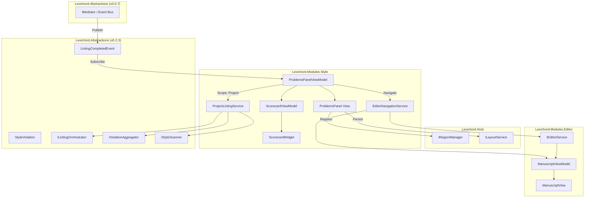
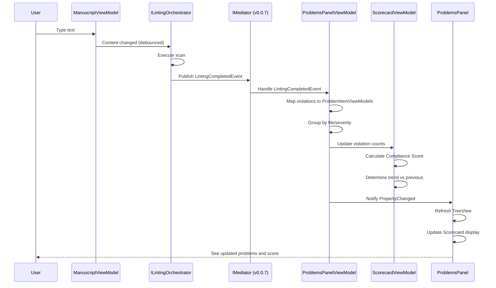
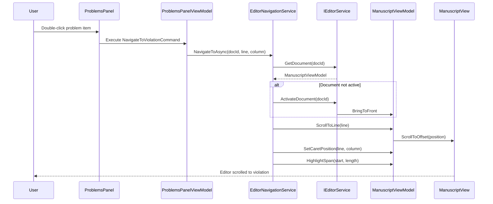
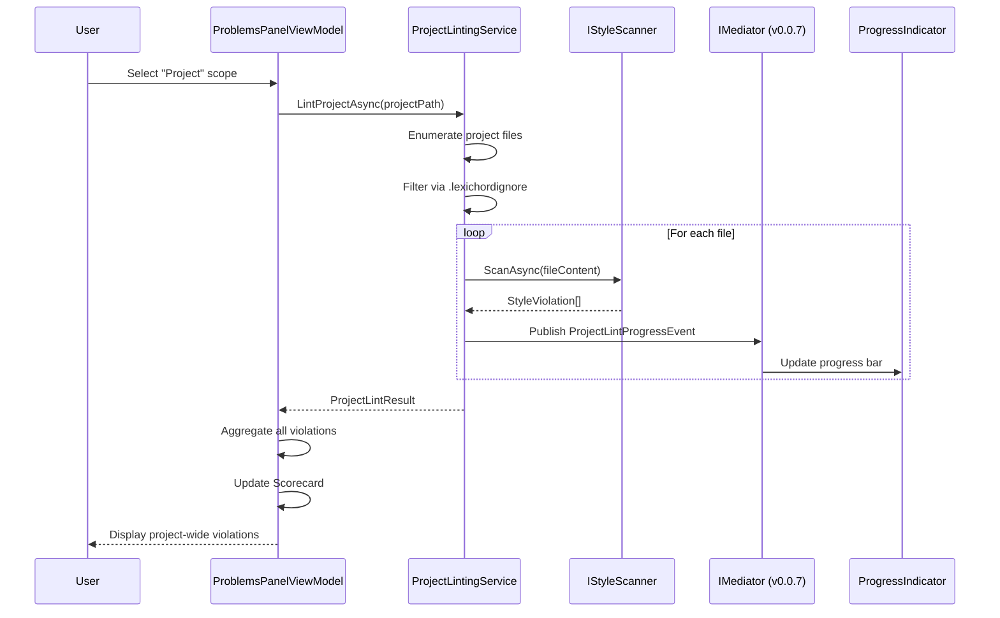

# LCS-INF-026: Feature Design Specification — The Sidebar (Real-Time Feedback)

## 1. Metadata & Categorization

| Field                | Value                                                       | Description                                      |
| :------------------- | :---------------------------------------------------------- | :----------------------------------------------- |
| **Feature ID**       | `INF-026`                                                   | Infrastructure - Sidebar Real-Time Feedback      |
| **Feature Name**     | The Sidebar (Real-Time Feedback)                            | Problems panel with navigation and scoring       |
| **Target Version**   | `v0.2.6`                                                    | Style System UI Milestone                        |
| **Module Scope**     | `Lexichord.Modules.Style`                                   | Style governance module                          |
| **Swimlane**         | `Product`                                                   | Core User-Facing Feature                         |
| **License Tier**     | `Core`                                                      | Foundation (Available in Free tier)              |
| **Feature Gate Key** | `style.sidebar.enabled`                                     | Optional toggle in settings                      |
| **Author**           | System Architect                                            |                                                  |
| **Status**           | **Draft**                                                   | Pending implementation                           |
| **Last Updated**     | 2026-01-26                                                  |                                                  |

---

## 2. Executive Summary

### 2.1 The Requirement

While v0.2.4 provides inline violation visualization (squiggly underlines), writers need a **centralized view** of document health:

- **Overview:** See all violations at a glance without scrolling through the document.
- **Navigation:** Jump directly to any issue without hunting through pages.
- **Progress Tracking:** Understand improvement over time with a compliance score.
- **Project Scope:** View violations across all open files, not just the current one.
- **Prioritization:** Sort and filter issues to tackle the most critical first.

Without this panel, writers must rely solely on inline indicators, making it difficult to assess overall document quality or navigate to specific issues efficiently.

### 2.2 The Proposed Solution

We **SHALL** implement a comprehensive sidebar feedback system with:

1. **v0.2.6a: Problems Panel** — VS Code-style violation list bound to LintingCompletedEvent.
2. **v0.2.6b: Navigation Sync** — Double-click navigation to specific line and column.
3. **v0.2.6c: Scorecard Widget** — Compliance score with gamification elements.
4. **v0.2.6d: Filter Scope** — Toggle between Current File, Open Files, and Project with background linting.

---

## 3. Architecture & Modular Strategy

### 3.1 High-Level Architecture



### 3.2 Problems Panel Data Flow



### 3.3 Navigation Flow



### 3.4 Project Linting Flow



### 3.5 Dependencies

**From v0.0.7 (Event Bus):**

| Component | Type | Usage |
|:----------|:-----|:------|
| `IMediator` | Interface | Event publishing and subscription |
| `INotification` | Interface | Event marker for MediatR |
| `INotificationHandler<T>` | Interface | Event handler pattern |

**From v0.2.3 (Linter Engine):**

| Component | Type | Usage |
|:----------|:-----|:------|
| `LintingCompletedEvent` | Event | Primary data source for violations |
| `StyleViolation` | Record | Violation data with position, message |
| `ViolationSeverity` | Enum | Error, Warning, Info levels |
| `ILintingOrchestrator` | Interface | Access linting state |
| `IViolationAggregator` | Interface | Get violations by document |
| `IStyleScanner` | Interface | File content scanning |
| `ILintingConfiguration` | Interface | Debounce settings |
| `LintingResult` | Record | Result container with metadata |

**From v0.2.4 (Editor Integration):**

| Component | Type | Usage |
|:----------|:-----|:------|
| `ManuscriptView` | UserControl | Scroll and highlight control |
| `ManuscriptViewModel` | ViewModel | Document state and navigation |
| `IViolationProvider` | Interface | Current document violations |

**From v0.1.1 (Layout Engine):**

| Component | Type | Usage |
|:----------|:-----|:------|
| `IRegionManager` | Interface | Register panel in Bottom region |
| `ILayoutService` | Interface | Persist panel state |
| `ShellRegion.Bottom` | Enum | Target dock region |

**From v0.1.3 (Editor Module):**

| Component | Type | Usage |
|:----------|:-----|:------|
| `IEditorService` | Interface | Access open documents |
| `DocumentOpenedEvent` | Event | Track document lifecycle |
| `DocumentClosedEvent` | Event | Clean up violations |

**NuGet Packages:**

| Package | Version | Purpose |
|:--------|:--------|:--------|
| `Avalonia.Controls.TreeDataGrid` | 11.x | High-performance violation list |
| `CommunityToolkit.Mvvm` | 8.x | MVVM patterns |
| `MediatR` | 12.x | Event subscription |

### 3.6 Licensing Behavior

- **Core License:** Full Problems Panel with navigation and basic score.
- **WriterPro License:** Extended analytics, trend history, export reports.
- **Enterprise License:** Team dashboards, shared goals, compliance reporting.

---

## 4. Decision Tree: Problems Panel Operations

```text
START: "LintingCompletedEvent received"
|
+-- Is Panel visible?
|   +-- NO -> Cache results, exit
|   +-- YES -> Continue
|
+-- Check current scope mode
|   +-- CurrentFile mode
|   |   +-- Is event for active document?
|   |       +-- NO -> Ignore event
|   |       +-- YES -> Update panel with violations
|   +-- OpenFiles mode
|   |   +-- Update/merge violations for document
|   |   +-- Recalculate totals across all open documents
|   +-- Project mode
|       +-- Update cached violations for document
|       +-- Recalculate project-wide totals
|
+-- Map violations to ViewModels
|   +-- For each violation:
|       +-- Create ProblemItemViewModel
|       +-- Calculate display text
|       +-- Store navigation coordinates
|
+-- Group violations
|   +-- CurrentFile -> Group by severity
|   +-- OpenFiles/Project -> Group by file, then by severity
|
+-- Update Scorecard
|   +-- Count errors, warnings, info
|   +-- Calculate compliance score: 100 - (E*5 + W*2 + I*0.5)
|   +-- Compare to previous score
|   +-- Determine trend (Improving/Stable/Declining)
|
+-- Notify UI
|   +-- RaisePropertyChanged for collections
|   +-- TreeView refreshes
|
END

---

START: "User double-clicks problem item"
|
+-- Get selected ProblemItemViewModel
|   +-- Null check -> Exit if none
|
+-- Extract navigation coordinates
|   +-- DocumentId
|   +-- Line number (1-based)
|   +-- Column number (1-based)
|   +-- Violation length
|
+-- Call NavigateToViolationCommand
|   +-- Check if document is open
|       +-- NO -> Try to open document
|           +-- Failed -> Show error toast
|       +-- YES -> Continue
|
+-- Activate document (bring to front)
+-- Scroll to line
+-- Set caret to column
+-- Highlight violation span (2 second animation)
+-- Focus editor
|
END

---

START: "User changes scope mode"
|
+-- Get new scope mode
|   +-- CurrentFile
|   |   +-- Filter to active document violations
|   |   +-- Cancel any background linting
|   +-- OpenFiles
|   |   +-- Get all open document IDs
|   |   +-- Trigger multi-document lint (background)
|   |   +-- Merge results as they arrive
|   +-- Project
|       +-- Get project root path
|       +-- Trigger project-wide lint (background)
|       +-- Show progress indicator
|       +-- Merge results as files complete
|
+-- Update UI with new scope
+-- Recalculate Scorecard for new scope
|
END
```

---

## 5. Data Contracts

### 5.1 IProblemsPanelViewModel Interface

```csharp
namespace Lexichord.Abstractions.Contracts;

using System;
using System.Collections.Generic;
using System.Threading;
using System.Threading.Tasks;
using System.Windows.Input;

/// <summary>
/// ViewModel for the Problems Panel sidebar.
/// </summary>
/// <remarks>
/// LOGIC: IProblemsPanelViewModel manages the collection of problems
/// displayed in the sidebar. It subscribes to linting events via IMediator
/// (v0.0.7) and transforms StyleViolation records into displayable view models.
///
/// Key responsibilities:
/// - Subscribe to LintingCompletedEvent via IMediator
/// - Maintain grouped/sorted violation collection
/// - Calculate summary counts by severity
/// - Coordinate with ScorecardViewModel for compliance scoring
/// - Execute navigation commands to editor
/// - Support three scope modes: CurrentFile, OpenFiles, Project
///
/// Thread Safety:
/// - Event handlers marshal to UI thread via Dispatcher
/// - Collection updates are atomic using ObservableRangeCollection
/// </remarks>
public interface IProblemsPanelViewModel : INotificationHandler<LintingCompletedEvent>
{
    /// <summary>
    /// Gets the hierarchical collection of problems for TreeView binding.
    /// </summary>
    /// <remarks>
    /// LOGIC: In CurrentFile mode, groups by severity.
    /// In OpenFiles/Project mode, groups by document then severity.
    /// </remarks>
    IReadOnlyList<ProblemGroupViewModel> ProblemGroups { get; }

    /// <summary>
    /// Gets the flat list of all problems for DataGrid binding.
    /// </summary>
    IReadOnlyList<ProblemItemViewModel> AllProblems { get; }

    /// <summary>
    /// Gets the total count of all problems in current scope.
    /// </summary>
    int TotalCount { get; }

    /// <summary>
    /// Gets the count of error-level problems.
    /// </summary>
    int ErrorCount { get; }

    /// <summary>
    /// Gets the count of warning-level problems.
    /// </summary>
    int WarningCount { get; }

    /// <summary>
    /// Gets the count of info-level problems.
    /// </summary>
    int InfoCount { get; }

    /// <summary>
    /// Gets or sets the current scope mode.
    /// </summary>
    /// <remarks>
    /// LOGIC: Changing scope triggers a refresh of displayed problems.
    /// - CurrentFile: Shows violations for active document only
    /// - OpenFiles: Initiates background multi-document linting
    /// - Project: Initiates background project-wide linting
    /// </remarks>
    ProblemScopeMode ScopeMode { get; set; }

    /// <summary>
    /// Gets the currently selected problem item.
    /// </summary>
    ProblemItemViewModel? SelectedProblem { get; set; }

    /// <summary>
    /// Gets the Scorecard ViewModel for compliance scoring.
    /// </summary>
    IScorecardViewModel Scorecard { get; }

    /// <summary>
    /// Command to navigate to the selected problem in the editor.
    /// </summary>
    /// <remarks>
    /// LOGIC: Bound to double-click and Enter key.
    /// </remarks>
    ICommand NavigateToViolationCommand { get; }

    /// <summary>
    /// Command to refresh all problems (force re-lint).
    /// </summary>
    ICommand RefreshCommand { get; }

    /// <summary>
    /// Command to clear all problems (reset state).
    /// </summary>
    ICommand ClearCommand { get; }

    /// <summary>
    /// Gets whether the panel is currently loading/refreshing.
    /// </summary>
    bool IsLoading { get; }

    /// <summary>
    /// Gets the progress percentage for background operations (0-100).
    /// </summary>
    double Progress { get; }

    /// <summary>
    /// Refreshes the problems list based on current scope.
    /// </summary>
    /// <param name="cancellationToken">Cancellation token.</param>
    Task RefreshAsync(CancellationToken cancellationToken = default);
}

/// <summary>
/// Scope modes for the Problems Panel.
/// </summary>
public enum ProblemScopeMode
{
    /// <summary>
    /// Show problems only for the currently active document.
    /// </summary>
    CurrentFile,

    /// <summary>
    /// Show problems for all open documents.
    /// </summary>
    OpenFiles,

    /// <summary>
    /// Show problems for all files in the project (background Task).
    /// </summary>
    Project
}
```

### 5.2 ProblemItemViewModel Class

```csharp
namespace Lexichord.Modules.Style.ViewModels;

using System;
using CommunityToolkit.Mvvm.ComponentModel;
using Lexichord.Abstractions.Contracts;

/// <summary>
/// ViewModel for a single problem item in the Problems Panel.
/// </summary>
/// <remarks>
/// LOGIC: ProblemItemViewModel wraps a StyleViolation and provides
/// display-friendly properties for the UI. It holds navigation
/// coordinates for double-click handling.
///
/// Display format follows VS Code conventions:
/// "[severity-icon] [message] [file:line:column]"
///
/// Memory: Lightweight wrapper, holds reference to original violation.
/// </remarks>
public partial class ProblemItemViewModel : ObservableObject
{
    /// <summary>
    /// Gets the underlying StyleViolation.
    /// </summary>
    /// <remarks>
    /// LOGIC: Retained for navigation coordinates and quick-fix access.
    /// </remarks>
    public StyleViolation Violation { get; }

    /// <summary>
    /// Gets the unique identifier for this problem.
    /// </summary>
    public string Id => Violation.Id;

    /// <summary>
    /// Gets the document ID containing this problem.
    /// </summary>
    public string DocumentId => Violation.DocumentId;

    /// <summary>
    /// Gets the document display name (filename without path).
    /// </summary>
    public string DocumentName { get; }

    /// <summary>
    /// Gets the violation message.
    /// </summary>
    public string Message => Violation.Message;

    /// <summary>
    /// Gets the severity level.
    /// </summary>
    public ViolationSeverity Severity => Violation.Severity;

    /// <summary>
    /// Gets the severity icon path (Material Design icon geometry).
    /// </summary>
    /// <remarks>
    /// LOGIC: Returns icon based on severity:
    /// - Error: Red X circle (M12,2C17.53...)
    /// - Warning: Orange triangle (M13,14H11...)
    /// - Info: Blue i circle (M13,9H11V7...)
    /// </remarks>
    public string SeverityIcon => Severity switch
    {
        ViolationSeverity.Error => "M12,2C17.53,2 22,6.47 22,12C22,17.53 17.53,22 12,22C6.47,22 2,17.53 2,12C2,6.47 6.47,2 12,2M15.59,7L12,10.59L8.41,7L7,8.41L10.59,12L7,15.59L8.41,17L12,13.41L15.59,17L17,15.59L13.41,12L17,8.41L15.59,7Z",
        ViolationSeverity.Warning => "M13,14H11V10H13M13,18H11V16H13M1,21H23L12,2L1,21Z",
        ViolationSeverity.Info => "M13,9H11V7H13M13,17H11V11H13M12,2A10,10 0 0,0 2,12A10,10 0 0,0 12,22A10,10 0 0,0 22,12A10,10 0 0,0 12,2Z",
        _ => "M12,2A10,10 0 0,0 2,12A10,10 0 0,0 12,22A10,10 0 0,0 22,12A10,10 0 0,0 12,2Z"
    };

    /// <summary>
    /// Gets the severity color for visual styling.
    /// </summary>
    public string SeverityColor => Severity switch
    {
        ViolationSeverity.Error => "#EF4444",    // Red
        ViolationSeverity.Warning => "#F97316",  // Orange
        ViolationSeverity.Info => "#3B82F6",     // Blue
        _ => "#6B7280"                            // Gray
    };

    /// <summary>
    /// Gets the line number (1-based).
    /// </summary>
    public int Line => Violation.Line;

    /// <summary>
    /// Gets the column number (1-based).
    /// </summary>
    public int Column => Violation.Column;

    /// <summary>
    /// Gets the violation length in characters.
    /// </summary>
    public int Length => Violation.Length;

    /// <summary>
    /// Gets the location display string "Ln X, Col Y".
    /// </summary>
    public string LocationDisplay => $"Ln {Line}, Col {Column}";

    /// <summary>
    /// Gets the full location display "filename:line:column".
    /// </summary>
    public string FullLocationDisplay => $"{DocumentName}:{Line}:{Column}";

    /// <summary>
    /// Gets the rule ID that was violated.
    /// </summary>
    public string RuleId => Violation.RuleId;

    /// <summary>
    /// Gets or sets whether this item is selected.
    /// </summary>
    [ObservableProperty]
    private bool _isSelected;

    /// <summary>
    /// Gets or sets whether this item is expanded (for grouped view).
    /// </summary>
    [ObservableProperty]
    private bool _isExpanded = true;

    /// <summary>
    /// Initializes a new instance of ProblemItemViewModel.
    /// </summary>
    /// <param name="violation">The underlying violation.</param>
    /// <param name="documentName">Display name of the document.</param>
    /// <exception cref="ArgumentNullException">If violation is null.</exception>
    public ProblemItemViewModel(StyleViolation violation, string documentName)
    {
        Violation = violation ?? throw new ArgumentNullException(nameof(violation));
        DocumentName = documentName ?? "Unknown";
    }
}
```

### 5.3 ProblemGroupViewModel Class

```csharp
namespace Lexichord.Modules.Style.ViewModels;

using System.Collections.ObjectModel;
using CommunityToolkit.Mvvm.ComponentModel;

/// <summary>
/// ViewModel for a group of problems (e.g., by file or severity).
/// </summary>
/// <remarks>
/// LOGIC: ProblemGroupViewModel represents a collapsible node in the
/// TreeView. Groups can be:
/// - By document (in OpenFiles/Project mode)
/// - By severity (in CurrentFile mode or as sub-groups)
///
/// TreeView structure:
/// - OpenFiles/Project: Document > Severity > Items
/// - CurrentFile: Severity > Items
/// </remarks>
public partial class ProblemGroupViewModel : ObservableObject
{
    /// <summary>
    /// Gets the group key (document ID or severity name).
    /// </summary>
    public string Key { get; }

    /// <summary>
    /// Gets the group display name.
    /// </summary>
    public string DisplayName { get; }

    /// <summary>
    /// Gets the group icon path (document or severity icon).
    /// </summary>
    public string Icon { get; }

    /// <summary>
    /// Gets the child items in this group.
    /// </summary>
    public ObservableCollection<ProblemItemViewModel> Items { get; } = new();

    /// <summary>
    /// Gets the child sub-groups (for nested grouping).
    /// </summary>
    public ObservableCollection<ProblemGroupViewModel> SubGroups { get; } = new();

    /// <summary>
    /// Gets the count of items in this group (including sub-groups).
    /// </summary>
    public int Count => Items.Count + SubGroups.Sum(g => g.Count);

    /// <summary>
    /// Gets the count display string "(X)".
    /// </summary>
    public string CountDisplay => $"({Count})";

    /// <summary>
    /// Gets or sets whether this group is expanded.
    /// </summary>
    [ObservableProperty]
    private bool _isExpanded = true;

    /// <summary>
    /// Initializes a new instance of ProblemGroupViewModel.
    /// </summary>
    /// <param name="key">Group key.</param>
    /// <param name="displayName">Display name.</param>
    /// <param name="icon">Icon path.</param>
    public ProblemGroupViewModel(string key, string displayName, string icon)
    {
        Key = key;
        DisplayName = displayName;
        Icon = icon;
    }

    /// <summary>
    /// Clears all items and sub-groups.
    /// </summary>
    public void Clear()
    {
        Items.Clear();
        SubGroups.Clear();
    }
}
```

### 5.4 IScorecardViewModel Interface

```csharp
namespace Lexichord.Abstractions.Contracts;

/// <summary>
/// ViewModel for the Scorecard widget displaying compliance metrics.
/// </summary>
/// <remarks>
/// LOGIC: IScorecardViewModel calculates and displays a "Compliance Score"
/// based on violation counts and configurable severity weights.
///
/// Score Calculation Formula:
///   Score = 100 - (errors * ErrorPenalty) - (warnings * WarningPenalty) - (info * InfoPenalty)
///
/// Default Penalties:
/// - Error:   5 points per violation
/// - Warning: 2 points per violation
/// - Info:    0.5 points per violation
///
/// Score is clamped to [0, 100] range.
///
/// Example: 2 errors + 5 warnings + 10 info
///   Score = 100 - (2*5) - (5*2) - (10*0.5) = 100 - 10 - 10 - 5 = 75%
///
/// Grade Scale:
/// - A: 90-100 (Green)
/// - B: 80-89  (Light Green)
/// - C: 70-79  (Yellow)
/// - D: 50-69  (Orange)
/// - F: 0-49   (Red)
/// </remarks>
public interface IScorecardViewModel
{
    /// <summary>
    /// Gets the total error count.
    /// </summary>
    int TotalErrors { get; }

    /// <summary>
    /// Gets the total warning count.
    /// </summary>
    int TotalWarnings { get; }

    /// <summary>
    /// Gets the total info count.
    /// </summary>
    int TotalInfo { get; }

    /// <summary>
    /// Gets the total problem count (errors + warnings + info).
    /// </summary>
    int TotalCount { get; }

    /// <summary>
    /// Gets the calculated compliance score (0-100).
    /// </summary>
    /// <remarks>
    /// LOGIC: Higher score = better compliance. 100 = no violations.
    /// </remarks>
    double ComplianceScore { get; }

    /// <summary>
    /// Gets the compliance score display string ("85%").
    /// </summary>
    string ComplianceScoreDisplay { get; }

    /// <summary>
    /// Gets the previous compliance score (before last update).
    /// </summary>
    /// <remarks>
    /// LOGIC: Used for trend calculation.
    /// </remarks>
    double PreviousScore { get; }

    /// <summary>
    /// Gets the score trend since previous calculation.
    /// </summary>
    ScoreTrend Trend { get; }

    /// <summary>
    /// Gets the trend display icon (arrow or dash).
    /// </summary>
    /// <remarks>
    /// LOGIC: Up arrow for improving, down for declining, dash for stable.
    /// </remarks>
    string TrendIcon { get; }

    /// <summary>
    /// Gets the trend color based on direction.
    /// </summary>
    string TrendColor { get; }

    /// <summary>
    /// Gets the letter grade based on score.
    /// </summary>
    /// <remarks>
    /// LOGIC: A (90-100), B (80-89), C (70-79), D (50-69), F (0-49)
    /// </remarks>
    string ScoreGrade { get; }

    /// <summary>
    /// Gets the color for the score display.
    /// </summary>
    /// <remarks>
    /// LOGIC: Green (90+), Light Green (80-89), Yellow (70-79),
    /// Orange (50-69), Red (0-49)
    /// </remarks>
    string ScoreColor { get; }

    /// <summary>
    /// Updates the scorecard with new violation counts.
    /// </summary>
    /// <param name="errors">Error count.</param>
    /// <param name="warnings">Warning count.</param>
    /// <param name="info">Info count.</param>
    void Update(int errors, int warnings, int info);

    /// <summary>
    /// Resets the scorecard to initial state (100% score).
    /// </summary>
    void Reset();
}

/// <summary>
/// Score trend direction.
/// </summary>
public enum ScoreTrend
{
    /// <summary>Score improved (fewer violations).</summary>
    Improving,

    /// <summary>Score unchanged (within 1% tolerance).</summary>
    Stable,

    /// <summary>Score declined (more violations).</summary>
    Declining
}
```

### 5.5 IEditorNavigationService Interface

```csharp
namespace Lexichord.Abstractions.Contracts;

using System;
using System.Threading;
using System.Threading.Tasks;

/// <summary>
/// Service for navigating the editor to specific locations.
/// </summary>
/// <remarks>
/// LOGIC: IEditorNavigationService provides a unified API for navigating
/// to specific locations in documents. It handles:
/// - Document activation (bringing to front if not active)
/// - Scrolling to line/column
/// - Caret positioning
/// - Optional violation highlighting with animation
///
/// Thread Safety:
/// - All navigation operations marshal to UI thread via Dispatcher
/// - Safe to call from any thread (background tasks, event handlers)
///
/// Dependencies:
/// - IEditorService (v0.1.3): Document access and activation
/// - ManuscriptViewModel: Scroll and caret control
/// </remarks>
public interface IEditorNavigationService
{
    /// <summary>
    /// Navigates to a specific line and column in a document.
    /// </summary>
    /// <param name="documentId">The document ID to navigate to.</param>
    /// <param name="line">Line number (1-based).</param>
    /// <param name="column">Column number (1-based).</param>
    /// <param name="length">Optional selection length for highlighting.</param>
    /// <param name="cancellationToken">Cancellation token.</param>
    /// <returns>True if navigation succeeded, false if document not found.</returns>
    /// <remarks>
    /// LOGIC: Navigation sequence:
    /// 1. Find document by ID via IEditorService
    /// 2. Activate document (bring to front if not active)
    /// 3. Calculate document offset from line/column
    /// 4. Scroll editor to ensure line is visible (centered)
    /// 5. Set caret position at line:column
    /// 6. If length provided, select the text span
    /// 7. Focus the editor control
    /// </remarks>
    Task<bool> NavigateToAsync(
        string documentId,
        int line,
        int column,
        int? length = null,
        CancellationToken cancellationToken = default);

    /// <summary>
    /// Navigates to a specific document offset.
    /// </summary>
    /// <param name="documentId">The document ID.</param>
    /// <param name="offset">Document offset (0-based character position).</param>
    /// <param name="length">Optional selection length.</param>
    /// <param name="cancellationToken">Cancellation token.</param>
    /// <returns>True if navigation succeeded.</returns>
    Task<bool> NavigateToOffsetAsync(
        string documentId,
        int offset,
        int? length = null,
        CancellationToken cancellationToken = default);

    /// <summary>
    /// Navigates to and highlights a style violation.
    /// </summary>
    /// <param name="violation">The violation to navigate to.</param>
    /// <param name="highlightDuration">Duration of highlight animation (default 2s).</param>
    /// <param name="cancellationToken">Cancellation token.</param>
    /// <returns>True if navigation succeeded.</returns>
    /// <remarks>
    /// LOGIC: Convenience method that extracts coordinates from
    /// StyleViolation and applies a temporary highlight effect:
    /// 1. Navigate to violation.Line, violation.Column
    /// 2. Select text span of violation.Length
    /// 3. Apply yellow highlight background
    /// 4. Fade out highlight over highlightDuration
    /// </remarks>
    Task<bool> NavigateToViolationAsync(
        StyleViolation violation,
        TimeSpan? highlightDuration = null,
        CancellationToken cancellationToken = default);

    /// <summary>
    /// Gets whether a document is currently navigable (open and accessible).
    /// </summary>
    /// <param name="documentId">The document ID to check.</param>
    /// <returns>True if document can be navigated to.</returns>
    bool CanNavigateTo(string documentId);
}
```

### 5.6 IProjectLintingService Interface

```csharp
namespace Lexichord.Abstractions.Contracts;

using System;
using System.Collections.Generic;
using System.Threading;
using System.Threading.Tasks;

/// <summary>
/// Service for linting multiple documents or entire projects as a background task.
/// </summary>
/// <remarks>
/// LOGIC: IProjectLintingService coordinates linting across multiple files:
/// - Open documents (OpenFiles scope)
/// - Entire project (Project scope)
///
/// Key behaviors:
/// - Runs on background thread via Task.Run to avoid UI blocking
/// - Respects CancellationToken (e.g., when switching scopes)
/// - Publishes progress events via IMediator (v0.0.7)
/// - Caches results with file-based invalidation
/// - Supports .lexichordignore patterns for project filtering
///
/// Thread Safety:
/// - Safe to call from any thread
/// - Progress events delivered on UI thread
/// - Results cached with thread-safe dictionary
///
/// Dependencies:
/// - ILintingOrchestrator (v0.2.3a): Per-document linting
/// - IStyleScanner (v0.2.3c): File content scanning
/// - IMediator (v0.0.7a): Progress events
/// - IEditorService (v0.1.3): Open documents list
/// </remarks>
public interface IProjectLintingService
{
    /// <summary>
    /// Lints all currently open documents.
    /// </summary>
    /// <param name="cancellationToken">Cancellation token.</param>
    /// <returns>Aggregated results from all open documents.</returns>
    /// <remarks>
    /// LOGIC: For each open document:
    /// 1. Check if recently linted (skip if within debounce threshold)
    /// 2. Execute lint via ILintingOrchestrator
    /// 3. Collect violations
    /// 4. Publish MultiLintProgressEvent via IMediator
    /// 5. Continue to next document
    /// 6. Aggregate all results
    /// </remarks>
    Task<MultiLintResult> LintOpenDocumentsAsync(
        CancellationToken cancellationToken = default);

    /// <summary>
    /// Lints a specific set of documents.
    /// </summary>
    /// <param name="documentIds">Document IDs to lint.</param>
    /// <param name="cancellationToken">Cancellation token.</param>
    /// <returns>Aggregated results.</returns>
    Task<MultiLintResult> LintDocumentsAsync(
        IEnumerable<string> documentIds,
        CancellationToken cancellationToken = default);

    /// <summary>
    /// Lints all files in a project directory.
    /// </summary>
    /// <param name="projectPath">Path to project root directory.</param>
    /// <param name="progress">Optional progress callback.</param>
    /// <param name="cancellationToken">Cancellation token.</param>
    /// <returns>Aggregated results from all project files.</returns>
    /// <remarks>
    /// LOGIC: Project linting process:
    /// 1. Enumerate all markdown/text files recursively
    /// 2. Filter out files matching .lexichordignore patterns
    /// 3. For each file:
    ///    a. Read file content
    ///    b. Execute scan via IStyleScanner
    ///    c. Cache results keyed by file path
    ///    d. Report progress
    /// 4. Aggregate all violations
    /// </remarks>
    Task<ProjectLintResult> LintProjectAsync(
        string projectPath,
        IProgress<ProjectLintProgress>? progress = null,
        CancellationToken cancellationToken = default);

    /// <summary>
    /// Invalidates cached results for a specific file.
    /// </summary>
    /// <param name="filePath">Path to the file to invalidate.</param>
    /// <remarks>
    /// LOGIC: Called when a file is saved to trigger re-lint on next query.
    /// </remarks>
    void InvalidateFile(string filePath);

    /// <summary>
    /// Invalidates all cached results.
    /// </summary>
    void InvalidateAll();

    /// <summary>
    /// Gets cached violations (for incremental display).
    /// </summary>
    /// <returns>All cached violations across all files.</returns>
    IReadOnlyList<StyleViolation> GetCachedViolations();

    /// <summary>
    /// Gets whether a lint operation is currently in progress.
    /// </summary>
    bool IsLintingInProgress { get; }

    /// <summary>
    /// Cancels any in-progress lint operation.
    /// </summary>
    void Cancel();

    /// <summary>
    /// Event raised when lint progress changes.
    /// </summary>
    event EventHandler<ProjectLintProgressEventArgs> ProgressChanged;
}

/// <summary>
/// Result of a multi-document linting operation.
/// </summary>
/// <param name="ViolationsByDocument">Violations grouped by document ID.</param>
/// <param name="TotalDuration">Total time for all linting.</param>
/// <param name="DocumentsLinted">Number of documents processed.</param>
/// <param name="TotalViolations">Total violation count across all documents.</param>
/// <param name="ErrorCount">Total error count.</param>
/// <param name="WarningCount">Total warning count.</param>
/// <param name="InfoCount">Total info count.</param>
public record MultiLintResult(
    IReadOnlyDictionary<string, IReadOnlyList<StyleViolation>> ViolationsByDocument,
    TimeSpan TotalDuration,
    int DocumentsLinted,
    int TotalViolations,
    int ErrorCount,
    int WarningCount,
    int InfoCount
)
{
    /// <summary>
    /// Gets all violations flattened into a single list.
    /// </summary>
    public IReadOnlyList<StyleViolation> AllViolations =>
        ViolationsByDocument.Values.SelectMany(v => v).ToList();
}

/// <summary>
/// Result of a project-wide linting operation.
/// </summary>
/// <param name="ViolationsByFile">Violations grouped by file path.</param>
/// <param name="TotalDuration">Total time for project lint.</param>
/// <param name="FilesScanned">Number of files processed.</param>
/// <param name="FilesSkipped">Number of files skipped (ignored patterns).</param>
/// <param name="TotalViolations">Total violation count.</param>
/// <param name="ErrorCount">Total error count.</param>
/// <param name="WarningCount">Total warning count.</param>
/// <param name="InfoCount">Total info count.</param>
public record ProjectLintResult(
    IReadOnlyDictionary<string, IReadOnlyList<StyleViolation>> ViolationsByFile,
    TimeSpan TotalDuration,
    int FilesScanned,
    int FilesSkipped,
    int TotalViolations,
    int ErrorCount,
    int WarningCount,
    int InfoCount
);

/// <summary>
/// Progress update during project linting.
/// </summary>
/// <param name="CurrentFile">File currently being linted.</param>
/// <param name="FilesCompleted">Number of files completed.</param>
/// <param name="TotalFiles">Total files to lint.</param>
/// <param name="ProgressPercent">Progress percentage (0-100).</param>
/// <param name="ViolationsFoundSoFar">Running total of violations.</param>
public record ProjectLintProgress(
    string CurrentFile,
    int FilesCompleted,
    int TotalFiles,
    double ProgressPercent,
    int ViolationsFoundSoFar
);

/// <summary>
/// Event args for project lint progress events.
/// </summary>
public class ProjectLintProgressEventArgs : EventArgs
{
    public required ProjectLintProgress Progress { get; init; }
}
```

---

## 6. Implementation Logic

### 6.1 StyleModule Extension for v0.2.6

```csharp
using Lexichord.Abstractions.Contracts;
using Microsoft.Extensions.DependencyInjection;
using Microsoft.Extensions.Logging;

namespace Lexichord.Modules.Style;

/// <summary>
/// Module registration for the Style module (extended for v0.2.6).
/// </summary>
/// <remarks>
/// LOGIC: v0.2.6 adds sidebar feedback components:
/// - ProblemsPanelViewModel for violation display
/// - ScorecardViewModel for compliance scoring
/// - EditorNavigationService for problem navigation
/// - ProjectLintingService for multi-file/project linting
///
/// All services use IMediator (v0.0.7) for event-driven communication.
/// </remarks>
public partial class StyleModule : IModule
{
    public string Name => "Style";
    public string Description => "AI-powered writing style analysis and feedback";
    public Version Version => new(0, 2, 6);
    public LicenseTier RequiredTier => LicenseTier.Core;

    public void ConfigureServices(IServiceCollection services)
    {
        // v0.2.3 services (Linter Engine)
        services.AddSingleton<ILintingOrchestrator, LintingOrchestrator>();
        services.AddSingleton<ILintingConfiguration, LintingConfiguration>();
        services.AddSingleton<IStyleScanner, RegexStyleScanner>();
        services.AddSingleton<IViolationAggregator, ViolationAggregator>();

        // v0.2.4 services (Editor Integration)
        services.AddScoped<IViolationProvider, ViolationProvider>();
        services.AddSingleton<IViolationColorProvider, ViolationColorProvider>();
        services.AddScoped<IViolationTooltipService, ViolationTooltipService>();
        services.AddScoped<IQuickFixService, QuickFixService>();

        // v0.2.6 services (Sidebar Feedback)
        services.AddSingleton<IEditorNavigationService, EditorNavigationService>();
        services.AddSingleton<IProjectLintingService, ProjectLintingService>();
        services.AddSingleton<IScorecardViewModel, ScorecardViewModel>();
        services.AddSingleton<IProblemsPanelViewModel, ProblemsPanelViewModel>();

        // MediatR event handlers
        services.AddTransient<INotificationHandler<LintingCompletedEvent>,
            LintingCompletedHandler>();

        // Views
        services.AddTransient<ProblemsPanel>();
        services.AddTransient<ScorecardWidget>();
    }

    public async Task InitializeAsync(IServiceProvider services)
    {
        var logger = services.GetRequiredService<ILogger<StyleModule>>();
        logger.LogInformation("Initializing Style module v{Version}", Version);

        // Register Problems Panel in Bottom dock region
        var regionManager = services.GetRequiredService<IRegionManager>();
        regionManager.RegisterView<ProblemsPanel>(
            ShellRegion.Bottom,
            new RegionViewOptions(
                Title: "Problems",
                Order: 0,
                Icon: "AlertCircle",
                IsInitiallyVisible: true));

        logger.LogInformation("Style module initialized - Problems Panel registered in Bottom region");
        await Task.CompletedTask;
    }

    public Task ShutdownAsync()
    {
        return Task.CompletedTask;
    }
}
```

### 6.2 Module Folder Structure

```text
src/Lexichord.Modules.Style/
+-- StyleModule.cs
+-- Lexichord.Modules.Style.csproj
+-- Services/
|   +-- LintingOrchestrator.cs (v0.2.3)
|   +-- RegexStyleScanner.cs (v0.2.3)
|   +-- ViolationAggregator.cs (v0.2.3)
|   +-- ViolationProvider.cs (v0.2.4)
|   +-- QuickFixService.cs (v0.2.4)
|   +-- EditorNavigationService.cs (v0.2.6b)
|   +-- ProjectLintingService.cs (v0.2.6d)
|   +-- ScorecardService.cs (v0.2.6c)
+-- ViewModels/
|   +-- ProblemsPanelViewModel.cs (v0.2.6a)
|   +-- ProblemItemViewModel.cs (v0.2.6a)
|   +-- ProblemGroupViewModel.cs (v0.2.6a)
|   +-- ScorecardViewModel.cs (v0.2.6c)
+-- Views/
|   +-- ProblemsPanel.axaml (v0.2.6a)
|   +-- ProblemsPanel.axaml.cs (v0.2.6a)
|   +-- ScorecardWidget.axaml (v0.2.6c)
|   +-- ScorecardWidget.axaml.cs (v0.2.6c)
+-- Handlers/
|   +-- LintingCompletedHandler.cs (v0.2.6a)
+-- Resources/
    +-- ProblemsPanelStyles.axaml
```

---

## 7. Use Cases & User Stories

### 7.1 User Stories

| ID | Role | Story | Acceptance Criteria |
|:---|:-----|:------|:--------------------|
| US-01 | Writer | As a writer, I want to see all style issues in a panel so I can assess document quality at a glance. | Problems Panel shows all violations in current scope. |
| US-02 | Writer | As a writer, I want to jump to a specific issue so I can quickly fix problems. | Double-click navigates to line/column. |
| US-03 | Writer | As a writer, I want to see my compliance score so I understand how well I'm following style guidelines. | Scorecard shows percentage with color coding. |
| US-04 | Writer | As a writer, I want to track my improvement so I stay motivated to write better. | Trend indicator shows improving/declining. |
| US-05 | Writer | As a writer, I want to see issues across all open files so I can manage multi-document projects. | "Open Files" scope shows all violations. |
| US-06 | Writer | As a writer, I want to see issues across my entire project so I can assess overall compliance. | "Project" scope shows all file violations. |
| US-07 | Writer | As a writer, I want to filter issues by severity so I can focus on critical problems first. | Filter buttons for Error/Warning/Info. |
| US-08 | Developer | As a module developer, I want navigation to work across modules so the sidebar integrates seamlessly. | EditorNavigationService works with any document. |

### 7.2 Use Cases

#### UC-01: View Problems for Current File

**Preconditions:**
- Document is open in editor.
- Linting has completed for the document.
- Problems Panel is visible (in Bottom region).

**Flow:**
1. User opens a document containing style violations.
2. Linter scans document and publishes LintingCompletedEvent via IMediator.
3. ProblemsPanelViewModel receives event via Handle() method.
4. ViewModel maps violations to ProblemItemViewModels.
5. Panel groups violations by severity.
6. ScorecardViewModel calculates compliance score.
7. User sees "Errors: 3, Warnings: 5, Info: 2" with 75% score.

**Postconditions:**
- All violations visible in panel grouped by severity.
- Scorecard reflects current compliance state.
- Each item shows message, location, and severity icon.

---

#### UC-02: Navigate to Violation

**Preconditions:**
- Problems Panel shows at least one violation.
- Document is open in editor.

**Flow:**
1. User sees violation "Passive voice detected" at Ln 42, Col 15.
2. User double-clicks the problem item (or presses Enter).
3. NavigateToViolationCommand executes.
4. EditorNavigationService locates document by ID.
5. Service activates document (brings to front if needed).
6. Editor scrolls to line 42, centering it in viewport.
7. Caret moves to column 15.
8. Violation span (length characters) is highlighted with yellow background.
9. Highlight fades out over 2 seconds.
10. Editor receives keyboard focus.

**Postconditions:**
- Cursor positioned at exact violation location.
- Violation text briefly highlighted.
- User can immediately edit the text.

---

#### UC-03: Check Compliance Score

**Preconditions:**
- Document has been linted.
- Scorecard widget is visible at top of Problems Panel.

**Flow:**
1. User completes a writing session.
2. User looks at Scorecard widget in Problems Panel header.
3. Scorecard displays:
   - "Total Errors: 2" with red X icon
   - "Total Warnings: 5" with orange triangle icon
   - "Total Info: 10" with blue i icon
   - "Compliance: 78%" with yellow background
   - "Grade: C" displayed
   - Up arrow (trend improving from 72%)
4. User understands they've improved but need 22% more to reach A grade.

**Postconditions:**
- User has clear understanding of document quality.
- Gamification motivates improvement.

---

#### UC-04: View Problems Across Open Files

**Preconditions:**
- Multiple documents are open in editor.
- User wants project-wide view of issues.

**Flow:**
1. User clicks "Open Files" scope toggle in Problems Panel header.
2. ProblemsPanelViewModel sets ScopeMode = OpenFiles.
3. ProjectLintingService.LintOpenDocumentsAsync() called.
4. Service iterates through IEditorService.OpenDocuments.
5. Progress indicator shows "Linting document 1/5...".
6. As each document completes, violations merge into collection.
7. Problems Panel groups violations by file name, then by severity.
8. Scorecard shows aggregate score across all files.
9. User sees "Project: 156 issues across 5 files".

**Postconditions:**
- All open document violations visible and grouped by file.
- User can expand/collapse file groups.
- Double-click navigates to correct document.

---

#### UC-05: View Problems for Entire Project

**Preconditions:**
- Project is loaded with multiple markdown files.
- User wants project-wide compliance view.

**Flow:**
1. User clicks "Project" scope toggle in Problems Panel header.
2. ProblemsPanelViewModel sets ScopeMode = Project.
3. ProjectLintingService.LintProjectAsync() called with project root.
4. Service enumerates all .md files recursively.
5. Service filters files via .lexichordignore patterns.
6. Progress bar shows "Scanning file 10/47 (21%)...".
7. Background task scans each file via IStyleScanner.
8. Results cached with file path keys.
9. On completion, all violations grouped by file in TreeView.
10. Scorecard shows project-wide compliance score.

**Postconditions:**
- All project file violations visible.
- Files sorted by violation count (most first).
- Cache invalidated on file save.

---

## 8. Observability & Logging

### 8.1 Log Events

| Level | Context | Message Template |
|:------|:--------|:-----------------|
| Information | ProblemsPanelViewModel | `Problems Panel initialized with scope {Scope}` |
| Information | ProblemsPanelViewModel | `Received LintingCompletedEvent for {DocumentId}: {ViolationCount} violations` |
| Debug | ProblemsPanelViewModel | `Updating problems list: {Count} items in {Groups} groups` |
| Debug | ProblemsPanelViewModel | `Scope changed from {OldScope} to {NewScope}` |
| Information | EditorNavigationService | `Navigating to {DocumentId}:{Line}:{Column}` |
| Debug | EditorNavigationService | `Document {DocumentId} activated, scrolling to offset {Offset}` |
| Warning | EditorNavigationService | `Navigation failed: document {DocumentId} not found` |
| Error | EditorNavigationService | `Navigation exception for {DocumentId}: {Message}` |
| Information | ScorecardViewModel | `Compliance score updated: {Score}% (was {Previous}%), trend: {Trend}` |
| Debug | ScorecardViewModel | `Score calculation: E={Errors}*5 + W={Warnings}*2 + I={Info}*0.5 = {Penalty} penalty` |
| Information | ProjectLintingService | `Starting project lint for {ProjectPath}: {FileCount} files` |
| Debug | ProjectLintingService | `Linting file {Index}/{Total}: {FilePath}` |
| Information | ProjectLintingService | `Project lint completed: {TotalViolations} violations in {Duration}ms` |
| Warning | ProjectLintingService | `Project lint cancelled after {FilesCompleted} files` |
| Debug | ProjectLintingService | `Cache invalidated for {FilePath}` |
| Warning | ProjectLintingService | `Skipping file {FilePath}: matches ignore pattern {Pattern}` |

### 8.2 Metrics

| Metric | Type | Description |
|:-------|:-----|:------------|
| `problems.panel.violations.total` | Gauge | Current total violation count |
| `problems.panel.violations.errors` | Gauge | Current error count |
| `problems.panel.violations.warnings` | Gauge | Current warning count |
| `problems.panel.violations.info` | Gauge | Current info count |
| `problems.panel.score.current` | Gauge | Current compliance score (0-100) |
| `problems.panel.score.trend` | Gauge | Trend (-1=declining, 0=stable, 1=improving) |
| `problems.navigation.latency_ms` | Histogram | Time to navigate to violation |
| `problems.navigation.success_rate` | Counter | Successful navigations / total attempts |
| `problems.multilint.duration_ms` | Histogram | Multi-document lint duration |
| `problems.multilint.documents` | Counter | Documents linted |
| `problems.projectlint.duration_ms` | Histogram | Project lint total duration |
| `problems.projectlint.files_per_second` | Gauge | Throughput metric |

---

## 9. Unit Testing Requirements

### 9.1 ProblemsPanelViewModel Tests

```csharp
[TestFixture]
[Category("Unit")]
public class ProblemsPanelViewModelTests
{
    private Mock<IMediator> _mockMediator = null!;
    private Mock<IEditorService> _mockEditorService = null!;
    private Mock<IEditorNavigationService> _mockNavService = null!;
    private Mock<IProjectLintingService> _mockProjectLintService = null!;
    private Mock<IScorecardViewModel> _mockScorecard = null!;
    private Mock<ILogger<ProblemsPanelViewModel>> _mockLogger = null!;
    private ProblemsPanelViewModel _sut = null!;

    [SetUp]
    public void SetUp()
    {
        _mockMediator = new Mock<IMediator>();
        _mockEditorService = new Mock<IEditorService>();
        _mockNavService = new Mock<IEditorNavigationService>();
        _mockProjectLintService = new Mock<IProjectLintingService>();
        _mockScorecard = new Mock<IScorecardViewModel>();
        _mockLogger = new Mock<ILogger<ProblemsPanelViewModel>>();

        _sut = new ProblemsPanelViewModel(
            _mockMediator.Object,
            _mockEditorService.Object,
            _mockNavService.Object,
            _mockProjectLintService.Object,
            _mockScorecard.Object,
            _mockLogger.Object);
    }

    [Test]
    public void InitialState_HasZeroCounts()
    {
        // Assert
        Assert.Multiple(() =>
        {
            Assert.That(_sut.TotalCount, Is.EqualTo(0));
            Assert.That(_sut.ErrorCount, Is.EqualTo(0));
            Assert.That(_sut.WarningCount, Is.EqualTo(0));
            Assert.That(_sut.InfoCount, Is.EqualTo(0));
            Assert.That(_sut.ScopeMode, Is.EqualTo(ProblemScopeMode.CurrentFile));
            Assert.That(_sut.IsLoading, Is.False);
        });
    }

    [Test]
    public async Task HandleLintingCompleted_UpdatesProblems_WhenCurrentFileScope()
    {
        // Arrange
        var activeDocId = "doc-1";
        _mockEditorService.Setup(e => e.ActiveDocumentId).Returns(activeDocId);

        var violations = new[]
        {
            CreateViolation("v1", activeDocId, ViolationSeverity.Error),
            CreateViolation("v2", activeDocId, ViolationSeverity.Warning),
            CreateViolation("v3", activeDocId, ViolationSeverity.Info)
        };

        var lintResult = CreateLintResult(activeDocId, violations);
        var evt = new LintingCompletedEvent(lintResult);

        // Act
        await _sut.Handle(evt, CancellationToken.None);

        // Assert
        Assert.Multiple(() =>
        {
            Assert.That(_sut.TotalCount, Is.EqualTo(3));
            Assert.That(_sut.ErrorCount, Is.EqualTo(1));
            Assert.That(_sut.WarningCount, Is.EqualTo(1));
            Assert.That(_sut.InfoCount, Is.EqualTo(1));
            Assert.That(_sut.AllProblems, Has.Count.EqualTo(3));
        });
    }

    [Test]
    public async Task HandleLintingCompleted_IgnoresEvent_WhenDifferentDocument_InCurrentFileMode()
    {
        // Arrange
        _mockEditorService.Setup(e => e.ActiveDocumentId).Returns("doc-1");

        var violations = new[] { CreateViolation("v1", "doc-2", ViolationSeverity.Error) };
        var lintResult = CreateLintResult("doc-2", violations);
        var evt = new LintingCompletedEvent(lintResult);

        // Act
        await _sut.Handle(evt, CancellationToken.None);

        // Assert
        Assert.That(_sut.TotalCount, Is.EqualTo(0));
    }

    [Test]
    public async Task HandleLintingCompleted_UpdatesScorecard()
    {
        // Arrange
        var activeDocId = "doc-1";
        _mockEditorService.Setup(e => e.ActiveDocumentId).Returns(activeDocId);

        var violations = new[]
        {
            CreateViolation("v1", activeDocId, ViolationSeverity.Error),
            CreateViolation("v2", activeDocId, ViolationSeverity.Warning)
        };

        var lintResult = CreateLintResult(activeDocId, violations);
        var evt = new LintingCompletedEvent(lintResult);

        // Act
        await _sut.Handle(evt, CancellationToken.None);

        // Assert
        _mockScorecard.Verify(s => s.Update(1, 1, 0), Times.Once);
    }

    [Test]
    public async Task NavigateToViolationCommand_CallsNavigationService()
    {
        // Arrange
        var violation = CreateViolation("v1", "doc-1", ViolationSeverity.Error);
        var item = new ProblemItemViewModel(violation, "test.md");
        _sut.SelectedProblem = item;

        _mockNavService
            .Setup(n => n.NavigateToViolationAsync(
                It.IsAny<StyleViolation>(),
                It.IsAny<TimeSpan?>(),
                It.IsAny<CancellationToken>()))
            .ReturnsAsync(true);

        // Act
        _sut.NavigateToViolationCommand.Execute(null);
        await Task.Delay(50); // Allow async command to complete

        // Assert
        _mockNavService.Verify(
            n => n.NavigateToViolationAsync(
                violation,
                It.IsAny<TimeSpan?>(),
                It.IsAny<CancellationToken>()),
            Times.Once);
    }

    [Test]
    public async Task ScopeMode_ChangingToOpenFiles_TriggersMultiDocumentLint()
    {
        // Arrange
        var multiResult = new MultiLintResult(
            new Dictionary<string, IReadOnlyList<StyleViolation>>(),
            TimeSpan.Zero, 0, 0, 0, 0, 0);

        _mockProjectLintService
            .Setup(s => s.LintOpenDocumentsAsync(It.IsAny<CancellationToken>()))
            .ReturnsAsync(multiResult);

        // Act
        _sut.ScopeMode = ProblemScopeMode.OpenFiles;
        await Task.Delay(100); // Allow background task to start

        // Assert
        _mockProjectLintService.Verify(
            s => s.LintOpenDocumentsAsync(It.IsAny<CancellationToken>()),
            Times.Once);
    }

    [Test]
    public void ProblemGroups_GroupedBySeverity_InCurrentFileMode()
    {
        // Arrange
        var violations = new[]
        {
            CreateViolation("v1", "doc-1", ViolationSeverity.Error),
            CreateViolation("v2", "doc-1", ViolationSeverity.Error),
            CreateViolation("v3", "doc-1", ViolationSeverity.Warning)
        };

        // Act
        _sut.UpdateProblems(violations, "doc-1", "test.md");

        // Assert
        Assert.That(_sut.ProblemGroups, Has.Count.EqualTo(2)); // Error and Warning groups
        Assert.That(_sut.ProblemGroups[0].Key, Is.EqualTo("Error"));
        Assert.That(_sut.ProblemGroups[0].Count, Is.EqualTo(2));
        Assert.That(_sut.ProblemGroups[1].Key, Is.EqualTo("Warning"));
        Assert.That(_sut.ProblemGroups[1].Count, Is.EqualTo(1));
    }

    private static StyleViolation CreateViolation(
        string id,
        string documentId,
        ViolationSeverity severity) =>
        new(
            Id: id,
            DocumentId: documentId,
            RuleId: "RULE001",
            StartOffset: 0,
            Length: 5,
            Line: 1,
            Column: 1,
            ViolatingText: "test",
            Message: "Test violation",
            Severity: severity,
            Suggestion: null,
            Category: RuleCategory.Terminology);

    private static LintingResult CreateLintResult(
        string documentId,
        IReadOnlyList<StyleViolation> violations) =>
        new(
            DocumentId: documentId,
            Violations: violations,
            ScanDuration: TimeSpan.FromMilliseconds(50),
            RulesChecked: 10,
            ContentLength: 1000,
            WasPartialScan: false,
            Timestamp: DateTimeOffset.UtcNow);
}
```

### 9.2 ScorecardViewModel Tests

```csharp
[TestFixture]
[Category("Unit")]
public class ScorecardViewModelTests
{
    private ScorecardViewModel _sut = null!;

    [SetUp]
    public void SetUp()
    {
        _sut = new ScorecardViewModel();
    }

    [Test]
    public void InitialState_Score100Percent()
    {
        // Assert
        Assert.Multiple(() =>
        {
            Assert.That(_sut.ComplianceScore, Is.EqualTo(100.0));
            Assert.That(_sut.ScoreGrade, Is.EqualTo("A"));
            Assert.That(_sut.TotalCount, Is.EqualTo(0));
            Assert.That(_sut.Trend, Is.EqualTo(ScoreTrend.Stable));
        });
    }

    [Test]
    [TestCase(0, 0, 0, 100.0, "A", "#22C55E")]
    [TestCase(1, 0, 0, 95.0, "A", "#22C55E")]
    [TestCase(2, 0, 0, 90.0, "A", "#22C55E")]
    [TestCase(0, 5, 0, 90.0, "A", "#22C55E")]
    [TestCase(0, 0, 20, 90.0, "A", "#22C55E")]
    [TestCase(2, 5, 10, 75.0, "C", "#EAB308")]
    [TestCase(4, 10, 20, 50.0, "D", "#F97316")]
    [TestCase(10, 20, 20, 0.0, "F", "#EF4444")]
    [TestCase(100, 0, 0, 0.0, "F", "#EF4444")] // Clamped to 0
    public void Update_CalculatesCorrectScore(
        int errors, int warnings, int info,
        double expectedScore, string expectedGrade, string expectedColor)
    {
        // Act
        _sut.Update(errors, warnings, info);

        // Assert
        Assert.Multiple(() =>
        {
            Assert.That(_sut.ComplianceScore, Is.EqualTo(expectedScore).Within(0.1));
            Assert.That(_sut.ScoreGrade, Is.EqualTo(expectedGrade));
            Assert.That(_sut.ScoreColor, Is.EqualTo(expectedColor));
        });
    }

    [Test]
    public void Update_TracksImproving()
    {
        // Arrange & Act
        _sut.Update(5, 10, 5); // Score = 100 - 25 - 20 - 2.5 = 52.5
        var firstScore = _sut.ComplianceScore;

        _sut.Update(2, 5, 2); // Score = 100 - 10 - 10 - 1 = 79

        // Assert
        Assert.Multiple(() =>
        {
            Assert.That(_sut.PreviousScore, Is.EqualTo(firstScore).Within(0.1));
            Assert.That(_sut.ComplianceScore, Is.GreaterThan(_sut.PreviousScore));
            Assert.That(_sut.Trend, Is.EqualTo(ScoreTrend.Improving));
            Assert.That(_sut.TrendIcon, Does.Contain("arrow")); // Up arrow
        });
    }

    [Test]
    public void Update_TracksDeclining()
    {
        // Arrange & Act
        _sut.Update(1, 1, 1); // Better score first
        _sut.Update(5, 5, 5); // Worse score

        // Assert
        Assert.That(_sut.Trend, Is.EqualTo(ScoreTrend.Declining));
    }

    [Test]
    public void Update_TracksStable_WhenWithinTolerance()
    {
        // Arrange & Act
        _sut.Update(2, 5, 10); // Score = 75.0
        _sut.Update(2, 5, 10); // Same score

        // Assert
        Assert.That(_sut.Trend, Is.EqualTo(ScoreTrend.Stable));
    }

    [Test]
    public void Reset_RestoresInitialState()
    {
        // Arrange
        _sut.Update(5, 5, 5);

        // Act
        _sut.Reset();

        // Assert
        Assert.Multiple(() =>
        {
            Assert.That(_sut.TotalErrors, Is.EqualTo(0));
            Assert.That(_sut.TotalWarnings, Is.EqualTo(0));
            Assert.That(_sut.TotalInfo, Is.EqualTo(0));
            Assert.That(_sut.ComplianceScore, Is.EqualTo(100.0));
            Assert.That(_sut.Trend, Is.EqualTo(ScoreTrend.Stable));
            Assert.That(_sut.PreviousScore, Is.EqualTo(100.0));
        });
    }

    [Test]
    public void ComplianceScoreDisplay_FormatsCorrectly()
    {
        // Act
        _sut.Update(2, 5, 10);

        // Assert
        Assert.That(_sut.ComplianceScoreDisplay, Is.EqualTo("75%"));
    }
}
```

### 9.3 EditorNavigationService Tests

```csharp
[TestFixture]
[Category("Unit")]
public class EditorNavigationServiceTests
{
    private Mock<IEditorService> _mockEditorService = null!;
    private Mock<ILogger<EditorNavigationService>> _mockLogger = null!;
    private EditorNavigationService _sut = null!;

    [SetUp]
    public void SetUp()
    {
        _mockEditorService = new Mock<IEditorService>();
        _mockLogger = new Mock<ILogger<EditorNavigationService>>();

        _sut = new EditorNavigationService(
            _mockEditorService.Object,
            _mockLogger.Object);
    }

    [Test]
    public async Task NavigateToAsync_ReturnsTrue_WhenDocumentExists()
    {
        // Arrange
        var mockDocument = new Mock<IManuscriptViewModel>();
        mockDocument.Setup(d => d.ScrollToLineAsync(It.IsAny<int>())).Returns(Task.CompletedTask);
        mockDocument.Setup(d => d.SetCaretPositionAsync(It.IsAny<int>(), It.IsAny<int>())).Returns(Task.CompletedTask);

        _mockEditorService
            .Setup(e => e.GetDocument("doc-1"))
            .Returns(mockDocument.Object);

        // Act
        var result = await _sut.NavigateToAsync("doc-1", 42, 15, null);

        // Assert
        Assert.That(result, Is.True);
        mockDocument.Verify(d => d.ScrollToLineAsync(42), Times.Once);
        mockDocument.Verify(d => d.SetCaretPositionAsync(42, 15), Times.Once);
    }

    [Test]
    public async Task NavigateToAsync_ReturnsFalse_WhenDocumentNotFound()
    {
        // Arrange
        _mockEditorService
            .Setup(e => e.GetDocument("doc-1"))
            .Returns((IManuscriptViewModel?)null);

        // Act
        var result = await _sut.NavigateToAsync("doc-1", 42, 15, null);

        // Assert
        Assert.That(result, Is.False);
    }

    [Test]
    public async Task NavigateToAsync_ActivatesDocument_WhenNotActive()
    {
        // Arrange
        var mockDocument = new Mock<IManuscriptViewModel>();
        mockDocument.Setup(d => d.Id).Returns("doc-1");
        mockDocument.Setup(d => d.ScrollToLineAsync(It.IsAny<int>())).Returns(Task.CompletedTask);
        mockDocument.Setup(d => d.SetCaretPositionAsync(It.IsAny<int>(), It.IsAny<int>())).Returns(Task.CompletedTask);

        _mockEditorService.Setup(e => e.GetDocument("doc-1")).Returns(mockDocument.Object);
        _mockEditorService.Setup(e => e.ActiveDocumentId).Returns("doc-2"); // Different active doc

        // Act
        await _sut.NavigateToAsync("doc-1", 42, 15, null);

        // Assert
        _mockEditorService.Verify(e => e.ActivateDocumentAsync("doc-1"), Times.Once);
    }

    [Test]
    public async Task NavigateToViolationAsync_CallsNavigateWithCorrectParams()
    {
        // Arrange
        var violation = new StyleViolation(
            Id: "v1",
            DocumentId: "doc-1",
            RuleId: "RULE001",
            StartOffset: 100,
            Length: 10,
            Line: 5,
            Column: 20,
            ViolatingText: "test",
            Message: "Test violation",
            Severity: ViolationSeverity.Error,
            Suggestion: null,
            Category: RuleCategory.Terminology);

        var mockDocument = new Mock<IManuscriptViewModel>();
        mockDocument.Setup(d => d.ScrollToLineAsync(It.IsAny<int>())).Returns(Task.CompletedTask);
        mockDocument.Setup(d => d.SetCaretPositionAsync(It.IsAny<int>(), It.IsAny<int>())).Returns(Task.CompletedTask);
        mockDocument.Setup(d => d.HighlightSpanAsync(It.IsAny<int>(), It.IsAny<int>(), It.IsAny<TimeSpan>())).Returns(Task.CompletedTask);

        _mockEditorService.Setup(e => e.GetDocument("doc-1")).Returns(mockDocument.Object);
        _mockEditorService.Setup(e => e.ActiveDocumentId).Returns("doc-1");

        // Act
        var result = await _sut.NavigateToViolationAsync(violation, TimeSpan.FromSeconds(2));

        // Assert
        Assert.That(result, Is.True);
        mockDocument.Verify(d => d.ScrollToLineAsync(5), Times.Once);
        mockDocument.Verify(d => d.SetCaretPositionAsync(5, 20), Times.Once);
        mockDocument.Verify(d => d.HighlightSpanAsync(100, 10, TimeSpan.FromSeconds(2)), Times.Once);
    }

    [Test]
    public void CanNavigateTo_ReturnsTrue_WhenDocumentExists()
    {
        // Arrange
        _mockEditorService
            .Setup(e => e.GetDocument("doc-1"))
            .Returns(new Mock<IManuscriptViewModel>().Object);

        // Act & Assert
        Assert.That(_sut.CanNavigateTo("doc-1"), Is.True);
    }

    [Test]
    public void CanNavigateTo_ReturnsFalse_WhenDocumentNotFound()
    {
        // Arrange
        _mockEditorService
            .Setup(e => e.GetDocument("doc-1"))
            .Returns((IManuscriptViewModel?)null);

        // Act & Assert
        Assert.That(_sut.CanNavigateTo("doc-1"), Is.False);
    }
}
```

### 9.4 ProjectLintingService Tests

```csharp
[TestFixture]
[Category("Unit")]
public class ProjectLintingServiceTests
{
    private Mock<IEditorService> _mockEditorService = null!;
    private Mock<ILintingOrchestrator> _mockOrchestrator = null!;
    private Mock<IStyleScanner> _mockScanner = null!;
    private Mock<IFileSystem> _mockFileSystem = null!;
    private Mock<ILogger<ProjectLintingService>> _mockLogger = null!;
    private ProjectLintingService _sut = null!;

    [SetUp]
    public void SetUp()
    {
        _mockEditorService = new Mock<IEditorService>();
        _mockOrchestrator = new Mock<ILintingOrchestrator>();
        _mockScanner = new Mock<IStyleScanner>();
        _mockFileSystem = new Mock<IFileSystem>();
        _mockLogger = new Mock<ILogger<ProjectLintingService>>();

        _sut = new ProjectLintingService(
            _mockEditorService.Object,
            _mockOrchestrator.Object,
            _mockScanner.Object,
            _mockFileSystem.Object,
            _mockLogger.Object);
    }

    [Test]
    public async Task LintOpenDocumentsAsync_LintsAllOpenDocuments()
    {
        // Arrange
        var docs = new List<IManuscriptViewModel>
        {
            CreateMockDocument("doc-1", "content1").Object,
            CreateMockDocument("doc-2", "content2").Object
        };

        _mockEditorService.Setup(e => e.OpenDocuments).Returns(docs);

        _mockOrchestrator
            .Setup(o => o.LintAsync(It.IsAny<string>(), It.IsAny<string>(), It.IsAny<CancellationToken>()))
            .ReturnsAsync((string docId, string content, CancellationToken _) =>
                new LintingResult(docId, Array.Empty<StyleViolation>(), TimeSpan.Zero, 0, content.Length, false, DateTimeOffset.UtcNow));

        // Act
        var result = await _sut.LintOpenDocumentsAsync();

        // Assert
        Assert.Multiple(() =>
        {
            Assert.That(result.DocumentsLinted, Is.EqualTo(2));
            Assert.That(result.ViolationsByDocument, Has.Count.EqualTo(2));
        });
    }

    [Test]
    public async Task LintProjectAsync_EnumeratesAndLintsFiles()
    {
        // Arrange
        var projectPath = "/project";
        var files = new[] { "/project/file1.md", "/project/subdir/file2.md" };

        _mockFileSystem
            .Setup(fs => fs.EnumerateFiles(projectPath, "*.md", SearchOption.AllDirectories))
            .Returns(files);

        _mockFileSystem
            .Setup(fs => fs.ReadAllTextAsync(It.IsAny<string>(), It.IsAny<CancellationToken>()))
            .ReturnsAsync("file content");

        _mockScanner
            .Setup(s => s.ScanAsync(It.IsAny<string>(), It.IsAny<string>(), It.IsAny<CancellationToken>()))
            .ReturnsAsync(Array.Empty<StyleViolation>());

        // Act
        var result = await _sut.LintProjectAsync(projectPath);

        // Assert
        Assert.Multiple(() =>
        {
            Assert.That(result.FilesScanned, Is.EqualTo(2));
            Assert.That(result.ViolationsByFile, Has.Count.EqualTo(2));
        });
    }

    [Test]
    public async Task LintProjectAsync_ReportsProgress()
    {
        // Arrange
        var projectPath = "/project";
        var files = new[] { "/project/file1.md", "/project/file2.md" };
        var progressReports = new List<ProjectLintProgress>();

        _mockFileSystem
            .Setup(fs => fs.EnumerateFiles(projectPath, "*.md", SearchOption.AllDirectories))
            .Returns(files);

        _mockFileSystem
            .Setup(fs => fs.ReadAllTextAsync(It.IsAny<string>(), It.IsAny<CancellationToken>()))
            .ReturnsAsync("content");

        _mockScanner
            .Setup(s => s.ScanAsync(It.IsAny<string>(), It.IsAny<string>(), It.IsAny<CancellationToken>()))
            .ReturnsAsync(Array.Empty<StyleViolation>());

        var progress = new Progress<ProjectLintProgress>(p => progressReports.Add(p));

        // Act
        await _sut.LintProjectAsync(projectPath, progress);

        // Assert
        Assert.That(progressReports, Has.Count.EqualTo(2));
        Assert.That(progressReports.Last().ProgressPercent, Is.EqualTo(100.0));
    }

    [Test]
    public async Task LintProjectAsync_RespectsCancellation()
    {
        // Arrange
        var projectPath = "/project";
        var files = Enumerable.Range(1, 100).Select(i => $"/project/file{i}.md").ToArray();
        var cts = new CancellationTokenSource();

        _mockFileSystem
            .Setup(fs => fs.EnumerateFiles(projectPath, "*.md", SearchOption.AllDirectories))
            .Returns(files);

        _mockFileSystem
            .Setup(fs => fs.ReadAllTextAsync(It.IsAny<string>(), It.IsAny<CancellationToken>()))
            .ReturnsAsync("content");

        _mockScanner
            .Setup(s => s.ScanAsync(It.IsAny<string>(), It.IsAny<string>(), It.IsAny<CancellationToken>()))
            .Returns(async (string _, string _, CancellationToken ct) =>
            {
                await Task.Delay(10, ct);
                return Array.Empty<StyleViolation>();
            });

        // Act
        cts.CancelAfter(50); // Cancel after 50ms

        // Assert
        Assert.ThrowsAsync<OperationCanceledException>(async () =>
            await _sut.LintProjectAsync(projectPath, cancellationToken: cts.Token));
    }

    [Test]
    public void InvalidateFile_RemovesFromCache()
    {
        // Arrange
        _sut.CacheViolations("/project/file.md", new[]
        {
            CreateViolation("v1", "/project/file.md")
        });

        // Act
        _sut.InvalidateFile("/project/file.md");

        // Assert
        Assert.That(_sut.GetCachedViolations(), Is.Empty);
    }

    private Mock<IManuscriptViewModel> CreateMockDocument(string id, string content)
    {
        var mock = new Mock<IManuscriptViewModel>();
        mock.Setup(d => d.Id).Returns(id);
        mock.Setup(d => d.Content).Returns(content);
        return mock;
    }

    private StyleViolation CreateViolation(string id, string documentId) =>
        new(id, documentId, "RULE001", 0, 5, 1, 1, "test", "Test", ViolationSeverity.Error, null, RuleCategory.Terminology);
}
```

---

## 10. Security & Safety

### 10.1 Data Safety

> [!NOTE]
> The Problems Panel only reads and displays violation data.
> It does not modify documents or transmit data externally.

- **Read-Only Display:** Panel displays violations without modification capability.
- **Local Processing:** All scoring and navigation happens locally.
- **User-Initiated Actions:** Navigation only occurs on explicit user action (double-click/Enter).
- **No External Communication:** No violation data transmitted to external services.

### 10.2 Performance Safety

> [!WARNING]
> Large projects with many violations could impact panel performance.

- **Virtualization:** TreeView uses UI virtualization for large violation counts.
- **Background Linting:** Project linting runs on background thread via Task.Run.
- **Cancellation:** Long-running operations support CancellationToken.
- **Debouncing:** Rapid linting events are consolidated (configurable in ILintingConfiguration).
- **Pagination:** Optional pagination for 1000+ violations.

### 10.3 File System Safety

- **Read-Only Access:** Project linting only reads file contents.
- **Path Validation:** All file paths validated before access.
- **Ignore Patterns:** .lexichordignore respects user-defined exclusions.
- **No File Modification:** Service never modifies files.

---

## 11. Risks & Mitigations

| Risk | Impact | Mitigation |
|:-----|:-------|:-----------|
| Panel lag with 1000+ violations | High | Virtualize TreeView; optional pagination; limit display to top 500 |
| Background lint blocks UI | High | Use Task.Run; proper async/await patterns; respect cancellation |
| Navigation to closed document | Medium | Verify document open; show informative toast error |
| Score formula too simple | Medium | Simple weighted formula; make weights configurable |
| Memory pressure in Project mode | Medium | LRU cache with configurable max size; clear stale results |
| Event subscription leaks | Medium | Proper IDisposable implementation; weak event references |
| File enumeration performance | Medium | Limit recursion depth; respect ignore patterns early |

---

## 12. Acceptance Criteria (QA)

| # | Category | Criterion |
|:--|:---------|:----------|
| 1 | **[Panel]** | Problems Panel appears in Bottom dock region |
| 2 | **[Panel]** | Panel header shows "Problems" title with icon |
| 3 | **[Panel]** | Panel shows all violations for current document (CurrentFile scope) |
| 4 | **[Panel]** | Violations grouped by severity with counts |
| 5 | **[Panel]** | Panel updates within 100ms when linting completes |
| 6 | **[Nav]** | Double-click problem item navigates to violation line |
| 7 | **[Nav]** | Navigation sets caret to correct column |
| 8 | **[Nav]** | Navigation highlights violation span for 2 seconds |
| 9 | **[Nav]** | Cross-document navigation activates target document |
| 10 | **[Nav]** | Enter key on selected item triggers navigation |
| 11 | **[Score]** | Scorecard shows "Total Errors: X" count |
| 12 | **[Score]** | Scorecard shows compliance percentage |
| 13 | **[Score]** | Score color reflects severity (Green/Yellow/Orange/Red) |
| 14 | **[Score]** | Trend indicator shows direction (up/down/stable arrow) |
| 15 | **[Score]** | Letter grade (A-F) displays correctly |
| 16 | **[Scope]** | Scope toggle shows CurrentFile/OpenFiles/Project options |
| 17 | **[Scope]** | OpenFiles scope shows violations from all open documents |
| 18 | **[Scope]** | Project scope scans all project files |
| 19 | **[Scope]** | Progress indicator shows during background linting |
| 20 | **[Scope]** | Background lint can be cancelled |
| 21 | **[Perf]** | Panel renders 100 violations in <100ms |
| 22 | **[Perf]** | Panel remains responsive with 1000 violations |
| 23 | **[Perf]** | Navigation completes in <200ms |

---

## 13. Verification Commands

```bash
# 1. Build the Style module
dotnet build src/Lexichord.Modules.Style

# 2. Run unit tests for Problems Panel
dotnet test --filter "FullyQualifiedName~ProblemsPanelViewModel"

# 3. Run unit tests for Scorecard
dotnet test --filter "FullyQualifiedName~ScorecardViewModel"

# 4. Run unit tests for Navigation
dotnet test --filter "FullyQualifiedName~EditorNavigationService"

# 5. Run unit tests for Project Linting
dotnet test --filter "FullyQualifiedName~ProjectLintingService"

# 6. Run all v0.2.6 tests
dotnet test --filter "Category=Unit & FullyQualifiedName~Style"

# 7. Run application and verify manually:
dotnet run --project src/Lexichord.Host

# Manual testing checklist:
# [ ] Open document with style violations
# [ ] Verify Problems Panel shows in Bottom region
# [ ] Verify violations grouped by severity
# [ ] Double-click violation - verify navigation
# [ ] Check Scorecard shows correct counts and score
# [ ] Toggle to "Open Files" scope
# [ ] Verify multi-document violations appear
# [ ] Toggle to "Project" scope
# [ ] Verify progress indicator during scan
# [ ] Verify all project files scanned

# 8. Performance test with large document:
dotnet test --filter "Category=Performance"
```

---

## 14. Deliverable Checklist

| Step | Description | Status |
|:-----|:------------|:-------|
| 1 | Define IProblemsPanelViewModel interface | [ ] |
| 2 | Define IScorecardViewModel interface | [ ] |
| 3 | Define IEditorNavigationService interface | [ ] |
| 4 | Define IProjectLintingService interface | [ ] |
| 5 | Define ProblemScopeMode enum | [ ] |
| 6 | Create ProblemItemViewModel class | [ ] |
| 7 | Create ProblemGroupViewModel class | [ ] |
| 8 | Implement ProblemsPanelViewModel | [ ] |
| 9 | Implement ScorecardViewModel | [ ] |
| 10 | Implement EditorNavigationService | [ ] |
| 11 | Implement ProjectLintingService | [ ] |
| 12 | Create ProblemsPanel.axaml (View) | [ ] |
| 13 | Create ScorecardWidget.axaml (View) | [ ] |
| 14 | Create ProblemsPanelStyles.axaml (Resources) | [ ] |
| 15 | Wire LintingCompletedEvent handler via IMediator | [ ] |
| 16 | Register panel in Bottom dock region | [ ] |
| 17 | Implement navigation command with highlight | [ ] |
| 18 | Implement scope toggle UI | [ ] |
| 19 | Implement progress indicator for background lint | [ ] |
| 20 | Implement .lexichordignore support | [ ] |
| 21 | Unit tests for ProblemsPanelViewModel | [ ] |
| 22 | Unit tests for ScorecardViewModel | [ ] |
| 23 | Unit tests for EditorNavigationService | [ ] |
| 24 | Unit tests for ProjectLintingService | [ ] |
| 25 | Integration tests for full workflow | [ ] |
| 26 | Performance tests with 100+ violations | [ ] |
| 27 | Update CHANGELOG.md | [ ] |
